# DBMS System Architecture

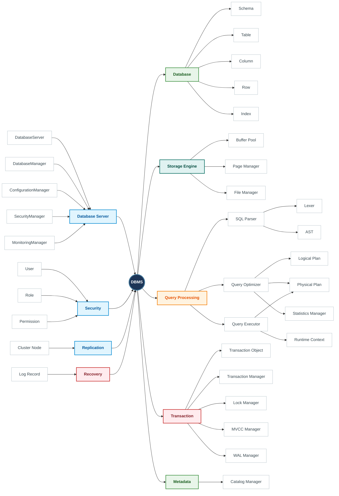
```mermaid
flowchart LR
    %% =====================================================
    %% NODE DECLARATIONS & STYLING (Declared exactly once)
    %% =====================================================
    DBMS((DBMS)):::rootStyle
    
    %% Left-side Branches
    Server["Database Server"]:::branchAdmin
    Security["Security"]:::branchAdmin
    Replication["Replication"]:::branchAdmin
    Recovery["Recovery"]:::branchTx
    
    DatabaseServer["DatabaseServer"]:::leafStyle
    DatabaseManager["DatabaseManager"]:::leafStyle
    ConfigurationManager["ConfigurationManager"]:::leafStyle
    SecurityManager["SecurityManager"]:::leafStyle
    MonitoringManager["MonitoringManager"]:::leafStyle
    
    User["User"]:::leafStyle
    Role["Role"]:::leafStyle
    Permission["Permission"]:::leafStyle
    ClusterNode["Cluster Node"]:::leafStyle
    LogRecord["Log Record"]:::leafStyle

    %% Right-side Branches
    Database["Database"]:::branchCatalog
    Storage["Storage Engine"]:::branchStorage
    Query["Query Processing"]:::branchQuery
    Transaction["Transaction"]:::branchTx
    Metadata["Metadata"]:::branchCatalog
    
    Schema["Schema"]:::leafStyle
    Table["Table"]:::leafStyle
    Column["Column"]:::leafStyle
    Row["Row"]:::leafStyle
    Index["Index"]:::leafStyle
    
    BufferPool["Buffer Pool"]:::leafStyle
    PageManager["Page Manager"]:::leafStyle
    FileManager["File Manager"]:::leafStyle
    
    SQLParser["SQL Parser"]:::leafStyle
    Lexer["Lexer"]:::leafStyle
    AST["AST"]:::leafStyle
    
    QueryOptimizer["Query Optimizer"]:::leafStyle
    LogicalPlan["Logical Plan"]:::leafStyle
    PhysicalPlan["Physical Plan"]:::leafStyle
    StatisticsManager["Statistics Manager"]:::leafStyle
    
    QueryExecutor["Query Executor"]:::leafStyle
    RuntimeContext["Runtime Context"]:::leafStyle
    
    TransactionObject["Transaction Object"]:::leafStyle
    TransactionManager["Transaction Manager"]:::leafStyle
    LockManager["Lock Manager"]:::leafStyle
    MVCCManager["MVCC Manager"]:::leafStyle
    WALManager["WAL Manager"]:::leafStyle
    
    CatalogManager["Catalog Manager"]:::leafStyle

    %% =====================================================
    %% CONNECTIONS (Simple Node IDs only)
    %% =====================================================
    
    %% Left Side Connections (pointing left-to-right into DBMS)
    Server --> DBMS
    Security --> DBMS
    Replication --> DBMS
    Recovery --> DBMS

    DatabaseServer --> Server
    DatabaseManager --> Server
    ConfigurationManager --> Server
    SecurityManager --> Server
    MonitoringManager --> Server

    User --> Security
    Role --> Security
    Permission --> Security

    ClusterNode --> Replication
    LogRecord --> Recovery

    %% Right Side Connections (pointing right)
    DBMS --> Database
    DBMS --> Storage
    DBMS --> Query
    DBMS --> Transaction
    DBMS --> Metadata

    Database --> Schema
    Database --> Table
    Database --> Column
    Database --> Row
    Database --> Index

    Storage --> BufferPool
    Storage --> PageManager
    Storage --> FileManager

    Query --> SQLParser
    SQLParser --> Lexer
    SQLParser --> AST

    Query --> QueryOptimizer
    QueryOptimizer --> LogicalPlan
    QueryOptimizer --> PhysicalPlan
    QueryOptimizer --> StatisticsManager

    Query --> QueryExecutor
    QueryExecutor --> RuntimeContext
    QueryExecutor --> PhysicalPlan

    Transaction --> TransactionObject
    Transaction --> TransactionManager
    Transaction --> LockManager
    Transaction --> MVCCManager
    Transaction --> WALManager

    Metadata --> CatalogManager

    %% =====================================================
    %% STYLING DEFINITIONS (HSL Colors)
    %% =====================================================
    classDef rootStyle fill:#1d3557,stroke:#457b9d,stroke-width:3px,color:#fff,font-weight:bold,font-size:16px;
    classDef branchAdmin fill:#e1f5fe,stroke:#0288d1,stroke-width:2px,color:#01579b,font-weight:bold;
    classDef branchQuery fill:#fff3e0,stroke:#f57c00,stroke-width:2px,color:#e65100,font-weight:bold;
    classDef branchCatalog fill:#e8f5e9,stroke:#388e3c,stroke-width:2px,color:#1b5e20,font-weight:bold;
    classDef branchStorage fill:#e0f2f1,stroke:#00695c,stroke-width:2px,color:#004d40,font-weight:bold;
    classDef branchTx fill:#ffebee,stroke:#c62828,stroke-width:2px,color:#842029,font-weight:bold;
    classDef leafStyle fill:#ffffff,stroke:#b0bec5,stroke-width:1px,color:#37474f;
```

---
# Overview Class Diagram

```mermaid
classDiagram
direction TB

class DatabaseServer{
    +serverId
    +version
    +status
    +start()
    +stop()
    +restart()
}

class DatabaseManager{
    +createDatabase()
    +dropDatabase()
    +getDatabase()
    +listDatabases()
}

class Database{
    +databaseId
    +name
    +owner
    +open()
    +close()
}

class Schema{
    +schemaId
    +name
    +createTable()
    +dropTable()
}

class Table{
    +tableId
    +name
    +insert()
    +update()
    +delete()
}

class Column{
    +columnId
    +name
    +dataType
    +nullable
}

class Row{
    +rowId
    +values
    +version
}

class DataType{
    <<enumeration>>
}

class Constraint{
    <<abstract>>
    +validate()
}

class PrimaryKey{
    +columns
}

class ForeignKey{
    +referenceTable
}

class UniqueConstraint

class CheckConstraint

class Index{
    <<abstract>>
    +search()
    +insertKey()
    +deleteKey()
}

class BTreeIndex

class HashIndex

class BitmapIndex

class Partition{
    +partitionKey
}

class View{
    +queryDefinition
}

class StoredProcedure{
    +execute()
}

class Trigger{
    +fire()
}

class Sequence{
    +nextValue()
}

class Transaction{
    +transactionId
    +begin()
    +commit()
    +rollback()
}

class TransactionManager{
    +beginTransaction()
    +commit()
    +rollback()
}

class LockManager{
    +acquireLock()
    +releaseLock()
}

class MVCCManager{
    +createVersion()
    +garbageCollect()
}

class BufferPool{
    +pinPage()
    +flushPage()
}

class Page{
    +pageId
}

class StorageEngine{
    +readPage()
    +writePage()
}

class FileManager{
    +read()
    +write()
}

class WALManager{
    +appendLog()
    +flush()
}

class RecoveryManager{
    +recover()
}

class CatalogManager{
    +registerTable()
    +findTable()
}

class SQLParser{
    +parse()
}

class Lexer{
    +tokenize()
}

class AST{
    +root
}

class QueryOptimizer{
    +optimize()
}

class LogicalPlan{
    +operators
}

class PhysicalPlan{
    +operators
}

class QueryExecutor{
    +execute()
}

class StatisticsManager{
    +collect()
}

class SecurityManager{
    +authenticate()
    +authorize()
}

class User

class Role

class Permission

DatabaseServer --> DatabaseManager
DatabaseServer --> TransactionManager
DatabaseServer --> StorageEngine
DatabaseServer --> CatalogManager
DatabaseServer --> SecurityManager

DatabaseManager --> Database
Database --> Schema
Schema --> Table
Schema --> View
Schema --> StoredProcedure
Schema --> Sequence

Table --> Column
Table --> Row
Table --> Index
Table --> Constraint
Table --> Partition
Table --> Trigger

Constraint <|-- PrimaryKey
Constraint <|-- ForeignKey
Constraint <|-- UniqueConstraint
Constraint <|-- CheckConstraint

Index <|-- BTreeIndex
Index <|-- HashIndex
Index <|-- BitmapIndex

Column --> DataType
ForeignKey --> Table

TransactionManager --> Transaction
TransactionManager --> LockManager
TransactionManager --> MVCCManager
TransactionManager --> WALManager

StorageEngine --> BufferPool
StorageEngine --> FileManager
BufferPool --> Page

RecoveryManager --> WALManager

CatalogManager --> Table
CatalogManager --> Index
CatalogManager --> Schema

SQLParser --> Lexer
SQLParser --> AST
AST --> LogicalPlan
QueryOptimizer --> LogicalPlan
QueryOptimizer --> PhysicalPlan
QueryExecutor --> PhysicalPlan
QueryExecutor --> Transaction

StatisticsManager --> Table
QueryOptimizer --> StatisticsManager

SecurityManager --> User
SecurityManager --> Role
Role --> Permission

%% =====================================================
%% STYLING DEFINITIONS (Color-coded by Domain Group)
%% =====================================================
%% Server & Security (Blue)
style DatabaseServer fill:#e3f2fd,stroke:#1565c0,stroke-width:2px,color:#084298
style DatabaseManager fill:#e3f2fd,stroke:#1565c0,stroke-width:2px,color:#084298
style SecurityManager fill:#e3f2fd,stroke:#1565c0,stroke-width:2px,color:#084298
style User fill:#e3f2fd,stroke:#1565c0,stroke-width:2px,color:#084298
style Role fill:#e3f2fd,stroke:#1565c0,stroke-width:2px,color:#084298
style Permission fill:#e3f2fd,stroke:#1565c0,stroke-width:2px,color:#084298

%% Catalog & Database Objects (Green)
style Database fill:#e8f5e9,stroke:#2e7d32,stroke-width:2px,color:#0f5132
style Schema fill:#e8f5e9,stroke:#2e7d32,stroke-width:2px,color:#0f5132
style Table fill:#e8f5e9,stroke:#2e7d32,stroke-width:2px,color:#0f5132
style Column fill:#e8f5e9,stroke:#2e7d32,stroke-width:2px,color:#0f5132
style Row fill:#e8f5e9,stroke:#2e7d32,stroke-width:2px,color:#0f5132
style DataType fill:#e8f5e9,stroke:#2e7d32,stroke-width:2px,color:#0f5132
style Constraint fill:#e8f5e9,stroke:#2e7d32,stroke-width:2px,color:#0f5132
style PrimaryKey fill:#e8f5e9,stroke:#2e7d32,stroke-width:2px,color:#0f5132
style ForeignKey fill:#e8f5e9,stroke:#2e7d32,stroke-width:2px,color:#0f5132
style UniqueConstraint fill:#e8f5e9,stroke:#2e7d32,stroke-width:2px,color:#0f5132
style CheckConstraint fill:#e8f5e9,stroke:#2e7d32,stroke-width:2px,color:#0f5132
style Index fill:#e8f5e9,stroke:#2e7d32,stroke-width:2px,color:#0f5132
style BTreeIndex fill:#e8f5e9,stroke:#2e7d32,stroke-width:2px,color:#0f5132
style HashIndex fill:#e8f5e9,stroke:#2e7d32,stroke-width:2px,color:#0f5132
style BitmapIndex fill:#e8f5e9,stroke:#2e7d32,stroke-width:2px,color:#0f5132
style Partition fill:#e8f5e9,stroke:#2e7d32,stroke-width:2px,color:#0f5132
style View fill:#e8f5e9,stroke:#2e7d32,stroke-width:2px,color:#0f5132
style StoredProcedure fill:#e8f5e9,stroke:#2e7d32,stroke-width:2px,color:#0f5132
style Trigger fill:#e8f5e9,stroke:#2e7d32,stroke-width:2px,color:#0f5132
style Sequence fill:#e8f5e9,stroke:#2e7d32,stroke-width:2px,color:#0f5132
style CatalogManager fill:#e8f5e9,stroke:#2e7d32,stroke-width:2px,color:#0f5132

%% Query Engine (Yellow/Orange)
style SQLParser fill:#fff8e1,stroke:#ff8f00,stroke-width:2px,color:#664d03
style Lexer fill:#fff8e1,stroke:#ff8f00,stroke-width:2px,color:#664d03
style AST fill:#fff8e1,stroke:#ff8f00,stroke-width:2px,color:#664d03
style QueryOptimizer fill:#fff8e1,stroke:#ff8f00,stroke-width:2px,color:#664d03
style LogicalPlan fill:#fff8e1,stroke:#ff8f00,stroke-width:2px,color:#664d03
style PhysicalPlan fill:#fff8e1,stroke:#ff8f00,stroke-width:2px,color:#664d03
style QueryExecutor fill:#fff8e1,stroke:#ff8f00,stroke-width:2px,color:#664d03
style StatisticsManager fill:#fff8e1,stroke:#ff8f00,stroke-width:2px,color:#664d03

%% Storage Engine (Teal)
style StorageEngine fill:#e0f2f1,stroke:#00695c,stroke-width:2px,color:#004d40
style BufferPool fill:#e0f2f1,stroke:#00695c,stroke-width:2px,color:#004d40
style Page fill:#e0f2f1,stroke:#00695c,stroke-width:2px,color:#004d40
style FileManager fill:#e0f2f1,stroke:#00695c,stroke-width:2px,color:#004d40

%% Transaction & Recovery (Red/Coral)
style Transaction fill:#ffebee,stroke:#c62828,stroke-width:2px,color:#842029
style TransactionManager fill:#ffebee,stroke:#c62828,stroke-width:2px,color:#842029
style LockManager fill:#ffebee,stroke:#c62828,stroke-width:2px,color:#842029
style MVCCManager fill:#ffebee,stroke:#c62828,stroke-width:2px,color:#842029
style WALManager fill:#ffebee,stroke:#c62828,stroke-width:2px,color:#842029
style RecoveryManager fill:#ffebee,stroke:#c62828,stroke-width:2px,color:#842029
```

--- 

# Database Server Module
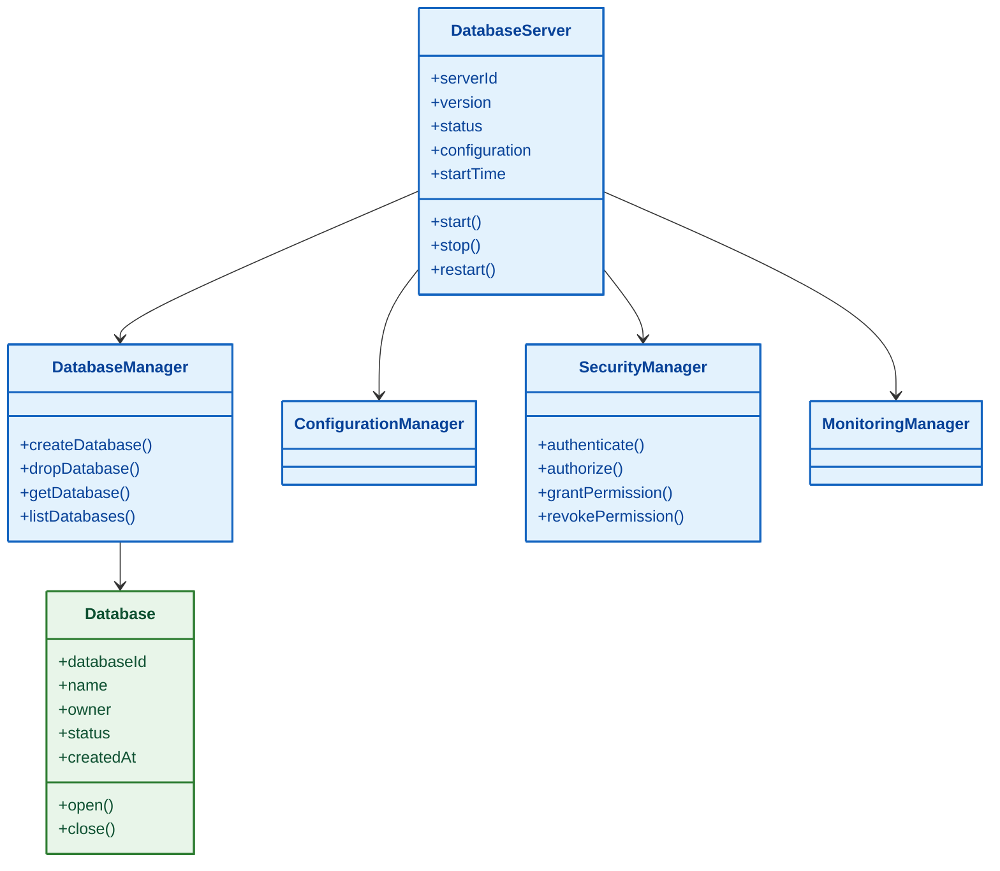
```mermaid
classDiagram
direction TB

class DatabaseServer{
    +serverId
    +version
    +status
    +configuration
    +startTime

    +start()
    +stop()
    +restart()
}

class DatabaseManager{
    +createDatabase()
    +dropDatabase()
    +getDatabase()
    +listDatabases()
}

class ConfigurationManager

class SecurityManager{
    +authenticate()
    +authorize()
    +grantPermission()
    +revokePermission()
}

class MonitoringManager

class Database{
    +databaseId
    +name
    +owner
    +status
    +createdAt

    +open()
    +close()
}

DatabaseServer --> DatabaseManager
DatabaseServer --> ConfigurationManager
DatabaseServer --> SecurityManager
DatabaseServer --> MonitoringManager

DatabaseManager --> Database

%% =====================================================
%% STYLING DEFINITIONS
%% =====================================================
style DatabaseServer fill:#e3f2fd,stroke:#1565c0,stroke-width:2px,color:#084298
style DatabaseManager fill:#e3f2fd,stroke:#1565c0,stroke-width:2px,color:#084298
style ConfigurationManager fill:#e3f2fd,stroke:#1565c0,stroke-width:2px,color:#084298
style SecurityManager fill:#e3f2fd,stroke:#1565c0,stroke-width:2px,color:#084298
style MonitoringManager fill:#e3f2fd,stroke:#1565c0,stroke-width:2px,color:#084298
style Database fill:#e8f5e9,stroke:#2e7d32,stroke-width:2px,color:#0f5132
```
--- 

# Database Server Test
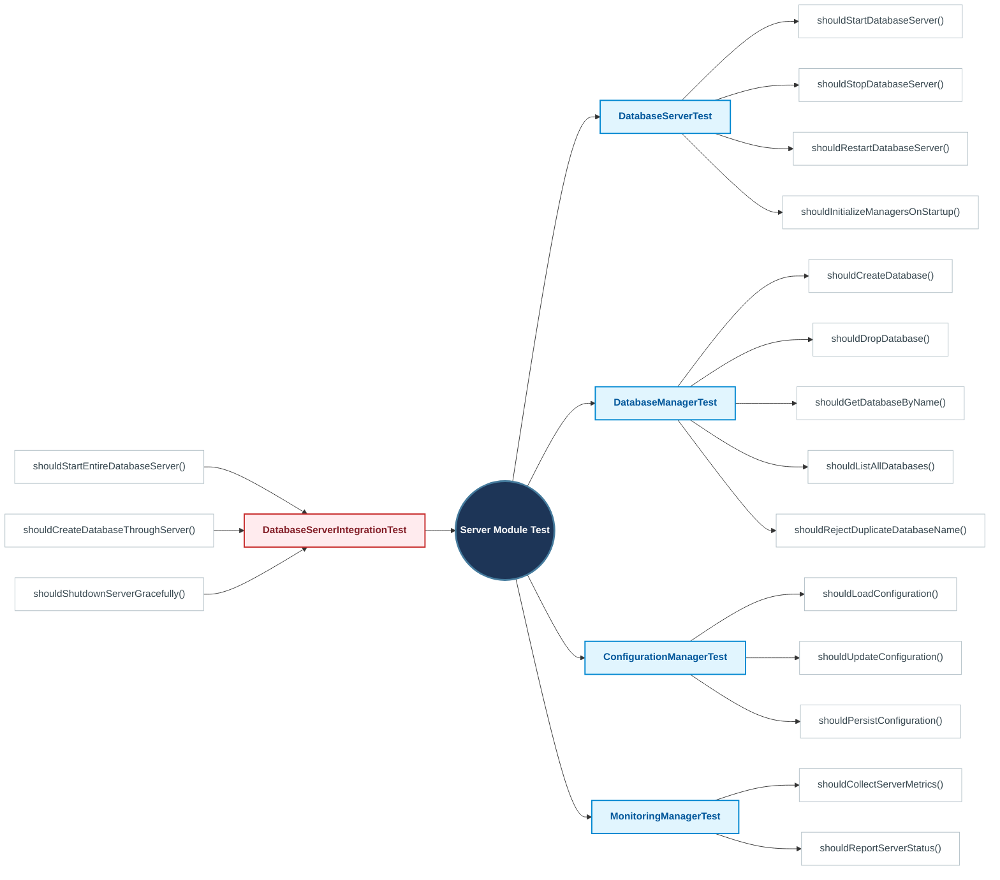
```mermaid
flowchart LR

    %% =====================================================
    %% Root
    %% =====================================================

    ROOT((Server Module Test)):::rootStyle

    %% =====================================================
    %% Integration Tests
    %% =====================================================

    SERVERINT["DatabaseServerIntegrationTest"]:::branchTx

    sit1["shouldStartEntireDatabaseServer()"]:::leafStyle
    sit2["shouldCreateDatabaseThroughServer()"]:::leafStyle
    sit3["shouldShutdownServerGracefully()"]:::leafStyle

    sit1 --> SERVERINT
    sit2 --> SERVERINT
    sit3 --> SERVERINT

    SERVERINT --> ROOT

    %% =====================================================
    %% Unit Tests
    %% =====================================================

    DBSERVER["DatabaseServerTest"]:::branchAdmin
    DBMANAGER["DatabaseManagerTest"]:::branchAdmin
    CONFIG["ConfigurationManagerTest"]:::branchAdmin
    MONITOR["MonitoringManagerTest"]:::branchAdmin

    ROOT --> DBSERVER
    ROOT --> DBMANAGER
    ROOT --> CONFIG
    ROOT --> MONITOR

    %% =====================================================
    %% DatabaseServerTest
    %% =====================================================

    ds1["shouldStartDatabaseServer()"]:::leafStyle
    ds2["shouldStopDatabaseServer()"]:::leafStyle
    ds3["shouldRestartDatabaseServer()"]:::leafStyle
    ds4["shouldInitializeManagersOnStartup()"]:::leafStyle

    DBSERVER --> ds1
    DBSERVER --> ds2
    DBSERVER --> ds3
    DBSERVER --> ds4

    %% =====================================================
    %% DatabaseManagerTest
    %% =====================================================

    dm1["shouldCreateDatabase()"]:::leafStyle
    dm2["shouldDropDatabase()"]:::leafStyle
    dm3["shouldGetDatabaseByName()"]:::leafStyle
    dm4["shouldListAllDatabases()"]:::leafStyle
    dm5["shouldRejectDuplicateDatabaseName()"]:::leafStyle

    DBMANAGER --> dm1
    DBMANAGER --> dm2
    DBMANAGER --> dm3
    DBMANAGER --> dm4
    DBMANAGER --> dm5

    %% =====================================================
    %% ConfigurationManagerTest
    %% =====================================================

    cf1["shouldLoadConfiguration()"]:::leafStyle
    cf2["shouldUpdateConfiguration()"]:::leafStyle
    cf3["shouldPersistConfiguration()"]:::leafStyle

    CONFIG --> cf1
    CONFIG --> cf2
    CONFIG --> cf3

    %% =====================================================
    %% MonitoringManagerTest
    %% =====================================================

    mn1["shouldCollectServerMetrics()"]:::leafStyle
    mn2["shouldReportServerStatus()"]:::leafStyle

    MONITOR --> mn1
    MONITOR --> mn2

    %% =====================================================
    %% Styling
    %% =====================================================

    classDef rootStyle fill:#1d3557,stroke:#457b9d,stroke-width:3px,color:#fff,font-weight:bold,font-size:16px;
    classDef branchAdmin fill:#e1f5fe,stroke:#0288d1,stroke-width:2px,color:#01579b,font-weight:bold;
    classDef branchTx fill:#ffebee,stroke:#c62828,stroke-width:2px,color:#842029,font-weight:bold;
    classDef leafStyle fill:#ffffff,stroke:#b0bec5,stroke-width:1px,color:#37474f;
```
---

# Database Objects Module

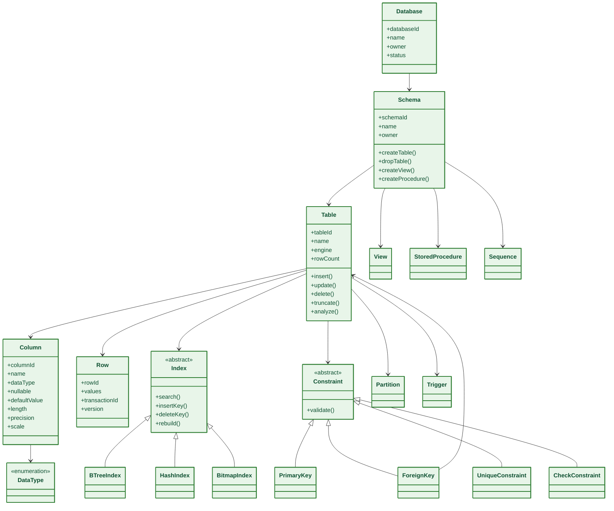
```mermaid
classDiagram
direction TB

class Database{
    +databaseId
    +name
    +owner
    +status
}

class Schema{
    +schemaId
    +name
    +owner

    +createTable()
    +dropTable()
    +createView()
    +createProcedure()
}

class Table{
    +tableId
    +name
    +engine
    +rowCount

    +insert()
    +update()
    +delete()
    +truncate()
    +analyze()
}

class Column{
    +columnId
    +name
    +dataType
    +nullable
    +defaultValue
    +length
    +precision
    +scale
}

class Row{
    +rowId
    +values
    +transactionId
    +version
}

class DataType{
    <<enumeration>>
}

class Constraint{
    <<abstract>>
    +validate()
}

class PrimaryKey
class ForeignKey
class UniqueConstraint
class CheckConstraint

class Index{
    <<abstract>>
    +search()
    +insertKey()
    +deleteKey()
    +rebuild()
}

class BTreeIndex
class HashIndex
class BitmapIndex

class Partition
class View
class StoredProcedure
class Trigger
class Sequence

Database --> Schema

Schema --> Table
Schema --> View
Schema --> StoredProcedure
Schema --> Sequence

Table --> Column
Table --> Row
Table --> Index
Table --> Constraint
Table --> Partition
Table --> Trigger

Column --> DataType

Constraint <|-- PrimaryKey
Constraint <|-- ForeignKey
Constraint <|-- UniqueConstraint
Constraint <|-- CheckConstraint

Index <|-- BTreeIndex
Index <|-- HashIndex
Index <|-- BitmapIndex

ForeignKey --> Table

%% =====================================================
%% STYLING DEFINITIONS
%% =====================================================
style Database fill:#e8f5e9,stroke:#2e7d32,stroke-width:2px,color:#0f5132
style Schema fill:#e8f5e9,stroke:#2e7d32,stroke-width:2px,color:#0f5132
style Table fill:#e8f5e9,stroke:#2e7d32,stroke-width:2px,color:#0f5132
style Column fill:#e8f5e9,stroke:#2e7d32,stroke-width:2px,color:#0f5132
style Row fill:#e8f5e9,stroke:#2e7d32,stroke-width:2px,color:#0f5132
style DataType fill:#e8f5e9,stroke:#2e7d32,stroke-width:2px,color:#0f5132
style Constraint fill:#e8f5e9,stroke:#2e7d32,stroke-width:2px,color:#0f5132
style PrimaryKey fill:#e8f5e9,stroke:#2e7d32,stroke-width:2px,color:#0f5132
style ForeignKey fill:#e8f5e9,stroke:#2e7d32,stroke-width:2px,color:#0f5132
style UniqueConstraint fill:#e8f5e9,stroke:#2e7d32,stroke-width:2px,color:#0f5132
style CheckConstraint fill:#e8f5e9,stroke:#2e7d32,stroke-width:2px,color:#0f5132
style Index fill:#e8f5e9,stroke:#2e7d32,stroke-width:2px,color:#0f5132
style BTreeIndex fill:#e8f5e9,stroke:#2e7d32,stroke-width:2px,color:#0f5132
style HashIndex fill:#e8f5e9,stroke:#2e7d32,stroke-width:2px,color:#0f5132
style BitmapIndex fill:#e8f5e9,stroke:#2e7d32,stroke-width:2px,color:#0f5132
style Partition fill:#e8f5e9,stroke:#2e7d32,stroke-width:2px,color:#0f5132
style View fill:#e8f5e9,stroke:#2e7d32,stroke-width:2px,color:#0f5132
style StoredProcedure fill:#e8f5e9,stroke:#2e7d32,stroke-width:2px,color:#0f5132
style Trigger fill:#e8f5e9,stroke:#2e7d32,stroke-width:2px,color:#0f5132
style Sequence fill:#e8f5e9,stroke:#2e7d32,stroke-width:2px,color:#0f5132
```
---

# Database Objects Test
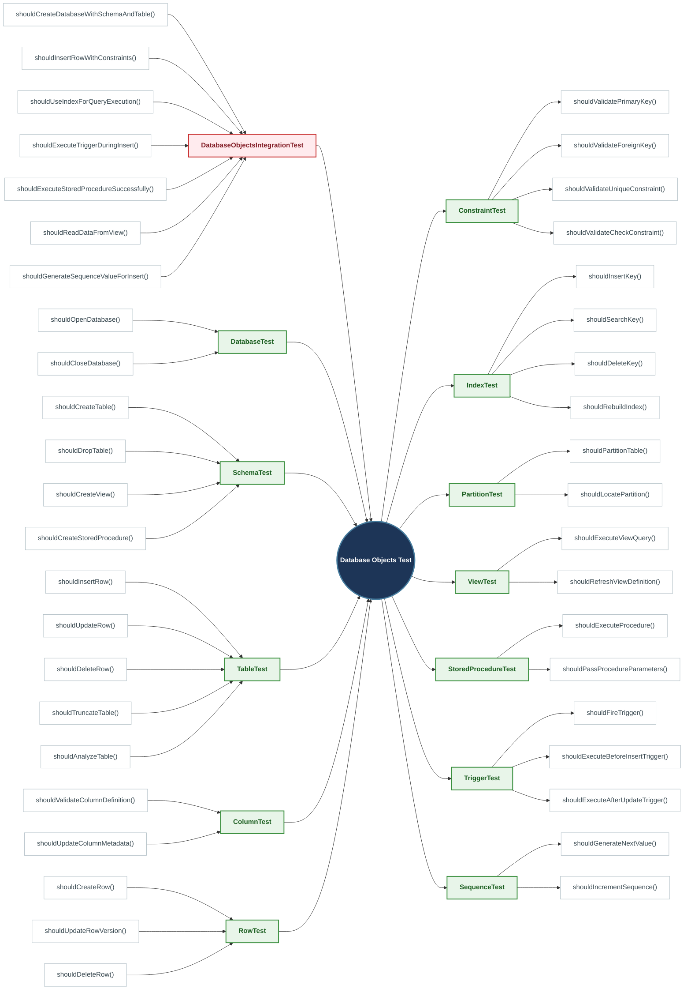
```mermaid
flowchart LR

    %% =====================================================
    %% Root
    %% =====================================================

    ROOT((Database Objects Test)):::rootStyle

    %% =====================================================
    %% Left Side: Integration Tests (pointing into ROOT)
    %% =====================================================

    DBINT["DatabaseObjectsIntegrationTest"]:::branchTx

    it1["shouldCreateDatabaseWithSchemaAndTable()"]:::leafStyle
    it2["shouldInsertRowWithConstraints()"]:::leafStyle
    it3["shouldUseIndexForQueryExecution()"]:::leafStyle
    it4["shouldExecuteTriggerDuringInsert()"]:::leafStyle
    it5["shouldExecuteStoredProcedureSuccessfully()"]:::leafStyle
    it6["shouldReadDataFromView()"]:::leafStyle
    it7["shouldGenerateSequenceValueForInsert()"]:::leafStyle

    it1 --> DBINT
    it2 --> DBINT
    it3 --> DBINT
    it4 --> DBINT
    it5 --> DBINT
    it6 --> DBINT
    it7 --> DBINT

    DBINT --> ROOT

    %% =====================================================
    %% Left Side: Unit Tests (pointing into ROOT)
    %% =====================================================

    DATABASE["DatabaseTest"]:::branchCatalog
    SCHEMA["SchemaTest"]:::branchCatalog
    TABLE["TableTest"]:::branchCatalog
    COLUMN["ColumnTest"]:::branchCatalog
    ROW["RowTest"]:::branchCatalog

    DATABASE --> ROOT
    SCHEMA --> ROOT
    TABLE --> ROOT
    COLUMN --> ROOT
    ROW --> ROOT

    %% DatabaseTest methods (Left Side)
    db1["shouldOpenDatabase()"]:::leafStyle
    db2["shouldCloseDatabase()"]:::leafStyle

    db1 --> DATABASE
    db2 --> DATABASE

    %% SchemaTest methods (Left Side)
    sc1["shouldCreateTable()"]:::leafStyle
    sc2["shouldDropTable()"]:::leafStyle
    sc3["shouldCreateView()"]:::leafStyle
    sc4["shouldCreateStoredProcedure()"]:::leafStyle

    sc1 --> SCHEMA
    sc2 --> SCHEMA
    sc3 --> SCHEMA
    sc4 --> SCHEMA

    %% TableTest methods (Left Side)
    tb1["shouldInsertRow()"]:::leafStyle
    tb2["shouldUpdateRow()"]:::leafStyle
    tb3["shouldDeleteRow()"]:::leafStyle
    tb4["shouldTruncateTable()"]:::leafStyle
    tb5["shouldAnalyzeTable()"]:::leafStyle

    tb1 --> TABLE
    tb2 --> TABLE
    tb3 --> TABLE
    tb4 --> TABLE
    tb5 --> TABLE

    %% ColumnTest methods (Left Side)
    col1["shouldValidateColumnDefinition()"]:::leafStyle
    col2["shouldUpdateColumnMetadata()"]:::leafStyle

    col1 --> COLUMN
    col2 --> COLUMN

    %% RowTest methods (Left Side)
    row1["shouldCreateRow()"]:::leafStyle
    row2["shouldUpdateRowVersion()"]:::leafStyle
    row3["shouldDeleteRow()"]:::leafStyle

    row1 --> ROW
    row2 --> ROW
    row3 --> ROW


    %% =====================================================
    %% Right Side: Unit Tests (pointing from ROOT)
    %% =====================================================

    CONSTRAINT["ConstraintTest"]:::branchCatalog
    INDEX["IndexTest"]:::branchCatalog
    PARTITION["PartitionTest"]:::branchCatalog
    VIEW["ViewTest"]:::branchCatalog
    PROCEDURE["StoredProcedureTest"]:::branchCatalog
    TRIGGER["TriggerTest"]:::branchCatalog
    SEQUENCE["SequenceTest"]:::branchCatalog

    ROOT --> CONSTRAINT
    ROOT --> INDEX
    ROOT --> PARTITION
    ROOT --> VIEW
    ROOT --> PROCEDURE
    ROOT --> TRIGGER
    ROOT --> SEQUENCE

    %% ConstraintTest methods (Right Side)
    ct1["shouldValidatePrimaryKey()"]:::leafStyle
    ct2["shouldValidateForeignKey()"]:::leafStyle
    ct3["shouldValidateUniqueConstraint()"]:::leafStyle
    ct4["shouldValidateCheckConstraint()"]:::leafStyle

    CONSTRAINT --> ct1
    CONSTRAINT --> ct2
    CONSTRAINT --> ct3
    CONSTRAINT --> ct4

    %% IndexTest methods (Right Side)
    idx1["shouldInsertKey()"]:::leafStyle
    idx2["shouldSearchKey()"]:::leafStyle
    idx3["shouldDeleteKey()"]:::leafStyle
    idx4["shouldRebuildIndex()"]:::leafStyle

    INDEX --> idx1
    INDEX --> idx2
    INDEX --> idx3
    INDEX --> idx4

    %% PartitionTest methods (Right Side)
    pt1["shouldPartitionTable()"]:::leafStyle
    pt2["shouldLocatePartition()"]:::leafStyle

    PARTITION --> pt1
    PARTITION --> pt2

    %% ViewTest methods (Right Side)
    vw1["shouldExecuteViewQuery()"]:::leafStyle
    vw2["shouldRefreshViewDefinition()"]:::leafStyle

    VIEW --> vw1
    VIEW --> vw2

    %% StoredProcedureTest methods (Right Side)
    sp1["shouldExecuteProcedure()"]:::leafStyle
    sp2["shouldPassProcedureParameters()"]:::leafStyle

    PROCEDURE --> sp1
    PROCEDURE --> sp2

    %% TriggerTest methods (Right Side)
    tg1["shouldFireTrigger()"]:::leafStyle
    tg2["shouldExecuteBeforeInsertTrigger()"]:::leafStyle
    tg3["shouldExecuteAfterUpdateTrigger()"]:::leafStyle

    TRIGGER --> tg1
    TRIGGER --> tg2
    TRIGGER --> tg3

    %% SequenceTest methods (Right Side)
    sq1["shouldGenerateNextValue()"]:::leafStyle
    sq2["shouldIncrementSequence()"]:::leafStyle

    SEQUENCE --> sq1
    SEQUENCE --> sq2

    %% =====================================================
    %% Styling
    %% =====================================================

    classDef rootStyle fill:#1d3557,stroke:#457b9d,stroke-width:3px,color:#fff,font-weight:bold,font-size:16px;
    classDef branchCatalog fill:#e8f5e9,stroke:#388e3c,stroke-width:2px,color:#1b5e20,font-weight:bold;
    classDef branchTx fill:#ffebee,stroke:#c62828,stroke-width:2px,color:#842029,font-weight:bold;
    classDef leafStyle fill:#ffffff,stroke:#b0bec5,stroke-width:1px,color:#37474f;
```
---
# Storage Engine Module

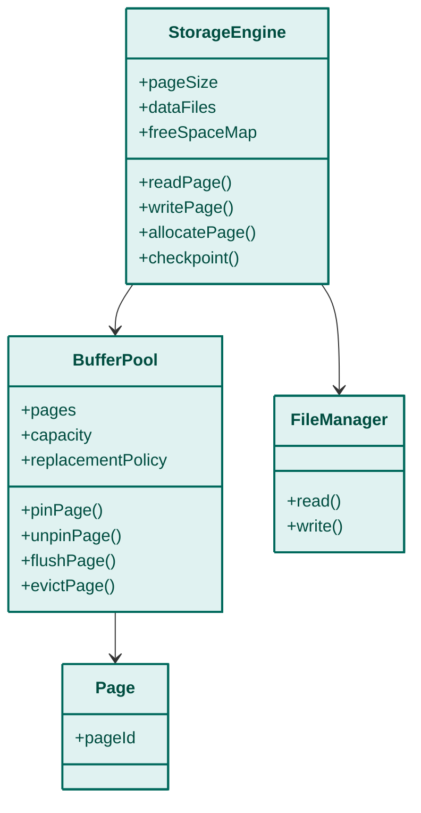
```mermaid
classDiagram
direction TB

class StorageEngine{
    +pageSize
    +dataFiles
    +freeSpaceMap

    +readPage()
    +writePage()
    +allocatePage()
    +checkpoint()
}

class BufferPool{
    +pages
    +capacity
    +replacementPolicy

    +pinPage()
    +unpinPage()
    +flushPage()
    +evictPage()
}

class Page{
    +pageId
}

class FileManager{
    +read()
    +write()
}

StorageEngine --> BufferPool
StorageEngine --> FileManager

BufferPool --> Page

%% =====================================================
%% STYLING DEFINITIONS
%% =====================================================
style StorageEngine fill:#e0f2f1,stroke:#00695c,stroke-width:2px,color:#004d40
style BufferPool fill:#e0f2f1,stroke:#00695c,stroke-width:2px,color:#004d40
style Page fill:#e0f2f1,stroke:#00695c,stroke-width:2px,color:#004d40
style FileManager fill:#e0f2f1,stroke:#00695c,stroke-width:2px,color:#004d40
```
--- 

# Storage Engine Test

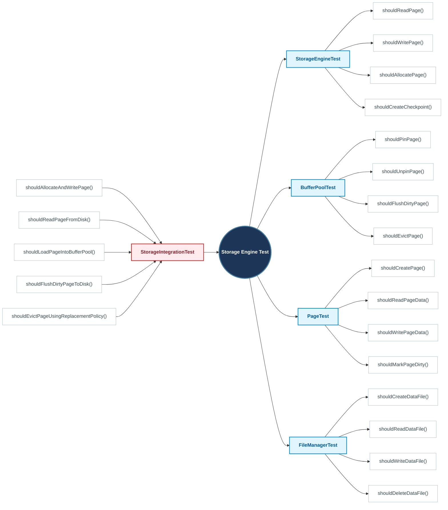
```mermaid
flowchart LR

    %% =====================================================
    %% Root
    %% =====================================================

    ROOT((Storage Engine Test)):::rootStyle

    %% =====================================================
    %% Integration Tests
    %% =====================================================

    STORAGEINT["StorageIntegrationTest"]:::branchTx

    it1["shouldAllocateAndWritePage()"]:::leafStyle
    it2["shouldReadPageFromDisk()"]:::leafStyle
    it3["shouldLoadPageIntoBufferPool()"]:::leafStyle
    it4["shouldFlushDirtyPageToDisk()"]:::leafStyle
    it5["shouldEvictPageUsingReplacementPolicy()"]:::leafStyle

    it1 --> STORAGEINT
    it2 --> STORAGEINT
    it3 --> STORAGEINT
    it4 --> STORAGEINT
    it5 --> STORAGEINT

    STORAGEINT --> ROOT

    %% =====================================================
    %% Unit Tests
    %% =====================================================

    STORAGE["StorageEngineTest"]:::branchAdmin
    BUFFER["BufferPoolTest"]:::branchAdmin
    PAGE["PageTest"]:::branchAdmin
    FILE["FileManagerTest"]:::branchAdmin

    ROOT --> STORAGE
    ROOT --> BUFFER
    ROOT --> PAGE
    ROOT --> FILE

    %% =====================================================
    %% StorageEngineTest
    %% =====================================================

    se1["shouldReadPage()"]:::leafStyle
    se2["shouldWritePage()"]:::leafStyle
    se3["shouldAllocatePage()"]:::leafStyle
    se4["shouldCreateCheckpoint()"]:::leafStyle

    STORAGE --> se1
    STORAGE --> se2
    STORAGE --> se3
    STORAGE --> se4

    %% =====================================================
    %% BufferPoolTest
    %% =====================================================

    bp1["shouldPinPage()"]:::leafStyle
    bp2["shouldUnpinPage()"]:::leafStyle
    bp3["shouldFlushDirtyPage()"]:::leafStyle
    bp4["shouldEvictPage()"]:::leafStyle

    BUFFER --> bp1
    BUFFER --> bp2
    BUFFER --> bp3
    BUFFER --> bp4

    %% =====================================================
    %% PageTest
    %% =====================================================

    pg1["shouldCreatePage()"]:::leafStyle
    pg2["shouldReadPageData()"]:::leafStyle
    pg3["shouldWritePageData()"]:::leafStyle
    pg4["shouldMarkPageDirty()"]:::leafStyle

    PAGE --> pg1
    PAGE --> pg2
    PAGE --> pg3
    PAGE --> pg4

    %% =====================================================
    %% FileManagerTest
    %% =====================================================

    fm1["shouldCreateDataFile()"]:::leafStyle
    fm2["shouldReadDataFile()"]:::leafStyle
    fm3["shouldWriteDataFile()"]:::leafStyle
    fm4["shouldDeleteDataFile()"]:::leafStyle

    FILE --> fm1
    FILE --> fm2
    FILE --> fm3
    FILE --> fm4

    %% =====================================================
    %% Styles
    %% =====================================================

    classDef rootStyle fill:#1d3557,stroke:#457b9d,stroke-width:3px,color:#fff,font-weight:bold,font-size:16px;
    classDef branchAdmin fill:#e1f5fe,stroke:#0288d1,stroke-width:2px,color:#01579b,font-weight:bold;
    classDef branchTx fill:#ffebee,stroke:#c62828,stroke-width:2px,color:#842029,font-weight:bold;
    classDef leafStyle fill:#ffffff,stroke:#b0bec5,stroke-width:1px,color:#37474f;
```
---

# Query Processing Module

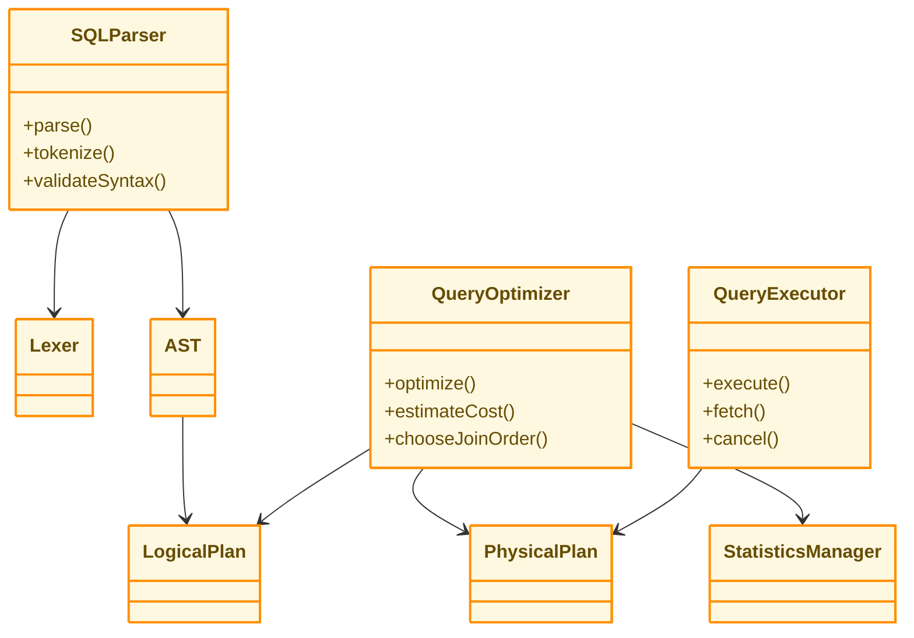
```mermaid
classDiagram
direction TB

class SQLParser{
    +parse()
    +tokenize()
    +validateSyntax()
}

class Lexer

class AST

class QueryOptimizer{
    +optimize()
    +estimateCost()
    +chooseJoinOrder()
}

class LogicalPlan

class PhysicalPlan

class StatisticsManager

class QueryExecutor{
    +execute()
    +fetch()
    +cancel()
}

SQLParser --> Lexer
SQLParser --> AST

AST --> LogicalPlan

QueryOptimizer --> LogicalPlan
QueryOptimizer --> PhysicalPlan
QueryOptimizer --> StatisticsManager

QueryExecutor --> PhysicalPlan

%% =====================================================
%% STYLING DEFINITIONS
%% =====================================================
style SQLParser fill:#fff8e1,stroke:#ff8f00,stroke-width:2px,color:#664d03
style Lexer fill:#fff8e1,stroke:#ff8f00,stroke-width:2px,color:#664d03
style AST fill:#fff8e1,stroke:#ff8f00,stroke-width:2px,color:#664d03
style QueryOptimizer fill:#fff8e1,stroke:#ff8f00,stroke-width:2px,color:#664d03
style LogicalPlan fill:#fff8e1,stroke:#ff8f00,stroke-width:2px,color:#664d03
style PhysicalPlan fill:#fff8e1,stroke:#ff8f00,stroke-width:2px,color:#664d03
style StatisticsManager fill:#fff8e1,stroke:#ff8f00,stroke-width:2px,color:#664d03
style QueryExecutor fill:#fff8e1,stroke:#ff8f00,stroke-width:2px,color:#664d03
```
---

# Query Processing Test 

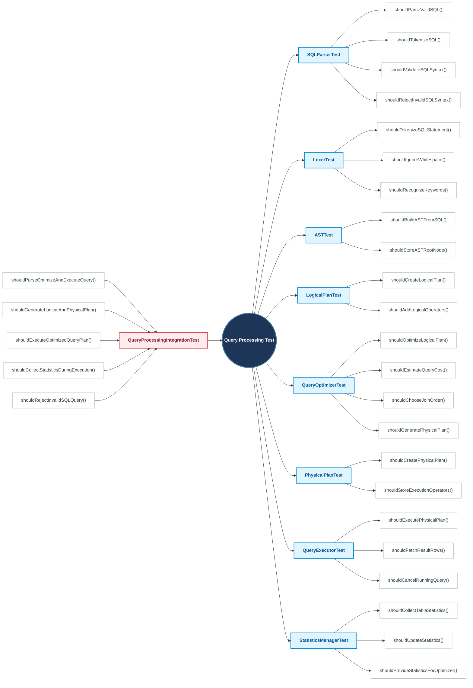
```mermaid
flowchart LR

    %% =====================================================
    %% Root
    %% =====================================================

    ROOT((Query Processing Test)):::rootStyle

    %% =====================================================
    %% Integration Tests
    %% =====================================================

    QUERYINT["QueryProcessingIntegrationTest"]:::branchTx

    it1["shouldParseOptimizeAndExecuteQuery()"]:::leafStyle
    it2["shouldGenerateLogicalAndPhysicalPlan()"]:::leafStyle
    it3["shouldExecuteOptimizedQueryPlan()"]:::leafStyle
    it4["shouldCollectStatisticsDuringExecution()"]:::leafStyle
    it5["shouldRejectInvalidSQLQuery()"]:::leafStyle

    it1 --> QUERYINT
    it2 --> QUERYINT
    it3 --> QUERYINT
    it4 --> QUERYINT
    it5 --> QUERYINT

    QUERYINT --> ROOT

    %% =====================================================
    %% Unit Tests
    %% =====================================================

    SQLPARSER["SQLParserTest"]:::branchAdmin
    LEXER["LexerTest"]:::branchAdmin
    AST["ASTTest"]:::branchAdmin
    LOGICAL["LogicalPlanTest"]:::branchAdmin
    OPTIMIZER["QueryOptimizerTest"]:::branchAdmin
    PHYSICAL["PhysicalPlanTest"]:::branchAdmin
    EXECUTOR["QueryExecutorTest"]:::branchAdmin
    STATS["StatisticsManagerTest"]:::branchAdmin

    ROOT --> SQLPARSER
    ROOT --> LEXER
    ROOT --> AST
    ROOT --> LOGICAL
    ROOT --> OPTIMIZER
    ROOT --> PHYSICAL
    ROOT --> EXECUTOR
    ROOT --> STATS

    %% =====================================================
    %% SQLParserTest
    %% =====================================================

    sp1["shouldParseValidSQL()"]:::leafStyle
    sp2["shouldTokenizeSQL()"]:::leafStyle
    sp3["shouldValidateSQLSyntax()"]:::leafStyle
    sp4["shouldRejectInvalidSQLSyntax()"]:::leafStyle

    SQLPARSER --> sp1
    SQLPARSER --> sp2
    SQLPARSER --> sp3
    SQLPARSER --> sp4

    %% =====================================================
    %% LexerTest
    %% =====================================================

    lx1["shouldTokenizeSQLStatement()"]:::leafStyle
    lx2["shouldIgnoreWhitespace()"]:::leafStyle
    lx3["shouldRecognizeKeywords()"]:::leafStyle

    LEXER --> lx1
    LEXER --> lx2
    LEXER --> lx3

    %% =====================================================
    %% ASTTest
    %% =====================================================

    ast1["shouldBuildASTFromSQL()"]:::leafStyle
    ast2["shouldStoreASTRootNode()"]:::leafStyle

    AST --> ast1
    AST --> ast2

    %% =====================================================
    %% LogicalPlanTest
    %% =====================================================

    lp1["shouldCreateLogicalPlan()"]:::leafStyle
    lp2["shouldAddLogicalOperators()"]:::leafStyle

    LOGICAL --> lp1
    LOGICAL --> lp2

    %% =====================================================
    %% QueryOptimizerTest
    %% =====================================================

    op1["shouldOptimizeLogicalPlan()"]:::leafStyle
    op2["shouldEstimateQueryCost()"]:::leafStyle
    op3["shouldChooseJoinOrder()"]:::leafStyle
    op4["shouldGeneratePhysicalPlan()"]:::leafStyle

    OPTIMIZER --> op1
    OPTIMIZER --> op2
    OPTIMIZER --> op3
    OPTIMIZER --> op4

    %% =====================================================
    %% PhysicalPlanTest
    %% =====================================================

    pp1["shouldCreatePhysicalPlan()"]:::leafStyle
    pp2["shouldStoreExecutionOperators()"]:::leafStyle

    PHYSICAL --> pp1
    PHYSICAL --> pp2

    %% =====================================================
    %% QueryExecutorTest
    %% =====================================================

    qe1["shouldExecutePhysicalPlan()"]:::leafStyle
    qe2["shouldFetchResultRows()"]:::leafStyle
    qe3["shouldCancelRunningQuery()"]:::leafStyle

    EXECUTOR --> qe1
    EXECUTOR --> qe2
    EXECUTOR --> qe3

    %% =====================================================
    %% StatisticsManagerTest
    %% =====================================================

    sm1["shouldCollectTableStatistics()"]:::leafStyle
    sm2["shouldUpdateStatistics()"]:::leafStyle
    sm3["shouldProvideStatisticsForOptimizer()"]:::leafStyle

    STATS --> sm1
    STATS --> sm2
    STATS --> sm3

    %% =====================================================
    %% Styles
    %% =====================================================

    classDef rootStyle fill:#1d3557,stroke:#457b9d,stroke-width:3px,color:#fff,font-weight:bold,font-size:16px;
    classDef branchAdmin fill:#e1f5fe,stroke:#0288d1,stroke-width:2px,color:#01579b,font-weight:bold;
    classDef branchTx fill:#ffebee,stroke:#c62828,stroke-width:2px,color:#842029,font-weight:bold;
    classDef leafStyle fill:#ffffff,stroke:#b0bec5,stroke-width:1px,color:#37474f;
```
---

# Transaction Management Module
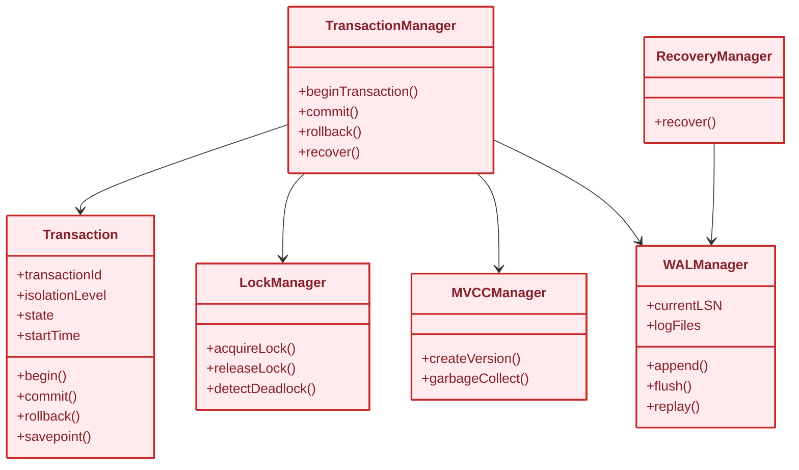
```mermaid
classDiagram
direction TB

class Transaction{
    +transactionId
    +isolationLevel
    +state
    +startTime

    +begin()
    +commit()
    +rollback()
    +savepoint()
}

class TransactionManager{
    +beginTransaction()
    +commit()
    +rollback()
    +recover()
}

class LockManager{
    +acquireLock()
    +releaseLock()
    +detectDeadlock()
}

class MVCCManager{
    +createVersion()
    +garbageCollect()
}

class WALManager{
    +currentLSN
    +logFiles

    +append()
    +flush()
    +replay()
}

class RecoveryManager{
    +recover()
}

TransactionManager --> Transaction
TransactionManager --> LockManager
TransactionManager --> MVCCManager
TransactionManager --> WALManager

RecoveryManager --> WALManager

%% =====================================================
%% STYLING DEFINITIONS
%% =====================================================
style Transaction fill:#ffebee,stroke:#c62828,stroke-width:2px,color:#842029
style TransactionManager fill:#ffebee,stroke:#c62828,stroke-width:2px,color:#842029
style LockManager fill:#ffebee,stroke:#c62828,stroke-width:2px,color:#842029
style MVCCManager fill:#ffebee,stroke:#c62828,stroke-width:2px,color:#842029
style WALManager fill:#ffebee,stroke:#c62828,stroke-width:2px,color:#842029
style RecoveryManager fill:#ffebee,stroke:#c62828,stroke-width:2px,color:#842029
```
---

# Transaction Management Test
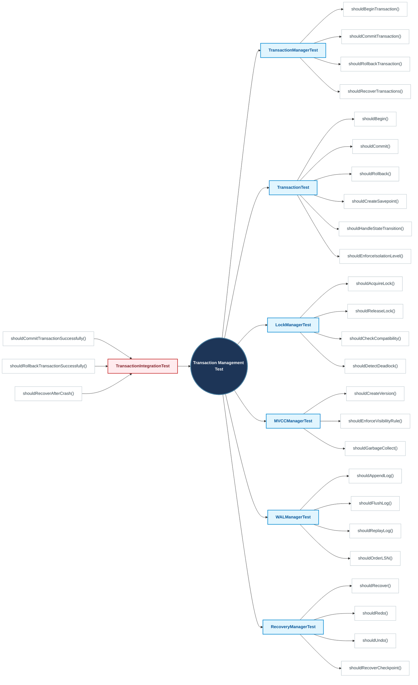
```mermaid
flowchart LR

    %% =====================================================
    %% Root
    %% =====================================================

    ROOT((Transaction Management Test)):::rootStyle

    %% =====================================================
    %% Integration Tests
    %% =====================================================

    TXINT["TransactionIntegrationTest"]:::branchTx

    it1["shouldCommitTransactionSuccessfully()"]:::leafStyle
    it2["shouldRollbackTransactionSuccessfully()"]:::leafStyle
    it3["shouldRecoverAfterCrash()"]:::leafStyle

    it1 --> TXINT
    it2 --> TXINT
    it3 --> TXINT

    TXINT --> ROOT

    %% =====================================================
    %% Unit Tests
    %% =====================================================

    TM["TransactionManagerTest"]:::branchAdmin
    TX["TransactionTest"]:::branchAdmin
    LM["LockManagerTest"]:::branchAdmin
    MVCC["MVCCManagerTest"]:::branchAdmin
    WAL["WALManagerTest"]:::branchAdmin
    REC["RecoveryManagerTest"]:::branchAdmin

    ROOT --> TM
    ROOT --> TX
    ROOT --> LM
    ROOT --> MVCC
    ROOT --> WAL
    ROOT --> REC

    %% =====================================================
    %% TransactionManagerTest
    %% =====================================================

    tm1["shouldBeginTransaction()"]:::leafStyle
    tm2["shouldCommitTransaction()"]:::leafStyle
    tm3["shouldRollbackTransaction()"]:::leafStyle
    tm4["shouldRecoverTransactions()"]:::leafStyle

    TM --> tm1
    TM --> tm2
    TM --> tm3
    TM --> tm4

    %% =====================================================
    %% TransactionTest
    %% =====================================================

    tx1["shouldBegin()"]:::leafStyle
    tx2["shouldCommit()"]:::leafStyle
    tx3["shouldRollback()"]:::leafStyle
    tx4["shouldCreateSavepoint()"]:::leafStyle
    tx5["shouldHandleStateTransition()"]:::leafStyle
    tx6["shouldEnforceIsolationLevel()"]:::leafStyle

    TX --> tx1
    TX --> tx2
    TX --> tx3
    TX --> tx4
    TX --> tx5
    TX --> tx6

    %% =====================================================
    %% LockManagerTest
    %% =====================================================

    lm1["shouldAcquireLock()"]:::leafStyle
    lm2["shouldReleaseLock()"]:::leafStyle
    lm3["shouldCheckCompatibility()"]:::leafStyle
    lm4["shouldDetectDeadlock()"]:::leafStyle

    LM --> lm1
    LM --> lm2
    LM --> lm3
    LM --> lm4

    %% =====================================================
    %% MVCCManagerTest
    %% =====================================================

    mvcc1["shouldCreateVersion()"]:::leafStyle
    mvcc2["shouldEnforceVisibilityRule()"]:::leafStyle
    mvcc3["shouldGarbageCollect()"]:::leafStyle

    MVCC --> mvcc1
    MVCC --> mvcc2
    MVCC --> mvcc3

    %% =====================================================
    %% WALManagerTest
    %% =====================================================

    wal1["shouldAppendLog()"]:::leafStyle
    wal2["shouldFlushLog()"]:::leafStyle
    wal3["shouldReplayLog()"]:::leafStyle
    wal4["shouldOrderLSN()"]:::leafStyle

    WAL --> wal1
    WAL --> wal2
    WAL --> wal3
    WAL --> wal4

    %% =====================================================
    %% RecoveryManagerTest
    %% =====================================================

    rec1["shouldRecover()"]:::leafStyle
    rec2["shouldRedo()"]:::leafStyle
    rec3["shouldUndo()"]:::leafStyle
    rec4["shouldRecoverCheckpoint()"]:::leafStyle

    REC --> rec1
    REC --> rec2
    REC --> rec3
    REC --> rec4

    %% =====================================================
    %% Styling
    %% =====================================================

    classDef rootStyle fill:#1d3557,stroke:#457b9d,stroke-width:3px,color:#fff,font-weight:bold,font-size:16px;
    classDef branchAdmin fill:#e1f5fe,stroke:#0288d1,stroke-width:2px,color:#01579b,font-weight:bold;
    classDef branchTx fill:#ffebee,stroke:#c62828,stroke-width:2px,color:#842029,font-weight:bold;
    classDef leafStyle fill:#ffffff,stroke:#b0bec5,stroke-width:1px,color:#37474f;
```

# Metadata Module
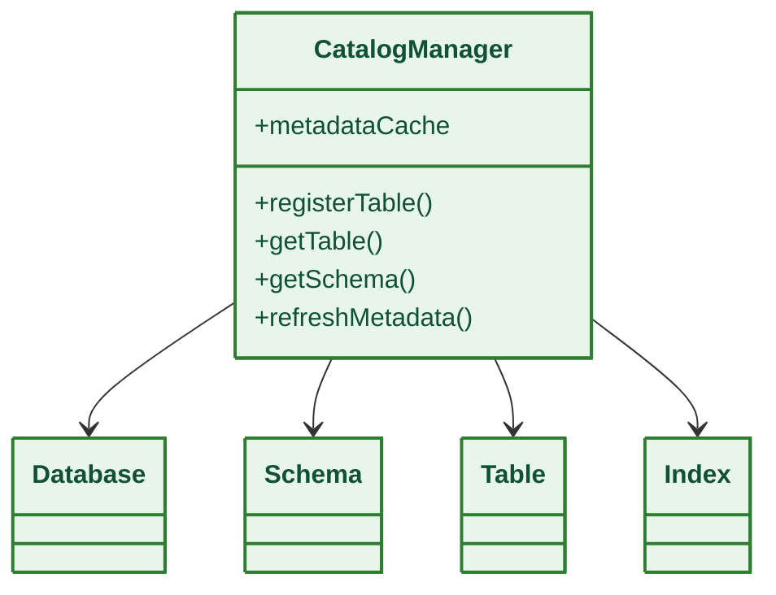
```mermaid
classDiagram
direction TB

class CatalogManager{
    +metadataCache

    +registerTable()
    +getTable()
    +getSchema()
    +refreshMetadata()
}

class Database

class Schema

class Table

class Index

CatalogManager --> Database
CatalogManager --> Schema
CatalogManager --> Table
CatalogManager --> Index

%% =====================================================
%% STYLING DEFINITIONS
%% =====================================================
style CatalogManager fill:#e8f5e9,stroke:#2e7d32,stroke-width:2px,color:#0f5132
style Database fill:#e8f5e9,stroke:#2e7d32,stroke-width:2px,color:#0f5132
style Schema fill:#e8f5e9,stroke:#2e7d32,stroke-width:2px,color:#0f5132
style Table fill:#e8f5e9,stroke:#2e7d32,stroke-width:2px,color:#0f5132
style Index fill:#e8f5e9,stroke:#2e7d32,stroke-width:2px,color:#0f5132
```
---
# Metadata Test

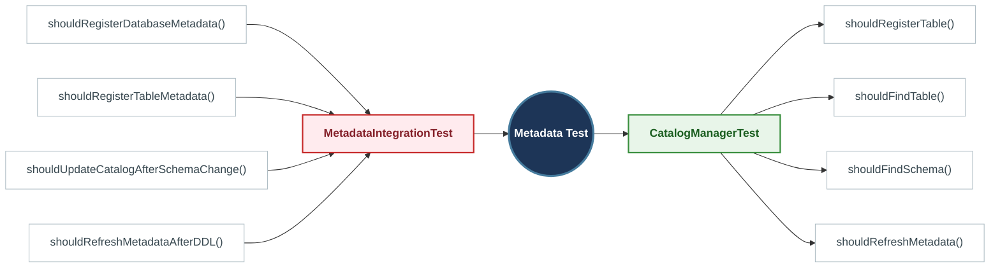
```mermaid
flowchart LR

    %% =====================================================
    %% Root
    %% =====================================================

    ROOT((Metadata Test)):::rootStyle

    %% =====================================================
    %% Integration Tests
    %% =====================================================

    METAINT["MetadataIntegrationTest"]:::branchTx

    it1["shouldRegisterDatabaseMetadata()"]:::leafStyle
    it2["shouldRegisterTableMetadata()"]:::leafStyle
    it3["shouldUpdateCatalogAfterSchemaChange()"]:::leafStyle
    it4["shouldRefreshMetadataAfterDDL()"]:::leafStyle

    it1 --> METAINT
    it2 --> METAINT
    it3 --> METAINT
    it4 --> METAINT

    METAINT --> ROOT

    %% =====================================================
    %% Unit Tests
    %% =====================================================

    CATALOG["CatalogManagerTest"]:::branchCatalog

    ROOT --> CATALOG

    %% =====================================================
    %% CatalogManagerTest
    %% =====================================================

    cm1["shouldRegisterTable()"]:::leafStyle
    cm2["shouldFindTable()"]:::leafStyle
    cm3["shouldFindSchema()"]:::leafStyle
    cm4["shouldRefreshMetadata()"]:::leafStyle

    CATALOG --> cm1
    CATALOG --> cm2
    CATALOG --> cm3
    CATALOG --> cm4

    %% =====================================================
    %% Styling
    %% =====================================================

    classDef rootStyle fill:#1d3557,stroke:#457b9d,stroke-width:3px,color:#fff,font-weight:bold,font-size:16px;
    classDef branchCatalog fill:#e8f5e9,stroke:#388e3c,stroke-width:2px,color:#1b5e20,font-weight:bold;
    classDef branchTx fill:#ffebee,stroke:#c62828,stroke-width:2px,color:#842029,font-weight:bold;
    classDef leafStyle fill:#ffffff,stroke:#b0bec5,stroke-width:1px,color:#37474f;
```
---
# Security Test

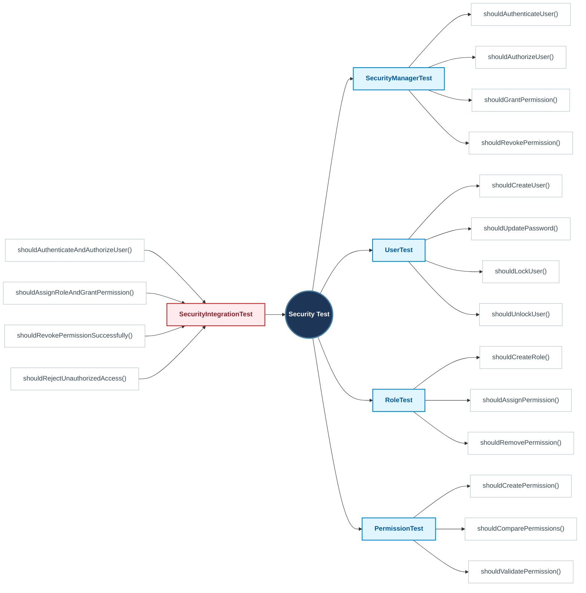
```mermaid
flowchart LR

    %% =====================================================
    %% Root
    %% =====================================================

    ROOT((Security Test)):::rootStyle

    %% =====================================================
    %% Integration Tests
    %% =====================================================

    SECINT["SecurityIntegrationTest"]:::branchTx

    it1["shouldAuthenticateAndAuthorizeUser()"]:::leafStyle
    it2["shouldAssignRoleAndGrantPermission()"]:::leafStyle
    it3["shouldRevokePermissionSuccessfully()"]:::leafStyle
    it4["shouldRejectUnauthorizedAccess()"]:::leafStyle

    it1 --> SECINT
    it2 --> SECINT
    it3 --> SECINT
    it4 --> SECINT

    SECINT --> ROOT

    %% =====================================================
    %% Unit Tests
    %% =====================================================

    SECURITY["SecurityManagerTest"]:::branchAdmin
    USER["UserTest"]:::branchAdmin
    ROLE["RoleTest"]:::branchAdmin
    PERMISSION["PermissionTest"]:::branchAdmin

    ROOT --> SECURITY
    ROOT --> USER
    ROOT --> ROLE
    ROOT --> PERMISSION

    %% =====================================================
    %% SecurityManagerTest
    %% =====================================================

    sm1["shouldAuthenticateUser()"]:::leafStyle
    sm2["shouldAuthorizeUser()"]:::leafStyle
    sm3["shouldGrantPermission()"]:::leafStyle
    sm4["shouldRevokePermission()"]:::leafStyle

    SECURITY --> sm1
    SECURITY --> sm2
    SECURITY --> sm3
    SECURITY --> sm4

    %% =====================================================
    %% UserTest
    %% =====================================================

    us1["shouldCreateUser()"]:::leafStyle
    us2["shouldUpdatePassword()"]:::leafStyle
    us3["shouldLockUser()"]:::leafStyle
    us4["shouldUnlockUser()"]:::leafStyle

    USER --> us1
    USER --> us2
    USER --> us3
    USER --> us4

    %% =====================================================
    %% RoleTest
    %% =====================================================

    rl1["shouldCreateRole()"]:::leafStyle
    rl2["shouldAssignPermission()"]:::leafStyle
    rl3["shouldRemovePermission()"]:::leafStyle

    ROLE --> rl1
    ROLE --> rl2
    ROLE --> rl3

    %% =====================================================
    %% PermissionTest
    %% =====================================================

    pm1["shouldCreatePermission()"]:::leafStyle
    pm2["shouldComparePermissions()"]:::leafStyle
    pm3["shouldValidatePermission()"]:::leafStyle

    PERMISSION --> pm1
    PERMISSION --> pm2
    PERMISSION --> pm3

    %% =====================================================
    %% Styling
    %% =====================================================

    classDef rootStyle fill:#1d3557,stroke:#457b9d,stroke-width:3px,color:#fff,font-weight:bold,font-size:16px;
    classDef branchAdmin fill:#e1f5fe,stroke:#0288d1,stroke-width:2px,color:#01579b,font-weight:bold;
    classDef branchTx fill:#ffebee,stroke:#c62828,stroke-width:2px,color:#842029,font-weight:bold;
    classDef leafStyle fill:#ffffff,stroke:#b0bec5,stroke-width:1px,color:#37474f;
```
--- 

# Recovery Module 
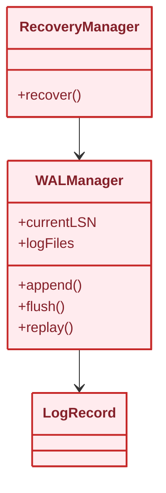
```mermaid
classDiagram
direction TB

class RecoveryManager{
    +recover()
}

class WALManager{
    +currentLSN
    +logFiles

    +append()
    +flush()
    +replay()
}

class LogRecord

RecoveryManager --> WALManager
WALManager --> LogRecord

%% =====================================================
%% STYLING DEFINITIONS
%% =====================================================
style RecoveryManager fill:#ffebee,stroke:#c62828,stroke-width:2px,color:#842029
style WALManager fill:#ffebee,stroke:#c62828,stroke-width:2px,color:#842029
style LogRecord fill:#ffebee,stroke:#c62828,stroke-width:2px,color:#842029
```
--- 

# Recovery Test 
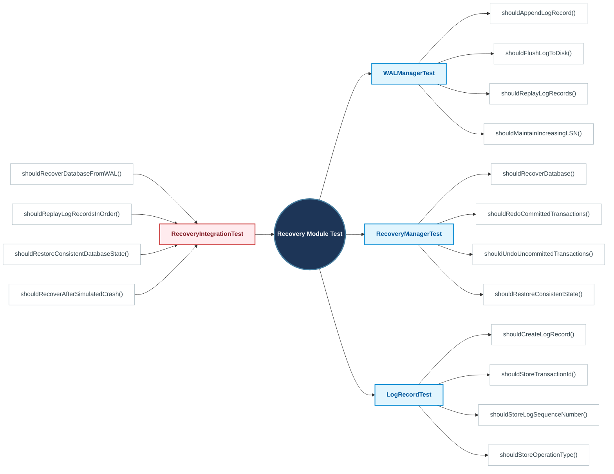
```mermaid
flowchart LR

    %% =====================================================
    %% Root
    %% =====================================================

    ROOT((Recovery Module Test)):::rootStyle

    %% =====================================================
    %% Integration Tests
    %% =====================================================

    RECINT["RecoveryIntegrationTest"]:::branchTx

    it1["shouldRecoverDatabaseFromWAL()"]:::leafStyle
    it2["shouldReplayLogRecordsInOrder()"]:::leafStyle
    it3["shouldRestoreConsistentDatabaseState()"]:::leafStyle
    it4["shouldRecoverAfterSimulatedCrash()"]:::leafStyle

    it1 --> RECINT
    it2 --> RECINT
    it3 --> RECINT
    it4 --> RECINT

    RECINT --> ROOT

    %% =====================================================
    %% Unit Tests
    %% =====================================================

    WAL["WALManagerTest"]:::branchAdmin
    RECOVERY["RecoveryManagerTest"]:::branchAdmin
    LOG["LogRecordTest"]:::branchAdmin

    ROOT --> WAL
    ROOT --> RECOVERY
    ROOT --> LOG

    %% =====================================================
    %% WALManagerTest
    %% =====================================================

    wal1["shouldAppendLogRecord()"]:::leafStyle
    wal2["shouldFlushLogToDisk()"]:::leafStyle
    wal3["shouldReplayLogRecords()"]:::leafStyle
    wal4["shouldMaintainIncreasingLSN()"]:::leafStyle

    WAL --> wal1
    WAL --> wal2
    WAL --> wal3
    WAL --> wal4

    %% =====================================================
    %% RecoveryManagerTest
    %% =====================================================

    rm1["shouldRecoverDatabase()"]:::leafStyle
    rm2["shouldRedoCommittedTransactions()"]:::leafStyle
    rm3["shouldUndoUncommittedTransactions()"]:::leafStyle
    rm4["shouldRestoreConsistentState()"]:::leafStyle

    RECOVERY --> rm1
    RECOVERY --> rm2
    RECOVERY --> rm3
    RECOVERY --> rm4

    %% =====================================================
    %% LogRecordTest
    %% =====================================================

    lr1["shouldCreateLogRecord()"]:::leafStyle
    lr2["shouldStoreTransactionId()"]:::leafStyle
    lr3["shouldStoreLogSequenceNumber()"]:::leafStyle
    lr4["shouldStoreOperationType()"]:::leafStyle

    LOG --> lr1
    LOG --> lr2
    LOG --> lr3
    LOG --> lr4

    %% =====================================================
    %% Styles
    %% =====================================================

    classDef rootStyle fill:#1d3557,stroke:#457b9d,stroke-width:3px,color:#fff,font-weight:bold,font-size:16px;
    classDef branchAdmin fill:#e1f5fe,stroke:#0288d1,stroke-width:2px,color:#01579b,font-weight:bold;
    classDef branchTx fill:#ffebee,stroke:#c62828,stroke-width:2px,color:#842029,font-weight:bold;
    classDef leafStyle fill:#ffffff,stroke:#b0bec5,stroke-width:1px,color:#37474f;
```
---
# Replication Module 
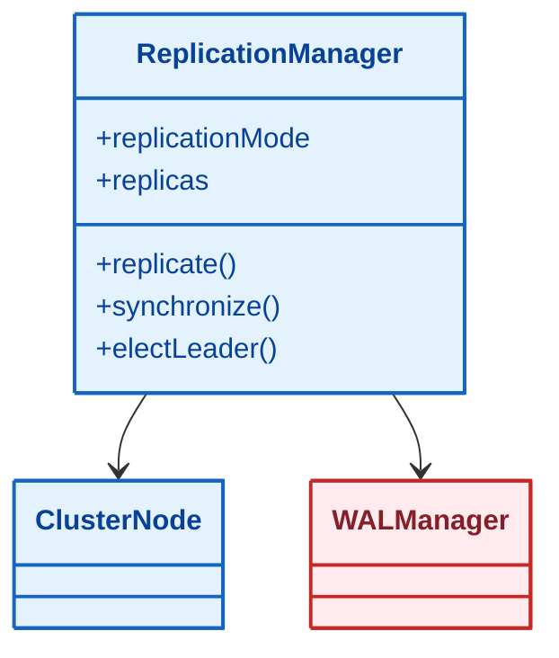
```mermaid
classDiagram
direction TB

class ReplicationManager{
    +replicationMode
    +replicas

    +replicate()
    +synchronize()
    +electLeader()
}

class ClusterNode

class WALManager

ReplicationManager --> ClusterNode
ReplicationManager --> WALManager

%% =====================================================
%% STYLING DEFINITIONS
%% =====================================================
style ReplicationManager fill:#e3f2fd,stroke:#1565c0,stroke-width:2px,color:#084298
style ClusterNode fill:#e3f2fd,stroke:#1565c0,stroke-width:2px,color:#084298
style WALManager fill:#ffebee,stroke:#c62828,stroke-width:2px,color:#842029
```
--- 

# Replication Test 
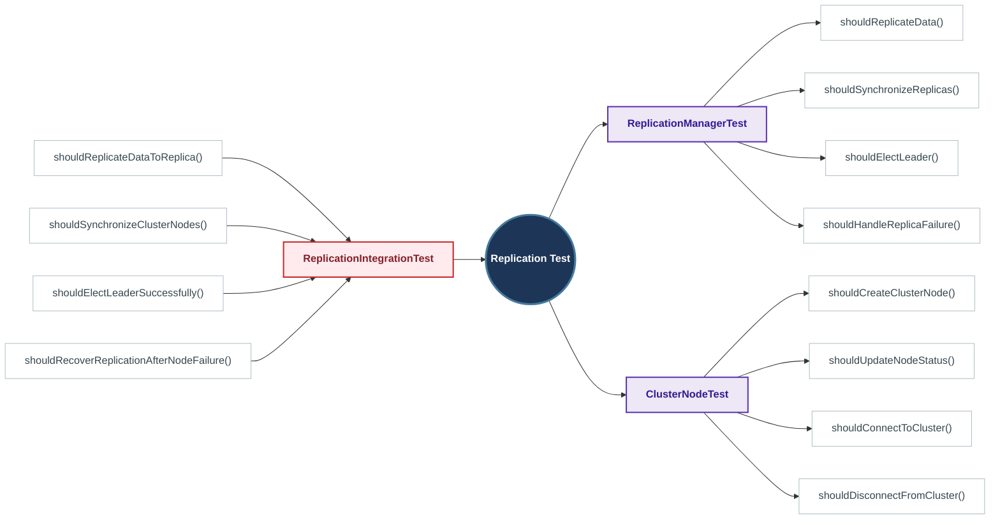
```mermaid
flowchart LR

    %% =====================================================
    %% Root
    %% =====================================================

    ROOT((Replication Test)):::rootStyle

    %% =====================================================
    %% Integration Tests
    %% =====================================================

    REPINT["ReplicationIntegrationTest"]:::branchTx

    it1["shouldReplicateDataToReplica()"]:::leafStyle
    it2["shouldSynchronizeClusterNodes()"]:::leafStyle
    it3["shouldElectLeaderSuccessfully()"]:::leafStyle
    it4["shouldRecoverReplicationAfterNodeFailure()"]:::leafStyle

    it1 --> REPINT
    it2 --> REPINT
    it3 --> REPINT
    it4 --> REPINT

    REPINT --> ROOT

    %% =====================================================
    %% Unit Tests
    %% =====================================================

    REPMANAGER["ReplicationManagerTest"]:::branchReplication
    NODE["ClusterNodeTest"]:::branchReplication

    ROOT --> REPMANAGER
    ROOT --> NODE

    %% =====================================================
    %% ReplicationManagerTest
    %% =====================================================

    rm1["shouldReplicateData()"]:::leafStyle
    rm2["shouldSynchronizeReplicas()"]:::leafStyle
    rm3["shouldElectLeader()"]:::leafStyle
    rm4["shouldHandleReplicaFailure()"]:::leafStyle

    REPMANAGER --> rm1
    REPMANAGER --> rm2
    REPMANAGER --> rm3
    REPMANAGER --> rm4

    %% =====================================================
    %% ClusterNodeTest
    %% =====================================================

    cn1["shouldCreateClusterNode()"]:::leafStyle
    cn2["shouldUpdateNodeStatus()"]:::leafStyle
    cn3["shouldConnectToCluster()"]:::leafStyle
    cn4["shouldDisconnectFromCluster()"]:::leafStyle

    NODE --> cn1
    NODE --> cn2
    NODE --> cn3
    NODE --> cn4

    %% =====================================================
    %% Styling
    %% =====================================================

    classDef rootStyle fill:#1d3557,stroke:#457b9d,stroke-width:3px,color:#fff,font-weight:bold,font-size:16px;
    classDef branchReplication fill:#ede7f6,stroke:#5e35b1,stroke-width:2px,color:#311b92,font-weight:bold;
    classDef branchTx fill:#ffebee,stroke:#c62828,stroke-width:2px,color:#842029,font-weight:bold;
    classDef leafStyle fill:#ffffff,stroke:#b0bec5,stroke-width:1px,color:#37474f;
```