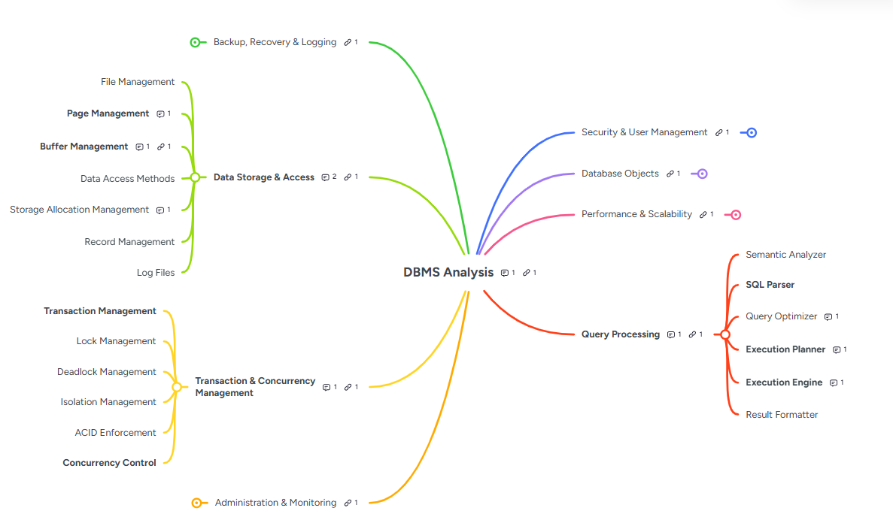
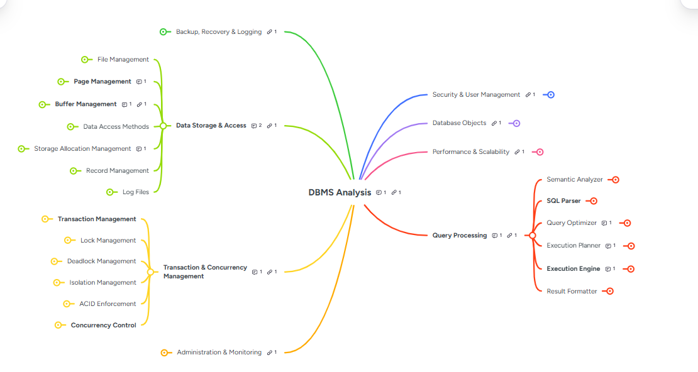

# DBMS System Architecture

```mermaid
flowchart LR
    classDef rootStyle  fill:#1d3557,color:#fff,stroke:#457b9d,font-weight:bold
    classDef modDSA     fill:#2d6a4f,color:#fff,stroke:#1b4332,font-weight:bold
    classDef modTCM     fill:#e76f51,color:#fff,stroke:#c1440e,font-weight:bold
    classDef modBRL     fill:#0077b6,color:#fff,stroke:#023e8a,font-weight:bold
    classDef modAM      fill:#457b9d,color:#fff,stroke:#1d3557,font-weight:bold
    classDef modSUM     fill:#7b2d8b,color:#fff,stroke:#560bad,font-weight:bold
    classDef modDO      fill:#9b2226,color:#fff,stroke:#6a040f,font-weight:bold
    classDef modPS      fill:#c77c08,color:#fff,stroke:#a05f00,font-weight:bold
    classDef modQP      fill:#b5a300,color:#fff,stroke:#8a7a00,font-weight:bold

    classDef subDSA     fill:#d8f3dc,color:#1b4332,stroke:#52b788
    classDef subTCM     fill:#ffddd2,color:#7d2d1a,stroke:#e29578
    classDef subBRL     fill:#caf0f8,color:#023e8a,stroke:#90e0ef
    classDef subAM      fill:#dbe9f5,color:#1d3557,stroke:#457b9d
    classDef subSUM     fill:#e9d8f5,color:#560bad,stroke:#c77dff
    classDef subDO      fill:#ffccd5,color:#5c0a14,stroke:#c9184a
    classDef subPS      fill:#ffe8d6,color:#7c4a03,stroke:#f4a261
    classDef subQP      fill:#fefae0,color:#554400,stroke:#c8aa00

    %% ─────────────────── LEFT SIDE ───────────────────

    %% Data Storage & Access
    DSA1["File Management"]:::subDSA              --> DSA
    DSA2["Page Management"]:::subDSA              --> DSA
    DSA3["Buffer Management"]:::subDSA            --> DSA
    DSA4["Data Access Methods"]:::subDSA          --> DSA
    DSA5["Storage Allocation Management"]:::subDSA --> DSA
    DSA6["Record Management"]:::subDSA            --> DSA
    DSA7["Log Files"]:::subDSA                    --> DSA
    DSA["**Data Storage & Access**"]:::modDSA         --> ROOT

    %% Transaction & Concurrency Management
    TCM1["Transaction Management"]:::subTCM --> TCM
    TCM2["Lock Management"]:::subTCM        --> TCM
    TCM3["Deadlock Management"]:::subTCM    --> TCM
    TCM4["Isolation Management"]:::subTCM   --> TCM
    TCM5["ACID Enforcement"]:::subTCM       --> TCM
    TCM6["Concurrency Control"]:::subTCM    --> TCM
    TCM["**Transaction & Concurrency Management**"]:::modTCM --> ROOT

    %% Backup, Recovery & Logging
    BRL1["Backup Management"]:::subBRL      --> BRL
    BRL2["Restore Management"]:::subBRL     --> BRL
    BRL3["Transaction Logging"]:::subBRL    --> BRL
    BRL4["Recovery Management"]:::subBRL    --> BRL
    BRL5["Checkpoint Management"]:::subBRL  --> BRL
    BRL["Backup, Recovery & Logging"]:::modBRL --> ROOT

    %% Administration & Monitoring
    AM1["System Monitoring"]:::subAM           --> AM
    AM2["Resource Monitoring"]:::subAM         --> AM
    AM3["Configuration Management"]:::subAM    --> AM
    AM4["Database Maintenance"]:::subAM        --> AM
    AM5["Import & Export Management"]:::subAM  --> AM
    AM6["Administrative Tools"]:::subAM        --> AM
    AM["Administration & Monitoring"]:::modAM --> ROOT

    %% ─────────────────── ROOT ───────────────────
    ROOT(["DBMS Analysis"]):::rootStyle

    %% ─────────────────── RIGHT SIDE ───────────────────

    %% Security & User Management
    ROOT --> SUM["Security & User Management"]:::modSUM
    SUM --> SUM1["Authentication Management"]:::subSUM
    SUM --> SUM2["Authorization Management"]:::subSUM
    SUM --> SUM3["User Management"]:::subSUM
    SUM --> SUM4["Role Management"]:::subSUM
    SUM --> SUM5["Data Protection"]:::subSUM
    SUM --> SUM6["Auditing & Compliance"]:::subSUM

    %% Database Objects
    ROOT --> DO["Database Objects"]:::modDO
    DO --> DO1["Schema Management"]:::subDO
    DO --> DO2["Database Management"]:::subDO
    DO --> DO3["Column Management"]:::subDO
    DO --> DO4["Table Management"]:::subDO
    DO --> DO5["View Management"]:::subDO
    DO --> DO6["Programmable Objects Management"]:::subDO
    DO --> DO7["Index Management"]:::subDO
    DO --> DO8["Constraint Management"]:::subDO
    DO --> DO9["Metadata Catalog Management"]:::subDO

    %% Performance & Scalability
    ROOT --> PS["Performance & Scalability"]:::modPS
    PS --> PS1["Memory Management"]:::subPS
    PS --> PS2["Workload Management"]:::subPS
    PS --> PS3["Resource Management"]:::subPS
    PS --> PS4["Data Distribution"]:::subPS
    PS --> PS5["Scalability Management"]:::subPS
    PS --> PS6["Performance Monitoring"]:::subPS
    PS --> PS7["Connection Management"]:::subPS
    PS --> PS8["Parallel Execution"]:::subPS

    %% Query Processing
    ROOT --> QP["**Query Processing**"]:::modQP
    QP --> QP1["Semantic Analyzer"]:::subQP
    QP --> QP2["SQL Parser"]:::subQP
    QP --> QP3["Query Optimizer"]:::subQP
    QP --> QP4["Execution Planner"]:::subQP
    QP --> QP5["Execution Engine"]:::subQP
    QP --> QP6["Result Formatter"]:::subQP
```

---
# DBMS System Architecture Important Modules

---
# DBMS Class Diagram mindmap

---
# Class Diagram for Core Features

```mermaid
classDiagram
    direction TB

    %% =====================================================
    %% PAGE MANAGEMENT
    %% =====================================================
    class Page {
        +pageId
        +data
        +dirty
    }
    class PageTable {
        +lookupPage()
        +addPage()
        +removePage()
    }
    class PageManager {
        +fetchPage()
        +allocatePage()
        +flushPage()
        +deletePage()
    }
    class IPageAllocator {
        <<interface>>
        +allocate()
        +free()
    }
    class DefaultPageAllocator {
        +allocate()
        +free()
    }
    class IPageIO {
        <<interface>>
        +read()
        +write()
    }
    class DiskPageIO {
        +read()
        +write()
    }

    PageTable *-- Page
    PageManager --> PageTable
    PageManager --> IPageAllocator
    PageManager --> IPageIO
    DefaultPageAllocator ..|> IPageAllocator
    DiskPageIO ..|> IPageIO

    %% =====================================================
    %% BUFFER MANAGEMENT
    %% =====================================================
    class BufferFrame {
        +frameId
        +pinCount
        +dirty
    }
    class BufferPool {
        +capacity
    }
    class ReplacementPolicy {
        <<interface>>
        +victim()
        +recordAccess()
    }
    class LRUReplacer {
        +victim()
        +recordAccess()
    }
    class BufferManager {
        +pinPage()
        +unpinPage()
        +flushPage()
        +flushAll()
    }

    BufferPool *-- BufferFrame
    LRUReplacer ..|> ReplacementPolicy
    BufferManager --> BufferPool
    BufferManager --> ReplacementPolicy
    BufferManager --> PageManager
    BufferFrame --> Page

    %% =====================================================
    %% SQL PARSER
    %% =====================================================
    class SQLParser {
        +parse()
    }
    class Lexer {
        +tokenize()
    }
    class Parser {
        +buildAST()
    }
    class ASTNode {
        <<abstract>>
    }
    class SyntaxError

    SQLParser --> Lexer
    SQLParser --> Parser
    Parser --> ASTNode
    Parser ..> SyntaxError

    %% =====================================================
    %% QUERY PLANNER
    %% =====================================================
    class QueryPlanner {
        +createPlan()
    }
    class ExecutionPlan {
        <<abstract>>
    }
    class SequentialScanPlan
    class FilterPlan

    ExecutionPlan <|-- SequentialScanPlan
    ExecutionPlan <|-- FilterPlan
    QueryPlanner --> ASTNode
    QueryPlanner --> ExecutionPlan

    %% =====================================================
    %% EXECUTION ENGINE
    %% =====================================================
    class ExecutionEngine {
        +execute()
    }
    class ExecutionContext
    class Executor {
        <<abstract>>
        +next()
    }
    class TableScanExecutor {
        +next()
    }
    class FilterExecutor {
        +next()
    }
    class ResultSet

    Executor <|-- TableScanExecutor
    Executor <|-- FilterExecutor
    ExecutionEngine --> ExecutionContext
    ExecutionEngine --> ExecutionPlan
    ExecutionEngine --> Executor
    ExecutionEngine --> ResultSet

    %% =====================================================
    %% TRANSACTION
    %% =====================================================
    class TransactionManager {
        +begin()
        +commit()
        +rollback()
    }
    class Transaction {
        +transactionId
        +state
    }
    class TransactionContext
    class TransactionState {
        <<enumeration>>
        ACTIVE
        COMMITTED
        ABORTED
    }
    class TransactionLog

    Transaction --> TransactionContext
    Transaction --> TransactionState
    TransactionManager --> Transaction
    TransactionManager --> TransactionLog

    %% =====================================================
    %% CONCURRENCY
    %% =====================================================
    class ConcurrencyManager {
        +acquire()
        +release()
    }
    class ILockManager {
        <<interface>>
        +lock()
        +unlock()
    }
    class LockManager {
        +lock()
        +unlock()
    }
    class LockTable
    class Lock
    class LockRequest
    class LockType {
        <<enumeration>>
        SHARED
        EXCLUSIVE
    }

    Lock --> LockType
    LockTable *-- Lock
    LockManager ..|> ILockManager
    ConcurrencyManager --> ILockManager
    LockManager --> LockTable
    LockManager --> LockRequest

    %% =====================================================
    %% CROSS MODULE DEPENDENCIES
    %% =====================================================
    ExecutionEngine --> BufferManager
    ExecutionEngine --> TransactionManager
    TransactionManager --> ConcurrencyManager

    %% =====================================================
    %% STYLING DEFINITIONS (COLOR-CODED BY MODULE)
    %% =====================================================
    %% Page Management (Green)
    style Page fill:#e8f5e9,stroke:#2e7d32,stroke-width:2px,color:#0f5132
    style PageTable fill:#e8f5e9,stroke:#2e7d32,stroke-width:2px,color:#0f5132
    style PageManager fill:#e8f5e9,stroke:#2e7d32,stroke-width:2px,color:#0f5132
    style IPageAllocator fill:#e8f5e9,stroke:#2e7d32,stroke-width:2px,color:#0f5132
    style DefaultPageAllocator fill:#e8f5e9,stroke:#2e7d32,stroke-width:2px,color:#0f5132
    style IPageIO fill:#e8f5e9,stroke:#2e7d32,stroke-width:2px,color:#0f5132
    style DiskPageIO fill:#e8f5e9,stroke:#2e7d32,stroke-width:2px,color:#0f5132

    %% Buffer Management (Blue)
    style BufferFrame fill:#e3f2fd,stroke:#1565c0,stroke-width:2px,color:#084298
    style BufferPool fill:#e3f2fd,stroke:#1565c0,stroke-width:2px,color:#084298
    style ReplacementPolicy fill:#e3f2fd,stroke:#1565c0,stroke-width:2px,color:#084298
    style LRUReplacer fill:#e3f2fd,stroke:#1565c0,stroke-width:2px,color:#084298
    style BufferManager fill:#e3f2fd,stroke:#1565c0,stroke-width:2px,color:#084298

    %% Parser & Query Planner (Yellow/Orange)
    style SQLParser fill:#fff8e1,stroke:#ff8f00,stroke-width:2px,color:#664d03
    style Lexer fill:#fff8e1,stroke:#ff8f00,stroke-width:2px,color:#664d03
    style Parser fill:#fff8e1,stroke:#ff8f00,stroke-width:2px,color:#664d03
    style ASTNode fill:#fff8e1,stroke:#ff8f00,stroke-width:2px,color:#664d03
    style SyntaxError fill:#fff8e1,stroke:#ff8f00,stroke-width:2px,color:#664d03
    style QueryPlanner fill:#fff8e1,stroke:#ff8f00,stroke-width:2px,color:#664d03
    style ExecutionPlan fill:#fff8e1,stroke:#ff8f00,stroke-width:2px,color:#664d03
    style SequentialScanPlan fill:#fff8e1,stroke:#ff8f00,stroke-width:2px,color:#664d03
    style FilterPlan fill:#fff8e1,stroke:#ff8f00,stroke-width:2px,color:#664d03

    %% Execution Engine (Purple)
    style ExecutionEngine fill:#f3e5f5,stroke:#6a1b9a,stroke-width:2px,color:#3b0a66
    style ExecutionContext fill:#f3e5f5,stroke:#6a1b9a,stroke-width:2px,color:#3b0a66
    style Executor fill:#f3e5f5,stroke:#6a1b9a,stroke-width:2px,color:#3b0a66
    style TableScanExecutor fill:#f3e5f5,stroke:#6a1b9a,stroke-width:2px,color:#3b0a66
    style FilterExecutor fill:#f3e5f5,stroke:#6a1b9a,stroke-width:2px,color:#3b0a66
    style ResultSet fill:#f3e5f5,stroke:#6a1b9a,stroke-width:2px,color:#3b0a66

    %% Transaction & Concurrency (Red/Coral)
    style TransactionManager fill:#ffebee,stroke:#c62828,stroke-width:2px,color:#842029
    style Transaction fill:#ffebee,stroke:#c62828,stroke-width:2px,color:#842029
    style TransactionContext fill:#ffebee,stroke:#c62828,stroke-width:2px,color:#842029
    style TransactionState fill:#ffebee,stroke:#c62828,stroke-width:2px,color:#842029
    style TransactionLog fill:#ffebee,stroke:#c62828,stroke-width:2px,color:#842029
    style ConcurrencyManager fill:#ffebee,stroke:#c62828,stroke-width:2px,color:#842029
    style ILockManager fill:#ffebee,stroke:#c62828,stroke-width:2px,color:#842029
    style LockManager fill:#ffebee,stroke:#c62828,stroke-width:2px,color:#842029
    style LockTable fill:#ffebee,stroke:#c62828,stroke-width:2px,color:#842029
    style Lock fill:#ffebee,stroke:#c62828,stroke-width:2px,color:#842029
    style LockRequest fill:#ffebee,stroke:#c62828,stroke-width:2px,color:#842029
    style LockType fill:#ffebee,stroke:#c62828,stroke-width:2px,color:#842029
```