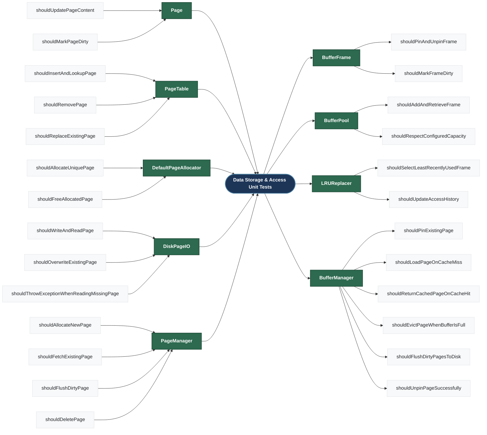
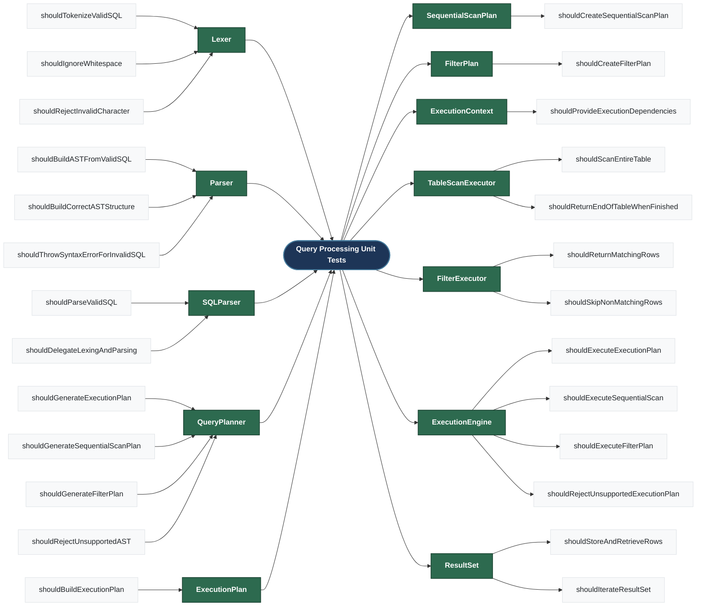
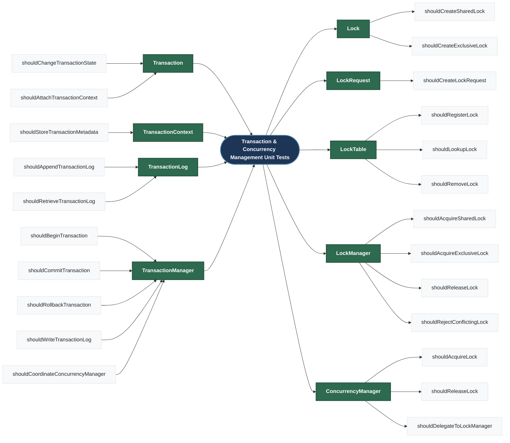
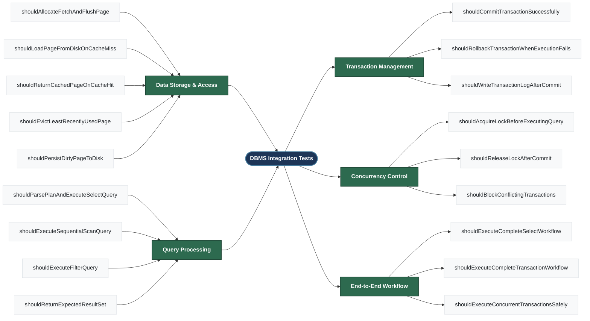

# DBMS System Architecture

---
# DBMS System Architecture Important Modules

---
# DBMS Class Diagram mindmap

---
# Class Diagram for Core Features

--- 
# Unit Test Mindmap for Data Storage & Access

--- 
# Unit Test Mindmap for Query Processing

--- 
# Unit Test Mindmap for Transaction & Concurrency Management

# Mindmap for Integration Test
