# DBMS System Architecture

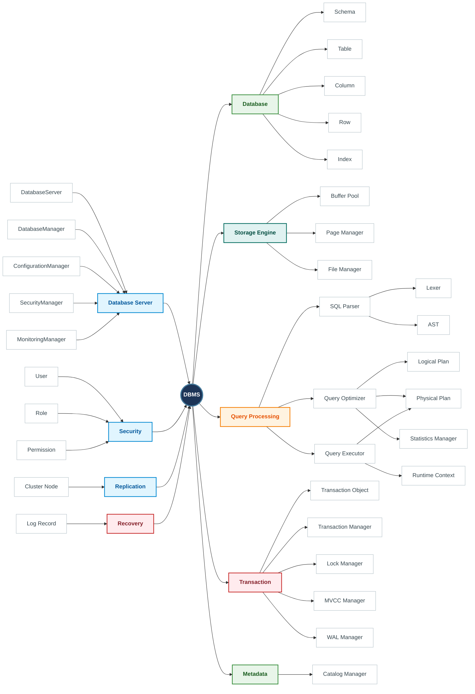

---
# Overview Class Diagram

```mermaid
classDiagram
direction TB

class DatabaseServer{
    +serverId
    +version
    +status
    +start()
    +stop()
    +restart()
}

class DatabaseManager{
    +createDatabase()
    +dropDatabase()
    +getDatabase()
    +listDatabases()
}

class Database{
    +databaseId
    +name
    +owner
    +open()
    +close()
}

class Schema{
    +schemaId
    +name
    +createTable()
    +dropTable()
}

class Table{
    +tableId
    +name
    +insert()
    +update()
    +delete()
}

class Column{
    +columnId
    +name
    +dataType
    +nullable
}

class Row{
    +rowId
    +values
    +version
}

class DataType{
    <<enumeration>>
}

class Constraint{
    <<abstract>>
    +validate()
}

class PrimaryKey{
    +columns
}

class ForeignKey{
    +referenceTable
}

class UniqueConstraint

class CheckConstraint

class Index{
    <<abstract>>
    +search()
    +insertKey()
    +deleteKey()
}

class BTreeIndex

class HashIndex

class BitmapIndex

class Partition{
    +partitionKey
}

class View{
    +queryDefinition
}

class StoredProcedure{
    +execute()
}

class Trigger{
    +fire()
}

class Sequence{
    +nextValue()
}

class Transaction{
    +transactionId
    +begin()
    +commit()
    +rollback()
}

class TransactionManager{
    +beginTransaction()
    +commit()
    +rollback()
}

class LockManager{
    +acquireLock()
    +releaseLock()
}

class MVCCManager{
    +createVersion()
    +garbageCollect()
}

class BufferPool{
    +pinPage()
    +flushPage()
}

class Page{
    +pageId
}

class StorageEngine{
    +readPage()
    +writePage()
}

class FileManager{
    +read()
    +write()
}

class WALManager{
    +appendLog()
    +flush()
}

class RecoveryManager{
    +recover()
}

class CatalogManager{
    +registerTable()
    +findTable()
}

class SQLParser{
    +parse()
}

class Lexer{
    +tokenize()
}

class AST{
    +root
}

class QueryOptimizer{
    +optimize()
}

class LogicalPlan{
    +operators
}

class PhysicalPlan{
    +operators
}

class QueryExecutor{
    +execute()
}

class StatisticsManager{
    +collect()
}

class SecurityManager{
    +authenticate()
    +authorize()
}

class User

class Role

class Permission

DatabaseServer --> DatabaseManager
DatabaseServer --> TransactionManager
DatabaseServer --> StorageEngine
DatabaseServer --> CatalogManager
DatabaseServer --> SecurityManager

DatabaseManager --> Database
Database --> Schema
Schema --> Table
Schema --> View
Schema --> StoredProcedure
Schema --> Sequence

Table --> Column
Table --> Row
Table --> Index
Table --> Constraint
Table --> Partition
Table --> Trigger

Constraint <|-- PrimaryKey
Constraint <|-- ForeignKey
Constraint <|-- UniqueConstraint
Constraint <|-- CheckConstraint

Index <|-- BTreeIndex
Index <|-- HashIndex
Index <|-- BitmapIndex

Column --> DataType
ForeignKey --> Table

TransactionManager --> Transaction
TransactionManager --> LockManager
TransactionManager --> MVCCManager
TransactionManager --> WALManager

StorageEngine --> BufferPool
StorageEngine --> FileManager
BufferPool --> Page

RecoveryManager --> WALManager

CatalogManager --> Table
CatalogManager --> Index
CatalogManager --> Schema

SQLParser --> Lexer
SQLParser --> AST
AST --> LogicalPlan
QueryOptimizer --> LogicalPlan
QueryOptimizer --> PhysicalPlan
QueryExecutor --> PhysicalPlan
QueryExecutor --> Transaction

StatisticsManager --> Table
QueryOptimizer --> StatisticsManager

SecurityManager --> User
SecurityManager --> Role
Role --> Permission

%% =====================================================
%% STYLING DEFINITIONS (Color-coded by Domain Group)
%% =====================================================
%% Server & Security (Blue)
style DatabaseServer fill:#e3f2fd,stroke:#1565c0,stroke-width:2px,color:#084298
style DatabaseManager fill:#e3f2fd,stroke:#1565c0,stroke-width:2px,color:#084298
style SecurityManager fill:#e3f2fd,stroke:#1565c0,stroke-width:2px,color:#084298
style User fill:#e3f2fd,stroke:#1565c0,stroke-width:2px,color:#084298
style Role fill:#e3f2fd,stroke:#1565c0,stroke-width:2px,color:#084298
style Permission fill:#e3f2fd,stroke:#1565c0,stroke-width:2px,color:#084298

%% Catalog & Database Objects (Green)
style Database fill:#e8f5e9,stroke:#2e7d32,stroke-width:2px,color:#0f5132
style Schema fill:#e8f5e9,stroke:#2e7d32,stroke-width:2px,color:#0f5132
style Table fill:#e8f5e9,stroke:#2e7d32,stroke-width:2px,color:#0f5132
style Column fill:#e8f5e9,stroke:#2e7d32,stroke-width:2px,color:#0f5132
style Row fill:#e8f5e9,stroke:#2e7d32,stroke-width:2px,color:#0f5132
style DataType fill:#e8f5e9,stroke:#2e7d32,stroke-width:2px,color:#0f5132
style Constraint fill:#e8f5e9,stroke:#2e7d32,stroke-width:2px,color:#0f5132
style PrimaryKey fill:#e8f5e9,stroke:#2e7d32,stroke-width:2px,color:#0f5132
style ForeignKey fill:#e8f5e9,stroke:#2e7d32,stroke-width:2px,color:#0f5132
style UniqueConstraint fill:#e8f5e9,stroke:#2e7d32,stroke-width:2px,color:#0f5132
style CheckConstraint fill:#e8f5e9,stroke:#2e7d32,stroke-width:2px,color:#0f5132
style Index fill:#e8f5e9,stroke:#2e7d32,stroke-width:2px,color:#0f5132
style BTreeIndex fill:#e8f5e9,stroke:#2e7d32,stroke-width:2px,color:#0f5132
style HashIndex fill:#e8f5e9,stroke:#2e7d32,stroke-width:2px,color:#0f5132
style BitmapIndex fill:#e8f5e9,stroke:#2e7d32,stroke-width:2px,color:#0f5132
style Partition fill:#e8f5e9,stroke:#2e7d32,stroke-width:2px,color:#0f5132
style View fill:#e8f5e9,stroke:#2e7d32,stroke-width:2px,color:#0f5132
style StoredProcedure fill:#e8f5e9,stroke:#2e7d32,stroke-width:2px,color:#0f5132
style Trigger fill:#e8f5e9,stroke:#2e7d32,stroke-width:2px,color:#0f5132
style Sequence fill:#e8f5e9,stroke:#2e7d32,stroke-width:2px,color:#0f5132
style CatalogManager fill:#e8f5e9,stroke:#2e7d32,stroke-width:2px,color:#0f5132

%% Query Engine (Yellow/Orange)
style SQLParser fill:#fff8e1,stroke:#ff8f00,stroke-width:2px,color:#664d03
style Lexer fill:#fff8e1,stroke:#ff8f00,stroke-width:2px,color:#664d03
style AST fill:#fff8e1,stroke:#ff8f00,stroke-width:2px,color:#664d03
style QueryOptimizer fill:#fff8e1,stroke:#ff8f00,stroke-width:2px,color:#664d03
style LogicalPlan fill:#fff8e1,stroke:#ff8f00,stroke-width:2px,color:#664d03
style PhysicalPlan fill:#fff8e1,stroke:#ff8f00,stroke-width:2px,color:#664d03
style QueryExecutor fill:#fff8e1,stroke:#ff8f00,stroke-width:2px,color:#664d03
style StatisticsManager fill:#fff8e1,stroke:#ff8f00,stroke-width:2px,color:#664d03

%% Storage Engine (Teal)
style StorageEngine fill:#e0f2f1,stroke:#00695c,stroke-width:2px,color:#004d40
style BufferPool fill:#e0f2f1,stroke:#00695c,stroke-width:2px,color:#004d40
style Page fill:#e0f2f1,stroke:#00695c,stroke-width:2px,color:#004d40
style FileManager fill:#e0f2f1,stroke:#00695c,stroke-width:2px,color:#004d40

%% Transaction & Recovery (Red/Coral)
style Transaction fill:#ffebee,stroke:#c62828,stroke-width:2px,color:#842029
style TransactionManager fill:#ffebee,stroke:#c62828,stroke-width:2px,color:#842029
style LockManager fill:#ffebee,stroke:#c62828,stroke-width:2px,color:#842029
style MVCCManager fill:#ffebee,stroke:#c62828,stroke-width:2px,color:#842029
style WALManager fill:#ffebee,stroke:#c62828,stroke-width:2px,color:#842029
style RecoveryManager fill:#ffebee,stroke:#c62828,stroke-width:2px,color:#842029
```

--- 

# Class Diagram for Database Server Module
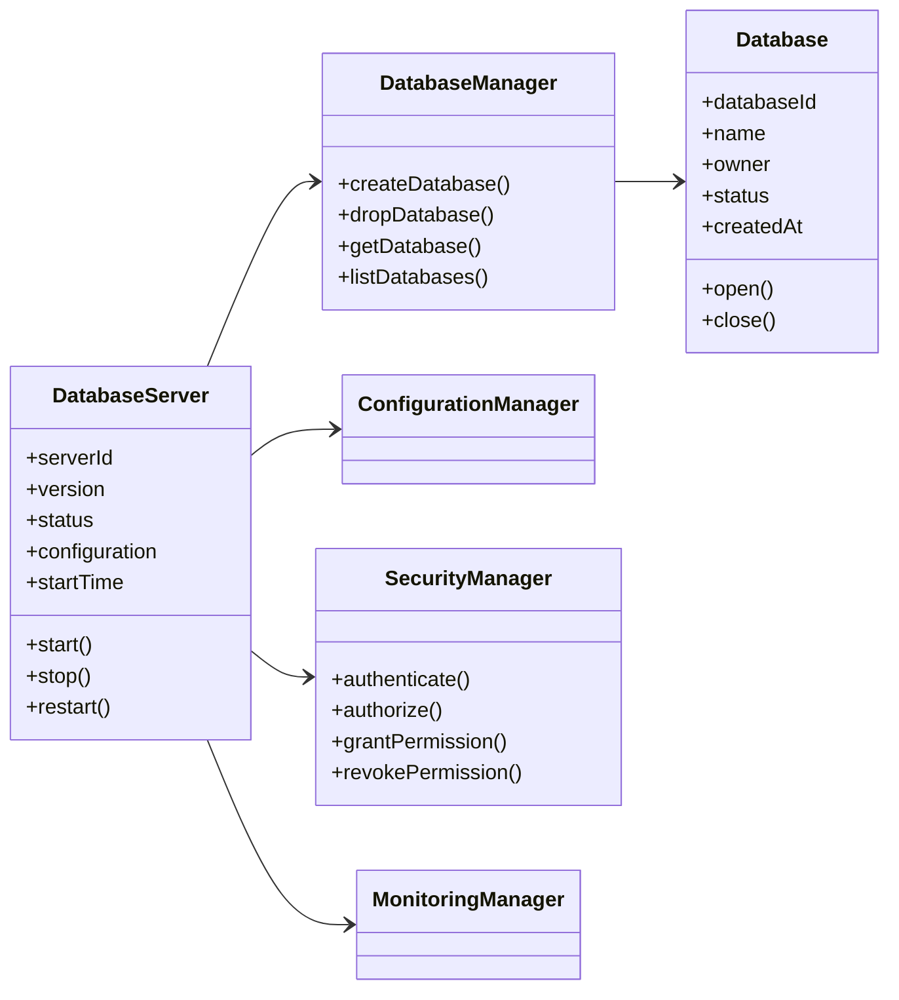
--- 

# Database Objects Module

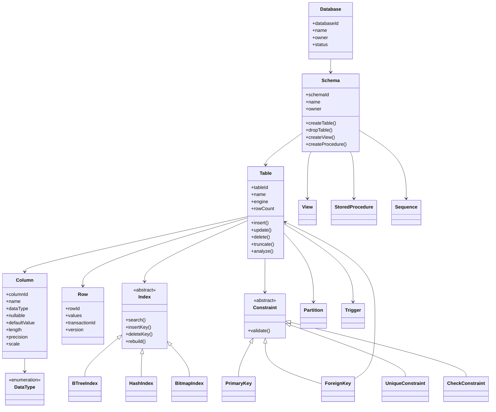
--- 

# Storage Engine Module

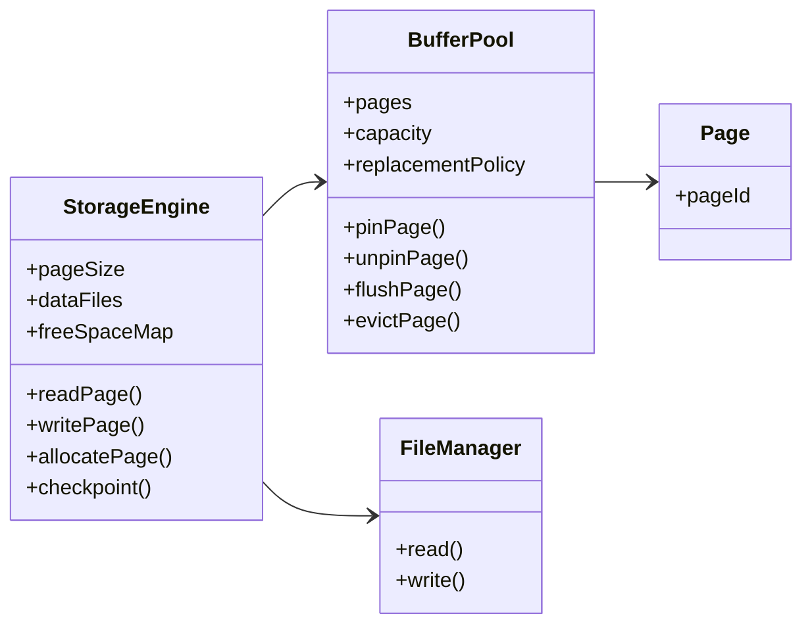
--- 

# Query Processing Module

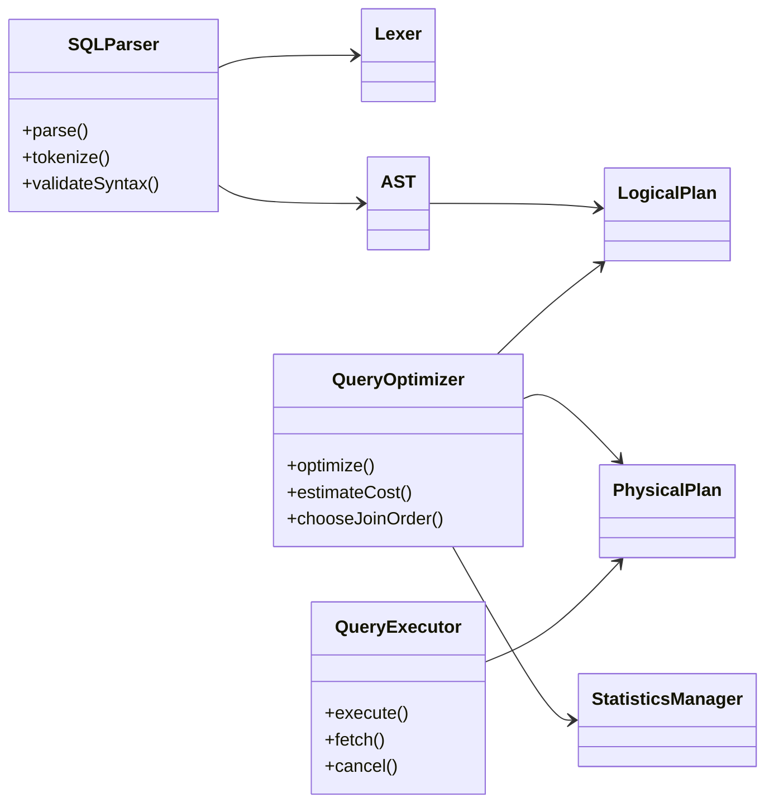
---

# Transaction Management Module
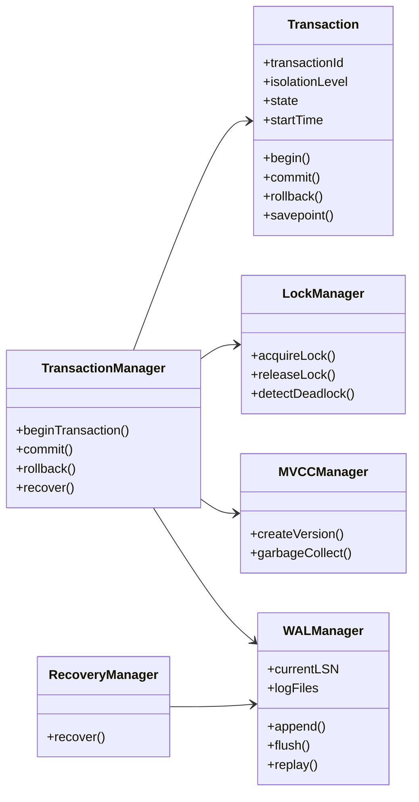
---

# Metadata Module
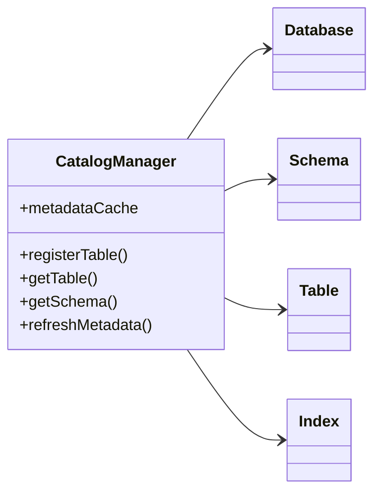
--- 
# Security Module 
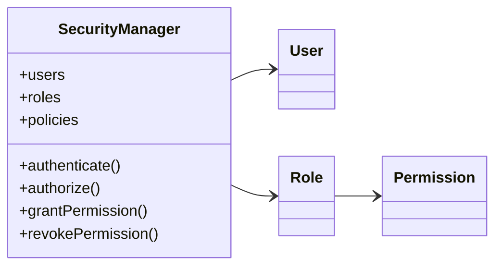
--- 

# Recovery Module 
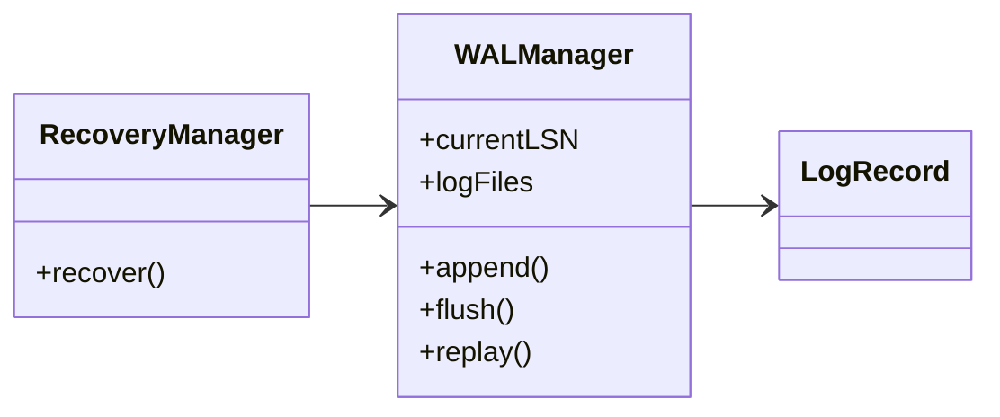
--- 

# Replication Module 
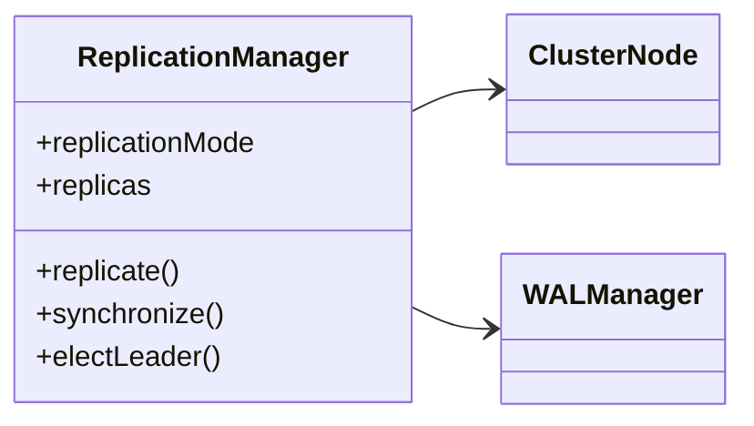
--- 