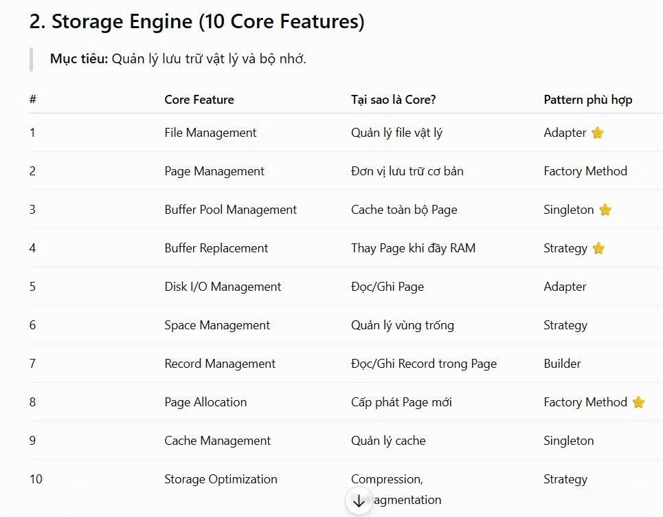
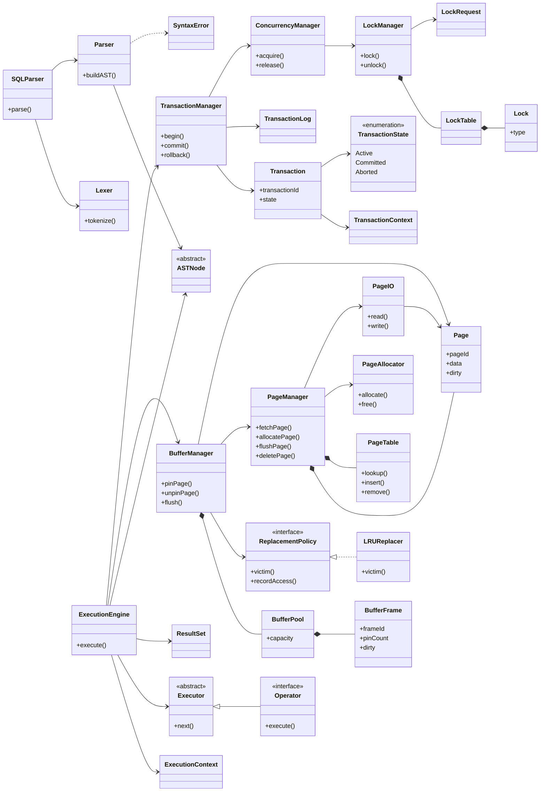

# DBMS System Architecture

```mermaid
flowchart LR
    classDef rootStyle  fill:#1d3557,color:#fff,stroke:#457b9d,font-weight:bold
    classDef modDSA     fill:#2d6a4f,color:#fff,stroke:#1b4332,font-weight:bold
    classDef modTCM     fill:#e76f51,color:#fff,stroke:#c1440e,font-weight:bold
    classDef modBRL     fill:#0077b6,color:#fff,stroke:#023e8a,font-weight:bold
    classDef modAM      fill:#457b9d,color:#fff,stroke:#1d3557,font-weight:bold
    classDef modSUM     fill:#7b2d8b,color:#fff,stroke:#560bad,font-weight:bold
    classDef modDO      fill:#9b2226,color:#fff,stroke:#6a040f,font-weight:bold
    classDef modPS      fill:#c77c08,color:#fff,stroke:#a05f00,font-weight:bold
    classDef modQP      fill:#b5a300,color:#fff,stroke:#8a7a00,font-weight:bold

    classDef subDSA     fill:#d8f3dc,color:#1b4332,stroke:#52b788
    classDef subTCM     fill:#ffddd2,color:#7d2d1a,stroke:#e29578
    classDef subBRL     fill:#caf0f8,color:#023e8a,stroke:#90e0ef
    classDef subAM      fill:#dbe9f5,color:#1d3557,stroke:#457b9d
    classDef subSUM     fill:#e9d8f5,color:#560bad,stroke:#c77dff
    classDef subDO      fill:#ffccd5,color:#5c0a14,stroke:#c9184a
    classDef subPS      fill:#ffe8d6,color:#7c4a03,stroke:#f4a261
    classDef subQP      fill:#fefae0,color:#554400,stroke:#c8aa00

    %% ─────────────────── LEFT SIDE ───────────────────

    %% Data Storage & Access
    DSA1["File Management"]:::subDSA              --> DSA
    DSA2["Page Management"]:::subDSA              --> DSA
    DSA3["Buffer Management"]:::subDSA            --> DSA
    DSA4["Data Access Methods"]:::subDSA          --> DSA
    DSA5["Storage Allocation Management"]:::subDSA --> DSA
    DSA6["Record Management"]:::subDSA            --> DSA
    DSA7["Log Files"]:::subDSA                    --> DSA
    DSA["**Data Storage & Access**"]:::modDSA         --> ROOT

    %% Transaction & Concurrency Management
    TCM1["Transaction Management"]:::subTCM --> TCM
    TCM2["Lock Management"]:::subTCM        --> TCM
    TCM3["Deadlock Management"]:::subTCM    --> TCM
    TCM4["Isolation Management"]:::subTCM   --> TCM
    TCM5["ACID Enforcement"]:::subTCM       --> TCM
    TCM6["Concurrency Control"]:::subTCM    --> TCM
    TCM["**Transaction & Concurrency Management**"]:::modTCM --> ROOT

    %% Backup, Recovery & Logging
    BRL1["Backup Management"]:::subBRL      --> BRL
    BRL2["Restore Management"]:::subBRL     --> BRL
    BRL3["Transaction Logging"]:::subBRL    --> BRL
    BRL4["Recovery Management"]:::subBRL    --> BRL
    BRL5["Checkpoint Management"]:::subBRL  --> BRL
    BRL["Backup, Recovery & Logging"]:::modBRL --> ROOT

    %% Administration & Monitoring
    AM1["System Monitoring"]:::subAM           --> AM
    AM2["Resource Monitoring"]:::subAM         --> AM
    AM3["Configuration Management"]:::subAM    --> AM
    AM4["Database Maintenance"]:::subAM        --> AM
    AM5["Import & Export Management"]:::subAM  --> AM
    AM6["Administrative Tools"]:::subAM        --> AM
    AM["Administration & Monitoring"]:::modAM --> ROOT

    %% ─────────────────── ROOT ───────────────────
    ROOT(["DBMS Analysis"]):::rootStyle

    %% ─────────────────── RIGHT SIDE ───────────────────

    %% Security & User Management
    ROOT --> SUM["Security & User Management"]:::modSUM
    SUM --> SUM1["Authentication Management"]:::subSUM
    SUM --> SUM2["Authorization Management"]:::subSUM
    SUM --> SUM3["User Management"]:::subSUM
    SUM --> SUM4["Role Management"]:::subSUM
    SUM --> SUM5["Data Protection"]:::subSUM
    SUM --> SUM6["Auditing & Compliance"]:::subSUM

    %% Database Objects
    ROOT --> DO["Database Objects"]:::modDO
    DO --> DO1["Schema Management"]:::subDO
    DO --> DO2["Database Management"]:::subDO
    DO --> DO3["Column Management"]:::subDO
    DO --> DO4["Table Management"]:::subDO
    DO --> DO5["View Management"]:::subDO
    DO --> DO6["Programmable Objects Management"]:::subDO
    DO --> DO7["Index Management"]:::subDO
    DO --> DO8["Constraint Management"]:::subDO
    DO --> DO9["Metadata Catalog Management"]:::subDO

    %% Performance & Scalability
    ROOT --> PS["Performance & Scalability"]:::modPS
    PS --> PS1["Memory Management"]:::subPS
    PS --> PS2["Workload Management"]:::subPS
    PS --> PS3["Resource Management"]:::subPS
    PS --> PS4["Data Distribution"]:::subPS
    PS --> PS5["Scalability Management"]:::subPS
    PS --> PS6["Performance Monitoring"]:::subPS
    PS --> PS7["Connection Management"]:::subPS
    PS --> PS8["Parallel Execution"]:::subPS

    %% Query Processing
    ROOT --> QP["**Query Processing**"]:::modQP
    QP --> QP1["Semantic Analyzer"]:::subQP
    QP --> QP2["SQL Parser"]:::subQP
    QP --> QP3["Query Optimizer"]:::subQP
    QP --> QP4["Execution Planner"]:::subQP
    QP --> QP5["Execution Engine"]:::subQP
    QP --> QP6["Result Formatter"]:::subQP
```

---
# DBMS System Architecture Important Modules

---
# DBMS Class Diagram mindmap

---
# Class Diagram for Core Features

```mermaid
classDiagram
direction LR

%% =====================================================
%% PAGE MANAGEMENT
%% =====================================================

class PageManager {
    +fetchPage()
    +allocatePage()
    +flushPage()
    +deletePage()
}

class Page {
    +pageId
    +data
    +dirty
}

class PageTable {
    +lookup()
    +insert()
    +remove()
}

class PageAllocator {
    +allocate()
    +free()
}

class PageIO {
    +read()
    +write()
}

PageManager *-- Page
PageManager *-- PageTable
PageManager --> PageAllocator
PageManager --> PageIO

%% =====================================================
%% BUFFER MANAGEMENT
%% =====================================================

class BufferManager {
    +pinPage()
    +unpinPage()
    +flush()
}

class BufferPool {
    +capacity
}

class BufferFrame {
    +frameId
    +pinCount
    +dirty
}

class ReplacementPolicy {
    <<interface>>
    +victim()
    +recordAccess()
}

class LRUReplacer {
    +victim()
}

BufferManager *-- BufferPool
BufferPool *-- BufferFrame

ReplacementPolicy <|.. LRUReplacer

BufferManager --> ReplacementPolicy
BufferManager --> PageManager

%% =====================================================
%% SQL PARSER
%% =====================================================

class SQLParser {
    +parse()
}

class Lexer {
    +tokenize()
}

class Parser {
    +buildAST()
}

class ASTNode {
    <<abstract>>
}

class SyntaxError

SQLParser --> Lexer
SQLParser --> Parser
Parser --> ASTNode
Parser ..> SyntaxError

%% =====================================================
%% EXECUTION ENGINE
%% =====================================================

class ExecutionEngine {
    +execute()
}

class ExecutionContext

class Executor {
    <<abstract>>
    +next()
}

class Operator {
    <<interface>>
    +execute()
}

class ResultSet

ExecutionEngine --> ExecutionContext
ExecutionEngine --> Executor

Executor <|-- Operator

ExecutionEngine --> ResultSet
ExecutionEngine --> ASTNode

%% =====================================================
%% TRANSACTION
%% =====================================================

class TransactionManager {
    +begin()
    +commit()
    +rollback()
}

class Transaction {
    +transactionId
    +state
}

class TransactionContext

class TransactionState {
    <<enumeration>>
    Active
    Committed
    Aborted
}

class TransactionLog

TransactionManager --> Transaction
Transaction --> TransactionContext
Transaction --> TransactionState
TransactionManager --> TransactionLog

%% =====================================================
%% CONCURRENCY
%% =====================================================

class ConcurrencyManager {
    +acquire()
    +release()
}

class LockManager {
    +lock()
    +unlock()
}

class Lock {
    +type
}

class LockRequest

class LockTable

ConcurrencyManager --> LockManager

LockManager *-- LockTable
LockTable *-- Lock
LockManager --> LockRequest

%% =====================================================
%% CROSS MODULE DEPENDENCIES
%% =====================================================

ExecutionEngine --> BufferManager
ExecutionEngine --> TransactionManager

TransactionManager --> ConcurrencyManager

PageIO --> Page

BufferManager --> Page

```