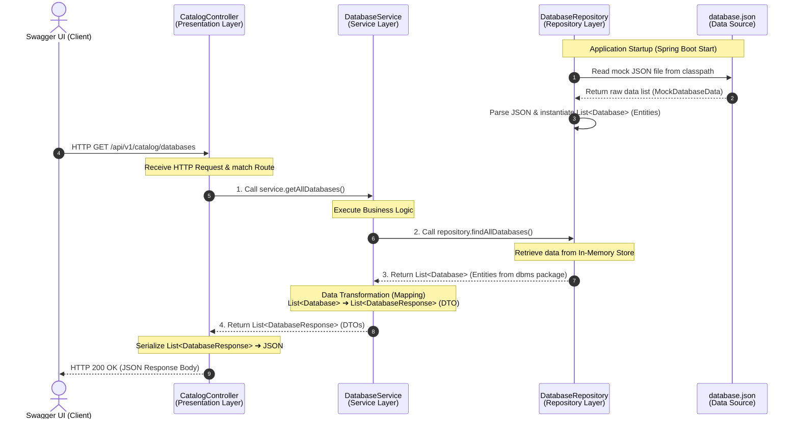
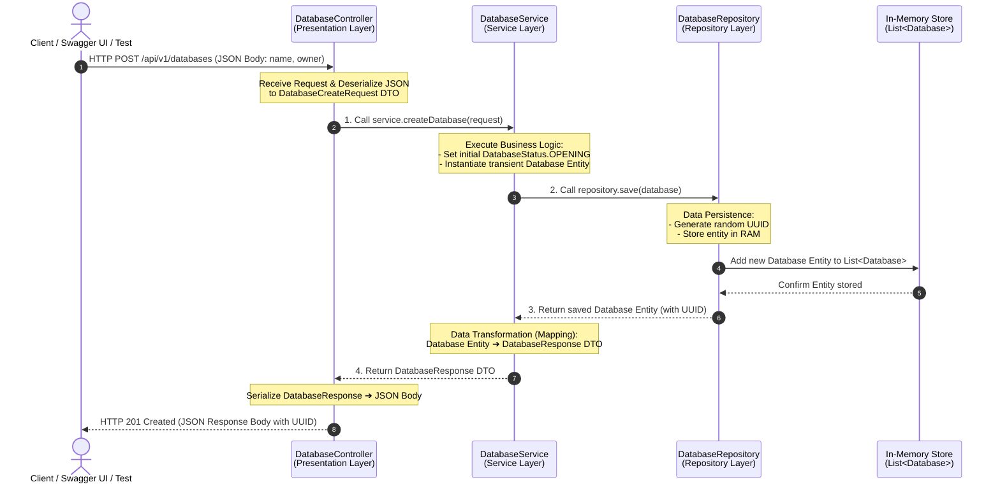

# DBMS REST API – API Tables

> Base URL: `http://localhost:8080/api/v1`

The interactive REST API documentation is available through Swagger UI: [View DBMS REST API Documentation](https://huy1801214.github.io/dbms-architecture/)

## 1. Catalog APIs

Browse and search metadata stored in the system catalog.

| No. | API Name | Method | Endpoint | Description | Request | Success Response |
|---:|---|:---:|---|---|---|---|
| 1 | List databases in catalog | `GET` | `/catalog/databases` | Retrieves all databases registered in the system catalog. This operation reads metadata only and does not open or load the databases. | Optional page query parameter, Optional size query parameter, Optional sort query parameter | `200 OK` — List of database resources (Database List Response) |
| 2 | List schemas in catalog database | `GET` | `/catalog/databases/{databaseId}/schemas` | Retrieves all schemas that belong to the specified database from the system catalog. | database Id path parameter, Optional page query parameter, Optional size query parameter, Optional sort query parameter | `200 OK` — List of schema resources (Schema List Response) |
| 3 | List objects in catalog schema | `GET` | `/catalog/schemas/{schemaId}/objects` | Retrieves database objects that belong to the specified schema, such as tables, views, stored procedures, and sequences. | schema Id path parameter, Optional page query parameter, Optional size query parameter, Optional sort query parameter | `200 OK` — Catalog objects (List<object>) |
| 4 | Search catalog objects | `GET` | `/catalog/search` | Searches the system catalog for database objects by keyword and optional object type. | q query parameter, Optional type query parameter, Optional page query parameter, Optional size query parameter, Optional sort query parameter | `200 OK` — Search results (List<object>) |

### Sequence Diagram (`GET /catalog/databases`)

## 2. Databases APIs

Manage database lifecycle and database metadata.

| No. | API Name | Method | Endpoint | Description | Request | Success Response |
|---:|---|:---:|---|---|---|---|
| 1 | List database resources | `GET` | `/databases` | Retrieves the databases that the current user is authorized to view. Pagination and sorting are supported. | Optional page query parameter, Optional size query parameter, Optional sort query parameter | `200 OK` — List of database resources (Database List Response) |
| 2 | Create database | `POST` | `/databases` | Creates the metadata and initial structure for a new database. The system validates duplicate names, storage configuration, and applicable business rules before creation. | Body: Database Create Request | `201 Created` — Database created successfully (Database) |
| 3 | Get database | `GET` | `/databases/{databaseId}` | Retrieves detailed information about a database by its databaseId, including its name, current state, and timestamps. | database Id path parameter | `200 OK` — Database returned successfully (Database) |
| 4 | Update database | `PATCH` | `/databases/{databaseId}` | Partially updates the configuration or metadata of a database. Only fields included in the request body are changed. | database Id path parameter Body: Database Update Request | `200 OK` — Database updated successfully (Database) |
| 5 | Delete database | `DELETE` | `/databases/{databaseId}` | Deletes a database and its related metadata. The operation may be rejected when the database is open or still has unresolved dependencies. | database Id path parameter | `204 No Content` — Operation completed successfully |
| 6 | Open database | `POST` | `/databases/{databaseId}/actions/open` | Opens the database and changes it to a state in which it can accept queries and data operations. | database Id path parameter | `200 OK` — Database open operation completed (Action Response) |
| 7 | Close database | `POST` | `/databases/{databaseId}/actions/close` | Closes the database, prevents new operations, and releases the resources currently associated with it. | database Id path parameter | `200 OK` — Database close operation completed (Action Response) |

### Sequence Diagram (`POST /databases`)

## 3. Schemas APIs

Manage schemas within a database.

| No. | API Name | Method | Endpoint | Description | Request | Success Response |
|---:|---|:---:|---|---|---|---|
| 1 | List schema resources | `GET` | `/databases/{databaseId}/schemas` | Retrieves all schemas that belong to the specified database. | database Id path parameter, Optional page query parameter, Optional size query parameter, Optional sort query parameter | `200 OK` — List of schema resources (Schema List Response) |
| 2 | Create schema | `POST` | `/databases/{databaseId}/schemas` | Creates a new schema inside the specified database. | database Id path parameter Body: Schema Create Request | `201 Created` — Schema created successfully (Schema) |
| 3 | Get schema | `GET` | `/databases/{databaseId}/schemas/{schemaId}` | Retrieves detailed metadata for a specific schema. | database Id path parameter, schema Id path parameter | `200 OK` — Schema returned successfully (Schema) |
| 4 | Update schema | `PATCH` | `/databases/{databaseId}/schemas/{schemaId}` | Updates the schema name or other schema metadata that can be modified. | database Id path parameter, schema Id path parameter Body: Schema Update Request | `200 OK` — Schema updated successfully (Schema) |
| 5 | Delete schema | `DELETE` | `/databases/{databaseId}/schemas/{schemaId}` | Deletes a schema. The operation may fail if the schema still contains database objects. | database Id path parameter, schema Id path parameter | `204 No Content` — Operation completed successfully |

## 4. Tables APIs

Manage tables within a schema.

| No. | API Name | Method | Endpoint | Description | Request | Success Response |
|---:|---|:---:|---|---|---|---|
| 1 | List table resources | `GET` | `/schemas/{schemaId}/tables` | Retrieves all tables that belong to the specified schema. | schema Id path parameter, Optional page query parameter, Optional size query parameter, Optional sort query parameter | `200 OK` — List of table resources (Table List Response) |
| 2 | Create table | `POST` | `/schemas/{schemaId}/tables` | Creates a new table in the specified schema using the supplied table name and initial structure. | schema Id path parameter Body: Table Create Request | `201 Created` — Table created successfully (Table) |
| 3 | Get table | `GET` | `/schemas/{schemaId}/tables/{tableId}` | Retrieves the metadata and structural information of a specific table. | schema Id path parameter, table Id path parameter | `200 OK` — Table returned successfully (Table) |
| 4 | Update table | `PATCH` | `/schemas/{schemaId}/tables/{tableId}` | Updates table metadata or other table properties that can be modified. | schema Id path parameter, table Id path parameter Body: Table Update Request | `200 OK` — Table updated successfully (Table) |
| 5 | Delete table | `DELETE` | `/schemas/{schemaId}/tables/{tableId}` | Deletes a table together with its data and dependent objects according to the configured deletion policy. | schema Id path parameter, table Id path parameter | `204 No Content` — Operation completed successfully |

## 5. Columns APIs

Manage columns within a table.

| No. | API Name | Method | Endpoint | Description | Request | Success Response |
|---:|---|:---:|---|---|---|---|
| 1 | List column resources | `GET` | `/tables/{tableId}/columns` | Retrieves all columns of a table, including their defined order. | table Id path parameter, Optional page query parameter, Optional size query parameter, Optional sort query parameter | `200 OK` — List of column resources (Column List Response) |
| 2 | Create column | `POST` | `/tables/{tableId}/columns` | Adds a new column to a table with its name, data type, nullability, and other column properties. | table Id path parameter Body: Column Create Request | `201 Created` — Column created successfully (Column) |
| 3 | Get column | `GET` | `/tables/{tableId}/columns/{columnId}` | Retrieves the complete definition of a specific column. | table Id path parameter, column Id path parameter | `200 OK` — Column returned successfully (Column) |
| 4 | Update column | `PATCH` | `/tables/{tableId}/columns/{columnId}` | Updates a column definition, such as its name, data type, or nullability. | table Id path parameter, column Id path parameter Body: Column Update Request | `200 OK` — Column updated successfully (Column) |
| 5 | Delete column | `DELETE` | `/tables/{tableId}/columns/{columnId}` | Deletes a column from a table. The system checks constraints, indexes, and dependencies before removal. | table Id path parameter, column Id path parameter | `204 No Content` — Operation completed successfully |

## 6. Constraints APIs

Manage and validate table constraints.

| No. | API Name | Method | Endpoint | Description | Request | Success Response |
|---:|---|:---:|---|---|---|---|
| 1 | List constraints | `GET` | `/tables/{tableId}/constraints` | Retrieves all constraints defined on the specified table. | table Id path parameter, Optional page query parameter, Optional size query parameter, Optional sort query parameter | `200 OK` — List of constraint resources (Constraint List Response) |
| 2 | Create constraint | `POST` | `/tables/{tableId}/constraints` | Creates a table constraint such as a primary key, foreign key, unique constraint, or check constraint. | table Id path parameter Body: Constraint Create Request | `201 Created` — Constraint created successfully (Constraint) |
| 3 | Get constraint | `GET` | `/tables/{tableId}/constraints/{constraintId}` | Retrieves the detailed definition and current state of a constraint. | table Id path parameter, constraint Id path parameter | `200 OK` — Constraint returned successfully (Constraint) |
| 4 | Delete constraint | `DELETE` | `/tables/{tableId}/constraints/{constraintId}` | Removes a constraint from its table. | table Id path parameter, constraint Id path parameter | `204 No Content` — Operation completed successfully |
| 5 | Enable constraint | `POST` | `/tables/{tableId}/constraints/{constraintId}/actions/enable` | Enables a constraint so that it is enforced for subsequent data operations. | table Id path parameter, constraint Id path parameter | `200 OK` — Constraint enable operation completed (Action Response) |
| 6 | Disable constraint | `POST` | `/tables/{tableId}/constraints/{constraintId}/actions/disable` | Temporarily disables a constraint without removing its definition. | table Id path parameter, constraint Id path parameter | `200 OK` — Constraint disable operation completed (Action Response) |
| 7 | Validate constraint | `POST` | `/tables/{tableId}/constraints/{constraintId}/actions/validate` | Checks whether the existing data in the table satisfies the specified constraint. | table Id path parameter, constraint Id path parameter | `200 OK` — Constraint validate operation completed (Action Response) |

## 7. Indexes APIs

Manage index definitions, lifecycle, and build operations.

| No. | API Name | Method | Endpoint | Description | Request | Success Response |
|---:|---|:---:|---|---|---|---|
| 1 | List indexes | `GET` | `/tables/{tableId}/indexes` | Retrieves all indexes defined on the specified table. | table Id path parameter, Optional page query parameter, Optional size query parameter, Optional sort query parameter | `200 OK` — List of index resources (Index List Response) |
| 2 | Create index | `POST` | `/tables/{tableId}/indexes` | Creates a new index definition for one or more columns of a table. | table Id path parameter Body: Index Create Request | `201 Created` — Index created successfully (Index) |
| 3 | Get index | `GET` | `/tables/{tableId}/indexes/{indexId}` | Retrieves the configuration, current state, and metadata of a specific index. | table Id path parameter, index Id path parameter | `200 OK` — Index returned successfully (Index) |
| 4 | Delete index | `DELETE` | `/tables/{tableId}/indexes/{indexId}` | Deletes an index and releases its associated storage structures. | table Id path parameter, index Id path parameter | `204 No Content` — Operation completed successfully |
| 5 | Build index | `POST` | `/tables/{tableId}/indexes/{indexId}/actions/build` | Builds the physical index structure from the table's current data. | table Id path parameter, index Id path parameter | `200 OK` — Index build operation completed (Action Response) |
| 6 | Rebuild index | `POST` | `/tables/{tableId}/indexes/{indexId}/actions/rebuild` | Rebuilds an index to repair it or optimize its physical storage structure. | table Id path parameter, index Id path parameter | `200 OK` — Index rebuild operation completed (Action Response) |
| 7 | Enable index | `POST` | `/tables/{tableId}/indexes/{indexId}/actions/enable` | Enables the index so that it can be considered by the query optimizer. | table Id path parameter, index Id path parameter | `200 OK` — Index enable operation completed (Action Response) |
| 8 | Disable index | `POST` | `/tables/{tableId}/indexes/{indexId}/actions/disable` | Prevents the query optimizer from using the index without deleting it. | table Id path parameter, index Id path parameter | `200 OK` — Index disable operation completed (Action Response) |

## 8. Partitions APIs

Manage table partitions.

| No. | API Name | Method | Endpoint | Description | Request | Success Response |
|---:|---|:---:|---|---|---|---|
| 1 | List partition resources | `GET` | `/tables/{tableId}/partitions` | Retrieves all partitions defined for the specified table. | table Id path parameter, Optional page query parameter, Optional size query parameter, Optional sort query parameter | `200 OK` — List of partition resources (Partition List Response) |
| 2 | Create partition | `POST` | `/tables/{tableId}/partitions` | Creates a new table partition according to the configured partitioning strategy. | table Id path parameter Body: Partition Create Request | `201 Created` — Partition created successfully (Partition) |
| 3 | Get partition | `GET` | `/tables/{tableId}/partitions/{partitionId}` | Retrieves detailed information about a specific partition. | table Id path parameter, partition Id path parameter | `200 OK` — Partition returned successfully (Partition) |
| 4 | Update partition | `PATCH` | `/tables/{tableId}/partitions/{partitionId}` | Updates the metadata or modifiable configuration of a partition. | table Id path parameter, partition Id path parameter Body: Partition Update Request | `200 OK` — Partition updated successfully (Partition) |
| 5 | Delete partition | `DELETE` | `/tables/{tableId}/partitions/{partitionId}` | Deletes a partition according to the system's configured data-handling policy. | table Id path parameter, partition Id path parameter | `204 No Content` — Operation completed successfully |

## 9. Triggers APIs

Manage triggers associated with a table.

| No. | API Name | Method | Endpoint | Description | Request | Success Response |
|---:|---|:---:|---|---|---|---|
| 1 | List trigger resources | `GET` | `/tables/{tableId}/triggers` | Retrieves all triggers defined on the specified table. | table Id path parameter, Optional page query parameter, Optional size query parameter, Optional sort query parameter | `200 OK` — List of trigger resources (Trigger List Response) |
| 2 | Create trigger | `POST` | `/tables/{tableId}/triggers` | Creates a trigger for a table and associates it with an INSERT, UPDATE, or DELETE event. | table Id path parameter Body: Trigger Create Request | `201 Created` — Trigger created successfully (Trigger) |
| 3 | Get trigger | `GET` | `/tables/{tableId}/triggers/{triggerId}` | Retrieves the definition and current state of a specific trigger. | table Id path parameter, trigger Id path parameter | `200 OK` — Trigger returned successfully (Trigger) |
| 4 | Update trigger | `PATCH` | `/tables/{tableId}/triggers/{triggerId}` | Updates the trigger body, triggering event, or related metadata. | table Id path parameter, trigger Id path parameter Body: Trigger Update Request | `200 OK` — Trigger updated successfully (Trigger) |
| 5 | Delete trigger | `DELETE` | `/tables/{tableId}/triggers/{triggerId}` | Removes a trigger from its table. | table Id path parameter, trigger Id path parameter | `204 No Content` — Operation completed successfully |
| 6 | Enable trigger | `POST` | `/tables/{tableId}/triggers/{triggerId}/actions/enable` | Enables a trigger so that it runs when the associated event occurs. | table Id path parameter, trigger Id path parameter | `200 OK` — Trigger enable operation completed (Action Response) |
| 7 | Disable trigger | `POST` | `/tables/{tableId}/triggers/{triggerId}/actions/disable` | Temporarily disables a trigger without deleting its definition. | table Id path parameter, trigger Id path parameter | `200 OK` — Trigger disable operation completed (Action Response) |

## 10. Views APIs

Manage views within a schema.

| No. | API Name | Method | Endpoint | Description | Request | Success Response |
|---:|---|:---:|---|---|---|---|
| 1 | List view resources | `GET` | `/schemas/{schemaId}/views` | Retrieves all views that belong to the specified schema. | schema Id path parameter, Optional page query parameter, Optional size query parameter, Optional sort query parameter | `200 OK` — List of view resources (View List Response) |
| 2 | Create view | `POST` | `/schemas/{schemaId}/views` | Creates a new view in the specified schema from a SQL query definition. | schema Id path parameter Body: View Create Request | `201 Created` — View created successfully (View) |
| 3 | Get view | `GET` | `/schemas/{schemaId}/views/{viewId}` | Retrieves a view's metadata and SQL definition. | schema Id path parameter, view Id path parameter | `200 OK` — View returned successfully (View) |
| 4 | Update view | `PATCH` | `/schemas/{schemaId}/views/{viewId}` | Updates the name or SQL definition of a view. | schema Id path parameter, view Id path parameter Body: View Update Request | `200 OK` — View updated successfully (View) |
| 5 | Delete view | `DELETE` | `/schemas/{schemaId}/views/{viewId}` | Deletes a view from its schema. | schema Id path parameter, view Id path parameter | `204 No Content` — Operation completed successfully |

## 11. Stored Procedures APIs

Manage and execute stored procedures within a schema.

| No. | API Name | Method | Endpoint | Description | Request | Success Response |
|---:|---|:---:|---|---|---|---|
| 1 | List procedure resources | `GET` | `/schemas/{schemaId}/procedures` | Retrieves all stored procedures that belong to the specified schema. | schema Id path parameter, Optional page query parameter, Optional size query parameter, Optional sort query parameter | `200 OK` — List of procedure resources (Procedure List Response) |
| 2 | Create procedure | `POST` | `/schemas/{schemaId}/procedures` | Creates a new stored procedure in the specified schema. | schema Id path parameter Body: Procedure Create Request | `201 Created` — Procedure created successfully (Procedure) |
| 3 | Get procedure | `GET` | `/schemas/{schemaId}/procedures/{procedureId}` | Retrieves the definition and metadata of a stored procedure. | schema Id path parameter, procedure Id path parameter | `200 OK` — Procedure returned successfully (Procedure) |
| 4 | Update procedure | `PATCH` | `/schemas/{schemaId}/procedures/{procedureId}` | Updates the definition or metadata of a stored procedure. | schema Id path parameter, procedure Id path parameter Body: Procedure Update Request | `200 OK` — Procedure updated successfully (Procedure) |
| 5 | Delete procedure | `DELETE` | `/schemas/{schemaId}/procedures/{procedureId}` | Deletes a stored procedure from its schema. | schema Id path parameter, procedure Id path parameter | `204 No Content` — Operation completed successfully |
| 6 | Execute stored procedure | `POST` | `/schemas/{schemaId}/procedures/{procedureId}/actions/execute` | Executes a stored procedure using the supplied input parameters and returns the execution result. | schema Id path parameter, procedure Id path parameter Body: parameters, transaction Id | `200 OK` — Procedure execution result (object) |

## 12. Sequences APIs

Manage sequences within a schema.

| No. | API Name | Method | Endpoint | Description | Request | Success Response |
|---:|---|:---:|---|---|---|---|
| 1 | List sequence resources | `GET` | `/schemas/{schemaId}/sequences` | Retrieves all sequences that belong to the specified schema. | schema Id path parameter, Optional page query parameter, Optional size query parameter, Optional sort query parameter | `200 OK` — List of sequence resources (Sequence List Response) |
| 2 | Create sequence | `POST` | `/schemas/{schemaId}/sequences` | Creates a new sequence for generating ordered numeric values. | schema Id path parameter Body: Sequence Create Request | `201 Created` — Sequence created successfully (Sequence) |
| 3 | Get sequence | `GET` | `/schemas/{schemaId}/sequences/{sequenceId}` | Retrieves the configuration and current value of a sequence. | schema Id path parameter, sequence Id path parameter | `200 OK` — Sequence returned successfully (Sequence) |
| 4 | Update sequence | `PATCH` | `/schemas/{schemaId}/sequences/{sequenceId}` | Updates sequence settings such as its increment value or value limits. | schema Id path parameter, sequence Id path parameter Body: Sequence Update Request | `200 OK` — Sequence updated successfully (Sequence) |
| 5 | Delete sequence | `DELETE` | `/schemas/{schemaId}/sequences/{sequenceId}` | Deletes a sequence from its schema. | schema Id path parameter, sequence Id path parameter | `204 No Content` — Operation completed successfully |
| 6 | Get next sequence value | `POST` | `/schemas/{schemaId}/sequences/{sequenceId}/actions/next-value` | Generates and returns the next value of the sequence according to its current configuration. | schema Id path parameter, sequence Id path parameter | `200 OK` — Next sequence value (Sequence Value Response) |

## 13. Rows APIs

Perform CRUD operations on table rows.

| No. | API Name | Method | Endpoint | Description | Request | Success Response |
|---:|---|:---:|---|---|---|---|
| 1 | List rows | `GET` | `/tables/{tableId}/rows` | Retrieves rows from the specified table with optional pagination, sorting, and filtering. | table Id path parameter, Optional page query parameter, Optional size query parameter, Optional sort query parameter, Optional filter query parameter | `200 OK` — List of row resources (Row List Response) |
| 2 | Insert row | `POST` | `/tables/{tableId}/rows` | Inserts a new row into the table. The system validates data types, constraints, and transaction rules before writing the data. | table Id path parameter Body: Row Create Request | `201 Created` — Row inserted successfully (Row) |
| 3 | Get row | `GET` | `/tables/{tableId}/rows/{rowId}` | Retrieves a specific row by its rowId. | table Id path parameter, row Id path parameter | `200 OK` — Row returned successfully (Row) |
| 4 | Update row | `PATCH` | `/tables/{tableId}/rows/{rowId}` | Partially updates a row. Only the columns included in the request body are changed. | table Id path parameter, row Id path parameter Body: Row Update Request | `200 OK` — Row updated successfully (Row) |
| 5 | Delete row | `DELETE` | `/tables/{tableId}/rows/{rowId}` | Deletes a specific row from the table by its rowId. | table Id path parameter, row Id path parameter | `204 No Content` — Operation completed successfully |

## 14. Queries APIs

Submit, explain, inspect, and cancel SQL queries.

| No. | API Name | Method | Endpoint | Description | Request | Success Response |
|---:|---|:---:|---|---|---|---|
| 1 | Execute SQL query | `POST` | `/queries` | Submits a SQL statement to the query processing engine. The system parses, validates, optimizes, and executes the query, and the result may be returned asynchronously. | Body: sql (required), database Id, transaction Id, timeout Seconds, parameters | `202 Accepted` — Query accepted (Query Result) |
| 2 | Explain SQL query | `POST` | `/queries/explain` | Analyzes a SQL statement and returns its logical plan, physical plan, and estimated cost without necessarily executing the query. | Body: sql (required), database Id, analyze | `200 OK` — Query execution plan (Explain Result) |
| 3 | Get query status or result | `GET` | `/queries/{queryId}` | Retrieves the current status or execution result of a previously submitted query. | query Id path parameter | `200 OK` — Query status or result (Query Result) |
| 4 | Cancel query | `DELETE` | `/queries/{queryId}` | Requests cancellation of a query that is queued or currently running. | query Id path parameter | `202 Accepted` — Query cancellation accepted (Action Response) |

## 15. Transactions APIs

Begin, inspect, commit, and roll back transactions.

| No. | API Name | Method | Endpoint | Description | Request | Success Response |
|---:|---|:---:|---|---|---|---|
| 1 | Begin transaction | `POST` | `/transactions` | Starts a new transaction with an optional isolation level, read-only mode, and timeout. | Body: isolation Level, read Only, timeout Seconds | `201 Created` — Transaction started (Transaction) |
| 2 | Get transaction | `GET` | `/transactions/{transactionId}` | Retrieves the current state and metadata of a transaction. | transaction Id path parameter | `200 OK` — Transaction returned successfully (Transaction) |
| 3 | Commit transaction | `POST` | `/transactions/{transactionId}/commit` | Commits all changes made within the transaction and makes them permanent. | transaction Id path parameter | `200 OK` — Transaction commit completed (Transaction) |
| 4 | Rollback transaction | `POST` | `/transactions/{transactionId}/rollback` | Discards all uncommitted changes and restores the data to its state before the transaction. | transaction Id path parameter | `200 OK` — Transaction rollback completed (Transaction) |
