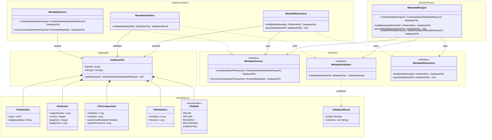

# File Metadata - High Level Class Diagram

```mermaid
classDiagram

namespace Aggregate {
    class DatabaseFile {
        +filePath: String
        +fileType: FileType
        +update(request: UpdateDatabaseMetadataRequest) void
    }
}

namespace ValueObjects {
    class FileIdentifier {
        +value: UUID
        +databaseName: String
    }
    class FileHeader {
        +magicNumber: Long
        +version: Integer
        +pageSize: Integer
        +pageCount: Long
    }
    class FileConfiguration {
        +initialSize: Long
        +maxSize: Long
        +autoGrowthEnabled: Boolean
        +growthIncrement: Long
    }
    class FileStatistics {
        +usedSize: Long
        +freeSize: Long
    }
    class FileState {
        <<enumeration>>
        ONLINE
        OFFLINE
        READONLY
        RECOVERING
        CORRUPTED
    }
    class ValidationResult {
        +isValid: Boolean
        +violations: List~String~
    }
}

namespace DomainService {
    class MetadataManager {
        +createMetadata(request: CreateDatabaseMetadataRequest) DatabaseFile
        +loadMetadata(fileIdentifier: FileIdentifier) DatabaseFile
        +persistMetadata(databaseFile: DatabaseFile) void
        +updateMetadata(request: UpdateDatabaseMetadataRequest) DatabaseFile
    }
}

namespace Interfaces {
    class IMetadataFactory {
        <<interface>>
        +createDatabaseFile(request: CreateDatabaseMetadataRequest) DatabaseFile
        +reconstructDatabaseFile(rawData: PersistedMetadata) DatabaseFile
    }
    class IMetadataValidator {
        <<interface>>
        +validate(databaseFile: DatabaseFile) ValidationResult
    }
    class IMetadataRepository {
        <<interface>>
        +findById(fileIdentifier: FileIdentifier) DatabaseFile
        +persist(databaseFile: DatabaseFile) void
    }
}

namespace Implementations {
    class MetadataFactory {
        +createDatabaseFile(request: CreateDatabaseMetadataRequest) DatabaseFile
        +reconstructDatabaseFile(rawData: PersistedMetadata) DatabaseFile
    }
    class MetadataValidator {
        +validate(databaseFile: DatabaseFile) ValidationResult
    }
    class MetadataRepository {
        +findById(fileIdentifier: FileIdentifier) DatabaseFile
        +persist(databaseFile: DatabaseFile) void
    }
}

%% ─────────────────── Composition: DatabaseFile Aggregate ───────────────────

DatabaseFile *-- FileHeader
DatabaseFile *-- FileIdentifier
DatabaseFile *-- FileConfiguration
DatabaseFile *-- FileStatistics
DatabaseFile *-- FileState

%% ─────────────────── Interface Implementations ───────────────────

MetadataFactory ..|> IMetadataFactory
MetadataValidator ..|> IMetadataValidator
MetadataRepository ..|> IMetadataRepository

%% ─────────────────── Domain Relationships ───────────────────

MetadataFactory --> DatabaseFile : creates
MetadataValidator --> DatabaseFile : validates
MetadataRepository --> DatabaseFile : persists
MetadataRepository --> IMetadataFactory : uses
IMetadataValidator ..> ValidationResult : produces

%% ─────────────────── MetadataManager Dependencies (DIP) ───────────────────

MetadataManager --> IMetadataFactory : uses
MetadataManager --> IMetadataValidator : uses
MetadataManager --> IMetadataRepository : uses
```