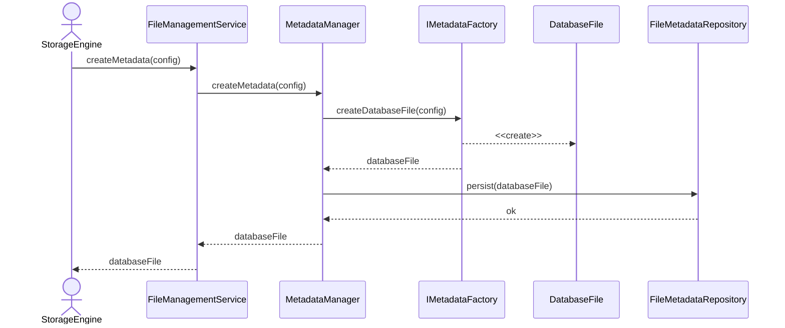

# Create Database Metadata

## Group: Lifecycle

## Description

Creates a new `DatabaseFile` aggregate with all associated metadata components (header, identifier, configuration, state) and persists it to disk.

---

