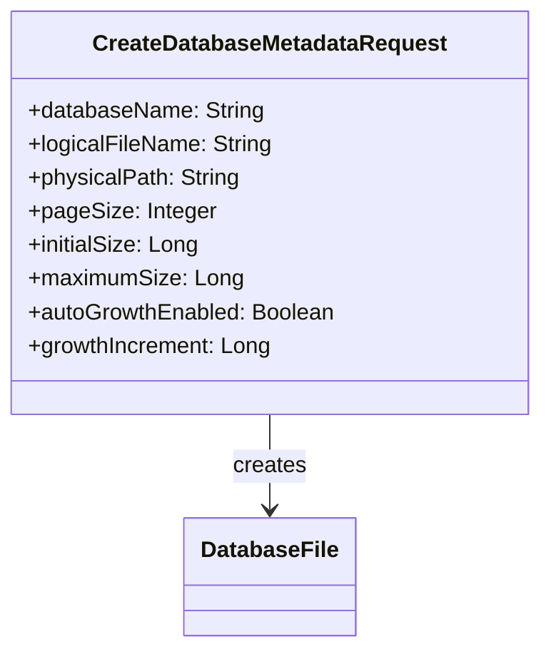
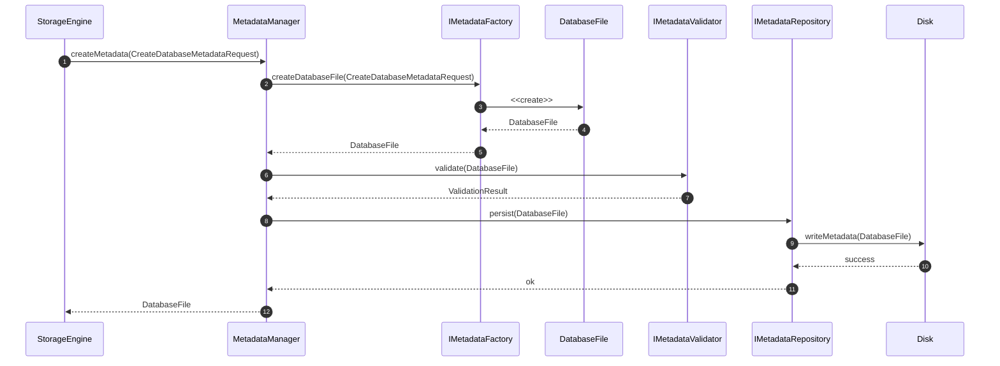
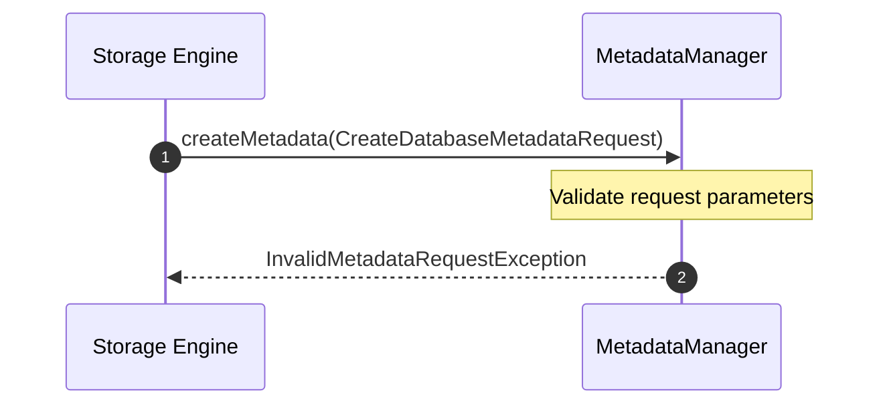
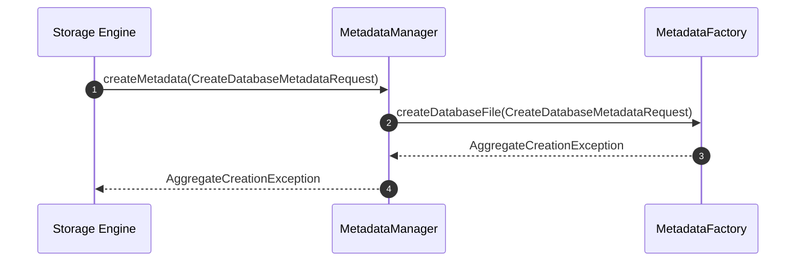
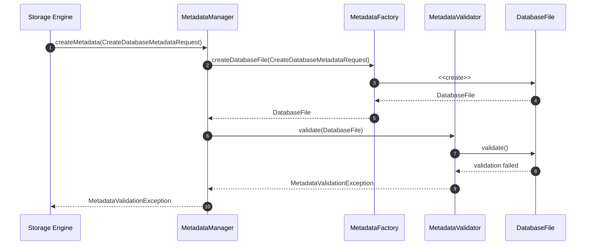
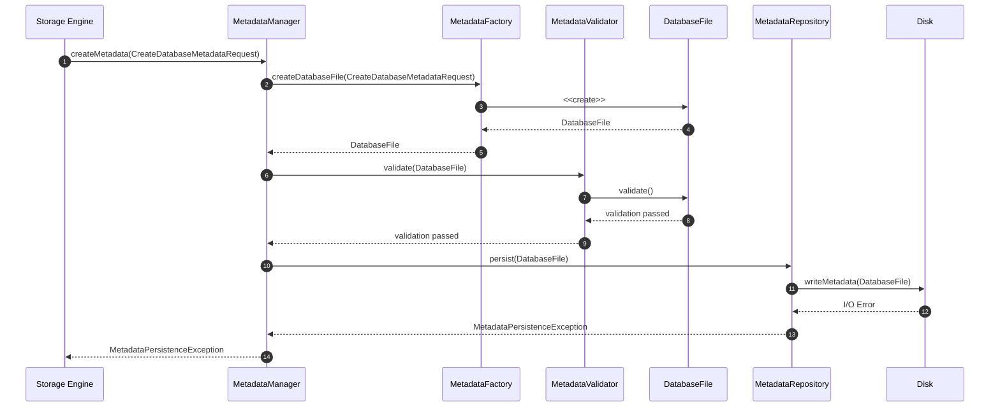

# UC-FM-001 - Create Database Metadata

## Group

Metadata Lifecycle

---

## Purpose

Create a new `DatabaseFile` aggregate, validate its metadata, and persist it to disk so that the database file is fully initialized and ready for use.

---

# Request DTO

## CreateDatabaseMetadataRequest

---

## Preconditions

- A valid database creation request is received.
- The requested database can be created in the target location.
- Required metadata information is available.

---

## Postconditions

- A valid `DatabaseFile` aggregate has been created.
- The metadata has been successfully validated.
- The metadata has been persisted to disk.
- The initialized `DatabaseFile` is returned to the caller.

---

## Happy Path

## Failure Paths
### Failure Path 1 - Invalid Request
**Purpose**

Reject the request because one or more input parameters are invalid before any domain object is created.

---

### Failure Path 2 - Aggregate Creation Failed
**Purpose**

Abort the operation because MetadataFactory cannot create a valid DatabaseFile aggregate.

---

### Failure Path 3 - Metadata Validation Failed
**Purpose**

Abort the operation because the created DatabaseFile violates domain validation rules.

---

### Failure Path 4 - Metadata Persistence Failed
**Purpose**

Abort the operation because metadata cannot be persisted to disk.

---
