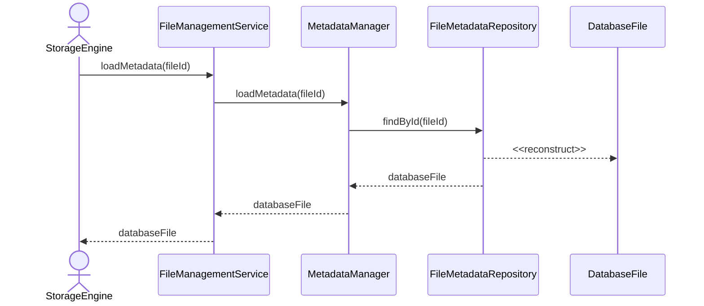

# Load Metadata from Disk

## Group: Lifecycle

## Description

Loads an existing `DatabaseFile` aggregate from persistent storage by file identifier and restores it into memory.

---

```mermaid
sequenceDiagram
    actor StorageEngine
    participant FileManagementService
    participant MetadataManager
    participant FileMetadataRepository
    participant DatabaseFile

    StorageEngine->>FileManagementService: loadMetadata(fileId)
    FileManagementService->>MetadataManager: loadMetadata(fileId)

    MetadataManager->>FileMetadataRepository: findById(fileId)
    FileMetadataRepository-->>DatabaseFile: <<reconstruct>>
    FileMetadataRepository-->>MetadataManager: databaseFile

    MetadataManager-->>FileManagementService: databaseFile
    FileManagementService-->>StorageEngine: databaseFile
```
