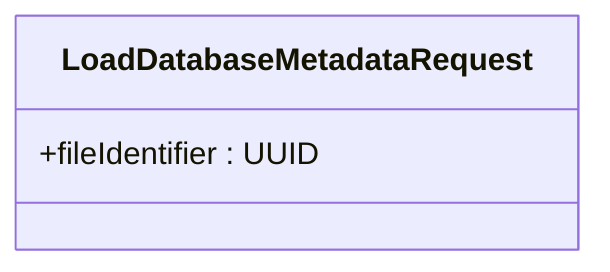
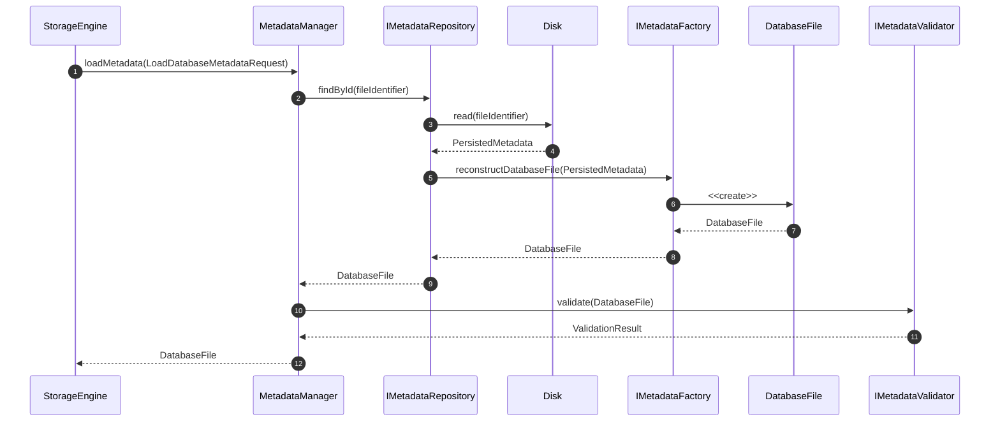
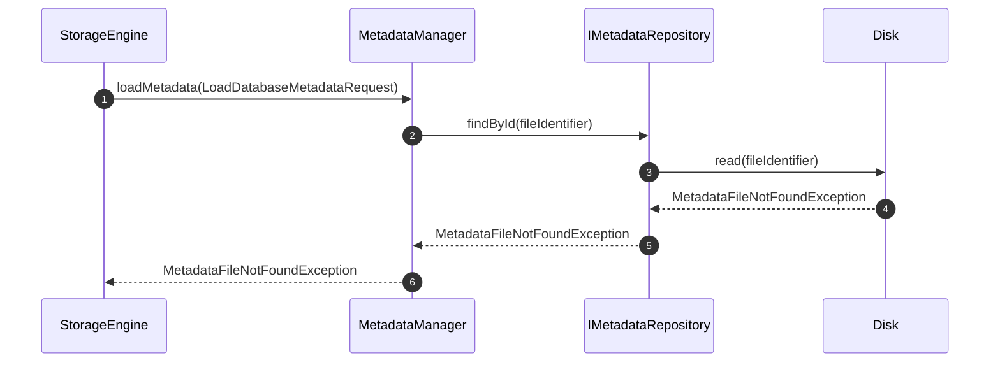
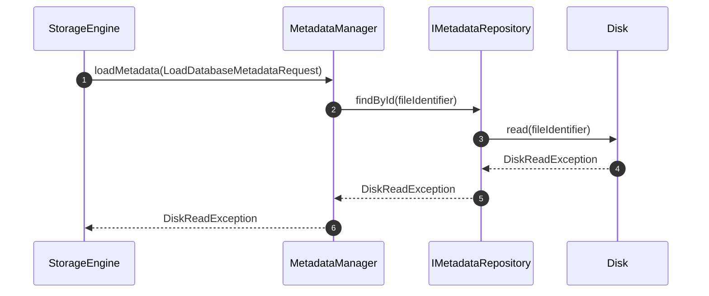
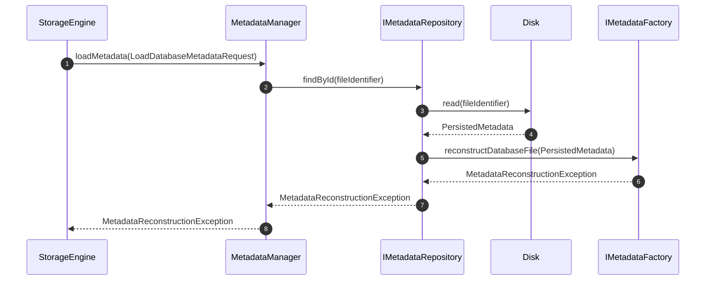
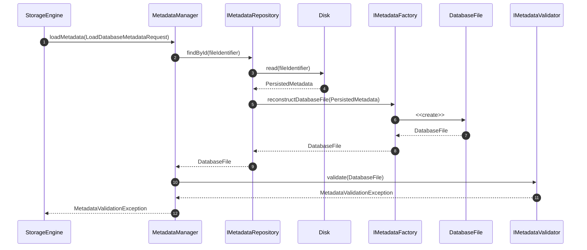

# UC-FM-002 - Load Metadata From Disk

## Group

Metadata Lifecycle

---

## Purpose

Load an existing `DatabaseFile` aggregate from persistent storage, reconstruct all metadata components, validate the reconstructed aggregate, and make it available for use by the Storage Engine.

---

# Request DTO

## LoadDatabaseMetadataRequest

---

## Preconditions

- The target metadata file exists on disk.
- The Storage Engine provides a valid metadata file location.
- The storage device is accessible.

---

## Postconditions

- The metadata has been successfully loaded from disk.
- A valid `DatabaseFile` aggregate has been reconstructed.
- The reconstructed aggregate has passed domain validation.
- The initialized `DatabaseFile` is returned to the Storage Engine.

---

## Happy Path

## Failure Paths

### Failure Path 1 - Metadata File Not Found

**Purpose**

Abort the operation because the requested metadata file does not exist on disk.

---

---

### Failure Path 2 - Disk Read Failed

**Purpose**

Abort the operation because metadata cannot be read from the storage device.

---

---

### Failure Path 3 - Metadata Reconstruction Failed

**Purpose**

Abort the operation because `IMetadataFactory` cannot reconstruct a valid `DatabaseFile` aggregate from the persisted data.

---

---

### Failure Path 4 - Metadata Validation Failed

**Purpose**

Abort the operation because the reconstructed `DatabaseFile` aggregate violates domain validation rules.

---

---