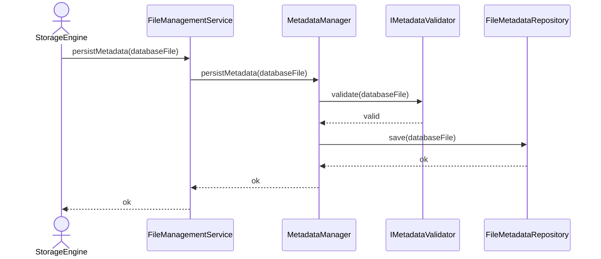

# Persist Metadata to Disk

## Group: Lifecycle

## Description

Validates the in-memory `DatabaseFile` aggregate and writes its current state to persistent storage.

---

```mermaid
sequenceDiagram
    actor StorageEngine
    participant FileManagementService
    participant MetadataManager
    participant IMetadataValidator
    participant FileMetadataRepository

    StorageEngine->>FileManagementService: persistMetadata(databaseFile)
    FileManagementService->>MetadataManager: persistMetadata(databaseFile)

    MetadataManager->>IMetadataValidator: validate(databaseFile)
    IMetadataValidator-->>MetadataManager: valid

    MetadataManager->>FileMetadataRepository: save(databaseFile)
    FileMetadataRepository-->>MetadataManager: ok

    MetadataManager-->>FileManagementService: ok
    FileManagementService-->>StorageEngine: ok
```
