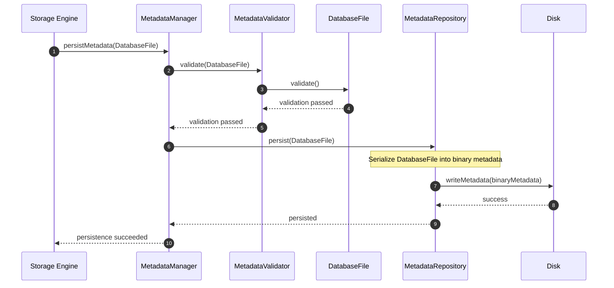
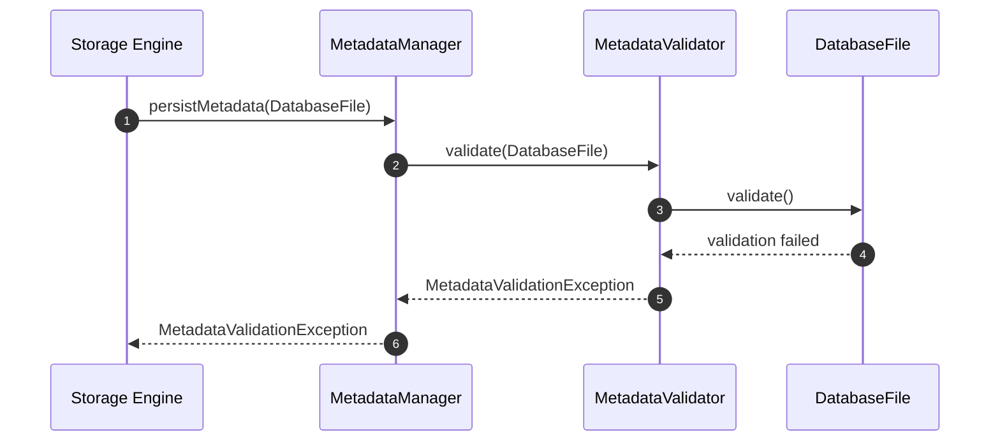
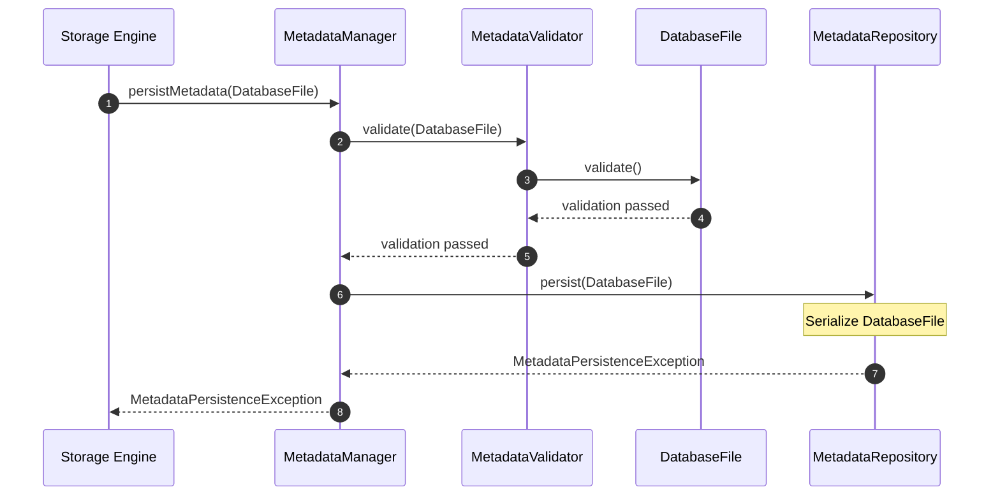
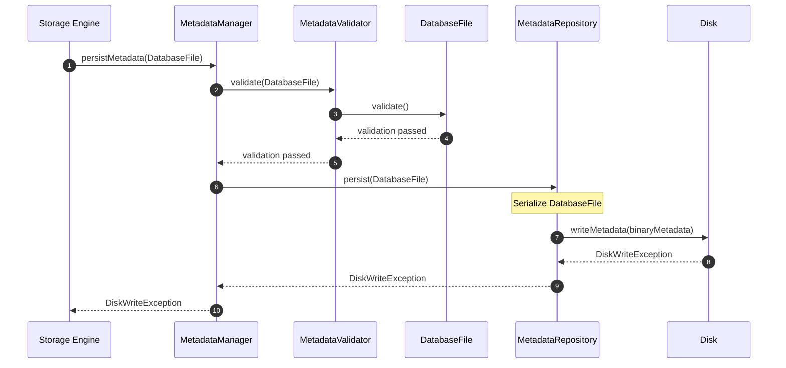

# UC-FM-003 - Persist Metadata To Disk

## Group

Metadata Persistence

---

## Purpose

Persist the current DatabaseFile aggregate to persistent storage so that all metadata changes are durably stored and recoverable.

---

## Preconditions

- A valid DatabaseFile aggregate exists in memory.
- The aggregate has passed domain validation.
- The storage device is available.

---

## Postconditions

- The metadata has been successfully written to persistent storage.
- The stored metadata reflects the current state of the DatabaseFile aggregate.

---

## Happy Path

## Failure Paths

### Failure Path 1 - Metadata Validation Failed

**Purpose**

Abort the operation because the DatabaseFile aggregate violates domain validation rules and cannot be safely persisted.

---

---

### Failure Path 2 - Metadata Persistence Failed

**Purpose**

Abort the operation because the DatabaseFile aggregate cannot be converted into a valid persistent metadata format.

---

---

### Failure Path 3 - Disk Write Failed

**Purpose**

Abort the operation because the metadata cannot be written to persistent storage.

---

