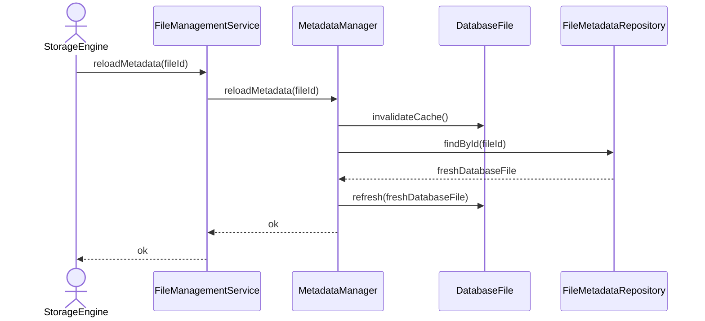

# Reload Metadata

## Group: Lifecycle

## Description

Invalidates the current in-memory metadata cache and reloads the `DatabaseFile` aggregate fresh from persistent storage, ensuring the in-memory state reflects the latest on-disk state.

---

