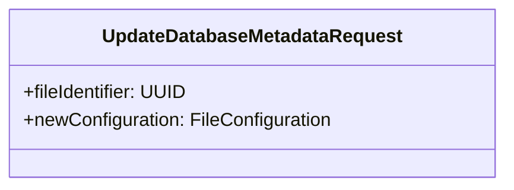
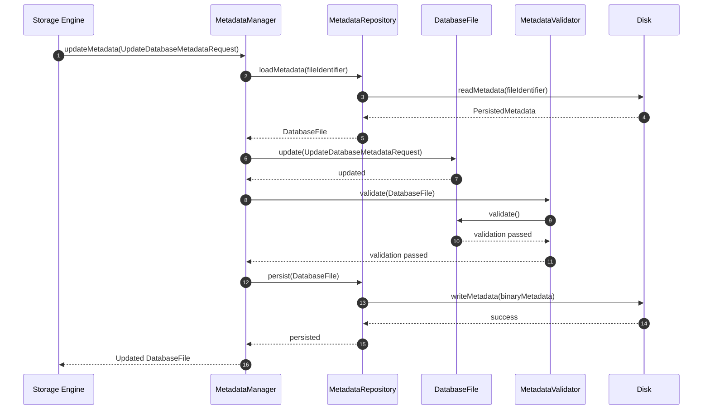
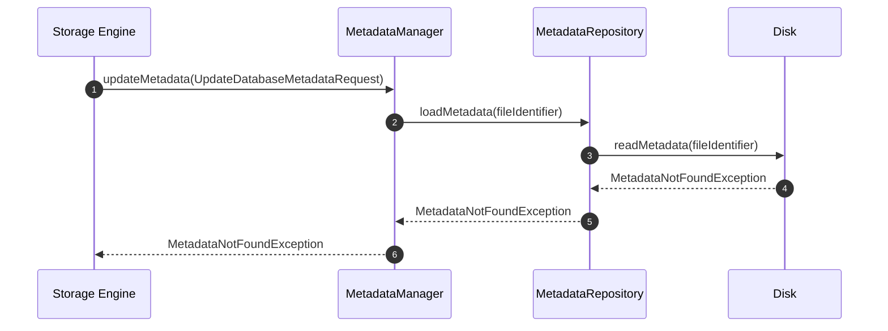
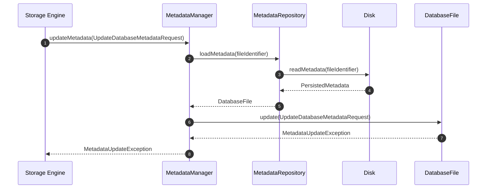
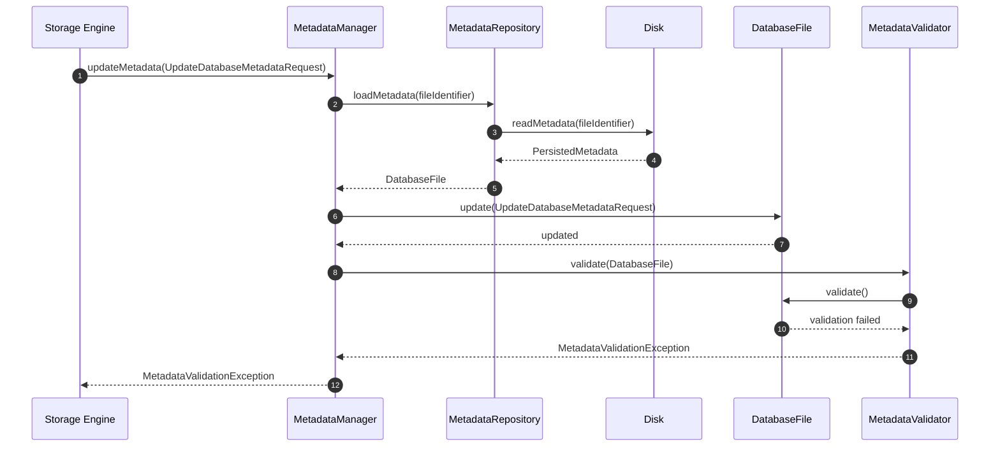
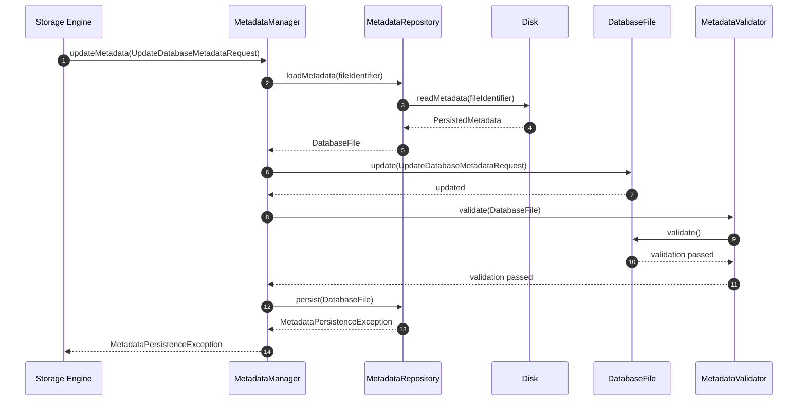

# UC-FM-004 - Update Metadata

## Group

Metadata Lifecycle

---

## Purpose

Update the metadata of an existing DatabaseFile aggregate, validate the changes, and persist the updated metadata to disk.

---

# Request DTO

## UpdateDatabaseMetadataRequest

---

## Preconditions

- The target DatabaseFile exists.
- The metadata has been loaded into memory.
- A valid metadata update request is received.
---

## Postconditions

- The DatabaseFile aggregate has been updated.
- The updated metadata has passed validation.
- The updated metadata has been persisted.

---

## Happy Path

## Failure Paths

### Failure Path 1 - Metadata Not Found

**Purpose**

Abort the operation because the requested metadata cannot be found.

---

---

### Failure Path 2 - Metadata Update Failed

**Purpose**

Abort the operation because the DatabaseFile aggregate rejects the requested metadata changes.

---

---

### Failure Path 3 - Metadata Validation Failed

**Purpose**

Abort the operation because the updated DatabaseFile aggregate violates domain validation rules.

---

---

### Failure Path 4 - Metadata Persistence Failed

**Purpose**

Abort the operation because the updated metadata cannot be persisted successfully.

---

