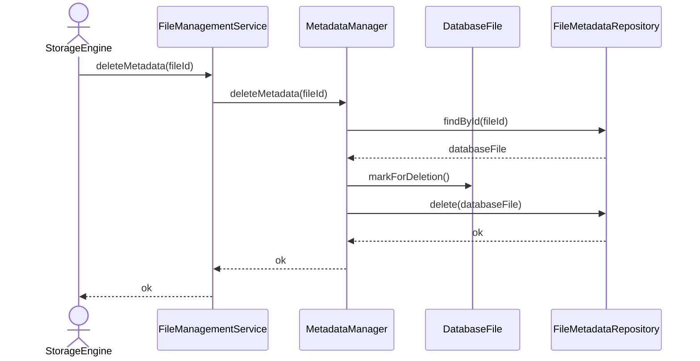

# Delete Database Metadata

## Group: Lifecycle

## Description

Marks the `DatabaseFile` aggregate for deletion, then removes its metadata from persistent storage, completing the lifecycle.

---

```mermaid
sequenceDiagram
    actor StorageEngine
    participant FileManagementService
    participant MetadataManager
    participant DatabaseFile
    participant FileMetadataRepository

    StorageEngine->>FileManagementService: deleteMetadata(fileId)
    FileManagementService->>MetadataManager: deleteMetadata(fileId)

    MetadataManager->>FileMetadataRepository: findById(fileId)
    FileMetadataRepository-->>MetadataManager: databaseFile

    MetadataManager->>DatabaseFile: markForDeletion()

    MetadataManager->>FileMetadataRepository: delete(databaseFile)
    FileMetadataRepository-->>MetadataManager: ok

    MetadataManager-->>FileManagementService: ok
    FileManagementService-->>StorageEngine: ok
```
