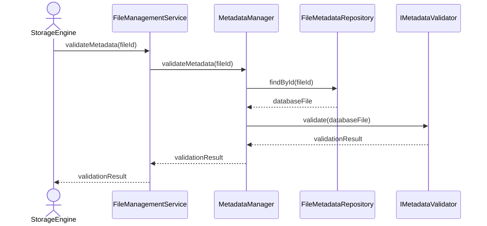

# Validate Metadata

## Group: Validation

## Description

Loads the `DatabaseFile` aggregate and runs full metadata validation through the `IMetadataValidator` abstraction, returning a structured validation result.

---

