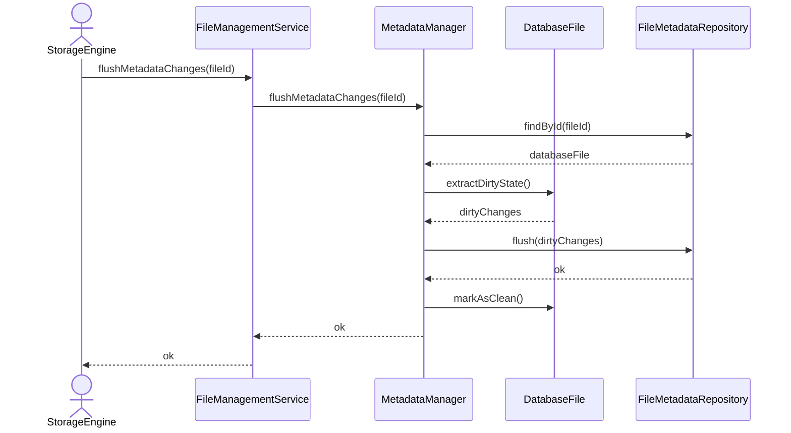

# Flush Pending Metadata Changes

## Group: Synchronization

## Description

Extracts dirty (unsaved) metadata changes from the `DatabaseFile` aggregate, flushes them to persistent storage, and marks the aggregate as clean.

---

