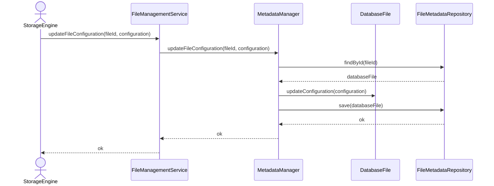

# Update File Configuration

## Group: Management

## Description

Loads the `DatabaseFile` aggregate, applies an updated `FileConfiguration` value object, and persists the changes to disk.

---

```mermaid
sequenceDiagram
    actor StorageEngine
    participant FileManagementService
    participant MetadataManager
    participant DatabaseFile
    participant FileMetadataRepository

    StorageEngine->>FileManagementService: updateFileConfiguration(fileId, configuration)
    FileManagementService->>MetadataManager: updateFileConfiguration(fileId, configuration)

    MetadataManager->>FileMetadataRepository: findById(fileId)
    FileMetadataRepository-->>MetadataManager: databaseFile

    MetadataManager->>DatabaseFile: updateConfiguration(configuration)

    MetadataManager->>FileMetadataRepository: save(databaseFile)
    FileMetadataRepository-->>MetadataManager: ok

    MetadataManager-->>FileManagementService: ok
    FileManagementService-->>StorageEngine: ok
```
