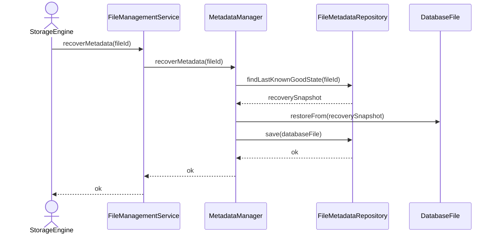

# Recover Metadata

## Group: Recovery

## Description

Locates the last known good snapshot of the `DatabaseFile` aggregate from persistent storage, restores the aggregate to that state, and persists the recovered version.

---

