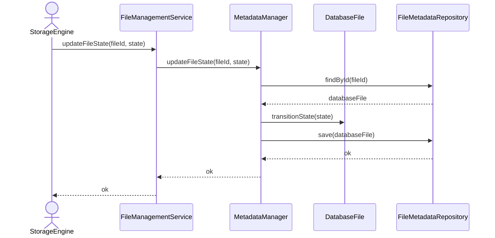

# Update File State

## Group: Management

## Description

Loads the `DatabaseFile` aggregate, transitions its `FileState` value object to a new state, and persists the updated aggregate to disk.

---

