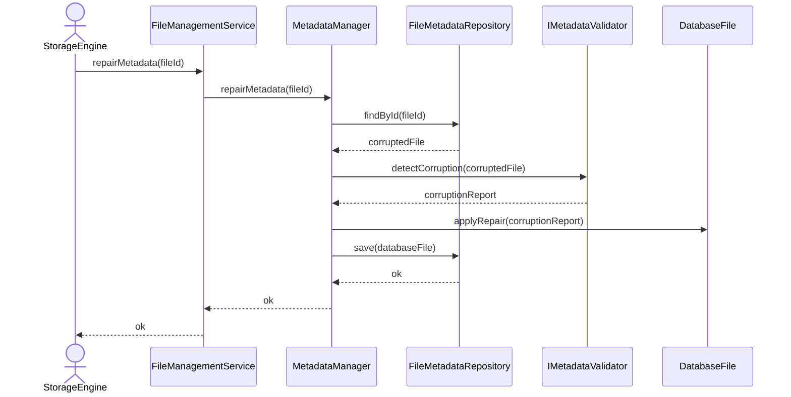

# Repair Corrupted Metadata

## Group: Recovery

## Description

Detects corruption within the `DatabaseFile` aggregate using the `IMetadataValidator`, applies targeted repairs to the affected components, and persists the repaired state to disk.

---

