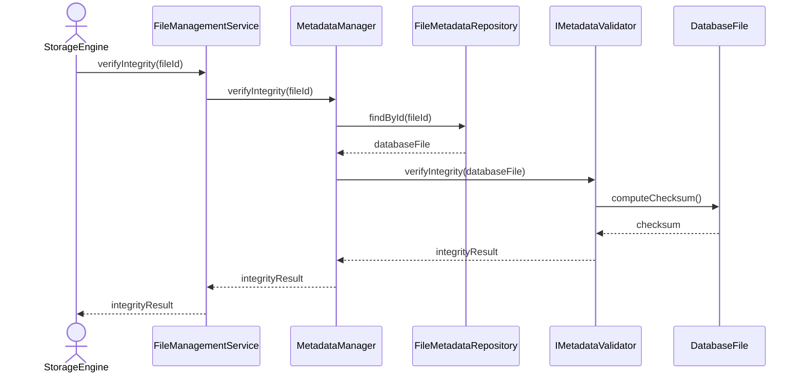

# Verify Metadata Integrity

## Group: Validation

## Description

Loads the `DatabaseFile` aggregate and verifies the physical integrity of its metadata by checking checksums and structural invariants through the `IMetadataValidator`.

---

