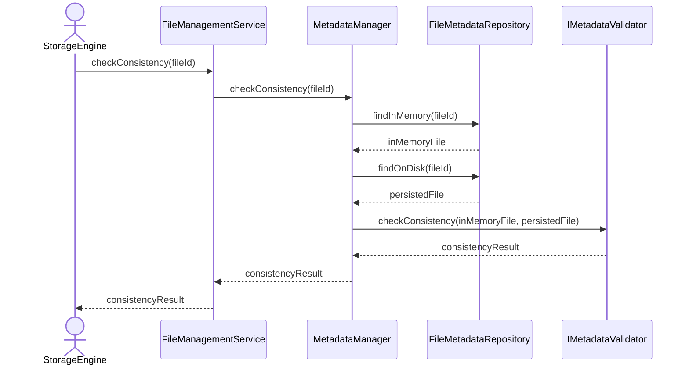

# Check Metadata Consistency

## Group: Validation

## Description

Compares the in-memory `DatabaseFile` aggregate against the persisted version on disk, detecting any divergence between the two states.

---

