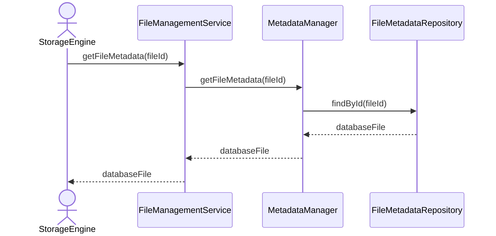

# Get File Metadata

## Group: Query

## Description

Retrieves the full `DatabaseFile` aggregate from persistent storage by its identifier and returns it to the caller.

---

```mermaid
sequenceDiagram
    actor StorageEngine
    participant FileManagementService
    participant MetadataManager
    participant FileMetadataRepository

    StorageEngine->>FileManagementService: getFileMetadata(fileId)
    FileManagementService->>MetadataManager: getFileMetadata(fileId)

    MetadataManager->>FileMetadataRepository: findById(fileId)
    FileMetadataRepository-->>MetadataManager: databaseFile

    MetadataManager-->>FileManagementService: databaseFile
    FileManagementService-->>StorageEngine: databaseFile
```
