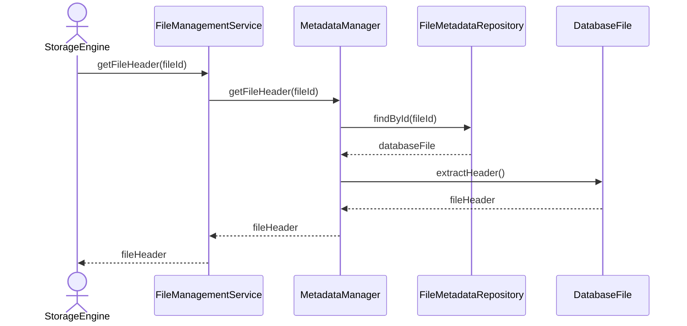

# Get File Header

## Group: Query

## Description

Retrieves the `DatabaseFile` aggregate and extracts its `FileHeader` value object, returning only the header information to the caller.

---

```mermaid
sequenceDiagram
    actor StorageEngine
    participant FileManagementService
    participant MetadataManager
    participant FileMetadataRepository
    participant DatabaseFile

    StorageEngine->>FileManagementService: getFileHeader(fileId)
    FileManagementService->>MetadataManager: getFileHeader(fileId)

    MetadataManager->>FileMetadataRepository: findById(fileId)
    FileMetadataRepository-->>MetadataManager: databaseFile

    MetadataManager->>DatabaseFile: extractHeader()
    DatabaseFile-->>MetadataManager: fileHeader

    MetadataManager-->>FileManagementService: fileHeader
    FileManagementService-->>StorageEngine: fileHeader
```
