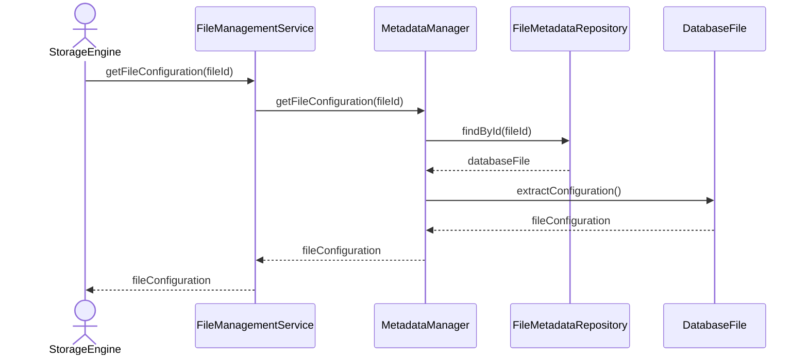

# Get File Configuration

## Group: Query

## Description

Retrieves the `DatabaseFile` aggregate and extracts its `FileConfiguration` value object, returning only the configuration information to the caller.

---

