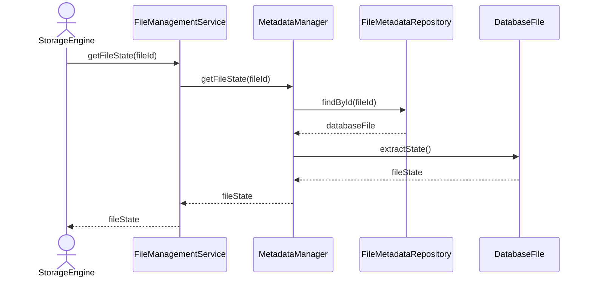

# Get File State

## Group: Query

## Description

Retrieves the `DatabaseFile` aggregate and extracts its current `FileState` value object, returning the runtime state information to the caller.

---

