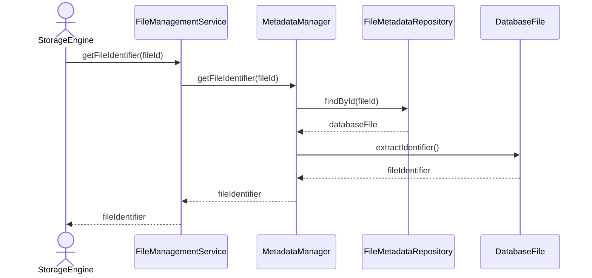

# Get File Identifier

## Group: Query

## Description

Retrieves the `DatabaseFile` aggregate and extracts its `FileIdentifier` value object, returning the unique identity information to the caller.

---

