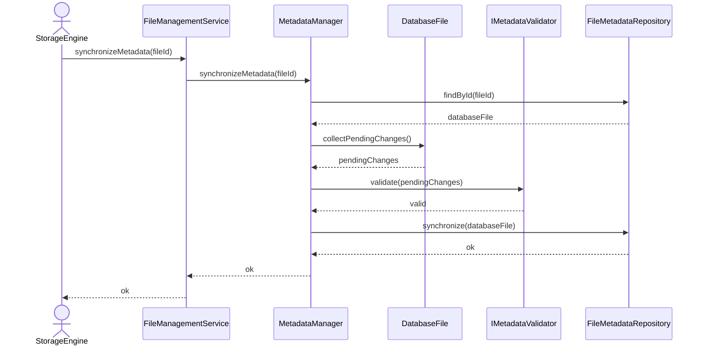

# Synchronize Memory Metadata with Disk

## Group: Synchronization

## Description

Collects all pending in-memory changes from the `DatabaseFile` aggregate, validates them, and atomically synchronizes the full state with persistent storage.

---

