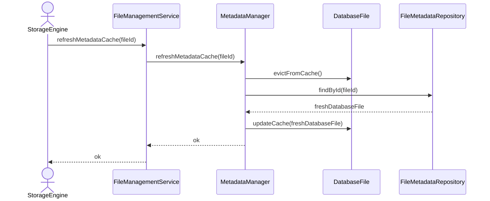

# Refresh Cached Metadata

## Group: Synchronization

## Description

Evicts the stale in-memory metadata cache for a `DatabaseFile`, reloads the latest version from persistent storage, and updates the cache with fresh data.

---

