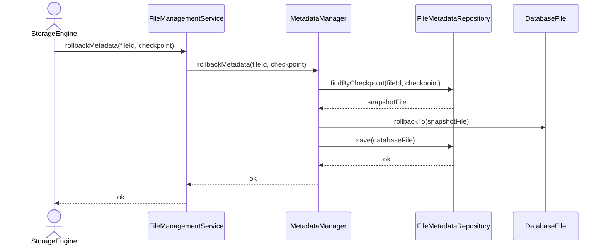

# Rollback Metadata Changes

## Group: Recovery

## Description

Reverts the `DatabaseFile` aggregate to a previously saved checkpoint snapshot, discarding all changes made after that checkpoint, and persists the rolled-back state.

---

