# Database Objects Feature mindmap

# Database Objects Feature and Design Pattern Analysis

# Database Objects class diagram 
```mermaid
classDiagram
direction TB

%% =====================================================
%% COMPOSITE COMPONENT
%% =====================================================

class DatabaseComponent {
    <<interface>>

    +getId() UUID
    +getName() String
    +getOwner() String
    +getQualifiedName() String
    +getLifecycleStatus() LifecycleStatus

    +rename(newName : String) void
    +drop(mode : DropMode) void
    +getChildren() List~DatabaseComponent~
}

%% =====================================================
%% STRUCTURAL LIFECYCLE TYPES
%% =====================================================

class LifecycleStatus {
    <<enumeration>>

    ACTIVE
    DROPPING
    DROPPED
}

class DropMode {
    <<enumeration>>

    RESTRICT
    CASCADE
}

%% =====================================================
%% DATABASE MANAGER
%% =====================================================

class DatabaseManager {
    -databasesById : Map~UUID, Database~
    -databaseIdsByName : Map~String, UUID~

    +createDatabase(request) Database
    +dropDatabase(databaseId : UUID, mode : DropMode) void

    +openDatabase(databaseId : UUID) void
    +closeDatabase(databaseId : UUID) void
    +renameDatabase(databaseId : UUID, newName : String) void

    +findDatabaseById(databaseId : UUID) Database
    +findDatabaseByName(name : String) Database
    +listAllDatabases() List~Database~

    -openDatabaseResources(database : Database) void
    -closeDatabaseResources(database : Database) void
}

%% =====================================================
%% DATABASE - STATE CONTEXT
%% =====================================================

class Database {
    -databaseId : UUID
    -name : String
    -owner : String
    -state : DatabaseState
    -lifecycleStatus : LifecycleStatus
    -schemas : List~Schema~

    +open() void
    +close() void
    +rename(newName : String) void
    +drop(mode : DropMode) void
    +getStatus() DatabaseStatus

    +addSchema(schema : Schema) void
    +removeSchema(schemaId : UUID) void
    +findSchema(name : String) Schema
    +listSchemas() List~Schema~

    +getId() UUID
    +getName() String
    +getOwner() String
    +getQualifiedName() String
    +getLifecycleStatus() LifecycleStatus
    +getChildren() List~DatabaseComponent~

    ~openingSucceeded() void
    ~openingFailed() void
    ~closingSucceeded() void
    ~closingFailed() void

    ~transitionTo(state : DatabaseState) void
    ~updateName(newName : String) void
    ~attachSchema(schema : Schema) void
    ~detachSchema(schemaId : UUID) void
    ~findSchemaInternal(name : String) Schema
    ~listSchemasInternal() List~Schema~

    -validateActive() void
    -validateDrop(mode : DropMode) void
    -dropChildren() void
    -markAsDropping() void
    -markAsDropped() void
}

%% =====================================================
%% DATABASE STATE
%% =====================================================

class DatabaseState {
    <<interface>>

    +open(database : Database) void
    +close(database : Database) void
    +rename(database : Database, newName : String) void

    +addSchema(database : Database, schema : Schema) void
    +removeSchema(database : Database, schemaId : UUID) void
    +ensureSchemaReadable(database : Database) void

    +openingSucceeded(database : Database) void
    +openingFailed(database : Database) void
    +closingSucceeded(database : Database) void
    +closingFailed(database : Database) void

    +getStatus() DatabaseStatus
}

%% =====================================================
%% CONCRETE DATABASE STATES
%% =====================================================

class OfflineState {
    +open(database : Database) void
    +close(database : Database) void
    +rename(database : Database, newName : String) void

    +addSchema(database : Database, schema : Schema) void
    +removeSchema(database : Database, schemaId : UUID) void
    +ensureSchemaReadable(database : Database) void

    +openingSucceeded(database : Database) void
    +openingFailed(database : Database) void
    +closingSucceeded(database : Database) void
    +closingFailed(database : Database) void

    +getStatus() DatabaseStatus
}

class OpeningState {
    +open(database : Database) void
    +close(database : Database) void
    +rename(database : Database, newName : String) void

    +addSchema(database : Database, schema : Schema) void
    +removeSchema(database : Database, schemaId : UUID) void
    +ensureSchemaReadable(database : Database) void

    +openingSucceeded(database : Database) void
    +openingFailed(database : Database) void
    +closingSucceeded(database : Database) void
    +closingFailed(database : Database) void

    +getStatus() DatabaseStatus
}

class OnlineState {
    +open(database : Database) void
    +close(database : Database) void
    +rename(database : Database, newName : String) void

    +addSchema(database : Database, schema : Schema) void
    +removeSchema(database : Database, schemaId : UUID) void
    +ensureSchemaReadable(database : Database) void

    +openingSucceeded(database : Database) void
    +openingFailed(database : Database) void
    +closingSucceeded(database : Database) void
    +closingFailed(database : Database) void

    +getStatus() DatabaseStatus
}

class ClosingState {
    +open(database : Database) void
    +close(database : Database) void
    +rename(database : Database, newName : String) void

    +addSchema(database : Database, schema : Schema) void
    +removeSchema(database : Database, schemaId : UUID) void
    +ensureSchemaReadable(database : Database) void

    +openingSucceeded(database : Database) void
    +openingFailed(database : Database) void
    +closingSucceeded(database : Database) void
    +closingFailed(database : Database) void

    +getStatus() DatabaseStatus
}

class DatabaseStatus {
    <<enumeration>>

    OFFLINE
    OPENING
    ONLINE
    CLOSING
}

%% =====================================================
%% SCHEMA
%% =====================================================

class Schema {
    -schemaId : UUID
    -databaseId : UUID
    -name : String
    -owner : String
    -lifecycleStatus : LifecycleStatus
    -objectsById : Map~UUID, SchemaObject~
    -objectIdsByName : Map~String, UUID~

    +addObject(object : SchemaObject) void
    +dropObject(objectId : UUID, mode : DropMode) void

    +findObjectById(objectId : UUID) SchemaObject
    +findObjectByName(name : String) SchemaObject
    +listObjects() List~SchemaObject~
    +containsObjectName(name : String) boolean

    +getId() UUID
    +getDatabaseId() UUID
    +getName() String
    +getOwner() String
    +getQualifiedName() String
    +getLifecycleStatus() LifecycleStatus

    +rename(newName : String) void
    +drop(mode : DropMode) void
    +getChildren() List~DatabaseComponent~

    ~removeObjectInternal(objectId : UUID) void

    -validateActive() void
    -validateDrop(mode : DropMode) void
    -validateUniqueId(objectId : UUID) void
    -validateUniqueName(name : String) void
    -validateOwnership(object : SchemaObject) void
    -normalizeName(name : String) String
    -dropChildren() void
    -markAsDropping() void
    -markAsDropped() void
}

%% =====================================================
%% COMMON SCHEMA OBJECT
%% =====================================================

class SchemaObject {
    <<abstract>>

    #objectId : UUID
    #name : String
    #owner : String
    #schemaId : UUID
    #lifecycleStatus : LifecycleStatus

    +getId() UUID
    +getSchemaId() UUID
    +getName() String
    +getOwner() String
    +getQualifiedName() String
    +getLifecycleStatus() LifecycleStatus

    +rename(newName : String) void
    +drop(mode : DropMode) void
    +getChildren() List~DatabaseComponent~

    #validateActive() void
    #markAsDropping() void
    #markAsDropped() void
}

%% =====================================================
%% TABLE
%% =====================================================

class Table {
    -engine : String

    -columns : List~Column~
    -constraints : List~Constraint~
    -indexes : List~Index~
    -partitions : List~Partition~
    -triggers : List~Trigger~

    ~Table(objectId : UUID, name : String, owner : String, schemaId : UUID, engine : String, columns, constraints, indexes, partitions, triggers)

    +getEngine() String
    +getColumns() List~Column~
    +getConstraints() List~Constraint~
    +getIndexes() List~Index~
    +getPartitions() List~Partition~
    +getTriggers() List~Trigger~

    +addConstraint(constraint : Constraint, context : ConstraintDefinitionContext) void
    +dropConstraint(constraintId : UUID) void
    +findConstraintById(constraintId : UUID) Constraint
    +findConstraintByName(name : String) Constraint
    +validateConstraints(row : Row, context : ConstraintValidationContext) void

    +addIndex(index : Index, context : IndexDefinitionContext) void
    +dropIndex(indexId : UUID) void
    +findIndexById(indexId : UUID) Index
    +findIndexByName(name : String) Index

    +insertRow(row : Row) void
    +findRow(rowId : UUID) Row
    +updateRow(rowId : UUID, changes : RowChanges) Row
    +deleteRow(rowId : UUID) Row

    +insertIntoIndexes(row : Row, context : IndexOperationContext) void
    +updateIndexes(oldRow : Row, newRow : Row, context : IndexOperationContext) void
    +deleteFromIndexes(row : Row, context : IndexOperationContext) void
}

%% =====================================================
%% TABLE BUILDER
%% =====================================================

class TableBuilder {
    -objectId : UUID
    -name : String
    -owner : String
    -schemaId : UUID
    -engine : String

    -columns : List~Column~
    -constraints : List~Constraint~
    -indexes : List~Index~
    -partitions : List~Partition~
    -triggers : List~Trigger~

    +setObjectId(objectId : UUID) TableBuilder
    +setName(name : String) TableBuilder
    +setOwner(owner : String) TableBuilder
    +setSchemaId(schemaId : UUID) TableBuilder
    +setEngine(engine : String) TableBuilder

    +addColumn(column : Column) TableBuilder
    +addConstraint(constraint : Constraint) TableBuilder
    +addIndex(index : Index) TableBuilder
    +addPartition(partition : Partition) TableBuilder
    +addTrigger(trigger : Trigger) TableBuilder

    +build() Table

    -validateRequiredFields() void
    -validateColumns() void
    -validateConstraints() void
    -validateIndexes() void
    -validatePartitions() void
    -validateTriggers() void
}

class Column {
    -columnId : UUID
    -name : String
    -dataType : DataType
    -nullable : Boolean
    -defaultValue : Object

    +getId() UUID
    +getName() String
    +getDataType() DataType
}

class Constraint {
    <<abstract>>

    #constraintId : UUID
    #constraintName : String
    #constraintType : ConstraintType
    #tableId : UUID
    #columnIds : List~UUID~
    #status : ConstraintStatus

    +getId() UUID
    +getName() String
    +getType() ConstraintType
    +getTableId() UUID
    +getColumnIds() List~UUID~
    +getStatus() ConstraintStatus

    +enable() void
    +disable() void
    +markInvalid() void

    +validateDefinition(context : ConstraintDefinitionContext)* void
    +validate(row : Row, context : ConstraintValidationContext) void
    #doValidate(row : Row, context : ConstraintValidationContext)* void
}

class PrimaryKey {
    +validateDefinition(context : ConstraintDefinitionContext) void
    #doValidate(row : Row, context : ConstraintValidationContext) void
}

class ForeignKey {
    -referencedTableId : UUID
    -referencedColumnIds : List~UUID~
    -onDeleteAction : ReferentialAction
    -onUpdateAction : ReferentialAction

    +validateDefinition(context : ConstraintDefinitionContext) void
    #doValidate(row : Row, context : ConstraintValidationContext) void
}

class UniqueConstraint {
    +validateDefinition(context : ConstraintDefinitionContext) void
    #doValidate(row : Row, context : ConstraintValidationContext) void
}

class CheckConstraint {
    -expression : CheckExpression

    +validateDefinition(context : ConstraintDefinitionContext) void
    #doValidate(row : Row, context : ConstraintValidationContext) void
}

class ConstraintDefinitionContext {
    -tableId : UUID
    -columns : List~Column~
    -existingConstraints : List~Constraint~

    +hasColumn(columnId : UUID) boolean
    +hasPrimaryKey() boolean
    +hasConstraintName(name : String) boolean
    +referencedTableExists(tableId : UUID) boolean
    +referencedColumnExists(tableId : UUID, columnId : UUID) boolean
    +areTypesCompatible(sourceColumnId : UUID, referencedColumnId : UUID) boolean
}

class ConstraintValidationContext {
    -currentTableId : UUID
    -transactionId : UUID

    +exists(tableId : UUID, columnIds : List~UUID~, values : List~Object~) boolean
    +isUnique(tableId : UUID, columnIds : List~UUID~, values : List~Object~) boolean
}

class CheckExpression {
    <<interface>>

    +evaluate(row : Row) boolean
}

class ConstraintType {
    <<enumeration>>

    PRIMARY_KEY
    FOREIGN_KEY
    UNIQUE
    CHECK
}

class ConstraintStatus {
    <<enumeration>>

    ENABLED
    DISABLED
    INVALID
}

class ReferentialAction {
    <<enumeration>>

    NO_ACTION
    RESTRICT
    CASCADE
    SET_NULL
}

class Row {
    -rowId : UUID
    -values : Map~UUID, Object~

    +getId() UUID
    +getValue(columnId : UUID) Object
}

class RowChanges {
    -values : Map~UUID, Object~

    +getValue(columnId : UUID) Object
}

class DataType {
    <<enumeration>>
}

class Index {
    -indexId : UUID
    -name : String
    -tableId : UUID
    -columnIds : List~UUID~
    -unique : Boolean
    -status : IndexStatus
    -accessMethod : IndexAccessMethod

    +getId() UUID
    +getName() String
    +getTableId() UUID
    +getColumnIds() List~UUID~
    +getType() IndexType
    +getStatus() IndexStatus
    +isUnique() boolean

    +validateDefinition(context : IndexDefinitionContext) void

    +build(context : IndexOperationContext) void
    +rebuild(context : IndexOperationContext) void
    +enable() void
    +disable() void
    +markInvalid() void
    +drop() void

    +insertEntry(row : Row, context : IndexOperationContext) void
    +updateEntry(oldRow : Row, newRow : Row, context : IndexOperationContext) void
    +deleteEntry(row : Row, context : IndexOperationContext) void

    +search(key : IndexKey) List~UUID~
    +rangeSearch(fromKey : IndexKey, toKey : IndexKey) List~UUID~

    -extractKey(row : Row) IndexKey
    -validateUniqueKey(key : IndexKey) void
    -ensureActive() void
}

%% =====================================================
%% INDEX ACCESS METHOD - STRATEGY
%% =====================================================

class IndexAccessMethod {
    <<interface>>

    +getType() IndexType
    +build(context : IndexOperationContext) void

    +insert(key : IndexKey, rowId : UUID) void
    +delete(key : IndexKey, rowId : UUID) void

    +search(key : IndexKey) List~UUID~
    +supportsRangeSearch() boolean
    +rangeSearch(fromKey : IndexKey, toKey : IndexKey) List~UUID~
}

class BTreeIndexAccessMethod {
    +getType() IndexType
    +build(context : IndexOperationContext) void

    +insert(key : IndexKey, rowId : UUID) void
    +delete(key : IndexKey, rowId : UUID) void

    +search(key : IndexKey) List~UUID~
    +supportsRangeSearch() boolean
    +rangeSearch(fromKey : IndexKey, toKey : IndexKey) List~UUID~
}

class HashIndexAccessMethod {
    +getType() IndexType
    +build(context : IndexOperationContext) void

    +insert(key : IndexKey, rowId : UUID) void
    +delete(key : IndexKey, rowId : UUID) void

    +search(key : IndexKey) List~UUID~
    +supportsRangeSearch() boolean
    +rangeSearch(fromKey : IndexKey, toKey : IndexKey) List~UUID~
}

class BitmapIndexAccessMethod {
    +getType() IndexType
    +build(context : IndexOperationContext) void

    +insert(key : IndexKey, rowId : UUID) void
    +delete(key : IndexKey, rowId : UUID) void

    +search(key : IndexKey) List~UUID~
    +supportsRangeSearch() boolean
    +rangeSearch(fromKey : IndexKey, toKey : IndexKey) List~UUID~
}

%% =====================================================
%% INDEX DEFINITION AND OPERATION CONTEXTS
%% =====================================================

class IndexDefinitionContext {
    -tableId : UUID
    -columns : List~Column~
    -existingIndexes : List~Index~

    +hasColumn(columnId : UUID) boolean
    +hasIndexName(name : String) boolean
    +hasEquivalentIndex(columnIds : List~UUID~, type : IndexType) boolean
    +supportsType(columnId : UUID, type : IndexType) boolean
}

class IndexOperationContext {
    -tableId : UUID
    -transactionId : UUID

    +getTableId() UUID
    +getTransactionId() UUID
    +scanRows() List~Row~
}

%% =====================================================
%% INDEX SUPPORTING TYPES
%% =====================================================

class IndexKey {
    -values : List~Object~

    +getValues() List~Object~
}

class IndexType {
    <<enumeration>>

    BTREE
    HASH
    BITMAP
}

class IndexStatus {
    <<enumeration>>

    BUILDING
    ACTIVE
    DISABLED
    REBUILDING
    INVALID
    DROPPED
}

class Partition {
    -partitionId : UUID
    -name : String
    -partitionColumnId : UUID

    +getId() UUID
    +getName() String
    +getPartitionColumnId() UUID
}

class Trigger {
    -triggerId : UUID
    -name : String
    -eventType : String
    -body : String

    +getId() UUID
    +getName() String
    +getEventType() String
}

%% =====================================================
%% TABLE DATA COMMAND - COMMAND AND TEMPLATE METHOD
%% =====================================================

class TableDataCommandExecutor {
    +execute(command : TableDataCommand, context : DataOperationContext) DataOperationResult
}

class TableDataCommand {
    <<interface>>

    +execute(context : DataOperationContext) DataOperationResult
}

class AbstractTableDataCommand {
    <<abstract>>

    +execute(context : DataOperationContext) DataOperationResult

    #validateRequest(context : DataOperationContext) void
    #acquireLocks(context : DataOperationContext) void
    #validateConstraints(context : DataOperationContext) void
    #writeAheadLog(context : DataOperationContext) void
    #modifyRow(context : DataOperationContext)* void
    #updateIndexes(context : DataOperationContext) void
    #afterExecution(context : DataOperationContext) DataOperationResult
    #onFailure(context : DataOperationContext, error : Exception) void
    #releaseLocks(context : DataOperationContext) void
}

class InsertRowCommand {
    -row : Row

    +InsertRowCommand(row : Row)
    #validateRequest(context : DataOperationContext) void
    #writeAheadLog(context : DataOperationContext) void
    #modifyRow(context : DataOperationContext) void
    #updateIndexes(context : DataOperationContext) void
}

class UpdateRowCommand {
    -rowId : UUID
    -changes : RowChanges
    -oldRow : Row
    -updatedRow : Row

    +UpdateRowCommand(rowId : UUID, changes : RowChanges)
    #validateRequest(context : DataOperationContext) void
    #writeAheadLog(context : DataOperationContext) void
    #modifyRow(context : DataOperationContext) void
    #updateIndexes(context : DataOperationContext) void
}

class DeleteRowCommand {
    -rowId : UUID
    -deletedRow : Row

    +DeleteRowCommand(rowId : UUID)
    #validateRequest(context : DataOperationContext) void
    #writeAheadLog(context : DataOperationContext) void
    #modifyRow(context : DataOperationContext) void
    #updateIndexes(context : DataOperationContext) void
}

class DataOperationContext {
    -table : Table
    -transactionId : UUID
    -indexOperationContext : IndexOperationContext

    +getTable() Table
    +getTransactionId() UUID
    +getIndexOperationContext() IndexOperationContext
}

class DataOperationResult {
    -affectedRowCount : Long
    -generatedRowId : UUID
    -successful : Boolean

    +getAffectedRowCount() Long
    +getGeneratedRowId() UUID
    +isSuccessful() boolean
}

%% =====================================================
%% VIEW
%% =====================================================

class View {
    -queryDefinition : String

    +getQueryDefinition() String
    +updateDefinition(query : String) void
}

%% =====================================================
%% STORED PROCEDURE
%% =====================================================

class StoredProcedure {
    -body : String
    -parameters : List~ProcedureParameter~

    +addParameter(parameter : ProcedureParameter) void
    +removeParameter(name : String) void
    +getParameters() List~ProcedureParameter~
    +updateBody(body : String) void
}

class ProcedureParameter {
    -name : String
    -dataType : String
    -mode : String
    -position : Integer
    -defaultValue : Object
}

%% =====================================================
%% SEQUENCE
%% =====================================================

class Sequence {
    -currentValue : Long
    -incrementValue : Long
    -minimumValue : Long
    -maximumValue : Long
    -cycle : Boolean

    +nextValue() Long
}

%% =====================================================
%% DATABASE MANAGEMENT RELATIONSHIPS
%% =====================================================

DatabaseManager --> Database : creates and coordinates
DatabaseManager --> DropMode : selects

%% =====================================================
%% COMPOSITE AND STRUCTURAL LIFECYCLE RELATIONSHIPS
%% =====================================================

DatabaseComponent <|.. Database
DatabaseComponent <|.. Schema
DatabaseComponent <|.. SchemaObject

DatabaseComponent --> LifecycleStatus : exposes lifecycle
DatabaseComponent --> DropMode : uses

%% =====================================================
%% DATABASE STATE RELATIONSHIPS
%% =====================================================

Database --> DatabaseState : delegates behavior
DatabaseState --> DatabaseStatus : represents

DatabaseState <|.. OfflineState
DatabaseState <|.. OpeningState
DatabaseState <|.. OnlineState
DatabaseState <|.. ClosingState

%% =====================================================
%% VALID STATE TRANSITIONS
%% =====================================================

OfflineState ..> OpeningState : open
OpeningState ..> OnlineState : openingSucceeded
OpeningState ..> OfflineState : openingFailed

OnlineState ..> ClosingState : close
ClosingState ..> OfflineState : closingSucceeded
ClosingState ..> OnlineState : closingFailed

%% =====================================================
%% DATABASE OBJECT HIERARCHY
%% =====================================================

Database *--> "0..*" Schema : contains
Schema *--> "0..*" SchemaObject : contains

SchemaObject <|-- Table
SchemaObject <|-- View
SchemaObject <|-- StoredProcedure
SchemaObject <|-- Sequence

%% =====================================================
%% TABLE COMPONENTS
%% =====================================================

TableBuilder ..> Table : builds

TableBuilder --> "1..*" Column : collects
TableBuilder --> "0..*" Constraint : collects
TableBuilder --> "0..*" Index : collects
TableBuilder --> "0..*" Partition : collects
TableBuilder --> "0..*" Trigger : collects

Table *--> "1..*" Column : defines
Table *--> "0..*" Constraint : enforces
Table *--> "0..*" Index : owns and maintains
Table *--> "0..*" Partition : partitions
Table *--> "0..*" Trigger : registers

Partition --> Column : uses partition key

%% =====================================================
%% INDEX DEFINITION AND MANAGEMENT - STRATEGY
%% =====================================================

Index *--> IndexAccessMethod : delegates operations

IndexAccessMethod <|.. BTreeIndexAccessMethod
IndexAccessMethod <|.. HashIndexAccessMethod
IndexAccessMethod <|.. BitmapIndexAccessMethod

Table ..> IndexDefinitionContext : validates index with
Table ..> IndexOperationContext : supplies operation context

Index ..> IndexDefinitionContext : validates definition with
Index ..> IndexOperationContext : builds and maintains with

Index --> IndexType : identifies
Index --> IndexStatus : has lifecycle status
Index --> "1..*" Column : indexes

Index ..> Row : extracts key from
Index ..> IndexKey : creates and searches

IndexAccessMethod ..> IndexKey : organizes
IndexAccessMethod ..> IndexOperationContext : builds from

IndexDefinitionContext --> Column : resolves
IndexDefinitionContext --> Index : checks existing

%% =====================================================
%% CONSTRAINT STRATEGY
%% =====================================================

Constraint <|-- PrimaryKey
Constraint <|-- ForeignKey
Constraint <|-- UniqueConstraint
Constraint <|-- CheckConstraint

Constraint --> ConstraintType : identifies
Constraint --> ConstraintStatus : has status
Constraint --> "1..*" Column : applies to

Constraint ..> ConstraintDefinitionContext : validates definition with
ConstraintDefinitionContext --> Column : resolves
ConstraintDefinitionContext --> Constraint : checks existing

Table ..> Row : validates and manages
Table --> ConstraintValidationContext : supplies

Constraint ..> Row : validates
Constraint ..> ConstraintValidationContext : queries data through

ForeignKey --> ReferentialAction : defines behavior
ForeignKey ..> ConstraintValidationContext : checks referenced data

CheckConstraint *--> CheckExpression : owns
CheckExpression ..> Row : evaluates

Column --> DataType : uses

TableBuilder ..> ConstraintDefinitionContext : creates validation context

%% =====================================================
%% TABLE DATA COMMAND AND TEMPLATE METHOD
%% =====================================================

TableDataCommand <|.. AbstractTableDataCommand

AbstractTableDataCommand <|-- InsertRowCommand
AbstractTableDataCommand <|-- UpdateRowCommand
AbstractTableDataCommand <|-- DeleteRowCommand

TableDataCommandExecutor --> TableDataCommand : invokes

AbstractTableDataCommand --> DataOperationContext : uses
AbstractTableDataCommand ..> DataOperationResult : returns

DataOperationContext --> Table : provides receiver
DataOperationContext --> IndexOperationContext : provides index context

InsertRowCommand *--> Row : contains candidate row
UpdateRowCommand *--> RowChanges : contains changes
UpdateRowCommand --> Row : keeps old and updated rows
DeleteRowCommand --> Row : keeps deleted row

Table ..> RowChanges : applies

%% =====================================================
%% STORED PROCEDURE COMPONENTS
%% =====================================================

StoredProcedure *--> "0..*" ProcedureParameter : defines

%% =====================================================
%% STYLING
%% =====================================================

style DatabaseComponent fill:#fff3e0,stroke:#ef6c00,stroke-width:2px,color:#7f2704

style DatabaseManager fill:#e3f2fd,stroke:#1565c0,stroke-width:2px,color:#084298
style Database fill:#e3f2fd,stroke:#1565c0,stroke-width:2px,color:#084298
style Schema fill:#e3f2fd,stroke:#1565c0,stroke-width:2px,color:#084298

style DatabaseState fill:#fde8e8,stroke:#e84a5f,stroke-width:2px,color:#9b1c1c
style OfflineState fill:#fde8e8,stroke:#e84a5f,stroke-width:1px,color:#9b1c1c
style OpeningState fill:#fde8e8,stroke:#e84a5f,stroke-width:1px,color:#9b1c1c
style OnlineState fill:#fde8e8,stroke:#e84a5f,stroke-width:1px,color:#9b1c1c
style ClosingState fill:#fde8e8,stroke:#e84a5f,stroke-width:1px,color:#9b1c1c
style DatabaseStatus fill:#fde8e8,stroke:#e84a5f,stroke-width:2px,color:#9b1c1c

style SchemaObject fill:#e8f5e9,stroke:#2e7d32,stroke-width:2px,color:#0f5132
style Table fill:#e8f5e9,stroke:#2e7d32,stroke-width:2px,color:#0f5132
style View fill:#e8f5e9,stroke:#2e7d32,stroke-width:2px,color:#0f5132
style StoredProcedure fill:#e8f5e9,stroke:#2e7d32,stroke-width:2px,color:#0f5132
style Sequence fill:#e8f5e9,stroke:#2e7d32,stroke-width:2px,color:#0f5132

style Column fill:#fff8e1,stroke:#f9a825,stroke-width:1px,color:#664d03
style Index fill:#fff8e1,stroke:#f9a825,stroke-width:2px,color:#664d03
style Partition fill:#fff8e1,stroke:#f9a825,stroke-width:1px,color:#664d03
style Trigger fill:#fff8e1,stroke:#f9a825,stroke-width:1px,color:#664d03

style TableBuilder fill:#ffe0b2,stroke:#f57c00,stroke-width:2px,color:#e65100

style IndexAccessMethod fill:#fff3e0,stroke:#ef6c00,stroke-width:2px,color:#7f2704
style BTreeIndexAccessMethod fill:#fff3e0,stroke:#ef6c00,stroke-width:1px,color:#7f2704
style HashIndexAccessMethod fill:#fff3e0,stroke:#ef6c00,stroke-width:1px,color:#7f2704
style BitmapIndexAccessMethod fill:#fff3e0,stroke:#ef6c00,stroke-width:1px,color:#7f2704

style IndexDefinitionContext fill:#e3f2fd,stroke:#1565c0,stroke-width:2px,color:#084298
style IndexOperationContext fill:#e3f2fd,stroke:#1565c0,stroke-width:2px,color:#084298

style IndexType fill:#f3e5f5,stroke:#7b1fa2,stroke-width:1px,color:#4a148c
style IndexStatus fill:#f3e5f5,stroke:#7b1fa2,stroke-width:1px,color:#4a148c
style IndexKey fill:#f3e5f5,stroke:#7b1fa2,stroke-width:1px,color:#4a148c

style Constraint fill:#f3e5f5,stroke:#7b1fa2,stroke-width:2px,color:#4a148c
style PrimaryKey fill:#f3e5f5,stroke:#7b1fa2,stroke-width:1px,color:#4a148c
style ForeignKey fill:#f3e5f5,stroke:#7b1fa2,stroke-width:1px,color:#4a148c
style UniqueConstraint fill:#f3e5f5,stroke:#7b1fa2,stroke-width:1px,color:#4a148c
style CheckConstraint fill:#f3e5f5,stroke:#7b1fa2,stroke-width:1px,color:#4a148c

style ConstraintDefinitionContext fill:#e3f2fd,stroke:#1565c0,stroke-width:2px,color:#084298
style ConstraintValidationContext fill:#e3f2fd,stroke:#1565c0,stroke-width:2px,color:#084298

style CheckExpression fill:#fff3e0,stroke:#ef6c00,stroke-width:2px,color:#7f2704

style TableDataCommandExecutor fill:#e3f2fd,stroke:#1565c0,stroke-width:2px,color:#084298

style TableDataCommand fill:#fff3e0,stroke:#ef6c00,stroke-width:2px,color:#7f2704
style AbstractTableDataCommand fill:#fff3e0,stroke:#ef6c00,stroke-width:2px,color:#7f2704

style InsertRowCommand fill:#e8f5e9,stroke:#2e7d32,stroke-width:2px,color:#0f5132
style UpdateRowCommand fill:#e8f5e9,stroke:#2e7d32,stroke-width:2px,color:#0f5132
style DeleteRowCommand fill:#e8f5e9,stroke:#2e7d32,stroke-width:2px,color:#0f5132

style DataOperationContext fill:#f3e5f5,stroke:#7b1fa2,stroke-width:2px,color:#4a148c
style DataOperationResult fill:#f3e5f5,stroke:#7b1fa2,stroke-width:2px,color:#4a148c

style ConstraintType fill:#fff8e1,stroke:#f9a825,stroke-width:1px,color:#664d03
style ConstraintStatus fill:#fff8e1,stroke:#f9a825,stroke-width:1px,color:#664d03
style ReferentialAction fill:#fff8e1,stroke:#f9a825,stroke-width:1px,color:#664d03

style Row fill:#e0f2f1,stroke:#009688,stroke-width:1px,color:#004d40
style RowChanges fill:#e0f2f1,stroke:#009688,stroke-width:1px,color:#004d40
style DataType fill:#e0f2f1,stroke:#009688,stroke-width:1px,color:#004d40

style ProcedureParameter fill:#f3e5f5,stroke:#7b1fa2,stroke-width:1px,color:#4a148c

style LifecycleStatus fill:#f3e5f5,stroke:#7b1fa2,stroke-width:2px,color:#4a148c
style DropMode fill:#f3e5f5,stroke:#7b1fa2,stroke-width:2px,color:#4a148c
```
# 1. Database Operational State Management
## Using State Pattern

### 1.1 Class Diagram
```mermaid
classDiagram
direction TB

%% =====================================================
%% Lifecycle Coordinator
%% =====================================================

class DatabaseManager {
    -databasesById : Map~UUID, Database~
    -databaseIdsByName : Map~String, UUID~

    +createDatabase(request) Database
    +dropDatabase(databaseId : UUID) void

    +openDatabase(databaseId : UUID) void
    +closeDatabase(databaseId : UUID) void
    +renameDatabase(databaseId : UUID, newName : String) void

    +findDatabaseById(databaseId : UUID) Database
    +findDatabaseByName(name : String) Database
    +listAllDatabases() List~Database~

    -openDatabaseResources(database : Database) void
    -closeDatabaseResources(database : Database) void
}

%% =====================================================
%% Database Component
%% =====================================================

class DatabaseComponent {
    <<interface>>

    +getId() UUID
    +getName() String
    +getOwner() String
    +getQualifiedName() String
}

%% =====================================================
%% Context
%% =====================================================

class Database {
    -databaseId : UUID
    -name : String
    -owner : String
    -state : DatabaseState
    -schemas : List~Schema~

    +open() void
    +close() void
    +rename(newName : String) void

    +addSchema(schema : Schema) void
    +removeSchema(schemaId : UUID) void
    +findSchema(name : String) Schema
    +listSchemas() List~Schema~

    +getStatus() DatabaseStatus

    +getId() UUID
    +getName() String
    +getOwner() String
    +getQualifiedName() String

    ~openingSucceeded() void
    ~openingFailed() void
    ~closingSucceeded() void
    ~closingFailed() void

    ~transitionTo(state : DatabaseState) void
    ~updateName(newName : String) void
    ~attachSchema(schema : Schema) void
    ~detachSchema(schemaId : UUID) void
    ~findSchemaInternal(name : String) Schema
    ~listSchemasInternal() List~Schema~
}

%% =====================================================
%% State Interface
%% =====================================================

class DatabaseState {
    <<interface>>

    +open(database : Database) void
    +close(database : Database) void
    +rename(database : Database, newName : String) void

    +addSchema(database : Database, schema : Schema) void
    +removeSchema(database : Database, schemaId : UUID) void
    +ensureSchemaReadable(database : Database) void

    +openingSucceeded(database : Database) void
    +openingFailed(database : Database) void
    +closingSucceeded(database : Database) void
    +closingFailed(database : Database) void

    +getStatus() DatabaseStatus
}

%% =====================================================
%% Concrete States
%% =====================================================

class OfflineState {
    +open(database : Database) void
    +close(database : Database) void
    +rename(database : Database, newName : String) void
    +addSchema(database : Database, schema : Schema) void
    +removeSchema(database : Database, schemaId : UUID) void
    +ensureSchemaReadable(database : Database) void
    +getStatus() DatabaseStatus
}

class OpeningState {
    +open(database : Database) void
    +close(database : Database) void
    +rename(database : Database, newName : String) void
    +addSchema(database : Database, schema : Schema) void
    +removeSchema(database : Database, schemaId : UUID) void
    +ensureSchemaReadable(database : Database) void

    +openingSucceeded(database : Database) void
    +openingFailed(database : Database) void

    +getStatus() DatabaseStatus
}

class OnlineState {
    +open(database : Database) void
    +close(database : Database) void
    +rename(database : Database, newName : String) void
    +addSchema(database : Database, schema : Schema) void
    +removeSchema(database : Database, schemaId : UUID) void
    +ensureSchemaReadable(database : Database) void
    +getStatus() DatabaseStatus
}

class ClosingState {
    +open(database : Database) void
    +close(database : Database) void
    +rename(database : Database, newName : String) void
    +addSchema(database : Database, schema : Schema) void
    +removeSchema(database : Database, schemaId : UUID) void
    +ensureSchemaReadable(database : Database) void

    +closingSucceeded(database : Database) void
    +closingFailed(database : Database) void

    +getStatus() DatabaseStatus
}

%% =====================================================
%% Status
%% =====================================================

class DatabaseStatus {
    <<enumeration>>

    OFFLINE
    OPENING
    ONLINE
    CLOSING
}

%% =====================================================
%% Schema
%% =====================================================

class Schema {
    -schemaId : UUID
    -name : String
    -owner : String
}

%% =====================================================
%% Main Relationships
%% =====================================================

DatabaseManager --> Database : coordinates lifecycle

DatabaseComponent <|.. Database
Database *--> "0..*" Schema : contains

Database --> DatabaseState : delegates behavior
DatabaseState --> DatabaseStatus : represents

DatabaseState <|.. OfflineState
DatabaseState <|.. OpeningState
DatabaseState <|.. OnlineState
DatabaseState <|.. ClosingState

%% =====================================================
%% Valid State Transitions
%% =====================================================

OfflineState ..> OpeningState : open
OpeningState ..> OnlineState : openingSucceeded
OpeningState ..> OfflineState : openingFailed

OnlineState ..> ClosingState : close
ClosingState ..> OfflineState : closingSucceeded
ClosingState ..> OnlineState : closingFailed

%% =====================================================
%% Styling
%% =====================================================

style DatabaseComponent fill:#fff3e0,stroke:#ef6c00,stroke-width:2px,color:#7f2704

style DatabaseManager fill:#e3f2fd,stroke:#1565c0,stroke-width:2px,color:#084298
style Database fill:#e3f2fd,stroke:#1565c0,stroke-width:2px,color:#084298
style Schema fill:#e3f2fd,stroke:#1565c0,stroke-width:2px,color:#084298

style DatabaseState fill:#fde8e8,stroke:#e84a5f,stroke-width:2px,color:#9b1c1c
style OfflineState fill:#fde8e8,stroke:#e84a5f,stroke-width:1px,color:#9b1c1c
style OpeningState fill:#fde8e8,stroke:#e84a5f,stroke-width:1px,color:#9b1c1c
style OnlineState fill:#fde8e8,stroke:#e84a5f,stroke-width:1px,color:#9b1c1c
style ClosingState fill:#fde8e8,stroke:#e84a5f,stroke-width:1px,color:#9b1c1c
style DatabaseStatus fill:#fde8e8,stroke:#e84a5f,stroke-width:2px,color:#9b1c1c
```

### 1.2 Sequence Diagram for shouldRejectOpenBaseOnCurrentState()
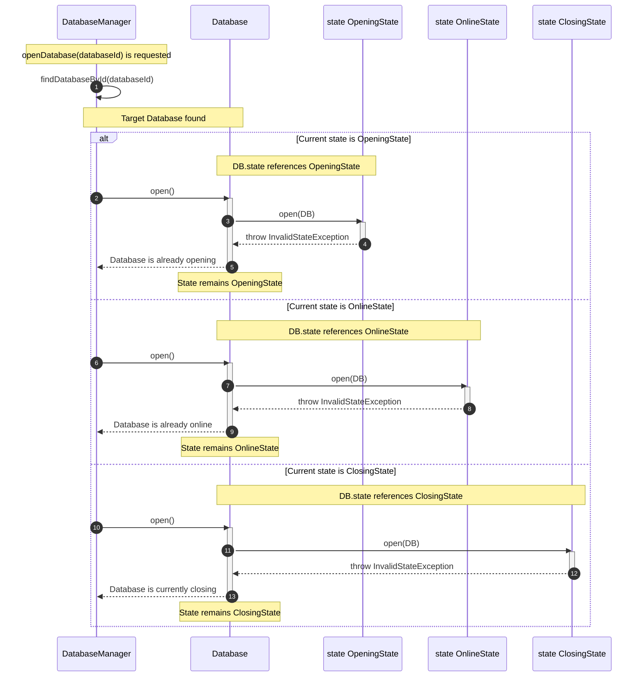

### 1.3 Code Example

#### State Interface and Enum State
```java
public enum DatabaseStatus {
    OFFLINE, OPENING, ONLINE, CLOSING
}

public interface DatabaseState {

    void open(Database database);
    
    void close(Database database);
    
    void rename(Database database, String newName);
    
    DatabaseStatus getStatus();
}
```

#### Concrete State Classes
```java
public class OfflineState implements DatabaseState {

    @Override
    public void open(Database database) {
        database.validateNewName();
        database.initialize();
        database.changeState(new OpeningState());
    }

    @Override
    public void close(Database database) {
        
    }

    @Override
    public void rename(Database database, String newName) {
        
    }

    @Override
    public DatabaseStatus getStatus() {
        return DatabaseStatus.OFFLINE;
    }
}

public class OpeningState implements DatabaseState {

    @Override
    public void open(Database database) {
        
    }

    @Override
    public void close(Database database) {
        
    }

    @Override
    public void rename(Database database, String newName) {
        
    }

    @Override
    public DatabaseStatus getStatus() {
        return DatabaseStatus.OPENING;
    }
}

public class OnlineState implements DatabaseState {

    @Override
    public void open(Database database) {
        
    }

    @Override
    public void close(Database database) {
        
    }

    @Override
    public void rename(Database database, String newName) {
        
    }

    @Override
    public DatabaseStatus getStatus() {
        return DatabaseStatus.ONLINE;
    }
}

public class ClosingState implements DatabaseState {

    @Override
    public void open(Database database) {
       
    }

    @Override
    public void close(Database database) {
       
    }

    @Override
    public void rename(Database database, String newName) {
        
    }

    @Override
    public DatabaseStatus getStatus() {
        return DatabaseStatus.CLOSING;
    }
}
```

#### Context
```java
public class Database {
    private DatabaseState state;
    private String name;
    private String owner;
    private UUID databaseId;
    private List<Schema> schemas;

    public Database(String name, String owner) {
        this.name = name;
        this.owner = owner;
        this.state = new OfflineState();
        this.schemas = new ArrayList<>();
    }

    public void open() {
        state.open(this);
    }

    public void close() {
        state.close(this);
    }

    public void rename(String newName) {
        state.rename(this, newName);
    }

    public void changeState(DatabaseState state) {
        this.state = state;
    }

    public DatabaseStatus getStatus() {
        return state.getStatus();
    }
}
```

#### Client 
```java
public class DatabaseManager() {
    private Map<UUID, Database> databases = new HashMap<>();
    private StorageEngine storageEngine;
    private CatalogManager catalogManager;

    public DatabaseManager(StorageEngine storageEngine, CatalogManager catalogManager) {
        this.storageEngine = storageEngine;
        this.catalogManager = catalogManager;
    }

    public Database openDatabase(UUID databaseId) {
        return null;
    }   
}
```

---

# 2. Schema Management
## Standard Domain Entity (No Pattern)

---

# 3. Database Object Hierarchy and Structural Lifecycle
## Using Composite Pattern

### 3.1 Class Diagram
```mermaid
classDiagram
direction TB

%% =====================================================
%% Root Client
%% =====================================================

class DatabaseManager {
    -databasesById : Map~UUID, Database~
    -databaseIdsByName : Map~String, UUID~

    +createDatabase(request) Database
    +dropDatabase(databaseId : UUID, mode : DropMode) void
    +renameDatabase(databaseId : UUID, newName : String) void

    +findDatabaseById(databaseId : UUID) Database
    +findDatabaseByName(name : String) Database
    +listAllDatabases() List~Database~
}

%% =====================================================
%% Composite Component
%% =====================================================

class DatabaseComponent {
    <<interface>>

    +getId() UUID
    +getName() String
    +getOwner() String
    +getQualifiedName() String
    +getLifecycleStatus() LifecycleStatus

    +rename(newName : String) void
    +drop(mode : DropMode) void
    +getChildren() List~DatabaseComponent~
}

%% =====================================================
%% Structural Lifecycle Types
%% =====================================================

class LifecycleStatus {
    <<enumeration>>

    ACTIVE
    DROPPING
    DROPPED
}

class DropMode {
    <<enumeration>>

    RESTRICT
    CASCADE
}

%% =====================================================
%% Root Composite: Database
%% =====================================================

class Database {
    -databaseId : UUID
    -name : String
    -owner : String
    -lifecycleStatus : LifecycleStatus
    -schemas : List~Schema~

    +addSchema(schema : Schema) void
    +removeSchema(schemaId : UUID) void
    +findSchema(name : String) Schema
    +listSchemas() List~Schema~

    +getId() UUID
    +getName() String
    +getOwner() String
    +getQualifiedName() String
    +getLifecycleStatus() LifecycleStatus

    +rename(newName : String) void
    +drop(mode : DropMode) void
    +getChildren() List~DatabaseComponent~

    -validateActive() void
    -validateDrop(mode : DropMode) void
    -dropChildren() void
    -markAsDropping() void
    -markAsDropped() void
}

%% =====================================================
%% Child Composite: Schema
%% =====================================================

class Schema {
    -schemaId : UUID
    -name : String
    -owner : String
    -lifecycleStatus : LifecycleStatus
    -objects : List~SchemaObject~

    +addObject(object : SchemaObject) void
    +removeObject(objectId : UUID) void
    +findObject(name : String) SchemaObject
    +listObjects() List~SchemaObject~

    +getId() UUID
    +getName() String
    +getOwner() String
    +getQualifiedName() String
    +getLifecycleStatus() LifecycleStatus

    +rename(newName : String) void
    +drop(mode : DropMode) void
    +getChildren() List~DatabaseComponent~

    -validateActive() void
    -validateDrop(mode : DropMode) void
    -dropChildren() void
    -markAsDropping() void
    -markAsDropped() void
}

%% =====================================================
%% Abstract Leaf
%% =====================================================

class SchemaObject {
    <<abstract>>

    #objectId : UUID
    #name : String
    #owner : String
    #schemaId : UUID
    #lifecycleStatus : LifecycleStatus

    +getId() UUID
    +getName() String
    +getOwner() String
    +getQualifiedName() String
    +getLifecycleStatus() LifecycleStatus

    +rename(newName : String) void
    +drop(mode : DropMode) void
    +getChildren() List~DatabaseComponent~

    #validateActive() void
    #markAsDropping() void
    #markAsDropped() void
}

%% =====================================================
%% Concrete Leaves
%% =====================================================

class Table

class View

class StoredProcedure

class Sequence

%% =====================================================
%% Composite Implementation
%% =====================================================

DatabaseComponent <|.. Database
DatabaseComponent <|.. Schema
DatabaseComponent <|.. SchemaObject

SchemaObject <|-- Table
SchemaObject <|-- View
SchemaObject <|-- StoredProcedure
SchemaObject <|-- Sequence

Database *--> "0..*" Schema : contains
Schema *--> "0..*" SchemaObject : contains

%% =====================================================
%% Root Lifecycle Management
%% =====================================================

DatabaseManager --> Database : manages root lifecycle
DatabaseManager --> DropMode : selects

%% =====================================================
%% Structural Lifecycle Relationships
%% =====================================================

DatabaseComponent --> LifecycleStatus : exposes lifecycle
DatabaseComponent --> DropMode : uses

%% =====================================================
%% Styling
%% =====================================================

style DatabaseComponent fill:#fff3e0,stroke:#ef6c00,stroke-width:2px,color:#7f2704

style DatabaseManager fill:#e3f2fd,stroke:#1565c0,stroke-width:2px,color:#084298
style Database fill:#e3f2fd,stroke:#1565c0,stroke-width:2px,color:#084298
style Schema fill:#e3f2fd,stroke:#1565c0,stroke-width:2px,color:#084298

style SchemaObject fill:#e8f5e9,stroke:#2e7d32,stroke-width:2px,color:#0f5132
style Table fill:#e8f5e9,stroke:#2e7d32,stroke-width:2px,color:#0f5132
style View fill:#e8f5e9,stroke:#2e7d32,stroke-width:2px,color:#0f5132
style StoredProcedure fill:#e8f5e9,stroke:#2e7d32,stroke-width:2px,color:#0f5132
style Sequence fill:#e8f5e9,stroke:#2e7d32,stroke-width:2px,color:#0f5132

style LifecycleStatus fill:#f3e5f5,stroke:#7b1fa2,stroke-width:2px,color:#4a148c
style DropMode fill:#f3e5f5,stroke:#7b1fa2,stroke-width:2px,color:#4a148c
```

### 3.2 Sequence Diagram dropDatabaseHierarchyWithCascade()
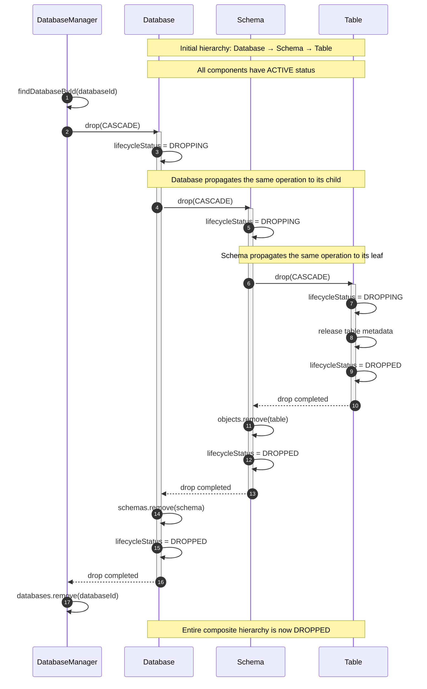

### 3.3 Code Example
### Component
```java 
public interface DatabaseComponent {
    UUID getId();
    String getName();
    String getOwner();
    String getQualifiedName();
    LifecycleStatus getLifecycleStatus();
    void rename(String newName);
    void drop(DropMode mode);
    List<DatabaseComponent> getChildren();
}
```
### Composite
```java
public class Schema implements DatabaseComponent {
    private UUID schemaId;
    private String name;
    private String owner;
    private LifecycleStatus lifecycleStatus;
    private List<SchemaObject> objects;

    public Schema(UUID schemaId, String name, String owner) {
        this.schemaId = schemaId;
        this.name = name;
        this.owner = owner;
        this.lifecycleStatus = LifecycleStatus.ACTIVE;
        this.objects = new ArrayList<>();
    }
    @Override
    public UUID getId() {
        return schemaId;
    }
    @Override
    public String getName() {
        return name;
    }
    @Override
    public String getOwner() {
        return owner;
    }
    @Override
    public String getQualifiedName() {
        return name;
    }
    @Override
    public LifecycleStatus getLifecycleStatus() {
        return lifecycleStatus;
    }
    public void addObject(SchemaObject object) {
        
    }
    public void removeObject(UUID objectId) {
        
    }
    @Override
    public void rename(String newName) {
        
    }
    @Override
    public void drop(DropMode mode) {
        
    }
    @Override
    public List<DatabaseComponent> getChildren() {
        return null;
    }
    private void dropChildren(DropMode mode) {
        
    }
    private void markAsDropping() {
        
    }
    private void markAsDropped() {
        
    }
}

public class Database implements DatabaseComponent {
    private UUID databaseId;
    private String name;
    private String owner;
    private LifecycleStatus lifecycleStatus;
    private List<Schema> schemas;

    public Database(UUID databaseId, String name, String owner) {
        this.databaseId = databaseId;
        this.name = name;
        this.owner = owner;
        this.lifecycleStatus = LifecycleStatus.ACTIVE;
        this.schemas = new ArrayList<>();
    }
    @Override
    public UUID getId() {
        return databaseId;
    }
    @Override
    public String getName() {
        return name;
    }
    @Override
    public String getOwner() {
        return owner;
    }
    @Override
    public String getQualifiedName() {
        return name;
    }
    @Override
    public LifecycleStatus getLifecycleStatus() {
        return lifecycleStatus;
    }
    public void addSchema(Schema schema) {
        
    }
    public void removeSchema(UUID schemaId) {
        
    }
    @Override
    public void rename(String newName) {
        
    }
    @Override
    public void drop(DropMode mode) {
        
    }
    @Override
    public List<DatabaseComponent> getChildren() {
        return null;
    }
    private void dropChildren(DropMode mode) {
        
    }
    private void markAsDropping() {
        
    }
    private void markAsDropped() {
        
    }
}

```
### Leaf
```java
public abstract class SchemaObject implements DatabaseComponent {
    protected UUID objectId;
    protected String name;
    protected String owner;
    protected UUID schemaId;
    protected LifecycleStatus lifecycleStatus;

    public SchemaObject(UUID objectId, String name, String owner, UUID schemaId) {
        this.objectId = objectId;
        this.name = name;
        this.owner = owner;
        this.schemaId = schemaId;
        this.lifecycleStatus = LifecycleStatus.ACTIVE;
    }
    @Override
    public UUID getId() {
        return objectId;
    }
    @Override
    public String getName() {
        return name;
    }
    @Override
    public String getOwner() {
        return owner;
    }
    @Override
    public LifecycleStatus getLifecycleStatus() {
        return lifecycleStatus;
    }
    @Override
    public void rename(String newName) {
        
    }
    @Override
    public void drop(DropMode mode) {
        
    }
    @Override
    public List<DatabaseComponent> getChildren() {
        return null;
    }
    protected void markAsDropping() {
        
    }
    protected void markAsDropped() {
        
    }
}

public class Table extends SchemaObject {
    private String engine;
    public Table(UUID objectId, String name, String owner, UUID schemaId, String engine) {
        super(objectId, name, owner, schemaId);
        this.engine = engine;
    }
    @Override
    public String getQualifiedName() {
        return name;
    }
    @Override
    protected void releaseMetadata() {
        
    }
}
public class View extends SchemaObject {
    private String queryDefinition;
    public View(UUID objectId, String name, String owner, UUID schemaId, String queryDefinition) {
        super(objectId, name, owner, schemaId);
        this.queryDefinition = queryDefinition;
    }
    @Override
    public String getQualifiedName() {
        return name;
    }
    @Override
    protected void releaseMetadata() {
        
    }
}
public class StoredProcedure extends SchemaObject {
    public StoredProcedure(UUID objectId, String name, String owner, UUID schemaId) {
        super(objectId, name, owner, schemaId);
    }
    @Override
    public String getQualifiedName() {
        return name;
    }
    @Override
    protected void releaseMetadata() {
        
    }
}
public class Sequence extends SchemaObject {
    public Sequence(UUID objectId, String name, String owner, UUID schemaId) {
        super(objectId, name, owner, schemaId);
    }
    @Override
    public String getQualifiedName() {
        return name;
    }
    @Override
    protected void releaseMetadata() {
       
    }
}
```

--- 

# 4. Table Definition and Lifecycle Management
## Using Builder Pattern

### 4.1 Class Diagram
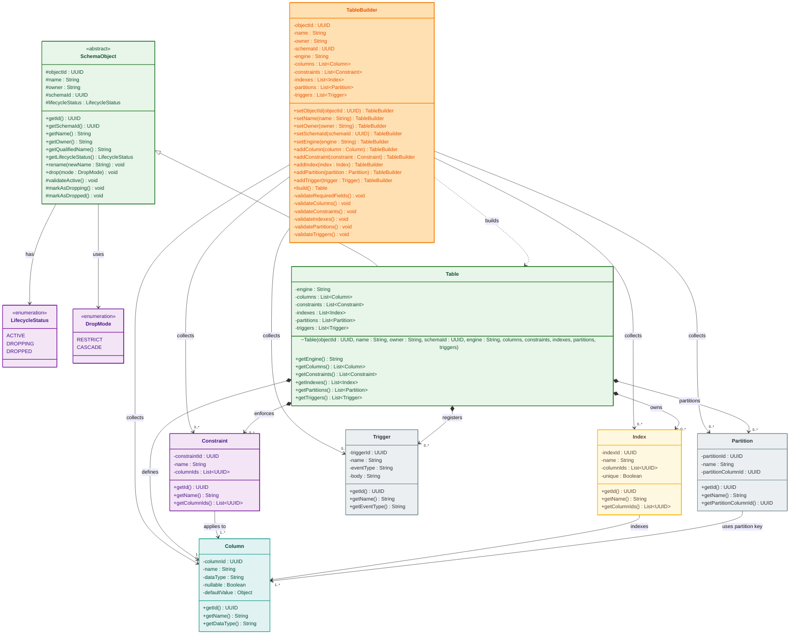

### 4.2 Sequence Diagram shouldBuildValidTableWithColumnsAndConstraints()
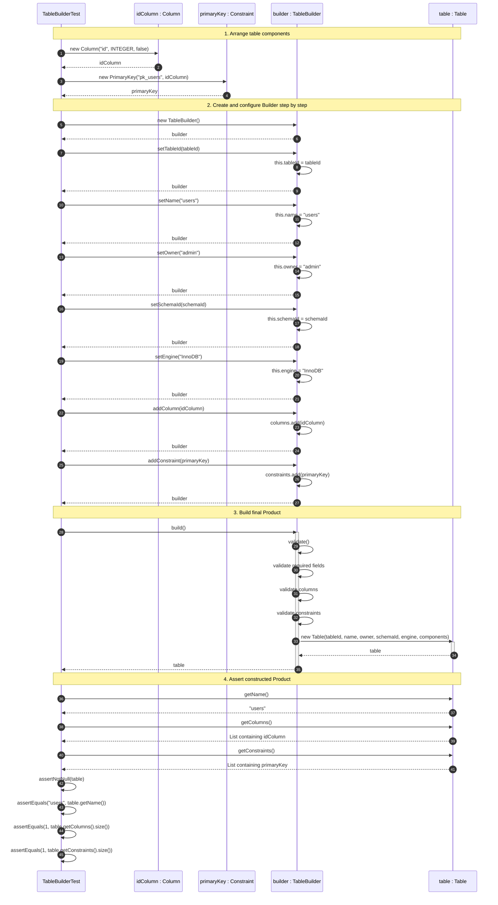

### 4.3 Code Example
```java
// TODO: Implement code example
```

--- 

# 5. Column Definition and Data Type Management
## Standard Domain Entity (No Pattern)

---

# 6. Constraint Definition and Data Integrity Validation
## Using Strategy Pattern

### 6.1 Class Diagram
```mermaid
classDiagram
direction TB

%% =====================================================
%% Context
%% =====================================================

class Table {
    -constraints : List~Constraint~

    +addConstraint(constraint : Constraint) void
    +removeConstraint(constraintId : UUID) void
    +validateConstraints(row : Row, context : ConstraintValidationContext) void
}

%% =====================================================
%% Strategy
%% =====================================================

class Constraint {
    <<interface>>

    +getId() UUID
    +getName() String
    +validate(row : Row, context : ConstraintValidationContext) void
}

%% =====================================================
%% Concrete Strategies
%% =====================================================

class PrimaryKey {
    -constraintId : UUID
    -name : String
    -columnIds : List~UUID~

    +getId() UUID
    +getName() String
    +validate(row : Row, context : ConstraintValidationContext) void
}

class UniqueConstraint {
    -constraintId : UUID
    -name : String
    -columnIds : List~UUID~

    +getId() UUID
    +getName() String
    +validate(row : Row, context : ConstraintValidationContext) void
}

class ForeignKey {
    -constraintId : UUID
    -name : String
    -columnIds : List~UUID~
    -referencedTableId : UUID
    -referencedColumnIds : List~UUID~

    +getId() UUID
    +getName() String
    +validate(row : Row, context : ConstraintValidationContext) void
}

class CheckConstraint {
    -constraintId : UUID
    -name : String
    -expression : String

    +getId() UUID
    +getName() String
    +validate(row : Row, context : ConstraintValidationContext) void
}

%% =====================================================
%% Supporting Types
%% =====================================================

class Row {
    -rowId : UUID
    -values : Map~UUID, Object~

    +getValue(columnId : UUID) Object
}

class ConstraintValidationContext {
    -currentTableId : UUID
    -transactionId : UUID

    +exists(tableId : UUID, columnIds : List~UUID~, values : List~Object~) boolean
    +isUnique(tableId : UUID, columnIds : List~UUID~, values : List~Object~) boolean
}

%% =====================================================
%% Strategy Relationships
%% =====================================================

Table *--> "0..*" Constraint : contains and executes

Constraint <|.. PrimaryKey
Constraint <|.. UniqueConstraint
Constraint <|.. ForeignKey
Constraint <|.. CheckConstraint

Table ..> Row : validates
Table --> ConstraintValidationContext : supplies

Constraint ..> Row : validates
Constraint ..> ConstraintValidationContext : uses

%% =====================================================
%% Styling
%% =====================================================

style Table fill:#e3f2fd,stroke:#1565c0,stroke-width:2px,color:#084298

style Constraint fill:#fff3e0,stroke:#ef6c00,stroke-width:2px,color:#7f2704

style PrimaryKey fill:#f3e5f5,stroke:#7b1fa2,stroke-width:1px,color:#4a148c
style UniqueConstraint fill:#f3e5f5,stroke:#7b1fa2,stroke-width:1px,color:#4a148c
style ForeignKey fill:#f3e5f5,stroke:#7b1fa2,stroke-width:1px,color:#4a148c
style CheckConstraint fill:#f3e5f5,stroke:#7b1fa2,stroke-width:1px,color:#4a148c

style Row fill:#e0f2f1,stroke:#009688,stroke-width:1px,color:#004d40
style ConstraintValidationContext fill:#e0f2f1,stroke:#009688,stroke-width:1px,color:#004d40
```

### 6.2 Sequence Diagram shouldValidateRowUsingMultipleConstraint()
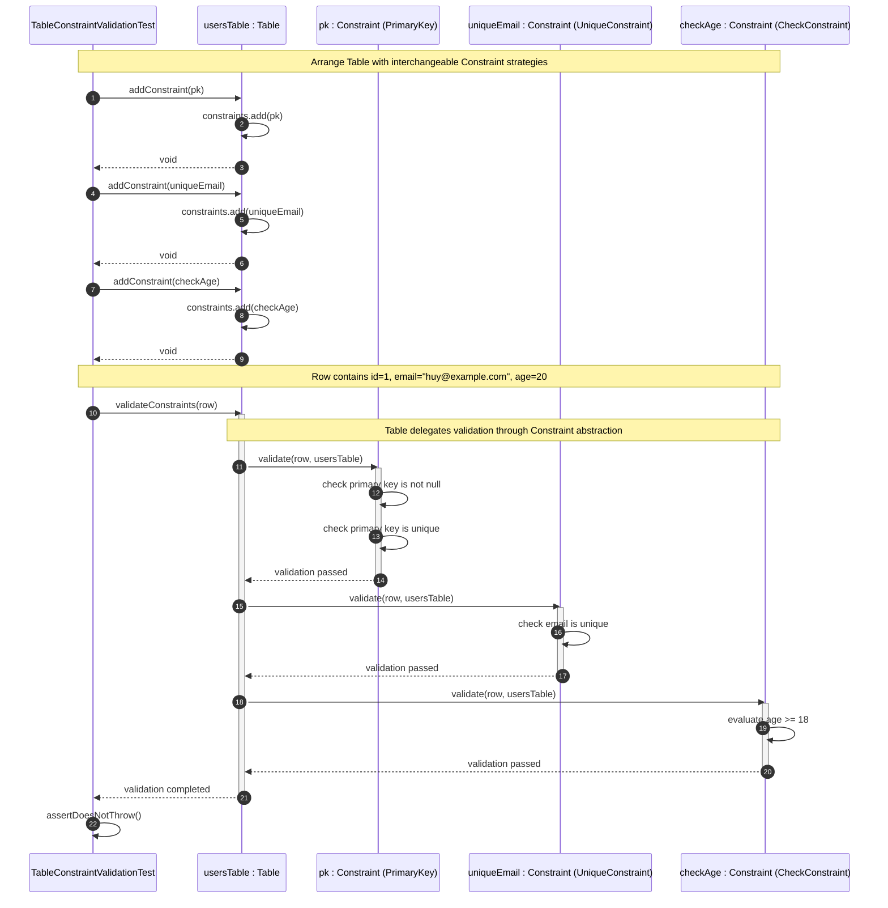

### 6.3 Code Example
### Strategy
```java
public abstract class Constraint {
    protected UUID constraintId;
    protected String constraintName;
    protected ConstraintType constraintType;
    protected UUID tableId;
    protected List<Column> columns;
    protected ConstraintStatus status;
    protected boolean enabled;

    public Constraint(UUID constraintId, String constraintName, ConstraintType constraintType, 
                      UUID tableId, List<Column> columns) {
        this.constraintId = constraintId;
        this.constraintName = constraintName;
        this.constraintType = constraintType;
        this.tableId = tableId;
        this.columns = new ArrayList<>(columns);
        this.status = ConstraintStatus.ACTIVE;
        this.enabled = true;
    }

    public String getConstraintName() { return constraintName; }
    public boolean isEnabled() { return enabled; }
    public void setEnabled(boolean enabled) { this.enabled = enabled; }
    public abstract void validate(Row row, Table table);
}
```
### Concrete Strategy 
```java
public class PrimaryKey extends Constraint {
    public PrimaryKey(UUID constraintId, String constraintName, UUID tableId, Column column) {
        super(constraintId, constraintName, ConstraintType.PRIMARY_KEY, tableId, Collections.singletonList(column));
    }
    @Override
    public void validate(Row row, Table table) {
       
    }
}

public class UniqueConstraint extends Constraint {
    public UniqueConstraint(UUID constraintId, String constraintName, UUID tableId, Column column) {
        super(constraintId, constraintName, ConstraintType.UNIQUE, tableId, Collections.singletonList(column));
    }
    @Override
    public void validate(Row row, Table table) {
        
    }
}

public class CheckConstraint extends Constraint {
    private String expression;
    public CheckConstraint(UUID constraintId, String constraintName, UUID tableId, Column column, String expression) {
        super(constraintId, constraintName, ConstraintType.CHECK, tableId, Collections.singletonList(column));
        this.expression = expression;
    }
    @Override
    public void validate(Row row, Table table) {
        
    }
}

public class ForeignKey extends Constraint {
    private Table referencedTable;
    private Column referencedColumn;
    public ForeignKey(UUID constraintId, String constraintName, UUID tableId, Column column,
                      Table referencedTable, Column referencedColumn) {
        super(constraintId, constraintName, ConstraintType.FOREIGN_KEY, tableId, Collections.singletonList(column));
        this.referencedTable = referencedTable;
        this.referencedColumn = referencedColumn;
    }
    @Override
    public void validate(Row row, Table table) {
        
    }
}
```

### Context 
```java
public class Table {
    private UUID tableId;
    private String name;
    private List<Column> columns = new ArrayList<>();
    private List<Constraint> constraints = new ArrayList<>();
    private List<Row> rows = new ArrayList<>();

    public Table(UUID tableId, String name) {
        this.tableId = tableId;
        this.name = name;
    }

    public String getName() { return name; }
    public List<Row> getRows() { return rows; }
    public void addColumn(Column column) {
        this.columns.add(column);
    }
    public void addConstraint(Constraint constraint) {
        this.constraints.add(constraint);
    }
    public void insertRow(Row row) {
        
    }
    public void validateConstraints(Row row) {
        
    }
} 
```
---

# 7. Table Data and Row Operations
## Using Template Method & Command Pattern

### 7.1 Class Diagram
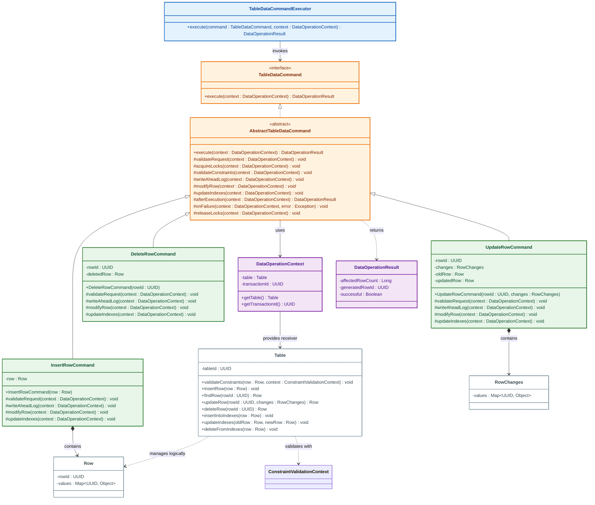

### 7.2 Sequence Diagram shouldExecuteInsertRowCommand()
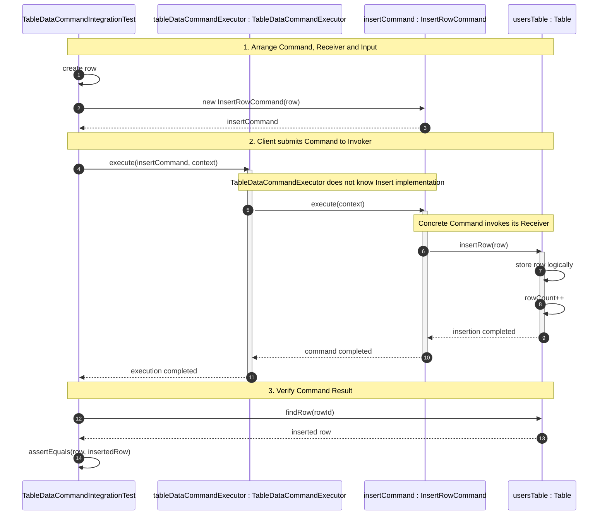

### 7.2 Sequence Diagram shouldExecuteInsertUsingTemplateWorkflow()
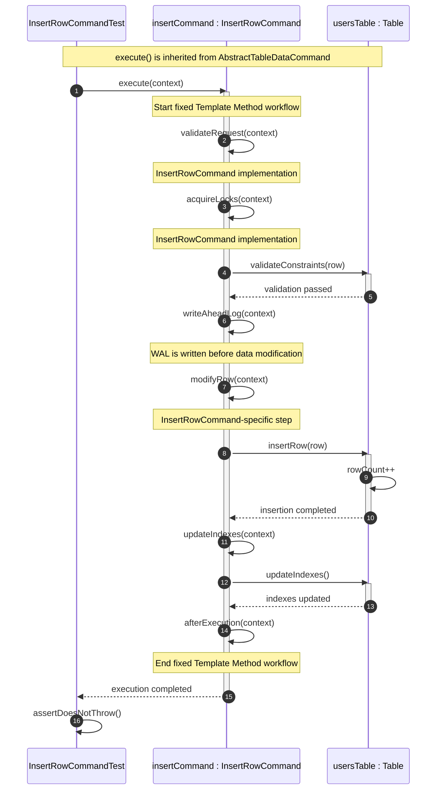

### 7.3 Code Example for Template Method
### AbstractCommand 
```java
public interface TableDataCommand {
    void execute(DataOperationContext context);
}

public abstract class AbstractTableDataCommand implements TableDataCommand {
    @Override
    public final void execute(DataOperationContext context) {

    }
    protected abstract void validateRequest(DataOperationContext context);
    protected abstract void acquireLocks(DataOperationContext context);
    protected abstract void writeAheadLog(DataOperationContext context);
    protected abstract void modifyRow(DataOperationContext context);
    protected abstract void updateIndexes(DataOperationContext context);
    protected void validateConstraints(DataOperationContext context) {
        
    }
    protected void afterExecution(DataOperationContext context) {
    }
    protected abstract Row getRow();
}

```
### Concrete class 
```java
public class InsertRowCommand extends AbstractTableDataCommand {
    private Row row;
    public InsertRowCommand(Row row) {
        this.row = row;
    }
    @Override
    protected Row getRow() {
        return row;
    }
    @Override
    protected void validateRequest(DataOperationContext context) {
        
    }
    @Override
    protected void acquireLocks(DataOperationContext context) {
    }
    @Override
    protected void writeAheadLog(DataOperationContext context) {
    }
    @Override
    protected void modifyRow(DataOperationContext context) {
        
    }
    @Override
    protected void updateIndexes(DataOperationContext context) {
        
    }
    @Override
    protected void afterExecution(DataOperationContext context) {
    }
} 
```

### 7.3 Code Example for Command Pattern 
### Receiver
```java
public class Table {
    private UUID tableId;
    private long rowCount;
    private Map<UUID, Row> storage = new HashMap<>();

    public Table(UUID tableId) {
        this.tableId = tableId;
        this.rowCount = 0L;
    }
    
    public void insertRow(Row row) {
        
    }
    public Row findRow(UUID rowId) {
        return null;
    }
    public long getRowCount() { return rowCount; }
}
```

### Command 
```java
public interface TableDataCommand {
    void execute(DataOperationContext context);
}
```

### Concrete Command
```java
public class InsertRowCommand implements TableDataCommand {
    private Row row;

    public InsertRowCommand(Row row) {
        this.row = row;
    }
    @Override
    public void execute(DataOperationContext context) {
        
    }
}
```

### Invoker
```java
public class TableDataCommandExecutor {
    public void execute(TableDataCommand command, DataOperationContext context) {
        
    }
}
```
---

# 8. Object Naming, Lookup, and Uniqueness Management
## Standard Domain Entity (No Pattern)

--- 

# 9. Index Definition and Management
## Using Strategy Pattern

### 9.1 Class diagram
```mermaid
classDiagram
direction TB

%% =====================================================
%% TABLE - INDEX OWNER
%% =====================================================

class Table {
    -indexes : List~Index~

    +addIndex(index : Index, context : IndexDefinitionContext) void
    +dropIndex(indexId : UUID) void

    +findIndexById(indexId : UUID) Index
    +findIndexByName(name : String) Index
    +listIndexes() List~Index~

    +insertIntoIndexes(row : Row, context : IndexOperationContext) void
    +updateIndexes(oldRow : Row, newRow : Row, context : IndexOperationContext) void
    +deleteFromIndexes(row : Row, context : IndexOperationContext) void
}

%% =====================================================
%% STRATEGY CONTEXT AND INDEX DEFINITION
%% =====================================================

class Index {
    -indexId : UUID
    -name : String
    -tableId : UUID
    -columnIds : List~UUID~
    -unique : Boolean
    -status : IndexStatus
    -accessMethod : IndexAccessMethod

    +getId() UUID
    +getName() String
    +getTableId() UUID
    +getColumnIds() List~UUID~
    +getType() IndexType
    +getStatus() IndexStatus
    +isUnique() boolean

    +validateDefinition(context : IndexDefinitionContext) void

    +build(context : IndexOperationContext) void
    +rebuild(context : IndexOperationContext) void
    +enable() void
    +disable() void
    +markInvalid() void
    +drop() void

    +insertEntry(row : Row, context : IndexOperationContext) void
    +updateEntry(oldRow : Row, newRow : Row, context : IndexOperationContext) void
    +deleteEntry(row : Row, context : IndexOperationContext) void

    +search(key : IndexKey) List~UUID~
    +rangeSearch(fromKey : IndexKey, toKey : IndexKey) List~UUID~

    -extractKey(row : Row) IndexKey
    -validateUniqueKey(key : IndexKey) void
    -ensureActive() void
}

%% =====================================================
%% STRATEGY
%% =====================================================

class IndexAccessMethod {
    <<interface>>

    +getType() IndexType
    +build(context : IndexOperationContext) void

    +insert(key : IndexKey, rowId : UUID) void
    +delete(key : IndexKey, rowId : UUID) void

    +search(key : IndexKey) List~UUID~
    +supportsRangeSearch() boolean
    +rangeSearch(fromKey : IndexKey, toKey : IndexKey) List~UUID~
}

%% =====================================================
%% CONCRETE STRATEGIES
%% =====================================================

class BTreeIndexAccessMethod {
    +getType() IndexType
    +build(context : IndexOperationContext) void

    +insert(key : IndexKey, rowId : UUID) void
    +delete(key : IndexKey, rowId : UUID) void

    +search(key : IndexKey) List~UUID~
    +supportsRangeSearch() boolean
    +rangeSearch(fromKey : IndexKey, toKey : IndexKey) List~UUID~
}

class HashIndexAccessMethod {
    +getType() IndexType
    +build(context : IndexOperationContext) void

    +insert(key : IndexKey, rowId : UUID) void
    +delete(key : IndexKey, rowId : UUID) void

    +search(key : IndexKey) List~UUID~
    +supportsRangeSearch() boolean
    +rangeSearch(fromKey : IndexKey, toKey : IndexKey) List~UUID~
}

class BitmapIndexAccessMethod {
    +getType() IndexType
    +build(context : IndexOperationContext) void

    +insert(key : IndexKey, rowId : UUID) void
    +delete(key : IndexKey, rowId : UUID) void

    +search(key : IndexKey) List~UUID~
    +supportsRangeSearch() boolean
    +rangeSearch(fromKey : IndexKey, toKey : IndexKey) List~UUID~
}

%% =====================================================
%% INDEX DEFINITION VALIDATION
%% =====================================================

class IndexDefinitionContext {
    -tableId : UUID
    -columns : List~Column~
    -existingIndexes : List~Index~

    +hasColumn(columnId : UUID) boolean
    +hasIndexName(name : String) boolean
    +hasEquivalentIndex(columnIds : List~UUID~, type : IndexType) boolean
    +supportsType(columnId : UUID, type : IndexType) boolean
}

%% =====================================================
%% INDEX OPERATION CONTEXT
%% =====================================================

class IndexOperationContext {
    -tableId : UUID
    -transactionId : UUID

    +getTableId() UUID
    +getTransactionId() UUID
    +scanRows() List~Row~
}

%% =====================================================
%% SUPPORTING DOMAIN TYPES
%% =====================================================

class IndexKey {
    -values : List~Object~

    +getValues() List~Object~
}

class IndexType {
    <<enumeration>>

    BTREE
    HASH
    BITMAP
}

class IndexStatus {
    <<enumeration>>

    BUILDING
    ACTIVE
    DISABLED
    REBUILDING
    INVALID
    DROPPED
}

class Column {
    -columnId : UUID
    -name : String
    -dataType : DataType

    +getId() UUID
    +getName() String
    +getDataType() DataType
}

class Row {
    -rowId : UUID
    -values : Map~UUID, Object~

    +getId() UUID
    +getValue(columnId : UUID) Object
}

class DataType {
    <<enumeration>>
}

%% =====================================================
%% TABLE AND INDEX RELATIONSHIPS
%% =====================================================

Table *--> "0..*" Index : owns and maintains
Table *--> "1..*" Column : defines

Table ..> Row : handles data changes
Table ..> IndexDefinitionContext : validates index with
Table ..> IndexOperationContext : supplies operation context

%% =====================================================
%% STRATEGY RELATIONSHIPS
%% =====================================================

Index *--> IndexAccessMethod : delegates operations

IndexAccessMethod <|.. BTreeIndexAccessMethod
IndexAccessMethod <|.. HashIndexAccessMethod
IndexAccessMethod <|.. BitmapIndexAccessMethod

%% =====================================================
%% DEFINITION AND OPERATION DEPENDENCIES
%% =====================================================

Index ..> IndexDefinitionContext : validates definition with
Index ..> IndexOperationContext : builds and maintains with

Index --> IndexType : identifies
Index --> IndexStatus : has lifecycle status
Index --> "1..*" Column : indexes

Index ..> Row : extracts key from
Index ..> IndexKey : creates and searches

IndexAccessMethod ..> IndexKey : organizes
IndexAccessMethod ..> IndexOperationContext : builds from

IndexDefinitionContext --> Column : resolves
IndexDefinitionContext --> Index : checks existing

Column --> DataType : uses

%% =====================================================
%% STYLING
%% =====================================================

style Table fill:#e8f5e9,stroke:#2e7d32,stroke-width:2px,color:#0f5132
style Index fill:#fff8e1,stroke:#f9a825,stroke-width:2px,color:#664d03

style IndexAccessMethod fill:#fff3e0,stroke:#ef6c00,stroke-width:2px,color:#7f2704
style BTreeIndexAccessMethod fill:#fff3e0,stroke:#ef6c00,stroke-width:1px,color:#7f2704
style HashIndexAccessMethod fill:#fff3e0,stroke:#ef6c00,stroke-width:1px,color:#7f2704
style BitmapIndexAccessMethod fill:#fff3e0,stroke:#ef6c00,stroke-width:1px,color:#7f2704

style IndexDefinitionContext fill:#e3f2fd,stroke:#1565c0,stroke-width:2px,color:#084298
style IndexOperationContext fill:#e3f2fd,stroke:#1565c0,stroke-width:2px,color:#084298

style IndexType fill:#f3e5f5,stroke:#7b1fa2,stroke-width:1px,color:#4a148c
style IndexStatus fill:#f3e5f5,stroke:#7b1fa2,stroke-width:1px,color:#4a148c
style IndexKey fill:#f3e5f5,stroke:#7b1fa2,stroke-width:1px,color:#4a148c

style Column fill:#e0f2f1,stroke:#009688,stroke-width:1px,color:#004d40
style Row fill:#e0f2f1,stroke:#009688,stroke-width:1px,color:#004d40
style DataType fill:#e0f2f1,stroke:#009688,stroke-width:1px,color:#004d40

### 9.2 Sequence Diagram Search Rows Using Selected Index Strategy
```mermaid
sequenceDiagram
    autonumber

    box #e3f2fd Client
        participant Client as executor : QueryExecutor
    end

    box #e8f5e9 Context
        participant T as usersTable : Table
        participant Index as index : Index
    end

    box #fff3e0 Strategy
        participant Strategy as accessMethod : BTreeIndexAccessMethod
    end

    Note over Client,Strategy: Search rows using B-Tree index strategy

    Client->>T: findIndexById(indexId)
    activate T
    T-->>Client: index : Index
    deactivate T

    Client->>Index: search(key)
    activate Index

    Note right of Index: Context delegates search<br/>to the concrete strategy

    Index->>Strategy: search(key)
    activate Strategy
    Strategy->>Strategy: traverseBTree(key)
    Strategy-->>Index: rowIds : List<UUID>
    deactivate Strategy

    Index-->>Client: rowIds : List<UUID>
    deactivate Index
```

### 9.3 Code Example for Search Rows Using Selected Index Strategy
### Strategy Interface
```java
public interface IndexAccessMethod {
    IndexType getType();
    void build(IndexOperationContext context);
    void insert(IndexKey key, UUID rowId);
    void delete(IndexKey key, UUID rowId);
    List<UUID> search(IndexKey key);
    boolean supportsRangeSearch();
    List<UUID> rangeSearch(IndexKey fromKey, IndexKey toKey);
}
```

### Concrete Strategy
```java
public class BTreeIndexAccessMethod implements IndexAccessMethod {
    @Override
    public IndexType getType() {
        return IndexType.BTREE;
    }

    @Override
    public void build(IndexOperationContext context) {
        System.out.println("Building BTree index structure...");
    }

    @Override
    public void insert(IndexKey key, UUID rowId) {
        System.out.println("Inserting key into BTree: " + key.getValues());
    }

    @Override
    public void delete(IndexKey key, UUID rowId) {
        System.out.println("Deleting key from BTree: " + key.getValues());
    }

    @Override
    public List<UUID> search(IndexKey key) {
        System.out.println("Searching BTree for key: " + key.getValues());
        return new ArrayList<>();
    }

    @Override
    public boolean supportsRangeSearch() {
        return true;
    }

    @Override
    public List<UUID> rangeSearch(IndexKey fromKey, IndexKey toKey) {
        System.out.println("Range searching BTree from: " + fromKey.getValues() + " to: " + toKey.getValues());
        return new ArrayList<>();
    }
}
```

### Context (Index)
```java
public class Index {
    private UUID indexId;
    private String name;
    private UUID tableId;
    private List<UUID> columnIds;
    private boolean unique;
    private IndexStatus status;
    private IndexAccessMethod accessMethod;

    public Index(UUID indexId, String name, UUID tableId, List<UUID> columnIds, boolean unique, IndexAccessMethod accessMethod) {
        this.indexId = indexId;
        this.name = name;
        this.tableId = tableId;
        this.columnIds = columnIds;
        this.unique = unique;
        this.status = IndexStatus.ACTIVE;
        this.accessMethod = accessMethod;
    }

    public UUID getId() { return indexId; }
    public String getName() { return name; }
    public UUID getTableId() { return tableId; }
    public List<UUID> getColumnIds() { return columnIds; }
    public boolean isUnique() { return unique; }
    public IndexStatus getStatus() { return status; }

    public List<UUID> search(IndexKey key) {
        return null;
    }

    public void insertEntry(Row row, IndexOperationContext context) {

    }

    public void deleteEntry(Row row, IndexOperationContext context) {

    }

    private void ensureActive() {
        
    }

    private IndexKey extractKey(Row row) {
        return null;
    }

    private void validateUniqueKey(IndexKey key) {
        
    }
}
```

### Table (Owner)
```java
public class Table {
    private List<Index> indexes = new ArrayList<>();

    public void addIndex(Index index, IndexDefinitionContext context) {
        
    }

    public void dropIndex(UUID indexId) {
       
    }

    public Index findIndexById(UUID indexId) {
        return null;
    }

    public Index findIndexByName(String name) {
        return null;
    }

    public List<Index> listIndexes() {
        return new ArrayList<>(indexes);
    }
}
```

### Client (QueryExecutor)
```java
public class QueryExecutor {
    public List<UUID> executeSearch(Table table, UUID indexId, IndexKey key) {
        return null;
    }
}
```
# Query Processing feature mindmap
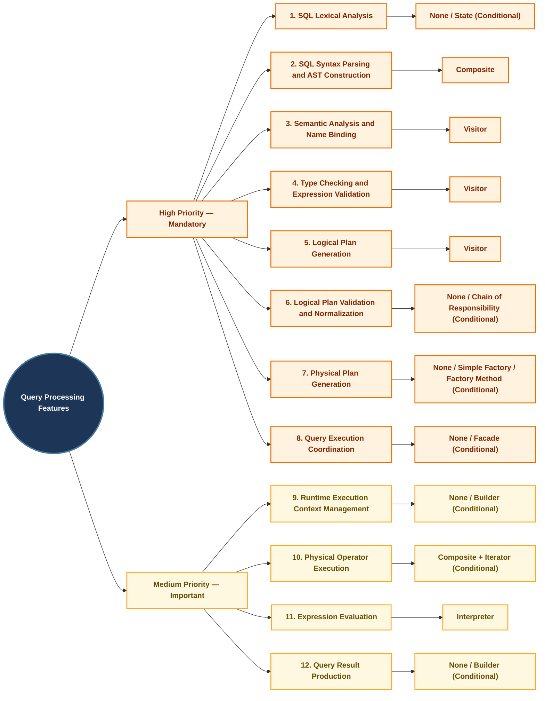