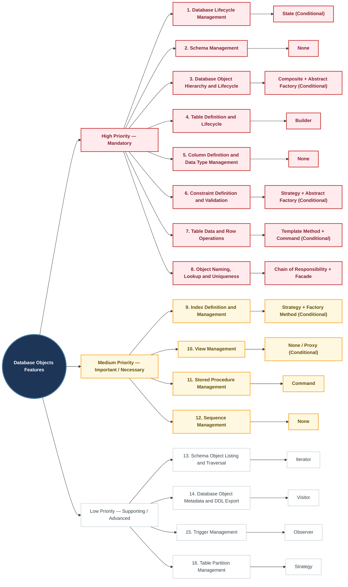
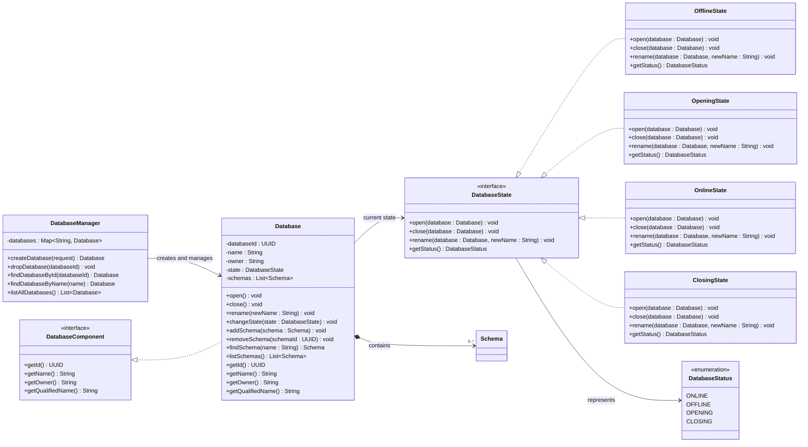
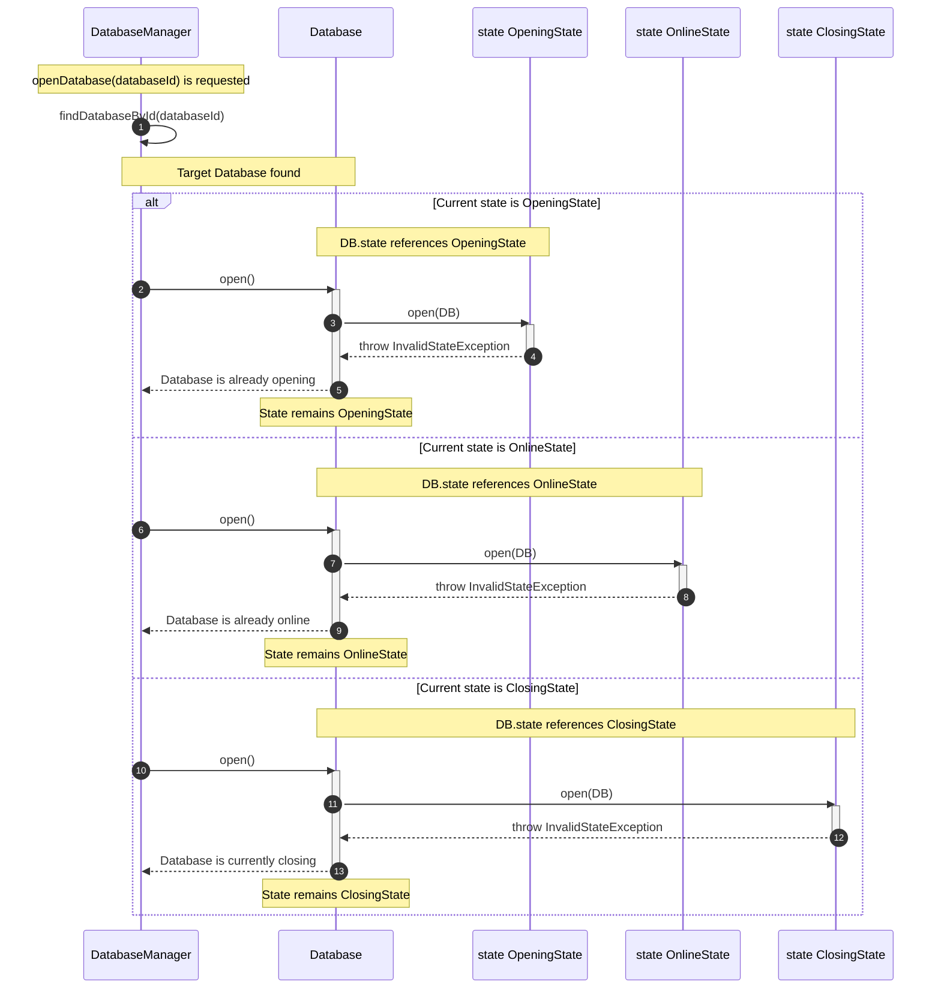

# Database Objects Feature mindmap

# Database Objects Feature and Design Pattern Analysis

| Priority | Feature | Suitable Design Pattern | Usage | Justification / Rationale |
|---:|---|---|---|---|
| 1 | Database Lifecycle Management | State (Conditional) | Define a `DatabaseState` interface with implementations such as `OnlineState`, `OfflineState`, `OpeningState`, and `ClosingState`. The `Database` delegates state-dependent operations such as `open()`, `close()`, and `rename()` to its current state. | State is suitable when each database state has different behaviors and transition rules. If the lifecycle only requires a few simple conditions, a `DatabaseStatus` enum is sufficient and State would be unnecessary. |
| 2 | Schema Management | None | The `Database` directly manages its `Schema` collection through methods such as `addSchema()`, `removeSchema()`, `findSchema()`, and `listSchemas()`. | `Schema` is currently a straightforward domain entity and container. Introducing a design pattern would add complexity without solving a meaningful variation or coupling problem. |
| 3 | Database Object Hierarchy and Lifecycle Management | Composite; Abstract Factory (Conditional) | `DatabaseComponent` acts as the common component. `Database` and `Schema` act as composite containers, while `Table`, `View`, `StoredProcedure`, and `Sequence` act as leaf objects. `Schema` may use `DatabaseObjectFactory` to create schema objects. | Composite matches the hierarchical structure `Database → Schema → DatabaseObject`. Abstract Factory is only justified when the system supports multiple families of database objects, such as different SQL dialects, storage engines, or catalog implementations. |
| 4 | Table Definition and Lifecycle Management | Builder | `TableBuilder` incrementally collects the table name, engine, columns, constraints, indexes, partitions, and triggers. Its `build()` method validates the complete configuration before creating a `Table`. | `Table` is a complex object containing multiple collections and consistency rules. Builder prevents telescoping constructors and ensures that an invalid or incomplete table cannot be created. |
| 5 | Column Definition and Data Type Management | None | Create a `Column` directly through a constructor or static creation method with parameters such as `DataType`, length, precision, scale, nullability, and default value. | `Column` is a relatively simple value/domain object with no complex product family or interchangeable algorithm. Applying a GoF pattern would be unnecessary over-engineering. |
| 6 | Constraint Definition and Data Integrity Validation | Strategy; Abstract Factory (Conditional) | `Table` maintains a collection of `Constraint` objects and calls `validate(row, table)` without knowing whether the concrete constraint is a `PrimaryKey`, `ForeignKey`, `UniqueConstraint`, or `CheckConstraint`. `ConstraintFactory` may create constraints from parsed SQL or configuration requests. | Each constraint implements a different validation algorithm, making Strategy appropriate. A factory is only necessary when constraints must be created dynamically from external input; otherwise, direct construction is sufficient. |
| 7 | Table Data and Row Operations | Template Method; Command (Conditional) | Define an abstract `DataModificationOperation` with a standard execution flow: validate data, acquire locks, write WAL records, modify rows, update indexes, and release resources. Concrete operations such as `InsertOperation`, `UpdateOperation`, and `DeleteOperation` customize specific steps. DML requests may optionally be represented as command objects. | Template Method ensures that every data modification follows the same safe transactional workflow. Command is useful only when operations must be queued, schedule, passed as objects, or executed by an invoker. Transaction rollback should still rely on Transaction Management and WAL rather than only on `Command.undo()`. |
| 8 | Object Naming, Lookup, and Uniqueness Management | Chain of Responsibility; Facade | Build a validation chain such as `NullNameValidator → FormatValidator → ReservedWordValidator → UniquenessValidator`. `CatalogManager` exposes a unified API for registering, finding, and removing database objects. | Chain of Responsibility separates independent naming rules and allows new validators to be added without modifying existing validators. Facade allows clients to access catalog operations without depending directly on `Database`, `Schema`, and internal catalog structures. |
| 9 | Index Definition and Management | Strategy; Factory Method (Conditional) | Define a common index abstraction with operations such as `search()`, `insertKey()`, and `deleteKey()`. `BTreeIndex`, `HashIndex`, and `BitmapIndex` provide different implementations. Concrete index creators may be introduced when each index type has a significantly different construction process. | Index structures use different search and update algorithms, making Strategy appropriate. Factory Method is only justified when object construction varies through creator subclasses. A single `IndexFactory.create(type)` method containing a switch statement is a Simple Factory, not the GoF Factory Method pattern. |
| 10 | View Management | None in the Current Design; Proxy (Conditional) | If clients must query a `View` exactly like a `Table`, introduce a `QueryableRelation` interface implemented by both classes. The `View` stores a query definition and delegates execution to `QueryExecutor` or its underlying tables. | The current `View` only stores `queryDefinition` and does not share a query interface with `Table`; therefore, it is not currently a Proxy. Proxy becomes appropriate only when transparent access to tables and views through the same abstraction is required. |
| 11 | Stored Procedure Management | Command | Keep `StoredProcedure` as the catalog definition. Represent each invocation as a `ProcedureCallCommand` containing the procedure identifier, arguments, and execution context. `ProcedureExecutor` acts as the invoker. | A stored procedure call is an independent executable request with parameters, results, and error handling. Command separates procedure metadata from invocation and execution responsibilities. |
| 12 | Sequence Management | None | Implement `Sequence.nextValue()` directly by incrementing the current value, checking the maximum value, and applying the cycle configuration. | The current sequence behavior is simple enough to express with clear conditional logic. State would only be justified if states such as active, exhausted, and cycling introduced substantially different behaviors and transition rules. |
| 13 | Schema Object Listing and Traversal | Iterator | `Schema.iterator()` creates a `SchemaObjectIterator`. The iterator exposes `hasNext()` and `next()` for traversing database objects without exposing the collection used internally by `Schema`. | Iterator decouples traversal from the internal representation. `Schema` can later replace its `List` with another collection without changing client traversal code. |
| 14 | Database Object Metadata and DDL Export | Visitor | `Table`, `View`, `StoredProcedure`, and `Sequence` implement `accept(visitor)`. `ExportDDLVisitor` provides a corresponding `visit()` operation for each database object type and generates its DDL representation. | DDL generation varies by object type but does not belong to the core responsibility of domain entities. Visitor allows new external operations, such as DDL export, documentation generation, or dependency collection, without adding those operations directly to every domain class. |
| 15 | Trigger Management | Observer | The DML execution layer publishes events such as `BeforeInsert`, `AfterInsert`, `BeforeUpdate`, and `AfterDelete`. Registered `Trigger` objects receive matching events through a `TriggerDispatcher`. | Triggers are naturally event-driven. Observer decouples data modification operations from trigger actions. The dispatcher must still control execution order, error handling, and cancellation, especially for before-event triggers. |
| 16 | Table Partition Management | Strategy | Define a `PartitionStrategy` interface with a method such as `locatePartition(row)`. Implementations such as `RangePartitionStrategy`, `ListPartitionStrategy`, and `HashPartitionStrategy` provide different row-routing algorithms. `PartitionManager` delegates partition selection to the configured strategy. | Partition-routing algorithms vary independently from the `Table` entity. Strategy removes large conditional blocks and allows new partitioning algorithms to be introduced without modifying `Table`. |


# 1. Database Lifecycle Management
## Using State Pattern

### 1.1 Class Diagram


### 1.2 Sequence Diagram for shouldRejectOpenBaseOnCurrentState()


### 1.3 Code Example

#### State Interface and Enum State
```java
public enum DatabaseStatus {
    OFFLINE, OPENING, ONLINE, CLOSING
}

public interface DatabaseState {

    void open(Database database);
    
    void close(Database database);
    
    void rename(Database database, String newName);
    
    DatabaseStatus getStatus();
}
```

#### Concrete State Classes
```java
public class OfflineState implements DatabaseState {

    @Override
    public void open(Database database) {
        database.validateNewName();
        database.initialize();
        database.changeState(new OpeningState());
    }

    @Override
    public void close(Database database) {
        
    }

    @Override
    public void rename(Database database, String newName) {
        
    }

    @Override
    public DatabaseStatus getStatus() {
        return DatabaseStatus.OFFLINE;
    }
}

public class OpeningState implements DatabaseState {

    @Override
    public void open(Database database) {
        
    }

    @Override
    public void close(Database database) {
        
    }

    @Override
    public void rename(Database database, String newName) {
        
    }

    @Override
    public DatabaseStatus getStatus() {
        return DatabaseStatus.OPENING;
    }
}

public class OnlineState implements DatabaseState {

    @Override
    public void open(Database database) {
        
    }

    @Override
    public void close(Database database) {
        
    }

    @Override
    public void rename(Database database, String newName) {
        
    }

    @Override
    public DatabaseStatus getStatus() {
        return DatabaseStatus.ONLINE;
    }
}

public class ClosingState implements DatabaseState {

    @Override
    public void open(Database database) {
       
    }

    @Override
    public void close(Database database) {
       
    }

    @Override
    public void rename(Database database, String newName) {
        
    }

    @Override
    public DatabaseStatus getStatus() {
        return DatabaseStatus.CLOSING;
    }
}
```

#### Context
```java
public class Database {
    private DatabaseState state;
    private String name;
    private String owner;
    private UUID databaseId;
    private List<Schema> schemas;

    public Database(String name, String owner) {
        this.name = name;
        this.owner = owner;
        this.state = new OfflineState();
        this.schemas = new ArrayList<>();
    }

    public void open() {
        state.open(this);
    }

    public void close() {
        state.close(this);
    }

    public void rename(String newName) {
        state.rename(this, newName);
    }

    public void changeState(DatabaseState state) {
        this.state = state;
    }

    public DatabaseStatus getStatus() {
        return state.getStatus();
    }
}
```

#### Client 
```java
public class DatabaseManager() {
    private Map<UUID, Database> databases = new HashMap<>();
    private StorageEngine storageEngine;
    private CatalogManager catalogManager;

    public DatabaseManager(StorageEngine storageEngine, CatalogManager catalogManager) {
        this.storageEngine = storageEngine;
        this.catalogManager = catalogManager;
    }

    public Database openDatabase(UUID databaseId) {
        return null;
    }   
}
```

---

# 2. Schema Management
## Standard Domain Entity (No Pattern)

---

# 3. Database Object Hierarchy and Lifecycle Management
## Using Composite & Abstract Factory Pattern

### 3.1 Class Diagram
```mermaid
classDiagram
%% TODO: Implement class diagram
```

### 3.2 Sequence Diagram
```mermaid
sequenceDiagram
%% TODO: Implement sequence diagram
```

### 3.3 Code Example
```java
// TODO: Implement code example
```

--- 

# 4. Table Definition and Lifecycle Management
## Using Builder Pattern

### 4.1 Class Diagram
```mermaid
classDiagram
%% TODO: Implement class diagram
```

### 4.2 Sequence Diagram
```mermaid
sequenceDiagram
%% TODO: Implement sequence diagram
```

### 4.3 Code Example
```java
// TODO: Implement code example
```

--- 

# 5. Column Definition and Data Type Management
## Standard Domain Entity (No Pattern)

### 5.1 Class Diagram
```mermaid
classDiagram
%% TODO: Implement class diagram
```

### 5.2 Sequence Diagram
```mermaid
sequenceDiagram
%% TODO: Implement sequence diagram
```

### 5.3 Code Example
```java
// TODO: Implement code example
```

---

# 6. Constraint Definition and Data Integrity Validation
## Using Strategy & Factory Method Pattern

### 6.1 Class Diagram
```mermaid
classDiagram
%% TODO: Implement class diagram
```

### 6.2 Sequence Diagram
```mermaid
sequenceDiagram
%% TODO: Implement sequence diagram
```

### 6.3 Code Example
```java
// TODO: Implement code example
```

---

# 7. Table Data and Row Operations
## Using Template Method & Command Pattern

### 7.1 Class Diagram
```mermaid
classDiagram
%% TODO: Implement class diagram
```

### 7.2 Sequence Diagram
```mermaid
sequenceDiagram
%% TODO: Implement sequence diagram
```

### 7.3 Code Example
```java
// TODO: Implement code example
```

---

# 8. Object Naming, Lookup, and Uniqueness Management
## Using Chain of Responsibility & Facade Pattern

### 8.1 Class Diagram
```mermaid
classDiagram
%% TODO: Implement class diagram
```

### 8.2 Sequence Diagram
```mermaid
sequenceDiagram
%% TODO: Implement sequence diagram
```

### 8.3 Code Example
```java
// TODO: Implement code example
```
