# Database Objects Feature mindmap
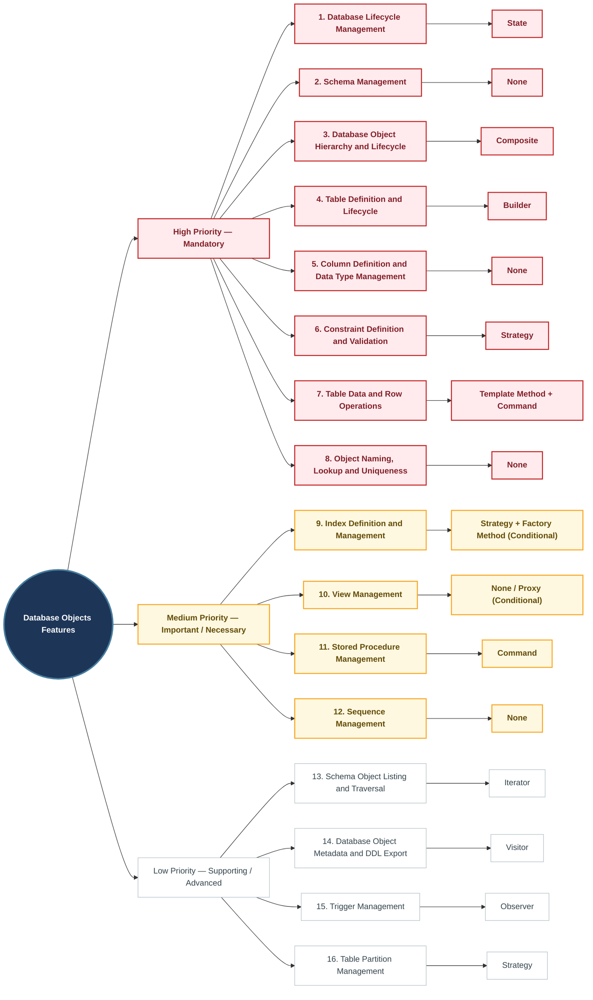
```mermaid
flowchart LR
    ROOT((Database Objects Features))

    %% =====================================================
    %% PRIORITY GROUPS
    %% =====================================================
    HIGH["High Priority — Mandatory"]
    MEDIUM["Medium Priority — Important / Necessary"]
    LOW["Low Priority — Supporting / Advanced"]

    ROOT --> HIGH
    ROOT --> MEDIUM
    ROOT --> LOW

    %% =====================================================
    %% HIGH-PRIORITY FEATURES
    %% =====================================================
    H1["1. Database Lifecycle Management"]
    H1P["State"]

    H2["2. Schema Management"]
    H2P["None"]

    H3["3. Database Object Hierarchy and Lifecycle"]
    H3P["Composite"]

    H4["4. Table Definition and Lifecycle"]
    H4P["Builder"]

    H5["5. Column Definition and Data Type Management"]
    H5P["None"]

    H6["6. Constraint Definition and Validation"]
    H6P["Strategy"]

    H7["7. Table Data and Row Operations"]
    H7P["Template Method + Command"]

    H8["8. Object Naming, Lookup and Uniqueness"]
    H8P["None"]

    HIGH --> H1
    HIGH --> H2
    HIGH --> H3
    HIGH --> H4
    HIGH --> H5
    HIGH --> H6
    HIGH --> H7
    HIGH --> H8

    H1 --> H1P
    H2 --> H2P
    H3 --> H3P
    H4 --> H4P
    H5 --> H5P
    H6 --> H6P
    H7 --> H7P
    H8 --> H8P

    %% =====================================================
    %% MEDIUM-PRIORITY FEATURES
    %% =====================================================
    M1["9. Index Definition and Management"]
    M1P["Strategy + Factory Method (Conditional)"]

    M2["10. View Management"]
    M2P["None / Proxy (Conditional)"]

    M3["11. Stored Procedure Management"]
    M3P["Command"]

    M4["12. Sequence Management"]
    M4P["None"]

    MEDIUM --> M1
    MEDIUM --> M2
    MEDIUM --> M3
    MEDIUM --> M4

    M1 --> M1P
    M2 --> M2P
    M3 --> M3P
    M4 --> M4P

    %% =====================================================
    %% LOW-PRIORITY FEATURES
    %% =====================================================
    L1["13. Schema Object Listing and Traversal"]
    L1P["Iterator"]

    L2["14. Database Object Metadata and DDL Export"]
    L2P["Visitor"]

    L3["15. Trigger Management"]
    L3P["Observer"]

    L4["16. Table Partition Management"]
    L4P["Strategy"]

    LOW --> L1
    LOW --> L2
    LOW --> L3
    LOW --> L4

    L1 --> L1P
    L2 --> L2P
    L3 --> L3P
    L4 --> L4P

    %% =====================================================
    %% STYLE ASSIGNMENTS
    %% =====================================================
    class ROOT rootStyle

    class HIGH,H1,H1P,H2,H2P,H3,H3P,H4,H4P highStyle
    class H5,H5P,H6,H6P,H7,H7P,H8,H8P highStyle

    class MEDIUM,M1,M1P,M2,M2P,M3,M3P,M4,M4P mediumStyle

    class LOW,L1,L1P,L2,L2P,L3,L3P,L4,L4P lowStyle

    %% =====================================================
    %% STYLE DEFINITIONS
    %% =====================================================
    classDef rootStyle fill:#1d3557,stroke:#457b9d,stroke-width:3px,color:#ffffff,font-weight:bold

    classDef highStyle fill:#ffebee,stroke:#c62828,stroke-width:2px,color:#842029,font-weight:bold

    classDef mediumStyle fill:#fff8e1,stroke:#f9a825,stroke-width:2px,color:#664d03,font-weight:bold

    classDef lowStyle fill:#ffffff,stroke:#b0bec5,stroke-width:1px,color:#37474f
```
# Database Objects Feature and Design Pattern Analysis

| Priority | Feature | Suitable Design Pattern | Usage | Justification / Rationale |
|---:|---|---|---|---|
| 1 | Database Lifecycle Management | State | Define a `DatabaseState` interface with implementations such as `OnlineState`, `OfflineState`, `OpeningState`, and `ClosingState`. The `Database` delegates state-dependent operations such as `open()`, `close()`, and `rename()` to its current state. | State is suitable when each database state has different behaviors and transition rules. If the lifecycle only requires a few simple conditions, a `DatabaseStatus` enum is sufficient and State would be unnecessary. |
| 2 | Schema Management | None | The `Database` directly manages its `Schema` collection through methods such as `addSchema()`, `removeSchema()`, `findSchema()`, and `listSchemas()`. | `Schema` is currently a straightforward domain entity and container. Introducing a design pattern would add complexity without solving a meaningful variation or coupling problem. |
| 3 | Database Object Hierarchy and Lifecycle Management | Composite | `DatabaseComponent` acts as the common component. `Database` and `Schema` act as composite containers, while `Table`, `View`, `StoredProcedure`, and `Sequence` act as leaf objects. `Schema` may use `DatabaseObjectFactory` to create schema objects. | Composite matches the hierarchical structure `Database → Schema → DatabaseObject`. Abstract Factory is only justified when the system supports multiple families of database objects, such as different SQL dialects, storage engines, or catalog implementations. |
| 4 | Table Definition and Lifecycle Management | Builder | `TableBuilder` incrementally collects the table name, engine, columns, constraints, indexes, partitions, and triggers. Its `build()` method validates the complete configuration before creating a `Table`. | `Table` is a complex object containing multiple collections and consistency rules. Builder prevents telescoping constructors and ensures that an invalid or incomplete table cannot be created. |
| 5 | Column Definition and Data Type Management | None | Create a `Column` directly through a constructor or static creation method with parameters such as `DataType`, length, precision, scale, nullability, and default value. | `Column` is a relatively simple value/domain object with no complex product family or interchangeable algorithm. Applying a GoF pattern would be unnecessary over-engineering. |
| 6 | Constraint Definition and Data Integrity Validation | Strategy | `Table` maintains a collection of `Constraint` objects and calls `validate(row, table)` without knowing whether the concrete constraint is a `PrimaryKey`, `ForeignKey`, `UniqueConstraint`, or `CheckConstraint`. `ConstraintFactory` may create constraints from parsed SQL or configuration requests. | Each constraint implements a different validation algorithm, making Strategy appropriate. A factory is only necessary when constraints must be created dynamically from external input; otherwise, direct construction is sufficient. |
| 7 | Table Data and Row Operations | Template Method; Command | Define an abstract `DataModificationOperation` with a standard execution flow: validate data, acquire locks, write WAL records, modify rows, update indexes, and release resources. Concrete operations such as `InsertOperation`, `UpdateOperation`, and `DeleteOperation` customize specific steps. DML requests may optionally be represented as command objects. | Template Method ensures that every data modification follows the same safe transactional workflow. Command is useful only when operations must be queued, schedule, passed as objects, or executed by an invoker. Transaction rollback should still rely on Transaction Management and WAL rather than only on `Command.undo()`. |
| 8 | Object Naming, Lookup, and Uniqueness Management | Facade | Build a validation chain such as `NullNameValidator → FormatValidator → ReservedWordValidator → UniquenessValidator`. `CatalogManager` exposes a unified API for registering, finding, and removing database objects. | Chain of Responsibility separates independent naming rules and allows new validators to be added without modifying existing validators. Facade allows clients to access catalog operations without depending directly on `Database`, `Schema`, and internal catalog structures. |
| 9 | Index Definition and Management | Strategy; Factory Method (Conditional) | Define a common index abstraction with operations such as `search()`, `insertKey()`, and `deleteKey()`. `BTreeIndex`, `HashIndex`, and `BitmapIndex` provide different implementations. Concrete index creators may be introduced when each index type has a significantly different construction process. | Index structures use different search and update algorithms, making Strategy appropriate. Factory Method is only justified when object construction varies through creator subclasses. A single `IndexFactory.create(type)` method containing a switch statement is a Simple Factory, not the GoF Factory Method pattern. |
| 10 | View Management | None in the Current Design; Proxy (Conditional) | If clients must query a `View` exactly like a `Table`, introduce a `QueryableRelation` interface implemented by both classes. The `View` stores a query definition and delegates execution to `QueryExecutor` or its underlying tables. | The current `View` only stores `queryDefinition` and does not share a query interface with `Table`; therefore, it is not currently a Proxy. Proxy becomes appropriate only when transparent access to tables and views through the same abstraction is required. |
| 11 | Stored Procedure Management | Command | Keep `StoredProcedure` as the catalog definition. Represent each invocation as a `ProcedureCallCommand` containing the procedure identifier, arguments, and execution context. `ProcedureExecutor` acts as the invoker. | A stored procedure call is an independent executable request with parameters, results, and error handling. Command separates procedure metadata from invocation and execution responsibilities. |
| 12 | Sequence Management | None | Implement `Sequence.nextValue()` directly by incrementing the current value, checking the maximum value, and applying the cycle configuration. | The current sequence behavior is simple enough to express with clear conditional logic. State would only be justified if states such as active, exhausted, and cycling introduced substantially different behaviors and transition rules. |
| 13 | Schema Object Listing and Traversal | Iterator | `Schema.iterator()` creates a `SchemaObjectIterator`. The iterator exposes `hasNext()` and `next()` for traversing database objects without exposing the collection used internally by `Schema`. | Iterator decouples traversal from the internal representation. `Schema` can later replace its `List` with another collection without changing client traversal code. |
| 14 | Database Object Metadata and DDL Export | Visitor | `Table`, `View`, `StoredProcedure`, and `Sequence` implement `accept(visitor)`. `ExportDDLVisitor` provides a corresponding `visit()` operation for each database object type and generates its DDL representation. | DDL generation varies by object type but does not belong to the core responsibility of domain entities. Visitor allows new external operations, such as DDL export, documentation generation, or dependency collection, without adding those operations directly to every domain class. |
| 15 | Trigger Management | Observer | The DML execution layer publishes events such as `BeforeInsert`, `AfterInsert`, `BeforeUpdate`, and `AfterDelete`. Registered `Trigger` objects receive matching events through a `TriggerDispatcher`. | Triggers are naturally event-driven. Observer decouples data modification operations from trigger actions. The dispatcher must still control execution order, error handling, and cancellation, especially for before-event triggers. |
| 16 | Table Partition Management | Strategy | Define a `PartitionStrategy` interface with a method such as `locatePartition(row)`. Implementations such as `RangePartitionStrategy`, `ListPartitionStrategy`, and `HashPartitionStrategy` provide different row-routing algorithms. `PartitionManager` delegates partition selection to the configured strategy. | Partition-routing algorithms vary independently from the `Table` entity. Strategy removes large conditional blocks and allows new partitioning algorithms to be introduced without modifying `Table`. |

# Database Objects class diagram 
```mermaid
classDiagram
direction TB

%% =====================================================
%% DATABASE COMPONENT HIERARCHY
%% =====================================================

class DatabaseComponent {
    <<interface>>

    +getId() UUID
    +getName() String
    +getOwner() String
    +getQualifiedName() String
    +getLifecycleStatus() LifecycleStatus
    +rename(newName : String) void
    +drop(mode : DropMode) void
    +getChildren() List~DatabaseComponent~
}

class LifecycleStatus {
    <<enumeration>>

    ACTIVE
    DROPPING
    DROPPED
}

class DropMode {
    <<enumeration>>

    RESTRICT
    CASCADE
}

%% =====================================================
%% DATABASE
%% =====================================================

class Database {
    -databaseId : UUID
    -name : String
    -owner : String
    -state : DatabaseState
    -lifecycleStatus : LifecycleStatus
    -schemas : List~Schema~

    +open() void
    +close() void
    +rename(newName : String) void
    +drop(mode : DropMode) void
    +completeOpening() void
    +failOpening() void
    +changeState(state : DatabaseState) void
    +getStatus() DatabaseStatus

    +addSchema(schema : Schema) void
    +removeSchema(schemaId : UUID) void
    +findSchema(name : String) Schema
    +listSchemas() List~Schema~

    +getId() UUID
    +getName() String
    +getOwner() String
    +getQualifiedName() String
    +getLifecycleStatus() LifecycleStatus
    +getChildren() List~DatabaseComponent~
}

class DatabaseStatus {
    <<enumeration>>

    ONLINE
    OFFLINE
    OPENING
    CLOSING
}

%% =====================================================
%% STATE PATTERN
%% =====================================================

class DatabaseState {
    <<interface>>

    +open(database : Database) void
    +close(database : Database) void
    +rename(database : Database, newName : String) void
    +openingSucceeded(database : Database) void
    +openingFailed(database : Database) void
    +getStatus() DatabaseStatus
}

class OfflineState {
    +open(database : Database) void
    +close(database : Database) void
    +rename(database : Database, newName : String) void
    +openingSucceeded(database : Database) void
    +openingFailed(database : Database) void
    +getStatus() DatabaseStatus
}

class OpeningState {
    +open(database : Database) void
    +close(database : Database) void
    +rename(database : Database, newName : String) void
    +openingSucceeded(database : Database) void
    +openingFailed(database : Database) void
    +getStatus() DatabaseStatus
}

class OnlineState {
    +open(database : Database) void
    +close(database : Database) void
    +rename(database : Database, newName : String) void
    +openingSucceeded(database : Database) void
    +openingFailed(database : Database) void
    +getStatus() DatabaseStatus
}

class ClosingState {
    +open(database : Database) void
    +close(database : Database) void
    +rename(database : Database, newName : String) void
    +openingSucceeded(database : Database) void
    +openingFailed(database : Database) void
    +getStatus() DatabaseStatus
}

%% =====================================================
%% SCHEMA
%% =====================================================

class Schema {
    -schemaId : UUID
    -name : String
    -owner : String
    -lifecycleStatus : LifecycleStatus
    -objects : List~SchemaObject~
    -factory : SchemaObjectFactory

    +addObject(object : SchemaObject) void
    +removeObject(objectId : UUID) void
    +findObject(name : String) SchemaObject
    +listObjects() List~SchemaObject~

    +createTable(request) Table
    +createView(request) View
    +createStoredProcedure(request) StoredProcedure
    +createSequence(request) Sequence

    +iterator() SchemaObjectIterator
    +accept(visitor : SchemaObjectVisitor) void

    +getId() UUID
    +getName() String
    +getOwner() String
    +getQualifiedName() String
    +getLifecycleStatus() LifecycleStatus
    +rename(newName : String) void
    +drop(mode : DropMode) void
    +getChildren() List~DatabaseComponent~
}

%% =====================================================
%% ABSTRACT SCHEMA OBJECT
%% =====================================================

class SchemaObject {
    <<abstract>>

    #objectId : UUID
    #name : String
    #owner : String
    #schemaId : UUID
    #lifecycleStatus : LifecycleStatus

    +getId() UUID
    +getName() String
    +getOwner() String
    +getQualifiedName() String
    +getLifecycleStatus() LifecycleStatus
    +rename(newName : String) void
    +drop(mode : DropMode) void
    +getChildren() List~DatabaseComponent~
    +accept(visitor : SchemaObjectVisitor)* void
}

%% =====================================================
%% CONCRETE SCHEMA OBJECTS
%% =====================================================

class Table {
    +tableId : UUID
    +engine : String
    +rowCount : Long

    -columns : List~Column~
    -constraints : List~Constraint~
    -indexes : List~Index~
    -partitions : List~Partition~
    -triggers : List~Trigger~

    +insert(row : Row) void
    +update(row : Row) void
    +delete(rowId : UUID) void
    +truncate() void
    +analyze() void

    +addColumn(column : Column) void
    +removeColumn(columnId : UUID) void
    +getColumns() List~Column~

    +addConstraint(constraint : Constraint) void
    +removeConstraint(constraintId : UUID) void

    +addIndex(index : Index) void
    +removeIndex(indexId : UUID) void

    +accept(visitor : SchemaObjectVisitor) void
}

class View {
    +queryDefinition : String

    +accept(visitor : SchemaObjectVisitor) void
}

class StoredProcedure {
    +code : String

    +execute() void
    +accept(visitor : SchemaObjectVisitor) void
}

class Sequence {
    +currentValue : Long
    +incrementValue : Long
    +minimumValue : Long
    +maximumValue : Long
    +cycle : Boolean

    +nextValue() Long
    +accept(visitor : SchemaObjectVisitor) void
}

%% =====================================================
%% TABLE COMPONENTS AND TABLE DATA
%% =====================================================

class Column {
    +columnId : UUID
    +name : String
    +dataType : DataType
    +length : Integer
    +precision : Integer
    +scale : Integer
    +nullable : Boolean
    +defaultValue : Object
    +identity : Boolean
    +generated : Boolean
    +status : ColumnStatus
}

class Row {
    +rowId : UUID
    +values : Map~UUID, Object~
}

class DataType {
    <<enumeration>>
}

class ColumnStatus {
    <<enumeration>>
}

%% =====================================================
%% CONSTRAINTS
%% =====================================================

class Constraint {
    <<abstract>>

    +constraintId : UUID
    +constraintName : String
    +constraintType : ConstraintType
    +tableId : UUID
    +columns : List~Column~
    +status : ConstraintStatus
    +enabled : Boolean

    +validate(row : Row, table : Table)* void
}

class PrimaryKey {
    +validate(row : Row, table : Table) void
}

class ForeignKey {
    -referencedTableId : UUID
    -referencedColumns : List~Column~

    +validate(row : Row, table : Table) void
}

class UniqueConstraint {
    +validate(row : Row, table : Table) void
}

class CheckConstraint {
    +expression : String

    +validate(row : Row, table : Table) void
}

class ConstraintType {
    <<enumeration>>
}

class ConstraintStatus {
    <<enumeration>>
}


%% =====================================================
%% INDEXES
%% =====================================================

class IndexManager {
    -indexes : Map~UUID, Index~
    -creators : Map~IndexType, IndexCreator~

    +createIndex(request : CreateIndexRequest, table : Table) Index
    +dropIndex(indexId : UUID, table : Table) void
    +findIndex(indexId : UUID) Index
    +listIndexes(tableId : UUID) List~Index~

    +search(indexId : UUID, key : IndexKey) List~RowId~
    +insertEntry(indexId : UUID, key : IndexKey, rowId : RowId) void
    +deleteEntry(indexId : UUID, key : IndexKey, rowId : RowId) void
    +rebuildIndex(indexId : UUID) void
}

class Index {
    <<abstract>>

    #indexId : UUID
    #name : String
    #tableId : UUID
    #columns : List~Column~
    #unique : Boolean

    +getId() UUID
    +getName() String
    +getColumns() List~Column~

    +search(key : IndexKey)* List~RowId~
    +insertKey(key : IndexKey, rowId : RowId)* void
    +deleteKey(key : IndexKey, rowId : RowId)* void
    +rebuild()* void
}

class BTreeIndex {
    +search(key : IndexKey) List~RowId~
    +insertKey(key : IndexKey, rowId : RowId) void
    +deleteKey(key : IndexKey, rowId : RowId) void
    +rebuild() void
}

class HashIndex {
    +search(key : IndexKey) List~RowId~
    +insertKey(key : IndexKey, rowId : RowId) void
    +deleteKey(key : IndexKey, rowId : RowId) void
    +rebuild() void
}

class BitmapIndex {
    +search(key : IndexKey) List~RowId~
    +insertKey(key : IndexKey, rowId : RowId) void
    +deleteKey(key : IndexKey, rowId : RowId) void
    +rebuild() void
}

class IndexCreator {
    <<abstract>>

    +create(request : CreateIndexRequest) Index
    #createIndex(request : CreateIndexRequest)* Index
    #validate(request : CreateIndexRequest) void
    #initialize(index : Index) void
}

class BTreeIndexCreator {
    #createIndex(request : CreateIndexRequest) Index
}

class HashIndexCreator {
    #createIndex(request : CreateIndexRequest) Index
}

class BitmapIndexCreator {
    #createIndex(request : CreateIndexRequest) Index
}

class IndexKey {
    +values : List~Object~
}

class RowId {
    +pageId : UUID
    +slotNumber : Integer
}

class CreateIndexRequest {
    +name : String
    +type : IndexType
    +tableId : UUID
    +columnIds : List~UUID~
    +unique : Boolean
}

class IndexType {
    <<enumeration>>

    BTREE
    HASH
    BITMAP
}

%% =====================================================
%% ADVANCED TABLE COMPONENTS
%% =====================================================

class Partition {
    +partitionId : UUID
    +partitionKey : String
}

class Trigger {
    +triggerId : UUID
    +name : String
    +eventType : String

    +fire() void
}

%% =====================================================
%% TABLE BUILDER
%% =====================================================

class TableBuilder {
    -tableId : UUID
    -name : String
    -owner : String
    -schemaId : UUID
    -engine : String

    -columns : List~Column~
    -constraints : List~Constraint~
    -indexes : List~Index~
    -partitions : List~Partition~
    -triggers : List~Trigger~

    +setTableId(tableId : UUID) TableBuilder
    +setName(name : String) TableBuilder
    +setOwner(owner : String) TableBuilder
    +setSchemaId(schemaId : UUID) TableBuilder
    +setEngine(engine : String) TableBuilder
    +addColumn(column : Column) TableBuilder
    +addConstraint(constraint : Constraint) TableBuilder
    +addIndex(index : Index) TableBuilder
    +addPartition(partition : Partition) TableBuilder
    +addTrigger(trigger : Trigger) TableBuilder

    +build() Table
    -validate() void
}

%% =====================================================
%% SCHEMA OBJECT FACTORY
%% =====================================================

class SchemaObjectFactory {
    <<interface>>

    +createTable(request) Table
    +createView(request) View
    +createStoredProcedure(request) StoredProcedure
    +createSequence(request) Sequence
}

class DefaultSchemaObjectFactory {
    +createTable(request) Table
    +createView(request) View
    +createStoredProcedure(request) StoredProcedure
    +createSequence(request) Sequence
}

%% =====================================================
%% ITERATOR PATTERN
%% =====================================================

class SchemaObjectIterator {
    <<interface>>

    +hasNext() boolean
    +next() SchemaObject
}

class DefaultSchemaObjectIterator {
    -objects : List~SchemaObject~
    -currentIndex : int

    +hasNext() boolean
    +next() SchemaObject
}

%% =====================================================
%% VISITOR PATTERN
%% =====================================================

class SchemaObjectVisitor {
    <<interface>>

    +visit(table : Table) void
    +visit(view : View) void
    +visit(procedure : StoredProcedure) void
    +visit(sequence : Sequence) void
}

class ExportDDLVisitor {
    -result : StringBuilder

    +visit(table : Table) void
    +visit(view : View) void
    +visit(procedure : StoredProcedure) void
    +visit(sequence : Sequence) void
    +getResult() String
}

%% =====================================================
%% TEMPLATE METHOD & COMMAND PATTERN
%% =====================================================

class QueryExecutor {
    +execute(command : TableDataCommand, context : DataOperationContext) void
}

class TableDataCommand {
    <<interface>>

    +execute(context : DataOperationContext) void
}

class AbstractTableDataCommand {
    <<abstract>>

    +execute(context : DataOperationContext) void

    #validateRequest(context : DataOperationContext)* void
    #acquireLocks(context : DataOperationContext)* void
    #validateConstraints(context : DataOperationContext) void
    #writeAheadLog(context : DataOperationContext)* void
    #modifyRow(context : DataOperationContext)* void
    #updateIndexes(context : DataOperationContext)* void
    #afterExecution(context : DataOperationContext) void
}

class InsertRowCommand {
    -row : Row

    +InsertRowCommand(row : Row)
    #validateRequest(context : DataOperationContext) void
    #acquireLocks(context : DataOperationContext) void
    #writeAheadLog(context : DataOperationContext) void
    #modifyRow(context : DataOperationContext) void
    #updateIndexes(context : DataOperationContext) void
}

class UpdateRowCommand {
    -rowId : UUID
    -newRow : Row

    +UpdateRowCommand(rowId : UUID, newRow : Row)
    #validateRequest(context : DataOperationContext) void
    #acquireLocks(context : DataOperationContext) void
    #writeAheadLog(context : DataOperationContext) void
    #modifyRow(context : DataOperationContext) void
    #updateIndexes(context : DataOperationContext) void
}

class DeleteRowCommand {
    -rowId : UUID

    +DeleteRowCommand(rowId : UUID)
    #validateRequest(context : DataOperationContext) void
    #acquireLocks(context : DataOperationContext) void
    #writeAheadLog(context : DataOperationContext) void
    #modifyRow(context : DataOperationContext) void
    #updateIndexes(context : DataOperationContext) void
}

class DataOperationContext {
    +table : Table
    +transactionId : UUID
}

%% =====================================================
%% COMPOSITE RELATIONSHIPS
%% =====================================================

DatabaseComponent <|.. Database
DatabaseComponent <|.. Schema
DatabaseComponent <|.. SchemaObject

DatabaseComponent --> LifecycleStatus : has status
DatabaseComponent --> DropMode : uses

Database *--> "0..*" Schema : contains
Schema *--> "0..*" SchemaObject : contains

SchemaObject <|-- Table
SchemaObject <|-- View
SchemaObject <|-- StoredProcedure
SchemaObject <|-- Sequence

%% =====================================================
%% STATE RELATIONSHIPS
%% =====================================================

Database --> DatabaseState : current state

DatabaseState <|.. OfflineState
DatabaseState <|.. OpeningState
DatabaseState <|.. OnlineState
DatabaseState <|.. ClosingState

DatabaseState --> DatabaseStatus : represents

%% =====================================================
%% TABLE RELATIONSHIPS
%% =====================================================

Table *--> "1..*" Column : defines
Table --> "0..*" Row : logically contains
Table *--> "0..*" Constraint : enforces
Table *--> "0..*" Index : owns
Table *--> "0..*" Partition : partitions
Table *--> "0..*" Trigger : registers

Column --> DataType : uses
Column --> ColumnStatus : has status

%% =====================================================
%% CONSTRAINT RELATIONSHIPS
%% =====================================================

Constraint <|-- PrimaryKey
Constraint <|-- ForeignKey
Constraint <|-- UniqueConstraint
Constraint <|-- CheckConstraint

Constraint --> ConstraintType
Constraint --> ConstraintStatus
Constraint --> Column

ForeignKey --> Table : references


%% =====================================================
%% INDEX RELATIONSHIPS
%% =====================================================

Index <|-- BTreeIndex
Index <|-- HashIndex
Index <|-- BitmapIndex

IndexManager --> Index : selects and delegates
Index --> IndexKey : uses
Index --> RowId : maps to
Index --> Column : indexes

IndexCreator <|-- BTreeIndexCreator
IndexCreator <|-- HashIndexCreator
IndexCreator <|-- BitmapIndexCreator

BTreeIndexCreator ..> BTreeIndex : creates
HashIndexCreator ..> HashIndex : creates
BitmapIndexCreator ..> BitmapIndex : creates

IndexManager --> IndexCreator : selects creator
IndexCreator --> CreateIndexRequest : receives
CreateIndexRequest --> IndexType : specifies

%% =====================================================
%% BUILDER RELATIONSHIPS
%% =====================================================

TableBuilder ..> Table : builds
TableBuilder --> Column : collects
TableBuilder --> Constraint : collects
TableBuilder --> Index : collects
TableBuilder --> Partition : collects
TableBuilder --> Trigger : collects

%% =====================================================
%% SCHEMA OBJECT FACTORY RELATIONSHIPS
%% =====================================================

Schema --> SchemaObjectFactory : uses

SchemaObjectFactory <|.. DefaultSchemaObjectFactory

DefaultSchemaObjectFactory ..> Table : creates
DefaultSchemaObjectFactory ..> View : creates
DefaultSchemaObjectFactory ..> StoredProcedure : creates
DefaultSchemaObjectFactory ..> Sequence : creates

%% =====================================================
%% ITERATOR RELATIONSHIPS
%% =====================================================

SchemaObjectIterator <|.. DefaultSchemaObjectIterator

Schema ..> DefaultSchemaObjectIterator : creates
DefaultSchemaObjectIterator --> SchemaObject : iterates

%% =====================================================
%% VISITOR RELATIONSHIPS
%% =====================================================

SchemaObjectVisitor <|.. ExportDDLVisitor

Schema ..> SchemaObjectVisitor : accepts
SchemaObject ..> SchemaObjectVisitor : accepts

SchemaObjectVisitor ..> Table : visits
SchemaObjectVisitor ..> View : visits
SchemaObjectVisitor ..> StoredProcedure : visits
SchemaObjectVisitor ..> Sequence : visits

%% =====================================================
%% TEMPLATE METHOD & COMMAND RELATIONSHIPS
%% =====================================================

TableDataCommand <|.. AbstractTableDataCommand
AbstractTableDataCommand <|-- InsertRowCommand
AbstractTableDataCommand <|-- UpdateRowCommand
AbstractTableDataCommand <|-- DeleteRowCommand

QueryExecutor --> TableDataCommand : invokes
AbstractTableDataCommand --> DataOperationContext : uses
DataOperationContext --> Table : provides receiver
InsertRowCommand *--> Row : contains
UpdateRowCommand *--> Row : contains

%% =====================================================
%% STYLING AND THEMING
%% =====================================================

%% Theme 1: Composite Roots & Components (Gold & Blue)
style DatabaseComponent fill:#fff3e0,stroke:#ef6c00,stroke-width:2px,color:#7f2704
style Database fill:#e3f2fd,stroke:#1565c0,stroke-width:2px,color:#084298
style Schema fill:#e3f2fd,stroke:#1565c0,stroke-width:2px,color:#084298

%% Theme 2: Schema Object Hierarchy (Soft Green)
style SchemaObject fill:#e8f5e9,stroke:#2e7d32,stroke-width:2px,color:#0f5132
style Table fill:#e8f5e9,stroke:#2e7d32,stroke-width:2px,color:#0f5132
style View fill:#e8f5e9,stroke:#2e7d32,stroke-width:2px,color:#0f5132
style StoredProcedure fill:#e8f5e9,stroke:#2e7d32,stroke-width:2px,color:#0f5132
style Sequence fill:#e8f5e9,stroke:#2e7d32,stroke-width:2px,color:#0f5132

%% Theme 3: State Pattern & Status (Red/Pink)
style DatabaseState fill:#fde8e8,stroke:#e84a5f,stroke-width:2px,color:#9b1c1c
style OfflineState fill:#fde8e8,stroke:#e84a5f,stroke-width:1px,color:#9b1c1c
style OpeningState fill:#fde8e8,stroke:#e84a5f,stroke-width:1px,color:#9b1c1c
style OnlineState fill:#fde8e8,stroke:#e84a5f,stroke-width:1px,color:#9b1c1c
style ClosingState fill:#fde8e8,stroke:#e84a5f,stroke-width:1px,color:#9b1c1c
style DatabaseStatus fill:#fde8e8,stroke:#e84a5f,stroke-width:2px,color:#9b1c1c

%% Theme 4: Columns, Rows & Data Structure (Teal)
style Column fill:#e0f2f1,stroke:#009688,stroke-width:1px,color:#004d40
style Row fill:#e0f2f1,stroke:#009688,stroke-width:1px,color:#004d40
style DataType fill:#e0f2f1,stroke:#009688,stroke-width:1px,color:#004d40
style ColumnStatus fill:#e0f2f1,stroke:#009688,stroke-width:1px,color:#004d40

%% Theme 5: Constraint Validation (Purple)
style Constraint fill:#f3e5f5,stroke:#7b1fa2,stroke-width:2px,color:#4a148c
style PrimaryKey fill:#f3e5f5,stroke:#7b1fa2,stroke-width:1px,color:#4a148c
style ForeignKey fill:#f3e5f5,stroke:#7b1fa2,stroke-width:1px,color:#4a148c
style UniqueConstraint fill:#f3e5f5,stroke:#7b1fa2,stroke-width:1px,color:#4a148c
style CheckConstraint fill:#f3e5f5,stroke:#7b1fa2,stroke-width:1px,color:#4a148c
style ConstraintType fill:#f3e5f5,stroke:#7b1fa2,stroke-width:1px,color:#4a148c
style ConstraintStatus fill:#f3e5f5,stroke:#7b1fa2,stroke-width:1px,color:#4a148c


%% Theme 6: Indexes (Amber/Yellow)
style Index fill:#fff8e1,stroke:#ffb300,stroke-width:2px,color:#5d4037
style BTreeIndex fill:#fff8e1,stroke:#ffb300,stroke-width:1px,color:#5d4037
style HashIndex fill:#fff8e1,stroke:#ffb300,stroke-width:1px,color:#5d4037
style BitmapIndex fill:#fff8e1,stroke:#ffb300,stroke-width:1px,color:#5d4037

%% Theme 7: Advanced Table Features (Slate)
style Partition fill:#eceff1,stroke:#607d8b,stroke-width:1px,color:#263238
style Trigger fill:#eceff1,stroke:#607d8b,stroke-width:1px,color:#263238

%% Theme 8: Table Builder (Coral/Orange)
style TableBuilder fill:#ffe0b2,stroke:#f57c00,stroke-width:2px,color:#e65100

%% Theme 9: Schema Object Factory (Mint Green)
style SchemaObjectFactory fill:#e8f5e9,stroke:#2e7d32,stroke-width:2px,color:#1b5e20
style DefaultSchemaObjectFactory fill:#e8f5e9,stroke:#2e7d32,stroke-width:1px,color:#1b5e20

%% Theme 10: Iterator Pattern (Indigo)
style SchemaObjectIterator fill:#e8eaf6,stroke:#3f51b5,stroke-width:2px,color:#1a237e
style DefaultSchemaObjectIterator fill:#e8eaf6,stroke:#3f51b5,stroke-width:1px,color:#1a237e

%% Theme 11: Visitor Pattern (Rose)
style SchemaObjectVisitor fill:#fce4ec,stroke:#e91e63,stroke-width:2px,color:#880e4f
style ExportDDLVisitor fill:#fce4ec,stroke:#e91e63,stroke-width:1px,color:#880e4f

%% Theme 12: Template Method & Command Pattern (Blue/Orange/Purple/Slate)
style QueryExecutor fill:#e3f2fd,stroke:#1565c0,stroke-width:2px,color:#084298
style TableDataCommand fill:#fff3e0,stroke:#ef6c00,stroke-width:2px,color:#7f2704
style AbstractTableDataCommand fill:#fff3e0,stroke:#ef6c00,stroke-width:2px,color:#7f2704
style InsertRowCommand fill:#e8f5e9,stroke:#2e7d32,stroke-width:2px,color:#0f5132
style UpdateRowCommand fill:#e8f5e9,stroke:#2e7d32,stroke-width:2px,color:#0f5132
style DeleteRowCommand fill:#e8f5e9,stroke:#2e7d32,stroke-width:2px,color:#0f5132
style DataOperationContext fill:#f3e5f5,stroke:#7b1fa2,stroke-width:2px,color:#4a148c

%% Theme 13: Lifecycle status & Drop mode (Purple)
style LifecycleStatus fill:#f3e5f5,stroke:#7b1fa2,stroke-width:2px,color:#4a148c
style DropMode fill:#f3e5f5,stroke:#7b1fa2,stroke-width:2px,color:#4a148c
```
# 1. Database Lifecycle Management
## Using State Pattern

### 1.1 Class Diagram
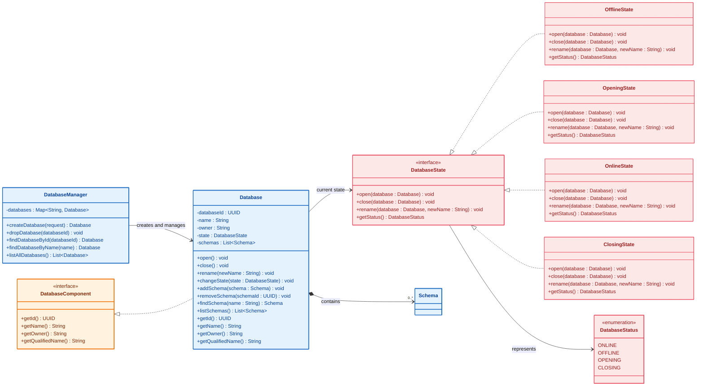
```mermaid
classDiagram
direction LR

class DatabaseManager {
    -databases : Map~String, Database~

    +createDatabase(request) Database
    +dropDatabase(databaseId) void
    +findDatabaseById(databaseId) Database
    +findDatabaseByName(name) Database
    +listAllDatabases() List~Database~
}

class DatabaseComponent {
    <<interface>>

    +getId() UUID
    +getName() String
    +getOwner() String
    +getQualifiedName() String
}

class Database {
    -databaseId : UUID
    -name : String
    -owner : String
    -state : DatabaseState
    -schemas : List~Schema~

    +open() void
    +close() void
    +rename(newName : String) void
    +changeState(state : DatabaseState) void

    +addSchema(schema : Schema) void
    +removeSchema(schemaId : UUID) void
    +findSchema(name : String) Schema
    +listSchemas() List~Schema~

    +getId() UUID
    +getName() String
    +getOwner() String
    +getQualifiedName() String
}

class DatabaseState {
    <<interface>>

    +open(database : Database) void
    +close(database : Database) void
    +rename(database : Database, newName : String) void
    +getStatus() DatabaseStatus
}

class OfflineState {
    +open(database : Database) void
    +close(database : Database) void
    +rename(database : Database, newName : String) void
    +getStatus() DatabaseStatus
}

class OpeningState {
    +open(database : Database) void
    +close(database : Database) void
    +rename(database : Database, newName : String) void
    +getStatus() DatabaseStatus
}

class OnlineState {
    +open(database : Database) void
    +close(database : Database) void
    +rename(database : Database, newName : String) void
    +getStatus() DatabaseStatus
}

class ClosingState {
    +open(database : Database) void
    +close(database : Database) void
    +rename(database : Database, newName : String) void
    +getStatus() DatabaseStatus
}

class DatabaseStatus {
    <<enumeration>>

    ONLINE
    OFFLINE
    OPENING
    CLOSING
}

class Schema

DatabaseManager --> Database : creates and manages
DatabaseComponent <|.. Database

Database --> DatabaseState : current state
DatabaseState <|.. OfflineState
DatabaseState <|.. OpeningState
DatabaseState <|.. OnlineState
DatabaseState <|.. ClosingState

DatabaseState --> DatabaseStatus : represents
Database *--> "0..*" Schema : contains

%% =====================================================
%% Styling
%% =====================================================
style DatabaseComponent fill:#fff3e0,stroke:#ef6c00,stroke-width:2px,color:#7f2704
style DatabaseManager fill:#e3f2fd,stroke:#1565c0,stroke-width:2px,color:#084298
style Database fill:#e3f2fd,stroke:#1565c0,stroke-width:2px,color:#084298
style Schema fill:#e3f2fd,stroke:#1565c0,stroke-width:2px,color:#084298

style DatabaseState fill:#fde8e8,stroke:#e84a5f,stroke-width:2px,color:#9b1c1c
style OfflineState fill:#fde8e8,stroke:#e84a5f,stroke-width:1px,color:#9b1c1c
style OpeningState fill:#fde8e8,stroke:#e84a5f,stroke-width:1px,color:#9b1c1c
style OnlineState fill:#fde8e8,stroke:#e84a5f,stroke-width:1px,color:#9b1c1c
style ClosingState fill:#fde8e8,stroke:#e84a5f,stroke-width:1px,color:#9b1c1c
style DatabaseStatus fill:#fde8e8,stroke:#e84a5f,stroke-width:2px,color:#9b1c1c
```

### 1.2 Sequence Diagram for shouldRejectOpenBaseOnCurrentState()
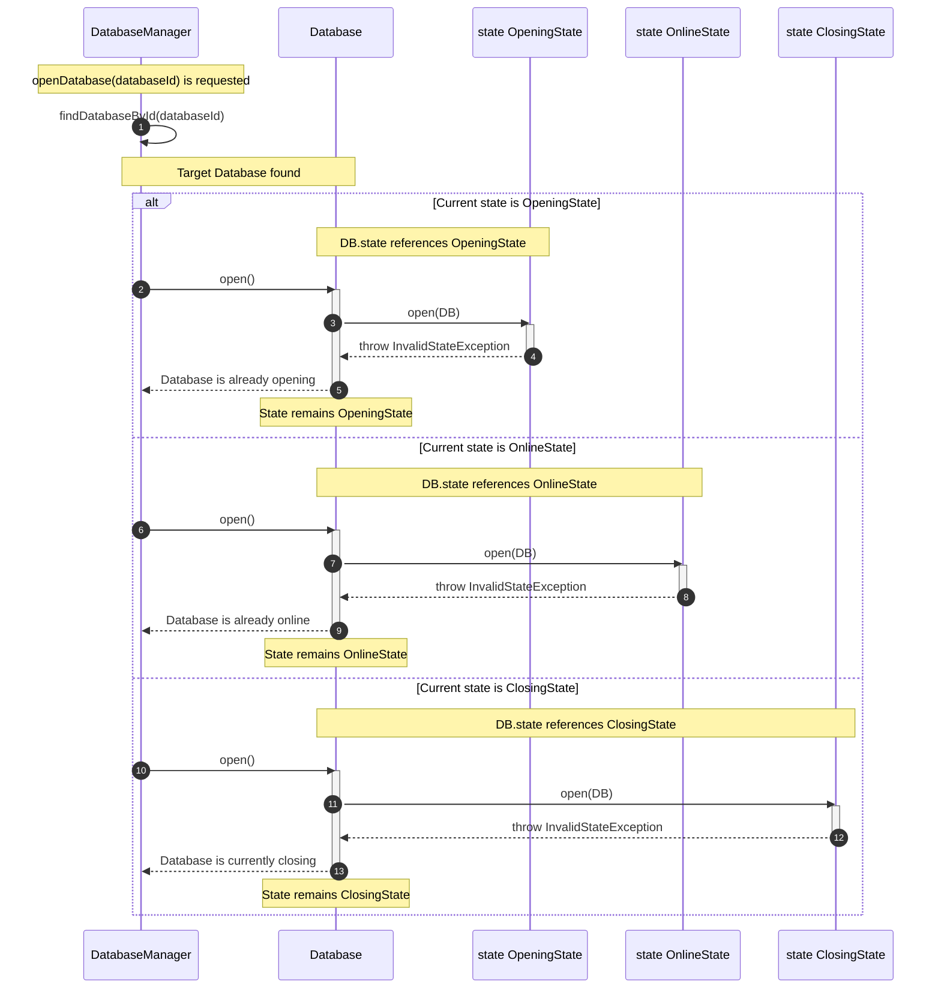
```mermaid
sequenceDiagram
    autonumber

    participant DM as DatabaseManager
    participant DB as Database 
    participant OPENING as state OpeningState
    participant ONLINE as state OnlineState
    participant CLOSING as state ClosingState

    Note over DM: openDatabase(databaseId) is requested

    DM ->> DM: findDatabaseById(databaseId)
    Note over DM,DB: Target Database found

    alt Current state is OpeningState
        Note over DB,OPENING: DB.state references OpeningState

        DM ->> DB: open()
        activate DB

        DB ->> OPENING: open(DB)
        activate OPENING

        OPENING -->> DB: throw InvalidStateException
        deactivate OPENING

        DB -->> DM: Database is already opening
        deactivate DB

        Note over DB: State remains OpeningState

    else Current state is OnlineState
        Note over DB,ONLINE: DB.state references OnlineState

        DM ->> DB: open()
        activate DB

        DB ->> ONLINE: open(DB)
        activate ONLINE

        ONLINE -->> DB: throw InvalidStateException
        deactivate ONLINE

        DB -->> DM: Database is already online
        deactivate DB

        Note over DB: State remains OnlineState

    else Current state is ClosingState
        Note over DB,CLOSING: DB.state references ClosingState

        DM ->> DB: open()
        activate DB

        DB ->> CLOSING: open(DB)
        activate CLOSING

        CLOSING -->> DB: throw InvalidStateException
        deactivate CLOSING

        DB -->> DM: Database is currently closing
        deactivate DB

        Note over DB: State remains ClosingState
    end
```

### 1.3 Code Example

#### State Interface and Enum State
```java
public enum DatabaseStatus {
    OFFLINE, OPENING, ONLINE, CLOSING
}

public interface DatabaseState {

    void open(Database database);
    
    void close(Database database);
    
    void rename(Database database, String newName);
    
    DatabaseStatus getStatus();
}
```

#### Concrete State Classes
```java
public class OfflineState implements DatabaseState {

    @Override
    public void open(Database database) {
        database.validateNewName();
        database.initialize();
        database.changeState(new OpeningState());
    }

    @Override
    public void close(Database database) {
        
    }

    @Override
    public void rename(Database database, String newName) {
        
    }

    @Override
    public DatabaseStatus getStatus() {
        return DatabaseStatus.OFFLINE;
    }
}

public class OpeningState implements DatabaseState {

    @Override
    public void open(Database database) {
        
    }

    @Override
    public void close(Database database) {
        
    }

    @Override
    public void rename(Database database, String newName) {
        
    }

    @Override
    public DatabaseStatus getStatus() {
        return DatabaseStatus.OPENING;
    }
}

public class OnlineState implements DatabaseState {

    @Override
    public void open(Database database) {
        
    }

    @Override
    public void close(Database database) {
        
    }

    @Override
    public void rename(Database database, String newName) {
        
    }

    @Override
    public DatabaseStatus getStatus() {
        return DatabaseStatus.ONLINE;
    }
}

public class ClosingState implements DatabaseState {

    @Override
    public void open(Database database) {
       
    }

    @Override
    public void close(Database database) {
       
    }

    @Override
    public void rename(Database database, String newName) {
        
    }

    @Override
    public DatabaseStatus getStatus() {
        return DatabaseStatus.CLOSING;
    }
}
```

#### Context
```java
public class Database {
    private DatabaseState state;
    private String name;
    private String owner;
    private UUID databaseId;
    private List<Schema> schemas;

    public Database(String name, String owner) {
        this.name = name;
        this.owner = owner;
        this.state = new OfflineState();
        this.schemas = new ArrayList<>();
    }

    public void open() {
        state.open(this);
    }

    public void close() {
        state.close(this);
    }

    public void rename(String newName) {
        state.rename(this, newName);
    }

    public void changeState(DatabaseState state) {
        this.state = state;
    }

    public DatabaseStatus getStatus() {
        return state.getStatus();
    }
}
```

#### Client 
```java
public class DatabaseManager() {
    private Map<UUID, Database> databases = new HashMap<>();
    private StorageEngine storageEngine;
    private CatalogManager catalogManager;

    public DatabaseManager(StorageEngine storageEngine, CatalogManager catalogManager) {
        this.storageEngine = storageEngine;
        this.catalogManager = catalogManager;
    }

    public Database openDatabase(UUID databaseId) {
        return null;
    }   
}
```

---

# 2. Schema Management
## Standard Domain Entity (No Pattern)

---

# 3. Database Object Hierarchy and Lifecycle Management
## Using Composite Pattern

### 3.1 Class Diagram
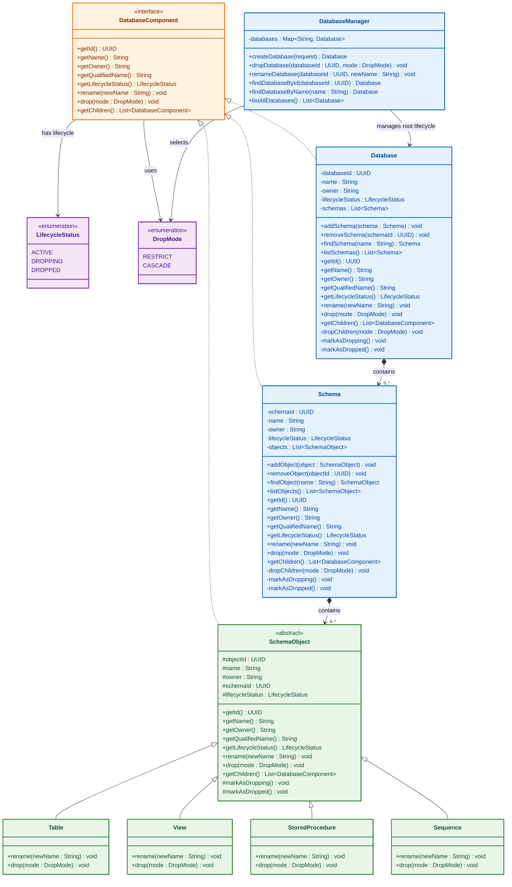
```mermaid
classDiagram
direction TB

%% =====================================================
%% Root Client
%% =====================================================

class DatabaseManager {
    -databases : Map~String, Database~

    +createDatabase(request) Database
    +dropDatabase(databaseId : UUID, mode : DropMode) void
    +renameDatabase(databaseId : UUID, newName : String) void

    +findDatabaseById(databaseId : UUID) Database
    +findDatabaseByName(name : String) Database
    +listAllDatabases() List~Database~
}

%% =====================================================
%% Composite Component
%% =====================================================

class DatabaseComponent {
    <<interface>>

    +getId() UUID
    +getName() String
    +getOwner() String
    +getQualifiedName() String
    +getLifecycleStatus() LifecycleStatus

    +rename(newName : String) void
    +drop(mode : DropMode) void
    +getChildren() List~DatabaseComponent~
}

%% =====================================================
%% Lifecycle Types
%% =====================================================

class LifecycleStatus {
    <<enumeration>>

    ACTIVE
    DROPPING
    DROPPED
}

class DropMode {
    <<enumeration>>

    RESTRICT
    CASCADE
}

%% =====================================================
%% Composite: Database
%% =====================================================

class Database {
    -databaseId : UUID
    -name : String
    -owner : String
    -lifecycleStatus : LifecycleStatus
    -schemas : List~Schema~

    +addSchema(schema : Schema) void
    +removeSchema(schemaId : UUID) void
    +findSchema(name : String) Schema
    +listSchemas() List~Schema~

    +getId() UUID
    +getName() String
    +getOwner() String
    +getQualifiedName() String
    +getLifecycleStatus() LifecycleStatus

    +rename(newName : String) void
    +drop(mode : DropMode) void
    +getChildren() List~DatabaseComponent~

    -dropChildren(mode : DropMode) void
    -markAsDropping() void
    -markAsDropped() void
}

%% =====================================================
%% Composite: Schema
%% =====================================================

class Schema {
    -schemaId : UUID
    -name : String
    -owner : String
    -lifecycleStatus : LifecycleStatus
    -objects : List~SchemaObject~

    +addObject(object : SchemaObject) void
    +removeObject(objectId : UUID) void
    +findObject(name : String) SchemaObject
    +listObjects() List~SchemaObject~

    +getId() UUID
    +getName() String
    +getOwner() String
    +getQualifiedName() String
    +getLifecycleStatus() LifecycleStatus

    +rename(newName : String) void
    +drop(mode : DropMode) void
    +getChildren() List~DatabaseComponent~

    -dropChildren(mode : DropMode) void
    -markAsDropping() void
    -markAsDropped() void
}

%% =====================================================
%% Abstract Leaf
%% =====================================================

class SchemaObject {
    <<abstract>>

    #objectId : UUID
    #name : String
    #owner : String
    #schemaId : UUID
    #lifecycleStatus : LifecycleStatus

    +getId() UUID
    +getName() String
    +getOwner() String
    +getQualifiedName() String
    +getLifecycleStatus() LifecycleStatus

    +rename(newName : String) void
    +drop(mode : DropMode) void
    +getChildren() List~DatabaseComponent~

    #markAsDropping() void
    #markAsDropped() void
}

%% =====================================================
%% Concrete Leaves
%% =====================================================

class Table {
    +rename(newName : String) void
    +drop(mode : DropMode) void
}

class View {
    +rename(newName : String) void
    +drop(mode : DropMode) void
}

class StoredProcedure {
    +rename(newName : String) void
    +drop(mode : DropMode) void
}

class Sequence {
    +rename(newName : String) void
    +drop(mode : DropMode) void
}

%% =====================================================
%% Composite Implementation
%% =====================================================

DatabaseComponent <|.. Database
DatabaseComponent <|.. Schema
DatabaseComponent <|.. SchemaObject

SchemaObject <|-- Table
SchemaObject <|-- View
SchemaObject <|-- StoredProcedure
SchemaObject <|-- Sequence

Database *--> "0..*" Schema : contains
Schema *--> "0..*" SchemaObject : contains

DatabaseManager --> Database : manages root lifecycle

%% =====================================================
%% Lifecycle Relationships
%% =====================================================

DatabaseComponent --> LifecycleStatus : has lifecycle
DatabaseComponent --> DropMode : uses

DatabaseManager --> DropMode : selects

%% =====================================================
%% Styling
%% =====================================================

style DatabaseComponent fill:#fff3e0,stroke:#ef6c00,stroke-width:2px,color:#7f2704

style DatabaseManager fill:#e3f2fd,stroke:#1565c0,stroke-width:2px,color:#084298
style Database fill:#e3f2fd,stroke:#1565c0,stroke-width:2px,color:#084298
style Schema fill:#e3f2fd,stroke:#1565c0,stroke-width:2px,color:#084298

style SchemaObject fill:#e8f5e9,stroke:#2e7d32,stroke-width:2px,color:#0f5132
style Table fill:#e8f5e9,stroke:#2e7d32,stroke-width:2px,color:#0f5132
style View fill:#e8f5e9,stroke:#2e7d32,stroke-width:2px,color:#0f5132
style StoredProcedure fill:#e8f5e9,stroke:#2e7d32,stroke-width:2px,color:#0f5132
style Sequence fill:#e8f5e9,stroke:#2e7d32,stroke-width:2px,color:#0f5132

style LifecycleStatus fill:#f3e5f5,stroke:#7b1fa2,stroke-width:2px,color:#4a148c
style DropMode fill:#f3e5f5,stroke:#7b1fa2,stroke-width:2px,color:#4a148c
```

### 3.2 Sequence Diagram dropDatabaseHierarchyWithCascade()
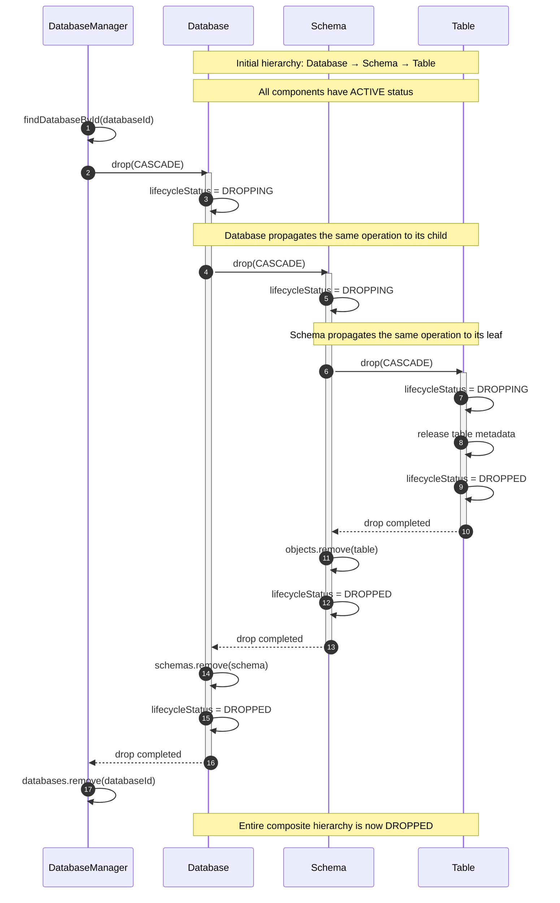
```mermaid
sequenceDiagram
    autonumber

    participant DM as DatabaseManager
    participant DB as Database
    participant S as Schema
    participant T as Table

    Note over DB,T: Initial hierarchy: Database → Schema → Table
    Note over DB,T: All components have ACTIVE status

    DM ->> DM: findDatabaseById(databaseId)
    DM ->> DB: drop(CASCADE)
    activate DB

    DB ->> DB: lifecycleStatus = DROPPING

    Note over DB,T: Database propagates the same operation to its child

    DB ->> S: drop(CASCADE)
    activate S

    S ->> S: lifecycleStatus = DROPPING

    Note over S,T: Schema propagates the same operation to its leaf

    S ->> T: drop(CASCADE)
    activate T

    T ->> T: lifecycleStatus = DROPPING
    T ->> T: release table metadata
    T ->> T: lifecycleStatus = DROPPED

    T -->> S: drop completed
    deactivate T

    S ->> S: objects.remove(table)
    S ->> S: lifecycleStatus = DROPPED

    S -->> DB: drop completed
    deactivate S

    DB ->> DB: schemas.remove(schema)
    DB ->> DB: lifecycleStatus = DROPPED

    DB -->> DM: drop completed
    deactivate DB

    DM ->> DM: databases.remove(databaseId)

    Note over DB,T: Entire composite hierarchy is now DROPPED
```

### 3.3 Code Example
### Component
```java 
public interface DatabaseComponent {
    UUID getId();
    String getName();
    String getOwner();
    String getQualifiedName();
    LifecycleStatus getLifecycleStatus();
    void rename(String newName);
    void drop(DropMode mode);
    List<DatabaseComponent> getChildren();
}
```
### Composite
```java
public class Schema implements DatabaseComponent {
    private UUID schemaId;
    private String name;
    private String owner;
    private LifecycleStatus lifecycleStatus;
    private List<SchemaObject> objects;

    public Schema(UUID schemaId, String name, String owner) {
        this.schemaId = schemaId;
        this.name = name;
        this.owner = owner;
        this.lifecycleStatus = LifecycleStatus.ACTIVE;
        this.objects = new ArrayList<>();
    }
    @Override
    public UUID getId() {
        return schemaId;
    }
    @Override
    public String getName() {
        return name;
    }
    @Override
    public String getOwner() {
        return owner;
    }
    @Override
    public String getQualifiedName() {
        return name;
    }
    @Override
    public LifecycleStatus getLifecycleStatus() {
        return lifecycleStatus;
    }
    public void addObject(SchemaObject object) {
        
    }
    public void removeObject(UUID objectId) {
        
    }
    @Override
    public void rename(String newName) {
        
    }
    @Override
    public void drop(DropMode mode) {
        
    }
    @Override
    public List<DatabaseComponent> getChildren() {
        return null;
    }
    private void dropChildren(DropMode mode) {
        
    }
    private void markAsDropping() {
        
    }
    private void markAsDropped() {
        
    }
}

public class Database implements DatabaseComponent {
    private UUID databaseId;
    private String name;
    private String owner;
    private LifecycleStatus lifecycleStatus;
    private List<Schema> schemas;

    public Database(UUID databaseId, String name, String owner) {
        this.databaseId = databaseId;
        this.name = name;
        this.owner = owner;
        this.lifecycleStatus = LifecycleStatus.ACTIVE;
        this.schemas = new ArrayList<>();
    }
    @Override
    public UUID getId() {
        return databaseId;
    }
    @Override
    public String getName() {
        return name;
    }
    @Override
    public String getOwner() {
        return owner;
    }
    @Override
    public String getQualifiedName() {
        return name;
    }
    @Override
    public LifecycleStatus getLifecycleStatus() {
        return lifecycleStatus;
    }
    public void addSchema(Schema schema) {
        
    }
    public void removeSchema(UUID schemaId) {
        
    }
    @Override
    public void rename(String newName) {
        
    }
    @Override
    public void drop(DropMode mode) {
        
    }
    @Override
    public List<DatabaseComponent> getChildren() {
        return null;
    }
    private void dropChildren(DropMode mode) {
        
    }
    private void markAsDropping() {
        
    }
    private void markAsDropped() {
        
    }
}

```
### Leaf
```java
public abstract class SchemaObject implements DatabaseComponent {
    protected UUID objectId;
    protected String name;
    protected String owner;
    protected UUID schemaId;
    protected LifecycleStatus lifecycleStatus;

    public SchemaObject(UUID objectId, String name, String owner, UUID schemaId) {
        this.objectId = objectId;
        this.name = name;
        this.owner = owner;
        this.schemaId = schemaId;
        this.lifecycleStatus = LifecycleStatus.ACTIVE;
    }
    @Override
    public UUID getId() {
        return objectId;
    }
    @Override
    public String getName() {
        return name;
    }
    @Override
    public String getOwner() {
        return owner;
    }
    @Override
    public LifecycleStatus getLifecycleStatus() {
        return lifecycleStatus;
    }
    @Override
    public void rename(String newName) {
        
    }
    @Override
    public void drop(DropMode mode) {
        
    }
    @Override
    public List<DatabaseComponent> getChildren() {
        return null;
    }
    protected void markAsDropping() {
        
    }
    protected void markAsDropped() {
        
    }
}

public class Table extends SchemaObject {
    private String engine;
    public Table(UUID objectId, String name, String owner, UUID schemaId, String engine) {
        super(objectId, name, owner, schemaId);
        this.engine = engine;
    }
    @Override
    public String getQualifiedName() {
        return name;
    }
    @Override
    protected void releaseMetadata() {
        
    }
}
public class View extends SchemaObject {
    private String queryDefinition;
    public View(UUID objectId, String name, String owner, UUID schemaId, String queryDefinition) {
        super(objectId, name, owner, schemaId);
        this.queryDefinition = queryDefinition;
    }
    @Override
    public String getQualifiedName() {
        return name;
    }
    @Override
    protected void releaseMetadata() {
        
    }
}
public class StoredProcedure extends SchemaObject {
    public StoredProcedure(UUID objectId, String name, String owner, UUID schemaId) {
        super(objectId, name, owner, schemaId);
    }
    @Override
    public String getQualifiedName() {
        return name;
    }
    @Override
    protected void releaseMetadata() {
        
    }
}
public class Sequence extends SchemaObject {
    public Sequence(UUID objectId, String name, String owner, UUID schemaId) {
        super(objectId, name, owner, schemaId);
    }
    @Override
    public String getQualifiedName() {
        return name;
    }
    @Override
    protected void releaseMetadata() {
       
    }
}
```

--- 

# 4. Table Definition and Lifecycle Management
## Using Builder Pattern

### 4.1 Class Diagram
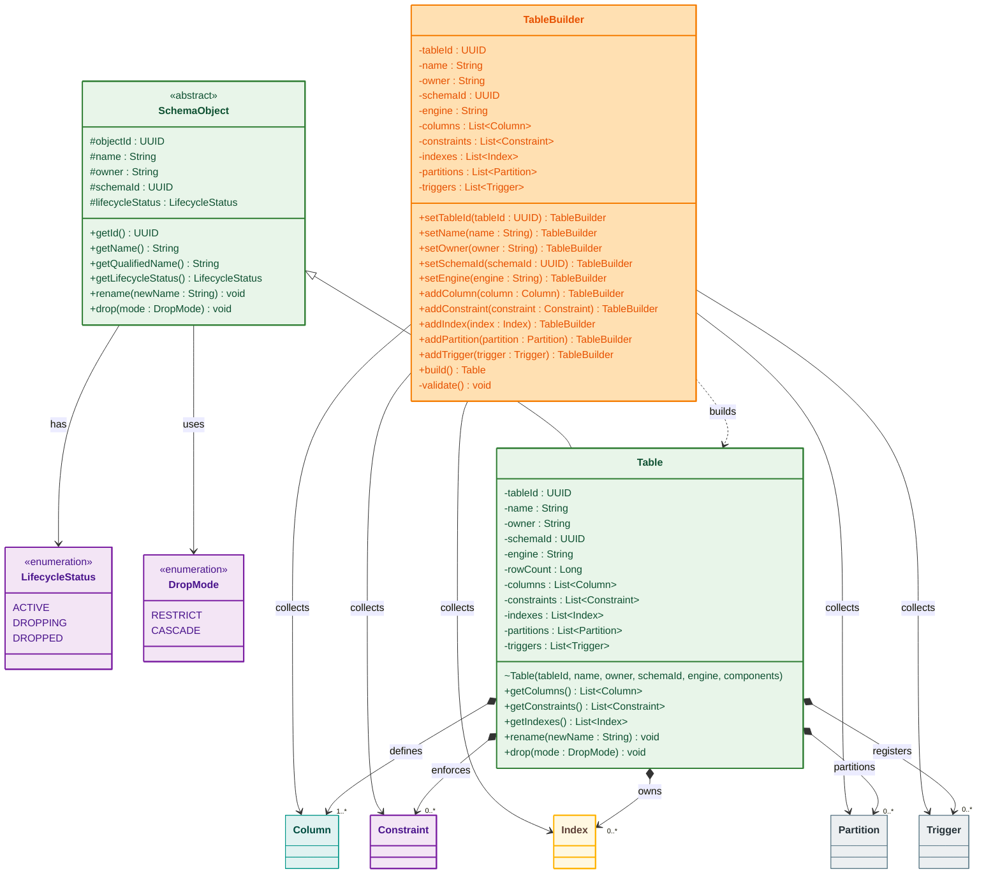
```mermaid
classDiagram
direction TB

%% =====================================================
%% Schema Object Lifecycle
%% =====================================================

class SchemaObject {
    <<abstract>>

    #objectId : UUID
    #name : String
    #owner : String
    #schemaId : UUID
    #lifecycleStatus : LifecycleStatus

    +getId() UUID
    +getName() String
    +getQualifiedName() String
    +getLifecycleStatus() LifecycleStatus

    +rename(newName : String) void
    +drop(mode : DropMode) void
}

class LifecycleStatus {
    <<enumeration>>

    ACTIVE
    DROPPING
    DROPPED
}

class DropMode {
    <<enumeration>>

    RESTRICT
    CASCADE
}

%% =====================================================
%% Product
%% =====================================================

class Table {
    -tableId : UUID
    -name : String
    -owner : String
    -schemaId : UUID
    -engine : String
    -rowCount : Long

    -columns : List~Column~
    -constraints : List~Constraint~
    -indexes : List~Index~
    -partitions : List~Partition~
    -triggers : List~Trigger~

    ~Table(tableId, name, owner, schemaId, engine, components)

    +getColumns() List~Column~
    +getConstraints() List~Constraint~
    +getIndexes() List~Index~

    +rename(newName : String) void
    +drop(mode : DropMode) void
}

%% =====================================================
%% Simplified Builder
%% =====================================================

class TableBuilder {
    -tableId : UUID
    -name : String
    -owner : String
    -schemaId : UUID
    -engine : String

    -columns : List~Column~
    -constraints : List~Constraint~
    -indexes : List~Index~
    -partitions : List~Partition~
    -triggers : List~Trigger~

    +setTableId(tableId : UUID) TableBuilder
    +setName(name : String) TableBuilder
    +setOwner(owner : String) TableBuilder
    +setSchemaId(schemaId : UUID) TableBuilder
    +setEngine(engine : String) TableBuilder

    +addColumn(column : Column) TableBuilder
    +addConstraint(constraint : Constraint) TableBuilder
    +addIndex(index : Index) TableBuilder
    +addPartition(partition : Partition) TableBuilder
    +addTrigger(trigger : Trigger) TableBuilder

    +build() Table
    -validate() void
}

%% =====================================================
%% Table Components
%% =====================================================

class Column
class Constraint
class Index
class Partition
class Trigger

%% =====================================================
%% Inheritance and Lifecycle
%% =====================================================

SchemaObject <|-- Table

SchemaObject --> LifecycleStatus : has
SchemaObject --> DropMode : uses

%% =====================================================
%% Builder Relationships
%% =====================================================

TableBuilder ..> Table : builds

TableBuilder --> Column : collects
TableBuilder --> Constraint : collects
TableBuilder --> Index : collects
TableBuilder --> Partition : collects
TableBuilder --> Trigger : collects

%% =====================================================
%% Product Composition
%% =====================================================

Table *--> "1..*" Column : defines
Table *--> "0..*" Constraint : enforces
Table *--> "0..*" Index : owns
Table *--> "0..*" Partition : partitions
Table *--> "0..*" Trigger : registers

%% =====================================================
%% Styling
%% =====================================================
style SchemaObject fill:#e8f5e9,stroke:#2e7d32,stroke-width:2px,color:#0f5132
style Table fill:#e8f5e9,stroke:#2e7d32,stroke-width:2px,color:#0f5132

style Column fill:#e0f2f1,stroke:#009688,stroke-width:1px,color:#004d40
style Constraint fill:#f3e5f5,stroke:#7b1fa2,stroke-width:2px,color:#4a148c
style Index fill:#fff8e1,stroke:#ffb300,stroke-width:2px,color:#5d4037
style Partition fill:#eceff1,stroke:#607d8b,stroke-width:1px,color:#263238
style Trigger fill:#eceff1,stroke:#607d8b,stroke-width:1px,color:#263238

style TableBuilder fill:#ffe0b2,stroke:#f57c00,stroke-width:2px,color:#e65100

style LifecycleStatus fill:#f3e5f5,stroke:#7b1fa2,stroke-width:2px,color:#4a148c
style DropMode fill:#f3e5f5,stroke:#7b1fa2,stroke-width:2px,color:#4a148c
```

### 4.2 Sequence Diagram shouldBuildValidTableWithColumnsAndConstraints()
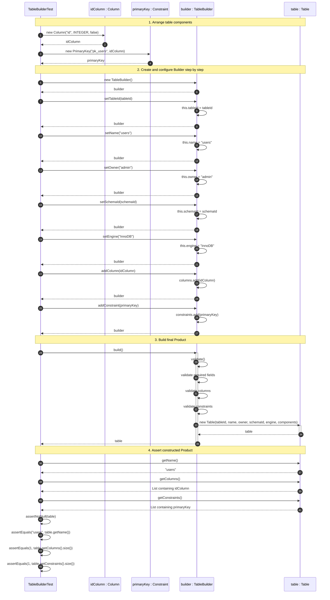
```mermaid
sequenceDiagram
    autonumber

    participant Test as TableBuilderTest
    participant C as idColumn : Column
    participant PK as primaryKey : Constraint
    participant B as builder : TableBuilder
    participant T as table : Table

    Note over Test,T: 1. Arrange table components

    Test ->> C: new Column("id", INTEGER, false)
    C -->> Test: idColumn

    Test ->> PK: new PrimaryKey("pk_users", idColumn)
    PK -->> Test: primaryKey

    Note over Test,T: 2. Create and configure Builder step by step

    Test ->> B: new TableBuilder()
    B -->> Test: builder

    Test ->> B: setTableId(tableId)
    B ->> B: this.tableId = tableId
    B -->> Test: builder

    Test ->> B: setName("users")
    B ->> B: this.name = "users"
    B -->> Test: builder

    Test ->> B: setOwner("admin")
    B ->> B: this.owner = "admin"
    B -->> Test: builder

    Test ->> B: setSchemaId(schemaId)
    B ->> B: this.schemaId = schemaId
    B -->> Test: builder

    Test ->> B: setEngine("InnoDB")
    B ->> B: this.engine = "InnoDB"
    B -->> Test: builder

    Test ->> B: addColumn(idColumn)
    B ->> B: columns.add(idColumn)
    B -->> Test: builder

    Test ->> B: addConstraint(primaryKey)
    B ->> B: constraints.add(primaryKey)
    B -->> Test: builder

    Note over Test,T: 3. Build final Product

    Test ->> B: build()
    activate B

    B ->> B: validate()
    B ->> B: validate required fields
    B ->> B: validate columns
    B ->> B: validate constraints

    B ->> T: new Table(tableId, name, owner, schemaId, engine, components)
    activate T
    T -->> B: table
    deactivate T

    B -->> Test: table
    deactivate B

    Note over Test,T: 4. Assert constructed Product

    Test ->> T: getName()
    T -->> Test: "users"

    Test ->> T: getColumns()
    T -->> Test: List containing idColumn

    Test ->> T: getConstraints()
    T -->> Test: List containing primaryKey

    Test ->> Test: assertNotNull(table)
    Test ->> Test: assertEquals("users", table.getName())
    Test ->> Test: assertEquals(1, table.getColumns().size())
    Test ->> Test: assertEquals(1, table.getConstraints().size())
```

### 4.3 Code Example
```java
// TODO: Implement code example
```

--- 

# 5. Column Definition and Data Type Management
## Standard Domain Entity (No Pattern)

---

# 6. Constraint Definition and Data Integrity Validation
## Using Strategy Pattern

### 6.1 Class Diagram
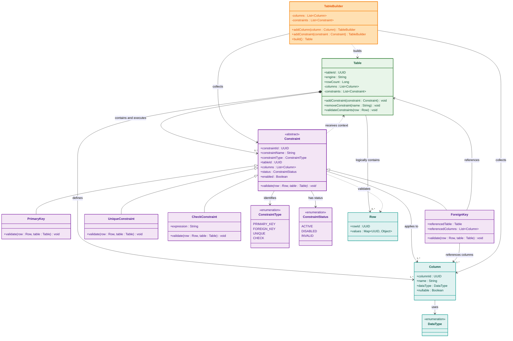
```mermaid
classDiagram
direction TB

%% =====================================================
%% Context
%% =====================================================

class Table {
    +tableId : UUID
    +engine : String
    +rowCount : Long

    -columns : List~Column~
    -constraints : List~Constraint~

    +addConstraint(constraint : Constraint) void
    +removeConstraint(name : String) void
    +validateConstraints(row : Row) void
}

%% =====================================================
%% Strategy
%% =====================================================

class Constraint {
    <<abstract>>

    +constraintId : UUID
    +constraintName : String
    +constraintType : ConstraintType
    +tableId : UUID
    +columns : List~Column~
    +status : ConstraintStatus
    +enabled : Boolean

    +validate(row : Row, table : Table)* void
}

%% =====================================================
%% Concrete Strategies
%% =====================================================

class PrimaryKey {
    +validate(row : Row, table : Table) void
}

class ForeignKey {
    +referencedTable : Table
    +referencedColumns : List~Column~

    +validate(row : Row, table : Table) void
}

class UniqueConstraint {
    +validate(row : Row, table : Table) void
}

class CheckConstraint {
    +expression : String

    +validate(row : Row, table : Table) void
}

%% =====================================================
%% Supporting Types
%% =====================================================

class ConstraintType {
    <<enumeration>>

    PRIMARY_KEY
    FOREIGN_KEY
    UNIQUE
    CHECK
}

class ConstraintStatus {
    <<enumeration>>

    ACTIVE
    DISABLED
    INVALID
}

class Column {
    +columnId : UUID
    +name : String
    +dataType : DataType
    +nullable : Boolean
}

class Row {
    +rowId : UUID
    +values : Map~UUID, Object~
}

class DataType {
    <<enumeration>>
}

%% =====================================================
%% Table Builder
%% =====================================================

class TableBuilder {
    -columns : List~Column~
    -constraints : List~Constraint~

    +addColumn(column : Column) TableBuilder
    +addConstraint(constraint : Constraint) TableBuilder
    +build() Table
}

%% =====================================================
%% Strategy Relationships
%% =====================================================

Table *--> "0..*" Constraint : contains and executes

Constraint <|-- PrimaryKey
Constraint <|-- ForeignKey
Constraint <|-- UniqueConstraint
Constraint <|-- CheckConstraint

%% =====================================================
%% Table Structure and Data
%% =====================================================

Table *--> "1..*" Column : defines
Table --> "0..*" Row : logically contains

Column --> DataType : uses

%% =====================================================
%% Constraint Dependencies
%% =====================================================

Constraint --> ConstraintType : identifies
Constraint --> ConstraintStatus : has status
Constraint --> "1..*" Column : applies to
Constraint ..> Row : validates
Constraint ..> Table : receives context

ForeignKey --> Table : references
ForeignKey --> "1..*" Column : references columns

%% =====================================================
%% Builder Relationships
%% =====================================================

TableBuilder --> Column : collects
TableBuilder --> Constraint : collects
TableBuilder ..> Table : builds

%% =====================================================
%% Styling
%% =====================================================
style Table fill:#e8f5e9,stroke:#2e7d32,stroke-width:2px,color:#0f5132

style Constraint fill:#f3e5f5,stroke:#7b1fa2,stroke-width:2px,color:#4a148c
style PrimaryKey fill:#f3e5f5,stroke:#7b1fa2,stroke-width:1px,color:#4a148c
style ForeignKey fill:#f3e5f5,stroke:#7b1fa2,stroke-width:1px,color:#4a148c
style UniqueConstraint fill:#f3e5f5,stroke:#7b1fa2,stroke-width:1px,color:#4a148c
style CheckConstraint fill:#f3e5f5,stroke:#7b1fa2,stroke-width:1px,color:#4a148c
style ConstraintType fill:#f3e5f5,stroke:#7b1fa2,stroke-width:1px,color:#4a148c
style ConstraintStatus fill:#f3e5f5,stroke:#7b1fa2,stroke-width:1px,color:#4a148c

style Column fill:#e0f2f1,stroke:#009688,stroke-width:1px,color:#004d40
style Row fill:#e0f2f1,stroke:#009688,stroke-width:1px,color:#004d40
style DataType fill:#e0f2f1,stroke:#009688,stroke-width:1px,color:#004d40

style TableBuilder fill:#ffe0b2,stroke:#f57c00,stroke-width:2px,color:#e65100
```

### 6.2 Sequence Diagram shouldValidateRowUsingMultipleConstraint()
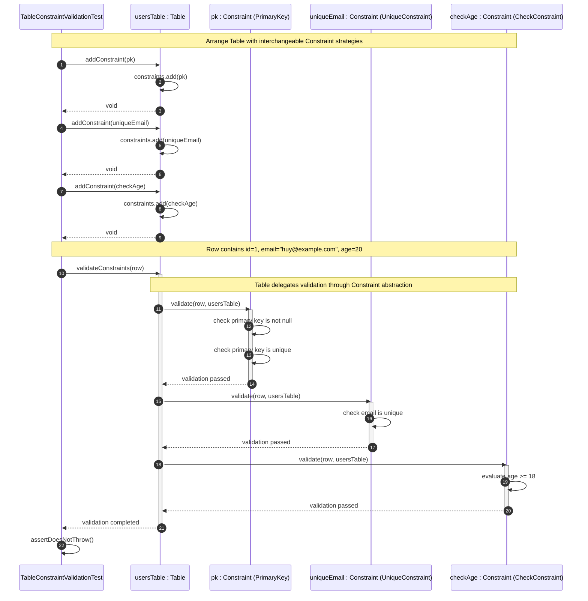
```mermaid
sequenceDiagram
    autonumber

    participant Test as TableConstraintValidationTest
    participant T as usersTable : Table
    participant PK as pk : Constraint (PrimaryKey)
    participant UQ as uniqueEmail : Constraint (UniqueConstraint)
    participant CK as checkAge : Constraint (CheckConstraint)

    Note over Test,CK: Arrange Table with interchangeable Constraint strategies

    Test ->> T: addConstraint(pk)
    T ->> T: constraints.add(pk)
    T -->> Test: void

    Test ->> T: addConstraint(uniqueEmail)
    T ->> T: constraints.add(uniqueEmail)
    T -->> Test: void

    Test ->> T: addConstraint(checkAge)
    T ->> T: constraints.add(checkAge)
    T -->> Test: void

    Note over Test,CK: Row contains id=1, email="huy@example.com", age=20

    Test ->> T: validateConstraints(row)
    activate T

    Note over T,CK: Table delegates validation through Constraint abstraction

    T ->> PK: validate(row, usersTable)
    activate PK
    PK ->> PK: check primary key is not null
    PK ->> PK: check primary key is unique
    PK -->> T: validation passed
    deactivate PK

    T ->> UQ: validate(row, usersTable)
    activate UQ
    UQ ->> UQ: check email is unique
    UQ -->> T: validation passed
    deactivate UQ

    T ->> CK: validate(row, usersTable)
    activate CK
    CK ->> CK: evaluate age >= 18
    CK -->> T: validation passed
    deactivate CK

    T -->> Test: validation completed
    deactivate T

    Test ->> Test: assertDoesNotThrow()
```

### 6.3 Code Example
### Strategy
```java
public abstract class Constraint {
    protected UUID constraintId;
    protected String constraintName;
    protected ConstraintType constraintType;
    protected UUID tableId;
    protected List<Column> columns;
    protected ConstraintStatus status;
    protected boolean enabled;

    public Constraint(UUID constraintId, String constraintName, ConstraintType constraintType, 
                      UUID tableId, List<Column> columns) {
        this.constraintId = constraintId;
        this.constraintName = constraintName;
        this.constraintType = constraintType;
        this.tableId = tableId;
        this.columns = new ArrayList<>(columns);
        this.status = ConstraintStatus.ACTIVE;
        this.enabled = true;
    }

    public String getConstraintName() { return constraintName; }
    public boolean isEnabled() { return enabled; }
    public void setEnabled(boolean enabled) { this.enabled = enabled; }
    public abstract void validate(Row row, Table table);
}
```
### Concrete Strategy 
```java
public class PrimaryKey extends Constraint {
    public PrimaryKey(UUID constraintId, String constraintName, UUID tableId, Column column) {
        super(constraintId, constraintName, ConstraintType.PRIMARY_KEY, tableId, Collections.singletonList(column));
    }
    @Override
    public void validate(Row row, Table table) {
       
    }
}

public class UniqueConstraint extends Constraint {
    public UniqueConstraint(UUID constraintId, String constraintName, UUID tableId, Column column) {
        super(constraintId, constraintName, ConstraintType.UNIQUE, tableId, Collections.singletonList(column));
    }
    @Override
    public void validate(Row row, Table table) {
        
    }
}

public class CheckConstraint extends Constraint {
    private String expression;
    public CheckConstraint(UUID constraintId, String constraintName, UUID tableId, Column column, String expression) {
        super(constraintId, constraintName, ConstraintType.CHECK, tableId, Collections.singletonList(column));
        this.expression = expression;
    }
    @Override
    public void validate(Row row, Table table) {
        
    }
}

public class ForeignKey extends Constraint {
    private Table referencedTable;
    private Column referencedColumn;
    public ForeignKey(UUID constraintId, String constraintName, UUID tableId, Column column,
                      Table referencedTable, Column referencedColumn) {
        super(constraintId, constraintName, ConstraintType.FOREIGN_KEY, tableId, Collections.singletonList(column));
        this.referencedTable = referencedTable;
        this.referencedColumn = referencedColumn;
    }
    @Override
    public void validate(Row row, Table table) {
        
    }
}
```

### Context 
```java
public class Table {
    private UUID tableId;
    private String name;
    private List<Column> columns = new ArrayList<>();
    private List<Constraint> constraints = new ArrayList<>();
    private List<Row> rows = new ArrayList<>();

    public Table(UUID tableId, String name) {
        this.tableId = tableId;
        this.name = name;
    }

    public String getName() { return name; }
    public List<Row> getRows() { return rows; }
    public void addColumn(Column column) {
        this.columns.add(column);
    }
    public void addConstraint(Constraint constraint) {
        this.constraints.add(constraint);
    }
    public void insertRow(Row row) {
        
    }
    public void validateConstraints(Row row) {
        
    }
} 
```
---

# 7. Table Data and Row Operations
## Using Template Method & Command Pattern

### 7.1 Class Diagram
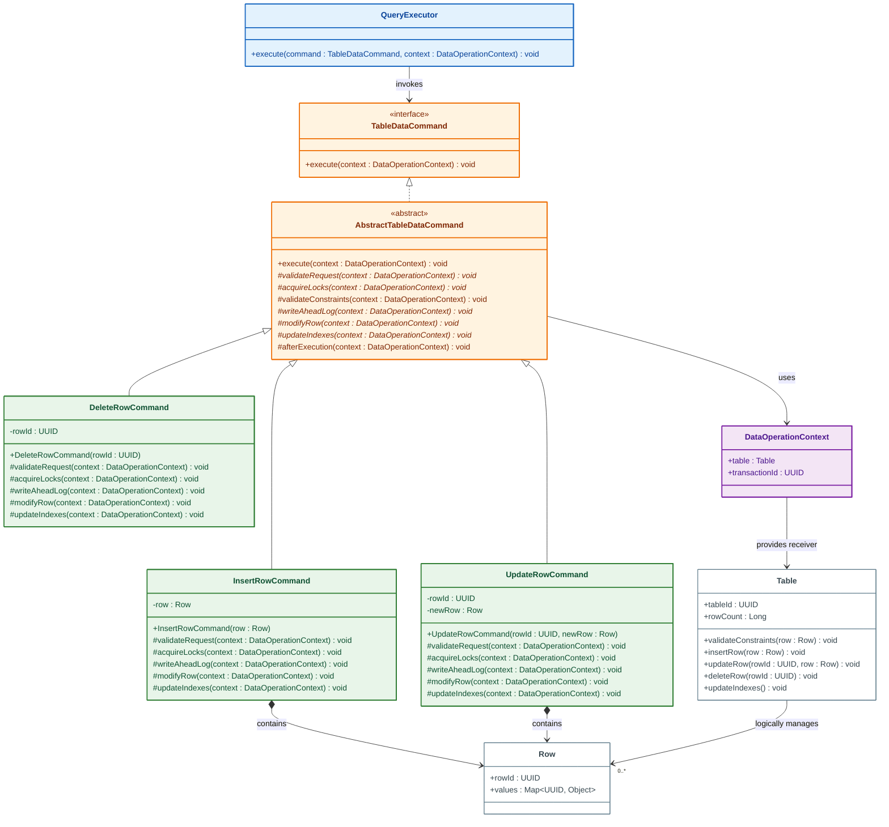
```mermaid
classDiagram
direction TB

%% =====================================================
%% Command Invoker
%% =====================================================

class QueryExecutor {
    +execute(command : TableDataCommand, context : DataOperationContext) void
}

%% =====================================================
%% Command Pattern
%% =====================================================

class TableDataCommand {
    <<interface>>

    +execute(context : DataOperationContext) void
}

%% =====================================================
%% Template Method
%% =====================================================

class AbstractTableDataCommand {
    <<abstract>>

    +execute(context : DataOperationContext) void

    #validateRequest(context : DataOperationContext)* void
    #acquireLocks(context : DataOperationContext)* void
    #validateConstraints(context : DataOperationContext) void
    #writeAheadLog(context : DataOperationContext)* void
    #modifyRow(context : DataOperationContext)* void
    #updateIndexes(context : DataOperationContext)* void
    #afterExecution(context : DataOperationContext) void
}

%% =====================================================
%% Concrete Commands
%% =====================================================

class InsertRowCommand {
    -row : Row

    +InsertRowCommand(row : Row)
    #validateRequest(context : DataOperationContext) void
    #acquireLocks(context : DataOperationContext) void
    #writeAheadLog(context : DataOperationContext) void
    #modifyRow(context : DataOperationContext) void
    #updateIndexes(context : DataOperationContext) void
}

class UpdateRowCommand {
    -rowId : UUID
    -newRow : Row

    +UpdateRowCommand(rowId : UUID, newRow : Row)
    #validateRequest(context : DataOperationContext) void
    #acquireLocks(context : DataOperationContext) void
    #writeAheadLog(context : DataOperationContext) void
    #modifyRow(context : DataOperationContext) void
    #updateIndexes(context : DataOperationContext) void
}

class DeleteRowCommand {
    -rowId : UUID

    +DeleteRowCommand(rowId : UUID)
    #validateRequest(context : DataOperationContext) void
    #acquireLocks(context : DataOperationContext) void
    #writeAheadLog(context : DataOperationContext) void
    #modifyRow(context : DataOperationContext) void
    #updateIndexes(context : DataOperationContext) void
}

%% =====================================================
%% Execution Context
%% =====================================================

class DataOperationContext {
    +table : Table
    +transactionId : UUID
}

%% =====================================================
%% Receiver and Data
%% =====================================================

class Table {
    +tableId : UUID
    +rowCount : Long

    +validateConstraints(row : Row) void
    +insertRow(row : Row) void
    +updateRow(rowId : UUID, row : Row) void
    +deleteRow(rowId : UUID) void
    +updateIndexes() void
}

class Row {
    +rowId : UUID
    +values : Map~UUID, Object~
}

%% =====================================================
%% Command Relationships
%% =====================================================

TableDataCommand <|.. AbstractTableDataCommand

AbstractTableDataCommand <|-- InsertRowCommand
AbstractTableDataCommand <|-- UpdateRowCommand
AbstractTableDataCommand <|-- DeleteRowCommand

QueryExecutor --> TableDataCommand : invokes
AbstractTableDataCommand --> DataOperationContext : uses

%% =====================================================
%% Receiver Relationships
%% =====================================================

DataOperationContext --> Table : provides receiver

InsertRowCommand *--> Row : contains
UpdateRowCommand *--> Row : contains

Table --> "0..*" Row : logically manages

%% =====================================================
%% Styling
%% =====================================================

style QueryExecutor fill:#e3f2fd,stroke:#1565c0,stroke-width:2px,color:#084298

style TableDataCommand fill:#fff3e0,stroke:#ef6c00,stroke-width:2px,color:#7f2704
style AbstractTableDataCommand fill:#fff3e0,stroke:#ef6c00,stroke-width:2px,color:#7f2704

style InsertRowCommand fill:#e8f5e9,stroke:#2e7d32,stroke-width:2px,color:#0f5132
style UpdateRowCommand fill:#e8f5e9,stroke:#2e7d32,stroke-width:2px,color:#0f5132
style DeleteRowCommand fill:#e8f5e9,stroke:#2e7d32,stroke-width:2px,color:#0f5132

style DataOperationContext fill:#f3e5f5,stroke:#7b1fa2,stroke-width:2px,color:#4a148c

style Table fill:#ffffff,stroke:#607d8b,stroke-width:1px,color:#37474f
style Row fill:#ffffff,stroke:#607d8b,stroke-width:1px,color:#37474f
```

### 7.2 Sequence Diagram shouldExecuteInsertRowCommand()
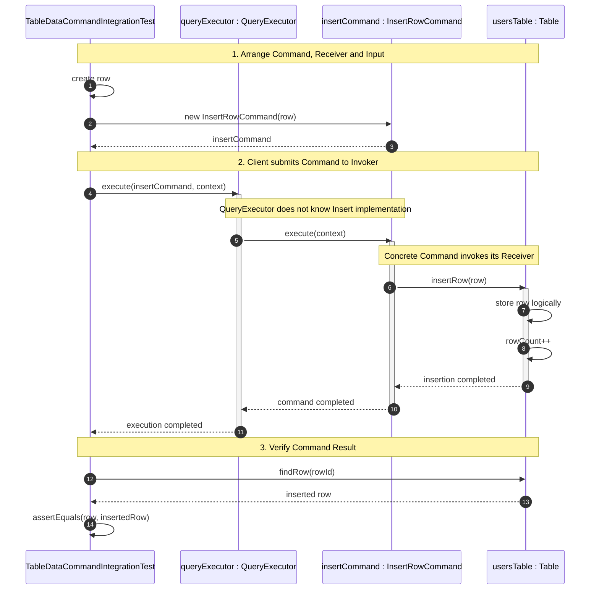
```mermaid
sequenceDiagram
    autonumber

    participant Test as TableDataCommandIntegrationTest
    participant QE as queryExecutor : QueryExecutor
    participant CMD as insertCommand : InsertRowCommand
    participant T as usersTable : Table

    Note over Test,T: 1. Arrange Command, Receiver and Input

    Test ->> Test: create row
    Test ->> CMD: new InsertRowCommand(row)
    CMD -->> Test: insertCommand

    Note over Test,T: 2. Client submits Command to Invoker

    Test ->> QE: execute(insertCommand, context)
    activate QE

    Note over QE,CMD: QueryExecutor does not know Insert implementation

    QE ->> CMD: execute(context)
    activate CMD

    Note over CMD,T: Concrete Command invokes its Receiver

    CMD ->> T: insertRow(row)
    activate T

    T ->> T: store row logically
    T ->> T: rowCount++

    T -->> CMD: insertion completed
    deactivate T

    CMD -->> QE: command completed
    deactivate CMD

    QE -->> Test: execution completed
    deactivate QE

    Note over Test,T: 3. Verify Command Result

    Test ->> T: findRow(rowId)
    T -->> Test: inserted row

    Test ->> Test: assertEquals(row, insertedRow)
```

### 7.2 Sequence Diagram shouldExecuteInsertUsingTemplateWorkflow()
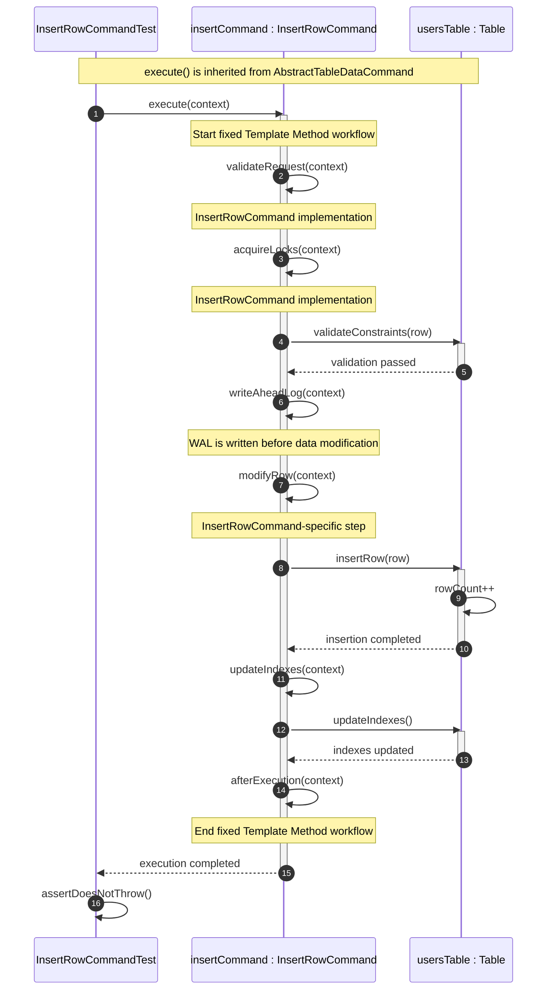
```mermaid
sequenceDiagram
    autonumber

    participant Test as InsertRowCommandTest
    participant CMD as insertCommand : InsertRowCommand
    participant T as usersTable : Table

    Note over Test,T: execute() is inherited from AbstractTableDataCommand

    Test ->> CMD: execute(context)
    activate CMD

    Note over CMD: Start fixed Template Method workflow

    CMD ->> CMD: validateRequest(context)
    Note over CMD: InsertRowCommand implementation

    CMD ->> CMD: acquireLocks(context)
    Note over CMD: InsertRowCommand implementation

    CMD ->> T: validateConstraints(row)
    activate T
    T -->> CMD: validation passed
    deactivate T

    CMD ->> CMD: writeAheadLog(context)
    Note over CMD: WAL is written before data modification

    CMD ->> CMD: modifyRow(context)
    Note over CMD: InsertRowCommand-specific step

    CMD ->> T: insertRow(row)
    activate T
    T ->> T: rowCount++
    T -->> CMD: insertion completed
    deactivate T

    CMD ->> CMD: updateIndexes(context)

    CMD ->> T: updateIndexes()
    activate T
    T -->> CMD: indexes updated
    deactivate T

    CMD ->> CMD: afterExecution(context)

    Note over CMD: End fixed Template Method workflow

    CMD -->> Test: execution completed
    deactivate CMD

    Test ->> Test: assertDoesNotThrow()
```

### 7.3 Code Example for Template Method
### AbstractCommand 
```java
public interface TableDataCommand {
    void execute(DataOperationContext context);
}

public abstract class AbstractTableDataCommand implements TableDataCommand {
    @Override
    public final void execute(DataOperationContext context) {

    }
    protected abstract void validateRequest(DataOperationContext context);
    protected abstract void acquireLocks(DataOperationContext context);
    protected abstract void writeAheadLog(DataOperationContext context);
    protected abstract void modifyRow(DataOperationContext context);
    protected abstract void updateIndexes(DataOperationContext context);
    protected void validateConstraints(DataOperationContext context) {
        
    }
    protected void afterExecution(DataOperationContext context) {
    }
    protected abstract Row getRow();
}

```
### Concrete class 
```java
public class InsertRowCommand extends AbstractTableDataCommand {
    private Row row;
    public InsertRowCommand(Row row) {
        this.row = row;
    }
    @Override
    protected Row getRow() {
        return row;
    }
    @Override
    protected void validateRequest(DataOperationContext context) {
        
    }
    @Override
    protected void acquireLocks(DataOperationContext context) {
    }
    @Override
    protected void writeAheadLog(DataOperationContext context) {
    }
    @Override
    protected void modifyRow(DataOperationContext context) {
        
    }
    @Override
    protected void updateIndexes(DataOperationContext context) {
        
    }
    @Override
    protected void afterExecution(DataOperationContext context) {
    }
} 
```

### 7.3 Code Example for Command Pattern 
### Receiver
```java
public class Table {
    private UUID tableId;
    private long rowCount;
    private Map<UUID, Row> storage = new HashMap<>();

    public Table(UUID tableId) {
        this.tableId = tableId;
        this.rowCount = 0L;
    }
    
    public void insertRow(Row row) {
        
    }
    public Row findRow(UUID rowId) {
        return null;
    }
    public long getRowCount() { return rowCount; }
}
```

### Command 
```java
public interface TableDataCommand {
    void execute(DataOperationContext context);
}
```

### Concrete Command
```java
public class InsertRowCommand implements TableDataCommand {
    private Row row;

    public InsertRowCommand(Row row) {
        this.row = row;
    }
    @Override
    public void execute(DataOperationContext context) {
        
    }
}
```

### Invoker
```java
public class QueryExecutor {
    public void execute(TableDataCommand command, DataOperationContext context) {
        
    }
}
```
---

# 8. Object Naming, Lookup, and Uniqueness Management
## Standard Domain Entity (No Pattern)

--- 

# 9. Index Definition and Management
## Using Strategy and Factory Method

### 9.1 Class diagram

```mermaid
classDiagram
direction TB

%% =====================================================
%% Context and Factory Client
%% =====================================================

class IndexManager {
    -indexes : Map~UUID, Index~
    -creators : Map~IndexType, IndexCreator~

    +createIndex(request : CreateIndexRequest, table : Table) Index
    +dropIndex(indexId : UUID, table : Table) void
    +findIndex(indexId : UUID) Index
    +listIndexes(tableId : UUID) List~Index~

    +search(indexId : UUID, key : IndexKey) List~RowId~
    +insertEntry(indexId : UUID, key : IndexKey, rowId : RowId) void
    +deleteEntry(indexId : UUID, key : IndexKey, rowId : RowId) void
    +rebuildIndex(indexId : UUID) void
}

%% =====================================================
%% Strategy and Product
%% =====================================================

class Index {
    <<abstract>>

    #indexId : UUID
    #name : String
    #tableId : UUID
    #columns : List~Column~
    #unique : Boolean

    +getId() UUID
    +getName() String
    +getColumns() List~Column~

    +search(key : IndexKey)* List~RowId~
    +insertKey(key : IndexKey, rowId : RowId)* void
    +deleteKey(key : IndexKey, rowId : RowId)* void
    +rebuild()* void
}

%% =====================================================
%% Concrete Strategies and Products
%% =====================================================

class BTreeIndex {
    +search(key : IndexKey) List~RowId~
    +insertKey(key : IndexKey, rowId : RowId) void
    +deleteKey(key : IndexKey, rowId : RowId) void
    +rebuild() void
}

class HashIndex {
    +search(key : IndexKey) List~RowId~
    +insertKey(key : IndexKey, rowId : RowId) void
    +deleteKey(key : IndexKey, rowId : RowId) void
    +rebuild() void
}

class BitmapIndex {
    +search(key : IndexKey) List~RowId~
    +insertKey(key : IndexKey, rowId : RowId) void
    +deleteKey(key : IndexKey, rowId : RowId) void
    +rebuild() void
}

%% =====================================================
%% Factory Method Creator
%% =====================================================

class IndexCreator {
    <<abstract>>

    +create(request : CreateIndexRequest) Index
    #createIndex(request : CreateIndexRequest)* Index
    #validate(request : CreateIndexRequest) void
    #initialize(index : Index) void
}

%% =====================================================
%% Concrete Creators
%% =====================================================

class BTreeIndexCreator {
    #createIndex(request : CreateIndexRequest) Index
}

class HashIndexCreator {
    #createIndex(request : CreateIndexRequest) Index
}

class BitmapIndexCreator {
    #createIndex(request : CreateIndexRequest) Index
}

%% =====================================================
%% Table and Table Builder
%% =====================================================

class Table {
    -tableId : UUID
    -name : String
    -columns : List~Column~
    -indexes : List~Index~

    +addIndex(index : Index) void
    +removeIndex(indexId : UUID) void
    +findIndex(indexId : UUID) Index
    +listIndexes() List~Index~
}

class TableBuilder {
    -indexes : List~Index~

    +addIndex(index : Index) TableBuilder
    +build() Table
}

%% =====================================================
%% Supporting Domain Types
%% =====================================================

class Column {
    +columnId : UUID
    +name : String
    +dataType : DataType
}

class CreateIndexRequest {
    +name : String
    +type : IndexType
    +tableId : UUID
    +columnIds : List~UUID~
    +unique : Boolean
}

class IndexType {
    <<enumeration>>

    BTREE
    HASH
    BITMAP
}

class IndexKey {
    +values : List~Object~
}

class RowId {
    +pageId : UUID
    +slotNumber : Integer
}

class DataType {
    <<enumeration>>
}

%% =====================================================
%% Strategy Relationships
%% =====================================================

Index <|-- BTreeIndex
Index <|-- HashIndex
Index <|-- BitmapIndex

IndexManager --> Index : selects and delegates
Index --> IndexKey : uses
Index --> RowId : maps to
Index --> "1..*" Column : indexes

%% =====================================================
%% Factory Method Relationships
%% =====================================================

IndexCreator <|-- BTreeIndexCreator
IndexCreator <|-- HashIndexCreator
IndexCreator <|-- BitmapIndexCreator

BTreeIndexCreator ..> BTreeIndex : creates
HashIndexCreator ..> HashIndex : creates
BitmapIndexCreator ..> BitmapIndex : creates

IndexManager --> IndexCreator : selects creator
IndexCreator --> CreateIndexRequest : receives
CreateIndexRequest --> IndexType : specifies

%% =====================================================
%% Table Relationships
%% =====================================================

Table *--> "1..*" Column : defines
Table *--> "0..*" Index : owns

IndexManager --> Table : manages indexes for
TableBuilder --> "0..*" Index : collects
TableBuilder ..> Table : builds

Column --> DataType : uses

%% =====================================================
%% Styling
%% =====================================================

style IndexManager fill:#e3f2fd,stroke:#1565c0,stroke-width:2px,color:#084298
style Table fill:#e3f2fd,stroke:#1565c0,stroke-width:2px,color:#084298
style TableBuilder fill:#e3f2fd,stroke:#1565c0,stroke-width:2px,color:#084298

style Index fill:#e8f5e9,stroke:#2e7d32,stroke-width:2px,color:#0f5132
style BTreeIndex fill:#e8f5e9,stroke:#2e7d32,stroke-width:2px,color:#0f5132
style HashIndex fill:#e8f5e9,stroke:#2e7d32,stroke-width:2px,color:#0f5132
style BitmapIndex fill:#e8f5e9,stroke:#2e7d32,stroke-width:2px,color:#0f5132

style IndexCreator fill:#fff3e0,stroke:#ef6c00,stroke-width:2px,color:#7f2704
style BTreeIndexCreator fill:#fff3e0,stroke:#ef6c00,stroke-width:2px,color:#7f2704
style HashIndexCreator fill:#fff3e0,stroke:#ef6c00,stroke-width:2px,color:#7f2704
style BitmapIndexCreator fill:#fff3e0,stroke:#ef6c00,stroke-width:2px,color:#7f2704

style Column fill:#ffffff,stroke:#607d8b,stroke-width:1px,color:#263238
style CreateIndexRequest fill:#ffffff,stroke:#607d8b,stroke-width:1px,color:#263238
style IndexType fill:#ffffff,stroke:#607d8b,stroke-width:1px,color:#263238
style IndexKey fill:#ffffff,stroke:#607d8b,stroke-width:1px,color:#263238
style RowId fill:#ffffff,stroke:#607d8b,stroke-width:1px,color:#263238
style DataType fill:#ffffff,stroke:#607d8b,stroke-width:1px,color:#263238
```

### 9.2 Sequence Diagram Search Rows Using Selected Index Strategy
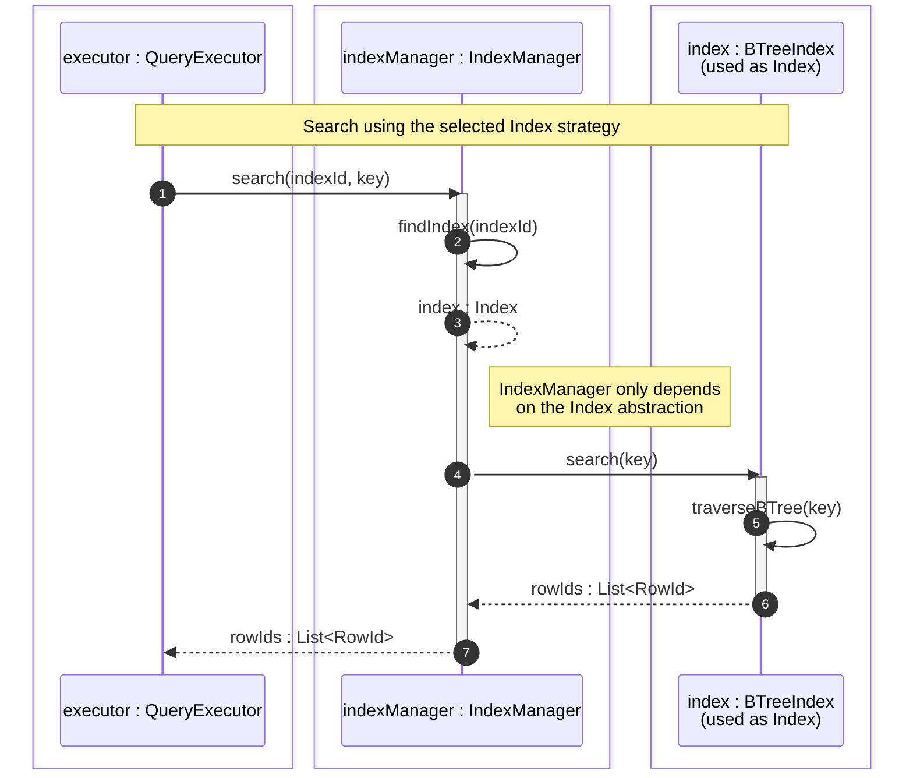
```mermaid
sequenceDiagram
    autonumber

    box #e3f2fd Query Execution
        participant Client as executor : QueryExecutor
    end

    box #fff3e0 Strategy Context
        participant Manager as indexManager : IndexManager
    end

    box #e8f5e9 Concrete Strategy
        participant Index as index : BTreeIndex<br/>(used as Index)
    end

    Note over Client,Index: Search using the selected Index strategy

    Client->>Manager: search(indexId, key)
    activate Manager

    Manager->>Manager: findIndex(indexId)
    Manager-->>Manager: index : Index

    Note right of Manager: IndexManager only depends<br/>on the Index abstraction

    Manager->>Index: search(key)
    activate Index

    Index->>Index: traverseBTree(key)
    Index-->>Manager: rowIds : List<RowId>

    deactivate Index

    Manager-->>Client: rowIds : List<RowId>
    deactivate Manager
```

### 9.2 Sequence Diagram for Create B-Tree Index Successfully
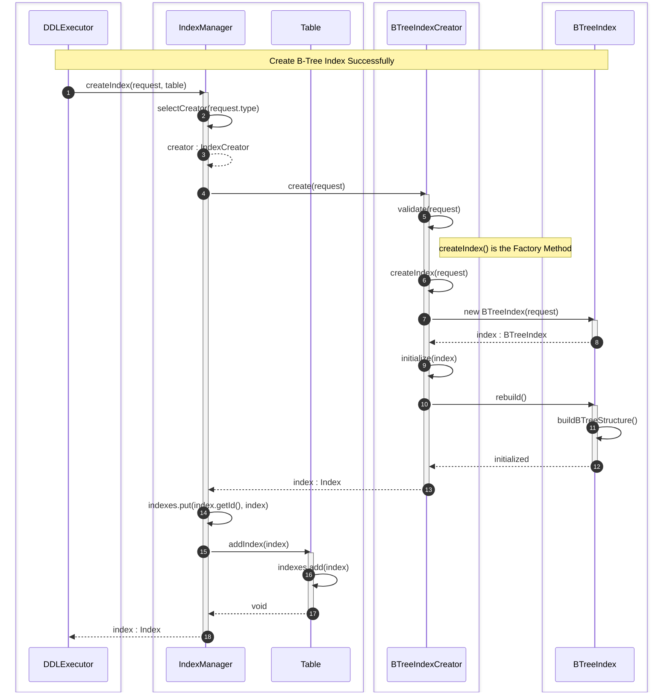
```mermaid
sequenceDiagram
    autonumber

    box #e3f2fd Client
        participant Client as DDLExecutor
    end

    box #e3f2fd Index Management
        participant Manager as IndexManager
        participant Table as Table
    end

    box #fff3e0 Factory Method
        participant Creator as  BTreeIndexCreator 
    end

    box #e8f5e9 Concrete Product
        participant Index as BTreeIndex 
    end

    Note over Client,Index: Create B-Tree Index Successfully

    Client->>Manager: createIndex(request, table)
    activate Manager

    Manager->>Manager: selectCreator(request.type)
    Manager-->>Manager: creator : IndexCreator

    Manager->>Creator: create(request)
    activate Creator

    Creator->>Creator: validate(request)

    Note right of Creator: createIndex() is the Factory Method

    Creator->>Creator: createIndex(request)
    Creator->>Index: new BTreeIndex(request)
    activate Index

    Index-->>Creator: index : BTreeIndex
    deactivate Index

    Creator->>Creator: initialize(index)

    Creator->>Index: rebuild()
    activate Index
    Index->>Index: buildBTreeStructure()
    Index-->>Creator: initialized
    deactivate Index

    Creator-->>Manager: index : Index
    deactivate Creator

    Manager->>Manager: indexes.put(index.getId(), index)

    Manager->>Table: addIndex(index)
    activate Table

    Table->>Table: indexes.add(index)
    Table-->>Manager: void

    deactivate Table

    Manager-->>Client: index : Index
    deactivate Manager
```

### 9.3 Code Example for Search Rows Using Selected Index Strategy
### Strategy Interface
```java 
public abstract class Index {
    protected UUID indexId;
    protected String name;
    protected UUID tableId;
    protected List<Column> columns;
    protected boolean unique;
    public UUID getId() {
        return indexId;
    }
    public String getName() {
        return name;
    }
    public List<Column> getColumns() {
        return columns;
    }
    public abstract List<RowId> search(IndexKey key);
    public abstract void insertKey(IndexKey key, RowId rowId);
    public abstract void deleteKey(IndexKey key, RowId rowId);
    public abstract void rebuild();
}
```

### Concrete Strategy
```java
public class BTreeIndex extends Index {
    @Override
    public List<RowId> search(IndexKey key) {
        return null;
    }
    @Override
    public void insertKey(IndexKey key, RowId rowId) {
        
    }
    @Override
    public void deleteKey(IndexKey key, RowId rowId) {
        
    }
    @Override
    public void rebuild() {
        
    }
}
```

### Context 
```java
public class IndexManager {
    private final Map<UUID, Index> indexes = new ConcurrentHashMap<>();

    public List<RowId> searchRows(UUID indexId, IndexKey key) {
        Index index = indexes.get(indexId);
        if (index == null) {
            throw new RuntimeException("Index not found: " + indexId);
        }
        return index.search(key);
    }
}
```

### Client 
```java 
public class QueryExecutor {
    private final IndexManager indexManager;
    public QueryExecutor(IndexManager indexManager) {
        this.indexManager = indexManager;
    }
    public void executeQuery() {
        UUID indexId = UUID.fromString("...");
        IndexKey key = new IndexKey("John");
        List<RowId> rowIds = indexManager.searchRows(indexId, key);
    }
}
```
### 9.3 Code Example for Create B-Tree Index Successfully
### Creator
```java
public abstract class IndexCreator {
    public final Index create(CreateIndexRequest request) {
        validate(request);
        Index index = createIndex(request); 
        initialize(index);
        return index;
    }
    protected abstract Index createIndex(CreateIndexRequest request);
    protected void validate(CreateIndexRequest request) {
        
    }
    protected void initialize(Index index) {
        
    }
}
```
### Concrete Creator
```java
public class BTreeIndexCreator extends IndexCreator {
    @Override
    protected Index createIndex(CreateIndexRequest request) {
        return new BTreeIndex(request.indexId, request.name, request.tableId, request.columns, request.unique);
    }
}
```

### Product 
```java
public abstract class Index {
    protected UUID indexId;
    protected String name;
    protected UUID tableId;
    protected List<Column> columns;
    protected boolean unique;

    public Index(UUID indexId, String name, UUID tableId, List<Column> columns, boolean unique) {
        this.indexId = indexId;
        this.name = name;
        this.tableId = tableId;
        this.columns = columns;
        this.unique = unique;
    }
    public UUID getId() {
        return indexId;
    }
    public String getName() {
        return name;
    }
    public List<Column> getColumns() {
        return columns;
    }
    public abstract List<RowId> search(IndexKey key);
    public abstract void insertKey(IndexKey key, RowId rowId);
    public abstract void deleteKey(IndexKey key, RowId rowId);
    public abstract void rebuild();
}
```

### Concrete Product
```java
public class BTreeIndex extends Index {
    private final BTreeMap<IndexKey, List<RowId>> btree;
    private final int maxDegree; 

    public BTreeIndex(UUID indexId, String name, UUID tableId, List<Column> columns, boolean unique) {
        super(indexId, name, tableId, columns, unique);
        this.btree = new BTreeMap<>();
        this.maxDegree = 4; 
    }

    @Override
    public List<RowId> search(IndexKey key) {
        return null;
    }

    @Override
    public void insertKey(IndexKey key, RowId rowId) {        
    }

    @Override
    public void deleteKey(IndexKey key, RowId rowId) {       
    }

    @Override
    public void rebuild() {
    }
}
```
# Query Processing feature mindmap
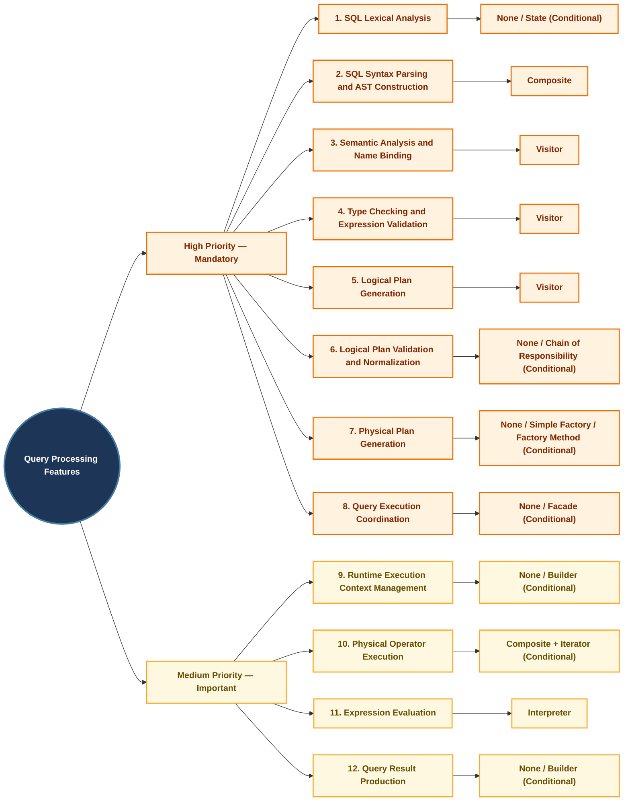
```mermaid
flowchart LR
    %% =====================================================
    %% ROOT
    %% =====================================================

    ROOT((Query Processing Features))

    %% =====================================================
    %% PRIORITY GROUPS
    %% =====================================================

    HIGH["High Priority — Mandatory"]
    MEDIUM["Medium Priority — Important"]

    ROOT --> HIGH
    ROOT --> MEDIUM

    %% =====================================================
    %% HIGH PRIORITY FEATURES
    %% =====================================================

    H1["1. SQL Lexical Analysis"]
    H1P["None / State (Conditional)"]

    H2["2. SQL Syntax Parsing and AST Construction"]
    H2P["Composite"]

    H3["3. Semantic Analysis and Name Binding"]
    H3P["Visitor"]

    H4["4. Type Checking and Expression Validation"]
    H4P["Visitor"]

    H5["5. Logical Plan Generation"]
    H5P["Visitor"]

    H6["6. Logical Plan Validation and Normalization"]
    H6P["None / Chain of Responsibility (Conditional)"]

    H7["7. Physical Plan Generation"]
    H7P["None / Simple Factory / Factory Method (Conditional)"]

    H8["8. Query Execution Coordination"]
    H8P["None / Facade (Conditional)"]

    H9["9. Runtime Execution Context Management"]
    H9P["None / Builder (Conditional)"]

    H10["10. Physical Operator Execution"]
    H10P["Composite + Iterator (Conditional)"]

    H11["11. Expression Evaluation"]
    H11P["Interpreter"]

    H12["12. Query Result Production"]
    H12P["None / Builder (Conditional)"]

    HIGH --> H1
    HIGH --> H2
    HIGH --> H3
    HIGH --> H4
    HIGH --> H5
    HIGH --> H6
    HIGH --> H7
    HIGH --> H8

    MEDIUM --> H9
    MEDIUM --> H10
    MEDIUM --> H11
    MEDIUM --> H12

    H1 --> H1P
    H2 --> H2P
    H3 --> H3P
    H4 --> H4P
    H5 --> H5P
    H6 --> H6P
    H7 --> H7P
    H8 --> H8P
    H9 --> H9P
    H10 --> H10P
    H11 --> H11P
    H12 --> H12P

    %% =====================================================
    %% STYLE ASSIGNMENTS
    %% =====================================================

    class ROOT rootStyle

    class HIGH,H1,H1P,H2,H2P,H3,H3P,H4,H4P highStyle
    class H5,H5P,H6,H6P,H7,H7P,H8,H8P highStyle

    class MEDIUM,H9,H9P,H10,H10P,H11,H11P,H12,H12P mediumStyle

    %% =====================================================
    %% STYLE DEFINITIONS
    %% =====================================================

    classDef rootStyle fill:#1d3557,stroke:#457b9d,stroke-width:3px,color:#ffffff,font-weight:bold

    classDef highStyle fill:#fff3e0,stroke:#ef6c00,stroke-width:2px,color:#7f2704,font-weight:bold

    classDef mediumStyle fill:#fff8e1,stroke:#f9a825,stroke-width:2px,color:#664d03,font-weight:bold
```