## Danh sách ưu tiên tổng quát

| Priority | Core Feature | Mức độ ưu tiên | Design Pattern phù hợp |
|---:|---|---|---|
| 1 | Database Object Hierarchy and Lifecycle Management | Bắt buộc | Composite |
| 2 | Table Definition and Construction | Bắt buộc | Builder |
| 3 | Column Definition and Data Type Management | Bắt buộc | Factory Method |
| 4 | Constraint Definition and Validation | Bắt buộc | Strategy, Factory Method |
| 5 | Database Object Creation | Bắt buộc | Factory Method |
| 6 | Object Lookup, Naming and Uniqueness Validation | Bắt buộc | Specification, Repository |
| 7 | Index Definition and Index Type Selection | Quan trọng | Strategy, Factory Method |
| 8 | Table Data Operations | Quan trọng | Command, Template Method |
| 9 | View Management | Quan trọng | Composite, Specification |
| 10 | Sequence Management | Cần thiết | State, Strategy |
| 11 | Schema Object Traversal and Metadata Export | Hỗ trợ | Iterator, Visitor |
| 12 | Partition and Trigger Management | Nâng cao | Strategy, Observer, Command |

# 1. Database Object Hierarchy and Lifecycle Management
## Using Composite Pattern

## 1.1 Class Diagram
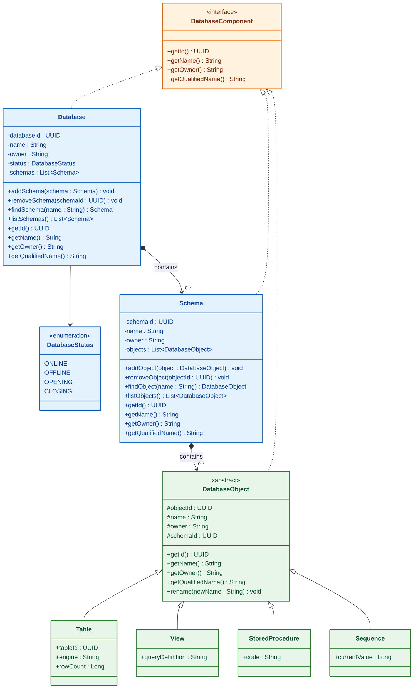

## 1.2 Sequence Diagram shouldCreateDatabaseWithSchemaAndTable()
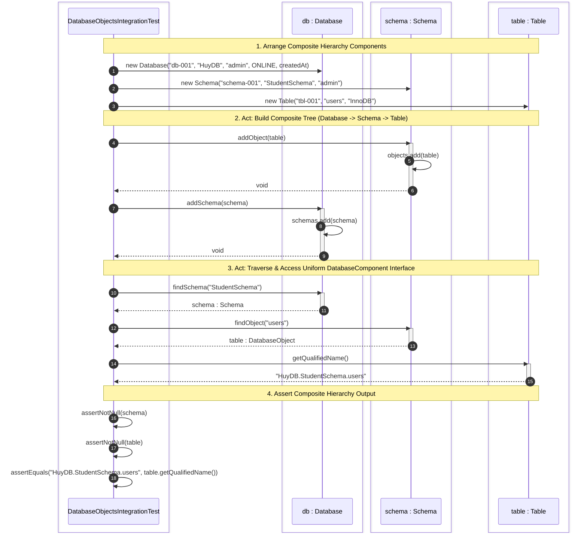

# 2. Table Definition and Construction
## Using Builder Pattern 

## 2.1 Class Diagram
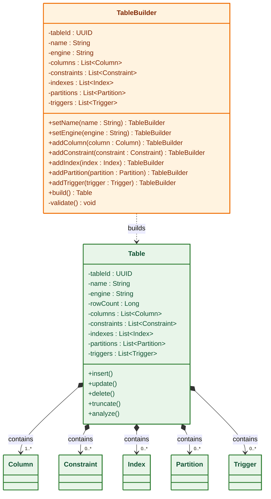
## 2.2 Sequence Diagram
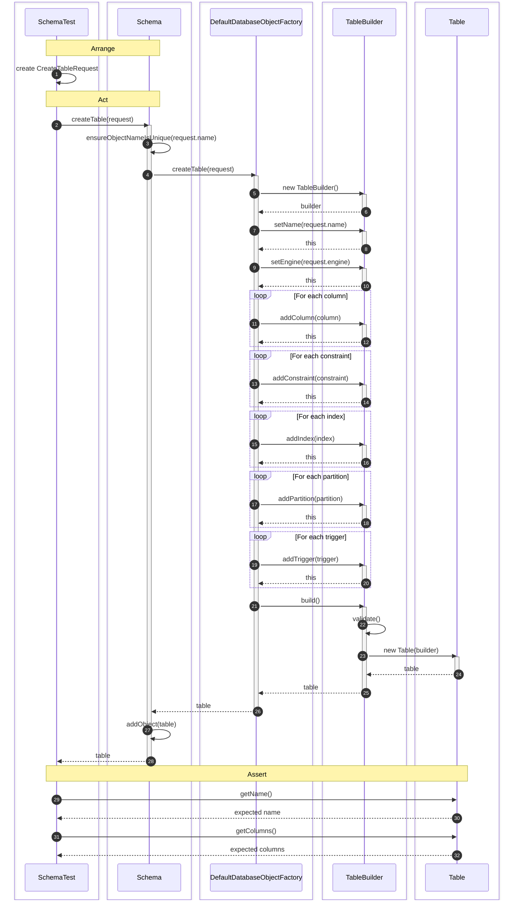

# 4. Constraint Definition and Validation
## Using Strategy, Factory Method

## 4.1 Class Diagram
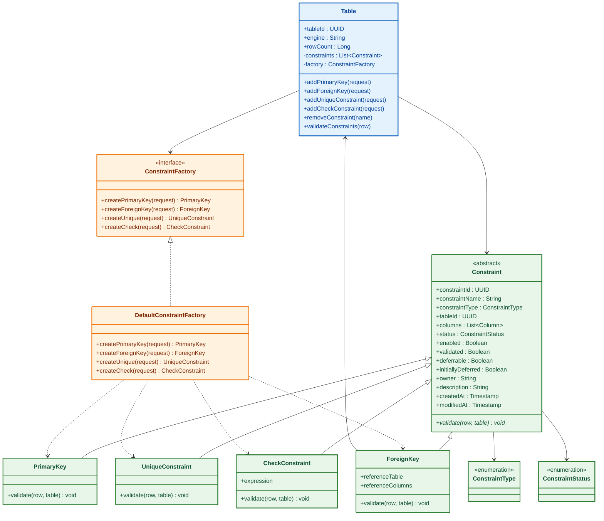
## 4.2 Sequence Diagram
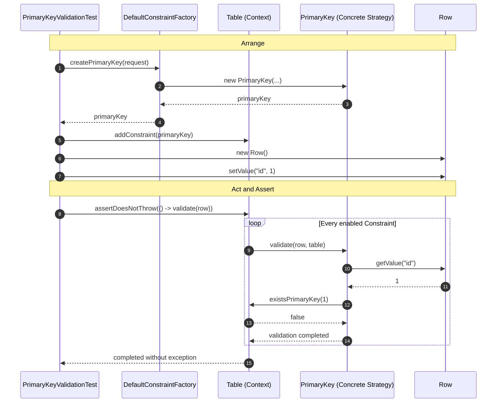

--- 
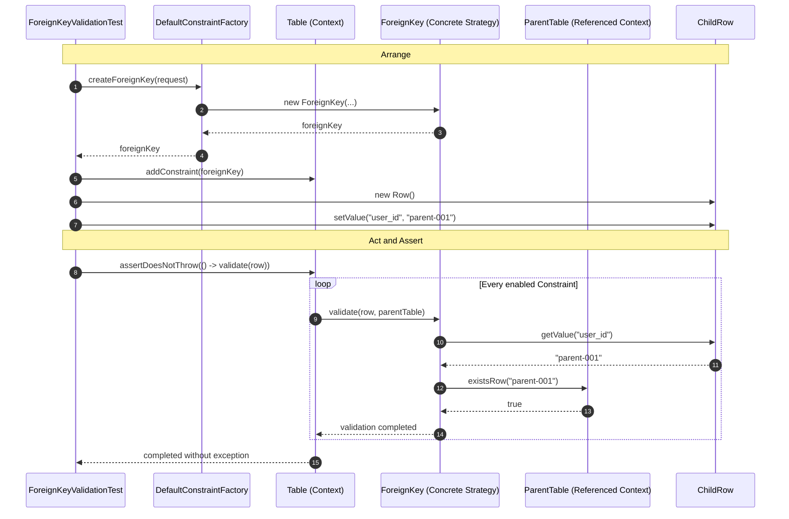

# 5. Database Object Creation
## Using Abstract Factory 

## 5.1 Class Diagram
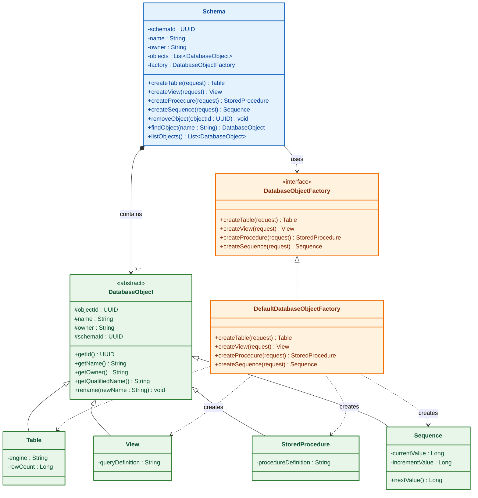

## 5.2 Sequence Diagram
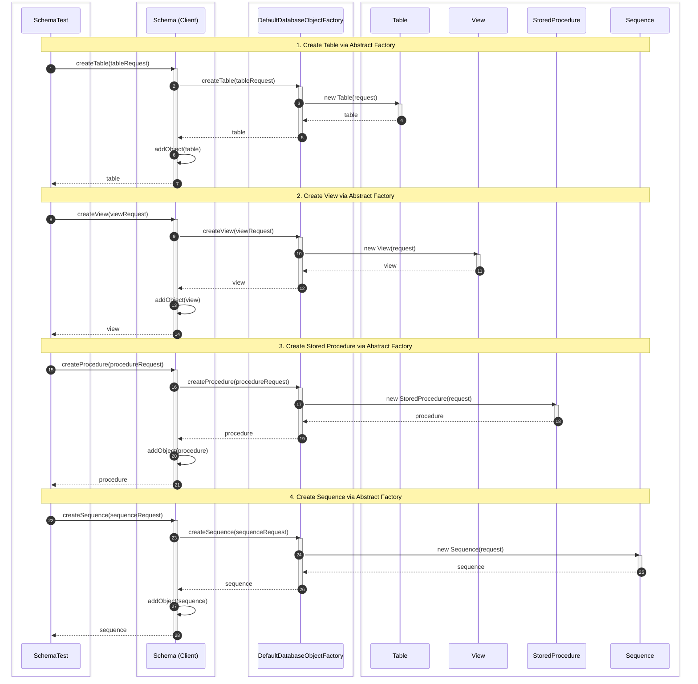

# 11. Schema Object Traversal and Metadata Export
## Using Iterator, Visitor Pattern

# 11.1 Class Diagram
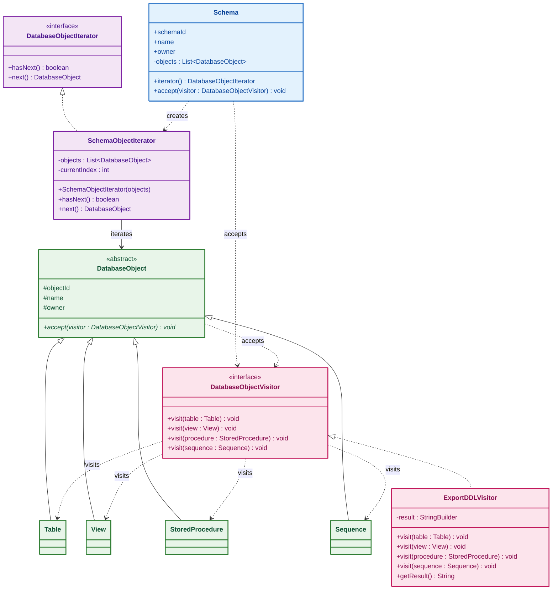

# 11.2 Sequence Diagram

### 1. shouldTraverseSchemaObjectsUsingIterator() 
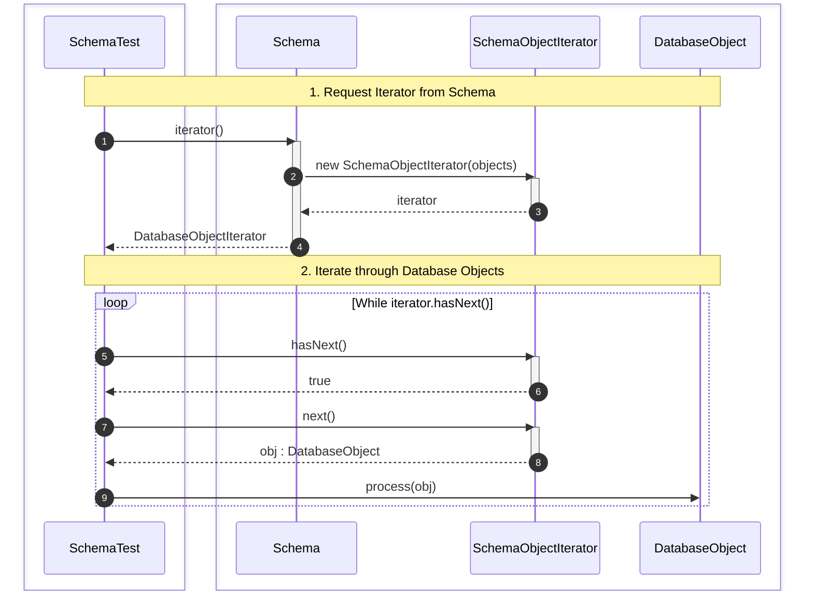

### 2. shouldExportSchemaDDLUsingVisitor()
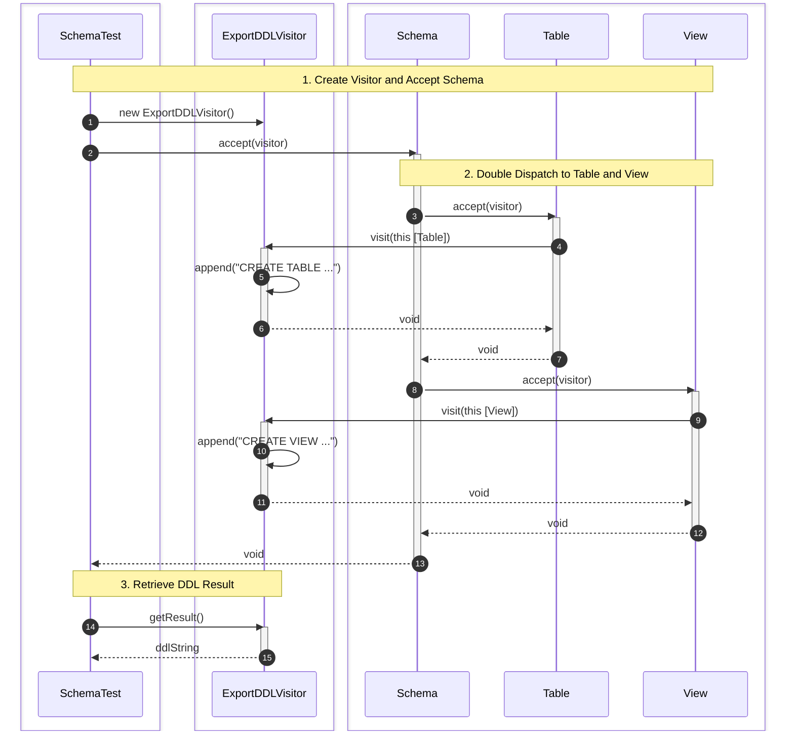