Catalog Module Unit Test

## CatalogManagerTest

### 1. shouldRegisterDatabase()
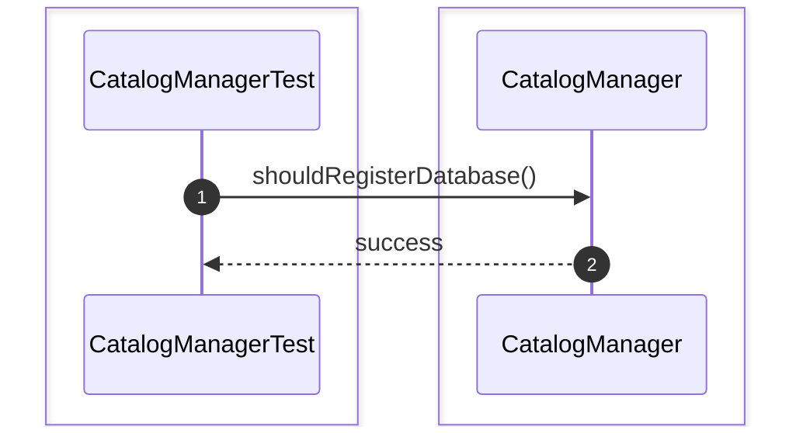

### 2. shouldRegisterSchema()
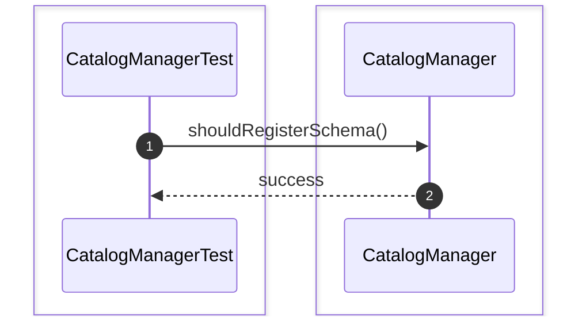

### 3. shouldRegisterTable()


### 4. shouldRegisterIndex()
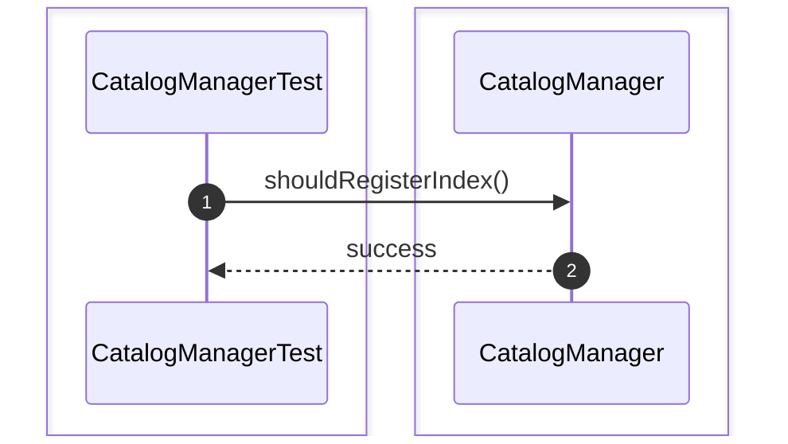

### 5. shouldFindDatabase()


### 6. shouldFindSchema()


### 7. shouldFindTable()
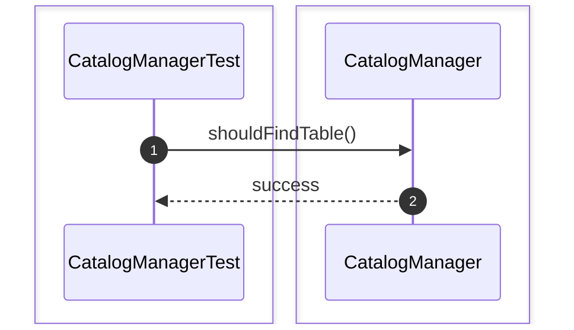

### 8. shouldFindIndex()


### 9. shouldRefreshMetadata()
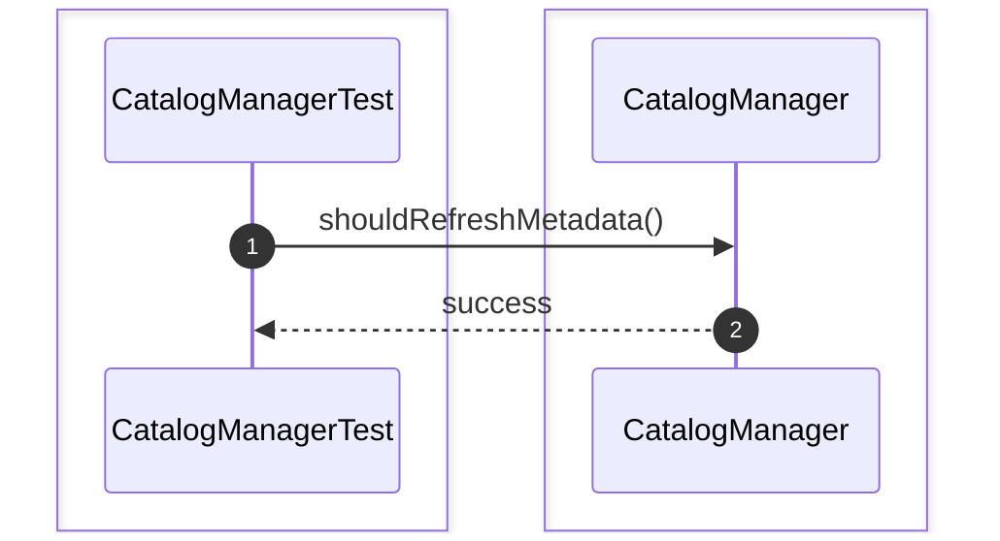

### 10. shouldInvalidateMetadataCache()
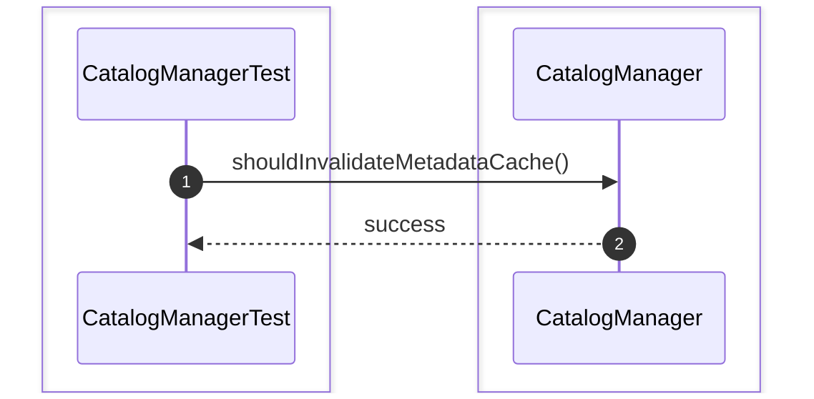

### 11. shouldLoadMetadataFromDisk()
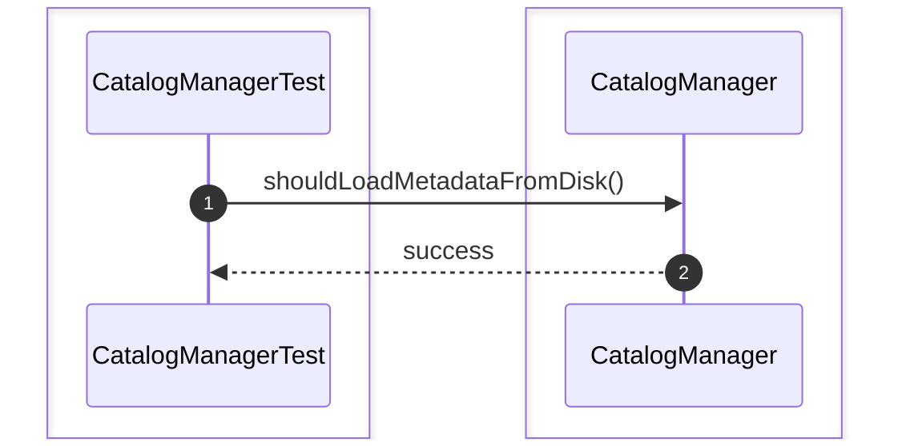

### 12. shouldCacheFrequentlyUsedMetadata()
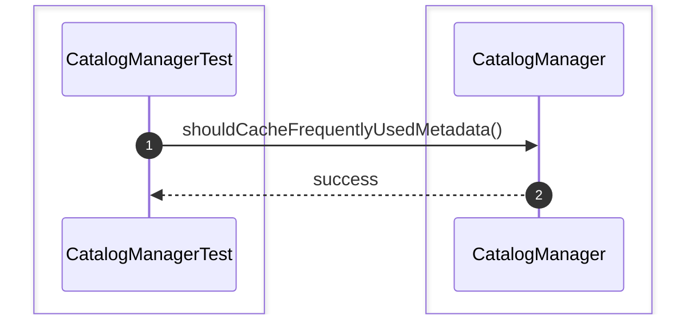

### 13. shouldUpdateTableMetadata()
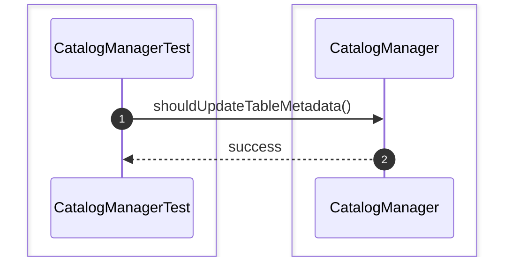

### 14. shouldUpdateIndexMetadata()
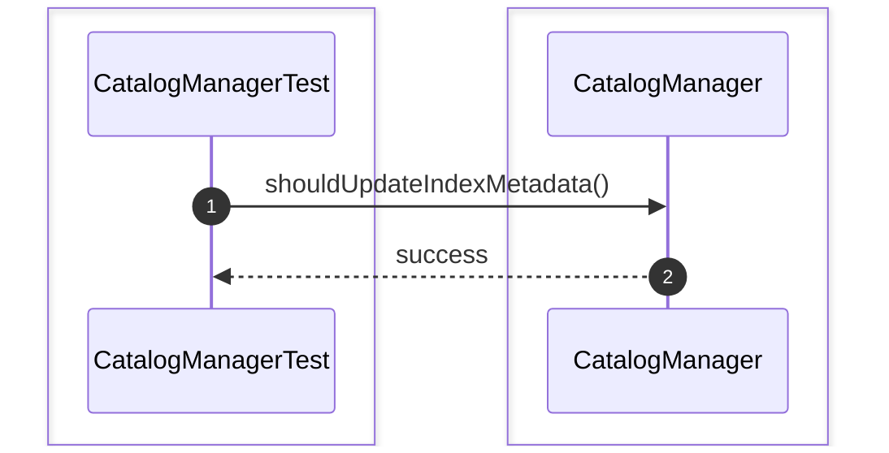

### 15. shouldRemoveTableMetadata()
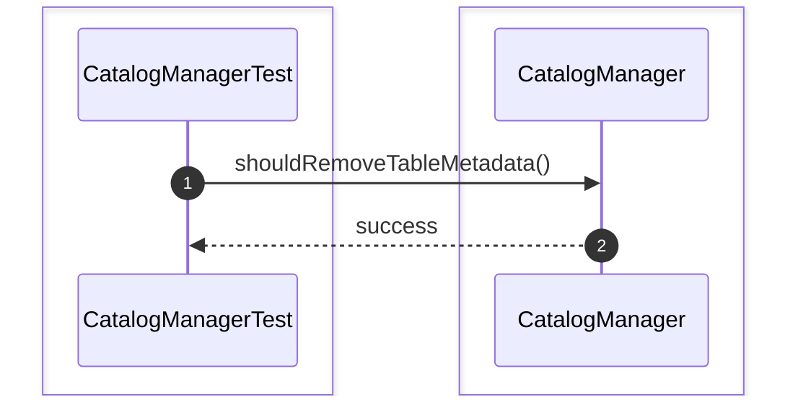

### 16. shouldRemoveSchemaMetadata()
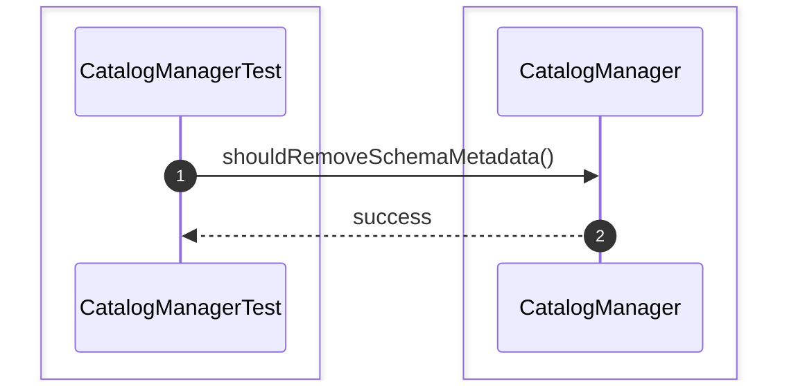

### 17. shouldRemoveDatabaseMetadata()
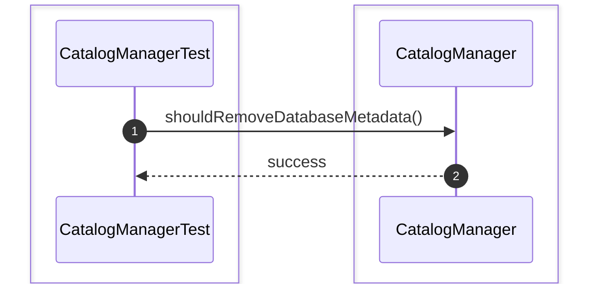

### 18. shouldDetectDuplicateTableRegistration()
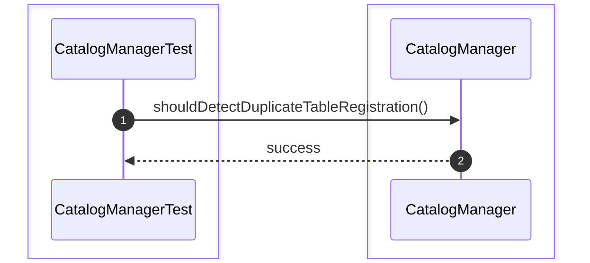

### 19. shouldRejectUnknownDatabase()


### 20. shouldReturnCachedMetadata()
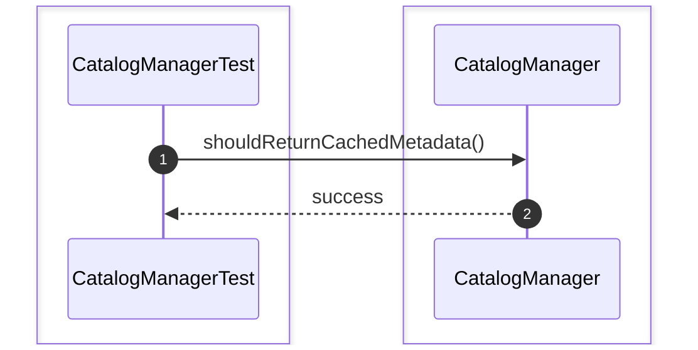

# Metadata Unit Test

### 1. shouldRegisterDatabaseMetadata()
```mermaid
sequenceDiagram
    autonumber
    box #e1f5fe Test Suite
    participant Test as CatalogModuleIntegrationTest
    end
    box #e8f5e9 Catalog Module Components
    participant System as System
    end

    Test->>System: shouldRegisterDatabaseMetadata()
    System-->>Test: success
```

### 2. shouldRegisterSchemaMetadata()
```mermaid
sequenceDiagram
    autonumber
    box #e1f5fe Test Suite
    participant Test as CatalogModuleIntegrationTest
    end
    box #e8f5e9 Catalog Module Components
    participant System as System
    end

    Test->>System: shouldRegisterSchemaMetadata()
    System-->>Test: success
```

### 3. shouldRegisterTableMetadata()
```mermaid
sequenceDiagram
    autonumber
    box #e1f5fe Test Suite
    participant Test as CatalogModuleIntegrationTest
    end
    box #e8f5e9 Catalog Module Components
    participant System as System
    end

    Test->>System: shouldRegisterTableMetadata()
    System-->>Test: success
```

### 4. shouldRegisterIndexMetadata()
```mermaid
sequenceDiagram
    autonumber
    box #e1f5fe Test Suite
    participant Test as CatalogModuleIntegrationTest
    end
    box #e8f5e9 Catalog Module Components
    participant System as System
    end

    Test->>System: shouldRegisterIndexMetadata()
    System-->>Test: success
```

### 5. shouldUpdateCatalogAfterSchemaChange()
```mermaid
sequenceDiagram
    autonumber
    box #e1f5fe Test Suite
    participant Test as CatalogModuleIntegrationTest
    end
    box #e8f5e9 Catalog Module Components
    participant System as System
    end

    Test->>System: shouldUpdateCatalogAfterSchemaChange()
    System-->>Test: success
```

### 6. shouldRefreshMetadataAfterDDL()
```mermaid
sequenceDiagram
    autonumber
    box #e1f5fe Test Suite
    participant Test as CatalogModuleIntegrationTest
    end
    box #e8f5e9 Catalog Module Components
    participant System as System
    end

    Test->>System: shouldRefreshMetadataAfterDDL()
    System-->>Test: success
```

### 7. shouldSynchronizeMetadataCache()
```mermaid
sequenceDiagram
    autonumber
    box #e1f5fe Test Suite
    participant Test as CatalogModuleIntegrationTest
    end
    box #e8f5e9 Catalog Module Components
    participant System as System
    end

    Test->>System: shouldSynchronizeMetadataCache()
    System-->>Test: success
```

### 8. shouldReloadMetadataAfterRestart()
```mermaid
sequenceDiagram
    autonumber
    box #e1f5fe Test Suite
    participant Test as CatalogModuleIntegrationTest
    end
    box #e8f5e9 Catalog Module Components
    participant System as System
    end

    Test->>System: shouldReloadMetadataAfterRestart()
    System-->>Test: success
```
