Database Objects Module Unit Test

## DatabaseTest

### 1. shouldOpenDatabase()
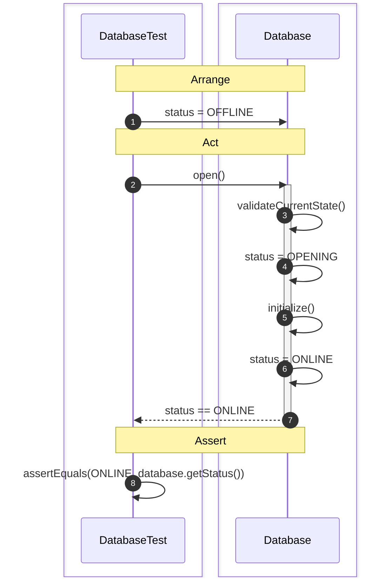
```mermaid
sequenceDiagram
    autonumber

    box #e1f5fe Test Suite
    participant Test as DatabaseTest
    end

    box #e8f5e9 Database Component
    participant D as Database
    end

    Note over Test,D: Arrange
    Test->>D: status = OFFLINE

    Note over Test,D: Act
    Test->>D: open()

    activate D

    D->>D: validateCurrentState()
    D->>D: status = OPENING
    D->>D: initialize()
    D->>D: status = ONLINE

    D-->>Test: status == ONLINE
    deactivate D

    Note over Test,D: Assert
    Test->>Test: assertEquals(ONLINE, database.getStatus())
```

### 2. shouldCloseDatabase()
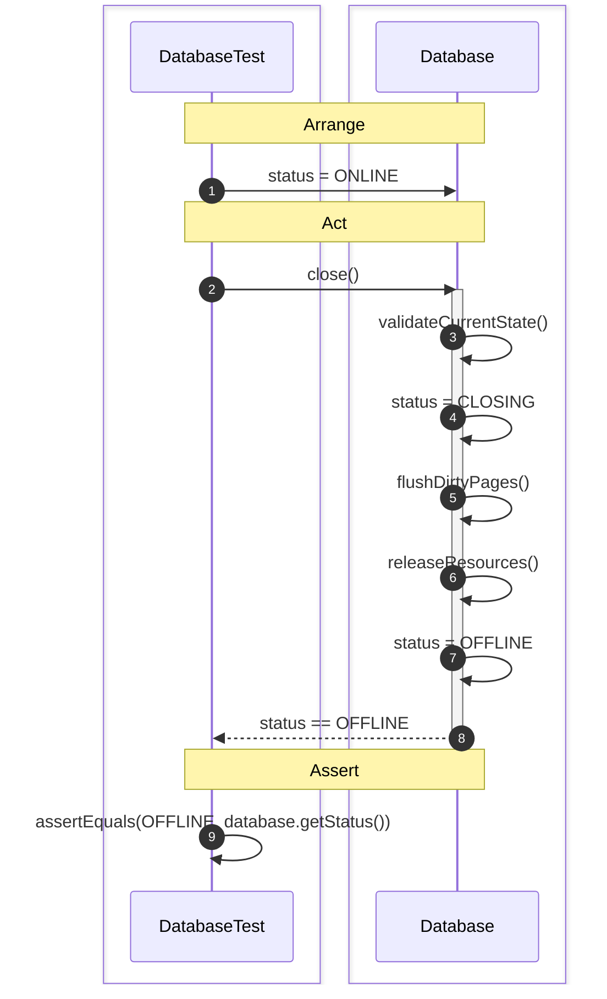
```mermaid
sequenceDiagram
    autonumber

    box #e1f5fe Test Suite
    participant Test as DatabaseTest
    end

    box #e8f5e9 Database Component
    participant D as Database
    end

    Note over Test,D: Arrange
    Test->>D: status = ONLINE

    Note over Test,D: Act
    Test->>D: close()

    activate D

    D->>D: validateCurrentState()
    D->>D: status = CLOSING
    D->>D: flushDirtyPages()
    D->>D: releaseResources()
    D->>D: status = OFFLINE

    D-->>Test: status == OFFLINE
    deactivate D

    Note over Test,D: Assert
    Test->>Test: assertEquals(OFFLINE, database.getStatus())
```

### 3. shouldRenameDatabase()
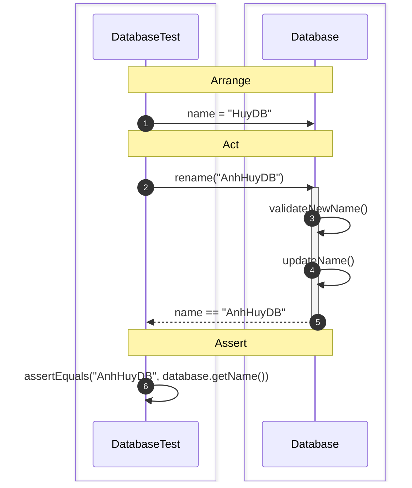
```mermaid
sequenceDiagram
    autonumber

    box #e1f5fe Test Suite
    participant Test as DatabaseTest
    end

    box #e8f5e9 Database Component
    participant D as Database
    end

    Note over Test,D: Arrange
    Test->>D: name = "HuyDB"

    Note over Test,D: Act
    Test->>D: rename("AnhHuyDB")

    activate D

    D->>D: validateNewName()
    D->>D: updateName()

    D-->>Test: name == "AnhHuyDB"

    deactivate D

    Note over Test,D: Assert
    Test->>Test: assertEquals("AnhHuyDB", database.getName())
```

### 4. shouldSetDatabaseOwner()
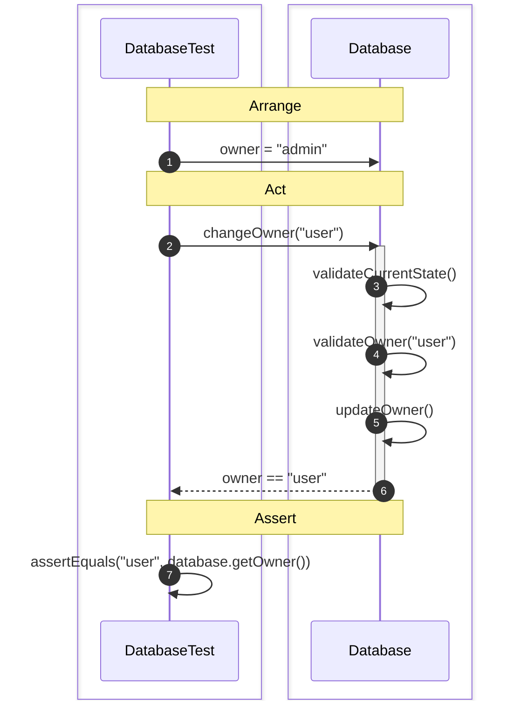
```mermaid
sequenceDiagram
    autonumber

    box #e1f5fe Test Suite
    participant Test as DatabaseTest
    end

    box #e8f5e9 Database Component
    participant D as Database
    end

    Note over Test,D: Arrange
    Test->>D: owner = "admin"

    Note over Test,D: Act
    Test->>D: changeOwner("user")

    activate D

    D->>D: validateCurrentState()
    D->>D: validateOwner("user")
    D->>D: updateOwner()

    D-->>Test: owner == "user"

    deactivate D

    Note over Test,D: Assert
    Test->>Test: assertEquals("user", database.getOwner())
```

### 5. shouldRejectOperationWhenClosed()
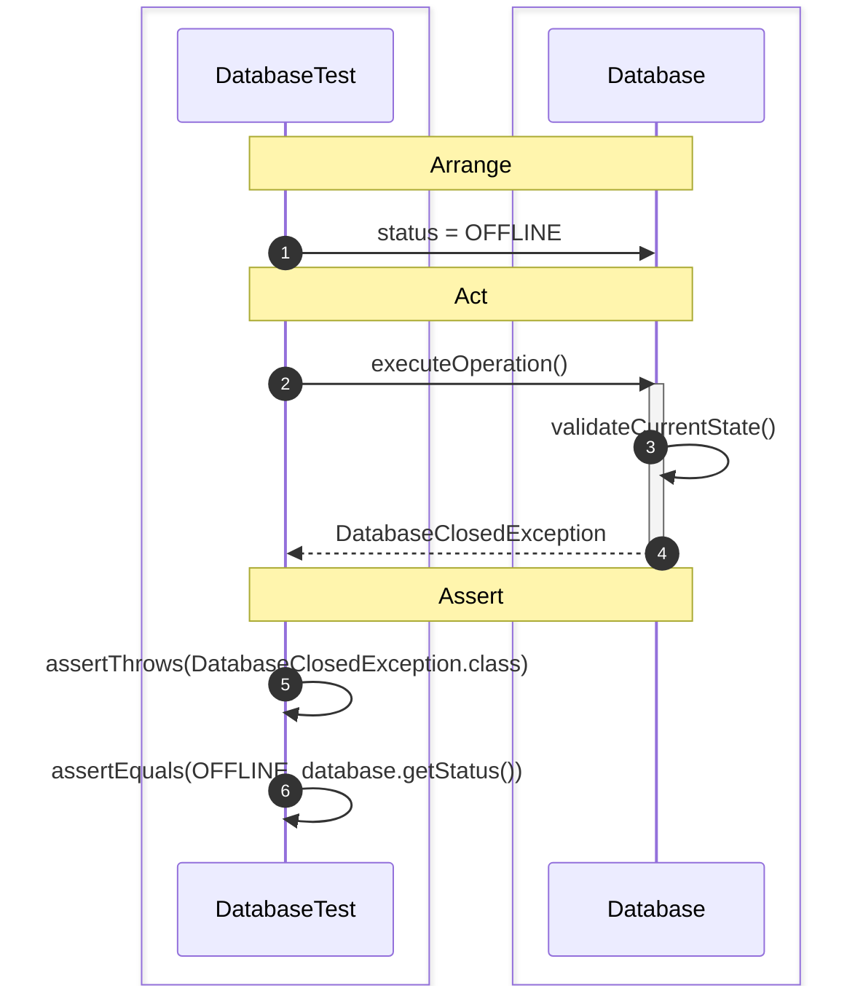
```mermaid
sequenceDiagram
    autonumber

    box #e1f5fe Test Suite
    participant Test as DatabaseTest
    end

    box #e8f5e9 Database Component
    participant D as Database
    end

    Note over Test,D: Arrange
    Test->>D: status = OFFLINE

    Note over Test,D: Act
    Test->>D: executeOperation()

    activate D

    D->>D: validateCurrentState()

    D-->>Test: DatabaseClosedException

    deactivate D

    Note over Test,D: Assert
    Test->>Test: assertThrows(DatabaseClosedException.class)
    Test->>Test: assertEquals(OFFLINE, database.getStatus())
```

### 6. shouldRejectOpenWhenAlreadyOnline()
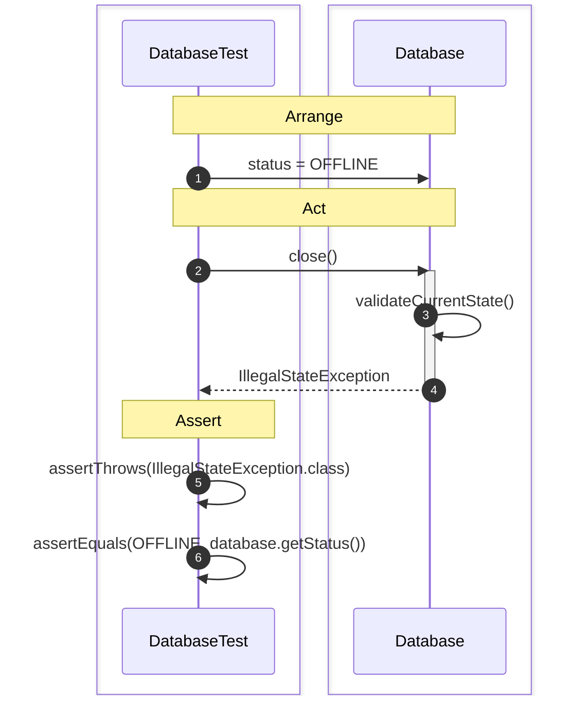
```mermaid
sequenceDiagram
    autonumber

    box #e1f5fe Test Suite
    participant Test as DatabaseTest
    end

    box #e8f5e9 Database Component
    participant D as Database
    end

    Note over Test,D: Arrange
    Test->>D: status = OFFLINE

    Note over Test,D: Act
    Test->>D: close()

    activate D
    D->>D: validateCurrentState()
    D-->>Test: IllegalStateException
    deactivate D
    
    Note over Test: Assert
    Test->>Test: assertThrows(IllegalStateException.class)
    Test->>Test: assertEquals(OFFLINE, database.getStatus())
    
```

### 7. shouldRejectCloseWhenAlreadyOffline()
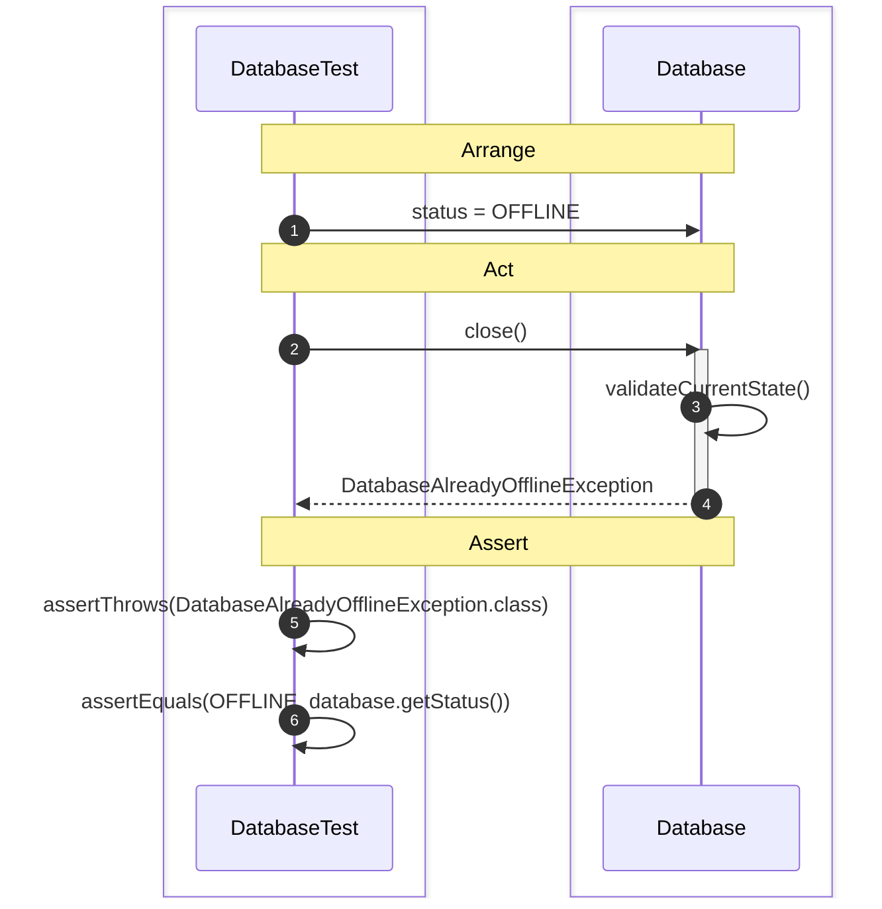
```mermaid
sequenceDiagram
    autonumber

    box #e1f5fe Test Suite
    participant Test as DatabaseTest
    end

    box #e8f5e9 Database Component
    participant D as Database
    end

    Note over Test,D: Arrange
    Test->>D: status = OFFLINE

    Note over Test,D: Act
    Test->>D: close()

    activate D

    D->>D: validateCurrentState()

    D-->>Test: DatabaseAlreadyOfflineException

    deactivate D

    Note over Test,D: Assert
    Test->>Test: assertThrows(DatabaseAlreadyOfflineException.class)
    Test->>Test: assertEquals(OFFLINE, database.getStatus())
```

### 8. shouldRejectRenameWhenDatabaseIsOpening()

```mermaid
sequenceDiagram
    autonumber

    box #e1f5fe Test Suite
    participant Test as DatabaseTest
    end

    box #e8f5e9 Database Component
    participant D as Database
    end

    Note over Test,D: Arrange
    Test->>D: status = OPENING
    Test->>D: name = "OldDatabase"

    Note over Test,D: Act
    Test->>D: rename("NewDatabase")

    activate D

    D->>D: validateCurrentState()

    D-->>Test: DatabaseOpeningException

    deactivate D

    Note over Test,D: Assert
    Test->>Test: assertThrows(DatabaseOpeningException.class)
    Test->>Test: assertEquals("OldDatabase", database.getName())
```

### 9. shouldRejectRenameWhenDatabaseIsClosing()
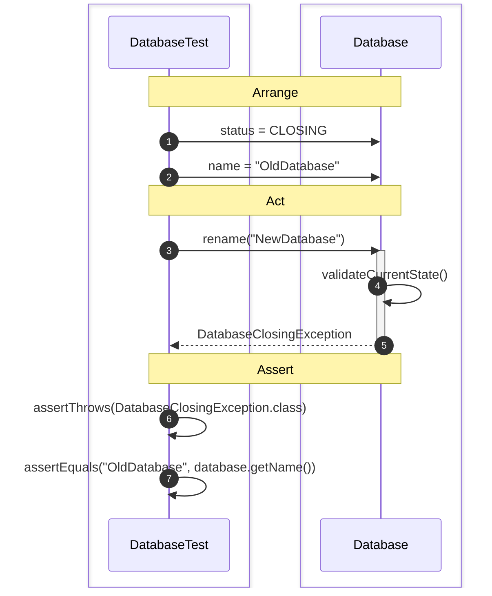
```mermaid
sequenceDiagram
    autonumber

    box #e1f5fe Test Suite
    participant Test as DatabaseTest
    end

    box #e8f5e9 Database Component
    participant D as Database
    end

    Note over Test,D: Arrange
    Test->>D: status = CLOSING
    Test->>D: name = "OldDatabase"

    Note over Test,D: Act
    Test->>D: rename("NewDatabase")

    activate D

    D->>D: validateCurrentState()

    D-->>Test: DatabaseClosingException

    deactivate D

    Note over Test,D: Assert
    Test->>Test: assertThrows(DatabaseClosingException.class)
    Test->>Test: assertEquals("OldDatabase", database.getName())
```

### 10. shouldRejectEmptyDatabaseName()
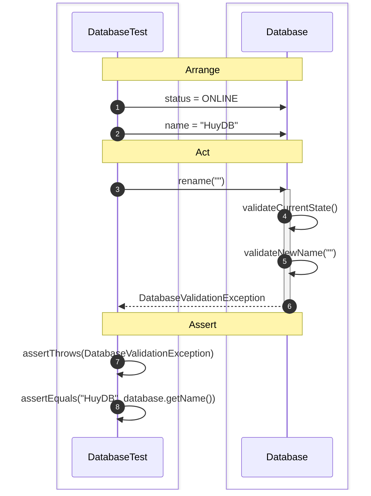
```mermaid
sequenceDiagram
    autonumber

    box #e1f5fe Test Suite
    participant Test as DatabaseTest
    end

    box #e8f5e9 Database Component
    participant D as Database
    end

    Note over Test,D: Arrange
    Test->>D: status = ONLINE
    Test->>D: name = "HuyDB"

    Note over Test,D: Act
    Test->>D: rename("")

    activate D

    D->>D: validateCurrentState()
    D->>D: validateNewName("")

    D-->>Test: DatabaseValidationException
    deactivate D

    Note over Test,D: Assert
    Test->>Test: assertThrows(DatabaseValidationException)
    Test->>Test: assertEquals("HuyDB", database.getName())
```

### 11. shouldRejectNullOwner()
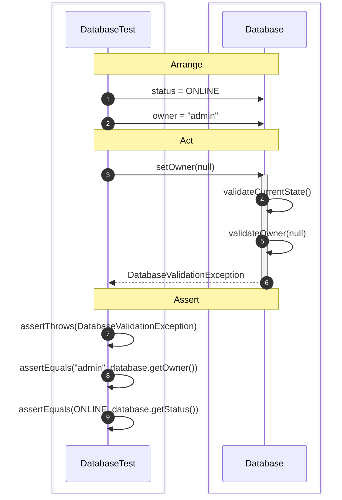
```mermaid
sequenceDiagram
    autonumber

    box #e1f5fe Test Suite
    participant Test as DatabaseTest
    end

    box #e8f5e9 Database Component
    participant D as Database
    end

    Note over Test,D: Arrange
    Test->>D: status = ONLINE
    Test->>D: owner = "admin"

    Note over Test,D: Act
    Test->>D: setOwner(null)

    activate D

    D->>D: validateCurrentState()
    D->>D: validateOwner(null)

    D-->>Test: DatabaseValidationException
    deactivate D

    Note over Test,D: Assert
    Test->>Test: assertThrows(DatabaseValidationException)
    Test->>Test: assertEquals("admin", database.getOwner())
    Test->>Test: assertEquals(ONLINE, database.getStatus())
```

### 12. shouldRejectNullDatabaseName()
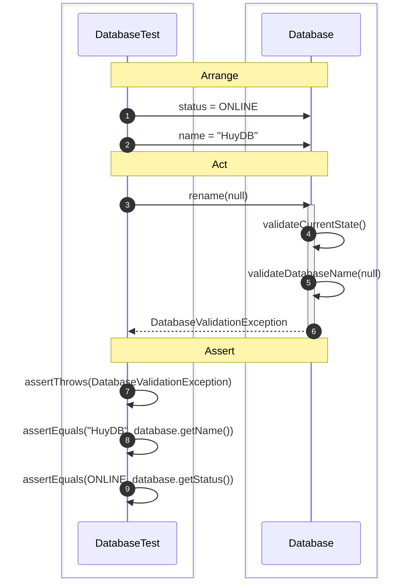
```mermaid
sequenceDiagram
    autonumber

    box #e1f5fe Test Suite
    participant Test as DatabaseTest
    end

    box #e8f5e9 Database Component
    participant D as Database
    end

    Note over Test,D: Arrange
    Test->>D: status = ONLINE
    Test->>D: name = "HuyDB"

    Note over Test,D: Act
    Test->>D: rename(null)

    activate D

    D->>D: validateCurrentState()
    D->>D: validateDatabaseName(null)

    D-->>Test: DatabaseValidationException
    deactivate D

    Note over Test,D: Assert
    Test->>Test: assertThrows(DatabaseValidationException)
    Test->>Test: assertEquals("HuyDB", database.getName())
    Test->>Test: assertEquals(ONLINE, database.getStatus())
```

### 13. shouldRejectBlankDatabaseName()
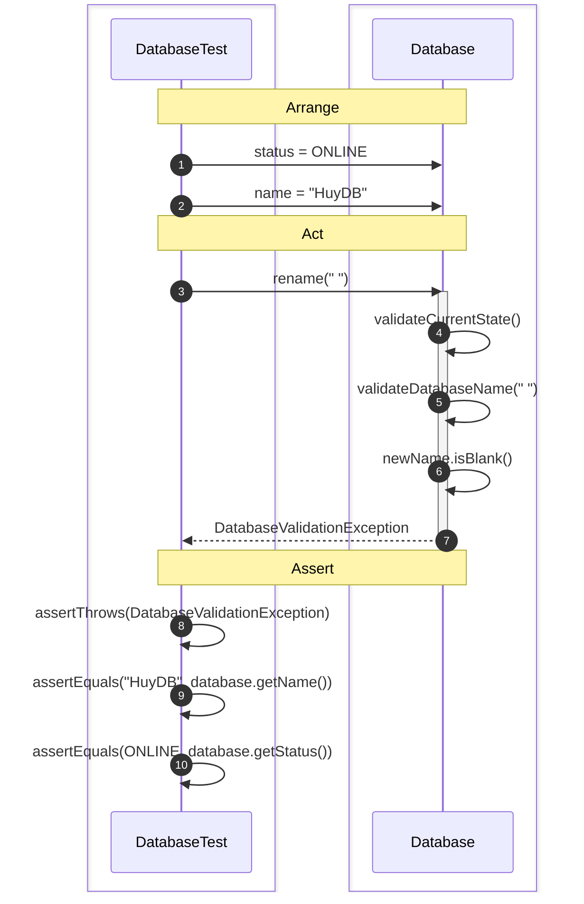
```mermaid
sequenceDiagram
    autonumber

    box #e1f5fe Test Suite
    participant Test as DatabaseTest
    end

    box #e8f5e9 Database Component
    participant D as Database
    end

    Note over Test,D: Arrange
    Test->>D: status = ONLINE
    Test->>D: name = "HuyDB"

    Note over Test,D: Act
    Test->>D: rename("     ")

    activate D

    D->>D: validateCurrentState()
    D->>D: validateDatabaseName("     ")
    D->>D: newName.isBlank()

    D-->>Test: DatabaseValidationException
    deactivate D

    Note over Test,D: Assert
    Test->>Test: assertThrows(DatabaseValidationException)
    Test->>Test: assertEquals("HuyDB", database.getName())
    Test->>Test: assertEquals(ONLINE, database.getStatus())
```

### 14. shouldRejectDatabaseNameWithSpecialCharacters()
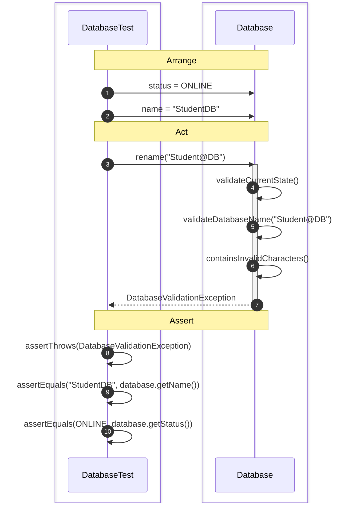
```mermaid
sequenceDiagram
    autonumber

    box #e1f5fe Test Suite
    participant Test as DatabaseTest
    end

    box #e8f5e9 Database Component
    participant D as Database
    end

    Note over Test,D: Arrange
    Test->>D: status = ONLINE
    Test->>D: name = "StudentDB"

    Note over Test,D: Act
    Test->>D: rename("Student@DB")

    activate D

    D->>D: validateCurrentState()
    D->>D: validateDatabaseName("Student@DB")
    D->>D: containsInvalidCharacters()

    D-->>Test: DatabaseValidationException
    deactivate D

    Note over Test,D: Assert
    Test->>Test: assertThrows(DatabaseValidationException)
    Test->>Test: assertEquals("StudentDB", database.getName())
    Test->>Test: assertEquals(ONLINE, database.getStatus())
```

### 15. shouldRejectDatabaseNameExceedingMaxLength()
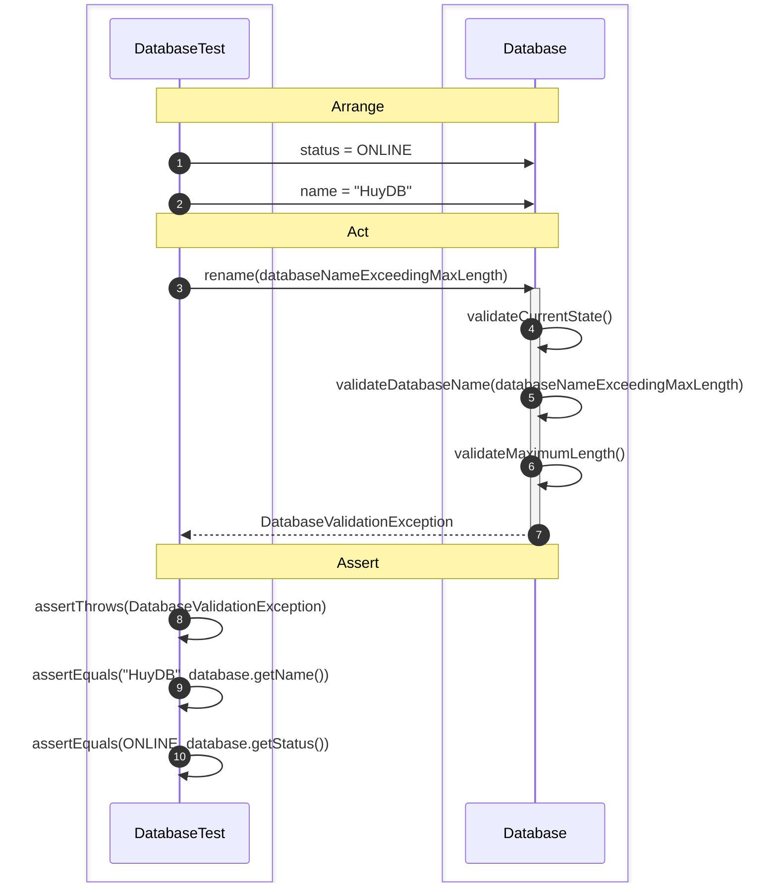
```mermaid
sequenceDiagram
    autonumber

    box #e1f5fe Test Suite
    participant Test as DatabaseTest
    end

    box #e8f5e9 Database Component
    participant D as Database
    end

    Note over Test,D: Arrange
    Test->>D: status = ONLINE
    Test->>D: name = "HuyDB"

    Note over Test,D: Act
    Test->>D: rename(databaseNameExceedingMaxLength)

    activate D

    D->>D: validateCurrentState()
    D->>D: validateDatabaseName(databaseNameExceedingMaxLength)
    D->>D: validateMaximumLength()

    D-->>Test: DatabaseValidationException
    deactivate D

    Note over Test,D: Assert
    Test->>Test: assertThrows(DatabaseValidationException)
    Test->>Test: assertEquals("HuyDB", database.getName())
    Test->>Test: assertEquals(ONLINE, database.getStatus())
```

### 16. shouldRejectReservedDatabaseName()
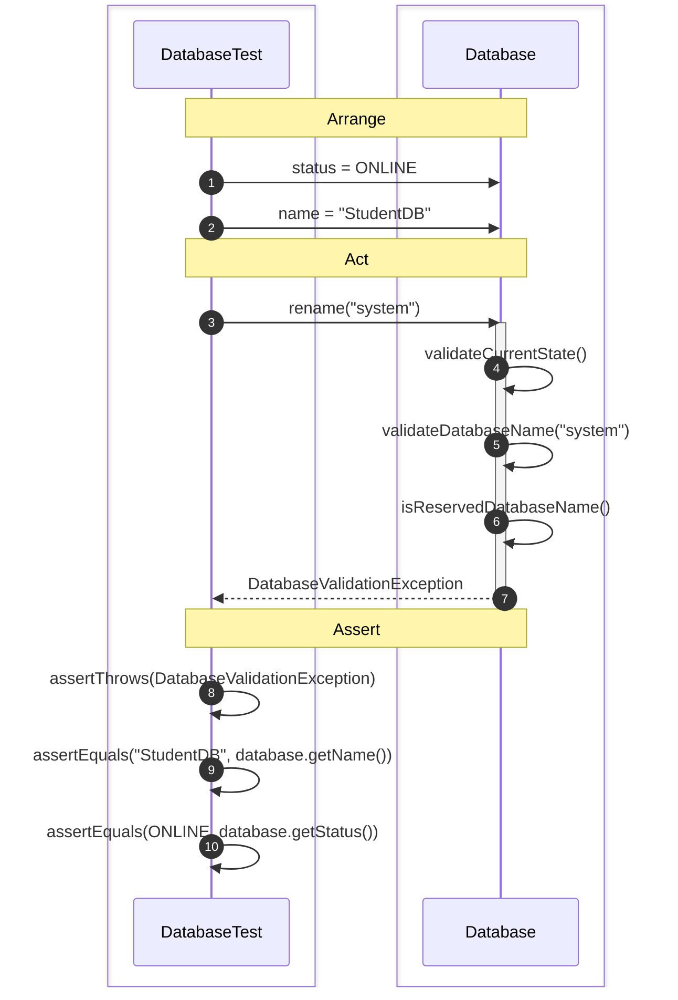
```mermaid
sequenceDiagram
    autonumber

    box #e1f5fe Test Suite
    participant Test as DatabaseTest
    end

    box #e8f5e9 Database Component
    participant D as Database
    end

    Note over Test,D: Arrange
    Test->>D: status = ONLINE
    Test->>D: name = "StudentDB"

    Note over Test,D: Act
    Test->>D: rename("system")

    activate D

    D->>D: validateCurrentState()
    D->>D: validateDatabaseName("system")
    D->>D: isReservedDatabaseName()

    D-->>Test: DatabaseValidationException
    deactivate D

    Note over Test,D: Assert
    Test->>Test: assertThrows(DatabaseValidationException)
    Test->>Test: assertEquals("StudentDB", database.getName())
    Test->>Test: assertEquals(ONLINE, database.getStatus())
```

### 17. shouldInitializeOfflineDatabase()
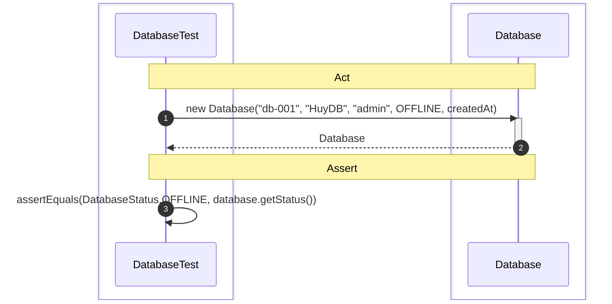
```mermaid
sequenceDiagram
    autonumber

    box #e1f5fe Test Suite
    participant Test as DatabaseTest
    end

    box #e8f5e9 Database Component
    participant D as Database
    end

    Note over Test,D: Act
    Test->>D: new Database("db-001", "HuyDB", "admin", OFFLINE, createdAt)
    activate D
    D-->>Test: Database
    deactivate D

    Note over Test,D: Assert
    Test->>Test: assertEquals(DatabaseStatus.OFFLINE, database.getStatus())
```

### 18. shouldMaintainStatusTransition()
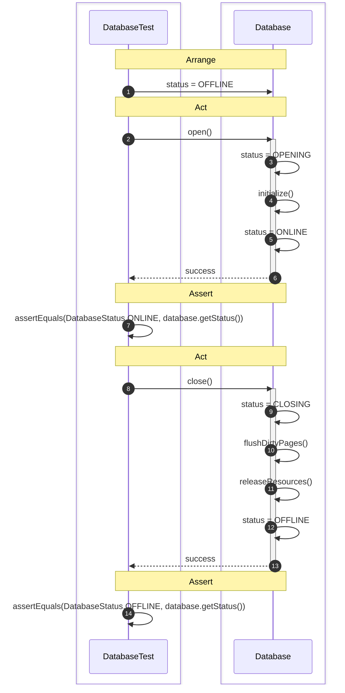
```mermaid
sequenceDiagram
    autonumber

    box #e1f5fe Test Suite
    participant Test as DatabaseTest
    end

    box #e8f5e9 Database Component
    participant D as Database
    end

    Note over Test,D: Arrange
    Test->>D: status = OFFLINE

    Note over Test,D: Act
    Test->>D: open()
    activate D
    D->>D: status = OPENING
    D->>D: initialize()
    D->>D: status = ONLINE
    D-->>Test: success
    deactivate D

    Note over Test,D: Assert
    Test->>Test: assertEquals(DatabaseStatus.ONLINE, database.getStatus())

    Note over Test,D: Act
    Test->>D: close()
    activate D
    D->>D: status = CLOSING
    D->>D: flushDirtyPages()
    D->>D: releaseResources()
    D->>D: status = OFFLINE
    D-->>Test: success
    deactivate D

    Note over Test,D: Assert
    Test->>Test: assertEquals(DatabaseStatus.OFFLINE, database.getStatus())
```

### 19. shouldKeepCreatedTimeUnchanged()
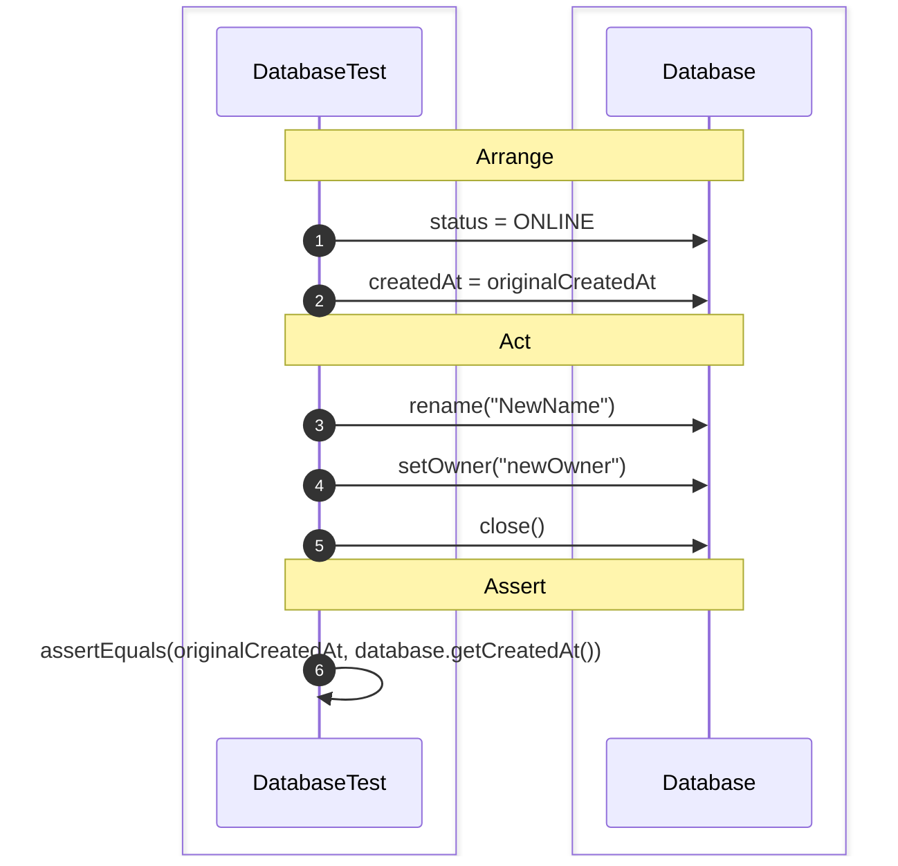
```mermaid
sequenceDiagram
    autonumber

    box #e1f5fe Test Suite
    participant Test as DatabaseTest
    end

    box #e8f5e9 Database Component
    participant D as Database
    end

    Note over Test,D: Arrange
    Test->>D: status = ONLINE
    Test->>D: createdAt = originalCreatedAt

    Note over Test,D: Act
    Test->>D: rename("NewName")
    Test->>D: setOwner("newOwner")
    Test->>D: close()

    Note over Test,D: Assert
    Test->>Test: assertEquals(originalCreatedAt, database.getCreatedAt())
```

### 20. shouldRejectNullDatabaseStatus()
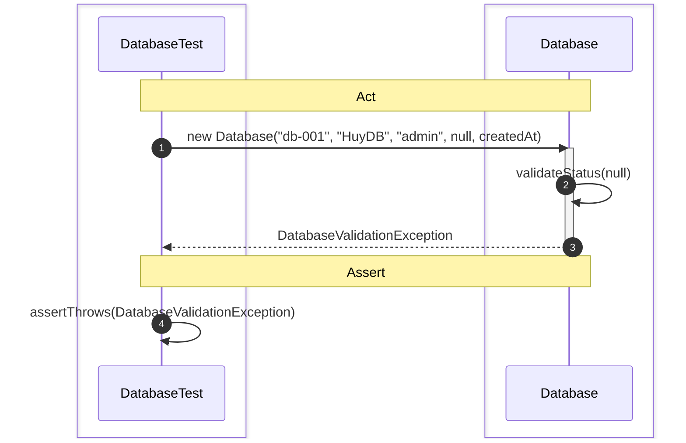
```mermaid
sequenceDiagram
    autonumber

    box #e1f5fe Test Suite
    participant Test as DatabaseTest
    end

    box #e8f5e9 Database Component
    participant D as Database
    end

    Note over Test,D: Act
    Test->>D: new Database("db-001", "HuyDB", "admin", null, createdAt)
    activate D
    D->>D: validateStatus(null)
    D-->>Test: DatabaseValidationException
    deactivate D

    Note over Test,D: Assert
    Test->>Test: assertThrows(DatabaseValidationException)
```

### 21. shouldRejectInvalidStatusTransition()
```mermaid
sequenceDiagram
    autonumber

    box #e1f5fe Test Suite
    participant Test as DatabaseTest
    end

    box #e8f5e9 Database Component
    participant D as Database
    end

    Note over Test,D: Arrange
    Test->>D: status = OPENING (in-progress transition)

    Note over Test,D: Act
    Test->>D: open()
    activate D
    D->>D: validateCurrentState()
    D-->>Test: IllegalStateException
    deactivate D

    Note over Test,D: Assert
    Test->>Test: assertThrows(IllegalStateException.class)
```

### 22. shouldCreateSchema()
```mermaid
sequenceDiagram
    autonumber

    box #e1f5fe Test Suite
    participant Test as DatabaseTest
    end

    box #e8f5e9 Database Component
    participant D as Database
    end

    box #fff3e0 Schema Component
    participant S as Schema
    end

    Note over Test,D: Arrange
    Test->>D: status = ONLINE

    Note over Test,D: Act
    Test->>D: createSchema("StudentSchema", "admin")
    activate D
    D->>D: validateCurrentState()
    D->>D: validateSchemaName("StudentSchema")
    
    D->>S: new Schema("schema-001", "StudentSchema", "admin")
    S-->>D: Schema
    
    D->>D: schemas.put("StudentSchema", Schema)
    D-->>Test: Schema
    deactivate D

    Note over Test,S: Assert
    Test->>Test: assertNotNull(schema)
    Test->>Test: assertEquals("StudentSchema", schema.getName())
    Test->>Test: assertEquals("admin", schema.getOwner())
```

### 23. shouldDropSchema()
```mermaid
sequenceDiagram
    autonumber

    box #e1f5fe Test Suite
    participant Test as DatabaseTest
    end

    box #e8f5e9 Database Component
    participant D as Database
    end

    Note over Test,D: Arrange
    Test->>D: status = ONLINE
    Test->>D: createSchema("StudentSchema", "admin")

    Note over Test,D: Act
    Test->>D: dropSchema("StudentSchema")
    activate D
    D->>D: validateCurrentState()
    D->>D: schemas.remove("StudentSchema")
    D-->>Test: void
    deactivate D

    Note over Test,D: Assert
    Test->>D: getSchema("StudentSchema")
    D-->>Test: null
    Test->>Test: assertNull(schema)
```

### 24. shouldRejectDuplicateSchemaName()
```mermaid
sequenceDiagram
    autonumber

    box #e1f5fe Test Suite
    participant Test as DatabaseTest
    end

    box #e8f5e9 Database Component
    participant D as Database
    end

    Note over Test,D: Arrange
    Test->>D: status = ONLINE
    Test->>D: createSchema("StudentSchema", "admin")

    Note over Test,D: Act
    Test->>D: createSchema("StudentSchema", "admin")
    activate D
    D->>D: validateCurrentState()
    D->>D: validateSchemaName("StudentSchema")
    D->>D: schemas.containsKey("StudentSchema")
    D-->>Test: SchemaValidationException
    deactivate D

    Note over Test,D: Assert
    Test->>Test: assertThrows(SchemaValidationException.class)
```

### 25. shouldRejectSchemaOperationWhenClosed()
```mermaid
sequenceDiagram
    autonumber

    box #e1f5fe Test Suite
    participant Test as DatabaseTest
    end

    box #e8f5e9 Database Component
    participant D as Database
    end

    Note over Test,D: Arrange
    Test->>D: status = OFFLINE

    Note over Test,D: Act
    Test->>D: createSchema("StudentSchema", "admin")
    activate D
    D->>D: validateCurrentState()
    D-->>Test: IllegalStateException
    deactivate D

    Note over Test,D: Assert
    Test->>Test: assertThrows(IllegalStateException.class)
```

### 26. shouldRejectSchemaNameWithSpecialCharacters()
```mermaid
sequenceDiagram
    autonumber

    box #e1f5fe Test Suite
    participant Test as DatabaseTest
    end

    box #e8f5e9 Database Component
    participant D as Database
    end

    Note over Test,D: Arrange
    Test->>D: status = ONLINE

    Note over Test,D: Act
    Test->>D: createSchema("Student@Schema", "admin")
    activate D
    D->>D: validateCurrentState()
    D->>D: validateSchemaName("Student@Schema")
    D-->>Test: SchemaValidationException
    deactivate D

    Note over Test,D: Assert
    Test->>Test: assertThrows(SchemaValidationException.class)
```

## SchemaTest

### 1. shouldCreateTable()
```mermaid
sequenceDiagram
    autonumber
    box #e1f5fe Test Suite
    participant Test as SchemaTest
    end
    box #e3f2fd Schema
    participant S as Schema
    end
    box #fff3e0 Factory
    participant F as DefaultDatabaseObjectFactory
    end
    box #e8f5e9 Domain
    participant T as Table
    end

    Note over Test,S: Arrange
    Test->>S: createTable(request)
    activate S
    S->>F: createTable(request)
    activate F
    F->>T: new Table(...)
    T-->>F: Table
    F-->>S: Table
    deactivate F
    S->>S: addObject(Table)
    S->>T: create()
    activate T
    T-->>S: void
    deactivate T
    S-->>Test: Table
    deactivate S

    Note over Test,S: Assert
    Test->>S: findObject("users")
    activate S
    S-->>Test: Table
    deactivate S
```

### 2. shouldDropTable()
```mermaid
sequenceDiagram
    autonumber
    box #e1f5fe Test Suite
    participant Test as SchemaTest
    end
    box #e3f2fd Schema
    participant S as Schema
    end
    box #e8f5e9 Domain
    participant T as Table
    end

    Note over Test,S: Arrange
    Test->>S: dropObject("tbl-001")
    activate S
    S->>S: findObjectById("tbl-001") -> Table
    S->>T: drop()
    activate T
    T-->>S: void
    deactivate T
    S->>S: removeObject("tbl-001")
    S-->>Test: void
    deactivate S

    Note over Test,S: Assert
    Test->>S: findObject("users")
    activate S
    S-->>Test: null
    deactivate S
```

### 3. shouldRenameTable()
```mermaid
sequenceDiagram
    autonumber
    box #e1f5fe Test Suite
    participant Test as SchemaTest
    end
    box #e8f5e9 Domain
    participant T as Table
    end

    Note over Test,T: Arrange
    Test->>T: rename("customers")
    activate T
    T->>T: validateName("customers")
    T-->>Test: void
    deactivate T

    Note over Test,T: Assert
    Test->>T: getName()
    activate T
    T-->>Test: "customers"
    deactivate T
```

### 4. shouldFindTableByName()
```mermaid
sequenceDiagram
    autonumber
    box #e1f5fe Test Suite
    participant Test as SchemaTest
    end
    box #e3f2fd Schema
    participant S as Schema
    end

    Note over Test,S: Act
    Test->>S: findObject("users")
    activate S
    S->>S: search objects list by name
    S-->>Test: Table
    deactivate S

    Note over Test,S: Assert
    Test->>Test: assertNotNull(table)
```

### 5. shouldListAllTables()
```mermaid
sequenceDiagram
    autonumber
    box #e1f5fe Test Suite
    participant Test as SchemaTest
    end
    box #e3f2fd Schema
    participant S as Schema
    end

    Note over Test,S: Act
    Test->>S: listObjects()
    activate S
    S-->>Test: List<DatabaseObject>
    deactivate S

    Note over Test,S: Assert
    Test->>Test: assertEquals(2, objects.size())
```

### 6. shouldRejectDuplicateTableName()
```mermaid
sequenceDiagram
    autonumber
    box #e1f5fe Test Suite
    participant Test as SchemaTest
    end
    box #e3f2fd Schema
    participant S as Schema
    end

    Note over Test,S: Act
    Test->>S: createTable(request)
    activate S
    S->>S: findObject("users") -> Table (exists)
    S-->>Test: DuplicateObjectException
    deactivate S

    Note over Test,S: Assert
    Test->>Test: assertThrows(DuplicateObjectException.class)
```

### 7. shouldRejectUnknownTable()
```mermaid
sequenceDiagram
    autonumber
    box #e1f5fe Test Suite
    participant Test as SchemaTest
    end
    box #e3f2fd Schema
    participant S as Schema
    end

    Note over Test,S: Act
    Test->>S: dropObject("unknown-tbl-id")
    activate S
    S->>S: findObjectById("unknown-tbl-id") -> null
    S-->>Test: ObjectNotFoundException
    deactivate S

    Note over Test,S: Assert
    Test->>Test: assertThrows(ObjectNotFoundException.class)
```

### 8. shouldCreateView()
```mermaid
sequenceDiagram
    autonumber
    box #e1f5fe Test Suite
    participant Test as SchemaTest
    end
    box #e3f2fd Schema
    participant S as Schema
    end
    box #fff3e0 Factory
    participant F as DefaultDatabaseObjectFactory
    end
    box #e8f5e9 Domain
    participant V as View
    end

    Note over Test,S: Arrange
    Test->>S: createView(request)
    activate S
    S->>F: createView(request)
    activate F
    F->>V: new View(...)
    V-->>F: View
    F-->>S: View
    deactivate F
    S->>S: addObject(View)
    S->>V: create()
    activate V
    V-->>S: void
    deactivate V
    S-->>Test: View
    deactivate S
```

### 9. shouldDropView()
```mermaid
sequenceDiagram
    autonumber
    box #e1f5fe Test Suite
    participant Test as SchemaTest
    end
    box #e3f2fd Schema
    participant S as Schema
    end
    box #e8f5e9 Domain
    participant V as View
    end

    Note over Test,S: Arrange
    Test->>S: dropObject("view-001")
    activate S
    S->>S: findObjectById("view-001") -> View
    S->>V: drop()
    activate V
    V-->>S: void
    deactivate V
    S->>S: removeObject("view-001")
    S-->>Test: void
    deactivate S
```

### 10. shouldCreateStoredProcedure()
```mermaid
sequenceDiagram
    autonumber
    box #e1f5fe Test Suite
    participant Test as SchemaTest
    end
    box #e3f2fd Schema
    participant S as Schema
    end
    box #fff3e0 Factory
    participant F as DefaultDatabaseObjectFactory
    end
    box #e8f5e9 Domain
    participant P as StoredProcedure
    end

    Note over Test,S: Arrange
    Test->>S: createProcedure(request)
    activate S
    S->>F: createProcedure(request)
    activate F
    F->>P: new StoredProcedure(...)
    P-->>F: StoredProcedure
    F-->>S: StoredProcedure
    deactivate F
    S->>S: addObject(StoredProcedure)
    S->>P: create()
    activate P
    P-->>S: void
    deactivate P
    S-->>Test: StoredProcedure
    deactivate S
```

### 11. shouldDropStoredProcedure()
```mermaid
sequenceDiagram
    autonumber
    box #e1f5fe Test Suite
    participant Test as SchemaTest
    end
    box #e3f2fd Schema
    participant S as Schema
    end
    box #e8f5e9 Domain
    participant P as StoredProcedure
    end

    Note over Test,S: Arrange
    Test->>S: dropObject("proc-001")
    activate S
    S->>S: findObjectById("proc-001") -> StoredProcedure
    S->>P: drop()
    activate P
    P-->>S: void
    deactivate P
    S->>S: removeObject("proc-001")
    S-->>Test: void
    deactivate S
```

### 12. shouldCreateSequence()
```mermaid
sequenceDiagram
    autonumber
    box #e1f5fe Test Suite
    participant Test as SchemaTest
    end
    box #e3f2fd Schema
    participant S as Schema
    end
    box #fff3e0 Factory
    participant F as DefaultDatabaseObjectFactory
    end
    box #e8f5e9 Domain
    participant Seq as Sequence
    end

    Note over Test,S: Arrange
    Test->>S: createSequence(request)
    activate S
    S->>F: createSequence(request)
    activate F
    F->>Seq: new Sequence(...)
    Seq-->>F: Sequence
    F-->>S: Sequence
    deactivate F
    S->>S: addObject(Sequence)
    S->>Seq: create()
    activate Seq
    Seq-->>S: void
    deactivate Seq
    S-->>Test: Sequence
    deactivate S
```

### 13. shouldDropSequence()
```mermaid
sequenceDiagram
    autonumber
    box #e1f5fe Test Suite
    participant Test as SchemaTest
    end
    box #e3f2fd Schema
    participant S as Schema
    end
    box #e8f5e9 Domain
    participant Seq as Sequence
    end

    Note over Test,S: Arrange
    Test->>S: dropObject("seq-001")
    activate S
    S->>S: findObjectById("seq-001") -> Sequence
    S->>Seq: drop()
    activate Seq
    Seq-->>S: void
    deactivate Seq
    S->>S: removeObject("seq-001")
    S-->>Test: void
    deactivate S
```

## TableTest

### 1. shouldInsertRow()
```mermaid
sequenceDiagram
    autonumber
    box #e1f5fe Test Suite
    participant Test as TableTest
    end
    box #e8f5e9 Table Component
    participant T as Table
    end
    box #fff3e0 Row Component
    participant R as Row
    end

    Note over Test,T: Arrange
    Test->>R: new Row("row-001", ["John", 30])
    R-->>Test: Row

    Note over Test,T: Act
    Test->>T: insert(Row)
    activate T
    T->>T: validateConstraints(Row)
    T->>T: rows.put("row-001", Row)
    T->>T: rowCount = 1
    T-->>Test: void
    deactivate T

    Note over Test,T: Assert
    Test->>T: getRowCount()
    activate T
    T-->>Test: 1
    deactivate T
```

### 2. shouldUpdateRow()
```mermaid
sequenceDiagram
    autonumber
    box #e1f5fe Test Suite
    participant Test as TableTest
    end
    box #e8f5e9 Table Component
    participant T as Table
    end
    box #fff3e0 Row Component
    participant R as Row
    end

    Note over Test,T: Arrange
    Test->>T: insert(OriginalRow)
    Test->>R: new Row("row-001", ["John", 31])
    R-->>Test: NewRow

    Note over Test,T: Act
    Test->>T: update("row-001", NewRow)
    activate T
    T->>T: validateConstraints(NewRow)
    T->>T: rows.put("row-001", NewRow)
    T-->>Test: void
    deactivate T

    Note over Test,T: Assert
    Test->>T: findRowById("row-001")
    activate T
    T-->>Test: NewRow
    deactivate T
```

### 3. shouldDeleteRow()
```mermaid
sequenceDiagram
    autonumber
    box #e1f5fe Test Suite
    participant Test as TableTest
    end
    box #e8f5e9 Table Component
    participant T as Table
    end

    Note over Test,T: Arrange
    Test->>T: insert(Row)

    Note over Test,T: Act
    Test->>T: delete("row-001")
    activate T
    T->>T: rows.remove("row-001")
    T->>T: rowCount = 0
    T-->>Test: void
    deactivate T

    Note over Test,T: Assert
    Test->>T: findRowById("row-001")
    activate T
    T-->>Test: null
    deactivate T
```

### 4. shouldTruncateTable()
```mermaid
sequenceDiagram
    autonumber
    box #e1f5fe Test Suite
    participant Test as TableTest
    end
    box #e8f5e9 Table Component
    participant T as Table
    end

    Note over Test,T: Arrange
    Test->>T: insert(Row1)
    Test->>T: insert(Row2)

    Note over Test,T: Act
    Test->>T: truncate()
    activate T
    T->>T: rows.clear()
    T->>T: rowCount = 0
    T-->>Test: void
    deactivate T

    Note over Test,T: Assert
    Test->>T: getRowCount()
    activate T
    T-->>Test: 0
    deactivate T
```

### 5. shouldFindRowById()
```mermaid
sequenceDiagram
    autonumber
    box #e1f5fe Test Suite
    participant Test as TableTest
    end
    box #e8f5e9 Table Component
    participant T as Table
    end

    Note over Test,T: Arrange
    Test->>T: insert(Row)

    Note over Test,T: Act
    Test->>T: findRowById("row-001")
    activate T
    T->>T: rows.get("row-001")
    T-->>Test: Row
    deactivate T

    Note over Test,T: Assert
    Test->>Test: assertNotNull(row)
```

### 6. shouldListAllRows()
```mermaid
sequenceDiagram
    autonumber
    box #e1f5fe Test Suite
    participant Test as TableTest
    end
    box #e8f5e9 Table Component
    participant T as Table
    end

    Note over Test,T: Arrange
    Test->>T: insert(Row1)
    Test->>T: insert(Row2)

    Note over Test,T: Act
    Test->>T: listAllRows()
    activate T
    T->>T: rows.values()
    T-->>Test: List<Row>
    deactivate T

    Note over Test,T: Assert
    Test->>Test: assertEquals(2, rows.size())
```

### 7. shouldRejectDuplicateRow()
```mermaid
sequenceDiagram
    autonumber
    box #e1f5fe Test Suite
    participant Test as TableTest
    end
    box #e8f5e9 Table Component
    participant T as Table
    end

    Note over Test,T: Arrange
    Test->>T: insert(Row)

    Note over Test,T: Act
    Test->>T: insert(DuplicateRow)
    activate T
    T->>T: validateConstraints(DuplicateRow) -> duplicate primary key
    T-->>Test: ConstraintViolationException
    deactivate T

    Note over Test,T: Assert
    Test->>Test: assertThrows(ConstraintViolationException.class)
```

### 8. shouldRejectUnknownRow()
```mermaid
sequenceDiagram
    autonumber
    box #e1f5fe Test Suite
    participant Test as TableTest
    end
    box #e8f5e9 Table Component
    participant T as Table
    end

    Note over Test,T: Act
    Test->>T: update("unknown-row-id", Row)
    activate T
    T->>T: rows.containsKey("unknown-row-id") -> false
    T-->>Test: RowNotFoundException
    deactivate T

    Note over Test,T: Assert
    Test->>Test: assertThrows(RowNotFoundException.class)
```

## ColumnTest

### 1. shouldCreateColumn()
```mermaid
sequenceDiagram
    autonumber
    box #e1f5fe Test Suite
    participant Test as ColumnTest
    end
    box #e8f5e9 Column Component
    participant C as Column
    end

    Test->>C: shouldCreateColumn()
    C-->>Test: success
```

### 2. shouldValidateColumnDefinition()
```mermaid
sequenceDiagram
    autonumber
    box #e1f5fe Test Suite
    participant Test as ColumnTest
    end
    box #e8f5e9 Column Component
    participant C as Column
    end

    Test->>C: shouldValidateColumnDefinition()
    C-->>Test: success
```

### 3. shouldRejectInvalidDataType()
```mermaid
sequenceDiagram
    autonumber
    box #e1f5fe Test Suite
    participant Test as ColumnTest
    end
    box #e8f5e9 Column Component
    participant C as Column
    end

    Test->>C: shouldRejectInvalidDataType()
    C-->>Test: success
```

### 4. shouldRejectInvalidLength()
```mermaid
sequenceDiagram
    autonumber
    box #e1f5fe Test Suite
    participant Test as ColumnTest
    end
    box #e8f5e9 Column Component
    participant C as Column
    end

    Test->>C: shouldRejectInvalidLength()
    C-->>Test: success
```

### 5. shouldAcceptNullableColumn()
```mermaid
sequenceDiagram
    autonumber
    box #e1f5fe Test Suite
    participant Test as ColumnTest
    end
    box #e8f5e9 Column Component
    participant C as Column
    end

    Test->>C: shouldAcceptNullableColumn()
    C-->>Test: success
```

### 6. shouldRejectNullForNotNullColumn()
```mermaid
sequenceDiagram
    autonumber
    box #e1f5fe Test Suite
    participant Test as ColumnTest
    end
    box #e8f5e9 Column Component
    participant C as Column
    end

    Test->>C: shouldRejectNullForNotNullColumn()
    C-->>Test: success
```

### 7. shouldUpdateColumnMetadata()
```mermaid
sequenceDiagram
    autonumber
    box #e1f5fe Test Suite
    participant Test as ColumnTest
    end
    box #e8f5e9 Column Component
    participant C as Column
    end

    Test->>C: shouldUpdateColumnMetadata()
    C-->>Test: success
```

### 8. shouldChangeDefaultValue()
```mermaid
sequenceDiagram
    autonumber
    box #e1f5fe Test Suite
    participant Test as ColumnTest
    end
    box #e8f5e9 Column Component
    participant C as Column
    end

    Test->>C: shouldChangeDefaultValue()
    C-->>Test: success
```

## RowTest

### 1. shouldCreateRow()
```mermaid
sequenceDiagram
    autonumber
    box #e1f5fe Test Suite
    participant Test as RowTest
    end
    box #e8f5e9 Row Component
    participant R as Row
    end

    Test->>R: shouldCreateRow()
    R-->>Test: success
```

### 2. shouldUpdateRow()
```mermaid
sequenceDiagram
    autonumber
    box #e1f5fe Test Suite
    participant Test as RowTest
    end
    box #e8f5e9 Row Component
    participant R as Row
    end

    Test->>R: shouldUpdateRow()
    R-->>Test: success
```

### 3. shouldMarkRowDeleted()
```mermaid
sequenceDiagram
    autonumber
    box #e1f5fe Test Suite
    participant Test as RowTest
    end
    box #e8f5e9 Row Component
    participant R as Row
    end

    Test->>R: shouldMarkRowDeleted()
    R-->>Test: success
```

### 4. shouldReadRow()
```mermaid
sequenceDiagram
    autonumber
    box #e1f5fe Test Suite
    participant Test as RowTest
    end
    box #e8f5e9 Row Component
    participant R as Row
    end

    Test->>R: shouldReadRow()
    R-->>Test: success
```

### 5. shouldCloneRowVersion()
```mermaid
sequenceDiagram
    autonumber
    box #e1f5fe Test Suite
    participant Test as RowTest
    end
    box #e8f5e9 Row Component
    participant R as Row
    end

    Test->>R: shouldCloneRowVersion()
    R-->>Test: success
```

### 6. shouldUpdateRowVersion()
```mermaid
sequenceDiagram
    autonumber
    box #e1f5fe Test Suite
    participant Test as RowTest
    end
    box #e8f5e9 Row Component
    participant R as Row
    end

    Test->>R: shouldUpdateRowVersion()
    R-->>Test: success
```

### 7. shouldStoreTransactionId()
```mermaid
sequenceDiagram
    autonumber
    box #e1f5fe Test Suite
    participant Test as RowTest
    end
    box #e8f5e9 Row Component
    participant R as Row
    end

    Test->>R: shouldStoreTransactionId()
    R-->>Test: success
```

### 8. shouldReturnColumnValue()
```mermaid
sequenceDiagram
    autonumber
    box #e1f5fe Test Suite
    participant Test as RowTest
    end
    box #e8f5e9 Row Component
    participant R as Row
    end

    Test->>R: shouldReturnColumnValue()
    R-->>Test: success
```

### 9. shouldReplaceColumnValue()
```mermaid
sequenceDiagram
    autonumber
    box #e1f5fe Test Suite
    participant Test as RowTest
    end
    box #e8f5e9 Row Component
    participant R as Row
    end

    Test->>R: shouldReplaceColumnValue()
    R-->>Test: success
```

### 10. shouldMarkRowDeleted()
```mermaid
sequenceDiagram
    autonumber
    box #e1f5fe Test Suite
    participant Test as RowTest
    end
    box #e8f5e9 Row Component
    participant R as Row
    end

    Test->>R: shouldMarkRowDeleted()
    R-->>Test: success
```

## ConstraintTest

### 1. shouldValidatePrimaryKey()
```mermaid
sequenceDiagram
    autonumber

    box #e1f5fe Test Suite
    participant Test as ConstraintTest
    end

    box #fff3e0 Factory
    participant F as DefaultConstraintFactory
    end

    box #e8f5e9 Strategy
    participant PK as PrimaryKey
    end

    box #fff3e0 Table
    participant T as Table
    end

    box #fff8e1 Row
    participant R as Row
    end

    Note over Test,R: Arrange
    Test->>F: createPrimaryKey(request)
    activate F
    F->>PK: new PrimaryKey(...)
    PK-->>F: PrimaryKey
    deactivate F
    F-->>Test: PrimaryKey

    Test->>R: create Row

    Note over Test,R: Act
    Test->>PK: validate(row,table)
    activate PK
    PK->>R: getColumnValue("id")
    R-->>PK: value
    PK->>T: existsPrimaryKey(value)
    T-->>PK: false
    PK-->>Test: success
    deactivate PK

    Note over Test,R: Assert
    Test->>Test: assertDoesNotThrow()
```

### 2. shouldRejectDuplicatePrimaryKey()
```mermaid
sequenceDiagram
    autonumber

    box #e1f5fe Test Suite
    participant Test as ConstraintTest
    end

    box #fff3e0 Factory
    participant F as DefaultConstraintFactory
    end

    box #e8f5e9 Strategy
    participant PK as PrimaryKey
    end

    box #fff8e1 Table
    participant T as Table
    end

    box #f3e5f5 Row
    participant R as Row
    end

    Note over Test,R: Arrange
    Test->>F: createPrimaryKey(request)
    activate F
    F->>PK: new PrimaryKey(...)
    PK-->>F: PrimaryKey
    deactivate F
    F-->>Test: PrimaryKey

    Test->>R: create Row(id="row-001")

    Note over Test,PK: Act
    Test->>PK: validate(row, table)
    activate PK
    PK->>R: getColumnValue("id")
    R-->>PK: "row-001"
    PK->>T: existsPrimaryKey("row-001")
    T-->>PK: true
    PK--x Test: DuplicatePrimaryKeyException
    deactivate PK

    Note over Test,R: Assert
    Test->>Test: assertThrows(...)
```

### 3. shouldValidateForeignKey()
```mermaid
sequenceDiagram
    autonumber

    box #e1f5fe Test Suite
    participant Test as ConstraintTest
    end

    box #fff3e0 Factory
    participant F as DefaultConstraintFactory
    end

    box #e8f5e9 Strategy
    participant FK as ForeignKey
    end

    box #fff8e1 ParentTable
    participant PT as ParentTable
    end

    box #f3e5f5 Row
    participant R as ChildRow
    end

    Note over Test,R: Arrange
    Test->>F: createForeignKey(request)
    activate F
    F->>FK: new ForeignKey(...)
    FK-->>F: ForeignKey
    deactivate F
    F-->>Test: ForeignKey

    Test->>R: create ChildRow

    Note over Test,FK: Act
    Test->>FK: validate(row,parentTable)
    activate FK
    FK->>R: getColumnValue("user_id")
    R-->>FK: "parent-001"
    FK->>PT: existsRow("parent-001")
    PT-->>FK: true
    FK-->>Test: validation succeeds
    deactivate FK

    Note over Test,R: Assert
    Test->>Test: assertDoesNotThrow()
```

### 4. shouldRejectBrokenForeignKey()
```mermaid
sequenceDiagram
    autonumber

    box #e1f5fe Test Suite
    participant Test as ConstraintTest
    end

    box #fff3e0 Factory
    participant F as DefaultConstraintFactory
    end

    box #e8f5e9 Strategy
    participant FK as ForeignKey
    end

    box #fff8e1 ParentTable
    participant PT as ParentTable
    end

    box #f3e5f5 Row
    participant R as ChildRow
    end

    Note over Test,R: Arrange
    Test->>F: createForeignKey(request)
    activate F
    F->>FK: new ForeignKey(...)
    FK-->>F: ForeignKey
    deactivate F
    F-->>Test: ForeignKey

    Test->>R: create ChildRow

    Note over Test,FK: Act
    Test->>FK: validate(row,parentTable)
    activate FK
    FK->>R: getColumnValue("user_id")
    R-->>FK: "unknown-parent"
    FK->>PT: existsRow("unknown-parent")
    PT-->>FK: false
    FK--x Test: ForeignKeyViolationException
    deactivate FK

    Note over Test,R: Assert
    Test->>Test: assertThrows(...)
```

### 5. shouldValidateUniqueConstraint()
```mermaid
sequenceDiagram
    autonumber

    box #e1f5fe Test Suite
    participant Test as ConstraintTest
    end

    box #fff3e0 Factory
    participant F as DefaultConstraintFactory
    end

    box #e8f5e9 Strategy
    participant UQ as UniqueConstraint
    end

    box #fff8e1 Table
    participant T as Table
    end

    box #f3e5f5 Row
    participant R as Row
    end

    Note over Test,R: Arrange
    Test->>F: createUnique(request)
    activate F
    F->>UQ: new UniqueConstraint(...)
    UQ-->>F: UniqueConstraint
    deactivate F
    F-->>Test: UniqueConstraint

    Test->>R: create Row

    Note over Test,UQ: Act
    Test->>UQ: validate(row,table)
    activate UQ
    UQ->>R: getColumnValue("email")
    R-->>UQ: "test@dbms.com"
    UQ->>T: existsUniqueValue("email","test@dbms.com")
    T-->>UQ: false
    UQ-->>Test: validation succeeds
    deactivate UQ

    Note over Test,R: Assert
    Test->>Test: assertDoesNotThrow()
```

### 6. shouldRejectDuplicateUniqueValue()
```mermaid
sequenceDiagram
    autonumber

    box #e1f5fe Test Suite
    participant Test as ConstraintTest
    end

    box #fff3e0 Factory
    participant F as DefaultConstraintFactory
    end

    box #e8f5e9 Strategy
    participant UQ as UniqueConstraint
    end

    box #fff8e1 Table
    participant T as Table
    end

    box #f3e5f5 Row
    participant R as Row
    end

    Note over Test,R: Arrange
    Test->>F: createUnique(request)
    activate F
    F->>UQ: new UniqueConstraint(...)
    UQ-->>F: UniqueConstraint
    deactivate F
    F-->>Test: UniqueConstraint

    Test->>R: create Row

    Note over Test,UQ: Act
    Test->>UQ: validate(row,table)
    activate UQ
    UQ->>R: getColumnValue("email")
    R-->>UQ: "test@dbms.com"
    UQ->>T: existsUniqueValue("email","test@dbms.com")
    T-->>UQ: true
    UQ--x Test: DuplicateUniqueValueException
    deactivate UQ

    Note over Test,R: Assert
    Test->>Test: assertThrows(...)
```

### 7. shouldValidateCheckConstraint()
```mermaid
sequenceDiagram
    autonumber

    box #e1f5fe Test Suite
    participant Test as ConstraintTest
    end

    box #fff3e0 Factory
    participant F as DefaultConstraintFactory
    end

    box #e8f5e9 Strategy
    participant CK as CheckConstraint
    end

    box #f3e5f5 Row
    participant R as Row
    end

    Note over Test,R: Arrange
    Test->>F: createCheck(request)
    activate F
    F->>CK: new CheckConstraint(...)
    CK-->>F: CheckConstraint
    deactivate F
    F-->>Test: CheckConstraint

    Test->>R: create Row(age=20)

    Note over Test,CK: Act
    Test->>CK: validate(row,null)
    activate CK
    CK->>R: getColumnValue("age")
    R-->>CK: 20
    CK->>CK: evaluateExpression()
    CK-->>Test: validation succeeds
    deactivate CK

    Note over Test,R: Assert
    Test->>Test: assertDoesNotThrow()
```

### 8. shouldRejectInvalidCheckConstraint()
```mermaid
sequenceDiagram
    autonumber

    box #e1f5fe Test Suite
    participant Test as ConstraintTest
    end

    box #fff3e0 Factory
    participant F as DefaultConstraintFactory
    end

    box #e8f5e9 Strategy
    participant CK as CheckConstraint
    end

    box #f3e5f5 Row
    participant R as Row
    end

    Note over Test,R: Arrange
    Test->>F: createCheck(request)
    activate F
    F->>CK: new CheckConstraint(...)
    CK-->>F: CheckConstraint
    deactivate F
    F-->>Test: CheckConstraint

    Test->>R: create Row(age=15)

    Note over Test,CK: Act
    Test->>CK: validate(row,null)
    activate CK
    CK->>R: getColumnValue("age")
    R-->>CK: 15
    CK->>CK: evaluateExpression()
    CK--x Test: CheckConstraintViolationException
    deactivate CK

    Note over Test,R: Assert
    Test->>Test: assertThrows(...)
```

## BTreeIndexTest

### 1. shouldInsertKey()
```mermaid
sequenceDiagram
    autonumber
    box #e1f5fe Test Suite
    participant Test as BTreeIndexTest
    end
    box #e8f5e9 BTreeIndex Component
    participant BTI as BTreeIndex
    end

    Test->>BTI: shouldInsertKey()
    BTI-->>Test: success
```

### 2. shouldSearchKey()
```mermaid
sequenceDiagram
    autonumber
    box #e1f5fe Test Suite
    participant Test as BTreeIndexTest
    end
    box #e8f5e9 BTreeIndex Component
    participant BTI as BTreeIndex
    end

    Test->>BTI: shouldSearchKey()
    BTI-->>Test: success
```

### 3. shouldDeleteKey()
```mermaid
sequenceDiagram
    autonumber
    box #e1f5fe Test Suite
    participant Test as BTreeIndexTest
    end
    box #e8f5e9 BTreeIndex Component
    participant BTI as BTreeIndex
    end

    Test->>BTI: shouldDeleteKey()
    BTI-->>Test: success
```

### 4. shouldUpdateKey()
```mermaid
sequenceDiagram
    autonumber
    box #e1f5fe Test Suite
    participant Test as BTreeIndexTest
    end
    box #e8f5e9 BTreeIndex Component
    participant BTI as BTreeIndex
    end

    Test->>BTI: shouldUpdateKey()
    BTI-->>Test: success
```

### 5. shouldHandleDuplicateKey()
```mermaid
sequenceDiagram
    autonumber
    box #e1f5fe Test Suite
    participant Test as BTreeIndexTest
    end
    box #e8f5e9 BTreeIndex Component
    participant BTI as BTreeIndex
    end

    Test->>BTI: shouldHandleDuplicateKey()
    BTI-->>Test: success
```

### 6. shouldRebuildIndex()
```mermaid
sequenceDiagram
    autonumber
    box #e1f5fe Test Suite
    participant Test as BTreeIndexTest
    end
    box #e8f5e9 BTreeIndex Component
    participant BTI as BTreeIndex
    end

    Test->>BTI: shouldRebuildIndex()
    BTI-->>Test: success
```

## HashIndexTest

### 1. shouldInsertKey()
```mermaid
sequenceDiagram
    autonumber
    box #e1f5fe Test Suite
    participant Test as HashIndexTest
    end
    box #e8f5e9 HashIndex Component
    participant HI as HashIndex
    end

    Test->>HI: shouldInsertKey()
    HI-->>Test: success
```

### 2. shouldSearchKey()
```mermaid
sequenceDiagram
    autonumber
    box #e1f5fe Test Suite
    participant Test as HashIndexTest
    end
    box #e8f5e9 HashIndex Component
    participant HI as HashIndex
    end

    Test->>HI: shouldSearchKey()
    HI-->>Test: success
```

### 3. shouldDeleteKey()
```mermaid
sequenceDiagram
    autonumber
    box #e1f5fe Test Suite
    participant Test as HashIndexTest
    end
    box #e8f5e9 HashIndex Component
    participant HI as HashIndex
    end

    Test->>HI: shouldDeleteKey()
    HI-->>Test: success
```

## BitmapIndexTest

### 1. shouldSearchBitmap()
```mermaid
sequenceDiagram
    autonumber
    box #e1f5fe Test Suite
    participant Test as BitmapIndexTest
    end
    box #e8f5e9 BitmapIndex Component
    participant BI as BitmapIndex
    end

    Test->>BI: shouldSearchBitmap()
    BI-->>Test: success
```

### 2. shouldUpdateBitmap()
```mermaid
sequenceDiagram
    autonumber
    box #e1f5fe Test Suite
    participant Test as BitmapIndexTest
    end
    box #e8f5e9 BitmapIndex Component
    participant BI as BitmapIndex
    end

    Test->>BI: shouldUpdateBitmap()
    BI-->>Test: success
```

## PartitionTest

### 1. shouldPartitionTable()
```mermaid
sequenceDiagram
    autonumber
    box #e1f5fe Test Suite
    participant Test as PartitionTest
    end
    box #e8f5e9 Partition Component
    participant P as Partition
    end

    Test->>P: shouldPartitionTable()
    P-->>Test: success
```

### 2. shouldDropPartition()
```mermaid
sequenceDiagram
    autonumber
    box #e1f5fe Test Suite
    participant Test as PartitionTest
    end
    box #e8f5e9 Partition Component
    participant P as Partition
    end

    Test->>P: shouldDropPartition()
    P-->>Test: success
```

### 3. shouldLocatePartition()
```mermaid
sequenceDiagram
    autonumber
    box #e1f5fe Test Suite
    participant Test as PartitionTest
    end
    box #e8f5e9 Partition Component
    participant P as Partition
    end

    Test->>P: shouldLocatePartition()
    P-->>Test: success
```

### 4. shouldSplitPartition()
```mermaid
sequenceDiagram
    autonumber
    box #e1f5fe Test Suite
    participant Test as PartitionTest
    end
    box #e8f5e9 Partition Component
    participant P as Partition
    end

    Test->>P: shouldSplitPartition()
    P-->>Test: success
```

### 5. shouldMergePartition()
```mermaid
sequenceDiagram
    autonumber
    box #e1f5fe Test Suite
    participant Test as PartitionTest
    end
    box #e8f5e9 Partition Component
    participant P as Partition
    end

    Test->>P: shouldMergePartition()
    P-->>Test: success
```

### 6. shouldMoveRowBetweenPartitions()
```mermaid
sequenceDiagram
    autonumber
    box #e1f5fe Test Suite
    participant Test as PartitionTest
    end
    box #e8f5e9 Partition Component
    participant P as Partition
    end

    Test->>P: shouldMoveRowBetweenPartitions()
    P-->>Test: success
```

## ViewTest

### 1. shouldCreateView()
```mermaid
sequenceDiagram
    autonumber
    box #e1f5fe Test Suite
    participant Test as ViewTest
    end
    box #e8f5e9 View Component
    participant V as View
    end

    Test->>V: shouldCreateView()
    V-->>Test: success
```

### 2. shouldValidateViewDefinition()
```mermaid
sequenceDiagram
    autonumber
    box #e1f5fe Test Suite
    participant Test as ViewTest
    end
    box #e8f5e9 View Component
    participant V as View
    end

    Test->>V: shouldValidateViewDefinition()
    V-->>Test: success
```

### 3. shouldExecuteViewQuery()
```mermaid
sequenceDiagram
    autonumber
    box #e1f5fe Test Suite
    participant Test as ViewTest
    end
    box #e8f5e9 View Component
    participant V as View
    end

    Test->>V: shouldExecuteViewQuery()
    V-->>Test: success
```

### 4. shouldRefreshViewDefinition()
```mermaid
sequenceDiagram
    autonumber
    box #e1f5fe Test Suite
    participant Test as ViewTest
    end
    box #e8f5e9 View Component
    participant V as View
    end

    Test->>V: shouldRefreshViewDefinition()
    V-->>Test: success
```

### 5. shouldRejectInvalidViewDefinition()
```mermaid
sequenceDiagram
    autonumber
    box #e1f5fe Test Suite
    participant Test as ViewTest
    end
    box #e8f5e9 View Component
    participant V as View
    end

    Test->>V: shouldRejectInvalidViewDefinition()
    V-->>Test: success
```

### 6. shouldReturnViewResult()
```mermaid
sequenceDiagram
    autonumber
    box #e1f5fe Test Suite
    participant Test as ViewTest
    end
    box #e8f5e9 View Component
    participant V as View
    end

    Test->>V: shouldReturnViewResult()
    V-->>Test: success
```

## StoredProcedureTest

### 1. shouldCreateProcedure()
```mermaid
sequenceDiagram
    autonumber
    box #e1f5fe Test Suite
    participant Test as StoredProcedureTest
    end
    box #e8f5e9 StoredProcedure Component
    participant SP as StoredProcedure
    end

    Test->>SP: shouldCreateProcedure()
    SP-->>Test: success
```

### 2. shouldExecuteProcedure()
```mermaid
sequenceDiagram
    autonumber
    box #e1f5fe Test Suite
    participant Test as StoredProcedureTest
    end
    box #e8f5e9 StoredProcedure Component
    participant SP as StoredProcedure
    end

    Test->>SP: shouldExecuteProcedure()
    SP-->>Test: success
```

### 3. shouldPassProcedureParameters()
```mermaid
sequenceDiagram
    autonumber
    box #e1f5fe Test Suite
    participant Test as StoredProcedureTest
    end
    box #e8f5e9 StoredProcedure Component
    participant SP as StoredProcedure
    end

    Test->>SP: shouldPassProcedureParameters()
    SP-->>Test: success
```

### 4. shouldReturnProcedureResult()
```mermaid
sequenceDiagram
    autonumber
    box #e1f5fe Test Suite
    participant Test as StoredProcedureTest
    end
    box #e8f5e9 StoredProcedure Component
    participant SP as StoredProcedure
    end

    Test->>SP: shouldReturnProcedureResult()
    SP-->>Test: success
```

### 5. shouldHandleProcedureException()
```mermaid
sequenceDiagram
    autonumber
    box #e1f5fe Test Suite
    participant Test as StoredProcedureTest
    end
    box #e8f5e9 StoredProcedure Component
    participant SP as StoredProcedure
    end

    Test->>SP: shouldHandleProcedureException()
    SP-->>Test: success
```

## TriggerTest

### 1. shouldCreateTrigger()
```mermaid
sequenceDiagram
    autonumber
    box #e1f5fe Test Suite
    participant Test as TriggerTest
    end
    box #e8f5e9 Trigger Component
    participant T as Trigger
    end

    Test->>T: shouldCreateTrigger()
    T-->>Test: success
```

### 2. shouldFireTrigger()
```mermaid
sequenceDiagram
    autonumber
    box #e1f5fe Test Suite
    participant Test as TriggerTest
    end
    box #e8f5e9 Trigger Component
    participant T as Trigger
    end

    Test->>T: shouldFireTrigger()
    T-->>Test: success
```

### 3. shouldExecuteBeforeInsertTrigger()
```mermaid
sequenceDiagram
    autonumber
    box #e1f5fe Test Suite
    participant Test as TriggerTest
    end
    box #e8f5e9 Trigger Component
    participant T as Trigger
    end

    Test->>T: shouldExecuteBeforeInsertTrigger()
    T-->>Test: success
```

### 4. shouldExecuteAfterInsertTrigger()
```mermaid
sequenceDiagram
    autonumber
    box #e1f5fe Test Suite
    participant Test as TriggerTest
    end
    box #e8f5e9 Trigger Component
    participant T as Trigger
    end

    Test->>T: shouldExecuteAfterInsertTrigger()
    T-->>Test: success
```

### 5. shouldExecuteBeforeUpdateTrigger()
```mermaid
sequenceDiagram
    autonumber
    box #e1f5fe Test Suite
    participant Test as TriggerTest
    end
    box #e8f5e9 Trigger Component
    participant T as Trigger
    end

    Test->>T: shouldExecuteBeforeUpdateTrigger()
    T-->>Test: success
```

### 6. shouldExecuteAfterUpdateTrigger()
```mermaid
sequenceDiagram
    autonumber
    box #e1f5fe Test Suite
    participant Test as TriggerTest
    end
    box #e8f5e9 Trigger Component
    participant T as Trigger
    end

    Test->>T: shouldExecuteAfterUpdateTrigger()
    T-->>Test: success
```

### 7. shouldExecuteBeforeDeleteTrigger()
```mermaid
sequenceDiagram
    autonumber
    box #e1f5fe Test Suite
    participant Test as TriggerTest
    end
    box #e8f5e9 Trigger Component
    participant T as Trigger
    end

    Test->>T: shouldExecuteBeforeDeleteTrigger()
    T-->>Test: success
```

### 8. shouldExecuteAfterDeleteTrigger()
```mermaid
sequenceDiagram
    autonumber
    box #e1f5fe Test Suite
    participant Test as TriggerTest
    end
    box #e8f5e9 Trigger Component
    participant T as Trigger
    end

    Test->>T: shouldExecuteAfterDeleteTrigger()
    T-->>Test: success
```

### 9. shouldCancelOperationWhenTriggerFails()
```mermaid
sequenceDiagram
    autonumber
    box #e1f5fe Test Suite
    participant Test as TriggerTest
    end
    box #e8f5e9 Trigger Component
    participant T as Trigger
    end

    Test->>T: shouldCancelOperationWhenTriggerFails()
    T-->>Test: success
```

## SequenceTest

### 1. shouldCreateSequence()
```mermaid
sequenceDiagram
    autonumber
    box #e1f5fe Test Suite
    participant Test as SequenceTest
    end
    box #e8f5e9 Sequence Component
    participant S as Sequence
    end

    Test->>S: shouldCreateSequence()
    S-->>Test: success
```

### 2. shouldGenerateNextValue()
```mermaid
sequenceDiagram
    autonumber
    box #e1f5fe Test Suite
    participant Test as SequenceTest
    end
    box #e8f5e9 Sequence Component
    participant S as Sequence
    end

    Test->>S: shouldGenerateNextValue()
    S-->>Test: success
```

### 3. shouldIncrementSequence()
```mermaid
sequenceDiagram
    autonumber
    box #e1f5fe Test Suite
    participant Test as SequenceTest
    end
    box #e8f5e9 Sequence Component
    participant S as Sequence
    end

    Test->>S: shouldIncrementSequence()
    S-->>Test: success
```

### 4. shouldResetSequence()
```mermaid
sequenceDiagram
    autonumber
    box #e1f5fe Test Suite
    participant Test as SequenceTest
    end
    box #e8f5e9 Sequence Component
    participant S as Sequence
    end

    Test->>S: shouldResetSequence()
    S-->>Test: success
```

### 5. shouldRespectStartValue()
```mermaid
sequenceDiagram
    autonumber
    box #e1f5fe Test Suite
    participant Test as SequenceTest
    end
    box #e8f5e9 Sequence Component
    participant S as Sequence
    end

    Test->>S: shouldRespectStartValue()
    S-->>Test: success
```

### 6. shouldReturnCurrentValue()
```mermaid
sequenceDiagram
    autonumber
    box #e1f5fe Test Suite
    participant Test as SequenceTest
    end
    box #e8f5e9 Sequence Component
    participant S as Sequence
    end

    Test->>S: shouldReturnCurrentValue()
    S-->>Test: success
```

### 7. shouldRespectIncrementStep()
```mermaid
sequenceDiagram
    autonumber
    box #e1f5fe Test Suite
    participant Test as SequenceTest
    end
    box #e8f5e9 Sequence Component
    participant S as Sequence
    end

    Test->>S: shouldRespectIncrementStep()
    S-->>Test: success
```

# Database Object Unit Test

### 1. shouldCreateDatabaseWithSchemaAndTable()
```mermaid
sequenceDiagram
    autonumber
    box #e1f5fe Test Suite
    participant Test as DatabaseObjectsModuleIntegrationTest
    end
    box #e8f5e9 Database Objects Module Components
    participant System as System
    end

    Test->>System: shouldCreateDatabaseWithSchemaAndTable()
    System-->>Test: success
```

### 2. shouldInsertRowWithConstraints()
```mermaid
sequenceDiagram
    autonumber
    box #e1f5fe Test Suite
    participant Test as DatabaseObjectsModuleIntegrationTest
    end
    box #e8f5e9 Database Objects Module Components
    participant System as System
    end

    Test->>System: shouldInsertRowWithConstraints()
    System-->>Test: success
```

### 3. shouldUpdateRowAndRefreshIndex()
```mermaid
sequenceDiagram
    autonumber
    box #e1f5fe Test Suite
    participant Test as DatabaseObjectsModuleIntegrationTest
    end
    box #e8f5e9 Database Objects Module Components
    participant System as System
    end

    Test->>System: shouldUpdateRowAndRefreshIndex()
    System-->>Test: success
```

### 4. shouldDeleteRowAndUpdateIndex()
```mermaid
sequenceDiagram
    autonumber
    box #e1f5fe Test Suite
    participant Test as DatabaseObjectsModuleIntegrationTest
    end
    box #e8f5e9 Database Objects Module Components
    participant System as System
    end

    Test->>System: shouldDeleteRowAndUpdateIndex()
    System-->>Test: success
```

### 5. shouldUseIndexForQueryExecution()
```mermaid
sequenceDiagram
    autonumber
    box #e1f5fe Test Suite
    participant Test as DatabaseObjectsModuleIntegrationTest
    end
    box #e8f5e9 Database Objects Module Components
    participant System as System
    end

    Test->>System: shouldUseIndexForQueryExecution()
    System-->>Test: success
```

### 6. shouldExecuteTriggerDuringInsert()
```mermaid
sequenceDiagram
    autonumber
    box #e1f5fe Test Suite
    participant Test as DatabaseObjectsModuleIntegrationTest
    end
    box #e8f5e9 Database Objects Module Components
    participant System as System
    end

    Test->>System: shouldExecuteTriggerDuringInsert()
    System-->>Test: success
```

### 7. shouldExecuteTriggerDuringUpdate()
```mermaid
sequenceDiagram
    autonumber
    box #e1f5fe Test Suite
    participant Test as DatabaseObjectsModuleIntegrationTest
    end
    box #e8f5e9 Database Objects Module Components
    participant System as System
    end

    Test->>System: shouldExecuteTriggerDuringUpdate()
    System-->>Test: success
```

### 8. shouldExecuteStoredProcedureSuccessfully()
```mermaid
sequenceDiagram
    autonumber
    box #e1f5fe Test Suite
    participant Test as DatabaseObjectsModuleIntegrationTest
    end
    box #e8f5e9 Database Objects Module Components
    participant System as System
    end

    Test->>System: shouldExecuteStoredProcedureSuccessfully()
    System-->>Test: success
```

### 9. shouldReadDataFromView()
```mermaid
sequenceDiagram
    autonumber
    box #e1f5fe Test Suite
    participant Test as DatabaseObjectsModuleIntegrationTest
    end
    box #e8f5e9 Database Objects Module Components
    participant System as System
    end

    Test->>System: shouldReadDataFromView()
    System-->>Test: success
```

### 10. shouldGenerateSequenceValueForInsert()
```mermaid
sequenceDiagram
    autonumber
    box #e1f5fe Test Suite
    participant Test as DatabaseObjectsModuleIntegrationTest
    end
    box #e8f5e9 Database Objects Module Components
    participant System as System
    end

    Test->>System: shouldGenerateSequenceValueForInsert()
    System-->>Test: success
```

### 11. shouldValidateForeignKeyAcrossTables()
```mermaid
sequenceDiagram
    autonumber
    box #e1f5fe Test Suite
    participant Test as DatabaseObjectsModuleIntegrationTest
    end
    box #e8f5e9 Database Objects Module Components
    participant System as System
    end

    Test->>System: shouldValidateForeignKeyAcrossTables()
    System-->>Test: success
```

### 12. shouldRefreshViewAfterTableUpdate()
```mermaid
sequenceDiagram
    autonumber
    box #e1f5fe Test Suite
    participant Test as DatabaseObjectsModuleIntegrationTest
    end
    box #e8f5e9 Database Objects Module Components
    participant System as System
    end

    Test->>System: shouldRefreshViewAfterTableUpdate()
    System-->>Test: success
```
