Database Objects Module Unit Test

## DatabaseTest

### 1. shouldOpenDatabase()
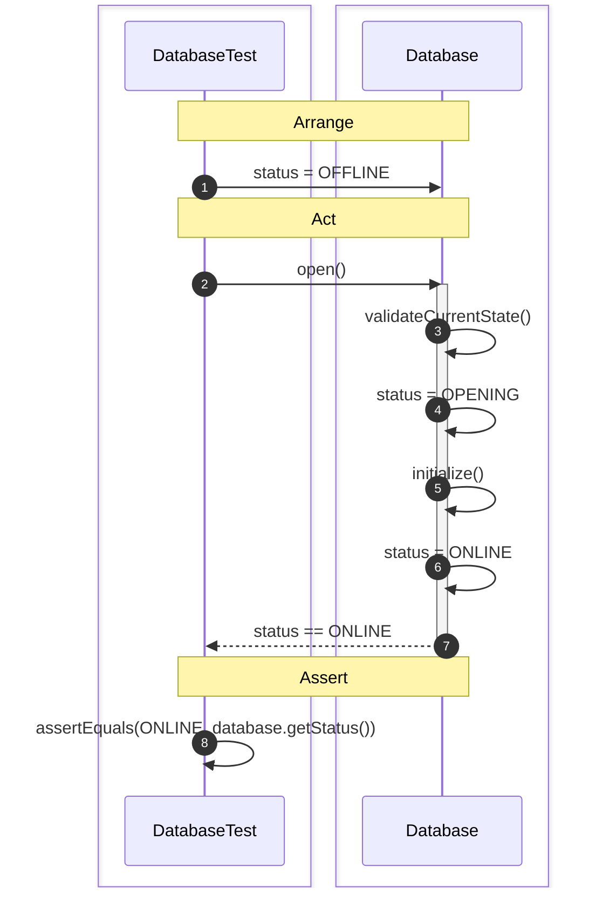
```mermaid
sequenceDiagram
    autonumber

    box #e1f5fe Test Suite
    participant Test as DatabaseTest
    end

    box #e8f5e9 Database Component
    participant D as Database
    end

    Note over Test,D: Arrange
    Test->>D: status = OFFLINE

    Note over Test,D: Act
    Test->>D: open()

    activate D

    D->>D: validateCurrentState()
    D->>D: status = OPENING
    D->>D: initialize()
    D->>D: status = ONLINE

    D-->>Test: status == ONLINE
    deactivate D

    Note over Test,D: Assert
    Test->>Test: assertEquals(ONLINE, database.getStatus())
```

### 2. shouldCloseDatabase()
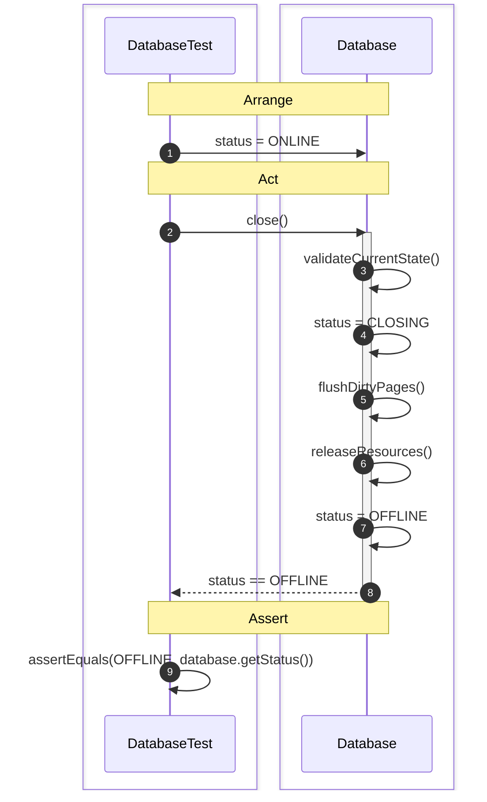
```mermaid
sequenceDiagram
    autonumber

    box #e1f5fe Test Suite
    participant Test as DatabaseTest
    end

    box #e8f5e9 Database Component
    participant D as Database
    end

    Note over Test,D: Arrange
    Test->>D: status = ONLINE

    Note over Test,D: Act
    Test->>D: close()

    activate D

    D->>D: validateCurrentState()
    D->>D: status = CLOSING
    D->>D: flushDirtyPages()
    D->>D: releaseResources()
    D->>D: status = OFFLINE

    D-->>Test: status == OFFLINE
    deactivate D

    Note over Test,D: Assert
    Test->>Test: assertEquals(OFFLINE, database.getStatus())
```

### 3. shouldRenameDatabase()
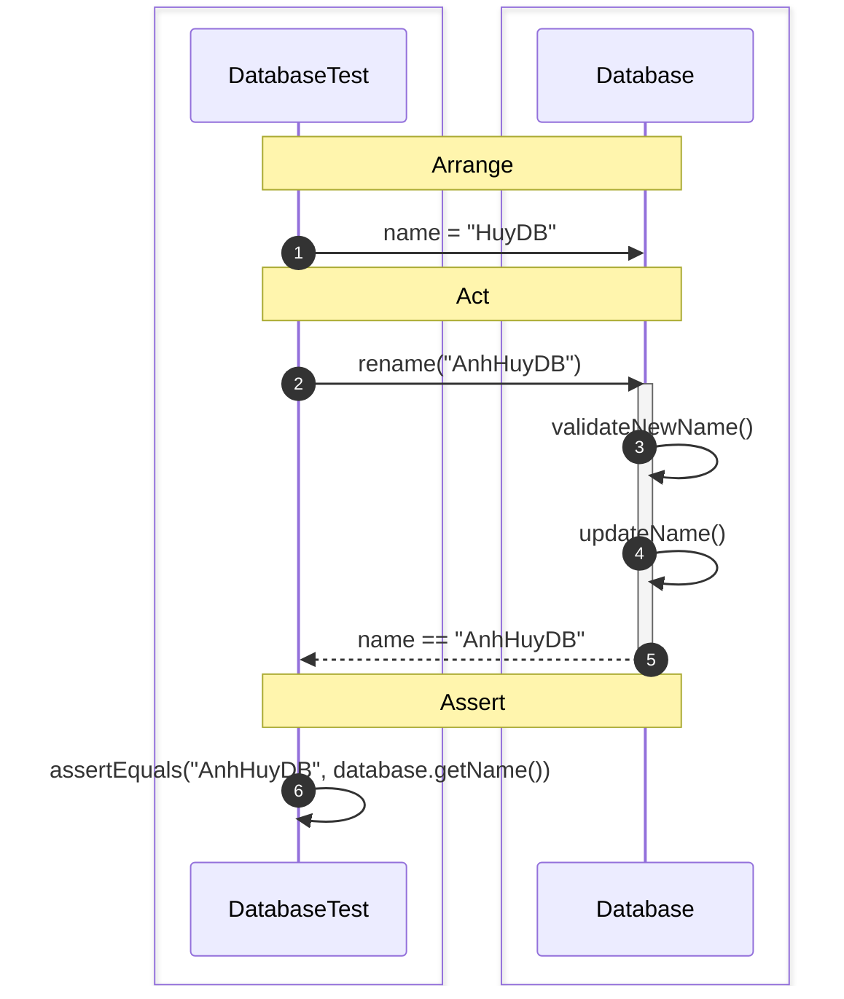
```mermaid
sequenceDiagram
    autonumber

    box #e1f5fe Test Suite
    participant Test as DatabaseTest
    end

    box #e8f5e9 Database Component
    participant D as Database
    end

    Note over Test,D: Arrange
    Test->>D: name = "HuyDB"

    Note over Test,D: Act
    Test->>D: rename("AnhHuyDB")

    activate D

    D->>D: validateNewName()
    D->>D: updateName()

    D-->>Test: name == "AnhHuyDB"

    deactivate D

    Note over Test,D: Assert
    Test->>Test: assertEquals("AnhHuyDB", database.getName())
```

### 4. shouldSetDatabaseOwner()
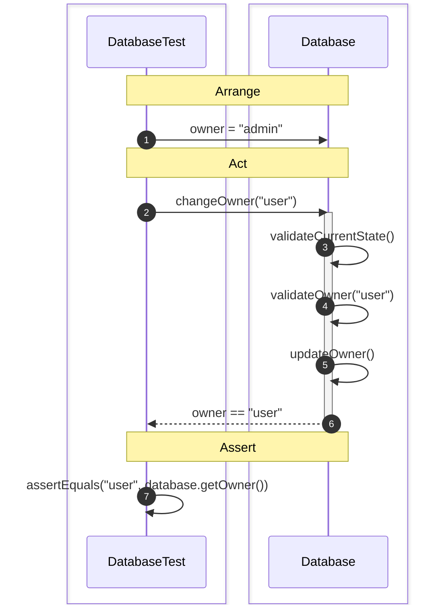
```mermaid
sequenceDiagram
    autonumber

    box #e1f5fe Test Suite
    participant Test as DatabaseTest
    end

    box #e8f5e9 Database Component
    participant D as Database
    end

    Note over Test,D: Arrange
    Test->>D: owner = "admin"

    Note over Test,D: Act
    Test->>D: changeOwner("user")

    activate D

    D->>D: validateCurrentState()
    D->>D: validateOwner("user")
    D->>D: updateOwner()

    D-->>Test: owner == "user"

    deactivate D

    Note over Test,D: Assert
    Test->>Test: assertEquals("user", database.getOwner())
```

### 5. shouldRejectOperationWhenClosed()
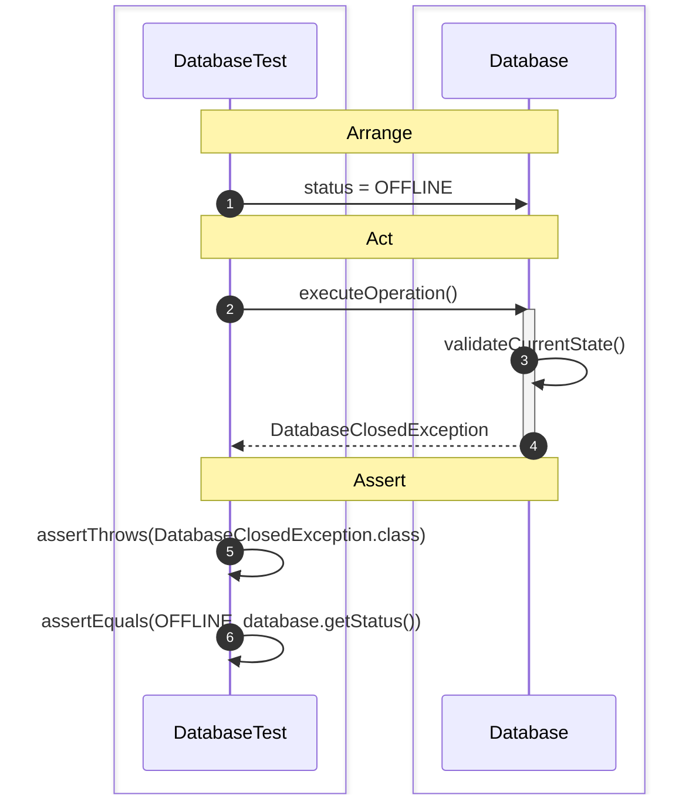
```mermaid
sequenceDiagram
    autonumber

    box #e1f5fe Test Suite
    participant Test as DatabaseTest
    end

    box #e8f5e9 Database Component
    participant D as Database
    end

    Note over Test,D: Arrange
    Test->>D: status = OFFLINE

    Note over Test,D: Act
    Test->>D: executeOperation()

    activate D

    D->>D: validateCurrentState()

    D-->>Test: DatabaseClosedException

    deactivate D

    Note over Test,D: Assert
    Test->>Test: assertThrows(DatabaseClosedException.class)
    Test->>Test: assertEquals(OFFLINE, database.getStatus())
```

### 6. shouldRejectOpenWhenAlreadyOnline()
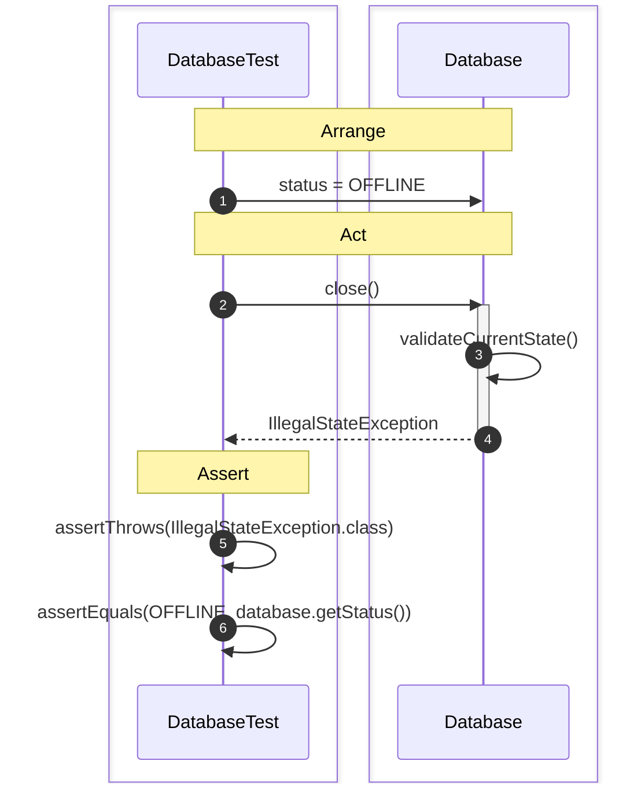
```mermaid
sequenceDiagram
    autonumber

    box #e1f5fe Test Suite
    participant Test as DatabaseTest
    end

    box #e8f5e9 Database Component
    participant D as Database
    end

    Note over Test,D: Arrange
    Test->>D: status = OFFLINE

    Note over Test,D: Act
    Test->>D: close()

    activate D
    D->>D: validateCurrentState()
    D-->>Test: IllegalStateException
    deactivate D
    
    Note over Test: Assert
    Test->>Test: assertThrows(IllegalStateException.class)
    Test->>Test: assertEquals(OFFLINE, database.getStatus())
    
```

### 7. shouldRejectCloseWhenAlreadyOffline()
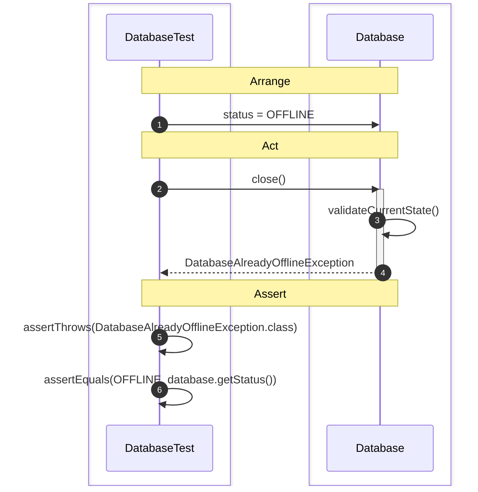
```mermaid
sequenceDiagram
    autonumber

    box #e1f5fe Test Suite
    participant Test as DatabaseTest
    end

    box #e8f5e9 Database Component
    participant D as Database
    end

    Note over Test,D: Arrange
    Test->>D: status = OFFLINE

    Note over Test,D: Act
    Test->>D: close()

    activate D

    D->>D: validateCurrentState()

    D-->>Test: DatabaseAlreadyOfflineException

    deactivate D

    Note over Test,D: Assert
    Test->>Test: assertThrows(DatabaseAlreadyOfflineException.class)
    Test->>Test: assertEquals(OFFLINE, database.getStatus())
```

### 8. shouldRejectRenameWhenDatabaseIsOpening()

```mermaid
sequenceDiagram
    autonumber

    box #e1f5fe Test Suite
    participant Test as DatabaseTest
    end

    box #e8f5e9 Database Component
    participant D as Database
    end

    Note over Test,D: Arrange
    Test->>D: status = OPENING
    Test->>D: name = "OldDatabase"

    Note over Test,D: Act
    Test->>D: rename("NewDatabase")

    activate D

    D->>D: validateCurrentState()

    D-->>Test: DatabaseOpeningException

    deactivate D

    Note over Test,D: Assert
    Test->>Test: assertThrows(DatabaseOpeningException.class)
    Test->>Test: assertEquals("OldDatabase", database.getName())
```

### 9. shouldRejectRenameWhenDatabaseIsClosing()
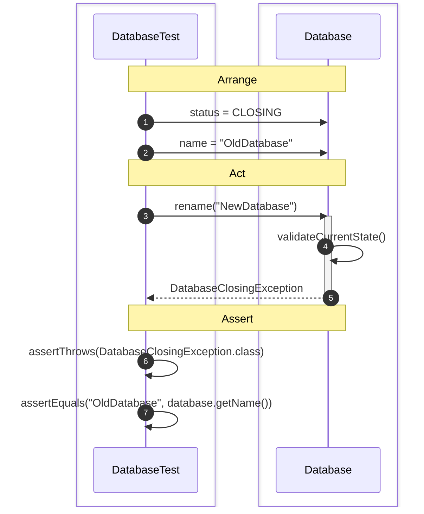
```mermaid
sequenceDiagram
    autonumber

    box #e1f5fe Test Suite
    participant Test as DatabaseTest
    end

    box #e8f5e9 Database Component
    participant D as Database
    end

    Note over Test,D: Arrange
    Test->>D: status = CLOSING
    Test->>D: name = "OldDatabase"

    Note over Test,D: Act
    Test->>D: rename("NewDatabase")

    activate D

    D->>D: validateCurrentState()

    D-->>Test: DatabaseClosingException

    deactivate D

    Note over Test,D: Assert
    Test->>Test: assertThrows(DatabaseClosingException.class)
    Test->>Test: assertEquals("OldDatabase", database.getName())
```

### 10. shouldRejectEmptyDatabaseName()
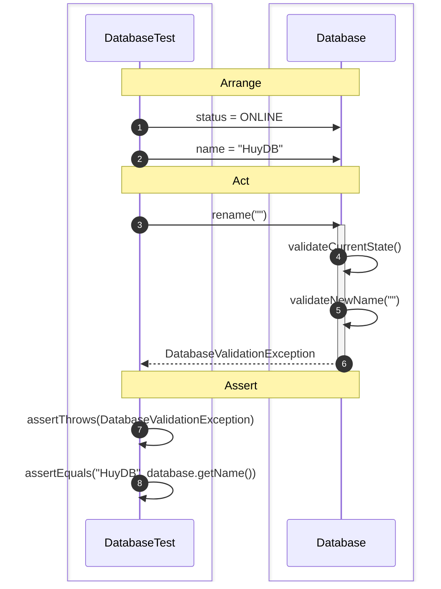
```mermaid
sequenceDiagram
    autonumber

    box #e1f5fe Test Suite
    participant Test as DatabaseTest
    end

    box #e8f5e9 Database Component
    participant D as Database
    end

    Note over Test,D: Arrange
    Test->>D: status = ONLINE
    Test->>D: name = "HuyDB"

    Note over Test,D: Act
    Test->>D: rename("")

    activate D

    D->>D: validateCurrentState()
    D->>D: validateNewName("")

    D-->>Test: DatabaseValidationException
    deactivate D

    Note over Test,D: Assert
    Test->>Test: assertThrows(DatabaseValidationException)
    Test->>Test: assertEquals("HuyDB", database.getName())
```

### 11. shouldRejectNullOwner()
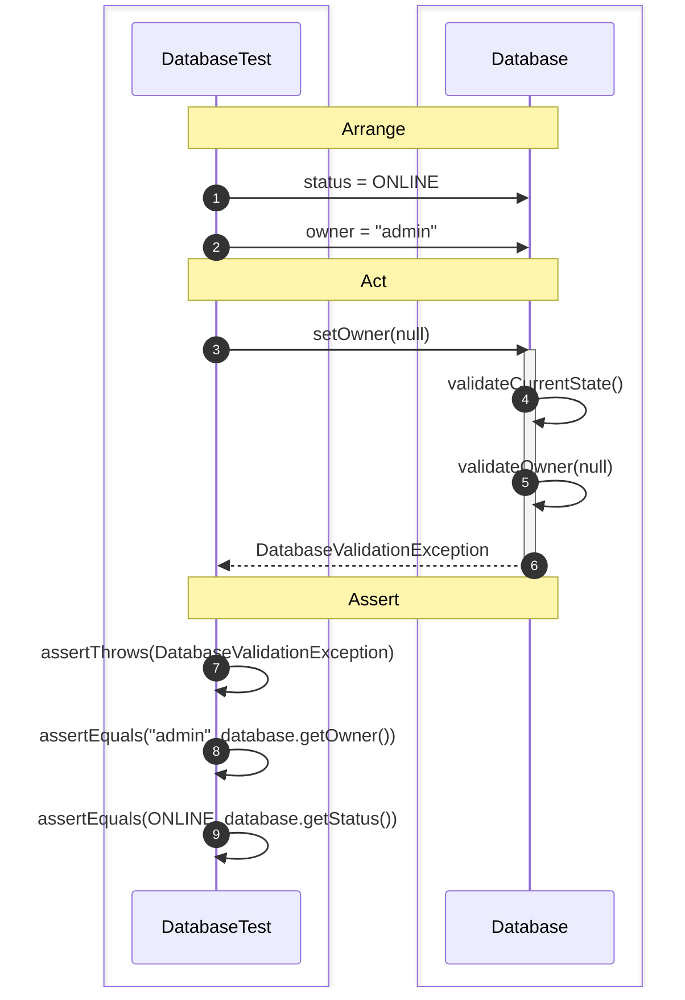
```mermaid
sequenceDiagram
    autonumber

    box #e1f5fe Test Suite
    participant Test as DatabaseTest
    end

    box #e8f5e9 Database Component
    participant D as Database
    end

    Note over Test,D: Arrange
    Test->>D: status = ONLINE
    Test->>D: owner = "admin"

    Note over Test,D: Act
    Test->>D: setOwner(null)

    activate D

    D->>D: validateCurrentState()
    D->>D: validateOwner(null)

    D-->>Test: DatabaseValidationException
    deactivate D

    Note over Test,D: Assert
    Test->>Test: assertThrows(DatabaseValidationException)
    Test->>Test: assertEquals("admin", database.getOwner())
    Test->>Test: assertEquals(ONLINE, database.getStatus())
```

### 12. shouldRejectNullDatabaseName()
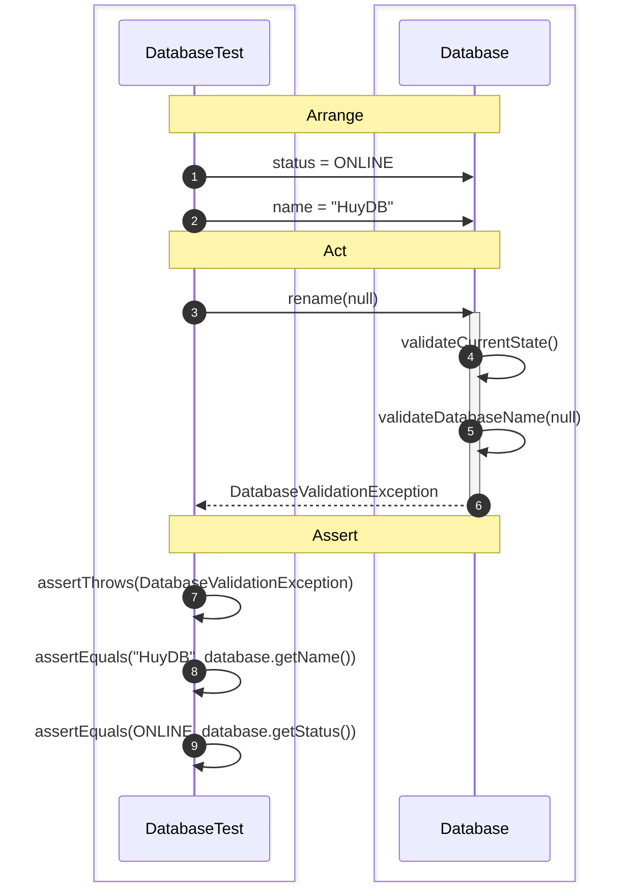
```mermaid
sequenceDiagram
    autonumber

    box #e1f5fe Test Suite
    participant Test as DatabaseTest
    end

    box #e8f5e9 Database Component
    participant D as Database
    end

    Note over Test,D: Arrange
    Test->>D: status = ONLINE
    Test->>D: name = "HuyDB"

    Note over Test,D: Act
    Test->>D: rename(null)

    activate D

    D->>D: validateCurrentState()
    D->>D: validateDatabaseName(null)

    D-->>Test: DatabaseValidationException
    deactivate D

    Note over Test,D: Assert
    Test->>Test: assertThrows(DatabaseValidationException)
    Test->>Test: assertEquals("HuyDB", database.getName())
    Test->>Test: assertEquals(ONLINE, database.getStatus())
```

### 13. shouldRejectBlankDatabaseName()
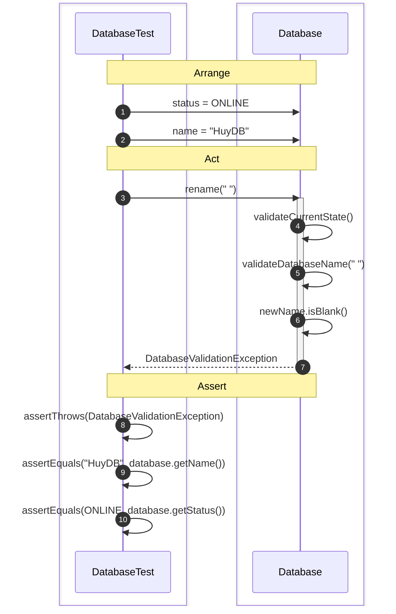
```mermaid
sequenceDiagram
    autonumber

    box #e1f5fe Test Suite
    participant Test as DatabaseTest
    end

    box #e8f5e9 Database Component
    participant D as Database
    end

    Note over Test,D: Arrange
    Test->>D: status = ONLINE
    Test->>D: name = "HuyDB"

    Note over Test,D: Act
    Test->>D: rename("     ")

    activate D

    D->>D: validateCurrentState()
    D->>D: validateDatabaseName("     ")
    D->>D: newName.isBlank()

    D-->>Test: DatabaseValidationException
    deactivate D

    Note over Test,D: Assert
    Test->>Test: assertThrows(DatabaseValidationException)
    Test->>Test: assertEquals("HuyDB", database.getName())
    Test->>Test: assertEquals(ONLINE, database.getStatus())
```

### 14. shouldRejectDatabaseNameWithSpecialCharacters()
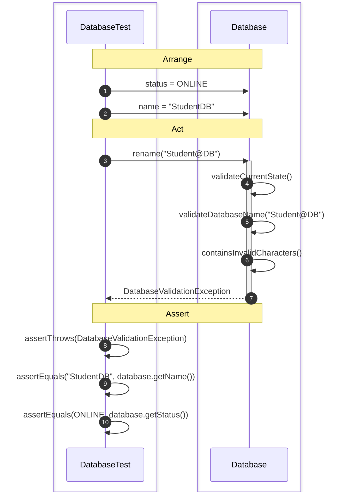
```mermaid
sequenceDiagram
    autonumber

    box #e1f5fe Test Suite
    participant Test as DatabaseTest
    end

    box #e8f5e9 Database Component
    participant D as Database
    end

    Note over Test,D: Arrange
    Test->>D: status = ONLINE
    Test->>D: name = "StudentDB"

    Note over Test,D: Act
    Test->>D: rename("Student@DB")

    activate D

    D->>D: validateCurrentState()
    D->>D: validateDatabaseName("Student@DB")
    D->>D: containsInvalidCharacters()

    D-->>Test: DatabaseValidationException
    deactivate D

    Note over Test,D: Assert
    Test->>Test: assertThrows(DatabaseValidationException)
    Test->>Test: assertEquals("StudentDB", database.getName())
    Test->>Test: assertEquals(ONLINE, database.getStatus())
```

### 15. shouldRejectDatabaseNameExceedingMaxLength()
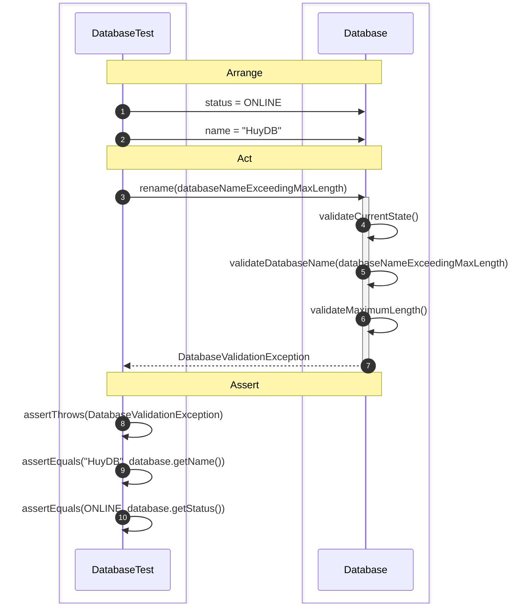
```mermaid
sequenceDiagram
    autonumber

    box #e1f5fe Test Suite
    participant Test as DatabaseTest
    end

    box #e8f5e9 Database Component
    participant D as Database
    end

    Note over Test,D: Arrange
    Test->>D: status = ONLINE
    Test->>D: name = "HuyDB"

    Note over Test,D: Act
    Test->>D: rename(databaseNameExceedingMaxLength)

    activate D

    D->>D: validateCurrentState()
    D->>D: validateDatabaseName(databaseNameExceedingMaxLength)
    D->>D: validateMaximumLength()

    D-->>Test: DatabaseValidationException
    deactivate D

    Note over Test,D: Assert
    Test->>Test: assertThrows(DatabaseValidationException)
    Test->>Test: assertEquals("HuyDB", database.getName())
    Test->>Test: assertEquals(ONLINE, database.getStatus())
```

### 16. shouldRejectReservedDatabaseName()
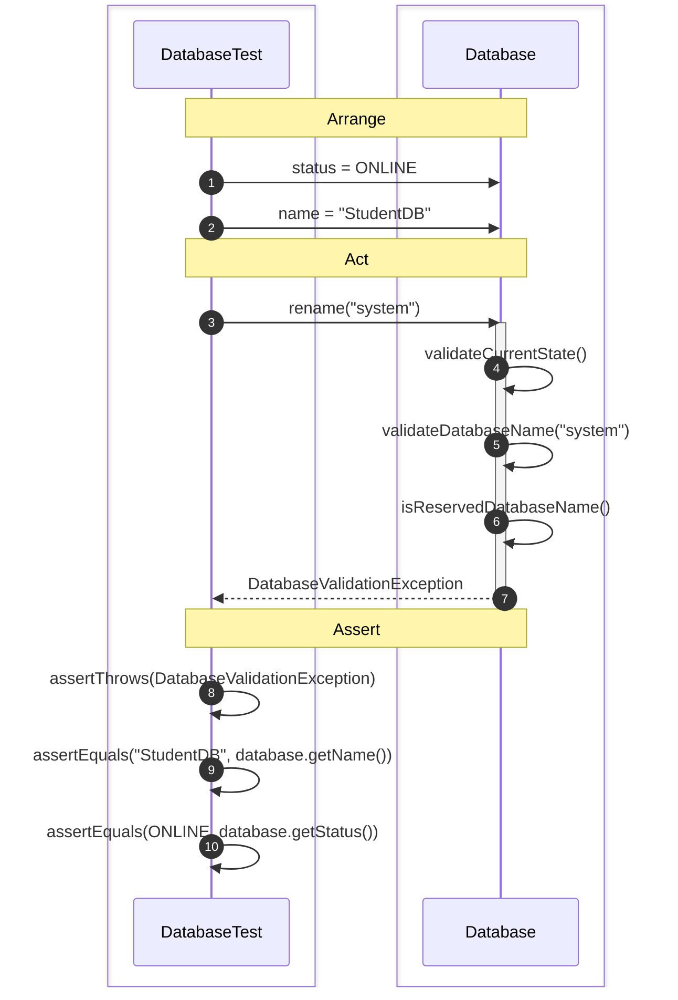
```mermaid
sequenceDiagram
    autonumber

    box #e1f5fe Test Suite
    participant Test as DatabaseTest
    end

    box #e8f5e9 Database Component
    participant D as Database
    end

    Note over Test,D: Arrange
    Test->>D: status = ONLINE
    Test->>D: name = "StudentDB"

    Note over Test,D: Act
    Test->>D: rename("system")

    activate D

    D->>D: validateCurrentState()
    D->>D: validateDatabaseName("system")
    D->>D: isReservedDatabaseName()

    D-->>Test: DatabaseValidationException
    deactivate D

    Note over Test,D: Assert
    Test->>Test: assertThrows(DatabaseValidationException)
    Test->>Test: assertEquals("StudentDB", database.getName())
    Test->>Test: assertEquals(ONLINE, database.getStatus())
```
## SchemaTest

### 1. shouldCreateTable()

```mermaid
sequenceDiagram
    autonumber
    box #e1f5fe Test Suite
    participant Test as SchemaTest
    end
    box #e8f5e9 Schema Component
    participant S as Schema
    end

    Test->>S: shouldCreateTable()
    S-->>Test: success
```

### 2. shouldDropTable()

```mermaid
sequenceDiagram
    autonumber
    box #e1f5fe Test Suite
    participant Test as SchemaTest
    end
    box #e8f5e9 Schema Component
    participant S as Schema
    end

    Test->>S: shouldDropTable()
    S-->>Test: success
```

### 3. shouldRenameTable()
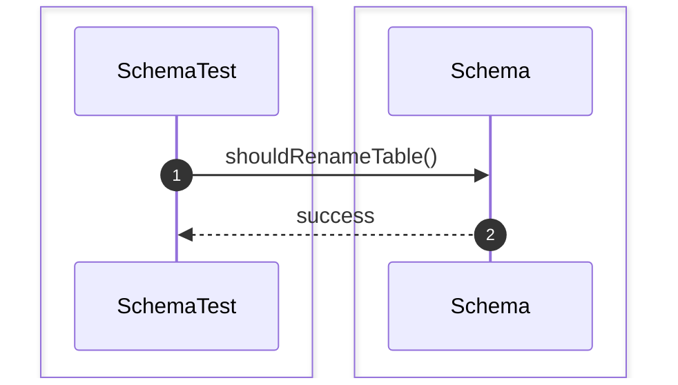
```mermaid
sequenceDiagram
    autonumber
    box #e1f5fe Test Suite
    participant Test as SchemaTest
    end
    box #e8f5e9 Schema Component
    participant S as Schema
    end

    Test->>S: shouldRenameTable()
    S-->>Test: success
```

### 4. shouldCreateView()
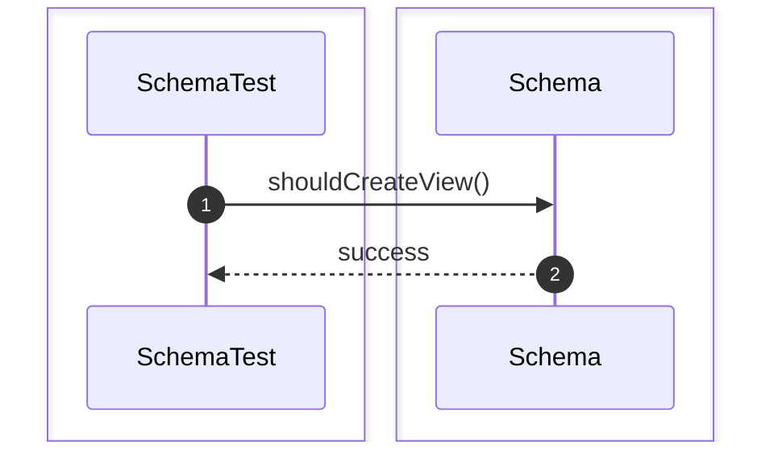
```mermaid
sequenceDiagram
    autonumber
    box #e1f5fe Test Suite
    participant Test as SchemaTest
    end
    box #e8f5e9 Schema Component
    participant S as Schema
    end

    Test->>S: shouldCreateView()
    S-->>Test: success
```

### 5. shouldDropView()
```mermaid
sequenceDiagram
    autonumber
    box #e1f5fe Test Suite
    participant Test as SchemaTest
    end
    box #e8f5e9 Schema Component
    participant S as Schema
    end

    Test->>S: shouldDropView()
    S-->>Test: success
```

### 6. shouldCreateStoredProcedure()
```mermaid
sequenceDiagram
    autonumber
    box #e1f5fe Test Suite
    participant Test as SchemaTest
    end
    box #e8f5e9 Schema Component
    participant S as Schema
    end

    Test->>S: shouldCreateStoredProcedure()
    S-->>Test: success
```

### 7. shouldDropStoredProcedure()
```mermaid
sequenceDiagram
    autonumber
    box #e1f5fe Test Suite
    participant Test as SchemaTest
    end
    box #e8f5e9 Schema Component
    participant S as Schema
    end

    Test->>S: shouldDropStoredProcedure()
    S-->>Test: success
```

### 8. shouldCreateSequence()
```mermaid
sequenceDiagram
    autonumber
    box #e1f5fe Test Suite
    participant Test as SchemaTest
    end
    box #e8f5e9 Schema Component
    participant S as Schema
    end

    Test->>S: shouldCreateSequence()
    S-->>Test: success
```

### 9. shouldDropSequence()
```mermaid
sequenceDiagram
    autonumber
    box #e1f5fe Test Suite
    participant Test as SchemaTest
    end
    box #e8f5e9 Schema Component
    participant S as Schema
    end

    Test->>S: shouldDropSequence()
    S-->>Test: success
```

### 10. shouldReturnExistingTable()
```mermaid
sequenceDiagram
    autonumber
    box #e1f5fe Test Suite
    participant Test as SchemaTest
    end
    box #e8f5e9 Schema Component
    participant S as Schema
    end

    Test->>S: shouldReturnExistingTable()
    S-->>Test: success
```

## TableTest

### 1. shouldInsertRow()
```mermaid
sequenceDiagram
    autonumber
    box #e1f5fe Test Suite
    participant Test as TableTest
    end
    box #e8f5e9 Table Component
    participant T as Table
    end

    Test->>T: shouldInsertRow()
    T-->>Test: success
```

### 2. shouldUpdateRow()
```mermaid
sequenceDiagram
    autonumber
    box #e1f5fe Test Suite
    participant Test as TableTest
    end
    box #e8f5e9 Table Component
    participant T as Table
    end

    Test->>T: shouldUpdateRow()
    T-->>Test: success
```

### 3. shouldDeleteRow()
```mermaid
sequenceDiagram
    autonumber
    box #e1f5fe Test Suite
    participant Test as TableTest
    end
    box #e8f5e9 Table Component
    participant T as Table
    end

    Test->>T: shouldDeleteRow()
    T-->>Test: success
```

### 4. shouldTruncateTable()
```mermaid
sequenceDiagram
    autonumber
    box #e1f5fe Test Suite
    participant Test as TableTest
    end
    box #e8f5e9 Table Component
    participant T as Table
    end

    Test->>T: shouldTruncateTable()
    T-->>Test: success
```

### 5. shouldAnalyzeTable()
```mermaid
sequenceDiagram
    autonumber
    box #e1f5fe Test Suite
    participant Test as TableTest
    end
    box #e8f5e9 Table Component
    participant T as Table
    end

    Test->>T: shouldAnalyzeTable()
    T-->>Test: success
```

### 6. shouldIncreaseRowCount()
```mermaid
sequenceDiagram
    autonumber
    box #e1f5fe Test Suite
    participant Test as TableTest
    end
    box #e8f5e9 Table Component
    participant T as Table
    end

    Test->>T: shouldIncreaseRowCount()
    T-->>Test: success
```

### 7. shouldDecreaseRowCount()
```mermaid
sequenceDiagram
    autonumber
    box #e1f5fe Test Suite
    participant Test as TableTest
    end
    box #e8f5e9 Table Component
    participant T as Table
    end

    Test->>T: shouldDecreaseRowCount()
    T-->>Test: success
```

### 8. shouldReturnInsertedRow()
```mermaid
sequenceDiagram
    autonumber
    box #e1f5fe Test Suite
    participant Test as TableTest
    end
    box #e8f5e9 Table Component
    participant T as Table
    end

    Test->>T: shouldReturnInsertedRow()
    T-->>Test: success
```

### 9. shouldReturnUpdatedRow()
```mermaid
sequenceDiagram
    autonumber
    box #e1f5fe Test Suite
    participant Test as TableTest
    end
    box #e8f5e9 Table Component
    participant T as Table
    end

    Test->>T: shouldReturnUpdatedRow()
    T-->>Test: success
```

## ColumnTest

### 1. shouldCreateColumn()
```mermaid
sequenceDiagram
    autonumber
    box #e1f5fe Test Suite
    participant Test as ColumnTest
    end
    box #e8f5e9 Column Component
    participant C as Column
    end

    Test->>C: shouldCreateColumn()
    C-->>Test: success
```

### 2. shouldValidateColumnDefinition()
```mermaid
sequenceDiagram
    autonumber
    box #e1f5fe Test Suite
    participant Test as ColumnTest
    end
    box #e8f5e9 Column Component
    participant C as Column
    end

    Test->>C: shouldValidateColumnDefinition()
    C-->>Test: success
```

### 3. shouldRejectInvalidDataType()
```mermaid
sequenceDiagram
    autonumber
    box #e1f5fe Test Suite
    participant Test as ColumnTest
    end
    box #e8f5e9 Column Component
    participant C as Column
    end

    Test->>C: shouldRejectInvalidDataType()
    C-->>Test: success
```

### 4. shouldRejectInvalidLength()
```mermaid
sequenceDiagram
    autonumber
    box #e1f5fe Test Suite
    participant Test as ColumnTest
    end
    box #e8f5e9 Column Component
    participant C as Column
    end

    Test->>C: shouldRejectInvalidLength()
    C-->>Test: success
```

### 5. shouldAcceptNullableColumn()
```mermaid
sequenceDiagram
    autonumber
    box #e1f5fe Test Suite
    participant Test as ColumnTest
    end
    box #e8f5e9 Column Component
    participant C as Column
    end

    Test->>C: shouldAcceptNullableColumn()
    C-->>Test: success
```

### 6. shouldRejectNullForNotNullColumn()
```mermaid
sequenceDiagram
    autonumber
    box #e1f5fe Test Suite
    participant Test as ColumnTest
    end
    box #e8f5e9 Column Component
    participant C as Column
    end

    Test->>C: shouldRejectNullForNotNullColumn()
    C-->>Test: success
```

### 7. shouldUpdateColumnMetadata()
```mermaid
sequenceDiagram
    autonumber
    box #e1f5fe Test Suite
    participant Test as ColumnTest
    end
    box #e8f5e9 Column Component
    participant C as Column
    end

    Test->>C: shouldUpdateColumnMetadata()
    C-->>Test: success
```

### 8. shouldChangeDefaultValue()
```mermaid
sequenceDiagram
    autonumber
    box #e1f5fe Test Suite
    participant Test as ColumnTest
    end
    box #e8f5e9 Column Component
    participant C as Column
    end

    Test->>C: shouldChangeDefaultValue()
    C-->>Test: success
```

## RowTest

### 1. shouldCreateRow()
```mermaid
sequenceDiagram
    autonumber
    box #e1f5fe Test Suite
    participant Test as RowTest
    end
    box #e8f5e9 Row Component
    participant R as Row
    end

    Test->>R: shouldCreateRow()
    R-->>Test: success
```

### 2. shouldUpdateRow()
```mermaid
sequenceDiagram
    autonumber
    box #e1f5fe Test Suite
    participant Test as RowTest
    end
    box #e8f5e9 Row Component
    participant R as Row
    end

    Test->>R: shouldUpdateRow()
    R-->>Test: success
```

### 3. shouldMarkRowDeleted()
```mermaid
sequenceDiagram
    autonumber
    box #e1f5fe Test Suite
    participant Test as RowTest
    end
    box #e8f5e9 Row Component
    participant R as Row
    end

    Test->>R: shouldMarkRowDeleted()
    R-->>Test: success
```

### 4. shouldReadRow()
```mermaid
sequenceDiagram
    autonumber
    box #e1f5fe Test Suite
    participant Test as RowTest
    end
    box #e8f5e9 Row Component
    participant R as Row
    end

    Test->>R: shouldReadRow()
    R-->>Test: success
```

### 5. shouldCloneRowVersion()
```mermaid
sequenceDiagram
    autonumber
    box #e1f5fe Test Suite
    participant Test as RowTest
    end
    box #e8f5e9 Row Component
    participant R as Row
    end

    Test->>R: shouldCloneRowVersion()
    R-->>Test: success
```

### 6. shouldUpdateRowVersion()
```mermaid
sequenceDiagram
    autonumber
    box #e1f5fe Test Suite
    participant Test as RowTest
    end
    box #e8f5e9 Row Component
    participant R as Row
    end

    Test->>R: shouldUpdateRowVersion()
    R-->>Test: success
```

### 7. shouldStoreTransactionId()
```mermaid
sequenceDiagram
    autonumber
    box #e1f5fe Test Suite
    participant Test as RowTest
    end
    box #e8f5e9 Row Component
    participant R as Row
    end

    Test->>R: shouldStoreTransactionId()
    R-->>Test: success
```

### 8. shouldReturnColumnValue()
```mermaid
sequenceDiagram
    autonumber
    box #e1f5fe Test Suite
    participant Test as RowTest
    end
    box #e8f5e9 Row Component
    participant R as Row
    end

    Test->>R: shouldReturnColumnValue()
    R-->>Test: success
```

### 9. shouldReplaceColumnValue()
```mermaid
sequenceDiagram
    autonumber
    box #e1f5fe Test Suite
    participant Test as RowTest
    end
    box #e8f5e9 Row Component
    participant R as Row
    end

    Test->>R: shouldReplaceColumnValue()
    R-->>Test: success
```

### 10. shouldMarkRowDeleted()
```mermaid
sequenceDiagram
    autonumber
    box #e1f5fe Test Suite
    participant Test as RowTest
    end
    box #e8f5e9 Row Component
    participant R as Row
    end

    Test->>R: shouldMarkRowDeleted()
    R-->>Test: success
```

## ConstraintTest

### 1. shouldValidatePrimaryKey()
```mermaid
sequenceDiagram
    autonumber
    box #e1f5fe Test Suite
    participant Test as ConstraintTest
    end
    box #e8f5e9 Constraint Component
    participant C as Constraint
    end

    Test->>C: shouldValidatePrimaryKey()
    C-->>Test: success
```

### 2. shouldRejectDuplicatePrimaryKey()
```mermaid
sequenceDiagram
    autonumber
    box #e1f5fe Test Suite
    participant Test as ConstraintTest
    end
    box #e8f5e9 Constraint Component
    participant C as Constraint
    end

    Test->>C: shouldRejectDuplicatePrimaryKey()
    C-->>Test: success
```

### 3. shouldValidateForeignKey()
```mermaid
sequenceDiagram
    autonumber
    box #e1f5fe Test Suite
    participant Test as ConstraintTest
    end
    box #e8f5e9 Constraint Component
    participant C as Constraint
    end

    Test->>C: shouldValidateForeignKey()
    C-->>Test: success
```

### 4. shouldRejectBrokenForeignKey()
```mermaid
sequenceDiagram
    autonumber
    box #e1f5fe Test Suite
    participant Test as ConstraintTest
    end
    box #e8f5e9 Constraint Component
    participant C as Constraint
    end

    Test->>C: shouldRejectBrokenForeignKey()
    C-->>Test: success
```

### 5. shouldValidateUniqueConstraint()
```mermaid
sequenceDiagram
    autonumber
    box #e1f5fe Test Suite
    participant Test as ConstraintTest
    end
    box #e8f5e9 Constraint Component
    participant C as Constraint
    end

    Test->>C: shouldValidateUniqueConstraint()
    C-->>Test: success
```

### 6. shouldRejectDuplicateUniqueValue()
```mermaid
sequenceDiagram
    autonumber
    box #e1f5fe Test Suite
    participant Test as ConstraintTest
    end
    box #e8f5e9 Constraint Component
    participant C as Constraint
    end

    Test->>C: shouldRejectDuplicateUniqueValue()
    C-->>Test: success
```

### 7. shouldValidateCheckConstraint()
```mermaid
sequenceDiagram
    autonumber
    box #e1f5fe Test Suite
    participant Test as ConstraintTest
    end
    box #e8f5e9 Constraint Component
    participant C as Constraint
    end

    Test->>C: shouldValidateCheckConstraint()
    C-->>Test: success
```

### 8. shouldRejectInvalidCheckConstraint()
```mermaid
sequenceDiagram
    autonumber
    box #e1f5fe Test Suite
    participant Test as ConstraintTest
    end
    box #e8f5e9 Constraint Component
    participant C as Constraint
    end

    Test->>C: shouldRejectInvalidCheckConstraint()
    C-->>Test: success
```

## BTreeIndexTest

### 1. shouldInsertKey()
```mermaid
sequenceDiagram
    autonumber
    box #e1f5fe Test Suite
    participant Test as BTreeIndexTest
    end
    box #e8f5e9 BTreeIndex Component
    participant BTI as BTreeIndex
    end

    Test->>BTI: shouldInsertKey()
    BTI-->>Test: success
```

### 2. shouldSearchKey()
```mermaid
sequenceDiagram
    autonumber
    box #e1f5fe Test Suite
    participant Test as BTreeIndexTest
    end
    box #e8f5e9 BTreeIndex Component
    participant BTI as BTreeIndex
    end

    Test->>BTI: shouldSearchKey()
    BTI-->>Test: success
```

### 3. shouldDeleteKey()
```mermaid
sequenceDiagram
    autonumber
    box #e1f5fe Test Suite
    participant Test as BTreeIndexTest
    end
    box #e8f5e9 BTreeIndex Component
    participant BTI as BTreeIndex
    end

    Test->>BTI: shouldDeleteKey()
    BTI-->>Test: success
```

### 4. shouldUpdateKey()
```mermaid
sequenceDiagram
    autonumber
    box #e1f5fe Test Suite
    participant Test as BTreeIndexTest
    end
    box #e8f5e9 BTreeIndex Component
    participant BTI as BTreeIndex
    end

    Test->>BTI: shouldUpdateKey()
    BTI-->>Test: success
```

### 5. shouldHandleDuplicateKey()
```mermaid
sequenceDiagram
    autonumber
    box #e1f5fe Test Suite
    participant Test as BTreeIndexTest
    end
    box #e8f5e9 BTreeIndex Component
    participant BTI as BTreeIndex
    end

    Test->>BTI: shouldHandleDuplicateKey()
    BTI-->>Test: success
```

### 6. shouldRebuildIndex()
```mermaid
sequenceDiagram
    autonumber
    box #e1f5fe Test Suite
    participant Test as BTreeIndexTest
    end
    box #e8f5e9 BTreeIndex Component
    participant BTI as BTreeIndex
    end

    Test->>BTI: shouldRebuildIndex()
    BTI-->>Test: success
```

## HashIndexTest

### 1. shouldInsertKey()
```mermaid
sequenceDiagram
    autonumber
    box #e1f5fe Test Suite
    participant Test as HashIndexTest
    end
    box #e8f5e9 HashIndex Component
    participant HI as HashIndex
    end

    Test->>HI: shouldInsertKey()
    HI-->>Test: success
```

### 2. shouldSearchKey()
```mermaid
sequenceDiagram
    autonumber
    box #e1f5fe Test Suite
    participant Test as HashIndexTest
    end
    box #e8f5e9 HashIndex Component
    participant HI as HashIndex
    end

    Test->>HI: shouldSearchKey()
    HI-->>Test: success
```

### 3. shouldDeleteKey()
```mermaid
sequenceDiagram
    autonumber
    box #e1f5fe Test Suite
    participant Test as HashIndexTest
    end
    box #e8f5e9 HashIndex Component
    participant HI as HashIndex
    end

    Test->>HI: shouldDeleteKey()
    HI-->>Test: success
```

## BitmapIndexTest

### 1. shouldSearchBitmap()
```mermaid
sequenceDiagram
    autonumber
    box #e1f5fe Test Suite
    participant Test as BitmapIndexTest
    end
    box #e8f5e9 BitmapIndex Component
    participant BI as BitmapIndex
    end

    Test->>BI: shouldSearchBitmap()
    BI-->>Test: success
```

### 2. shouldUpdateBitmap()
```mermaid
sequenceDiagram
    autonumber
    box #e1f5fe Test Suite
    participant Test as BitmapIndexTest
    end
    box #e8f5e9 BitmapIndex Component
    participant BI as BitmapIndex
    end

    Test->>BI: shouldUpdateBitmap()
    BI-->>Test: success
```

## PartitionTest

### 1. shouldPartitionTable()
```mermaid
sequenceDiagram
    autonumber
    box #e1f5fe Test Suite
    participant Test as PartitionTest
    end
    box #e8f5e9 Partition Component
    participant P as Partition
    end

    Test->>P: shouldPartitionTable()
    P-->>Test: success
```

### 2. shouldDropPartition()
```mermaid
sequenceDiagram
    autonumber
    box #e1f5fe Test Suite
    participant Test as PartitionTest
    end
    box #e8f5e9 Partition Component
    participant P as Partition
    end

    Test->>P: shouldDropPartition()
    P-->>Test: success
```

### 3. shouldLocatePartition()
```mermaid
sequenceDiagram
    autonumber
    box #e1f5fe Test Suite
    participant Test as PartitionTest
    end
    box #e8f5e9 Partition Component
    participant P as Partition
    end

    Test->>P: shouldLocatePartition()
    P-->>Test: success
```

### 4. shouldSplitPartition()
```mermaid
sequenceDiagram
    autonumber
    box #e1f5fe Test Suite
    participant Test as PartitionTest
    end
    box #e8f5e9 Partition Component
    participant P as Partition
    end

    Test->>P: shouldSplitPartition()
    P-->>Test: success
```

### 5. shouldMergePartition()
```mermaid
sequenceDiagram
    autonumber
    box #e1f5fe Test Suite
    participant Test as PartitionTest
    end
    box #e8f5e9 Partition Component
    participant P as Partition
    end

    Test->>P: shouldMergePartition()
    P-->>Test: success
```

### 6. shouldMoveRowBetweenPartitions()
```mermaid
sequenceDiagram
    autonumber
    box #e1f5fe Test Suite
    participant Test as PartitionTest
    end
    box #e8f5e9 Partition Component
    participant P as Partition
    end

    Test->>P: shouldMoveRowBetweenPartitions()
    P-->>Test: success
```

## ViewTest

### 1. shouldCreateView()
```mermaid
sequenceDiagram
    autonumber
    box #e1f5fe Test Suite
    participant Test as ViewTest
    end
    box #e8f5e9 View Component
    participant V as View
    end

    Test->>V: shouldCreateView()
    V-->>Test: success
```

### 2. shouldValidateViewDefinition()
```mermaid
sequenceDiagram
    autonumber
    box #e1f5fe Test Suite
    participant Test as ViewTest
    end
    box #e8f5e9 View Component
    participant V as View
    end

    Test->>V: shouldValidateViewDefinition()
    V-->>Test: success
```

### 3. shouldExecuteViewQuery()
```mermaid
sequenceDiagram
    autonumber
    box #e1f5fe Test Suite
    participant Test as ViewTest
    end
    box #e8f5e9 View Component
    participant V as View
    end

    Test->>V: shouldExecuteViewQuery()
    V-->>Test: success
```

### 4. shouldRefreshViewDefinition()
```mermaid
sequenceDiagram
    autonumber
    box #e1f5fe Test Suite
    participant Test as ViewTest
    end
    box #e8f5e9 View Component
    participant V as View
    end

    Test->>V: shouldRefreshViewDefinition()
    V-->>Test: success
```

### 5. shouldRejectInvalidViewDefinition()
```mermaid
sequenceDiagram
    autonumber
    box #e1f5fe Test Suite
    participant Test as ViewTest
    end
    box #e8f5e9 View Component
    participant V as View
    end

    Test->>V: shouldRejectInvalidViewDefinition()
    V-->>Test: success
```

### 6. shouldReturnViewResult()
```mermaid
sequenceDiagram
    autonumber
    box #e1f5fe Test Suite
    participant Test as ViewTest
    end
    box #e8f5e9 View Component
    participant V as View
    end

    Test->>V: shouldReturnViewResult()
    V-->>Test: success
```

## StoredProcedureTest

### 1. shouldCreateProcedure()
```mermaid
sequenceDiagram
    autonumber
    box #e1f5fe Test Suite
    participant Test as StoredProcedureTest
    end
    box #e8f5e9 StoredProcedure Component
    participant SP as StoredProcedure
    end

    Test->>SP: shouldCreateProcedure()
    SP-->>Test: success
```

### 2. shouldExecuteProcedure()
```mermaid
sequenceDiagram
    autonumber
    box #e1f5fe Test Suite
    participant Test as StoredProcedureTest
    end
    box #e8f5e9 StoredProcedure Component
    participant SP as StoredProcedure
    end

    Test->>SP: shouldExecuteProcedure()
    SP-->>Test: success
```

### 3. shouldPassProcedureParameters()
```mermaid
sequenceDiagram
    autonumber
    box #e1f5fe Test Suite
    participant Test as StoredProcedureTest
    end
    box #e8f5e9 StoredProcedure Component
    participant SP as StoredProcedure
    end

    Test->>SP: shouldPassProcedureParameters()
    SP-->>Test: success
```

### 4. shouldReturnProcedureResult()
```mermaid
sequenceDiagram
    autonumber
    box #e1f5fe Test Suite
    participant Test as StoredProcedureTest
    end
    box #e8f5e9 StoredProcedure Component
    participant SP as StoredProcedure
    end

    Test->>SP: shouldReturnProcedureResult()
    SP-->>Test: success
```

### 5. shouldHandleProcedureException()
```mermaid
sequenceDiagram
    autonumber
    box #e1f5fe Test Suite
    participant Test as StoredProcedureTest
    end
    box #e8f5e9 StoredProcedure Component
    participant SP as StoredProcedure
    end

    Test->>SP: shouldHandleProcedureException()
    SP-->>Test: success
```

## TriggerTest

### 1. shouldCreateTrigger()
```mermaid
sequenceDiagram
    autonumber
    box #e1f5fe Test Suite
    participant Test as TriggerTest
    end
    box #e8f5e9 Trigger Component
    participant T as Trigger
    end

    Test->>T: shouldCreateTrigger()
    T-->>Test: success
```

### 2. shouldFireTrigger()
```mermaid
sequenceDiagram
    autonumber
    box #e1f5fe Test Suite
    participant Test as TriggerTest
    end
    box #e8f5e9 Trigger Component
    participant T as Trigger
    end

    Test->>T: shouldFireTrigger()
    T-->>Test: success
```

### 3. shouldExecuteBeforeInsertTrigger()
```mermaid
sequenceDiagram
    autonumber
    box #e1f5fe Test Suite
    participant Test as TriggerTest
    end
    box #e8f5e9 Trigger Component
    participant T as Trigger
    end

    Test->>T: shouldExecuteBeforeInsertTrigger()
    T-->>Test: success
```

### 4. shouldExecuteAfterInsertTrigger()
```mermaid
sequenceDiagram
    autonumber
    box #e1f5fe Test Suite
    participant Test as TriggerTest
    end
    box #e8f5e9 Trigger Component
    participant T as Trigger
    end

    Test->>T: shouldExecuteAfterInsertTrigger()
    T-->>Test: success
```

### 5. shouldExecuteBeforeUpdateTrigger()
```mermaid
sequenceDiagram
    autonumber
    box #e1f5fe Test Suite
    participant Test as TriggerTest
    end
    box #e8f5e9 Trigger Component
    participant T as Trigger
    end

    Test->>T: shouldExecuteBeforeUpdateTrigger()
    T-->>Test: success
```

### 6. shouldExecuteAfterUpdateTrigger()
```mermaid
sequenceDiagram
    autonumber
    box #e1f5fe Test Suite
    participant Test as TriggerTest
    end
    box #e8f5e9 Trigger Component
    participant T as Trigger
    end

    Test->>T: shouldExecuteAfterUpdateTrigger()
    T-->>Test: success
```

### 7. shouldExecuteBeforeDeleteTrigger()
```mermaid
sequenceDiagram
    autonumber
    box #e1f5fe Test Suite
    participant Test as TriggerTest
    end
    box #e8f5e9 Trigger Component
    participant T as Trigger
    end

    Test->>T: shouldExecuteBeforeDeleteTrigger()
    T-->>Test: success
```

### 8. shouldExecuteAfterDeleteTrigger()
```mermaid
sequenceDiagram
    autonumber
    box #e1f5fe Test Suite
    participant Test as TriggerTest
    end
    box #e8f5e9 Trigger Component
    participant T as Trigger
    end

    Test->>T: shouldExecuteAfterDeleteTrigger()
    T-->>Test: success
```

### 9. shouldCancelOperationWhenTriggerFails()
```mermaid
sequenceDiagram
    autonumber
    box #e1f5fe Test Suite
    participant Test as TriggerTest
    end
    box #e8f5e9 Trigger Component
    participant T as Trigger
    end

    Test->>T: shouldCancelOperationWhenTriggerFails()
    T-->>Test: success
```

## SequenceTest

### 1. shouldCreateSequence()
```mermaid
sequenceDiagram
    autonumber
    box #e1f5fe Test Suite
    participant Test as SequenceTest
    end
    box #e8f5e9 Sequence Component
    participant S as Sequence
    end

    Test->>S: shouldCreateSequence()
    S-->>Test: success
```

### 2. shouldGenerateNextValue()
```mermaid
sequenceDiagram
    autonumber
    box #e1f5fe Test Suite
    participant Test as SequenceTest
    end
    box #e8f5e9 Sequence Component
    participant S as Sequence
    end

    Test->>S: shouldGenerateNextValue()
    S-->>Test: success
```

### 3. shouldIncrementSequence()
```mermaid
sequenceDiagram
    autonumber
    box #e1f5fe Test Suite
    participant Test as SequenceTest
    end
    box #e8f5e9 Sequence Component
    participant S as Sequence
    end

    Test->>S: shouldIncrementSequence()
    S-->>Test: success
```

### 4. shouldResetSequence()
```mermaid
sequenceDiagram
    autonumber
    box #e1f5fe Test Suite
    participant Test as SequenceTest
    end
    box #e8f5e9 Sequence Component
    participant S as Sequence
    end

    Test->>S: shouldResetSequence()
    S-->>Test: success
```

### 5. shouldRespectStartValue()
```mermaid
sequenceDiagram
    autonumber
    box #e1f5fe Test Suite
    participant Test as SequenceTest
    end
    box #e8f5e9 Sequence Component
    participant S as Sequence
    end

    Test->>S: shouldRespectStartValue()
    S-->>Test: success
```

### 6. shouldReturnCurrentValue()
```mermaid
sequenceDiagram
    autonumber
    box #e1f5fe Test Suite
    participant Test as SequenceTest
    end
    box #e8f5e9 Sequence Component
    participant S as Sequence
    end

    Test->>S: shouldReturnCurrentValue()
    S-->>Test: success
```

### 7. shouldRespectIncrementStep()
```mermaid
sequenceDiagram
    autonumber
    box #e1f5fe Test Suite
    participant Test as SequenceTest
    end
    box #e8f5e9 Sequence Component
    participant S as Sequence
    end

    Test->>S: shouldRespectIncrementStep()
    S-->>Test: success
```

# Database Object Unit Test

### 1. shouldCreateDatabaseWithSchemaAndTable()
```mermaid
sequenceDiagram
    autonumber
    box #e1f5fe Test Suite
    participant Test as DatabaseObjectsModuleIntegrationTest
    end
    box #e8f5e9 Database Objects Module Components
    participant System as System
    end

    Test->>System: shouldCreateDatabaseWithSchemaAndTable()
    System-->>Test: success
```

### 2. shouldInsertRowWithConstraints()
```mermaid
sequenceDiagram
    autonumber
    box #e1f5fe Test Suite
    participant Test as DatabaseObjectsModuleIntegrationTest
    end
    box #e8f5e9 Database Objects Module Components
    participant System as System
    end

    Test->>System: shouldInsertRowWithConstraints()
    System-->>Test: success
```

### 3. shouldUpdateRowAndRefreshIndex()
```mermaid
sequenceDiagram
    autonumber
    box #e1f5fe Test Suite
    participant Test as DatabaseObjectsModuleIntegrationTest
    end
    box #e8f5e9 Database Objects Module Components
    participant System as System
    end

    Test->>System: shouldUpdateRowAndRefreshIndex()
    System-->>Test: success
```

### 4. shouldDeleteRowAndUpdateIndex()
```mermaid
sequenceDiagram
    autonumber
    box #e1f5fe Test Suite
    participant Test as DatabaseObjectsModuleIntegrationTest
    end
    box #e8f5e9 Database Objects Module Components
    participant System as System
    end

    Test->>System: shouldDeleteRowAndUpdateIndex()
    System-->>Test: success
```

### 5. shouldUseIndexForQueryExecution()
```mermaid
sequenceDiagram
    autonumber
    box #e1f5fe Test Suite
    participant Test as DatabaseObjectsModuleIntegrationTest
    end
    box #e8f5e9 Database Objects Module Components
    participant System as System
    end

    Test->>System: shouldUseIndexForQueryExecution()
    System-->>Test: success
```

### 6. shouldExecuteTriggerDuringInsert()
```mermaid
sequenceDiagram
    autonumber
    box #e1f5fe Test Suite
    participant Test as DatabaseObjectsModuleIntegrationTest
    end
    box #e8f5e9 Database Objects Module Components
    participant System as System
    end

    Test->>System: shouldExecuteTriggerDuringInsert()
    System-->>Test: success
```

### 7. shouldExecuteTriggerDuringUpdate()
```mermaid
sequenceDiagram
    autonumber
    box #e1f5fe Test Suite
    participant Test as DatabaseObjectsModuleIntegrationTest
    end
    box #e8f5e9 Database Objects Module Components
    participant System as System
    end

    Test->>System: shouldExecuteTriggerDuringUpdate()
    System-->>Test: success
```

### 8. shouldExecuteStoredProcedureSuccessfully()
```mermaid
sequenceDiagram
    autonumber
    box #e1f5fe Test Suite
    participant Test as DatabaseObjectsModuleIntegrationTest
    end
    box #e8f5e9 Database Objects Module Components
    participant System as System
    end

    Test->>System: shouldExecuteStoredProcedureSuccessfully()
    System-->>Test: success
```

### 9. shouldReadDataFromView()
```mermaid
sequenceDiagram
    autonumber
    box #e1f5fe Test Suite
    participant Test as DatabaseObjectsModuleIntegrationTest
    end
    box #e8f5e9 Database Objects Module Components
    participant System as System
    end

    Test->>System: shouldReadDataFromView()
    System-->>Test: success
```

### 10. shouldGenerateSequenceValueForInsert()
```mermaid
sequenceDiagram
    autonumber
    box #e1f5fe Test Suite
    participant Test as DatabaseObjectsModuleIntegrationTest
    end
    box #e8f5e9 Database Objects Module Components
    participant System as System
    end

    Test->>System: shouldGenerateSequenceValueForInsert()
    System-->>Test: success
```

### 11. shouldValidateForeignKeyAcrossTables()
```mermaid
sequenceDiagram
    autonumber
    box #e1f5fe Test Suite
    participant Test as DatabaseObjectsModuleIntegrationTest
    end
    box #e8f5e9 Database Objects Module Components
    participant System as System
    end

    Test->>System: shouldValidateForeignKeyAcrossTables()
    System-->>Test: success
```

### 12. shouldRefreshViewAfterTableUpdate()
```mermaid
sequenceDiagram
    autonumber
    box #e1f5fe Test Suite
    participant Test as DatabaseObjectsModuleIntegrationTest
    end
    box #e8f5e9 Database Objects Module Components
    participant System as System
    end

    Test->>System: shouldRefreshViewAfterTableUpdate()
    System-->>Test: success
```
