Database Server Module Unit Test

## DatabaseServerTest

### 1. shouldStartDatabaseServer()
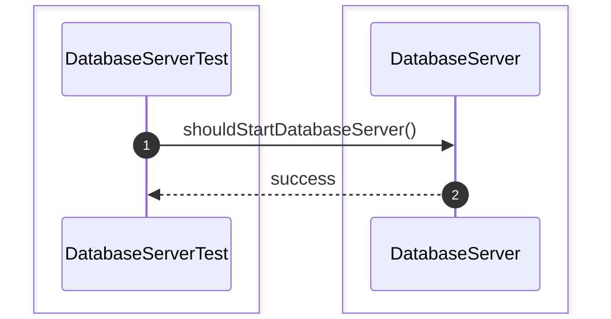
```mermaid
sequenceDiagram
    autonumber
    box #e1f5fe Test Suite
    participant Test as DatabaseServerTest
    end
    box #e3f2fd DatabaseServer Component
    participant DS as DatabaseServer
    end

    Test->>DS: shouldStartDatabaseServer()
    DS-->>Test: success
```

### 2. shouldStopDatabaseServer()

```mermaid
sequenceDiagram
    autonumber
    box #e1f5fe Test Suite
    participant Test as DatabaseServerTest
    end
    box #e3f2fd DatabaseServer Component
    participant DS as DatabaseServer
    end

    Test->>DS: shouldStopDatabaseServer()
    DS-->>Test: success
```

### 3. shouldRestartDatabaseServer()
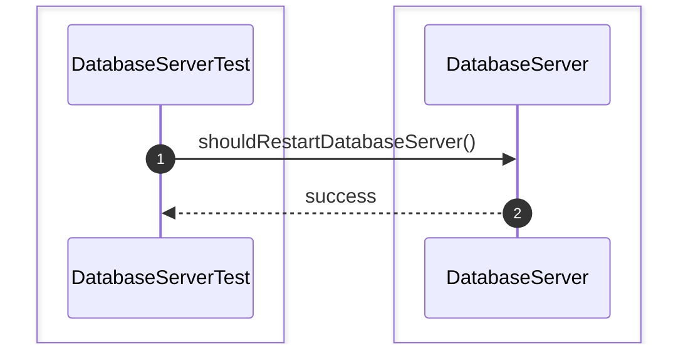
```mermaid
sequenceDiagram
    autonumber
    box #e1f5fe Test Suite
    participant Test as DatabaseServerTest
    end
    box #e3f2fd DatabaseServer Component
    participant DS as DatabaseServer
    end

    Test->>DS: shouldRestartDatabaseServer()
    DS-->>Test: success
```

### 4. shouldInitializeManagersOnStartup()
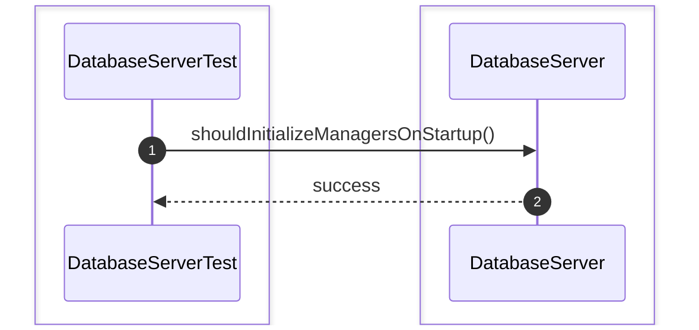
```mermaid
sequenceDiagram
    autonumber
    box #e1f5fe Test Suite
    participant Test as DatabaseServerTest
    end
    box #e3f2fd DatabaseServer Component
    participant DS as DatabaseServer
    end

    Test->>DS: shouldInitializeManagersOnStartup()
    DS-->>Test: success
```

### 5. shouldShutdownManagersGracefully()
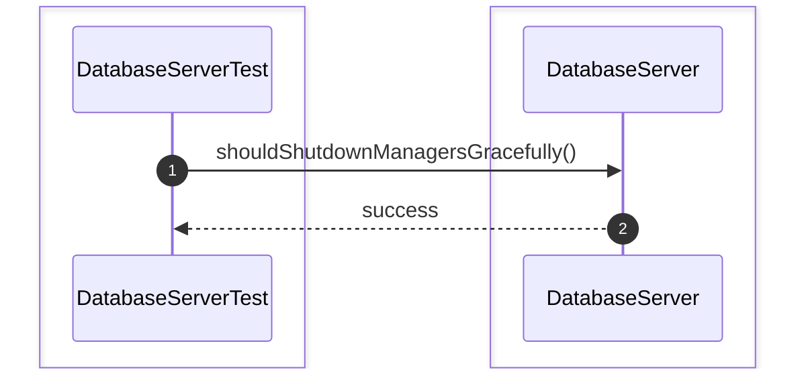
```mermaid
sequenceDiagram
    autonumber
    box #e1f5fe Test Suite
    participant Test as DatabaseServerTest
    end
    box #e3f2fd DatabaseServer Component
    participant DS as DatabaseServer
    end

    Test->>DS: shouldShutdownManagersGracefully()
    DS-->>Test: success
```

### 6. shouldAcceptClientConnection()
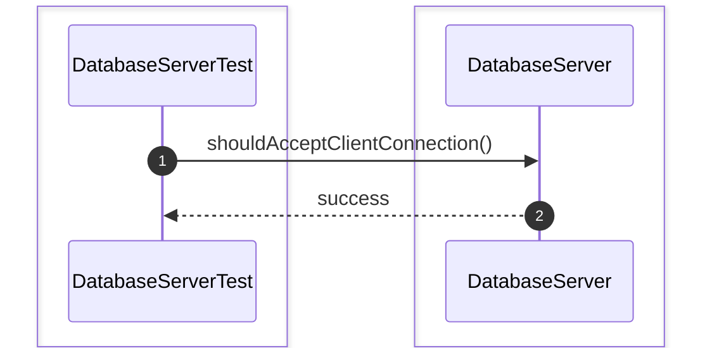
```mermaid
sequenceDiagram
    autonumber
    box #e1f5fe Test Suite
    participant Test as DatabaseServerTest
    end
    box #e3f2fd DatabaseServer Component
    participant DS as DatabaseServer
    end

    Test->>DS: shouldAcceptClientConnection()
    DS-->>Test: success
```

### 7. shouldRejectConnectionWhenStopped()
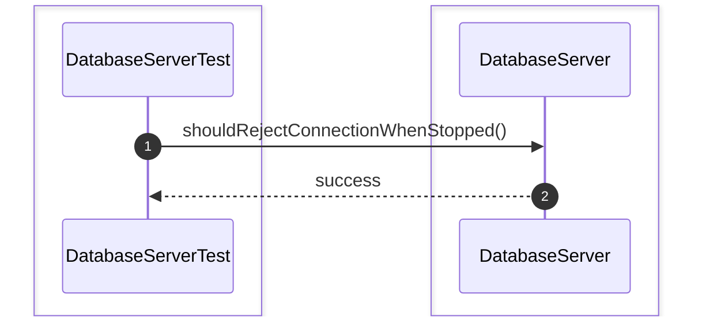
```mermaid
sequenceDiagram
    autonumber
    box #e1f5fe Test Suite
    participant Test as DatabaseServerTest
    end
    box #e3f2fd DatabaseServer Component
    participant DS as DatabaseServer
    end

    Test->>DS: shouldRejectConnectionWhenStopped()
    DS-->>Test: success
```

### 8. shouldTrackActiveConnections()

```mermaid
sequenceDiagram
    autonumber
    box #e1f5fe Test Suite
    participant Test as DatabaseServerTest
    end
    box #e3f2fd DatabaseServer Component
    participant DS as DatabaseServer
    end

    Test->>DS: shouldTrackActiveConnections()
    DS-->>Test: success
```

## DatabaseManagerTest

### 1. shouldCreateDatabase()
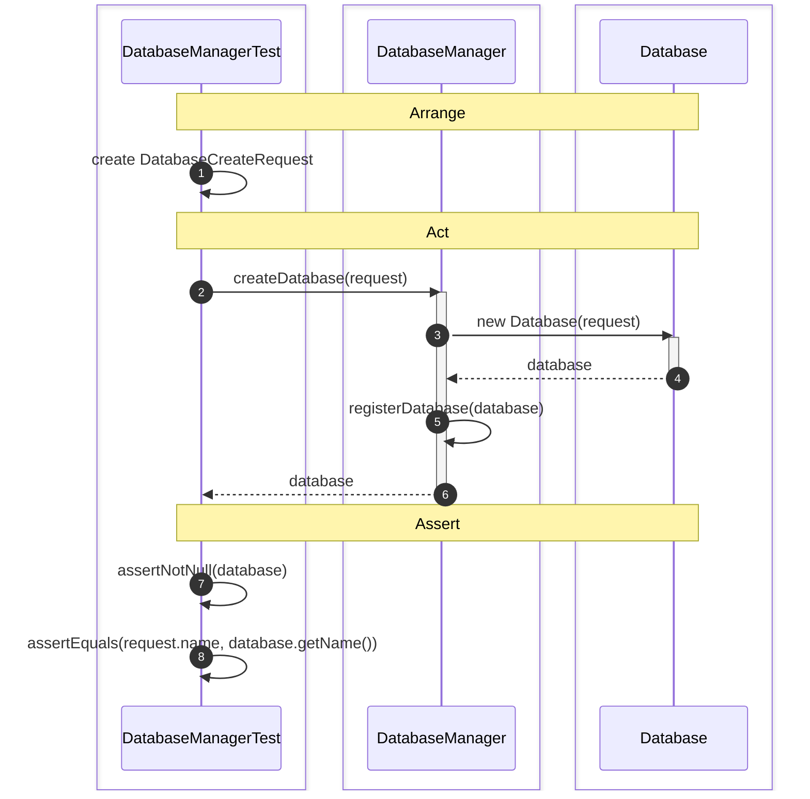
```mermaid
sequenceDiagram
    autonumber

    box #e1f5fe Test Suite
    participant Test as DatabaseManagerTest
    end

    box #e3f2fd Database Manager
    participant DM as DatabaseManager
    end

    box #e8f5e9 Domain
    participant DB as Database
    end

    Note over Test,DB: Arrange
    Test->>Test: create DatabaseCreateRequest

    Note over Test,DB: Act
    Test->>DM: createDatabase(request)

    activate DM

    DM->>DB: new Database(request)
    activate DB
    DB-->>DM: database
    deactivate DB

    DM->>DM: registerDatabase(database)

    DM-->>Test: database

    deactivate DM

    Note over Test,DB: Assert
    Test->>Test: assertNotNull(database)
    Test->>Test: assertEquals(request.name, database.getName())
```

### 2. shouldDropDatabase()
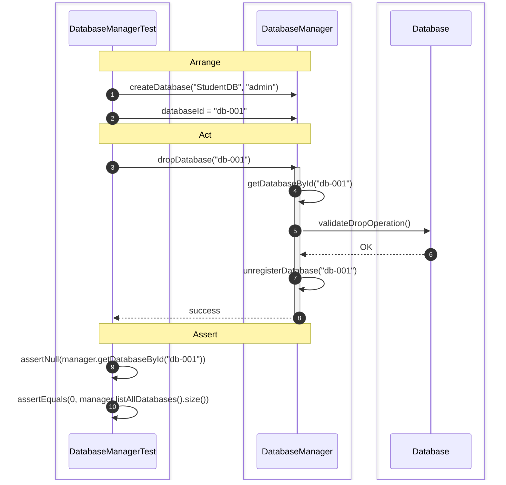
```mermaid
sequenceDiagram
    autonumber

    box #e1f5fe Test Suite
    participant Test as DatabaseManagerTest
    end

    box #e3f2fd DatabaseManager Component
    participant DM as DatabaseManager
    end

    box #e8f5e9 Domain Object
    participant DB as Database
    end

    Note over Test,DM: Arrange
    Test->>DM: createDatabase("StudentDB", "admin")
    Test->>DM: databaseId = "db-001"

    Note over Test,DM: Act
    Test->>DM: dropDatabase("db-001")

    activate DM

    DM->>DM: getDatabaseById("db-001")
    DM->>DB: validateDropOperation()

    DB-->>DM: OK

    DM->>DM: unregisterDatabase("db-001")

    DM-->>Test: success

    deactivate DM

    Note over Test,DM: Assert
    Test->>Test: assertNull(manager.getDatabaseById("db-001"))
    Test->>Test: assertEquals(0, manager.listAllDatabases().size())
```

### 3. shouldRenameDatabase()
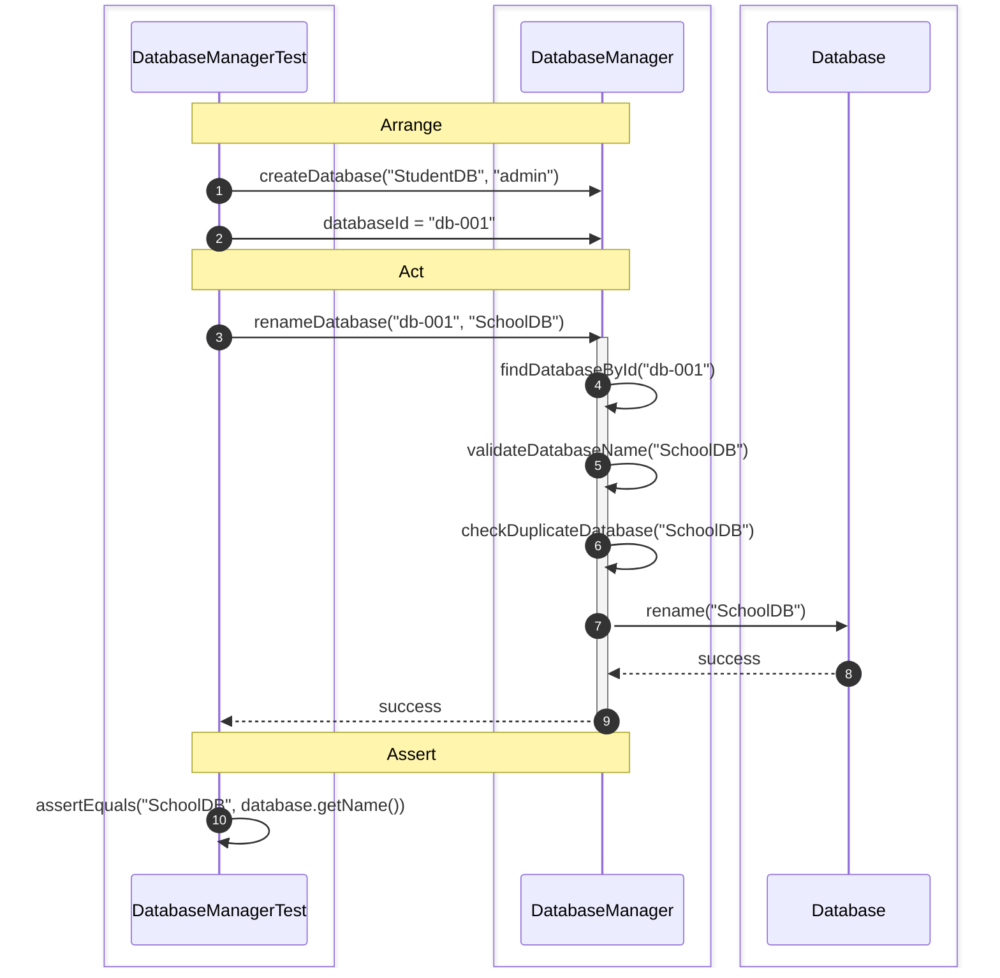
```mermaid
sequenceDiagram
    autonumber

    box #e1f5fe Test Suite
    participant Test as DatabaseManagerTest
    end

    box #e3f2fd DatabaseManager Component
    participant DM as DatabaseManager
    end

    box #e8f5e9 Domain Object
    participant DB as Database
    end

    Note over Test,DM: Arrange
    Test->>DM: createDatabase("StudentDB", "admin")
    Test->>DM: databaseId = "db-001"

    Note over Test,DM: Act
    Test->>DM: renameDatabase("db-001", "SchoolDB")

    activate DM

    DM->>DM: findDatabaseById("db-001")
    DM->>DM: validateDatabaseName("SchoolDB")
    DM->>DM: checkDuplicateDatabase("SchoolDB")

    DM->>DB: rename("SchoolDB")

    DB-->>DM: success

    DM-->>Test: success

    deactivate DM

    Note over Test,DM: Assert
    Test->>Test: assertEquals("SchoolDB", database.getName())
```

### 4. shouldGetDatabaseByName()
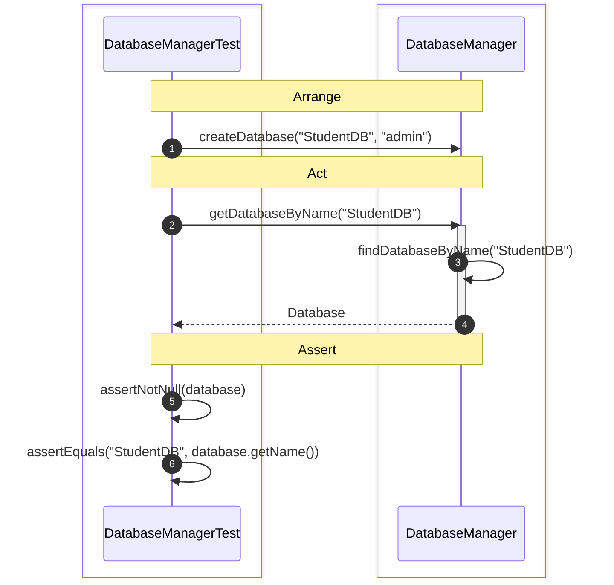
```mermaid
sequenceDiagram
    autonumber

    box #e1f5fe Test Suite
    participant Test as DatabaseManagerTest
    end

    box #e3f2fd DatabaseManager Component
    participant DM as DatabaseManager
    end

    Note over Test,DM: Arrange
    Test->>DM: createDatabase("StudentDB", "admin")

    Note over Test,DM: Act
    Test->>DM: getDatabaseByName("StudentDB")

    activate DM

    DM->>DM: findDatabaseByName("StudentDB")

    DM-->>Test: Database

    deactivate DM

    Note over Test,DM: Assert
    Test->>Test: assertNotNull(database)
    Test->>Test: assertEquals("StudentDB", database.getName())
```

### 5. shouldListAllDatabases()
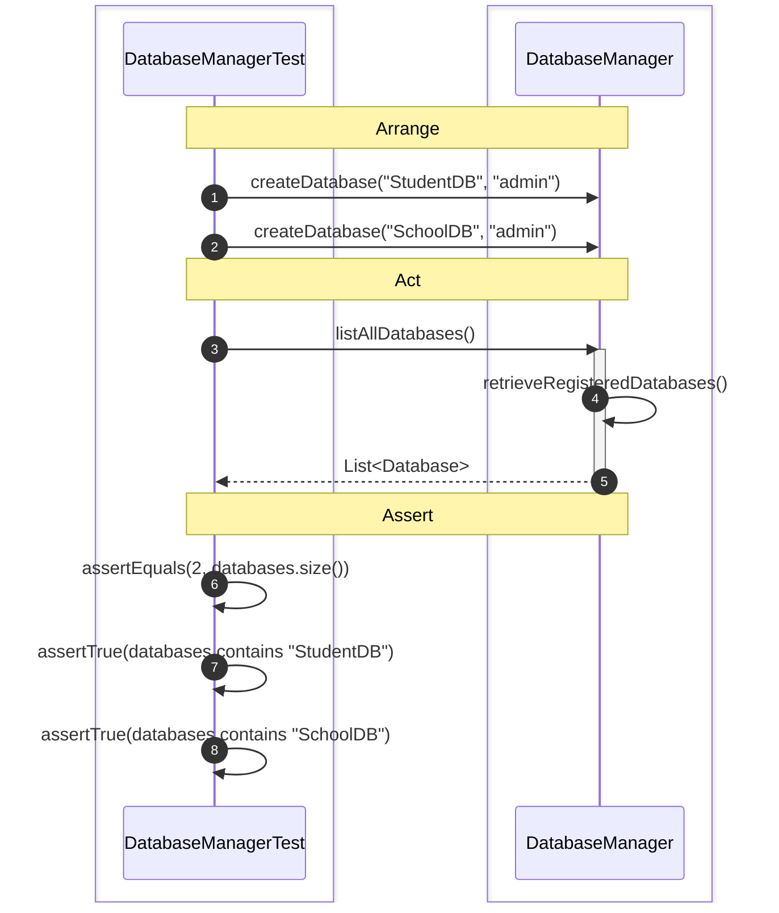
```mermaid
sequenceDiagram
    autonumber

    box #e1f5fe Test Suite
    participant Test as DatabaseManagerTest
    end

    box #e3f2fd DatabaseManager Component
    participant DM as DatabaseManager
    end

    Note over Test,DM: Arrange
    Test->>DM: createDatabase("StudentDB", "admin")
    Test->>DM: createDatabase("SchoolDB", "admin")

    Note over Test,DM: Act
    Test->>DM: listAllDatabases()

    activate DM

    DM->>DM: retrieveRegisteredDatabases()

    DM-->>Test: List<Database>

    deactivate DM

    Note over Test,DM: Assert
    Test->>Test: assertEquals(2, databases.size())
    Test->>Test: assertTrue(databases contains "StudentDB")
    Test->>Test: assertTrue(databases contains "SchoolDB")
```

### 6. shouldRejectDuplicateDatabaseName()
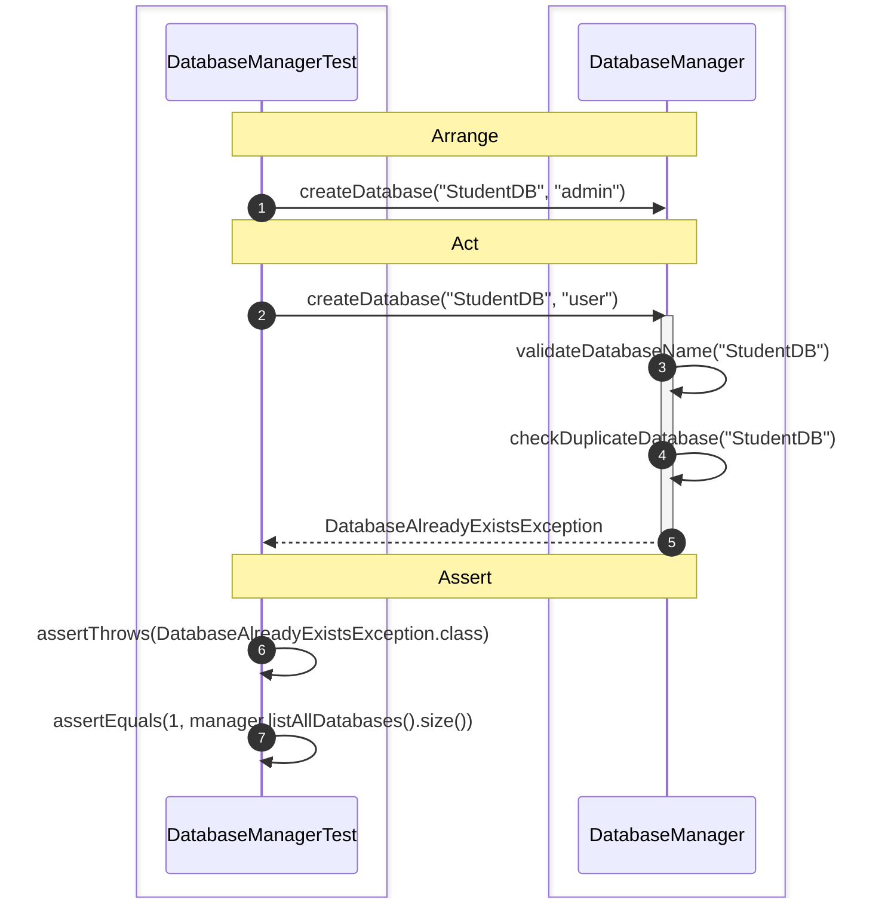
```mermaid
sequenceDiagram
    autonumber

    box #e1f5fe Test Suite
    participant Test as DatabaseManagerTest
    end

    box #e3f2fd DatabaseManager Component
    participant DM as DatabaseManager
    end

    Note over Test,DM: Arrange
    Test->>DM: createDatabase("StudentDB", "admin")

    Note over Test,DM: Act
    Test->>DM: createDatabase("StudentDB", "user")

    activate DM

    DM->>DM: validateDatabaseName("StudentDB")
    DM->>DM: checkDuplicateDatabase("StudentDB")

    DM-->>Test: DatabaseAlreadyExistsException

    deactivate DM

    Note over Test,DM: Assert
    Test->>Test: assertThrows(DatabaseAlreadyExistsException.class)
    Test->>Test: assertEquals(1, manager.listAllDatabases().size())
```

### 7. shouldRejectUnknownDatabase()
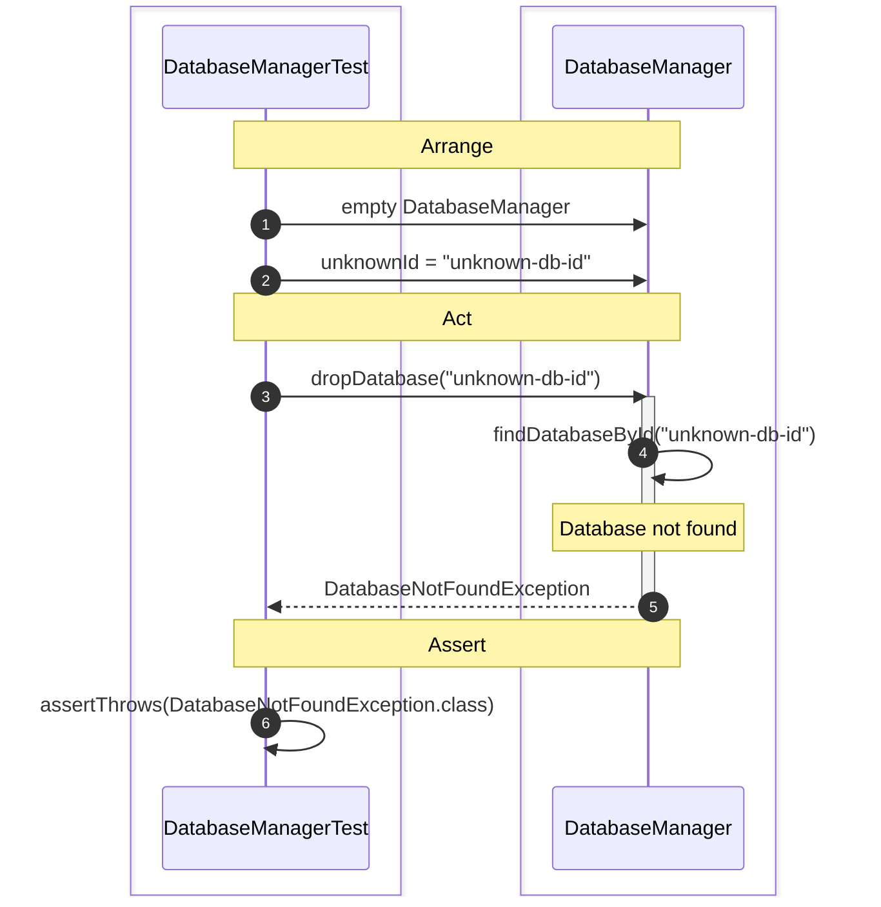
```mermaid
sequenceDiagram
    autonumber

    box #e1f5fe Test Suite
    participant Test as DatabaseManagerTest
    end

    box #e3f2fd DatabaseManager Component
    participant DM as DatabaseManager
    end

    Note over Test,DM: Arrange
    Test->>DM: empty DatabaseManager
    Test->>DM: unknownId = "unknown-db-id"

    Note over Test,DM: Act
    Test->>DM: dropDatabase("unknown-db-id")

    activate DM

    DM->>DM: findDatabaseById("unknown-db-id")
    Note over DM: Database not found

    DM-->>Test: DatabaseNotFoundException

    deactivate DM

    Note over Test,DM: Assert
    Test->>Test: assertThrows(DatabaseNotFoundException.class)
```

### 8. shouldIncreaseDatabaseCountAfterCreation()
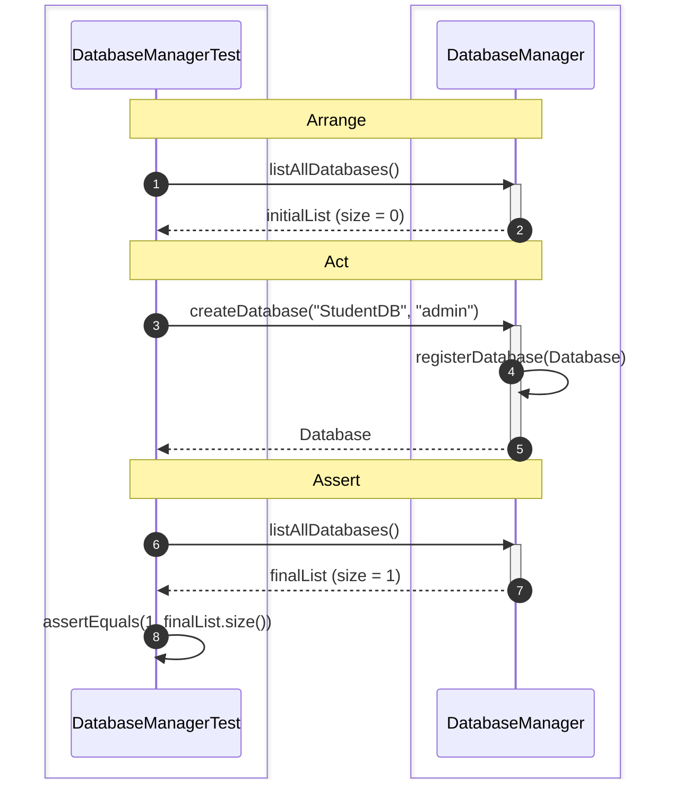
```mermaid
sequenceDiagram
    autonumber

    box #e1f5fe Test Suite
    participant Test as DatabaseManagerTest
    end

    box #e3f2fd DatabaseManager Component
    participant DM as DatabaseManager
    end

    Note over Test,DM: Arrange
    Test->>DM: listAllDatabases()
    activate DM
    DM-->>Test: initialList (size = 0)
    deactivate DM

    Note over Test,DM: Act
    Test->>DM: createDatabase("StudentDB", "admin")
    activate DM
    DM->>DM: registerDatabase(Database)
    DM-->>Test: Database
    deactivate DM

    Note over Test,DM: Assert
    Test->>DM: listAllDatabases()
    activate DM
    DM-->>Test: finalList (size = 1)
    deactivate DM
    Test->>Test: assertEquals(1, finalList.size())
```

### 9. shouldDecreaseDatabaseCountAfterDrop()
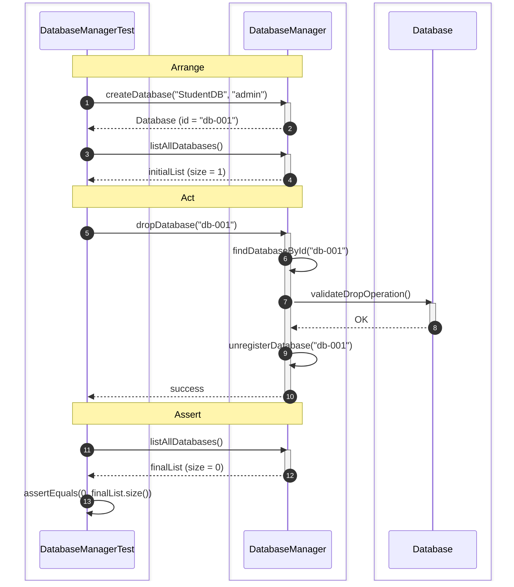
```mermaid
sequenceDiagram
    autonumber

    box #e1f5fe Test Suite
    participant Test as DatabaseManagerTest
    end

    box #e3f2fd DatabaseManager Component
    participant DM as DatabaseManager
    end

    box #e8f5e9 Domain Object
    participant DB as Database
    end

    Note over Test,DM: Arrange
    Test->>DM: createDatabase("StudentDB", "admin")
    activate DM
    DM-->>Test: Database (id = "db-001")
    deactivate DM
    Test->>DM: listAllDatabases()
    activate DM
    DM-->>Test: initialList (size = 1)
    deactivate DM

    Note over Test,DM: Act
    Test->>DM: dropDatabase("db-001")
    activate DM
    DM->>DM: findDatabaseById("db-001")
    DM->>DB: validateDropOperation()
    activate DB
    DB-->>DM: OK
    deactivate DB
    DM->>DM: unregisterDatabase("db-001")
    DM-->>Test: success
    deactivate DM

    Note over Test,DM: Assert
    Test->>DM: listAllDatabases()
    activate DM
    DM-->>Test: finalList (size = 0)
    deactivate DM
    Test->>Test: assertEquals(0, finalList.size())
```

### 10. shouldAssignUniqueDatabaseId()
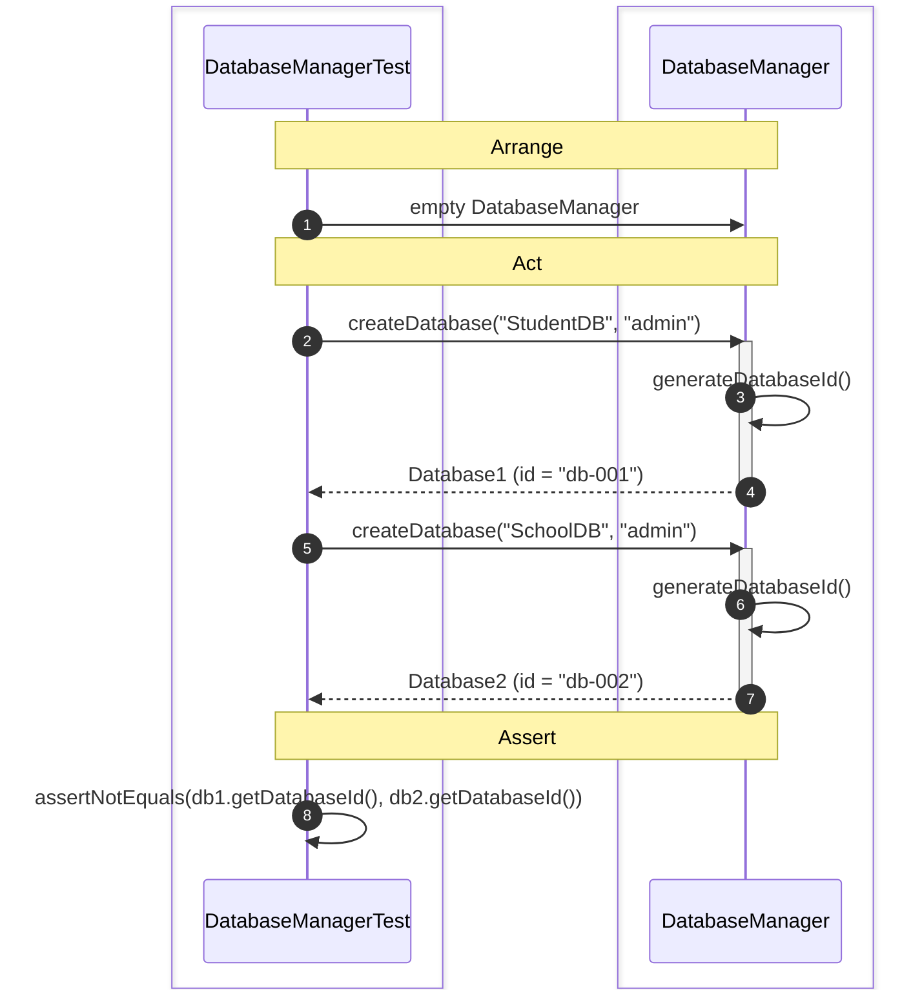
```mermaid
sequenceDiagram
    autonumber

    box #e1f5fe Test Suite
    participant Test as DatabaseManagerTest
    end

    box #e3f2fd DatabaseManager Component
    participant DM as DatabaseManager
    end

    Note over Test,DM: Arrange
    Test->>DM: empty DatabaseManager

    Note over Test,DM: Act
    Test->>DM: createDatabase("StudentDB", "admin")
    activate DM
    DM->>DM: generateDatabaseId()
    DM-->>Test: Database1 (id = "db-001")
    deactivate DM

    Test->>DM: createDatabase("SchoolDB", "admin")
    activate DM
    DM->>DM: generateDatabaseId()
    DM-->>Test: Database2 (id = "db-002")
    deactivate DM

    Note over Test,DM: Assert
    Test->>Test: assertNotEquals(db1.getDatabaseId(), db2.getDatabaseId())
```

## ConfigurationRepositoryTest

### 1. shouldSaveConfigurationToDisk()
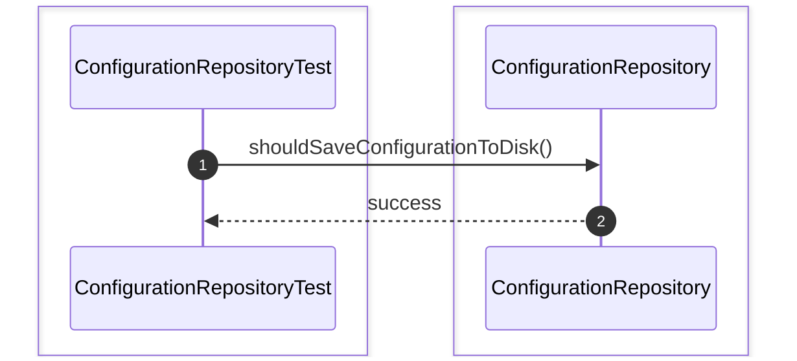
```mermaid
sequenceDiagram
    autonumber
    box #e1f5fe Test Suite
    participant Test as ConfigurationRepositoryTest
    end
    box #e3f2fd ConfigurationRepository Component
    participant CR as ConfigurationRepository
    end

    Test->>CR: shouldSaveConfigurationToDisk()
    CR-->>Test: success
```

## SecurityManagerTest

### 1. shouldInitializeSecurityManager()
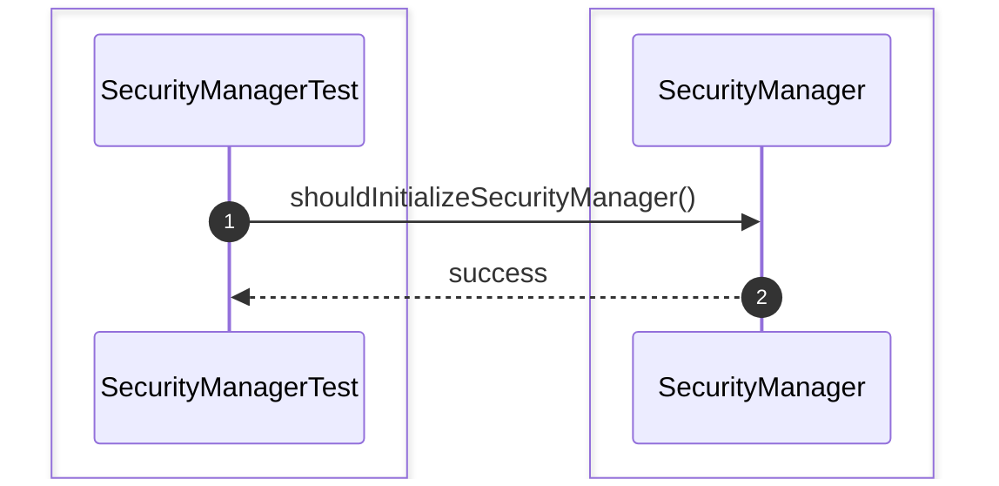
```mermaid
sequenceDiagram
    autonumber
    box #e1f5fe Test Suite
    participant Test as SecurityManagerTest
    end
    box #e3f2fd SecurityManager Component
    participant SM as SecurityManager
    end

    Test->>SM: shouldInitializeSecurityManager()
    SM-->>Test: success
```

### 2. shouldAuthenticateUser()
```mermaid
sequenceDiagram
    autonumber
    box #e1f5fe Test Suite
    participant Test as SecurityManagerTest
    end
    box #e3f2fd SecurityManager Component
    participant SM as SecurityManager
    end

    Test->>SM: shouldAuthenticateUser()
    SM-->>Test: success
```

### 3. shouldRejectInvalidCredential()
```mermaid
sequenceDiagram
    autonumber
    box #e1f5fe Test Suite
    participant Test as SecurityManagerTest
    end
    box #e3f2fd SecurityManager Component
    participant SM as SecurityManager
    end

    Test->>SM: shouldRejectInvalidCredential()
    SM-->>Test: success
```

### 4. shouldAuthorizeUser()
```mermaid
sequenceDiagram
    autonumber
    box #e1f5fe Test Suite
    participant Test as SecurityManagerTest
    end
    box #e3f2fd SecurityManager Component
    participant SM as SecurityManager
    end

    Test->>SM: shouldAuthorizeUser()
    SM-->>Test: success
```

### 5. shouldGrantPermission()
```mermaid
sequenceDiagram
    autonumber
    box #e1f5fe Test Suite
    participant Test as SecurityManagerTest
    end
    box #e3f2fd SecurityManager Component
    participant SM as SecurityManager
    end

    Test->>SM: shouldGrantPermission()
    SM-->>Test: success
```

### 6. shouldRevokePermission()
```mermaid
sequenceDiagram
    autonumber
    box #e1f5fe Test Suite
    participant Test as SecurityManagerTest
    end
    box #e3f2fd SecurityManager Component
    participant SM as SecurityManager
    end

    Test->>SM: shouldRevokePermission()
    SM-->>Test: success
```

## SecurityValidatorTest

### 1. shouldRejectInvalidPassword()
```mermaid
sequenceDiagram
    autonumber
    box #e1f5fe Test Suite
    participant Test as SecurityValidatorTest
    end
    box #e3f2fd SecurityValidator Component
    participant SV as SecurityValidator
    end

    Test->>SV: shouldRejectInvalidPassword()
    SV-->>Test: success
```

### 2. shouldRejectLockedUser()
```mermaid
sequenceDiagram
    autonumber
    box #e1f5fe Test Suite
    participant Test as SecurityValidatorTest
    end
    box #e3f2fd SecurityValidator Component
    participant SV as SecurityValidator
    end

    Test->>SV: shouldRejectLockedUser()
    SV-->>Test: success
```

### 3. shouldRejectDisabledUser()
```mermaid
sequenceDiagram
    autonumber
    box #e1f5fe Test Suite
    participant Test as SecurityValidatorTest
    end
    box #e3f2fd SecurityValidator Component
    participant SV as SecurityValidator
    end

    Test->>SV: shouldRejectDisabledUser()
    SV-->>Test: success
```

### 4. shouldCheckRolePermission()
```mermaid
sequenceDiagram
    autonumber
    box #e1f5fe Test Suite
    participant Test as SecurityValidatorTest
    end
    box #e3f2fd SecurityValidator Component
    participant SV as SecurityValidator
    end

    Test->>SV: shouldCheckRolePermission()
    SV-->>Test: success
```

### 5. shouldGrantRolePermission()
```mermaid
sequenceDiagram
    autonumber
    box #e1f5fe Test Suite
    participant Test as SecurityValidatorTest
    end
    box #e3f2fd SecurityValidator Component
    participant SV as SecurityValidator
    end

    Test->>SV: shouldGrantRolePermission()
    SV-->>Test: success
```

### 6. shouldVerifyPermissionInheritance()
```mermaid
sequenceDiagram
    autonumber
    box #e1f5fe Test Suite
    participant Test as SecurityValidatorTest
    end
    box #e3f2fd SecurityValidator Component
    participant SV as SecurityValidator
    end

    Test->>SV: shouldVerifyPermissionInheritance()
    SV-->>Test: success
```

## MonitoringManagerTest

### 1. shouldCollectServerMetrics()
```mermaid
sequenceDiagram
    autonumber
    box #e1f5fe Test Suite
    participant Test as MonitoringManagerTest
    end
    box #e3f2fd MonitoringManager Component
    participant MM as MonitoringManager
    end

    Test->>MM: shouldCollectServerMetrics()
    MM-->>Test: success
```

### 2. shouldCollectMemoryUsage()
```mermaid
sequenceDiagram
    autonumber
    box #e1f5fe Test Suite
    participant Test as MonitoringManagerTest
    end
    box #e3f2fd MonitoringManager Component
    participant MM as MonitoringManager
    end

    Test->>MM: shouldCollectMemoryUsage()
    MM-->>Test: success
```

### 3. shouldCollectCPUUsage()
```mermaid
sequenceDiagram
    autonumber
    box #e1f5fe Test Suite
    participant Test as MonitoringManagerTest
    end
    box #e3f2fd MonitoringManager Component
    participant MM as MonitoringManager
    end

    Test->>MM: shouldCollectCPUUsage()
    MM-->>Test: success
```

### 4. shouldCollectDiskUsage()
```mermaid
sequenceDiagram
    autonumber
    box #e1f5fe Test Suite
    participant Test as MonitoringManagerTest
    end
    box #e3f2fd MonitoringManager Component
    participant MM as MonitoringManager
    end

    Test->>MM: shouldCollectDiskUsage()
    MM-->>Test: success
```

### 5. shouldCollectConnectionStatistics()
```mermaid
sequenceDiagram
    autonumber
    box #e1f5fe Test Suite
    participant Test as MonitoringManagerTest
    end
    box #e3f2fd MonitoringManager Component
    participant MM as MonitoringManager
    end

    Test->>MM: shouldCollectConnectionStatistics()
    MM-->>Test: success
```

### 6. shouldReportServerStatus()
```mermaid
sequenceDiagram
    autonumber
    box #e1f5fe Test Suite
    participant Test as MonitoringManagerTest
    end
    box #e3f2fd MonitoringManager Component
    participant MM as MonitoringManager
    end

    Test->>MM: shouldReportServerStatus()
    MM-->>Test: success
```

### 7. shouldReportDatabaseStatistics()
```mermaid
sequenceDiagram
    autonumber
    box #e1f5fe Test Suite
    participant Test as MonitoringManagerTest
    end
    box #e3f2fd MonitoringManager Component
    participant MM as MonitoringManager
    end

    Test->>MM: shouldReportDatabaseStatistics()
    MM-->>Test: success
```

### 8. shouldResetStatistics()
```mermaid
sequenceDiagram
    autonumber
    box #e1f5fe Test Suite
    participant Test as MonitoringManagerTest
    end
    box #e3f2fd MonitoringManager Component
    participant MM as MonitoringManager
    end

    Test->>MM: shouldResetStatistics()
    MM-->>Test: success
```

# Database Server Unit Test

### 1. shouldStartEntireDatabaseServer()
```mermaid
sequenceDiagram
    autonumber
    box #e1f5fe Test Suite
    participant Test as DatabaseServerModuleIntegrationTest
    end
    box #e3f2fd Database Server Module Components
    participant System as System
    end

    Test->>System: shouldStartEntireDatabaseServer()
    System-->>Test: success
```

### 2. shouldInitializeAllManagers()
```mermaid
sequenceDiagram
    autonumber
    box #e1f5fe Test Suite
    participant Test as DatabaseServerModuleIntegrationTest
    end
    box #e3f2fd Database Server Module Components
    participant System as System
    end

    Test->>System: shouldInitializeAllManagers()
    System-->>Test: success
```

### 3. shouldCreateDatabaseThroughServer()
```mermaid
sequenceDiagram
    autonumber
    box #e1f5fe Test Suite
    participant Test as DatabaseServerModuleIntegrationTest
    end
    box #e3f2fd Database Server Module Components
    participant System as System
    end

    Test->>System: shouldCreateDatabaseThroughServer()
    System-->>Test: success
```

### 4. shouldOpenExistingDatabase()
```mermaid
sequenceDiagram
    autonumber
    box #e1f5fe Test Suite
    participant Test as DatabaseServerModuleIntegrationTest
    end
    box #e3f2fd Database Server Module Components
    participant System as System
    end

    Test->>System: shouldOpenExistingDatabase()
    System-->>Test: success
```

### 5. shouldShutdownServerGracefully()
```mermaid
sequenceDiagram
    autonumber
    box #e1f5fe Test Suite
    participant Test as DatabaseServerModuleIntegrationTest
    end
    box #e3f2fd Database Server Module Components
    participant System as System
    end

    Test->>System: shouldShutdownServerGracefully()
    System-->>Test: success
```

### 6. shouldRestartServerWithoutDataLoss()
```mermaid
sequenceDiagram
    autonumber
    box #e1f5fe Test Suite
    participant Test as DatabaseServerModuleIntegrationTest
    end
    box #e3f2fd Database Server Module Components
    participant System as System
    end

    Test->>System: shouldRestartServerWithoutDataLoss()
    System-->>Test: success
```

### 7. shouldRejectDatabaseOperationWhenServerStopped()
```mermaid
sequenceDiagram
    autonumber
    box #e1f5fe Test Suite
    participant Test as DatabaseServerModuleIntegrationTest
    end
    box #e3f2fd Database Server Module Components
    participant System as System
    end

    Test->>System: shouldRejectDatabaseOperationWhenServerStopped()
    System-->>Test: success
```
