Query Processing Module Unit Test

## SQLParserTest

### 1. shouldParseValidSQL()
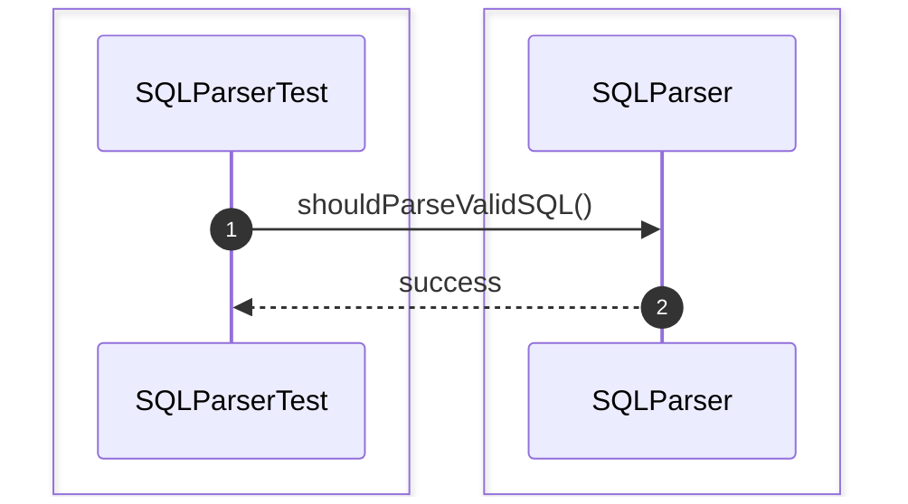

### 2. shouldParseSelectStatement()
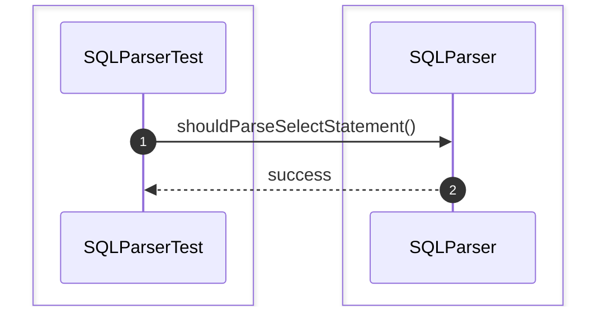

### 3. shouldParseInsertStatement()
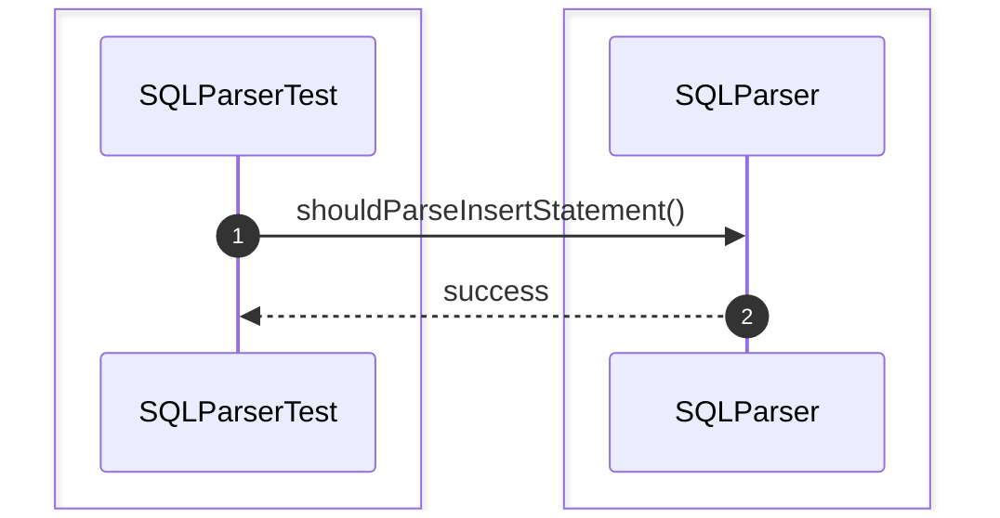

### 4. shouldParseUpdateStatement()


### 5. shouldParseDeleteStatement()


### 6. shouldParseCreateTableStatement()
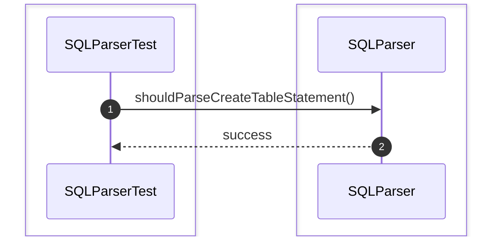

### 7. shouldParseDropTableStatement()
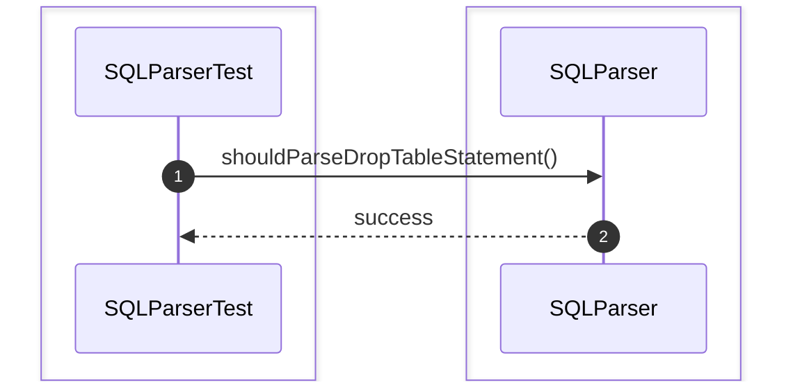

### 8. shouldTokenizeSQL()
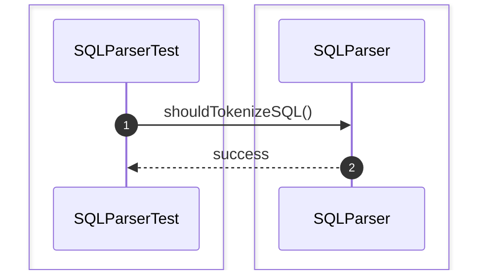

### 9. shouldValidateSQLSyntax()


### 10. shouldRejectInvalidSQLSyntax()
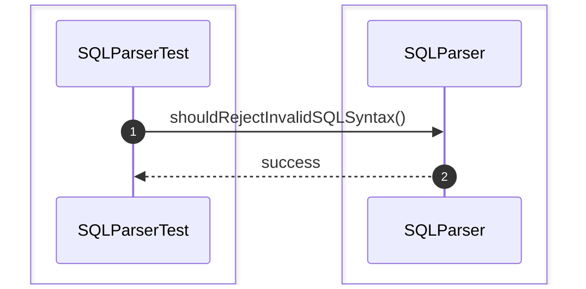

### 11. shouldRejectUnsupportedSQL()
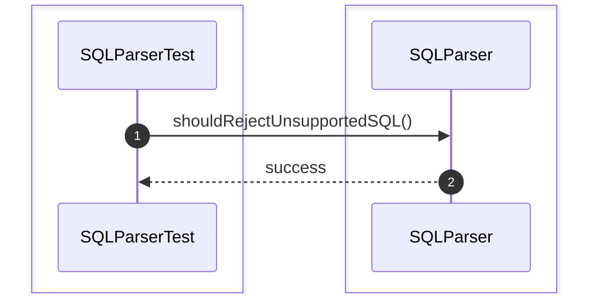

### 12. shouldHandleNestedQuery()
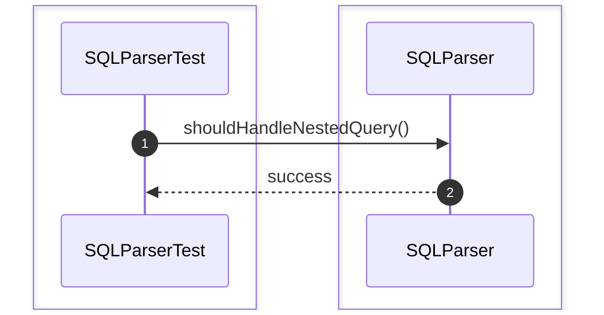

### 13. shouldHandleAlias()
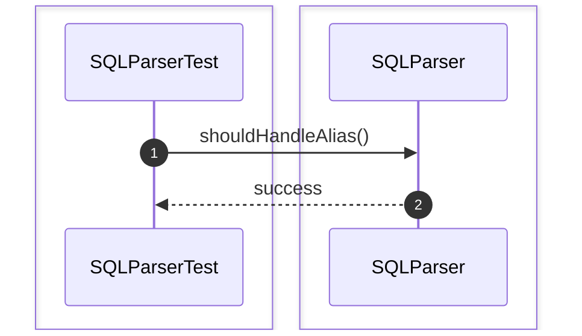

### 14. shouldHandleJoinClause()
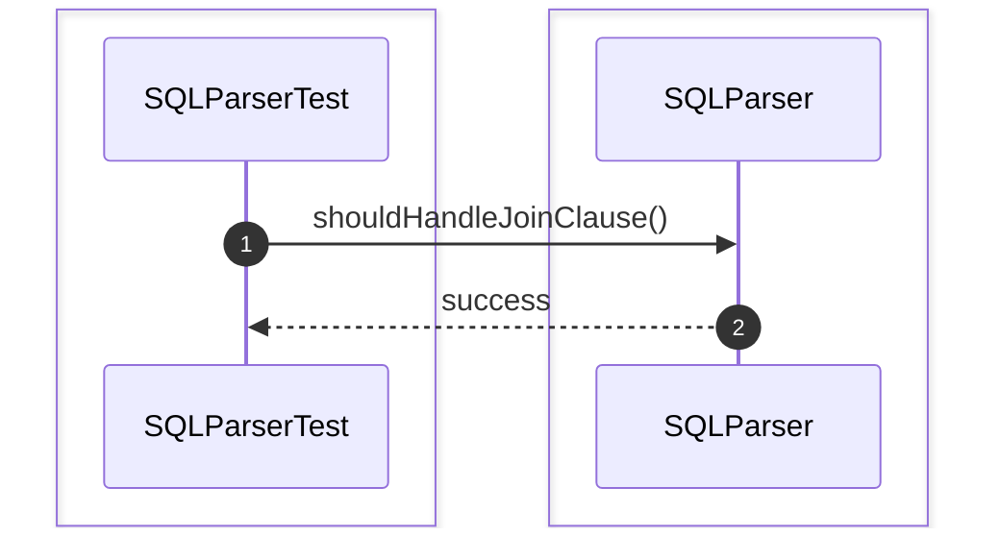

### 15. shouldHandleGroupByClause()
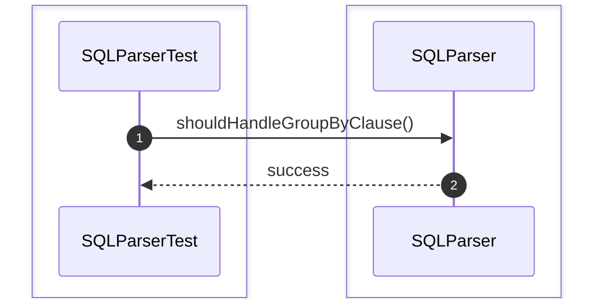

### 16. shouldHandleOrderByClause()
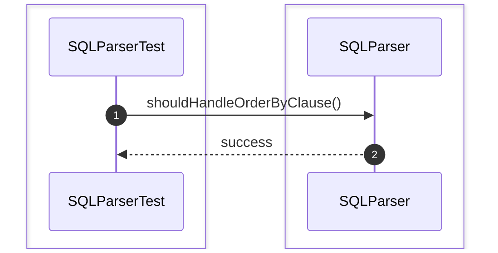

### 17. shouldHandleLimitClause()
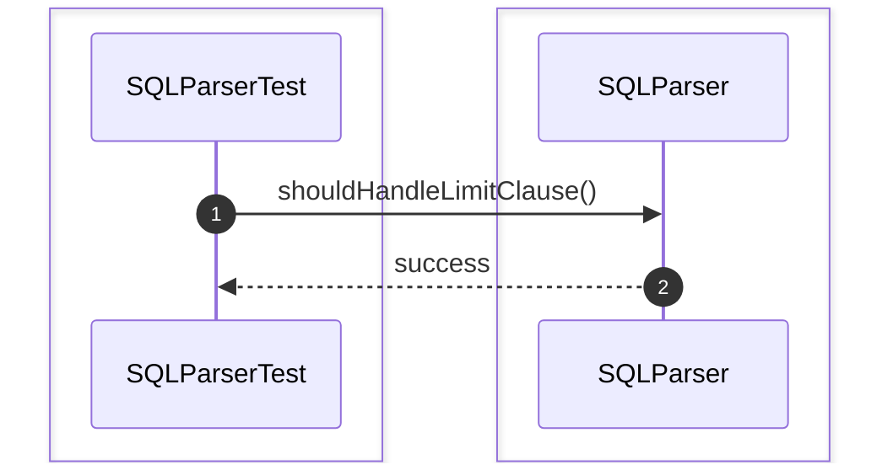

## LexerTest

### 1. shouldTokenizeSQLStatement()
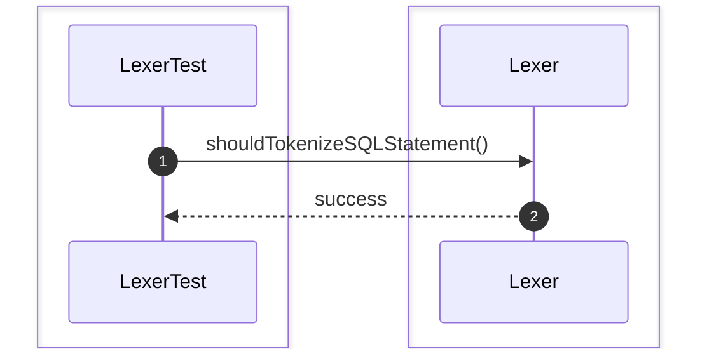

### 2. shouldIgnoreWhitespace()
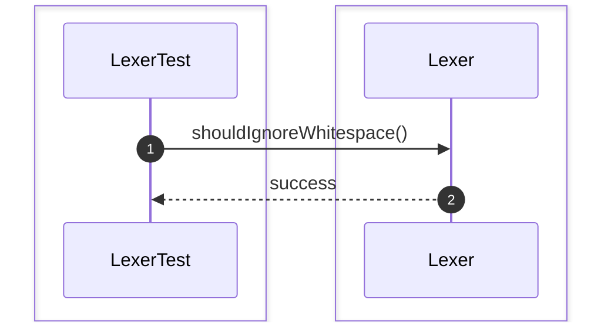

### 3. shouldIgnoreComments()
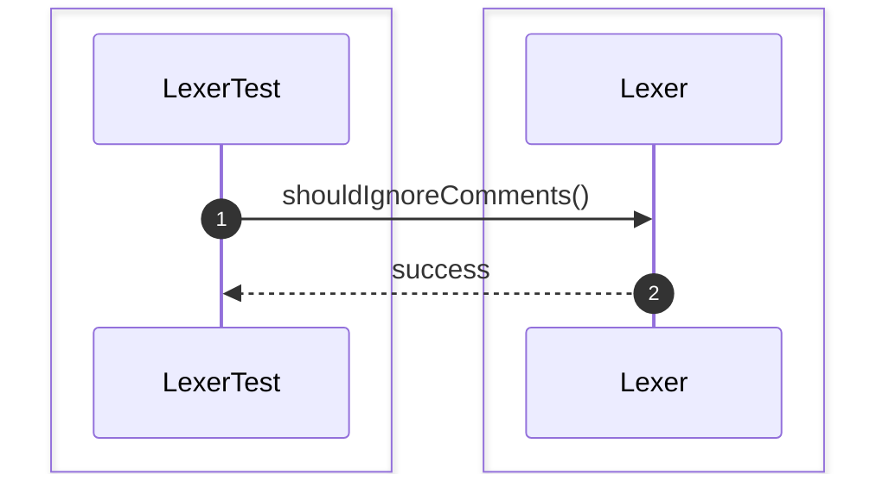

### 4. shouldRecognizeKeywords()
```mermaid
sequenceDiagram
    autonumber
    box #e1f5fe Test Suite
    participant Test as LexerTest
    end
    box #fff8e1 Lexer Component
    participant L as Lexer
    end

    Test->>L: shouldRecognizeKeywords()
    L-->>Test: success
```

### 5. shouldRecognizeIdentifiers()
```mermaid
sequenceDiagram
    autonumber
    box #e1f5fe Test Suite
    participant Test as LexerTest
    end
    box #fff8e1 Lexer Component
    participant L as Lexer
    end

    Test->>L: shouldRecognizeIdentifiers()
    L-->>Test: success
```

### 6. shouldRecognizeOperators()
```mermaid
sequenceDiagram
    autonumber
    box #e1f5fe Test Suite
    participant Test as LexerTest
    end
    box #fff8e1 Lexer Component
    participant L as Lexer
    end

    Test->>L: shouldRecognizeOperators()
    L-->>Test: success
```

### 7. shouldRecognizeNumbers()
```mermaid
sequenceDiagram
    autonumber
    box #e1f5fe Test Suite
    participant Test as LexerTest
    end
    box #fff8e1 Lexer Component
    participant L as Lexer
    end

    Test->>L: shouldRecognizeNumbers()
    L-->>Test: success
```

### 8. shouldRecognizeStringLiteral()
```mermaid
sequenceDiagram
    autonumber
    box #e1f5fe Test Suite
    participant Test as LexerTest
    end
    box #fff8e1 Lexer Component
    participant L as Lexer
    end

    Test->>L: shouldRecognizeStringLiteral()
    L-->>Test: success
```

### 9. shouldRecognizeBooleanLiteral()
```mermaid
sequenceDiagram
    autonumber
    box #e1f5fe Test Suite
    participant Test as LexerTest
    end
    box #fff8e1 Lexer Component
    participant L as Lexer
    end

    Test->>L: shouldRecognizeBooleanLiteral()
    L-->>Test: success
```

### 10. shouldRecognizeDelimiter()
```mermaid
sequenceDiagram
    autonumber
    box #e1f5fe Test Suite
    participant Test as LexerTest
    end
    box #fff8e1 Lexer Component
    participant L as Lexer
    end

    Test->>L: shouldRecognizeDelimiter()
    L-->>Test: success
```

## ASTTest

### 1. shouldBuildASTFromSQL()
```mermaid
sequenceDiagram
    autonumber
    box #e1f5fe Test Suite
    participant Test as ASTTest
    end
    box #fff8e1 AST Component
    participant AST as AST
    end

    Test->>AST: shouldBuildASTFromSQL()
    AST-->>Test: success
```

### 2. shouldStoreASTRootNode()
```mermaid
sequenceDiagram
    autonumber
    box #e1f5fe Test Suite
    participant Test as ASTTest
    end
    box #fff8e1 AST Component
    participant AST as AST
    end

    Test->>AST: shouldStoreASTRootNode()
    AST-->>Test: success
```

### 3. shouldBuildSelectNode()
```mermaid
sequenceDiagram
    autonumber
    box #e1f5fe Test Suite
    participant Test as ASTTest
    end
    box #fff8e1 AST Component
    participant AST as AST
    end

    Test->>AST: shouldBuildSelectNode()
    AST-->>Test: success
```

### 4. shouldBuildInsertNode()
```mermaid
sequenceDiagram
    autonumber
    box #e1f5fe Test Suite
    participant Test as ASTTest
    end
    box #fff8e1 AST Component
    participant AST as AST
    end

    Test->>AST: shouldBuildInsertNode()
    AST-->>Test: success
```

### 5. shouldBuildUpdateNode()
```mermaid
sequenceDiagram
    autonumber
    box #e1f5fe Test Suite
    participant Test as ASTTest
    end
    box #fff8e1 AST Component
    participant AST as AST
    end

    Test->>AST: shouldBuildUpdateNode()
    AST-->>Test: success
```

### 6. shouldBuildDeleteNode()
```mermaid
sequenceDiagram
    autonumber
    box #e1f5fe Test Suite
    participant Test as ASTTest
    end
    box #fff8e1 AST Component
    participant AST as AST
    end

    Test->>AST: shouldBuildDeleteNode()
    AST-->>Test: success
```

### 7. shouldBuildJoinNode()
```mermaid
sequenceDiagram
    autonumber
    box #e1f5fe Test Suite
    participant Test as ASTTest
    end
    box #fff8e1 AST Component
    participant AST as AST
    end

    Test->>AST: shouldBuildJoinNode()
    AST-->>Test: success
```

### 8. shouldBuildWhereNode()
```mermaid
sequenceDiagram
    autonumber
    box #e1f5fe Test Suite
    participant Test as ASTTest
    end
    box #fff8e1 AST Component
    participant AST as AST
    end

    Test->>AST: shouldBuildWhereNode()
    AST-->>Test: success
```

### 9. shouldBuildGroupByNode()
```mermaid
sequenceDiagram
    autonumber
    box #e1f5fe Test Suite
    participant Test as ASTTest
    end
    box #fff8e1 AST Component
    participant AST as AST
    end

    Test->>AST: shouldBuildGroupByNode()
    AST-->>Test: success
```

### 10. shouldBuildOrderByNode()
```mermaid
sequenceDiagram
    autonumber
    box #e1f5fe Test Suite
    participant Test as ASTTest
    end
    box #fff8e1 AST Component
    participant AST as AST
    end

    Test->>AST: shouldBuildOrderByNode()
    AST-->>Test: success
```

## LogicalPlanTest

### 1. shouldCreateLogicalPlan()
```mermaid
sequenceDiagram
    autonumber
    box #e1f5fe Test Suite
    participant Test as LogicalPlanTest
    end
    box #fff8e1 LogicalPlan Component
    participant LP as LogicalPlan
    end

    Test->>LP: shouldCreateLogicalPlan()
    LP-->>Test: success
```

### 2. shouldAddLogicalOperators()
```mermaid
sequenceDiagram
    autonumber
    box #e1f5fe Test Suite
    participant Test as LogicalPlanTest
    end
    box #fff8e1 LogicalPlan Component
    participant LP as LogicalPlan
    end

    Test->>LP: shouldAddLogicalOperators()
    LP-->>Test: success
```

### 3. shouldCreateScanOperator()
```mermaid
sequenceDiagram
    autonumber
    box #e1f5fe Test Suite
    participant Test as LogicalPlanTest
    end
    box #fff8e1 LogicalPlan Component
    participant LP as LogicalPlan
    end

    Test->>LP: shouldCreateScanOperator()
    LP-->>Test: success
```

### 4. shouldCreateFilterOperator()
```mermaid
sequenceDiagram
    autonumber
    box #e1f5fe Test Suite
    participant Test as LogicalPlanTest
    end
    box #fff8e1 LogicalPlan Component
    participant LP as LogicalPlan
    end

    Test->>LP: shouldCreateFilterOperator()
    LP-->>Test: success
```

### 5. shouldCreateProjectionOperator()
```mermaid
sequenceDiagram
    autonumber
    box #e1f5fe Test Suite
    participant Test as LogicalPlanTest
    end
    box #fff8e1 LogicalPlan Component
    participant LP as LogicalPlan
    end

    Test->>LP: shouldCreateProjectionOperator()
    LP-->>Test: success
```

### 6. shouldCreateJoinOperator()
```mermaid
sequenceDiagram
    autonumber
    box #e1f5fe Test Suite
    participant Test as LogicalPlanTest
    end
    box #fff8e1 LogicalPlan Component
    participant LP as LogicalPlan
    end

    Test->>LP: shouldCreateJoinOperator()
    LP-->>Test: success
```

### 7. shouldCreateAggregationOperator()
```mermaid
sequenceDiagram
    autonumber
    box #e1f5fe Test Suite
    participant Test as LogicalPlanTest
    end
    box #fff8e1 LogicalPlan Component
    participant LP as LogicalPlan
    end

    Test->>LP: shouldCreateAggregationOperator()
    LP-->>Test: success
```

### 8. shouldCreateSortOperator()
```mermaid
sequenceDiagram
    autonumber
    box #e1f5fe Test Suite
    participant Test as LogicalPlanTest
    end
    box #fff8e1 LogicalPlan Component
    participant LP as LogicalPlan
    end

    Test->>LP: shouldCreateSortOperator()
    LP-->>Test: success
```

### 9. shouldCreateLimitOperator()
```mermaid
sequenceDiagram
    autonumber
    box #e1f5fe Test Suite
    participant Test as LogicalPlanTest
    end
    box #fff8e1 LogicalPlan Component
    participant LP as LogicalPlan
    end

    Test->>LP: shouldCreateLimitOperator()
    LP-->>Test: success
```

### 10. shouldLinkLogicalOperators()
```mermaid
sequenceDiagram
    autonumber
    box #e1f5fe Test Suite
    participant Test as LogicalPlanTest
    end
    box #fff8e1 LogicalPlan Component
    participant LP as LogicalPlan
    end

    Test->>LP: shouldLinkLogicalOperators()
    LP-->>Test: success
```

## QueryOptimizerTest

### 1. shouldOptimizeLogicalPlan()
```mermaid
sequenceDiagram
    autonumber
    box #e1f5fe Test Suite
    participant Test as QueryOptimizerTest
    end
    box #fff8e1 QueryOptimizer Component
    participant QO as QueryOptimizer
    end

    Test->>QO: shouldOptimizeLogicalPlan()
    QO-->>Test: success
```

### 2. shouldEstimateQueryCost()
```mermaid
sequenceDiagram
    autonumber
    box #e1f5fe Test Suite
    participant Test as QueryOptimizerTest
    end
    box #fff8e1 QueryOptimizer Component
    participant QO as QueryOptimizer
    end

    Test->>QO: shouldEstimateQueryCost()
    QO-->>Test: success
```

### 3. shouldChooseJoinOrder()
```mermaid
sequenceDiagram
    autonumber
    box #e1f5fe Test Suite
    participant Test as QueryOptimizerTest
    end
    box #fff8e1 QueryOptimizer Component
    participant QO as QueryOptimizer
    end

    Test->>QO: shouldChooseJoinOrder()
    QO-->>Test: success
```

### 4. shouldGeneratePhysicalPlan()
```mermaid
sequenceDiagram
    autonumber
    box #e1f5fe Test Suite
    participant Test as QueryOptimizerTest
    end
    box #fff8e1 QueryOptimizer Component
    participant QO as QueryOptimizer
    end

    Test->>QO: shouldGeneratePhysicalPlan()
    QO-->>Test: success
```

### 5. shouldPushDownPredicate()
```mermaid
sequenceDiagram
    autonumber
    box #e1f5fe Test Suite
    participant Test as QueryOptimizerTest
    end
    box #fff8e1 QueryOptimizer Component
    participant QO as QueryOptimizer
    end

    Test->>QO: shouldPushDownPredicate()
    QO-->>Test: success
```

### 6. shouldEliminateUnusedProjection()
```mermaid
sequenceDiagram
    autonumber
    box #e1f5fe Test Suite
    participant Test as QueryOptimizerTest
    end
    box #fff8e1 QueryOptimizer Component
    participant QO as QueryOptimizer
    end

    Test->>QO: shouldEliminateUnusedProjection()
    QO-->>Test: success
```

### 7. shouldSimplifyExpression()
```mermaid
sequenceDiagram
    autonumber
    box #e1f5fe Test Suite
    participant Test as QueryOptimizerTest
    end
    box #fff8e1 QueryOptimizer Component
    participant QO as QueryOptimizer
    end

    Test->>QO: shouldSimplifyExpression()
    QO-->>Test: success
```

### 8. shouldChooseIndexScan()
```mermaid
sequenceDiagram
    autonumber
    box #e1f5fe Test Suite
    participant Test as QueryOptimizerTest
    end
    box #fff8e1 QueryOptimizer Component
    participant QO as QueryOptimizer
    end

    Test->>QO: shouldChooseIndexScan()
    QO-->>Test: success
```

### 9. shouldChooseTableScan()
```mermaid
sequenceDiagram
    autonumber
    box #e1f5fe Test Suite
    participant Test as QueryOptimizerTest
    end
    box #fff8e1 QueryOptimizer Component
    participant QO as QueryOptimizer
    end

    Test->>QO: shouldChooseTableScan()
    QO-->>Test: success
```

### 10. shouldOptimizeJoinStrategy()
```mermaid
sequenceDiagram
    autonumber
    box #e1f5fe Test Suite
    participant Test as QueryOptimizerTest
    end
    box #fff8e1 QueryOptimizer Component
    participant QO as QueryOptimizer
    end

    Test->>QO: shouldOptimizeJoinStrategy()
    QO-->>Test: success
```

### 11. shouldOptimizeAggregation()
```mermaid
sequenceDiagram
    autonumber
    box #e1f5fe Test Suite
    participant Test as QueryOptimizerTest
    end
    box #fff8e1 QueryOptimizer Component
    participant QO as QueryOptimizer
    end

    Test->>QO: shouldOptimizeAggregation()
    QO-->>Test: success
```

### 12. shouldReuseStatistics()
```mermaid
sequenceDiagram
    autonumber
    box #e1f5fe Test Suite
    participant Test as QueryOptimizerTest
    end
    box #fff8e1 QueryOptimizer Component
    participant QO as QueryOptimizer
    end

    Test->>QO: shouldReuseStatistics()
    QO-->>Test: success
```

## PhysicalPlanTest

### 1. shouldCreatePhysicalPlan()
```mermaid
sequenceDiagram
    autonumber
    box #e1f5fe Test Suite
    participant Test as PhysicalPlanTest
    end
    box #fff8e1 PhysicalPlan Component
    participant PP as PhysicalPlan
    end

    Test->>PP: shouldCreatePhysicalPlan()
    PP-->>Test: success
```

### 2. shouldStoreExecutionOperators()
```mermaid
sequenceDiagram
    autonumber
    box #e1f5fe Test Suite
    participant Test as PhysicalPlanTest
    end
    box #fff8e1 PhysicalPlan Component
    participant PP as PhysicalPlan
    end

    Test->>PP: shouldStoreExecutionOperators()
    PP-->>Test: success
```

### 3. shouldCreateSequentialScan()
```mermaid
sequenceDiagram
    autonumber
    box #e1f5fe Test Suite
    participant Test as PhysicalPlanTest
    end
    box #fff8e1 PhysicalPlan Component
    participant PP as PhysicalPlan
    end

    Test->>PP: shouldCreateSequentialScan()
    PP-->>Test: success
```

### 4. shouldCreateIndexScan()
```mermaid
sequenceDiagram
    autonumber
    box #e1f5fe Test Suite
    participant Test as PhysicalPlanTest
    end
    box #fff8e1 PhysicalPlan Component
    participant PP as PhysicalPlan
    end

    Test->>PP: shouldCreateIndexScan()
    PP-->>Test: success
```

### 5. shouldCreateNestedLoopJoin()
```mermaid
sequenceDiagram
    autonumber
    box #e1f5fe Test Suite
    participant Test as PhysicalPlanTest
    end
    box #fff8e1 PhysicalPlan Component
    participant PP as PhysicalPlan
    end

    Test->>PP: shouldCreateNestedLoopJoin()
    PP-->>Test: success
```

### 6. shouldCreateHashJoin()
```mermaid
sequenceDiagram
    autonumber
    box #e1f5fe Test Suite
    participant Test as PhysicalPlanTest
    end
    box #fff8e1 PhysicalPlan Component
    participant PP as PhysicalPlan
    end

    Test->>PP: shouldCreateHashJoin()
    PP-->>Test: success
```

### 7. shouldCreateMergeJoin()
```mermaid
sequenceDiagram
    autonumber
    box #e1f5fe Test Suite
    participant Test as PhysicalPlanTest
    end
    box #fff8e1 PhysicalPlan Component
    participant PP as PhysicalPlan
    end

    Test->>PP: shouldCreateMergeJoin()
    PP-->>Test: success
```

### 8. shouldCreateSortOperator()
```mermaid
sequenceDiagram
    autonumber
    box #e1f5fe Test Suite
    participant Test as PhysicalPlanTest
    end
    box #fff8e1 PhysicalPlan Component
    participant PP as PhysicalPlan
    end

    Test->>PP: shouldCreateSortOperator()
    PP-->>Test: success
```

### 9. shouldCreateAggregateOperator()
```mermaid
sequenceDiagram
    autonumber
    box #e1f5fe Test Suite
    participant Test as PhysicalPlanTest
    end
    box #fff8e1 PhysicalPlan Component
    participant PP as PhysicalPlan
    end

    Test->>PP: shouldCreateAggregateOperator()
    PP-->>Test: success
```

### 10. shouldLinkExecutionTree()
```mermaid
sequenceDiagram
    autonumber
    box #e1f5fe Test Suite
    participant Test as PhysicalPlanTest
    end
    box #fff8e1 PhysicalPlan Component
    participant PP as PhysicalPlan
    end

    Test->>PP: shouldLinkExecutionTree()
    PP-->>Test: success
```

## QueryExecutorTest

### 1. shouldExecutePhysicalPlan()
```mermaid
sequenceDiagram
    autonumber
    box #e1f5fe Test Suite
    participant Test as QueryExecutorTest
    end
    box #fff8e1 QueryExecutor Component
    participant QE as QueryExecutor
    end

    Test->>QE: shouldExecutePhysicalPlan()
    QE-->>Test: success
```

### 2. shouldExecuteSequentialScan()
```mermaid
sequenceDiagram
    autonumber
    box #e1f5fe Test Suite
    participant Test as QueryExecutorTest
    end
    box #fff8e1 QueryExecutor Component
    participant QE as QueryExecutor
    end

    Test->>QE: shouldExecuteSequentialScan()
    QE-->>Test: success
```

### 3. shouldExecuteIndexScan()
```mermaid
sequenceDiagram
    autonumber
    box #e1f5fe Test Suite
    participant Test as QueryExecutorTest
    end
    box #fff8e1 QueryExecutor Component
    participant QE as QueryExecutor
    end

    Test->>QE: shouldExecuteIndexScan()
    QE-->>Test: success
```

### 4. shouldExecuteJoin()
```mermaid
sequenceDiagram
    autonumber
    box #e1f5fe Test Suite
    participant Test as QueryExecutorTest
    end
    box #fff8e1 QueryExecutor Component
    participant QE as QueryExecutor
    end

    Test->>QE: shouldExecuteJoin()
    QE-->>Test: success
```

### 5. shouldExecuteAggregation()
```mermaid
sequenceDiagram
    autonumber
    box #e1f5fe Test Suite
    participant Test as QueryExecutorTest
    end
    box #fff8e1 QueryExecutor Component
    participant QE as QueryExecutor
    end

    Test->>QE: shouldExecuteAggregation()
    QE-->>Test: success
```

### 6. shouldExecuteSort()
```mermaid
sequenceDiagram
    autonumber
    box #e1f5fe Test Suite
    participant Test as QueryExecutorTest
    end
    box #fff8e1 QueryExecutor Component
    participant QE as QueryExecutor
    end

    Test->>QE: shouldExecuteSort()
    QE-->>Test: success
```

### 7. shouldExecuteProjection()
```mermaid
sequenceDiagram
    autonumber
    box #e1f5fe Test Suite
    participant Test as QueryExecutorTest
    end
    box #fff8e1 QueryExecutor Component
    participant QE as QueryExecutor
    end

    Test->>QE: shouldExecuteProjection()
    QE-->>Test: success
```

### 8. shouldExecuteFilter()
```mermaid
sequenceDiagram
    autonumber
    box #e1f5fe Test Suite
    participant Test as QueryExecutorTest
    end
    box #fff8e1 QueryExecutor Component
    participant QE as QueryExecutor
    end

    Test->>QE: shouldExecuteFilter()
    QE-->>Test: success
```

### 9. shouldFetchResultRows()
```mermaid
sequenceDiagram
    autonumber
    box #e1f5fe Test Suite
    participant Test as QueryExecutorTest
    end
    box #fff8e1 QueryExecutor Component
    participant QE as QueryExecutor
    end

    Test->>QE: shouldFetchResultRows()
    QE-->>Test: success
```

### 10. shouldReturnEmptyResult()
```mermaid
sequenceDiagram
    autonumber
    box #e1f5fe Test Suite
    participant Test as QueryExecutorTest
    end
    box #fff8e1 QueryExecutor Component
    participant QE as QueryExecutor
    end

    Test->>QE: shouldReturnEmptyResult()
    QE-->>Test: success
```

### 11. shouldCancelRunningQuery()
```mermaid
sequenceDiagram
    autonumber
    box #e1f5fe Test Suite
    participant Test as QueryExecutorTest
    end
    box #fff8e1 QueryExecutor Component
    participant QE as QueryExecutor
    end

    Test->>QE: shouldCancelRunningQuery()
    QE-->>Test: success
```

### 12. shouldReleaseExecutionResources()
```mermaid
sequenceDiagram
    autonumber
    box #e1f5fe Test Suite
    participant Test as QueryExecutorTest
    end
    box #fff8e1 QueryExecutor Component
    participant QE as QueryExecutor
    end

    Test->>QE: shouldReleaseExecutionResources()
    QE-->>Test: success
```

## StatisticsManagerTest

### 1. shouldCollectTableStatistics()
```mermaid
sequenceDiagram
    autonumber
    box #e1f5fe Test Suite
    participant Test as StatisticsManagerTest
    end
    box #fff8e1 StatisticsManager Component
    participant SM as StatisticsManager
    end

    Test->>SM: shouldCollectTableStatistics()
    SM-->>Test: success
```

### 2. shouldCollectColumnStatistics()
```mermaid
sequenceDiagram
    autonumber
    box #e1f5fe Test Suite
    participant Test as StatisticsManagerTest
    end
    box #fff8e1 StatisticsManager Component
    participant SM as StatisticsManager
    end

    Test->>SM: shouldCollectColumnStatistics()
    SM-->>Test: success
```

### 3. shouldUpdateStatistics()
```mermaid
sequenceDiagram
    autonumber
    box #e1f5fe Test Suite
    participant Test as StatisticsManagerTest
    end
    box #fff8e1 StatisticsManager Component
    participant SM as StatisticsManager
    end

    Test->>SM: shouldUpdateStatistics()
    SM-->>Test: success
```

### 4. shouldDeleteStatistics()
```mermaid
sequenceDiagram
    autonumber
    box #e1f5fe Test Suite
    participant Test as StatisticsManagerTest
    end
    box #fff8e1 StatisticsManager Component
    participant SM as StatisticsManager
    end

    Test->>SM: shouldDeleteStatistics()
    SM-->>Test: success
```

### 5. shouldEstimateRowCount()
```mermaid
sequenceDiagram
    autonumber
    box #e1f5fe Test Suite
    participant Test as StatisticsManagerTest
    end
    box #fff8e1 StatisticsManager Component
    participant SM as StatisticsManager
    end

    Test->>SM: shouldEstimateRowCount()
    SM-->>Test: success
```

### 6. shouldEstimateSelectivity()
```mermaid
sequenceDiagram
    autonumber
    box #e1f5fe Test Suite
    participant Test as StatisticsManagerTest
    end
    box #fff8e1 StatisticsManager Component
    participant SM as StatisticsManager
    end

    Test->>SM: shouldEstimateSelectivity()
    SM-->>Test: success
```

### 7. shouldEstimateDistinctValues()
```mermaid
sequenceDiagram
    autonumber
    box #e1f5fe Test Suite
    participant Test as StatisticsManagerTest
    end
    box #fff8e1 StatisticsManager Component
    participant SM as StatisticsManager
    end

    Test->>SM: shouldEstimateDistinctValues()
    SM-->>Test: success
```

### 8. shouldEstimateJoinCost()
```mermaid
sequenceDiagram
    autonumber
    box #e1f5fe Test Suite
    participant Test as StatisticsManagerTest
    end
    box #fff8e1 StatisticsManager Component
    participant SM as StatisticsManager
    end

    Test->>SM: shouldEstimateJoinCost()
    SM-->>Test: success
```

### 9. shouldProvideStatisticsForOptimizer()
```mermaid
sequenceDiagram
    autonumber
    box #e1f5fe Test Suite
    participant Test as StatisticsManagerTest
    end
    box #fff8e1 StatisticsManager Component
    participant SM as StatisticsManager
    end

    Test->>SM: shouldProvideStatisticsForOptimizer()
    SM-->>Test: success
```

### 10. shouldPersistStatistics()
```mermaid
sequenceDiagram
    autonumber
    box #e1f5fe Test Suite
    participant Test as StatisticsManagerTest
    end
    box #fff8e1 StatisticsManager Component
    participant SM as StatisticsManager
    end

    Test->>SM: shouldPersistStatistics()
    SM-->>Test: success
```

# Query Processing Unit Test

### 1. shouldParseOptimizeAndExecuteQuery()
```mermaid
sequenceDiagram
    autonumber
    box #e1f5fe Test Suite
    participant Test as QueryProcessingModuleIntegrationTest
    end
    box #fff8e1 Query Processing Module Components
    participant System as System
    end

    Test->>System: shouldParseOptimizeAndExecuteQuery()
    System-->>Test: success
```

### 2. shouldGenerateLogicalAndPhysicalPlan()
```mermaid
sequenceDiagram
    autonumber
    box #e1f5fe Test Suite
    participant Test as QueryProcessingModuleIntegrationTest
    end
    box #fff8e1 Query Processing Module Components
    participant System as System
    end

    Test->>System: shouldGenerateLogicalAndPhysicalPlan()
    System-->>Test: success
```

### 3. shouldExecuteOptimizedQueryPlan()
```mermaid
sequenceDiagram
    autonumber
    box #e1f5fe Test Suite
    participant Test as QueryProcessingModuleIntegrationTest
    end
    box #fff8e1 Query Processing Module Components
    participant System as System
    end

    Test->>System: shouldExecuteOptimizedQueryPlan()
    System-->>Test: success
```

### 4. shouldCollectStatisticsDuringExecution()
```mermaid
sequenceDiagram
    autonumber
    box #e1f5fe Test Suite
    participant Test as QueryProcessingModuleIntegrationTest
    end
    box #fff8e1 Query Processing Module Components
    participant System as System
    end

    Test->>System: shouldCollectStatisticsDuringExecution()
    System-->>Test: success
```

### 5. shouldRejectInvalidSQLQuery()
```mermaid
sequenceDiagram
    autonumber
    box #e1f5fe Test Suite
    participant Test as QueryProcessingModuleIntegrationTest
    end
    box #fff8e1 Query Processing Module Components
    participant System as System
    end

    Test->>System: shouldRejectInvalidSQLQuery()
    System-->>Test: success
```

### 6. shouldOptimizeJoinQuery()
```mermaid
sequenceDiagram
    autonumber
    box #e1f5fe Test Suite
    participant Test as QueryProcessingModuleIntegrationTest
    end
    box #fff8e1 Query Processing Module Components
    participant System as System
    end

    Test->>System: shouldOptimizeJoinQuery()
    System-->>Test: success
```

### 7. shouldExecuteIndexBasedQuery()
```mermaid
sequenceDiagram
    autonumber
    box #e1f5fe Test Suite
    participant Test as QueryProcessingModuleIntegrationTest
    end
    box #fff8e1 Query Processing Module Components
    participant System as System
    end

    Test->>System: shouldExecuteIndexBasedQuery()
    System-->>Test: success
```

### 8. shouldExecuteAggregateQuery()
```mermaid
sequenceDiagram
    autonumber
    box #e1f5fe Test Suite
    participant Test as QueryProcessingModuleIntegrationTest
    end
    box #fff8e1 Query Processing Module Components
    participant System as System
    end

    Test->>System: shouldExecuteAggregateQuery()
    System-->>Test: success
```

### 9. shouldExecuteNestedQuery()
```mermaid
sequenceDiagram
    autonumber
    box #e1f5fe Test Suite
    participant Test as QueryProcessingModuleIntegrationTest
    end
    box #fff8e1 Query Processing Module Components
    participant System as System
    end

    Test->>System: shouldExecuteNestedQuery()
    System-->>Test: success
```

### 10. shouldExecuteMultiTableJoin()
```mermaid
sequenceDiagram
    autonumber
    box #e1f5fe Test Suite
    participant Test as QueryProcessingModuleIntegrationTest
    end
    box #fff8e1 Query Processing Module Components
    participant System as System
    end

    Test->>System: shouldExecuteMultiTableJoin()
    System-->>Test: success
```

### 11. shouldExecuteDDLStatement()
```mermaid
sequenceDiagram
    autonumber
    box #e1f5fe Test Suite
    participant Test as QueryProcessingModuleIntegrationTest
    end
    box #fff8e1 Query Processing Module Components
    participant System as System
    end

    Test->>System: shouldExecuteDDLStatement()
    System-->>Test: success
```

### 12. shouldExecuteDMLStatement()
```mermaid
sequenceDiagram
    autonumber
    box #e1f5fe Test Suite
    participant Test as QueryProcessingModuleIntegrationTest
    end
    box #fff8e1 Query Processing Module Components
    participant System as System
    end

    Test->>System: shouldExecuteDMLStatement()
    System-->>Test: success
```
