Recovery Module Unit Test

## WALManagerTest

### 1. shouldAppendLog()


### 2. shouldFlushLog()


### 3. shouldReplayLog()
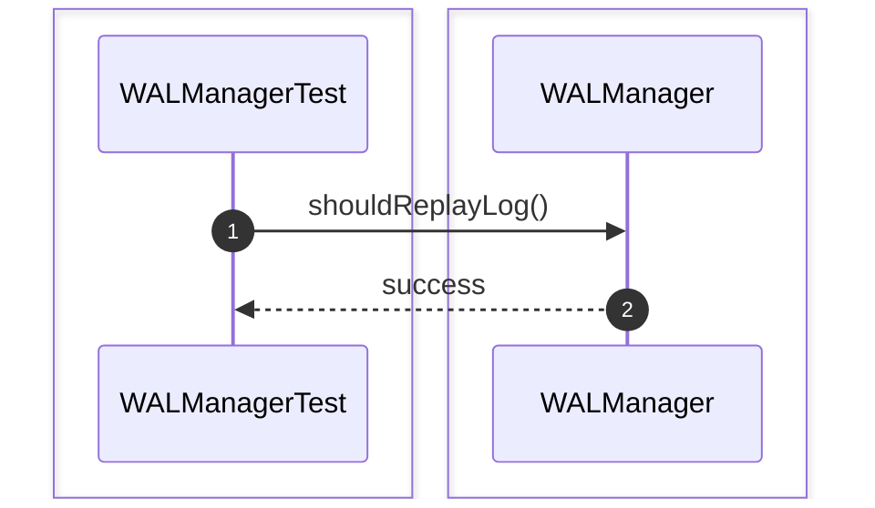

### 4. shouldOrderLSN()


### 5. shouldAssignIncreasingLSN()
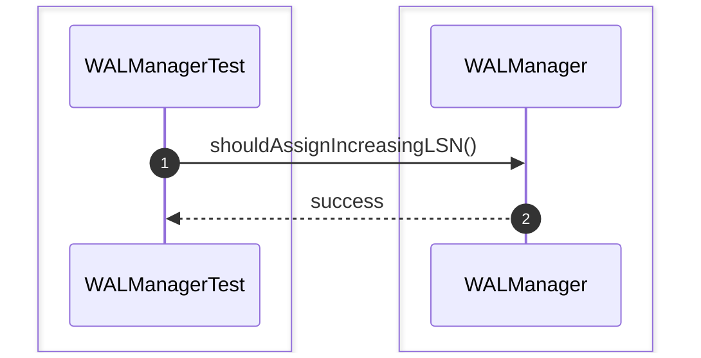

### 6. shouldWriteCommitRecord()
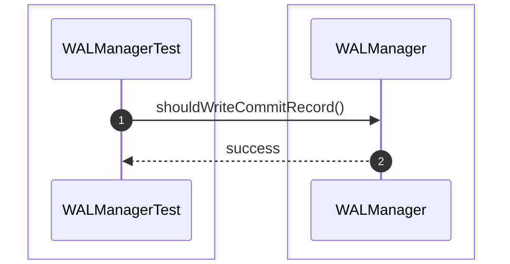

### 7. shouldWriteAbortRecord()
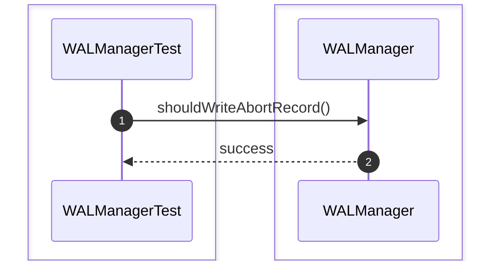

### 8. shouldRecoverLogFile()
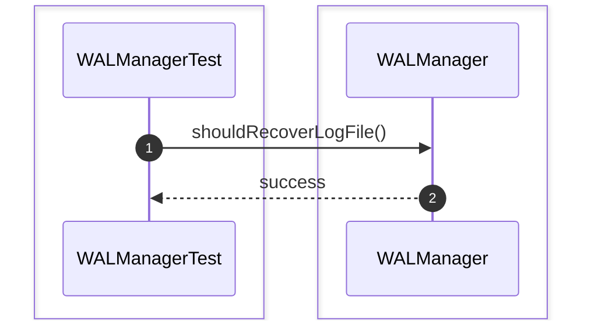

### 9. shouldPersistLogRecord()
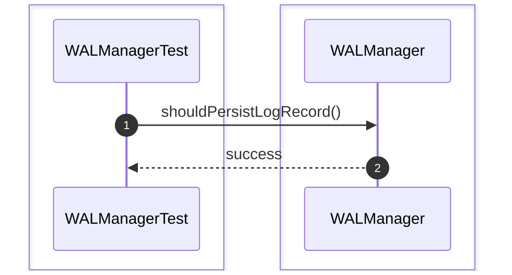

### 10. shouldVerifyWriteAheadLoggingRule()
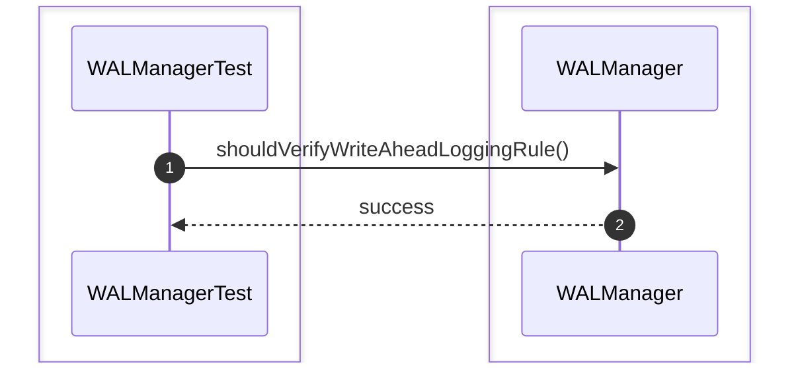

## RecoveryManagerTest

### 1. shouldRecover()
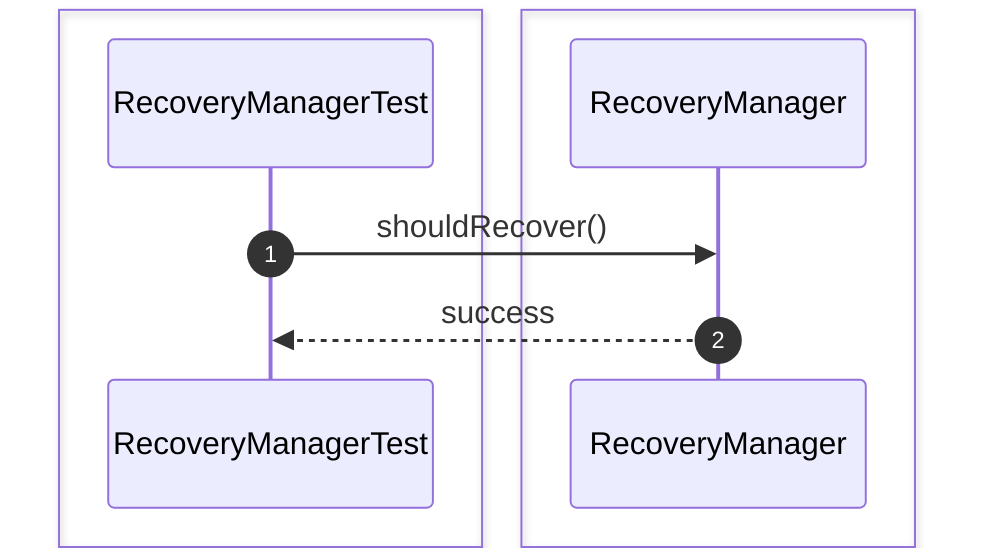

### 2. shouldRedo()


### 3. shouldUndo()


### 4. shouldRecoverCheckpoint()
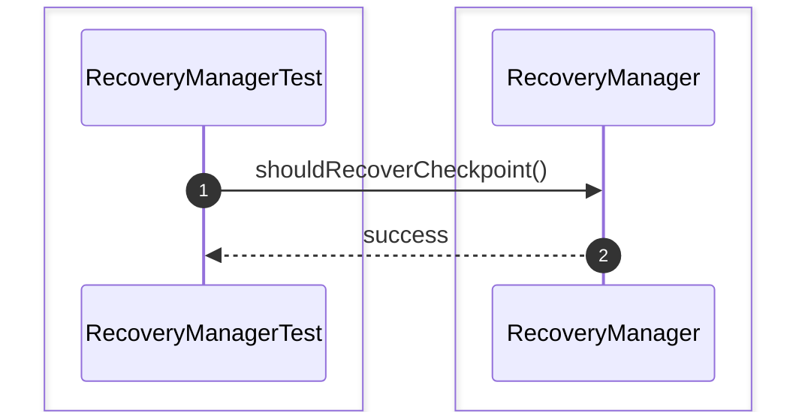

### 5. shouldScanLogRecords()
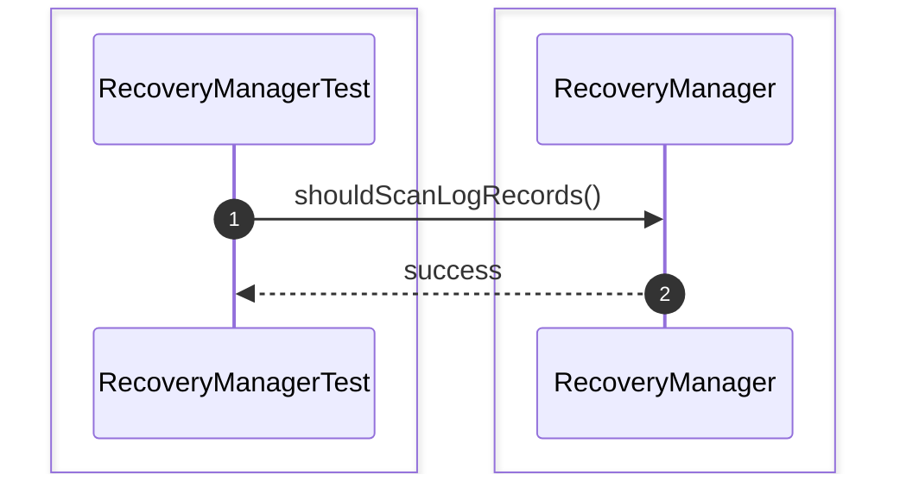

### 6. shouldRedoCommittedTransactions()
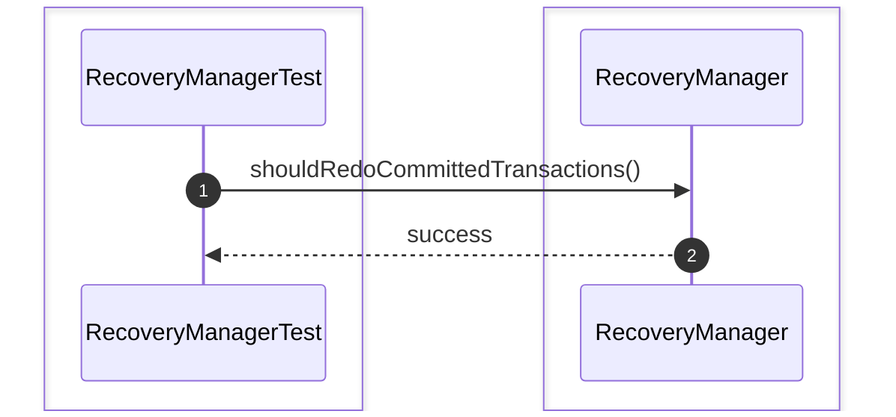

### 7. shouldUndoIncompleteTransactions()
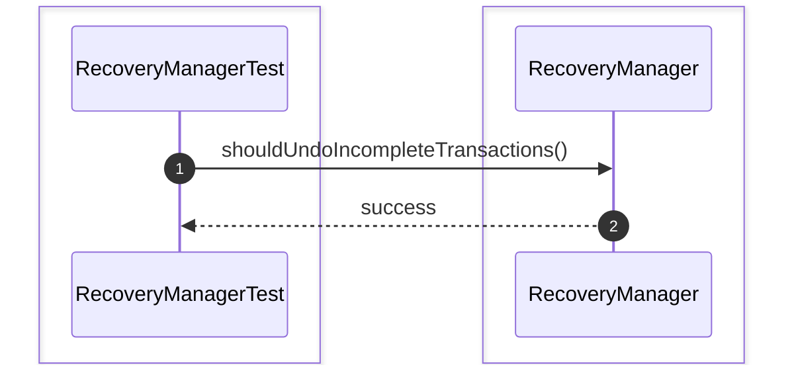

### 8. shouldRestoreDatabaseState()
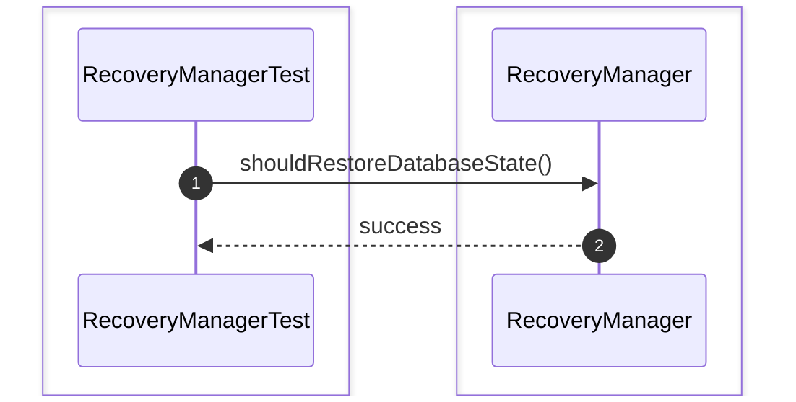

### 9. shouldSkipCommittedTransaction()
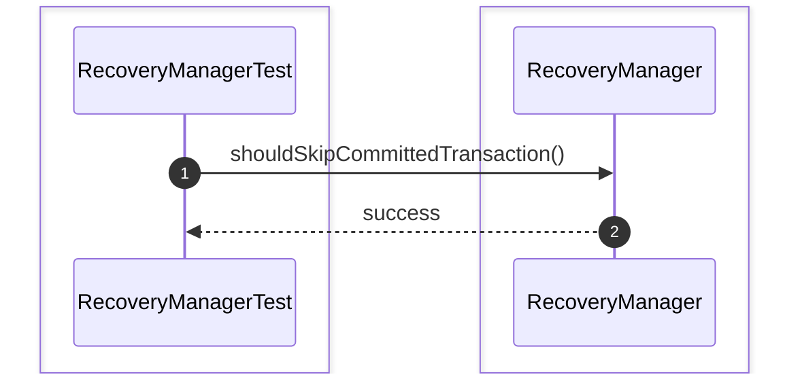

### 10. shouldFinishRecovery()
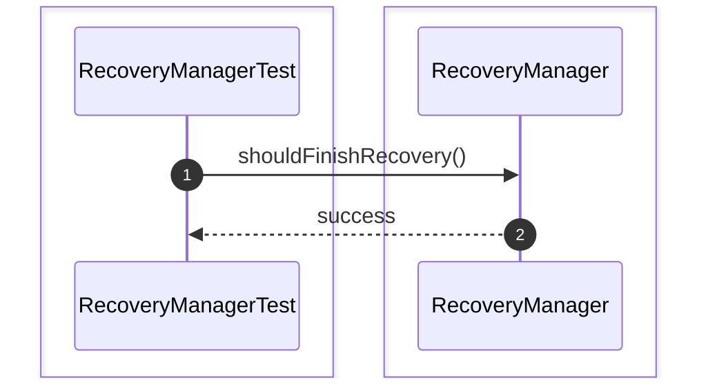

# Recovery Unit Test

### 1. shouldRecoverAfterCrash()
```mermaid
sequenceDiagram
    autonumber
    box #e1f5fe Test Suite
    participant Test as RecoveryModuleIntegrationTest
    end
    box #ffebee Recovery Module Components
    participant System as System
    end

    Test->>System: shouldRecoverAfterCrash()
    System-->>Test: success
```

### 2. shouldCommitTransactionWithWAL()
```mermaid
sequenceDiagram
    autonumber
    box #e1f5fe Test Suite
    participant Test as RecoveryModuleIntegrationTest
    end
    box #ffebee Recovery Module Components
    participant System as System
    end

    Test->>System: shouldCommitTransactionWithWAL()
    System-->>Test: success
```

### 3. shouldRollbackTransactionWithMVCC()
```mermaid
sequenceDiagram
    autonumber
    box #e1f5fe Test Suite
    participant Test as RecoveryModuleIntegrationTest
    end
    box #ffebee Recovery Module Components
    participant System as System
    end

    Test->>System: shouldRollbackTransactionWithMVCC()
    System-->>Test: success
```

### 4. shouldAcquireAndReleaseLocks()
```mermaid
sequenceDiagram
    autonumber
    box #e1f5fe Test Suite
    participant Test as RecoveryModuleIntegrationTest
    end
    box #ffebee Recovery Module Components
    participant System as System
    end

    Test->>System: shouldAcquireAndReleaseLocks()
    System-->>Test: success
```

### 5. shouldRecoverCommittedTransactions()
```mermaid
sequenceDiagram
    autonumber
    box #e1f5fe Test Suite
    participant Test as RecoveryModuleIntegrationTest
    end
    box #ffebee Recovery Module Components
    participant System as System
    end

    Test->>System: shouldRecoverCommittedTransactions()
    System-->>Test: success
```

### 6. shouldRecoverRolledBackTransactions()
```mermaid
sequenceDiagram
    autonumber
    box #e1f5fe Test Suite
    participant Test as RecoveryModuleIntegrationTest
    end
    box #ffebee Recovery Module Components
    participant System as System
    end

    Test->>System: shouldRecoverRolledBackTransactions()
    System-->>Test: success
```

### 7. shouldHandleConcurrentTransactions()
```mermaid
sequenceDiagram
    autonumber
    box #e1f5fe Test Suite
    participant Test as RecoveryModuleIntegrationTest
    end
    box #ffebee Recovery Module Components
    participant System as System
    end

    Test->>System: shouldHandleConcurrentTransactions()
    System-->>Test: success
```

### 8. shouldResolveDeadlockAutomatically()
```mermaid
sequenceDiagram
    autonumber
    box #e1f5fe Test Suite
    participant Test as RecoveryModuleIntegrationTest
    end
    box #ffebee Recovery Module Components
    participant System as System
    end

    Test->>System: shouldResolveDeadlockAutomatically()
    System-->>Test: success
```
