Replication Module Unit Test

## ReplicationManagerTest

### 1. shouldReplicateData()


### 2. shouldSynchronizeReplicas()
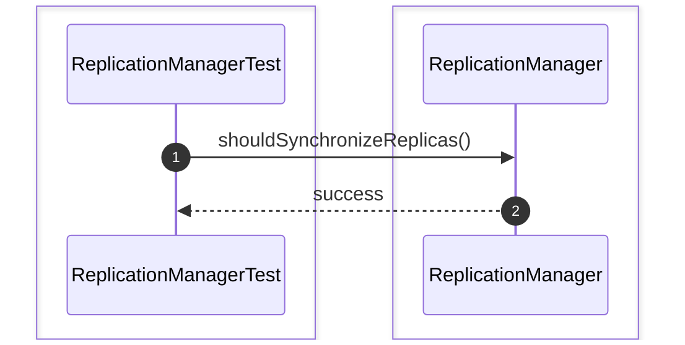

### 3. shouldElectLeader()
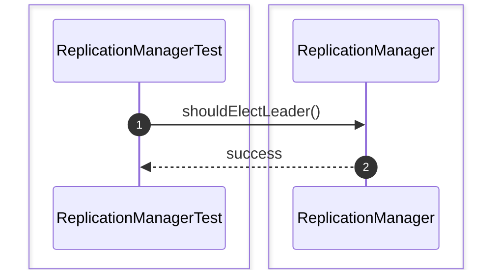

### 4. shouldHandleReplicaFailure()
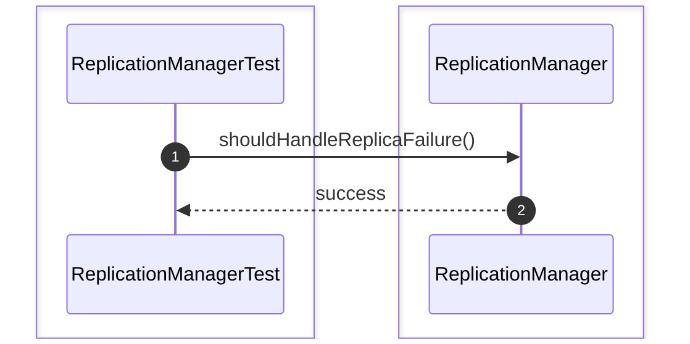

### 5. shouldReplicateCommittedTransaction()
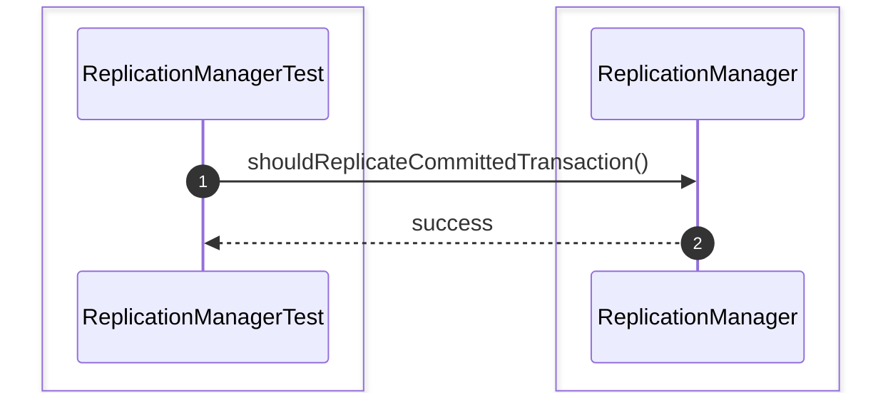

### 6. shouldRetryReplication()
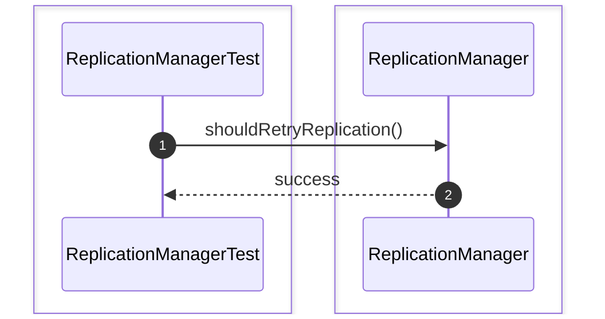

### 7. shouldSynchronizeReplicaState()


### 8. shouldSynchronizeMissingLogs()
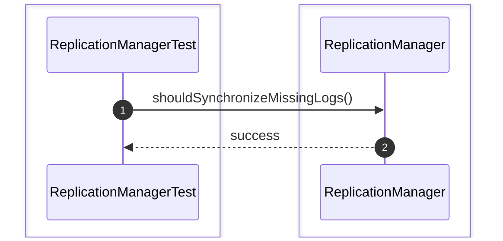

### 9. shouldRejectReplicationWhenLeaderUnavailable()
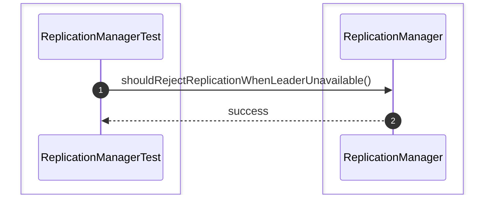

### 10. shouldUpdateClusterLeader()


## ClusterNodeTest

### 1. shouldCreateClusterNode()
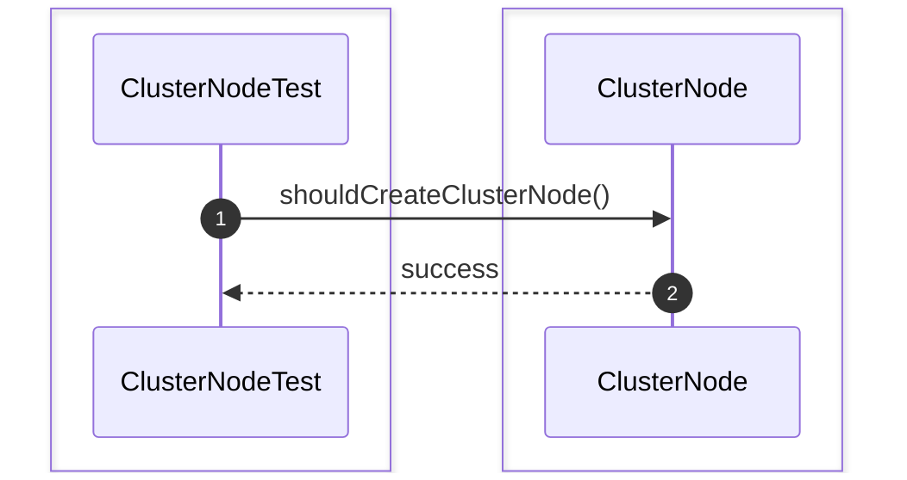

### 2. shouldConnectToCluster()
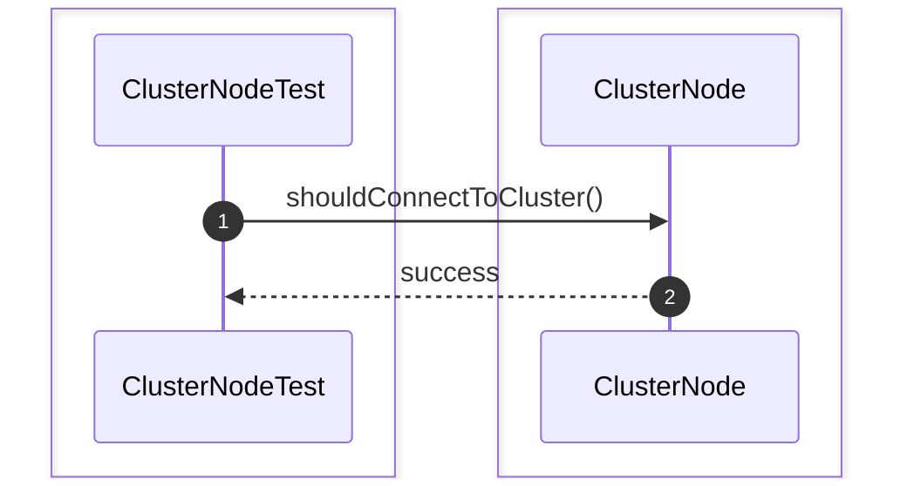

### 3. shouldDisconnectFromCluster()
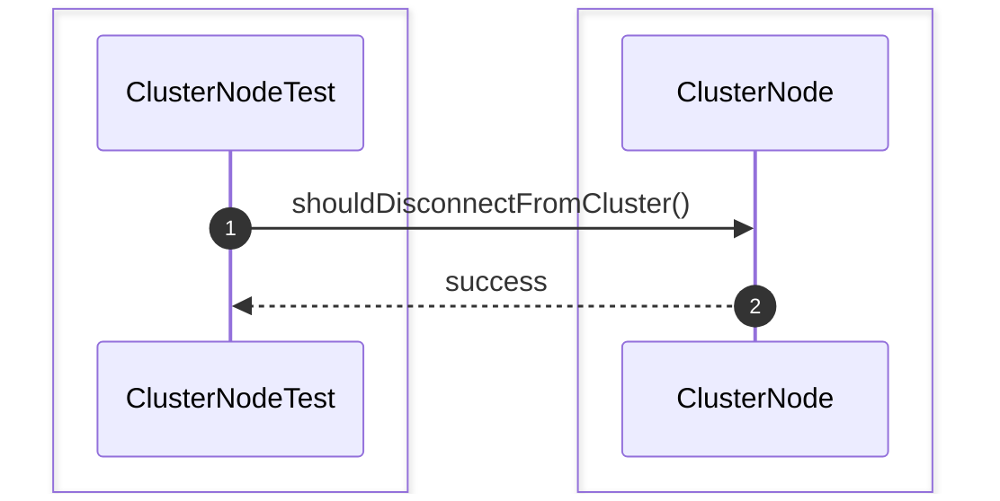

### 4. shouldUpdateNodeStatus()


### 5. shouldHeartbeat()
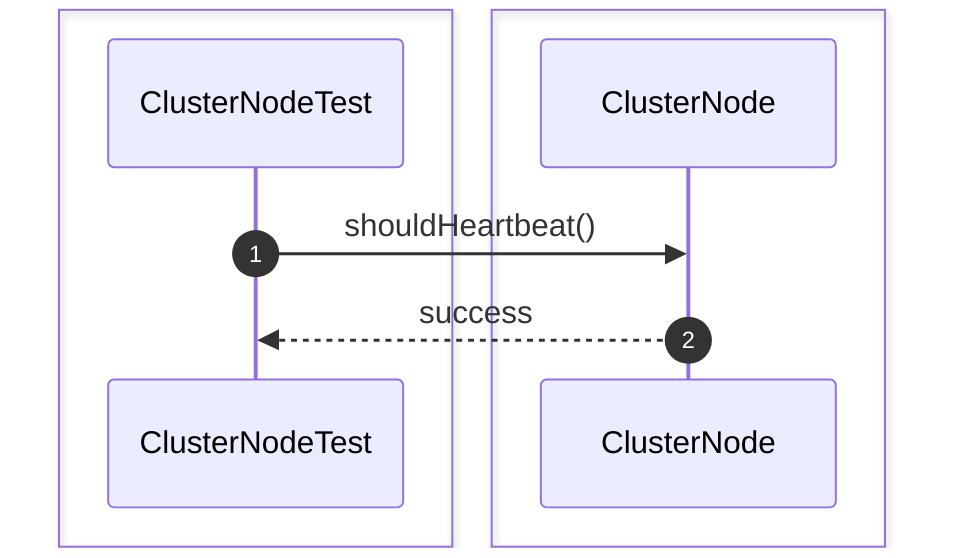

### 6. shouldRecoverNode()
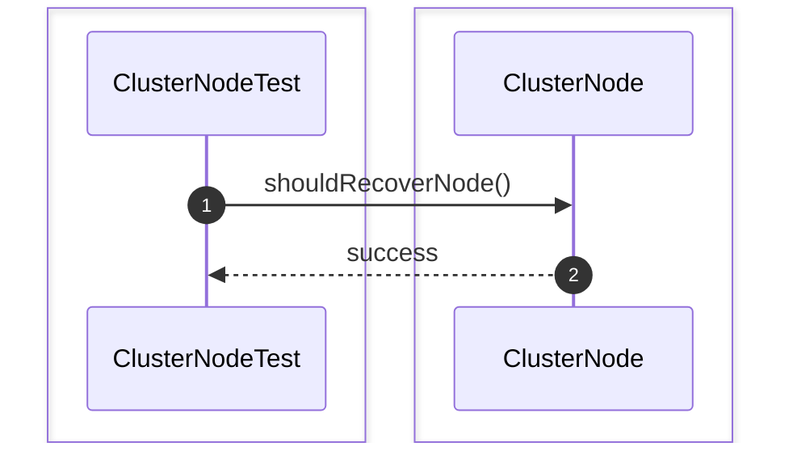

### 7. shouldDetectNodeFailure()
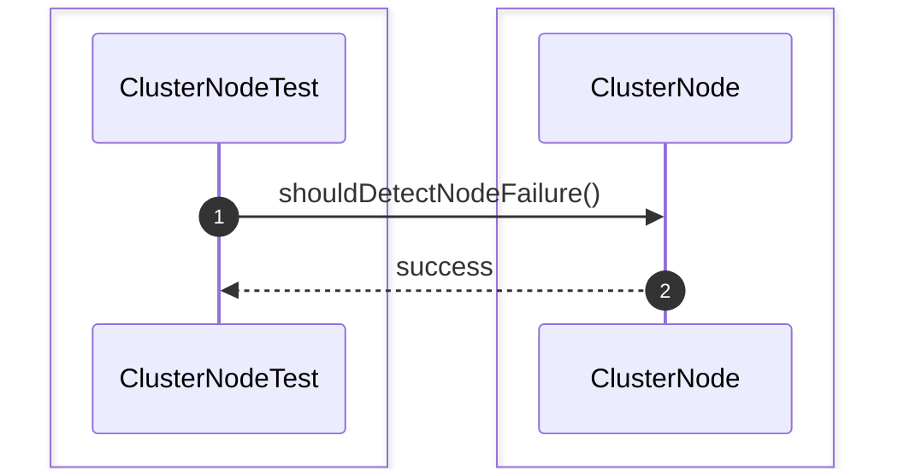

### 8. shouldSynchronizeNodeState()
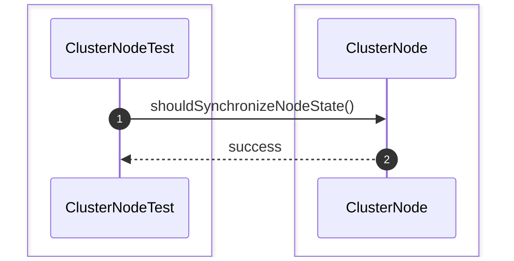

# Replication Unit Test

### 1. shouldReplicateDataToReplica()


### 2. shouldSynchronizeClusterNodes()
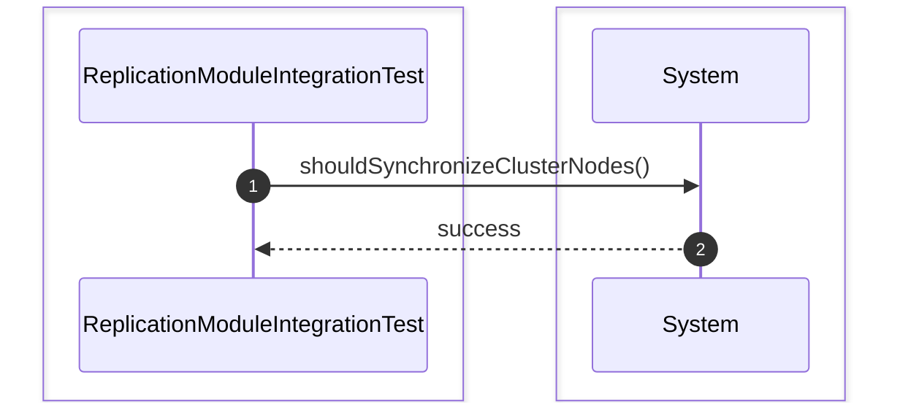

### 3. shouldElectLeaderSuccessfully()
```mermaid
sequenceDiagram
    autonumber
    box #e1f5fe Test Suite
    participant Test as ReplicationModuleIntegrationTest
    end
    box #e3f2fd Replication Module Components
    participant System as System
    end

    Test->>System: shouldElectLeaderSuccessfully()
    System-->>Test: success
```

### 4. shouldRecoverReplicationAfterNodeFailure()
```mermaid
sequenceDiagram
    autonumber
    box #e1f5fe Test Suite
    participant Test as ReplicationModuleIntegrationTest
    end
    box #e3f2fd Replication Module Components
    participant System as System
    end

    Test->>System: shouldRecoverReplicationAfterNodeFailure()
    System-->>Test: success
```

### 5. shouldReplicateCommittedTransactionAcrossCluster()
```mermaid
sequenceDiagram
    autonumber
    box #e1f5fe Test Suite
    participant Test as ReplicationModuleIntegrationTest
    end
    box #e3f2fd Replication Module Components
    participant System as System
    end

    Test->>System: shouldReplicateCommittedTransactionAcrossCluster()
    System-->>Test: success
```

### 6. shouldSynchronizeReplicaUsingWAL()
```mermaid
sequenceDiagram
    autonumber
    box #e1f5fe Test Suite
    participant Test as ReplicationModuleIntegrationTest
    end
    box #e3f2fd Replication Module Components
    participant System as System
    end

    Test->>System: shouldSynchronizeReplicaUsingWAL()
    System-->>Test: success
```

### 7. shouldContinueReplicationAfterLeaderElection()
```mermaid
sequenceDiagram
    autonumber
    box #e1f5fe Test Suite
    participant Test as ReplicationModuleIntegrationTest
    end
    box #e3f2fd Replication Module Components
    participant System as System
    end

    Test->>System: shouldContinueReplicationAfterLeaderElection()
    System-->>Test: success
```

### 8. shouldRecoverReplicaAfterFailure()
```mermaid
sequenceDiagram
    autonumber
    box #e1f5fe Test Suite
    participant Test as ReplicationModuleIntegrationTest
    end
    box #e3f2fd Replication Module Components
    participant System as System
    end

    Test->>System: shouldRecoverReplicaAfterFailure()
    System-->>Test: success
```
