Security Module Unit Test

## SecurityManagerTest

### 1. shouldAuthenticateUser()
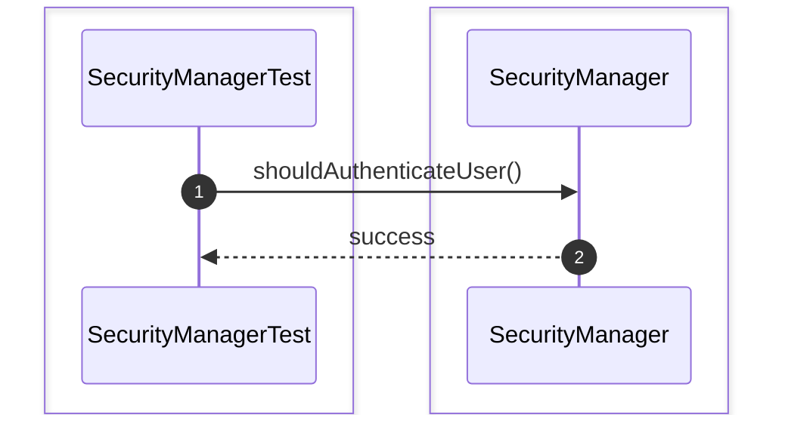

### 2. shouldAuthorizeUser()
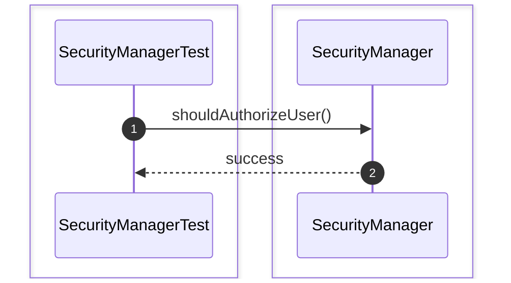

### 3. shouldGrantPermission()
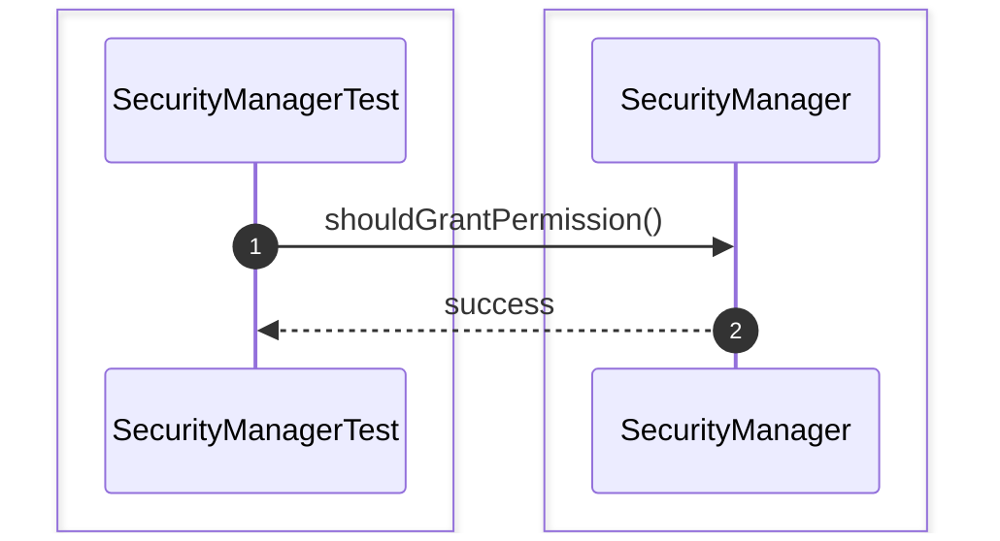

### 4. shouldRevokePermission()
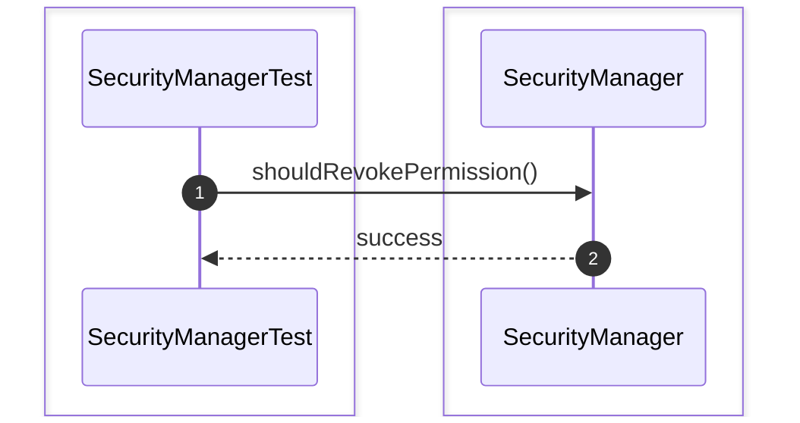

### 5. shouldRejectInvalidPassword()
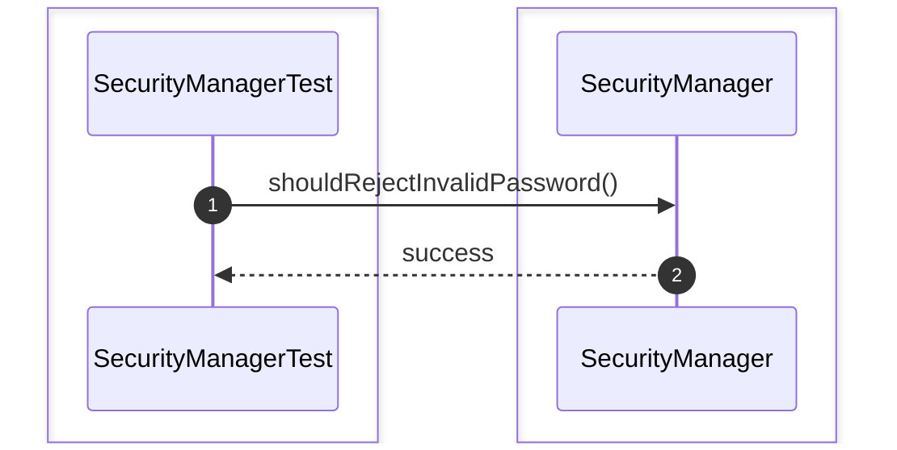

### 6. shouldRejectLockedUser()
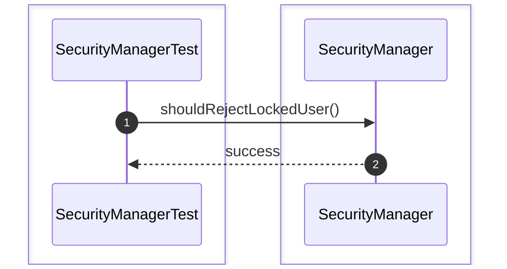

### 7. shouldRejectDisabledUser()
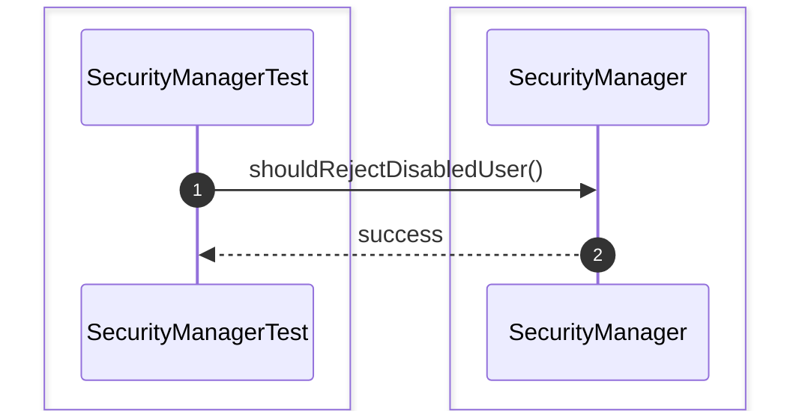

### 8. shouldCheckRolePermission()
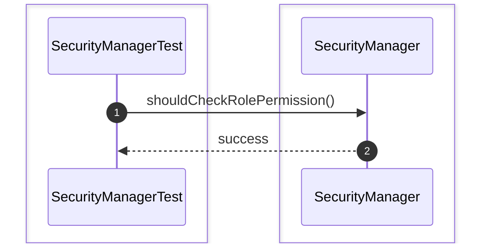

### 9. shouldGrantRolePermission()
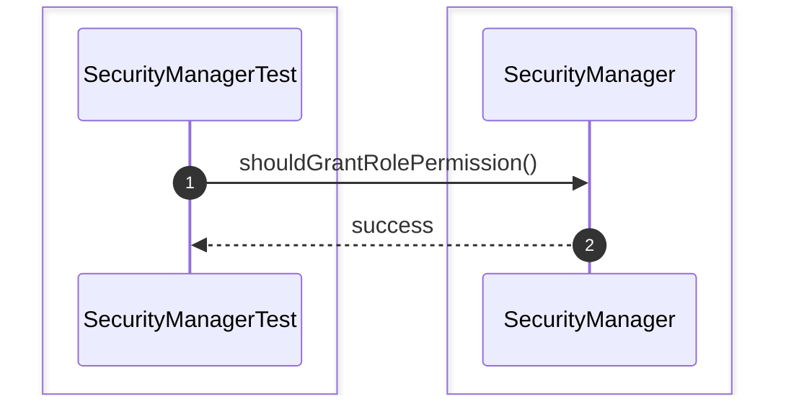

### 10. shouldVerifyPermissionInheritance()
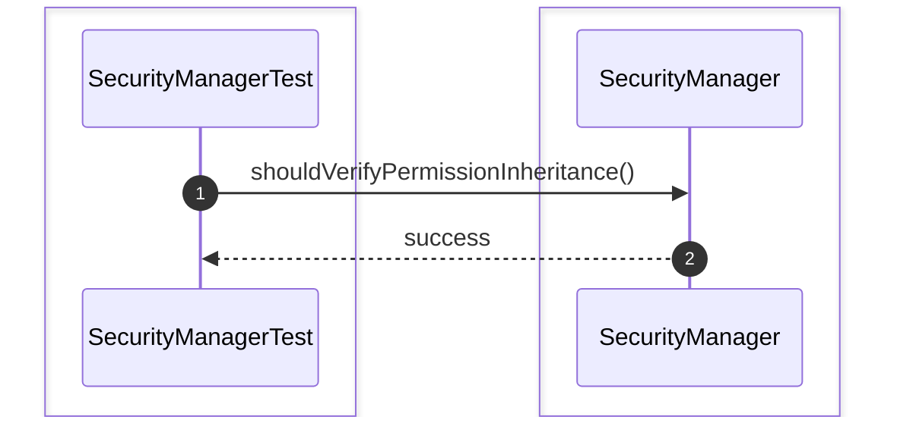

## UserTest

### 1. shouldCreateUser()


### 2. shouldUpdatePassword()
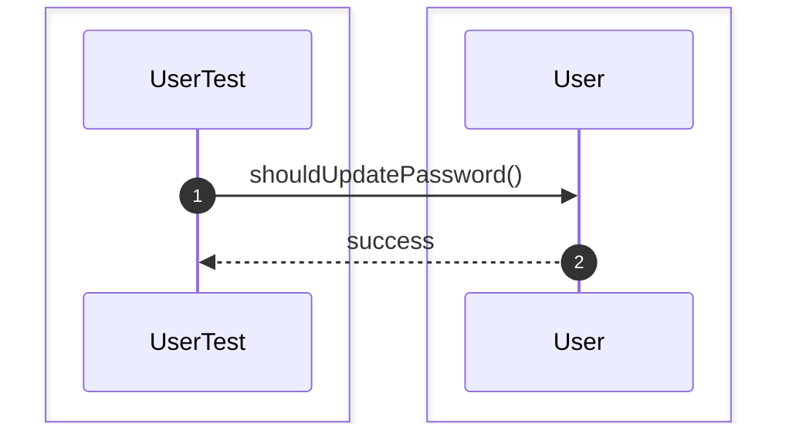

### 3. shouldLockUser()


### 4. shouldUnlockUser()


### 5. shouldEnableUser()
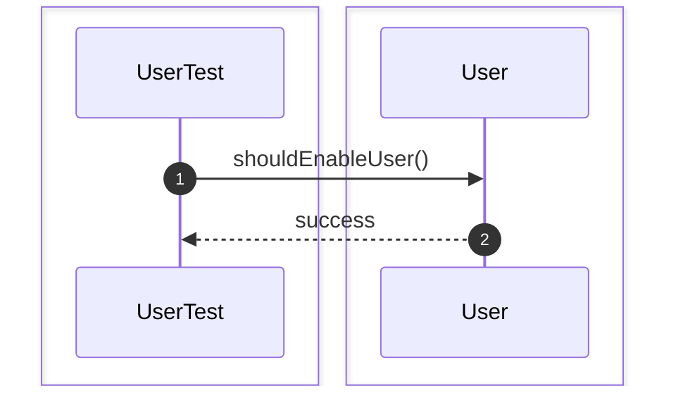

### 6. shouldDisableUser()


### 7. shouldValidatePasswordHash()
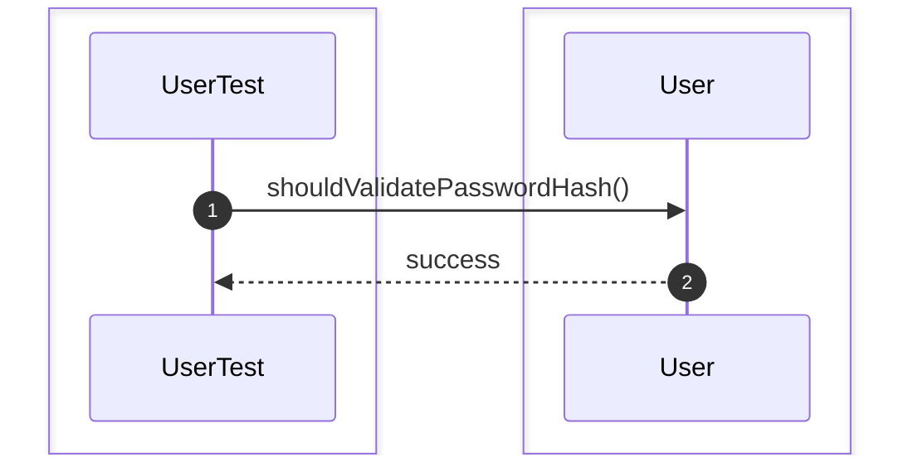

## RoleTest

### 1. shouldCreateRole()
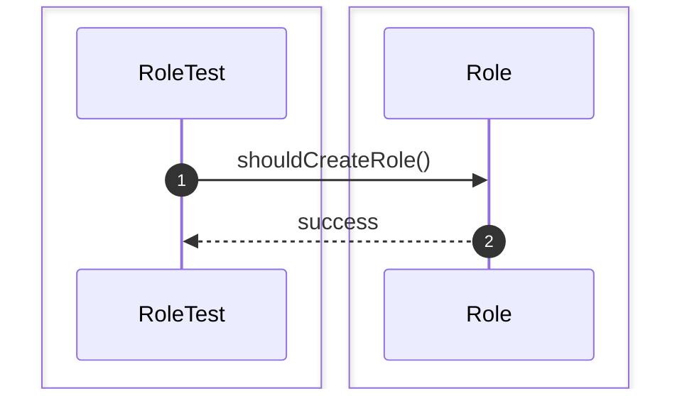

### 2. shouldAssignPermission()
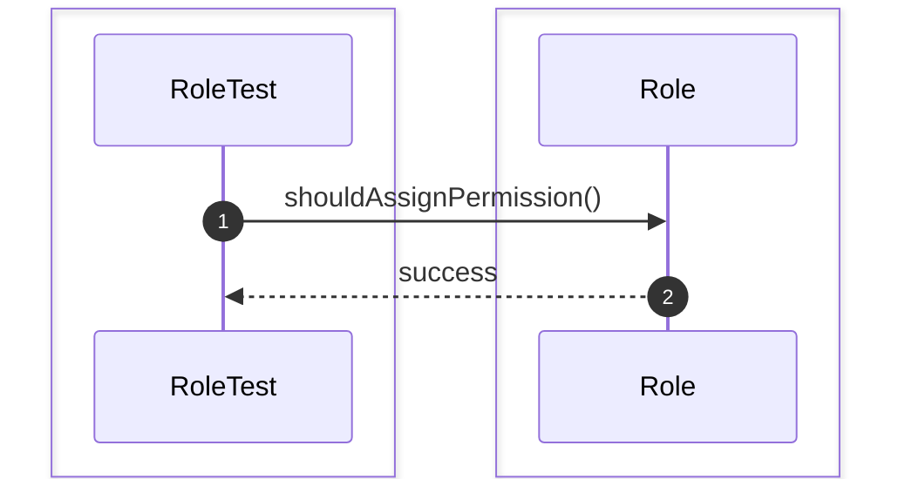

### 3. shouldRemovePermission()
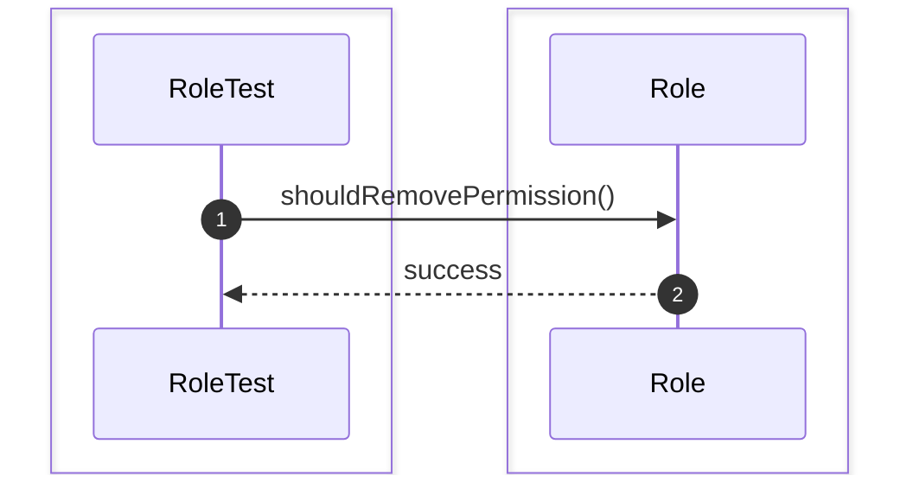

### 4. shouldDeleteRole()
```mermaid
sequenceDiagram
    autonumber
    box #e1f5fe Test Suite
    participant Test as RoleTest
    end
    box #e3f2fd Role Component
    participant R as Role
    end

    Test->>R: shouldDeleteRole()
    R-->>Test: success
```

### 5. shouldRenameRole()
```mermaid
sequenceDiagram
    autonumber
    box #e1f5fe Test Suite
    participant Test as RoleTest
    end
    box #e3f2fd Role Component
    participant R as Role
    end

    Test->>R: shouldRenameRole()
    R-->>Test: success
```

### 6. shouldListPermissions()
```mermaid
sequenceDiagram
    autonumber
    box #e1f5fe Test Suite
    participant Test as RoleTest
    end
    box #e3f2fd Role Component
    participant R as Role
    end

    Test->>R: shouldListPermissions()
    R-->>Test: success
```

## PermissionTest

### 1. shouldCreatePermission()
```mermaid
sequenceDiagram
    autonumber
    box #e1f5fe Test Suite
    participant Test as PermissionTest
    end
    box #e3f2fd Permission Component
    participant P as Permission
    end

    Test->>P: shouldCreatePermission()
    P-->>Test: success
```

### 2. shouldComparePermissions()
```mermaid
sequenceDiagram
    autonumber
    box #e1f5fe Test Suite
    participant Test as PermissionTest
    end
    box #e3f2fd Permission Component
    participant P as Permission
    end

    Test->>P: shouldComparePermissions()
    P-->>Test: success
```

### 3. shouldValidatePermission()
```mermaid
sequenceDiagram
    autonumber
    box #e1f5fe Test Suite
    participant Test as PermissionTest
    end
    box #e3f2fd Permission Component
    participant P as Permission
    end

    Test->>P: shouldValidatePermission()
    P-->>Test: success
```

### 4. shouldStoreAction()
```mermaid
sequenceDiagram
    autonumber
    box #e1f5fe Test Suite
    participant Test as PermissionTest
    end
    box #e3f2fd Permission Component
    participant P as Permission
    end

    Test->>P: shouldStoreAction()
    P-->>Test: success
```

### 5. shouldStoreResource()
```mermaid
sequenceDiagram
    autonumber
    box #e1f5fe Test Suite
    participant Test as PermissionTest
    end
    box #e3f2fd Permission Component
    participant P as Permission
    end

    Test->>P: shouldStoreResource()
    P-->>Test: success
```

# Security Unit Test

### 1. shouldAuthenticateAndAuthorizeUser()
```mermaid
sequenceDiagram
    autonumber
    box #e1f5fe Test Suite
    participant Test as SecurityModuleIntegrationTest
    end
    box #e3f2fd Security Module Components
    participant System as System
    end

    Test->>System: shouldAuthenticateAndAuthorizeUser()
    System-->>Test: success
```

### 2. shouldAssignRoleAndGrantPermission()
```mermaid
sequenceDiagram
    autonumber
    box #e1f5fe Test Suite
    participant Test as SecurityModuleIntegrationTest
    end
    box #e3f2fd Security Module Components
    participant System as System
    end

    Test->>System: shouldAssignRoleAndGrantPermission()
    System-->>Test: success
```

### 3. shouldRevokePermissionSuccessfully()
```mermaid
sequenceDiagram
    autonumber
    box #e1f5fe Test Suite
    participant Test as SecurityModuleIntegrationTest
    end
    box #e3f2fd Security Module Components
    participant System as System
    end

    Test->>System: shouldRevokePermissionSuccessfully()
    System-->>Test: success
```

### 4. shouldRejectUnauthorizedAccess()
```mermaid
sequenceDiagram
    autonumber
    box #e1f5fe Test Suite
    participant Test as SecurityModuleIntegrationTest
    end
    box #e3f2fd Security Module Components
    participant System as System
    end

    Test->>System: shouldRejectUnauthorizedAccess()
    System-->>Test: success
```

### 5. shouldAuthenticateGrantAndAccess()
```mermaid
sequenceDiagram
    autonumber
    box #e1f5fe Test Suite
    participant Test as SecurityModuleIntegrationTest
    end
    box #e3f2fd Security Module Components
    participant System as System
    end

    Test->>System: shouldAuthenticateGrantAndAccess()
    System-->>Test: success
```

### 6. shouldGrantRoleThenAuthorize()
```mermaid
sequenceDiagram
    autonumber
    box #e1f5fe Test Suite
    participant Test as SecurityModuleIntegrationTest
    end
    box #e3f2fd Security Module Components
    participant System as System
    end

    Test->>System: shouldGrantRoleThenAuthorize()
    System-->>Test: success
```

### 7. shouldRevokePermissionAndRejectAccess()
```mermaid
sequenceDiagram
    autonumber
    box #e1f5fe Test Suite
    participant Test as SecurityModuleIntegrationTest
    end
    box #e3f2fd Security Module Components
    participant System as System
    end

    Test->>System: shouldRevokePermissionAndRejectAccess()
    System-->>Test: success
```
