Storage Engine Module Unit Test

## BufferPoolTest

### 1. shouldPinPage()
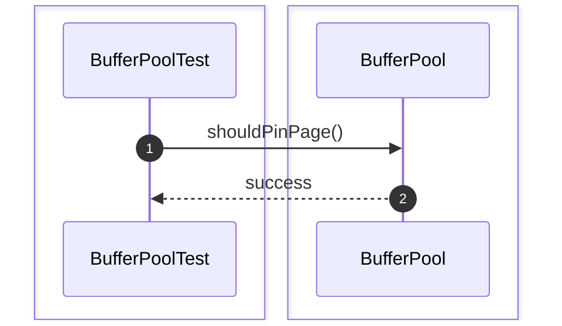

### 2. shouldUnpinPage()


### 3. shouldFetchExistingPage()
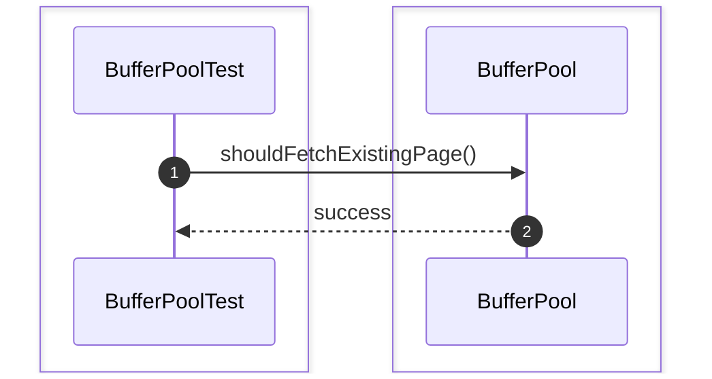

### 4. shouldFlushDirtyPage()


### 5. shouldEvictPage()


### 6. shouldRejectEvictPinnedPage()
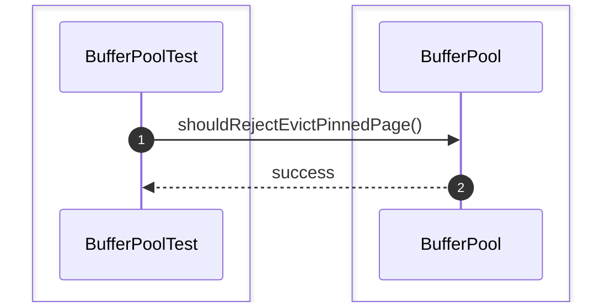

### 7. shouldReplaceVictimPage()
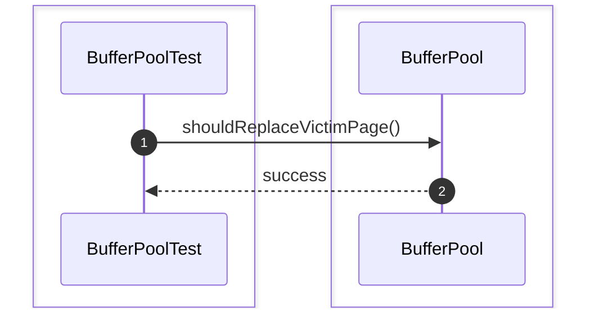

### 8. shouldClearDirtyFlagAfterFlush()
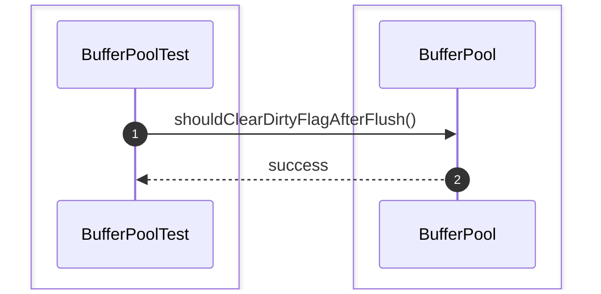

### 9. shouldTrackPinCount()
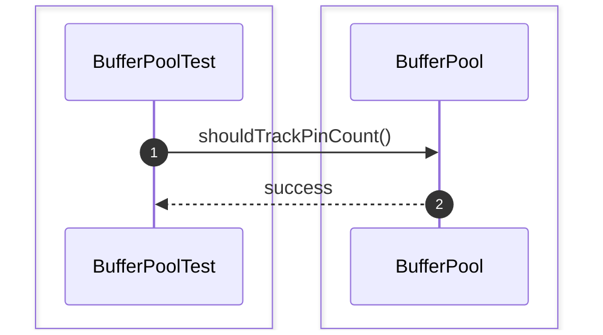

### 10. shouldReturnCachedPage()
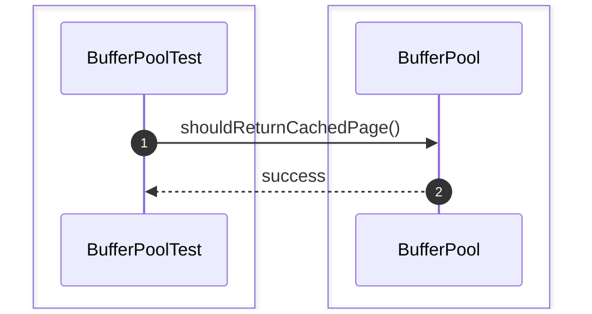

## PageManagerTest

### 1. shouldReadPage()
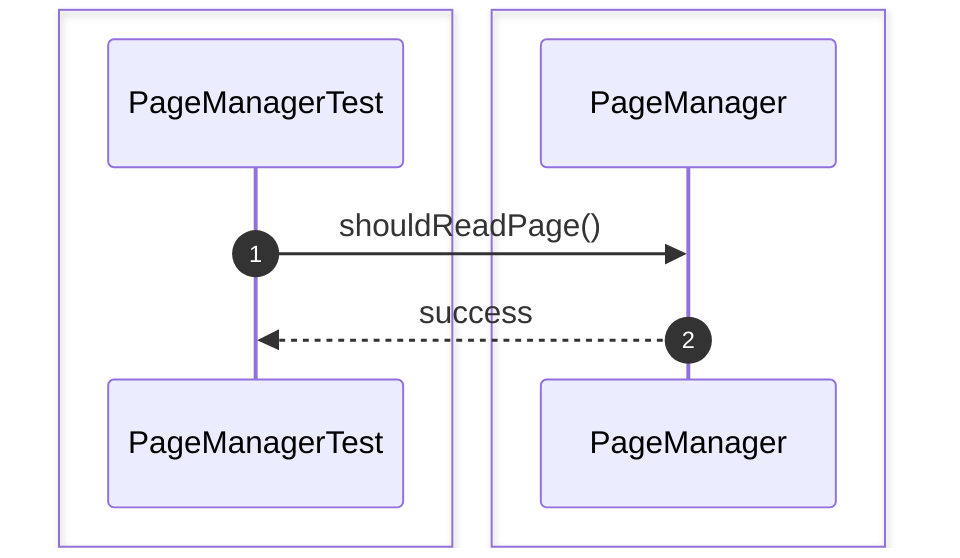

### 2. shouldWritePage()


### 3. shouldAllocatePage()
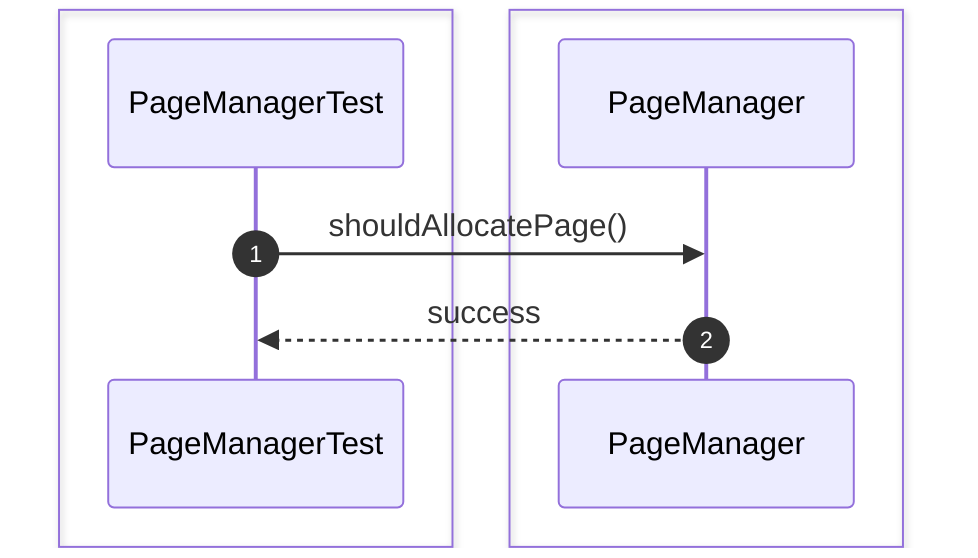

### 4. shouldDeallocatePage()
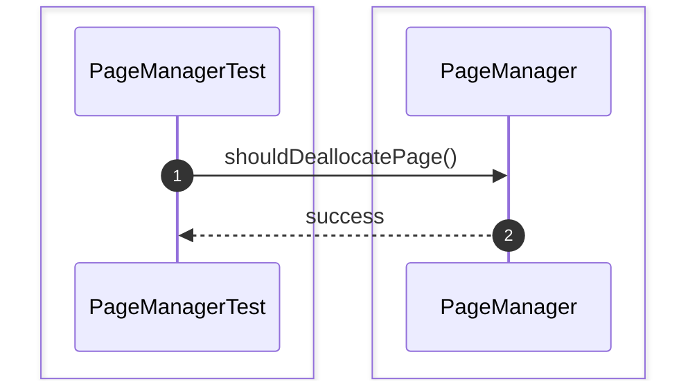

### 5. shouldReuseFreedPage()
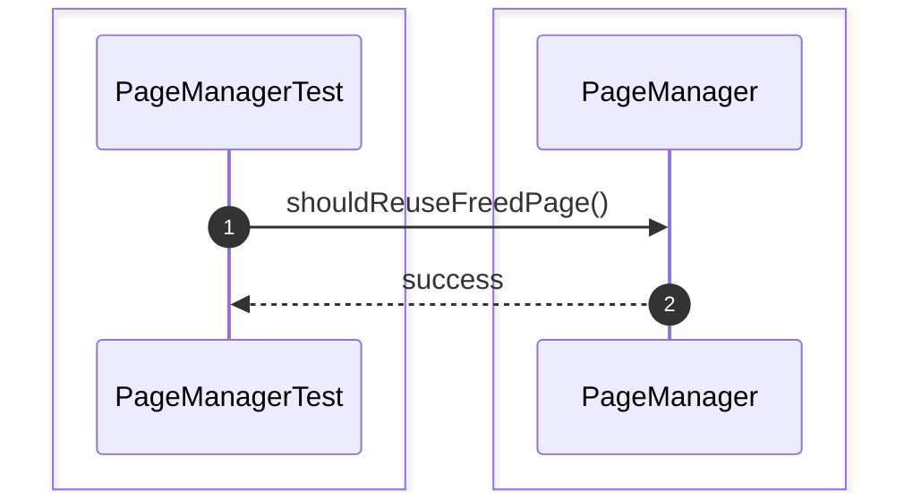

### 6. shouldAssignUniquePageId()
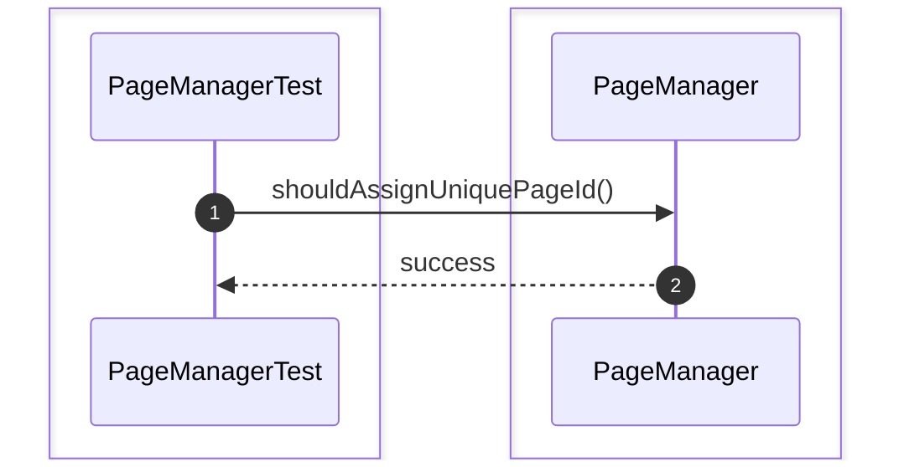

### 7. shouldMaintainPageMetadata()
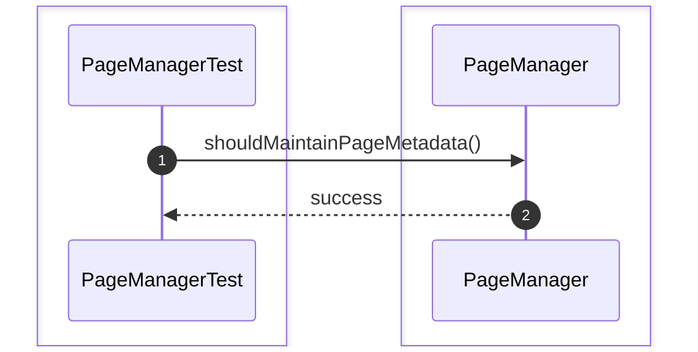

## FileManagerTest

### 1. shouldCreateDataFile()
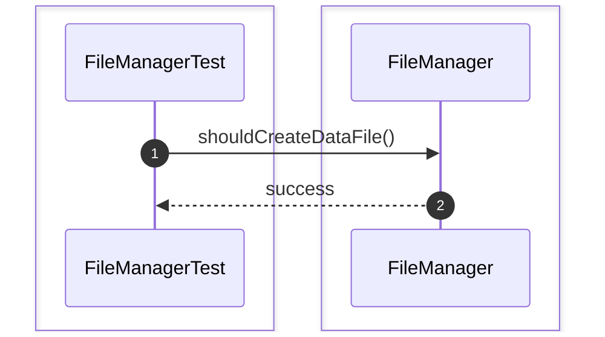

### 2. shouldOpenDataFile()
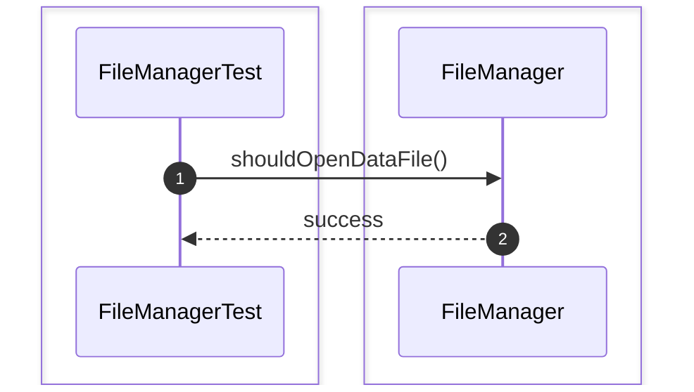

### 3. shouldCloseDataFile()
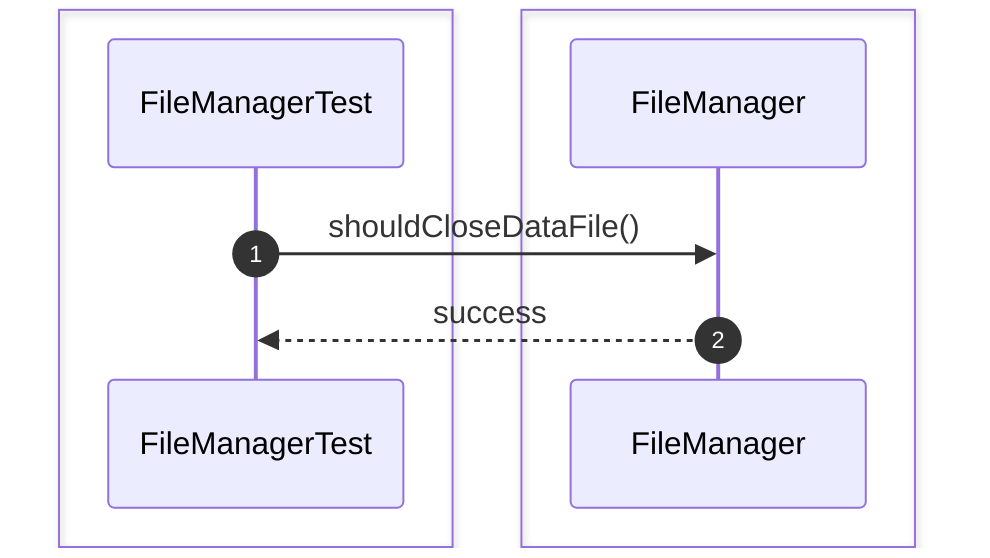

### 4. shouldReadDataFile()
```mermaid
sequenceDiagram
    autonumber
    box #e1f5fe Test Suite
    participant Test as FileManagerTest
    end
    box #e0f2f1 FileManager Component
    participant FM as FileManager
    end

    Test->>FM: shouldReadDataFile()
    FM-->>Test: success
```

### 5. shouldWriteDataFile()
```mermaid
sequenceDiagram
    autonumber
    box #e1f5fe Test Suite
    participant Test as FileManagerTest
    end
    box #e0f2f1 FileManager Component
    participant FM as FileManager
    end

    Test->>FM: shouldWriteDataFile()
    FM-->>Test: success
```

### 6. shouldDeleteDataFile()
```mermaid
sequenceDiagram
    autonumber
    box #e1f5fe Test Suite
    participant Test as FileManagerTest
    end
    box #e0f2f1 FileManager Component
    participant FM as FileManager
    end

    Test->>FM: shouldDeleteDataFile()
    FM-->>Test: success
```

### 7. shouldRenameDataFile()
```mermaid
sequenceDiagram
    autonumber
    box #e1f5fe Test Suite
    participant Test as FileManagerTest
    end
    box #e0f2f1 FileManager Component
    participant FM as FileManager
    end

    Test->>FM: shouldRenameDataFile()
    FM-->>Test: success
```

### 8. shouldExpandDataFile()
```mermaid
sequenceDiagram
    autonumber
    box #e1f5fe Test Suite
    participant Test as FileManagerTest
    end
    box #e0f2f1 FileManager Component
    participant FM as FileManager
    end

    Test->>FM: shouldExpandDataFile()
    FM-->>Test: success
```

### 9. shouldShrinkDataFile()
```mermaid
sequenceDiagram
    autonumber
    box #e1f5fe Test Suite
    participant Test as FileManagerTest
    end
    box #e0f2f1 FileManager Component
    participant FM as FileManager
    end

    Test->>FM: shouldShrinkDataFile()
    FM-->>Test: success
```

### 10. shouldCheckFileExistence()
```mermaid
sequenceDiagram
    autonumber
    box #e1f5fe Test Suite
    participant Test as FileManagerTest
    end
    box #e0f2f1 FileManager Component
    participant FM as FileManager
    end

    Test->>FM: shouldCheckFileExistence()
    FM-->>Test: success
```

### 11. shouldSynchronizeFileToDisk()
```mermaid
sequenceDiagram
    autonumber
    box #e1f5fe Test Suite
    participant Test as FileManagerTest
    end
    box #e0f2f1 FileManager Component
    participant FM as FileManager
    end

    Test->>FM: shouldSynchronizeFileToDisk()
    FM-->>Test: success
```

### 12. shouldHandleMissingFile()
```mermaid
sequenceDiagram
    autonumber
    box #e1f5fe Test Suite
    participant Test as FileManagerTest
    end
    box #e0f2f1 FileManager Component
    participant FM as FileManager
    end

    Test->>FM: shouldHandleMissingFile()
    FM-->>Test: success
```

## PageTest

### 1. shouldCreatePage()
```mermaid
sequenceDiagram
    autonumber
    box #e1f5fe Test Suite
    participant Test as PageTest
    end
    box #e0f2f1 Page Component
    participant P as Page
    end

    Test->>P: shouldCreatePage()
    P-->>Test: success
```

### 2. shouldReadPageData()
```mermaid
sequenceDiagram
    autonumber
    box #e1f5fe Test Suite
    participant Test as PageTest
    end
    box #e0f2f1 Page Component
    participant P as Page
    end

    Test->>P: shouldReadPageData()
    P-->>Test: success
```

### 3. shouldWritePageData()
```mermaid
sequenceDiagram
    autonumber
    box #e1f5fe Test Suite
    participant Test as PageTest
    end
    box #e0f2f1 Page Component
    participant P as Page
    end

    Test->>P: shouldWritePageData()
    P-->>Test: success
```

### 4. shouldUpdatePageHeader()
```mermaid
sequenceDiagram
    autonumber
    box #e1f5fe Test Suite
    participant Test as PageTest
    end
    box #e0f2f1 Page Component
    participant P as Page
    end

    Test->>P: shouldUpdatePageHeader()
    P-->>Test: success
```

### 5. shouldMarkPageDirty()
```mermaid
sequenceDiagram
    autonumber
    box #e1f5fe Test Suite
    participant Test as PageTest
    end
    box #e0f2f1 Page Component
    participant P as Page
    end

    Test->>P: shouldMarkPageDirty()
    P-->>Test: success
```

### 6. shouldClearDirtyFlag()
```mermaid
sequenceDiagram
    autonumber
    box #e1f5fe Test Suite
    participant Test as PageTest
    end
    box #e0f2f1 Page Component
    participant P as Page
    end

    Test->>P: shouldClearDirtyFlag()
    P-->>Test: success
```

### 7. shouldIncrementPageLSN()
```mermaid
sequenceDiagram
    autonumber
    box #e1f5fe Test Suite
    participant Test as PageTest
    end
    box #e0f2f1 Page Component
    participant P as Page
    end

    Test->>P: shouldIncrementPageLSN()
    P-->>Test: success
```

### 8. shouldResetPage()
```mermaid
sequenceDiagram
    autonumber
    box #e1f5fe Test Suite
    participant Test as PageTest
    end
    box #e0f2f1 Page Component
    participant P as Page
    end

    Test->>P: shouldResetPage()
    P-->>Test: success
```

# Storage Engine Unit Test

### 1. shouldAllocateAndWritePage()
```mermaid
sequenceDiagram
    autonumber
    box #e1f5fe Test Suite
    participant Test as StorageEngineModuleIntegrationTest
    end
    box #e0f2f1 Storage Engine Module Components
    participant System as System
    end

    Test->>System: shouldAllocateAndWritePage()
    System-->>Test: success
```

### 2. shouldReadPageFromDisk()
```mermaid
sequenceDiagram
    autonumber
    box #e1f5fe Test Suite
    participant Test as StorageEngineModuleIntegrationTest
    end
    box #e0f2f1 Storage Engine Module Components
    participant System as System
    end

    Test->>System: shouldReadPageFromDisk()
    System-->>Test: success
```

### 3. shouldFlushDirtyPageToDisk()
```mermaid
sequenceDiagram
    autonumber
    box #e1f5fe Test Suite
    participant Test as StorageEngineModuleIntegrationTest
    end
    box #e0f2f1 Storage Engine Module Components
    participant System as System
    end

    Test->>System: shouldFlushDirtyPageToDisk()
    System-->>Test: success
```

### 4. shouldReloadPageIntoBufferPool()
```mermaid
sequenceDiagram
    autonumber
    box #e1f5fe Test Suite
    participant Test as StorageEngineModuleIntegrationTest
    end
    box #e0f2f1 Storage Engine Module Components
    participant System as System
    end

    Test->>System: shouldReloadPageIntoBufferPool()
    System-->>Test: success
```

### 5. shouldEvictPageUsingReplacementPolicy()
```mermaid
sequenceDiagram
    autonumber
    box #e1f5fe Test Suite
    participant Test as StorageEngineModuleIntegrationTest
    end
    box #e0f2f1 Storage Engine Module Components
    participant System as System
    end

    Test->>System: shouldEvictPageUsingReplacementPolicy()
    System-->>Test: success
```

### 6. shouldPersistPageAcrossRestart()
```mermaid
sequenceDiagram
    autonumber
    box #e1f5fe Test Suite
    participant Test as StorageEngineModuleIntegrationTest
    end
    box #e0f2f1 Storage Engine Module Components
    participant System as System
    end

    Test->>System: shouldPersistPageAcrossRestart()
    System-->>Test: success
```

### 7. shouldSynchronizeBufferPoolAndDisk()
```mermaid
sequenceDiagram
    autonumber
    box #e1f5fe Test Suite
    participant Test as StorageEngineModuleIntegrationTest
    end
    box #e0f2f1 Storage Engine Module Components
    participant System as System
    end

    Test->>System: shouldSynchronizeBufferPoolAndDisk()
    System-->>Test: success
```
