Transaction & Lock Module Unit Test

## TransactionManagerTest

### 1. shouldBeginTransaction()
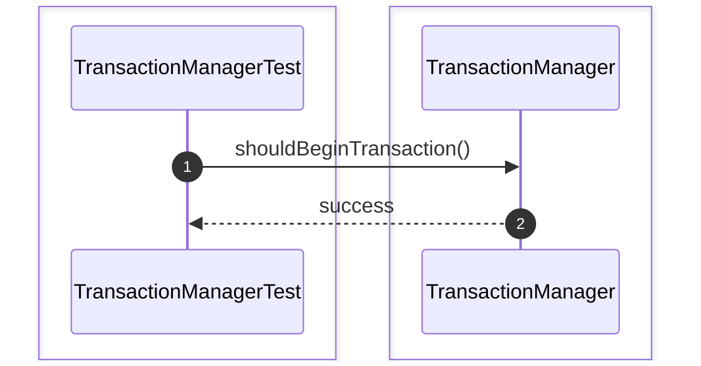

### 2. shouldCommitTransaction()


### 3. shouldRollbackTransaction()
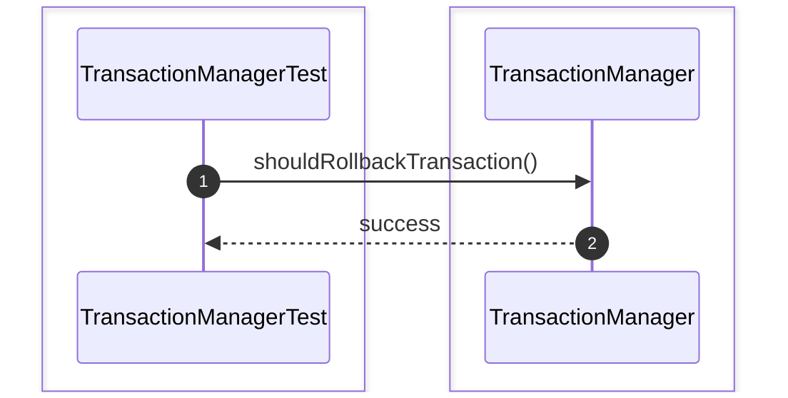

### 4. shouldRecoverTransactions()
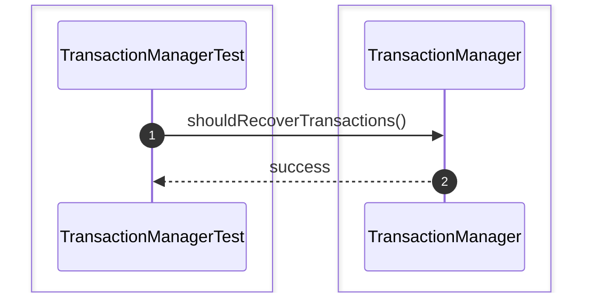

### 5. shouldSuspendTransaction()
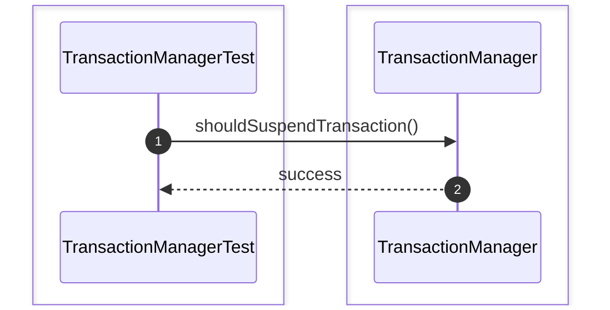

### 6. shouldResumeTransaction()


### 7. shouldRegisterActiveTransaction()
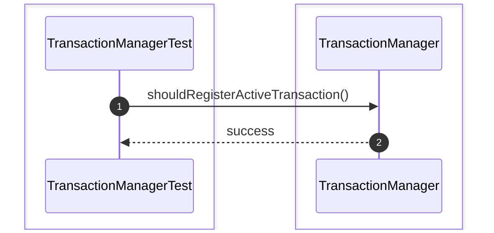

### 8. shouldRemoveCommittedTransaction()
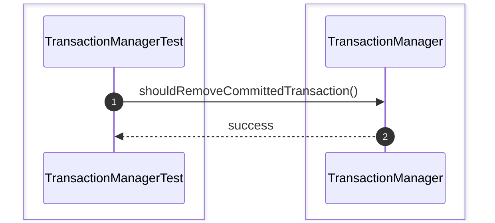

### 9. shouldRemoveRolledBackTransaction()


### 10. shouldAssignTransactionId()


### 11. shouldTrackTransactionState()
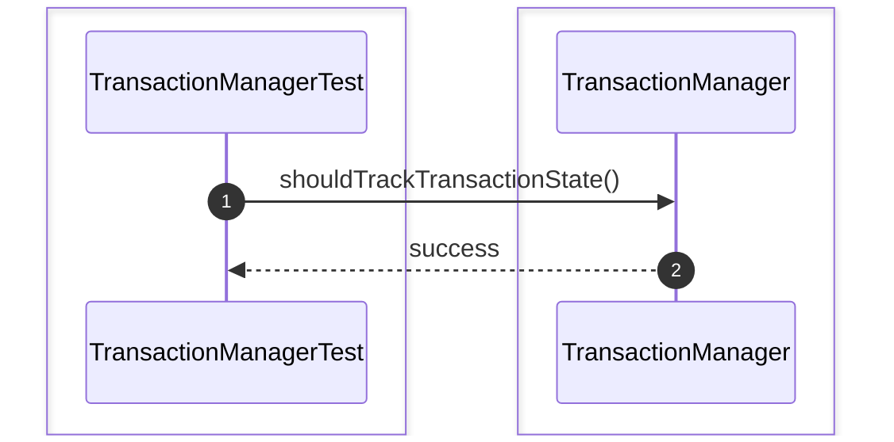

### 12. shouldRejectDuplicateTransaction()
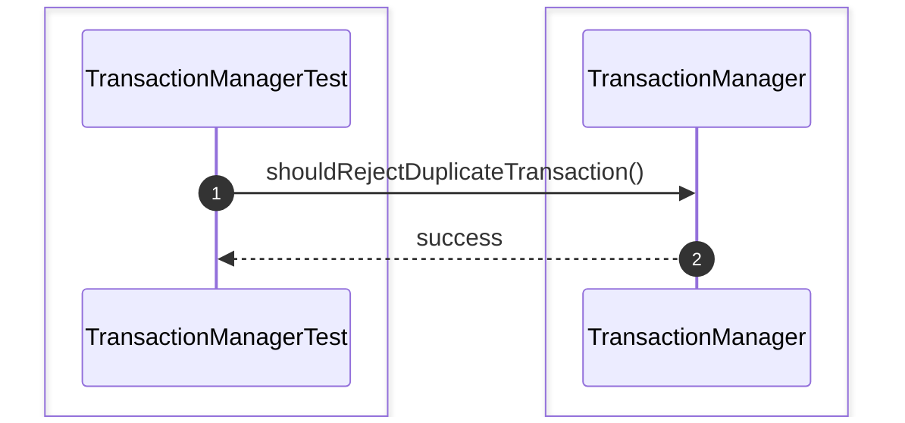

## TransactionTest

### 1. shouldBegin()


### 2. shouldCommit()
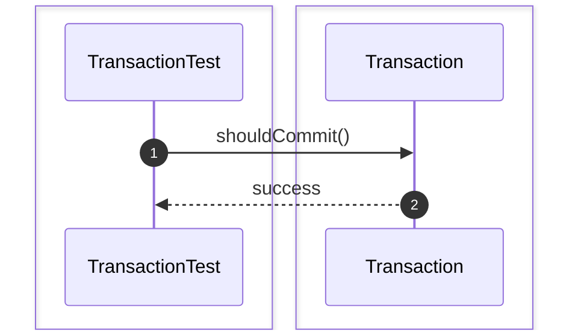

### 3. shouldRollback()


### 4. shouldCreateSavepoint()
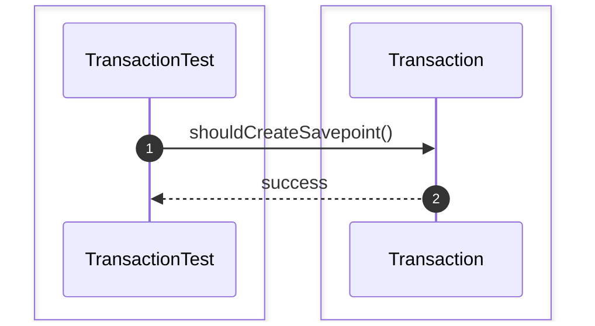

### 5. shouldRollbackToSavepoint()


### 6. shouldReleaseSavepoint()
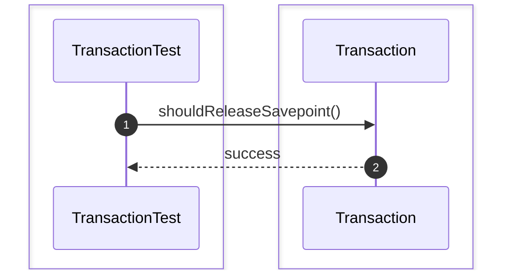

### 7. shouldHandleStateTransition()
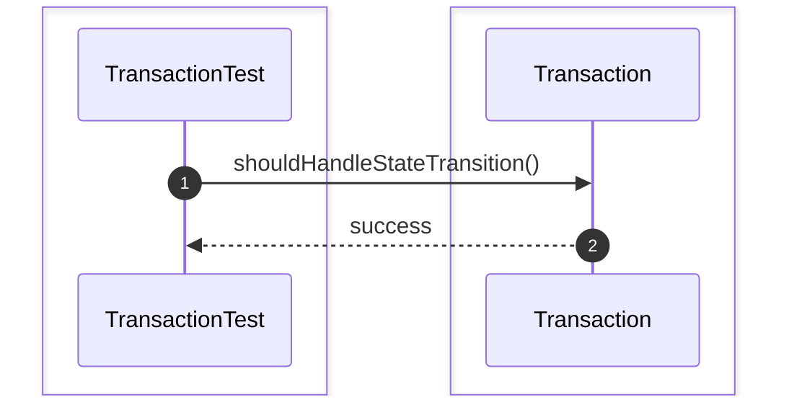

### 8. shouldEnforceIsolationLevel()


### 9. shouldRecordStartTime()
```mermaid
sequenceDiagram
    autonumber
    box #e1f5fe Test Suite
    participant Test as TransactionTest
    end
    box #ffebee Transaction Component
    participant T as Transaction
    end

    Test->>T: shouldRecordStartTime()
    T-->>Test: success
```

### 10. shouldRecordCommitTime()
```mermaid
sequenceDiagram
    autonumber
    box #e1f5fe Test Suite
    participant Test as TransactionTest
    end
    box #ffebee Transaction Component
    participant T as Transaction
    end

    Test->>T: shouldRecordCommitTime()
    T-->>Test: success
```

### 11. shouldRejectCommitAfterRollback()
```mermaid
sequenceDiagram
    autonumber
    box #e1f5fe Test Suite
    participant Test as TransactionTest
    end
    box #ffebee Transaction Component
    participant T as Transaction
    end

    Test->>T: shouldRejectCommitAfterRollback()
    T-->>Test: success
```

### 12. shouldRejectRollbackAfterCommit()
```mermaid
sequenceDiagram
    autonumber
    box #e1f5fe Test Suite
    participant Test as TransactionTest
    end
    box #ffebee Transaction Component
    participant T as Transaction
    end

    Test->>T: shouldRejectRollbackAfterCommit()
    T-->>Test: success
```

## LockManagerTest

### 1. shouldAcquireSharedLock()
```mermaid
sequenceDiagram
    autonumber
    box #e1f5fe Test Suite
    participant Test as LockManagerTest
    end
    box #ffebee LockManager Component
    participant LM as LockManager
    end

    Test->>LM: shouldAcquireSharedLock()
    LM-->>Test: success
```

### 2. shouldAcquireExclusiveLock()
```mermaid
sequenceDiagram
    autonumber
    box #e1f5fe Test Suite
    participant Test as LockManagerTest
    end
    box #ffebee LockManager Component
    participant LM as LockManager
    end

    Test->>LM: shouldAcquireExclusiveLock()
    LM-->>Test: success
```

### 3. shouldReleaseLock()
```mermaid
sequenceDiagram
    autonumber
    box #e1f5fe Test Suite
    participant Test as LockManagerTest
    end
    box #ffebee LockManager Component
    participant LM as LockManager
    end

    Test->>LM: shouldReleaseLock()
    LM-->>Test: success
```

### 4. shouldUpgradeLock()
```mermaid
sequenceDiagram
    autonumber
    box #e1f5fe Test Suite
    participant Test as LockManagerTest
    end
    box #ffebee LockManager Component
    participant LM as LockManager
    end

    Test->>LM: shouldUpgradeLock()
    LM-->>Test: success
```

### 5. shouldDowngradeLock()
```mermaid
sequenceDiagram
    autonumber
    box #e1f5fe Test Suite
    participant Test as LockManagerTest
    end
    box #ffebee LockManager Component
    participant LM as LockManager
    end

    Test->>LM: shouldDowngradeLock()
    LM-->>Test: success
```

### 6. shouldCheckCompatibility()
```mermaid
sequenceDiagram
    autonumber
    box #e1f5fe Test Suite
    participant Test as LockManagerTest
    end
    box #ffebee LockManager Component
    participant LM as LockManager
    end

    Test->>LM: shouldCheckCompatibility()
    LM-->>Test: success
```

### 7. shouldRejectConflictingLock()
```mermaid
sequenceDiagram
    autonumber
    box #e1f5fe Test Suite
    participant Test as LockManagerTest
    end
    box #ffebee LockManager Component
    participant LM as LockManager
    end

    Test->>LM: shouldRejectConflictingLock()
    LM-->>Test: success
```

### 8. shouldQueueWaitingTransaction()
```mermaid
sequenceDiagram
    autonumber
    box #e1f5fe Test Suite
    participant Test as LockManagerTest
    end
    box #ffebee LockManager Component
    participant LM as LockManager
    end

    Test->>LM: shouldQueueWaitingTransaction()
    LM-->>Test: success
```

### 9. shouldWakeWaitingTransaction()
```mermaid
sequenceDiagram
    autonumber
    box #e1f5fe Test Suite
    participant Test as LockManagerTest
    end
    box #ffebee LockManager Component
    participant LM as LockManager
    end

    Test->>LM: shouldWakeWaitingTransaction()
    LM-->>Test: success
```

### 10. shouldDetectDeadlock()
```mermaid
sequenceDiagram
    autonumber
    box #e1f5fe Test Suite
    participant Test as LockManagerTest
    end
    box #ffebee LockManager Component
    participant LM as LockManager
    end

    Test->>LM: shouldDetectDeadlock()
    LM-->>Test: success
```

### 11. shouldResolveDeadlock()
```mermaid
sequenceDiagram
    autonumber
    box #e1f5fe Test Suite
    participant Test as LockManagerTest
    end
    box #ffebee LockManager Component
    participant LM as LockManager
    end

    Test->>LM: shouldResolveDeadlock()
    LM-->>Test: success
```

### 12. shouldReleaseAllLocksOnCommit()
```mermaid
sequenceDiagram
    autonumber
    box #e1f5fe Test Suite
    participant Test as LockManagerTest
    end
    box #ffebee LockManager Component
    participant LM as LockManager
    end

    Test->>LM: shouldReleaseAllLocksOnCommit()
    LM-->>Test: success
```

## MVCCManagerTest

### 1. shouldCreateVersion()
```mermaid
sequenceDiagram
    autonumber
    box #e1f5fe Test Suite
    participant Test as MVCCManagerTest
    end
    box #ffebee MVCCManager Component
    participant MVCCM as MVCCManager
    end

    Test->>MVCCM: shouldCreateVersion()
    MVCCM-->>Test: success
```

### 2. shouldReadVisibleVersion()
```mermaid
sequenceDiagram
    autonumber
    box #e1f5fe Test Suite
    participant Test as MVCCManagerTest
    end
    box #ffebee MVCCManager Component
    participant MVCCM as MVCCManager
    end

    Test->>MVCCM: shouldReadVisibleVersion()
    MVCCM-->>Test: success
```

### 3. shouldHideUncommittedVersion()
```mermaid
sequenceDiagram
    autonumber
    box #e1f5fe Test Suite
    participant Test as MVCCManagerTest
    end
    box #ffebee MVCCManager Component
    participant MVCCM as MVCCManager
    end

    Test->>MVCCM: shouldHideUncommittedVersion()
    MVCCM-->>Test: success
```

### 4. shouldEnforceVisibilityRule()
```mermaid
sequenceDiagram
    autonumber
    box #e1f5fe Test Suite
    participant Test as MVCCManagerTest
    end
    box #ffebee MVCCManager Component
    participant MVCCM as MVCCManager
    end

    Test->>MVCCM: shouldEnforceVisibilityRule()
    MVCCM-->>Test: success
```

### 5. shouldCreateSnapshot()
```mermaid
sequenceDiagram
    autonumber
    box #e1f5fe Test Suite
    participant Test as MVCCManagerTest
    end
    box #ffebee MVCCManager Component
    participant MVCCM as MVCCManager
    end

    Test->>MVCCM: shouldCreateSnapshot()
    MVCCM-->>Test: success
```

### 6. shouldReturnSnapshotVersion()
```mermaid
sequenceDiagram
    autonumber
    box #e1f5fe Test Suite
    participant Test as MVCCManagerTest
    end
    box #ffebee MVCCManager Component
    participant MVCCM as MVCCManager
    end

    Test->>MVCCM: shouldReturnSnapshotVersion()
    MVCCM-->>Test: success
```

### 7. shouldDeleteObsoleteVersion()
```mermaid
sequenceDiagram
    autonumber
    box #e1f5fe Test Suite
    participant Test as MVCCManagerTest
    end
    box #ffebee MVCCManager Component
    participant MVCCM as MVCCManager
    end

    Test->>MVCCM: shouldDeleteObsoleteVersion()
    MVCCM-->>Test: success
```

### 8. shouldGarbageCollect()
```mermaid
sequenceDiagram
    autonumber
    box #e1f5fe Test Suite
    participant Test as MVCCManagerTest
    end
    box #ffebee MVCCManager Component
    participant MVCCM as MVCCManager
    end

    Test->>MVCCM: shouldGarbageCollect()
    MVCCM-->>Test: success
```

### 9. shouldRemoveExpiredVersion()
```mermaid
sequenceDiagram
    autonumber
    box #e1f5fe Test Suite
    participant Test as MVCCManagerTest
    end
    box #ffebee MVCCManager Component
    participant MVCCM as MVCCManager
    end

    Test->>MVCCM: shouldRemoveExpiredVersion()
    MVCCM-->>Test: success
```

### 10. shouldRejectInvisibleVersion()
```mermaid
sequenceDiagram
    autonumber
    box #e1f5fe Test Suite
    participant Test as MVCCManagerTest
    end
    box #ffebee MVCCManager Component
    participant MVCCM as MVCCManager
    end

    Test->>MVCCM: shouldRejectInvisibleVersion()
    MVCCM-->>Test: success
```

# Transaction & Lock Unit Test

### 1. shouldCommitTransactionSuccessfully()
```mermaid
sequenceDiagram
    autonumber
    box #e1f5fe Test Suite
    participant Test as Transaction&LockModuleIntegrationTest
    end
    box #ffebee Transaction & Lock Module Components
    participant System as System
    end

    Test->>System: shouldCommitTransactionSuccessfully()
    System-->>Test: success
```

### 2. shouldRollbackTransactionSuccessfully()
```mermaid
sequenceDiagram
    autonumber
    box #e1f5fe Test Suite
    participant Test as Transaction&LockModuleIntegrationTest
    end
    box #ffebee Transaction & Lock Module Components
    participant System as System
    end

    Test->>System: shouldRollbackTransactionSuccessfully()
    System-->>Test: success
```

### 3. shouldRecoverAfterCrash()
```mermaid
sequenceDiagram
    autonumber
    box #e1f5fe Test Suite
    participant Test as Transaction&LockModuleIntegrationTest
    end
    box #ffebee Transaction & Lock Module Components
    participant System as System
    end

    Test->>System: shouldRecoverAfterCrash()
    System-->>Test: success
```

### 4. shouldCommitTransactionAndFlushWAL()
```mermaid
sequenceDiagram
    autonumber
    box #e1f5fe Test Suite
    participant Test as Transaction&LockModuleIntegrationTest
    end
    box #ffebee Transaction & Lock Module Components
    participant System as System
    end

    Test->>System: shouldCommitTransactionAndFlushWAL()
    System-->>Test: success
```

### 5. shouldRollbackTransactionAndReleaseLocks()
```mermaid
sequenceDiagram
    autonumber
    box #e1f5fe Test Suite
    participant Test as Transaction&LockModuleIntegrationTest
    end
    box #ffebee Transaction & Lock Module Components
    participant System as System
    end

    Test->>System: shouldRollbackTransactionAndReleaseLocks()
    System-->>Test: success
```

### 6. shouldRecoverDatabaseUsingWAL()
```mermaid
sequenceDiagram
    autonumber
    box #e1f5fe Test Suite
    participant Test as Transaction&LockModuleIntegrationTest
    end
    box #ffebee Transaction & Lock Module Components
    participant System as System
    end

    Test->>System: shouldRecoverDatabaseUsingWAL()
    System-->>Test: success
```

### 7. shouldRecoverMultipleTransactions()
```mermaid
sequenceDiagram
    autonumber
    box #e1f5fe Test Suite
    participant Test as Transaction&LockModuleIntegrationTest
    end
    box #ffebee Transaction & Lock Module Components
    participant System as System
    end

    Test->>System: shouldRecoverMultipleTransactions()
    System-->>Test: success
```

### 8. shouldRecoverAfterPowerFailure()
```mermaid
sequenceDiagram
    autonumber
    box #e1f5fe Test Suite
    participant Test as Transaction&LockModuleIntegrationTest
    end
    box #ffebee Transaction & Lock Module Components
    participant System as System
    end

    Test->>System: shouldRecoverAfterPowerFailure()
    System-->>Test: success
```
