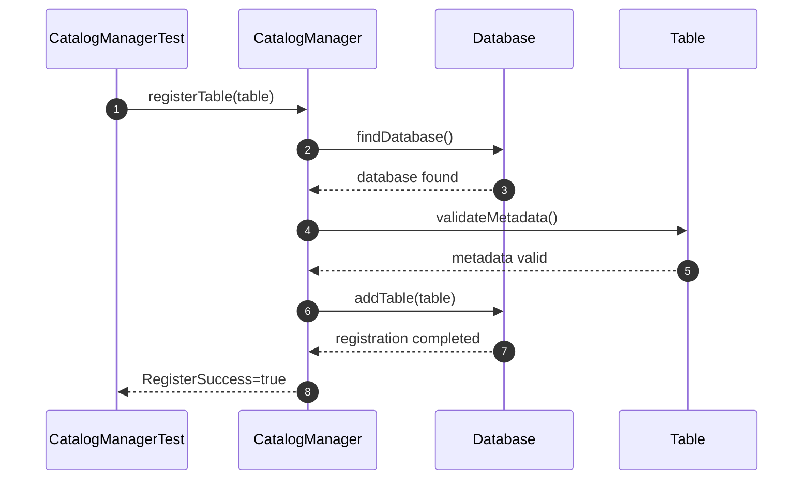
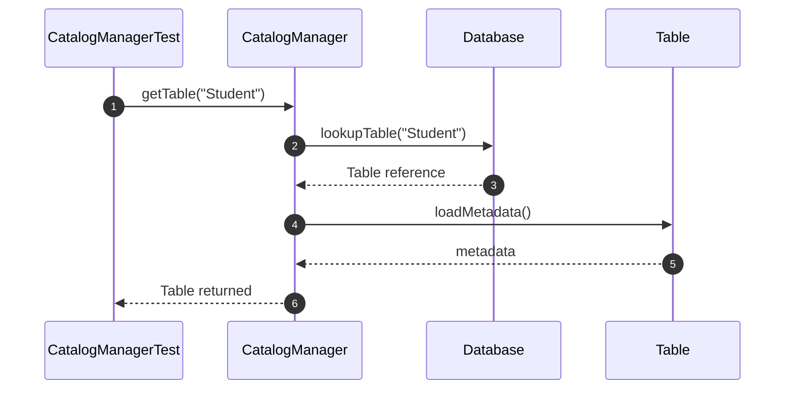
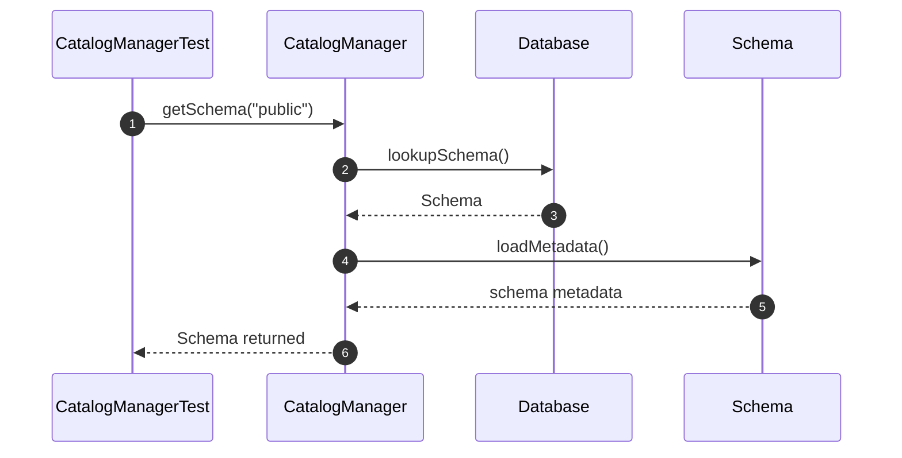
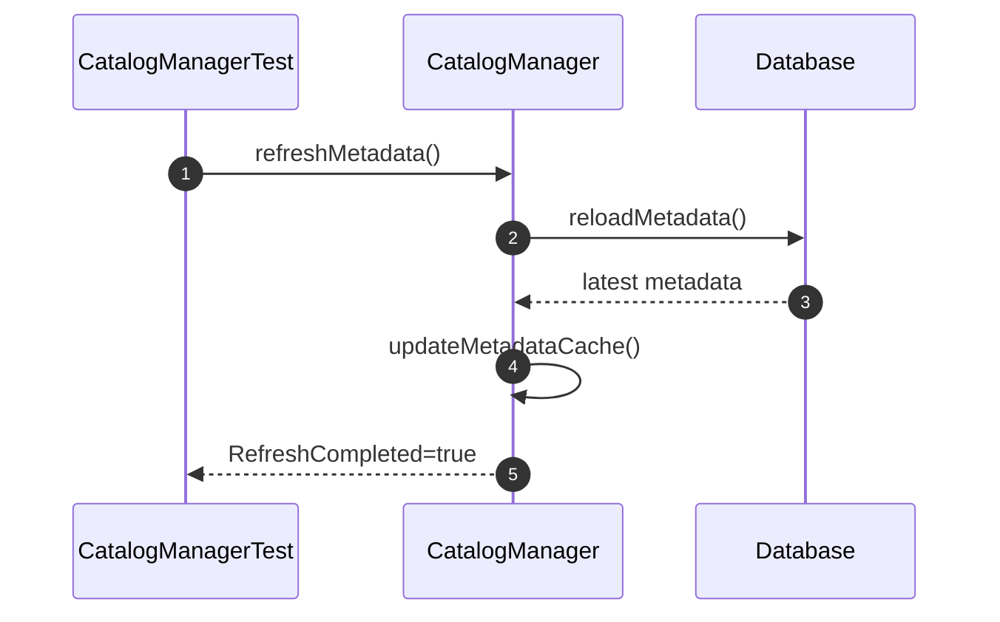
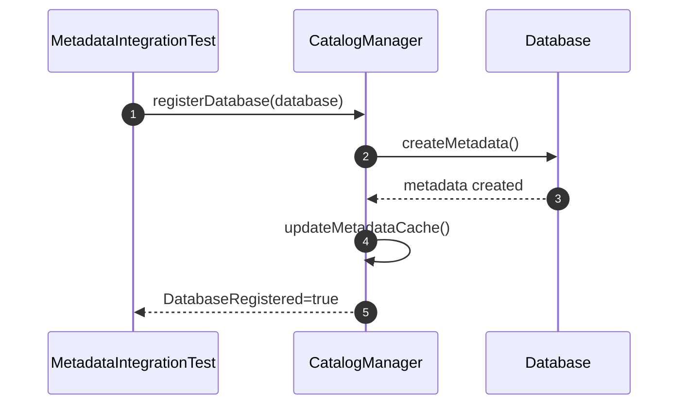
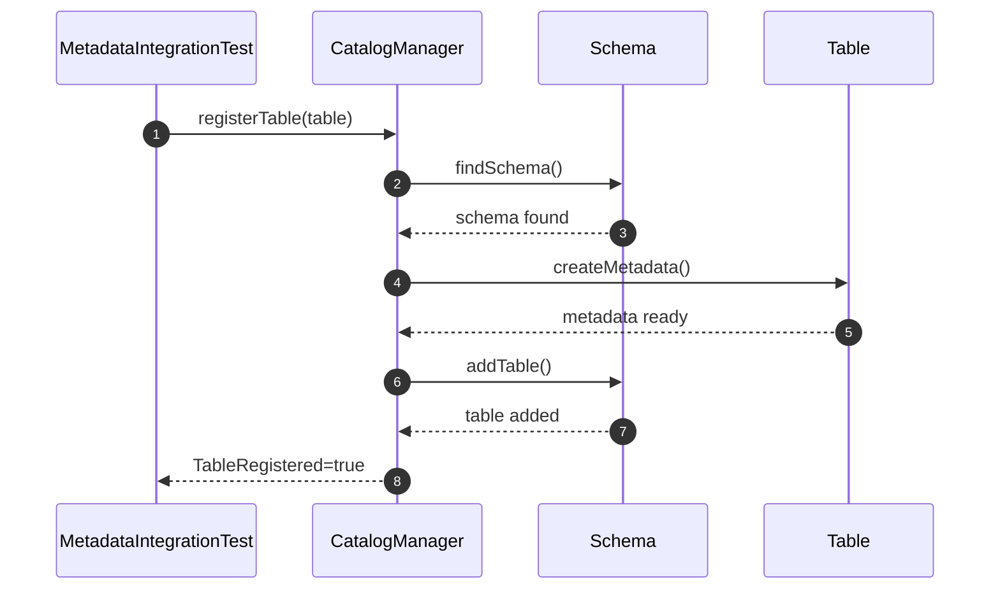
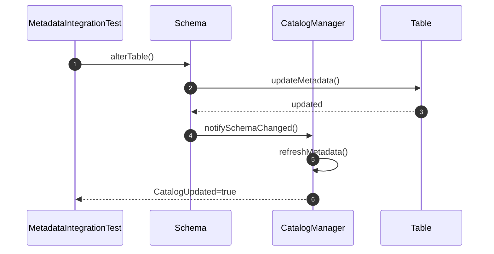
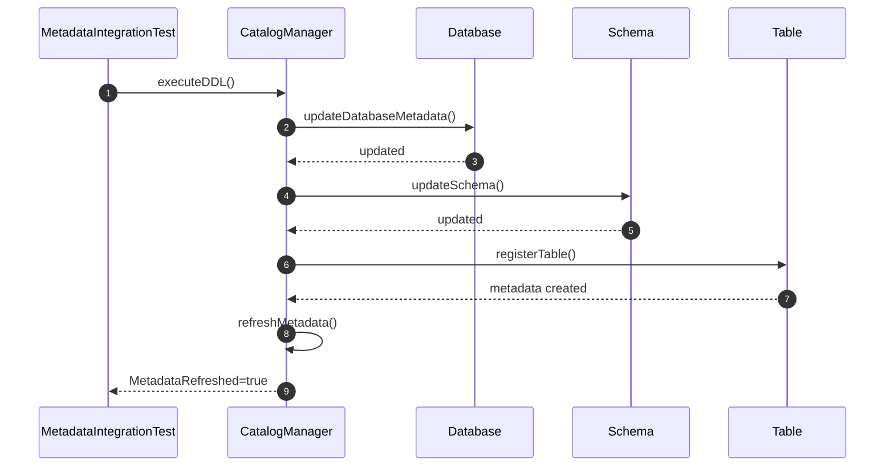

# Metadata Unit Test

## Catalog Manager

### 1. shouldRegisterTable()

### 2. shouldFindTable()

### 3. shouldFindSchema()

### 4. shouldRefreshMetadata()

# Metadata Integration Test 
### 5. shouldRegisterDatabaseMetadata()

### 6. shouldRegisterTableMetadata()

### 7. shouldUpdateCatalogAfterSchemaChange()

### 8. shouldRefreshMetadataAfterDDL()
