# Metadata Unit Test

## Catalog Manager

### 1. shouldRegisterDatabase()
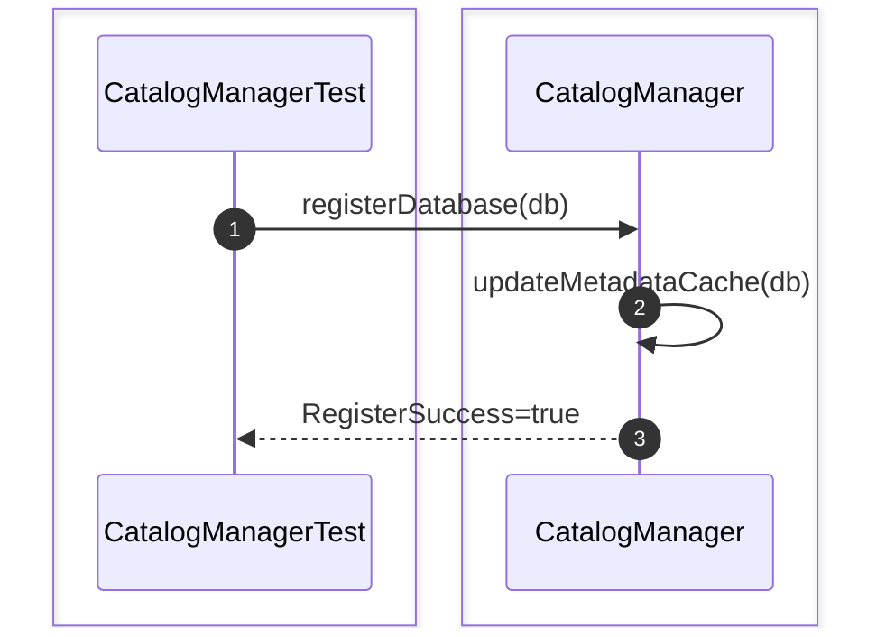
```mermaid
sequenceDiagram
    autonumber
    box #e1f5fe Test Suite
    participant Test as CatalogManagerTest
    end
    box #e8f5e9 Catalog Objects
    participant Catalog as CatalogManager
    end

    Test->>Catalog: registerDatabase(db)

    Catalog->>Catalog: updateMetadataCache(db)

    Catalog-->>Test: RegisterSuccess=true
```

### 2. shouldRegisterSchema()
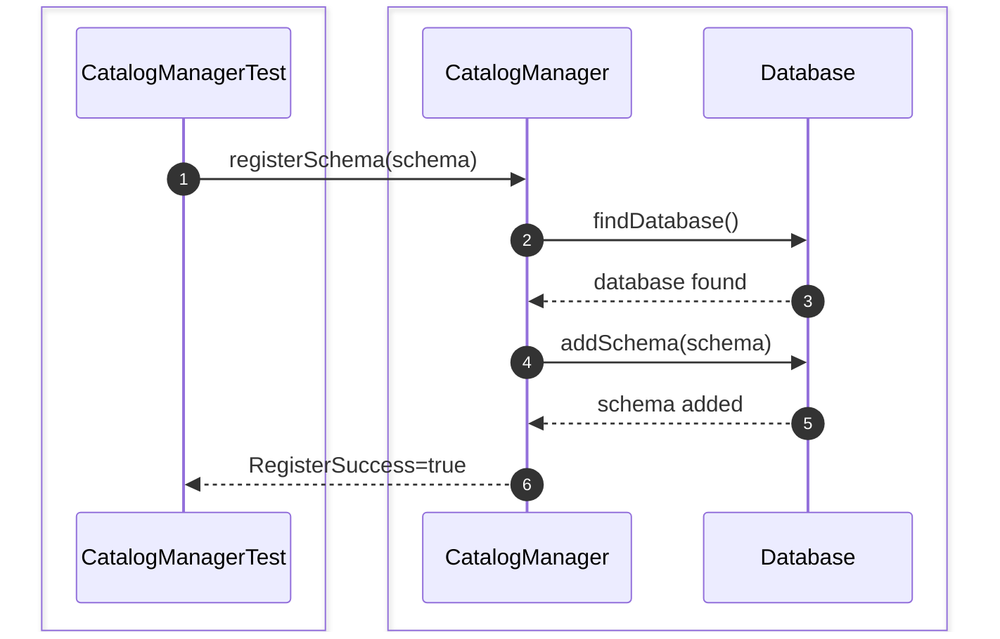
```mermaid
sequenceDiagram
    autonumber
    box #e1f5fe Test Suite
    participant Test as CatalogManagerTest
    end
    box #e8f5e9 Catalog Objects
    participant Catalog as CatalogManager
    participant DB as Database
    end

    Test->>Catalog: registerSchema(schema)

    Catalog->>DB: findDatabase()

    DB-->>Catalog: database found

    Catalog->>DB: addSchema(schema)

    DB-->>Catalog: schema added

    Catalog-->>Test: RegisterSuccess=true
```

### 3. shouldRegisterTable()
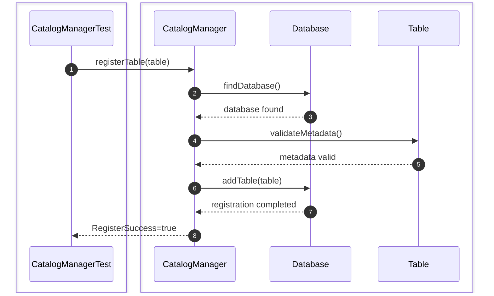
```mermaid
sequenceDiagram
    autonumber
    box #e1f5fe Test Suite
    participant Test as CatalogManagerTest
    end
    box #e8f5e9 Catalog Objects
    participant Catalog as CatalogManager
    participant DB as Database
    participant Tbl as Table
    end

    Test->>Catalog: registerTable(table)

    Catalog->>DB: findDatabase()

    DB-->>Catalog: database found

    Catalog->>Tbl: validateMetadata()

    Tbl-->>Catalog: metadata valid

    Catalog->>DB: addTable(table)

    DB-->>Catalog: registration completed

    Catalog-->>Test: RegisterSuccess=true
```

### 4. shouldRegisterIndex()
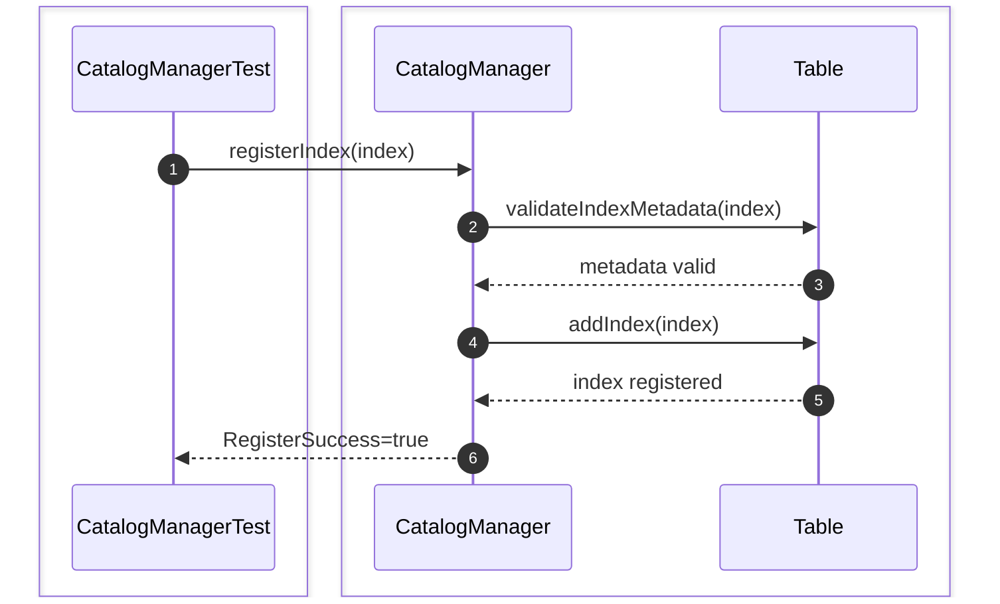
```mermaid
sequenceDiagram
    autonumber
    box #e1f5fe Test Suite
    participant Test as CatalogManagerTest
    end
    box #e8f5e9 Catalog Objects
    participant Catalog as CatalogManager
    participant Tbl as Table
    end

    Test->>Catalog: registerIndex(index)

    Catalog->>Tbl: validateIndexMetadata(index)

    Tbl-->>Catalog: metadata valid

    Catalog->>Tbl: addIndex(index)

    Tbl-->>Catalog: index registered

    Catalog-->>Test: RegisterSuccess=true
```

### 5. shouldFindDatabase()
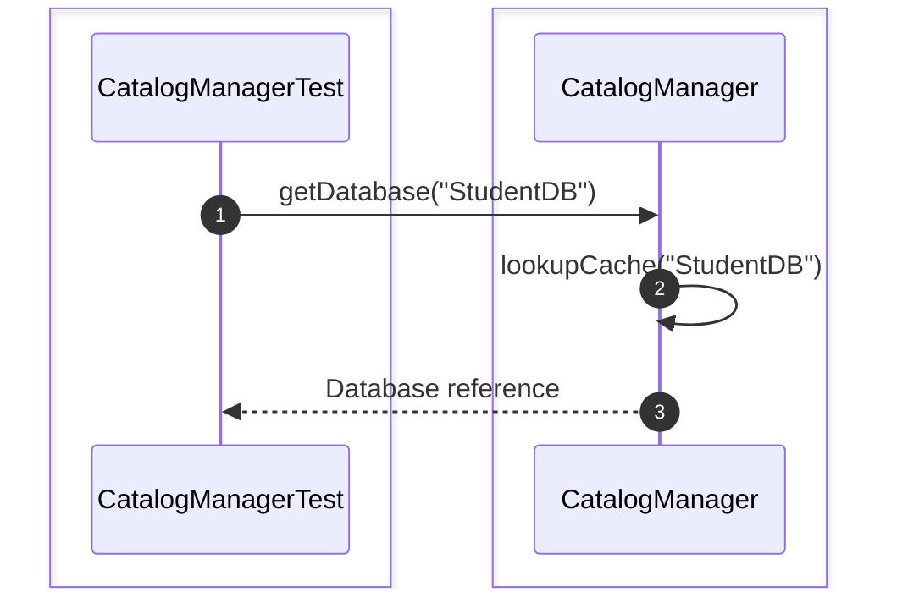
```mermaid
sequenceDiagram
    autonumber
    box #e1f5fe Test Suite
    participant Test as CatalogManagerTest
    end
    box #e8f5e9 Catalog Objects
    participant Catalog as CatalogManager
    end

    Test->>Catalog: getDatabase("StudentDB")

    Catalog->>Catalog: lookupCache("StudentDB")

    Catalog-->>Test: Database reference
```

### 6. shouldFindSchema()
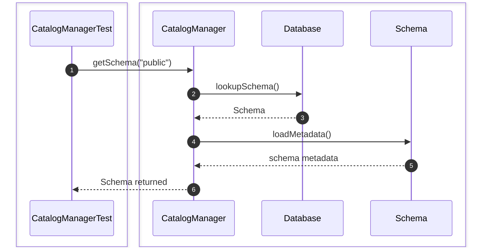
```mermaid
sequenceDiagram
    autonumber
    box #e1f5fe Test Suite
    participant Test as CatalogManagerTest
    end
    box #e8f5e9 Catalog Objects
    participant Catalog as CatalogManager
    participant DB as Database
    participant Schema as Schema
    end

    Test->>Catalog: getSchema("public")

    Catalog->>DB: lookupSchema()

    DB-->>Catalog: Schema

    Catalog->>Schema: loadMetadata()

    Schema-->>Catalog: schema metadata

    Catalog-->>Test: Schema returned
```

### 7. shouldFindTable()
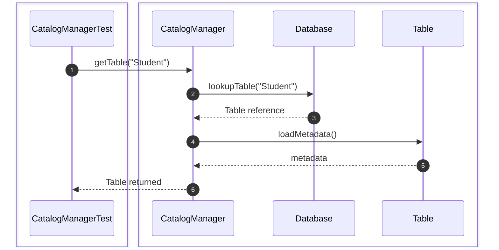
```mermaid
sequenceDiagram
    autonumber
    box #e1f5fe Test Suite
    participant Test as CatalogManagerTest
    end
    box #e8f5e9 Catalog Objects
    participant Catalog as CatalogManager
    participant DB as Database
    participant Tbl as Table
    end

    Test->>Catalog: getTable("Student")

    Catalog->>DB: lookupTable("Student")

    DB-->>Catalog: Table reference

    Catalog->>Tbl: loadMetadata()

    Tbl-->>Catalog: metadata

    Catalog-->>Test: Table returned
```

### 8. shouldFindIndex()
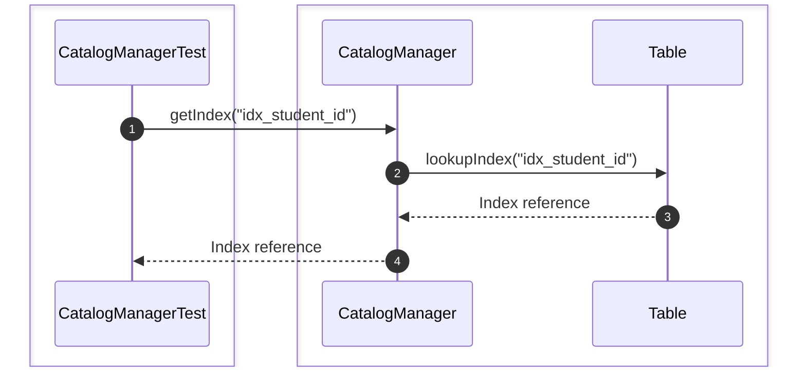
```mermaid
sequenceDiagram
    autonumber
    box #e1f5fe Test Suite
    participant Test as CatalogManagerTest
    end
    box #e8f5e9 Catalog Objects
    participant Catalog as CatalogManager
    participant Tbl as Table
    end

    Test->>Catalog: getIndex("idx_student_id")

    Catalog->>Tbl: lookupIndex("idx_student_id")

    Tbl-->>Catalog: Index reference

    Catalog-->>Test: Index reference
```

### 9. shouldRefreshMetadata()
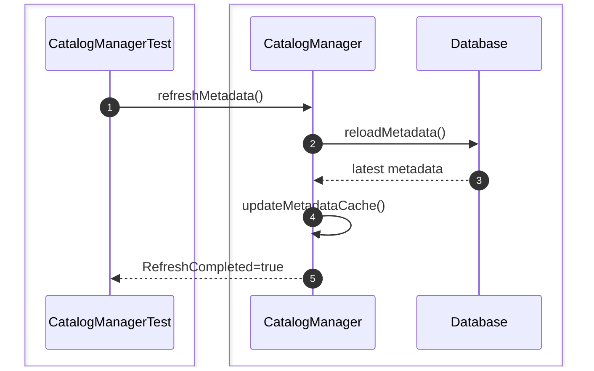
```mermaid
sequenceDiagram
    autonumber
    box #e1f5fe Test Suite
    participant Test as CatalogManagerTest
    end
    box #e8f5e9 Catalog Objects
    participant Catalog as CatalogManager
    participant DB as Database
    end

    Test->>Catalog: refreshMetadata()

    Catalog->>DB: reloadMetadata()

    DB-->>Catalog: latest metadata

    Catalog->>Catalog: updateMetadataCache()

    Catalog-->>Test: RefreshCompleted=true
```

### 10. shouldInvalidateMetadataCache()
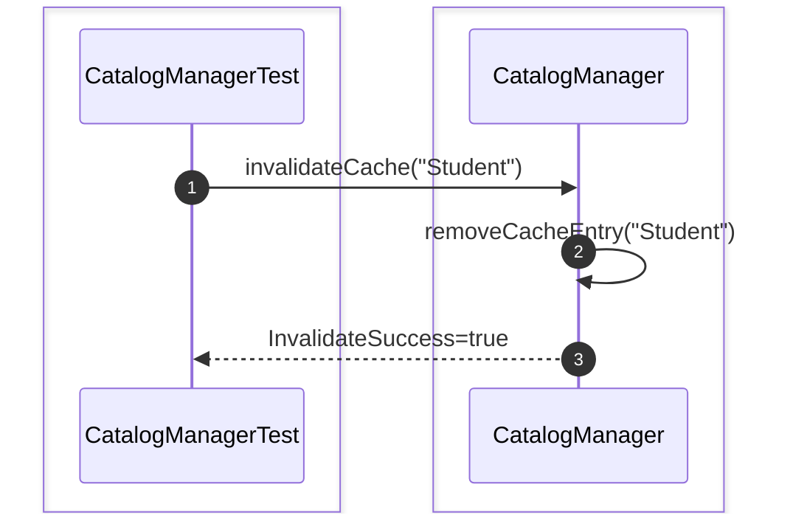
```mermaid
sequenceDiagram
    autonumber
    box #e1f5fe Test Suite
    participant Test as CatalogManagerTest
    end
    box #e8f5e9 Catalog Objects
    participant Catalog as CatalogManager
    end

    Test->>Catalog: invalidateCache("Student")

    Catalog->>Catalog: removeCacheEntry("Student")

    Catalog-->>Test: InvalidateSuccess=true
```

### 11. shouldLoadMetadataFromDisk()
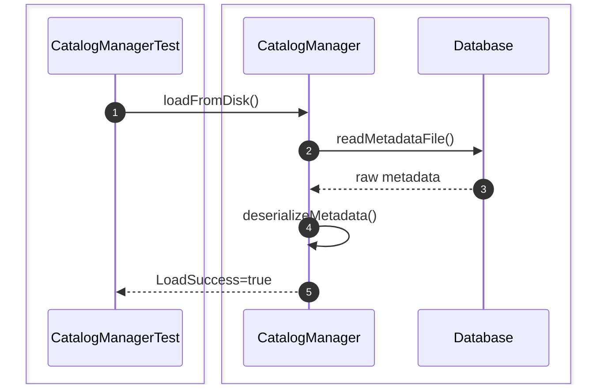
```mermaid
sequenceDiagram
    autonumber
    box #e1f5fe Test Suite
    participant Test as CatalogManagerTest
    end
    box #e8f5e9 Catalog Objects
    participant Catalog as CatalogManager
    participant DB as Database
    end

    Test->>Catalog: loadFromDisk()

    Catalog->>DB: readMetadataFile()

    DB-->>Catalog: raw metadata

    Catalog->>Catalog: deserializeMetadata()

    Catalog-->>Test: LoadSuccess=true
```

### 12. shouldCacheFrequentlyUsedMetadata()
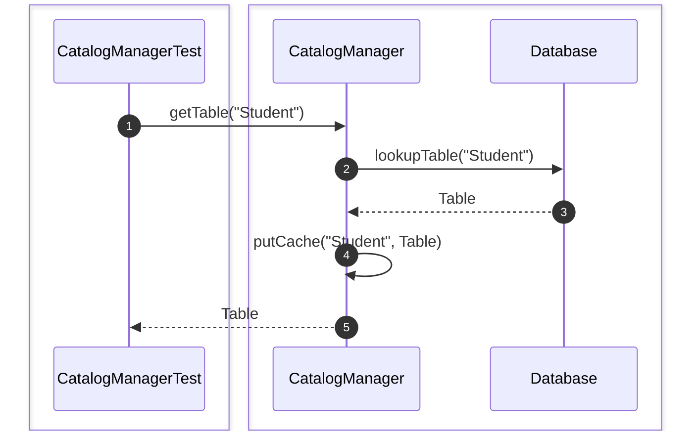
```mermaid
sequenceDiagram
    autonumber
    box #e1f5fe Test Suite
    participant Test as CatalogManagerTest
    end
    box #e8f5e9 Catalog Objects
    participant Catalog as CatalogManager
    participant DB as Database
    end

    Test->>Catalog: getTable("Student")

    Catalog->>DB: lookupTable("Student")

    DB-->>Catalog: Table

    Catalog->>Catalog: putCache("Student", Table)

    Catalog-->>Test: Table
```

### 13. shouldUpdateTableMetadata()
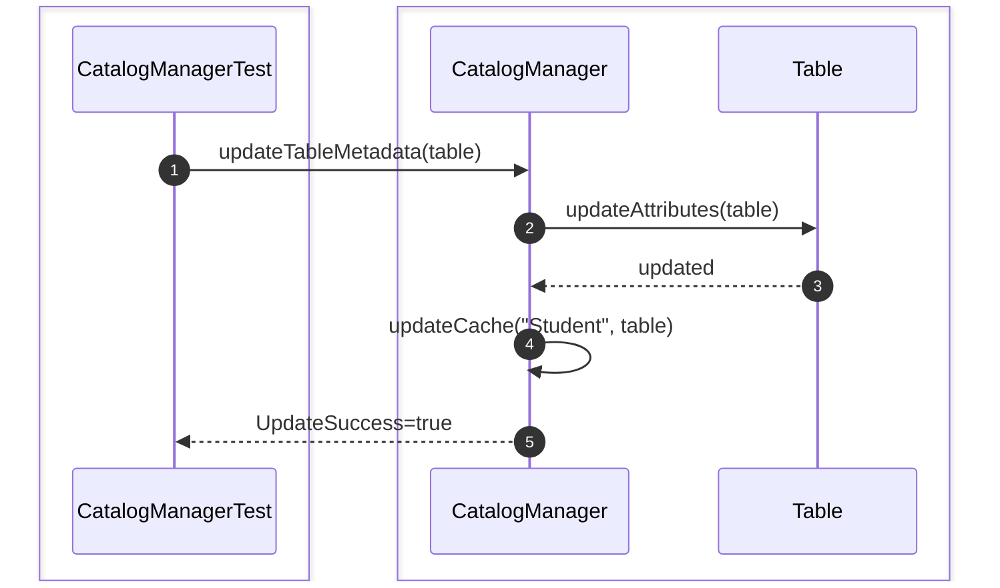
```mermaid
sequenceDiagram
    autonumber
    box #e1f5fe Test Suite
    participant Test as CatalogManagerTest
    end
    box #e8f5e9 Catalog Objects
    participant Catalog as CatalogManager
    participant Tbl as Table
    end

    Test->>Catalog: updateTableMetadata(table)

    Catalog->>Tbl: updateAttributes(table)

    Tbl-->>Catalog: updated

    Catalog->>Catalog: updateCache("Student", table)

    Catalog-->>Test: UpdateSuccess=true
```

### 14. shouldUpdateIndexMetadata()
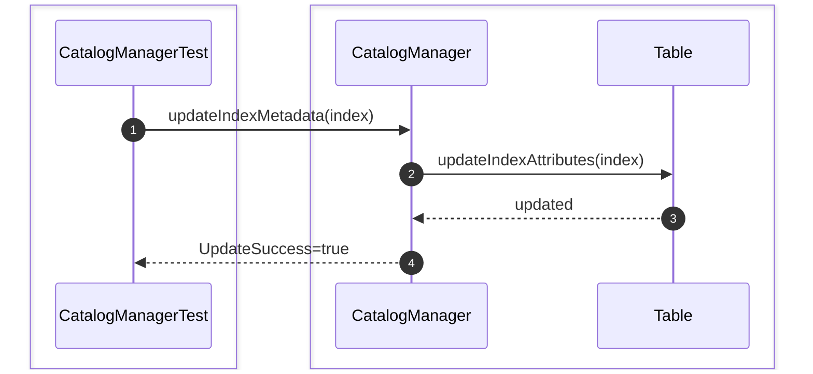
```mermaid
sequenceDiagram
    autonumber
    box #e1f5fe Test Suite
    participant Test as CatalogManagerTest
    end
    box #e8f5e9 Catalog Objects
    participant Catalog as CatalogManager
    participant Tbl as Table
    end

    Test->>Catalog: updateIndexMetadata(index)

    Catalog->>Tbl: updateIndexAttributes(index)

    Tbl-->>Catalog: updated

    Catalog-->>Test: UpdateSuccess=true
```

### 15. shouldRemoveTableMetadata()
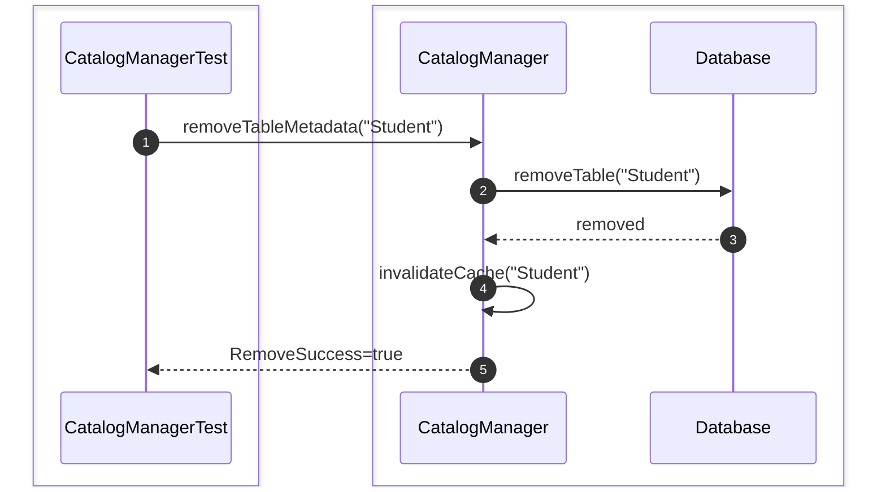
```mermaid
sequenceDiagram
    autonumber
    box #e1f5fe Test Suite
    participant Test as CatalogManagerTest
    end
    box #e8f5e9 Catalog Objects
    participant Catalog as CatalogManager
    participant DB as Database
    end

    Test->>Catalog: removeTableMetadata("Student")

    Catalog->>DB: removeTable("Student")

    DB-->>Catalog: removed

    Catalog->>Catalog: invalidateCache("Student")

    Catalog-->>Test: RemoveSuccess=true
```

### 16. shouldRemoveSchemaMetadata()
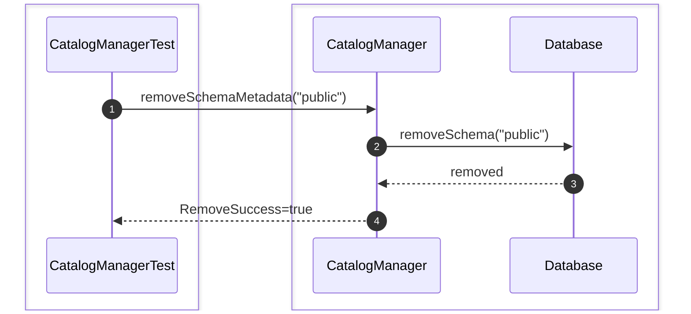
```mermaid
sequenceDiagram
    autonumber
    box #e1f5fe Test Suite
    participant Test as CatalogManagerTest
    end
    box #e8f5e9 Catalog Objects
    participant Catalog as CatalogManager
    participant DB as Database
    end

    Test->>Catalog: removeSchemaMetadata("public")

    Catalog->>DB: removeSchema("public")

    DB-->>Catalog: removed

    Catalog-->>Test: RemoveSuccess=true
```

### 17. shouldRemoveDatabaseMetadata()
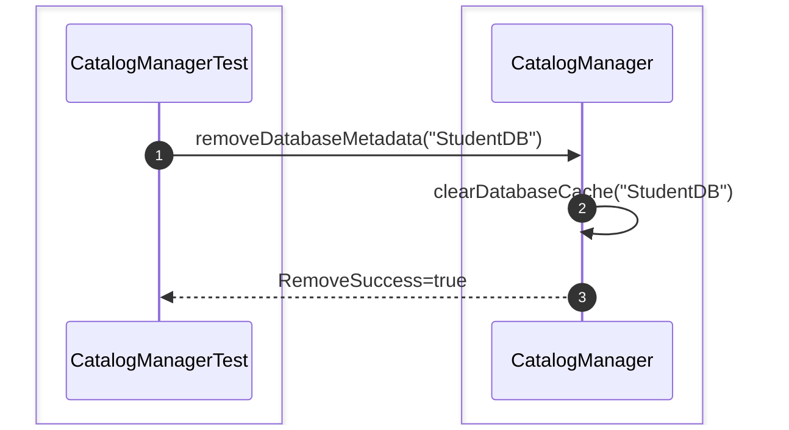
```mermaid
sequenceDiagram
    autonumber
    box #e1f5fe Test Suite
    participant Test as CatalogManagerTest
    end
    box #e8f5e9 Catalog Objects
    participant Catalog as CatalogManager
    end

    Test->>Catalog: removeDatabaseMetadata("StudentDB")

    Catalog->>Catalog: clearDatabaseCache("StudentDB")

    Catalog-->>Test: RemoveSuccess=true
```

### 18. shouldDetectDuplicateTableRegistration()
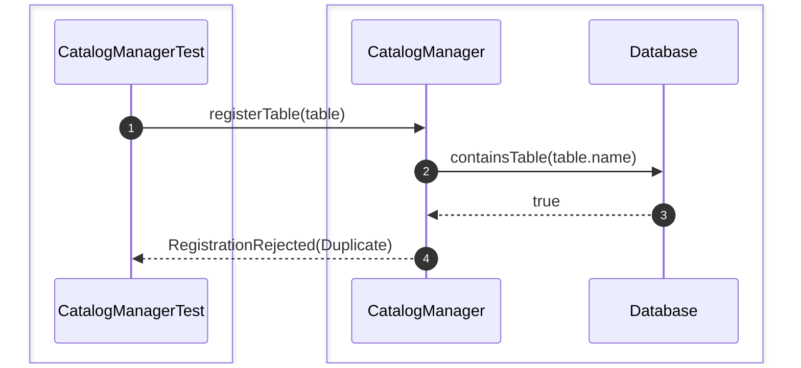
```mermaid
sequenceDiagram
    autonumber
    box #e1f5fe Test Suite
    participant Test as CatalogManagerTest
    end
    box #e8f5e9 Catalog Objects
    participant Catalog as CatalogManager
    participant DB as Database
    end

    Test->>Catalog: registerTable(table)

    Catalog->>DB: containsTable(table.name)

    DB-->>Catalog: true

    Catalog-->>Test: RegistrationRejected(Duplicate)
```

### 19. shouldRejectUnknownDatabase()
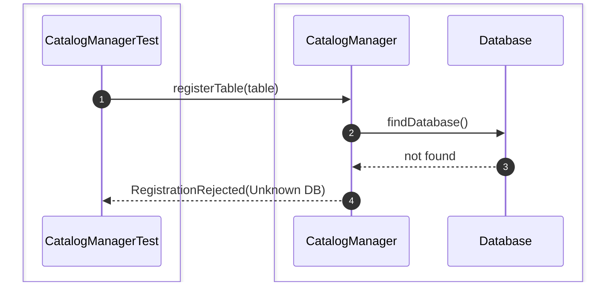
```mermaid
sequenceDiagram
    autonumber
    box #e1f5fe Test Suite
    participant Test as CatalogManagerTest
    end
    box #e8f5e9 Catalog Objects
    participant Catalog as CatalogManager
    participant DB as Database
    end

    Test->>Catalog: registerTable(table)

    Catalog->>DB: findDatabase()

    DB-->>Catalog: not found

    Catalog-->>Test: RegistrationRejected(Unknown DB)
```

### 20. shouldReturnCachedMetadata()
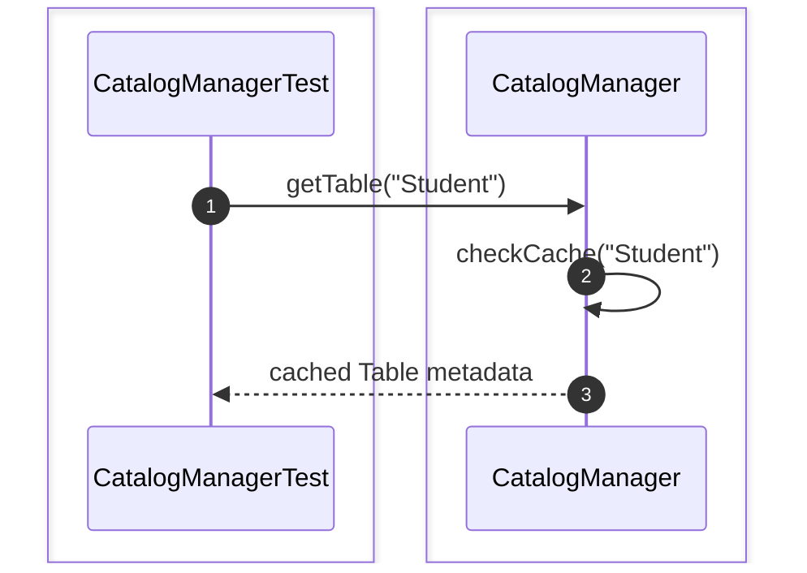
```mermaid
sequenceDiagram
    autonumber
    box #e1f5fe Test Suite
    participant Test as CatalogManagerTest
    end
    box #e8f5e9 Catalog Objects
    participant Catalog as CatalogManager
    end

    Test->>Catalog: getTable("Student")

    Catalog->>Catalog: checkCache("Student")

    Catalog-->>Test: cached Table metadata
```

# Metadata Integration Test

### 21. shouldRegisterDatabaseMetadata()
```mermaid
sequenceDiagram
    autonumber
    box #e1f5fe Test Suite
    participant Test as MetadataIntegrationTest
    end
    box #e8f5e9 Catalog Objects
    participant Catalog as CatalogManager
    participant DB as Database
    end

    Test->>Catalog: registerDatabase(database)

    Catalog->>DB: createMetadata()

    DB-->>Catalog: metadata created

    Catalog->>Catalog: updateMetadataCache()

    Catalog-->>Test: DatabaseRegistered=true
```

### 22. shouldRegisterSchemaMetadata()
```mermaid
sequenceDiagram
    autonumber
    box #e1f5fe Test Suite
    participant Test as MetadataIntegrationTest
    end
    box #e8f5e9 Catalog Objects
    participant Catalog as CatalogManager
    participant DB as Database
    participant Schema as Schema
    end

    Test->>Catalog: registerSchema(schema)

    Catalog->>DB: findDatabase()

    DB-->>Catalog: db found

    Catalog->>Schema: createMetadata()

    Schema-->>Catalog: schema metadata created

    Catalog->>DB: addSchema(schema)

    DB-->>Catalog: schema stored

    Catalog-->>Test: SchemaRegistered=true
```

### 23. shouldRegisterTableMetadata()
```mermaid
sequenceDiagram
    autonumber
    box #e1f5fe Test Suite
    participant Test as MetadataIntegrationTest
    end
    box #e8f5e9 Catalog Objects
    participant Catalog as CatalogManager
    participant Schema as Schema
    participant Tbl as Table
    end

    Test->>Catalog: registerTable(table)

    Catalog->>Schema: findSchema()

    Schema-->>Catalog: schema found

    Catalog->>Tbl: createMetadata()

    Tbl-->>Catalog: metadata ready

    Catalog->>Schema: addTable()

    Schema-->>Catalog: table added

    Catalog-->>Test: TableRegistered=true
```

### 24. shouldRegisterIndexMetadata()
```mermaid
sequenceDiagram
    autonumber
    box #e1f5fe Test Suite
    participant Test as MetadataIntegrationTest
    end
    box #e8f5e9 Catalog Objects
    participant Catalog as CatalogManager
    participant Schema as Schema
    participant Tbl as Table
    end

    Test->>Catalog: registerIndex(index)

    Catalog->>Schema: findSchema()

    Schema-->>Catalog: schema found

    Catalog->>Tbl: findTable()

    Tbl-->>Catalog: table found

    Catalog->>Tbl: createIndexMetadata(index)

    Tbl-->>Catalog: index registered

    Catalog-->>Test: IndexRegistered=true
```

### 25. shouldUpdateCatalogAfterSchemaChange()
```mermaid
sequenceDiagram
    autonumber
    box #e1f5fe Test Suite
    participant Test as MetadataIntegrationTest
    end
    box #e8f5e9 Catalog Objects
    participant Schema as Schema
    participant Catalog as CatalogManager
    participant Tbl as Table
    end

    Test->>Schema: alterTable()

    Schema->>Tbl: updateMetadata()

    Tbl-->>Schema: updated

    Schema->>Catalog: notifySchemaChanged()

    Catalog->>Catalog: refreshMetadata()

    Catalog-->>Test: CatalogUpdated=true
```

### 26. shouldRefreshMetadataAfterDDL()
```mermaid
sequenceDiagram
    autonumber
    box #e1f5fe Test Suite
    participant Test as MetadataIntegrationTest
    end
    box #e8f5e9 Catalog Objects
    participant Catalog as CatalogManager
    participant DB as Database
    participant Schema as Schema
    participant Tbl as Table
    end

    Test->>Catalog: executeDDL()

    Catalog->>DB: updateDatabaseMetadata()

    DB-->>Catalog: updated

    Catalog->>Schema: updateSchema()

    Schema-->>Catalog: updated

    Catalog->>Tbl: registerTable()

    Tbl-->>Catalog: metadata created

    Catalog->>Catalog: refreshMetadata()

    Catalog-->>Test: MetadataRefreshed=true
```

### 27. shouldSynchronizeMetadataCache()
```mermaid
sequenceDiagram
    autonumber
    box #e1f5fe Test Suite
    participant Test as MetadataIntegrationTest
    end
    box #e8f5e9 Catalog Objects
    participant Catalog as CatalogManager
    participant DB as Database
    end

    Test->>Catalog: updateMetadata(table)

    Catalog->>Catalog: updateMetadataCache(table)

    Catalog->>DB: persistMetadata(table)

    DB-->>Catalog: persisted

    Catalog-->>Test: CacheSynchronized=true
```

### 28. shouldReloadMetadataAfterRestart()
```mermaid
sequenceDiagram
    autonumber
    box #e1f5fe Test Suite
    participant Test as MetadataIntegrationTest
    end
    box #e8f5e9 Catalog Objects
    participant Catalog as CatalogManager
    participant DB as Database
    end

    Test->>Catalog: initialize()

    Catalog->>DB: loadDatabaseMetadata()

    DB-->>Catalog: all tables/schemas metadata

    Catalog->>Catalog: warmupCache()

    Catalog-->>Test: InitializationCompleted=true
```