# Database Object Unit Test

## Database Test 

### 1. shouldOpenDatabase()
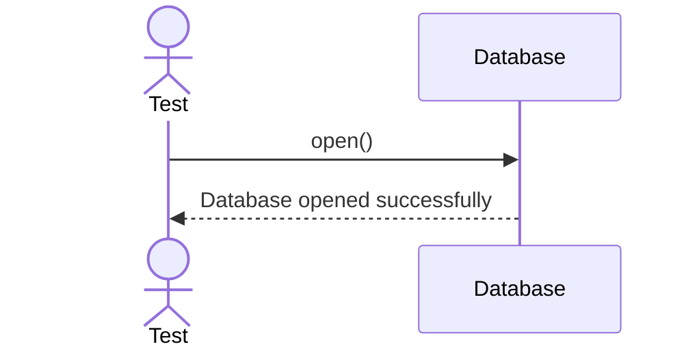

### 2. shouldCloseDatabase()

## Schema 

### 3. sequenceDiagram
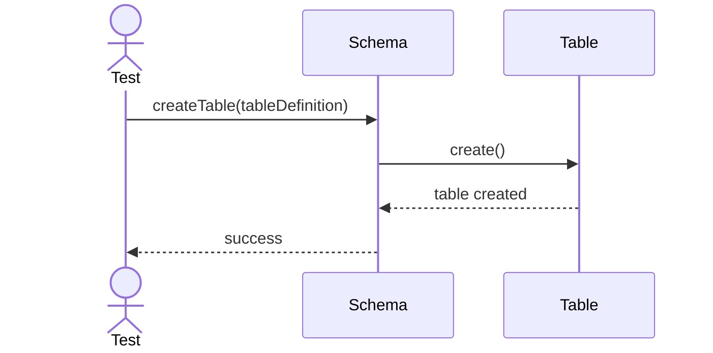

### 4. shouldDropTable()
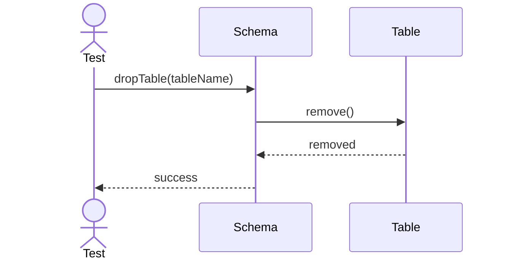

### 5. shouldCreateView()
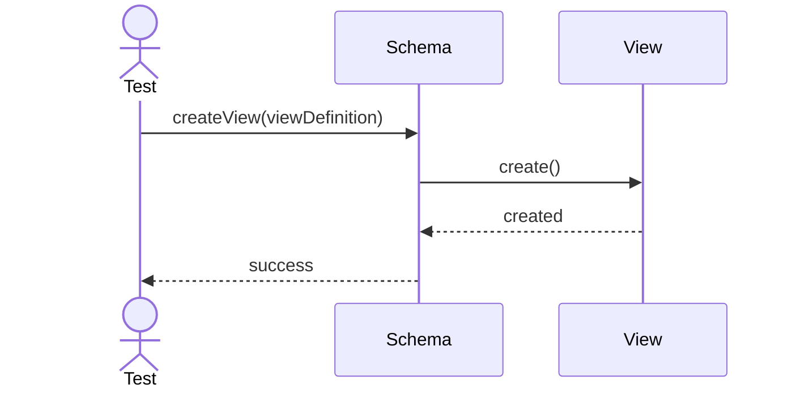

### 6. shouldCreateStoredProcedure()
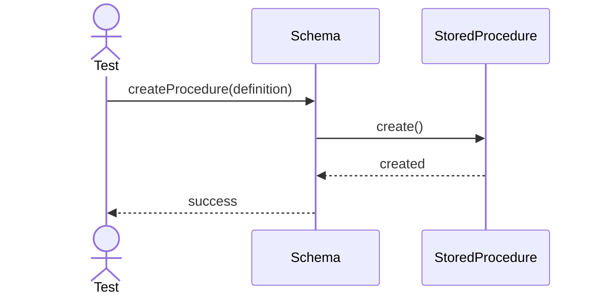
## Table

### 7. shouldInsertRow()
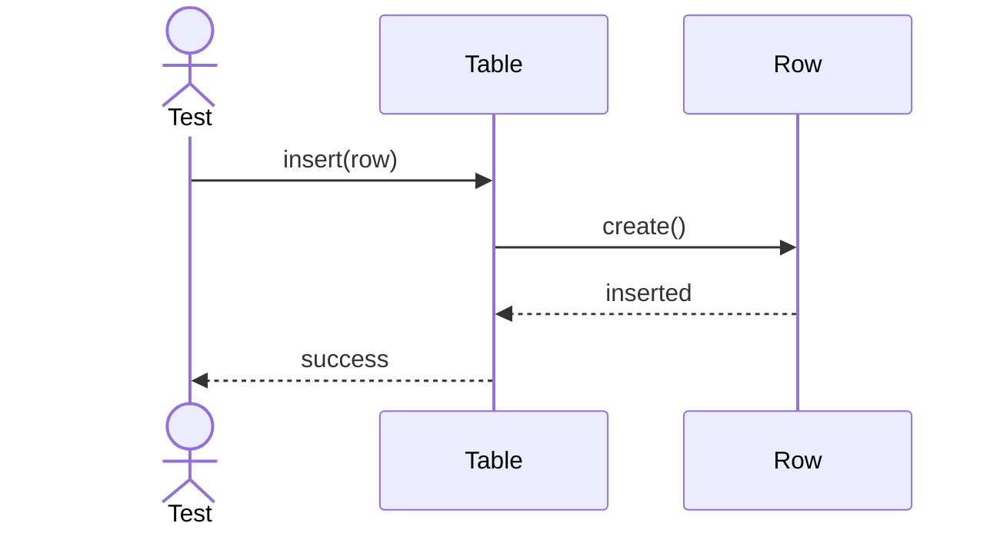

### 8. shouldUpdateRow()
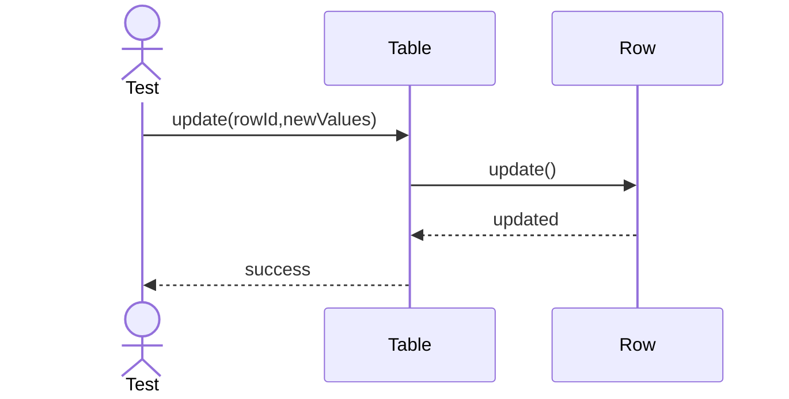

### 9. shouldDeleteRow()
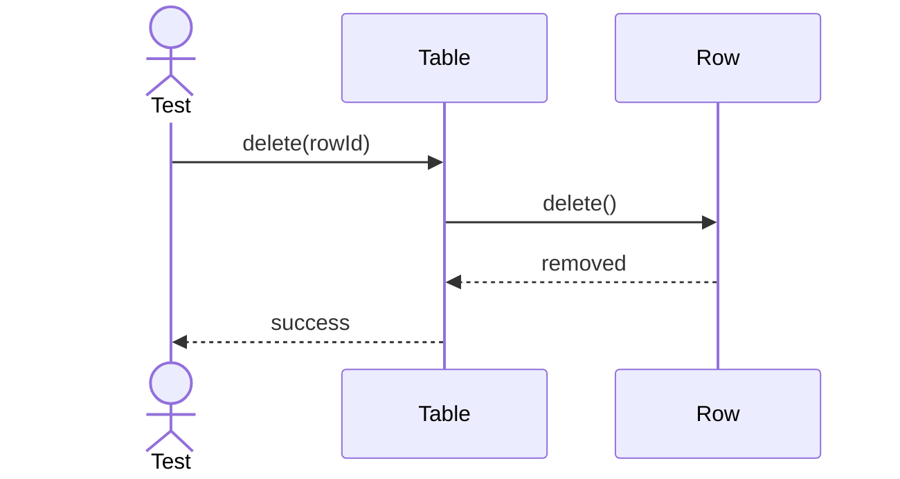

### 10. shouldTruncateTable()
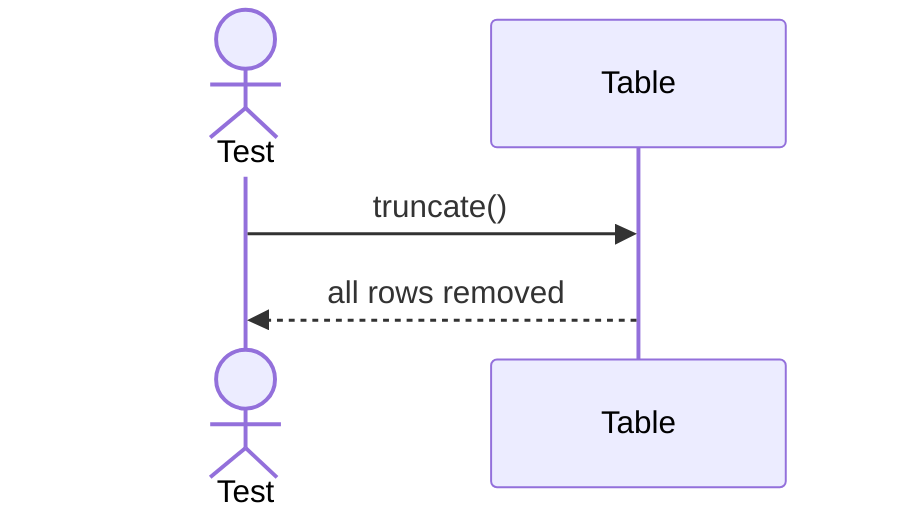

### 11. shouldAnalyzeTable()
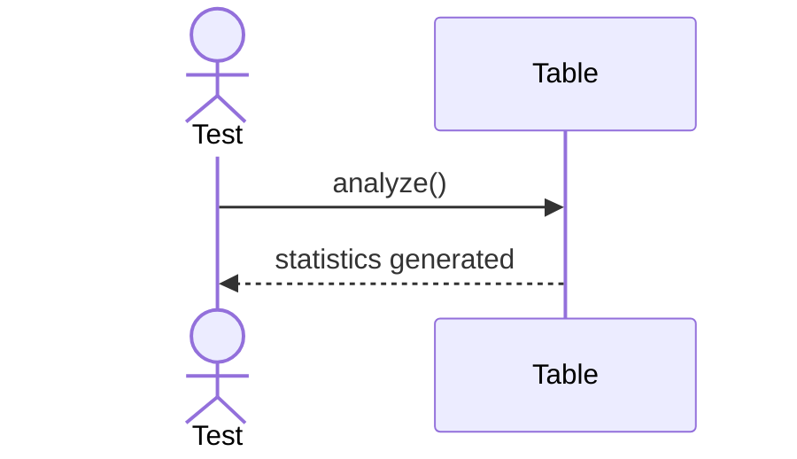

## Column 

### 12. shouldValidateColumnDefinition()
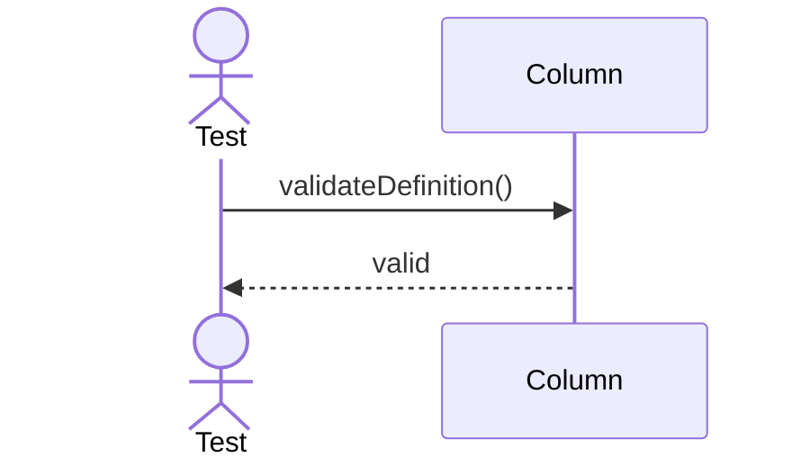

### 13. shouldUpdateColumnMetadata()
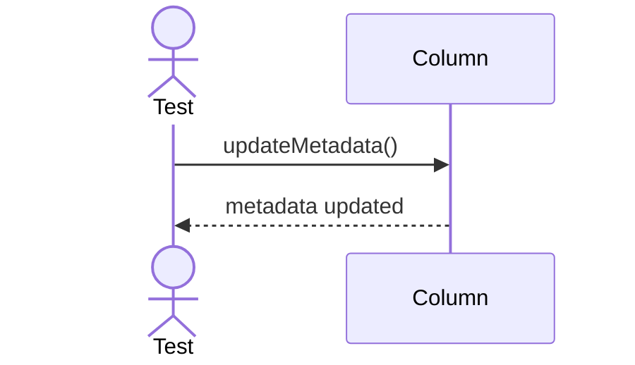
## Row

### 14. shouldCreateRow()
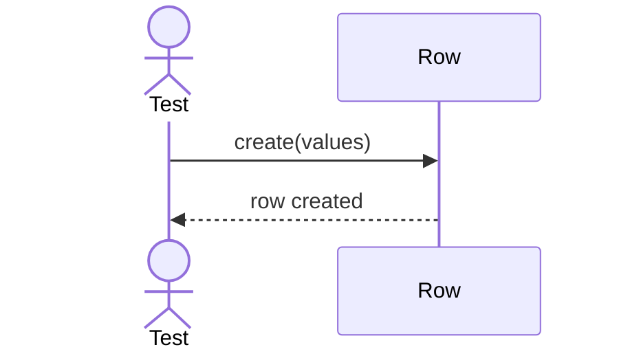

### 15. shouldUpdateRowVersion()
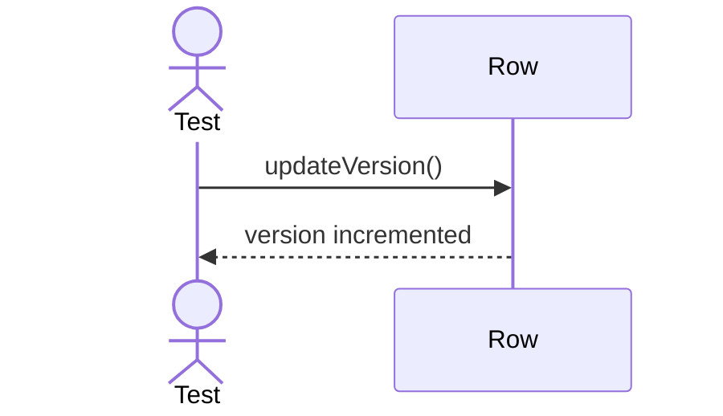

### 16. shouldDeleteRow()
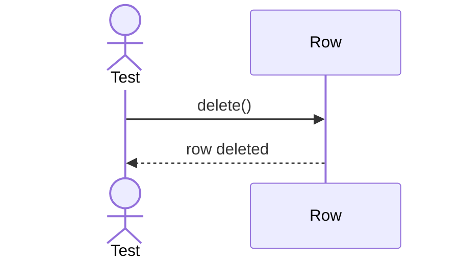

## Constraint

### 17. shouldValidatePrimaryKey()
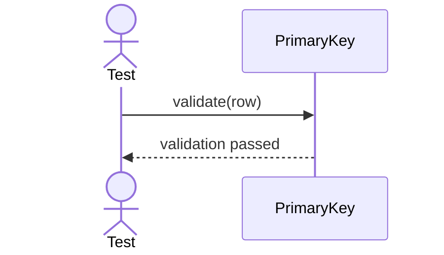

### 18. shouldValidateForeignKey()
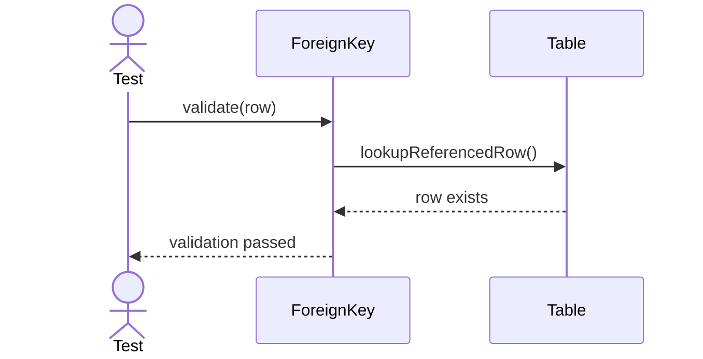

### 19. shouldValidateUniqueConstraint()
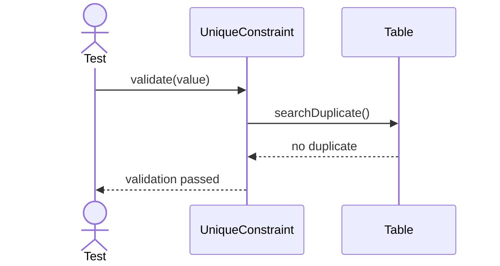

### 20. shouldValidateCheckConstraint()
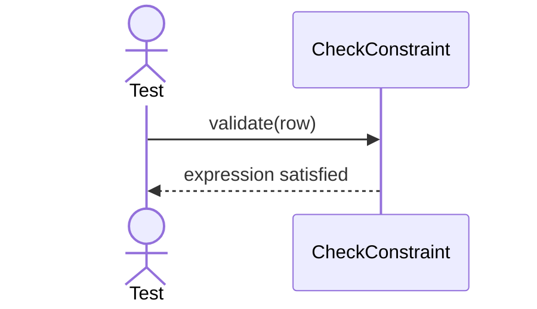

## Index 

### 21. shouldInsertKey()
```mermaid
sequenceDiagram
    actor Test
    participant Index

    Test->>Index: insertKey(key,rowId)
    Index-->>Test: key inserted
```

### 22. shouldSearchKey()
```mermaid
sequenceDiagram
    actor Test
    participant Index

    Test->>Index: search(key)
    Index-->>Test: rowId
```

## 23. shouldDeleteKey()
```mermaid
sequenceDiagram
    actor Test
    participant Index

    Test->>Index: deleteKey(key)
    Index-->>Test: key removed
```

## 24. shouldRebuildIndex()
```mermaid
sequenceDiagram
    actor Test
    participant Index
    participant Table

    Test->>Index: rebuild()
    Index->>Table: scanRows()
    Table-->>Index: rows
    Index-->>Test: rebuild completed
```

## Partition 

### 25. shouldPartitionTable()
```mermaid
sequenceDiagram
    actor Test
    participant Partition
    participant Table

    Test->>Partition: createPartition()
    Partition->>Table: reorganizeRows()
    Table-->>Partition: completed
    Partition-->>Test: success
```

### 26. shouldLocatePartition()
```mermaid
sequenceDiagram
    actor Test
    participant Partition

    Test->>Partition: locatePartition(key)
    Partition-->>Test: target partition
```

## View

### 27. shouldExecuteViewQuery()
```mermaid 
sequenceDiagram
    actor Test
    participant View
    participant Table

    Test->>View: executeQuery()
    View->>Table: readRows()
    Table-->>View: result set
    View-->>Test: rows returned
```

### 28. shouldRefreshViewDefinition()
```mermaid
sequenceDiagram
    actor Test
    participant View

    Test->>View: refreshDefinition()
    View-->>Test: refreshed
```

## Store Procedure

### 29. shouldExecuteProcedure()
```mermaid
sequenceDiagram
    actor Test
    participant StoredProcedure

    Test->>StoredProcedure: execute()
    StoredProcedure-->>Test: execution completed
```

### 30. shouldPassProcedureParameters()
```mermaid
sequenceDiagram
    actor Test
    participant StoredProcedure

    Test->>StoredProcedure: execute(parameters)
    StoredProcedure-->>Test: execution completed
```

## Trigger 

### 31. shouldFireTrigger()
```mermaid
sequenceDiagram
    actor Test
    participant Trigger

    Test->>Trigger: fire()
    Trigger-->>Test: trigger executed
```

### 32. shouldExecuteBeforeInsertTrigger()
```mermaid
sequenceDiagram
    actor Test
    participant Table
    participant Trigger

    Test->>Table: insert(row)
    Table->>Trigger: BEFORE INSERT
    Trigger-->>Table: validation completed
    Table-->>Test: row inserted 
```

### 33. shouldExecuteAfterUpdateTrigger()
```mermaid
sequenceDiagram
    actor Test
    participant Table
    participant Trigger

    Test->>Table: update(row)
    Table->>Trigger: AFTER UPDATE
    Trigger-->>Table: post-processing completed
    Table-->>Test: update committed
```
## Sequence 

### 34. shouldGenerateNextValue()
```mermaid
sequenceDiagram
    actor Test
    participant Sequence

    Test->>Sequence: nextValue()
    Sequence-->>Test: next sequence value
``` 

## 35. shouldIncrementSequence()
```mermaid
sequenceDiagram
    actor Test
    participant Sequence

    Test->>Sequence: increment()
    Sequence-->>Test: current value increased
```

# Database Object Integration Test 

### 1. shouldCreateDatabaseWithSchemaAndTable()
```mermaid
sequenceDiagram
    actor Test

    participant Database
    participant Schema
    participant Table

    Test->>Database: open()

    Database->>Schema: createSchema("public")
    Schema-->>Database: schema created

    Database->>Schema: createTable(tableDefinition)
    Schema->>Table: create()
    Table-->>Schema: table created

    Schema-->>Database: success
    Database-->>Test: database initialized
```

### 2. shouldInsertRowWithConstraints()
```mermaid
sequenceDiagram
    actor Test

    participant Table
    participant PrimaryKey
    participant ForeignKey
    participant UniqueConstraint
    participant CheckConstraint
    participant Row

    Test->>Table: insert(row)

    Table->>PrimaryKey: validate(row)
    PrimaryKey-->>Table: valid

    Table->>ForeignKey: validate(row)
    ForeignKey-->>Table: valid

    Table->>UniqueConstraint: validate(row)
    UniqueConstraint-->>Table: valid

    Table->>CheckConstraint: validate(row)
    CheckConstraint-->>Table: valid

    Table->>Row: create()
    Row-->>Table: inserted

    Table-->>Test: insert success
```

### 3. shouldUseIndexForQueryExecution()
```mermaid
sequenceDiagram
    actor Test

    participant Table
    participant BTreeIndex
    participant Row

    Test->>Table: findByPrimaryKey(id)

    Table->>BTreeIndex: search(id)
    BTreeIndex-->>Table: row location

    Table->>Row: load(location)
    Row-->>Table: row data

    Table-->>Test: row returned
```
### 4. shouldExecuteTriggerDuringInsert()
```mermaid
sequenceDiagram
    actor Test

    participant Table
    participant Trigger
    participant Row

    Test->>Table: insert(row)

    Table->>Trigger: BEFORE INSERT
    Trigger-->>Table: validation completed

    Table->>Row: create()
    Row-->>Table: inserted

    Table->>Trigger: AFTER INSERT
    Trigger-->>Table: audit completed

    Table-->>Test: insert success
```
### 5. shouldExecuteStoredProcedureSuccessfully()
```mermaid
sequenceDiagram
    actor Test

    participant StoredProcedure
    participant Table
    participant Row

    Test->>StoredProcedure: execute(parameters)

    StoredProcedure->>Table: updateRows()

    Table->>Row: update()
    Row-->>Table: updated

    Table-->>StoredProcedure: success
    StoredProcedure-->>Test: execution completed
```
### 6. shouldReadDataFromView()
```mermaid
sequenceDiagram
    actor Test

    participant View
    participant Table
    participant Row

    Test->>View: executeQuery()

    View->>Table: scanRows()

    Table->>Row: read()
    Row-->>Table: data

    Table-->>View: result set
    View-->>Test: rows returned
```
### 7. shouldGenerateSequenceValueForInsert()
```mermaid
sequenceDiagram
    actor Test

    participant Sequence
    participant Table
    participant Row

    Test->>Sequence: nextValue()
    Sequence-->>Test: generated id

    Test->>Table: insert(row)

    Table->>Row: assignId(sequenceValue)
    Row-->>Table: row ready

    Table-->>Test: insert success
```


