# Database Object Unit Test

## Database Test

### 1. shouldCreateDatabase()
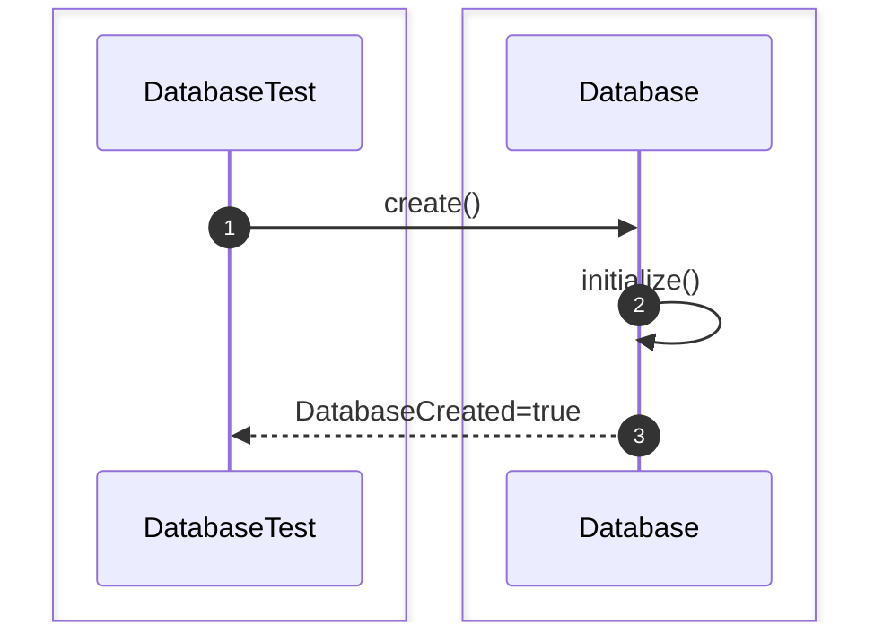
```mermaid
sequenceDiagram
    autonumber

    box #e1f5fe Test Suite
    participant Test as DatabaseTest
    end
    box #e8f5e9 Database Objects
    participant Database as Database
    end

    Test->>Database: create()
    Database->>Database: initialize()
    Database-->>Test: DatabaseCreated=true
```

### 2. shouldOpenDatabase()
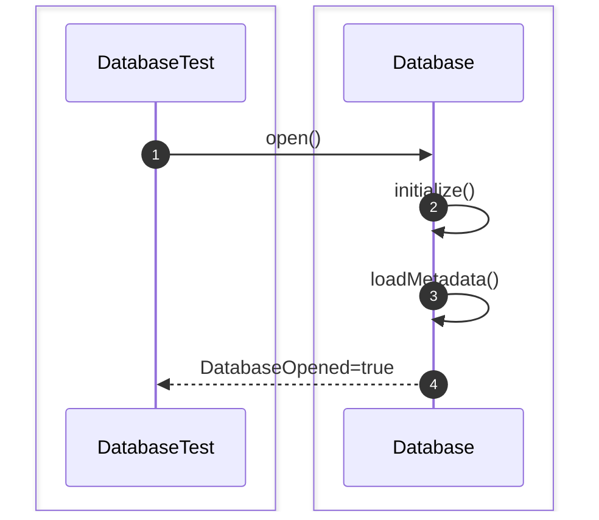
```mermaid
sequenceDiagram
    autonumber

    box #e1f5fe Test Suite
    participant Test as DatabaseTest
    end
    box #e8f5e9 Database Objects
    participant Database as Database
    end

    Test->>Database: open()
    Database->>Database: initialize()
    Database->>Database: loadMetadata()
    Database-->>Test: DatabaseOpened=true
```

### 3. shouldCloseDatabase()
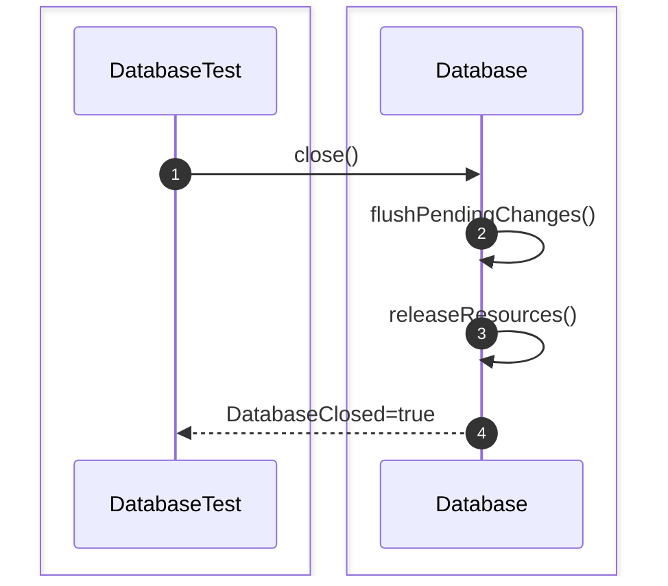
```mermaid
sequenceDiagram
    autonumber

    box #e1f5fe Test Suite
    participant Test as DatabaseTest
    end
    box #e8f5e9 Database Objects
    participant Database as Database
    end

    Test->>Database: close()
    Database->>Database: flushPendingChanges()
    Database->>Database: releaseResources()
    Database-->>Test: DatabaseClosed=true
```

### 4. shouldRenameDatabase()
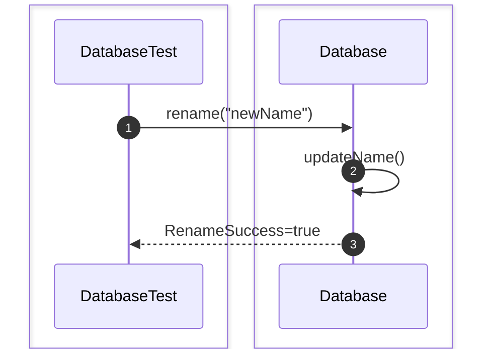
```mermaid
sequenceDiagram
    autonumber

    box #e1f5fe Test Suite
    participant Test as DatabaseTest
    end
    box #e8f5e9 Database Objects
    participant Database as Database
    end

    Test->>Database: rename("newName")
    Database->>Database: updateName()
    Database-->>Test: RenameSuccess=true
```

### 5. shouldDropDatabase()
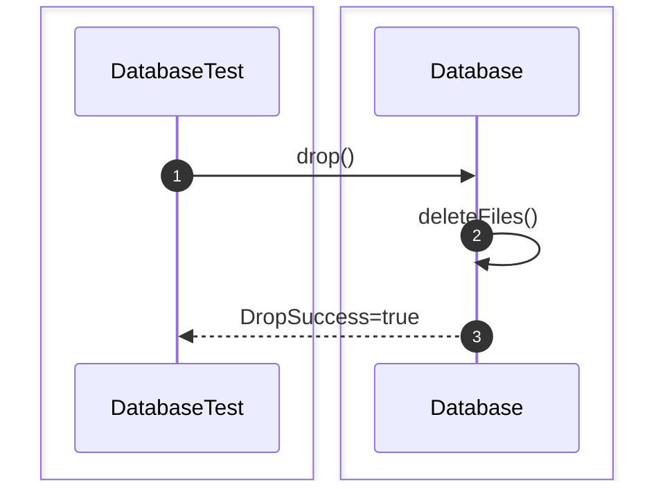
```mermaid
sequenceDiagram
    autonumber

    box #e1f5fe Test Suite
    participant Test as DatabaseTest
    end
    box #e8f5e9 Database Objects
    participant Database as Database
    end

    Test->>Database: drop()
    Database->>Database: deleteFiles()
    Database-->>Test: DropSuccess=true
```

### 6. shouldSetDatabaseOwner()
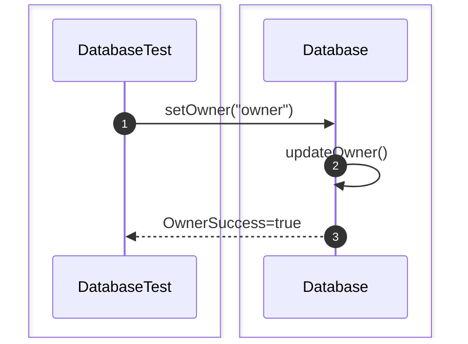
```mermaid
sequenceDiagram
    autonumber

    box #e1f5fe Test Suite
    participant Test as DatabaseTest
    end
    box #e8f5e9 Database Objects
    participant Database as Database
    end

    Test->>Database: setOwner("owner")
    Database->>Database: updateOwner()
    Database-->>Test: OwnerSuccess=true
```

### 7. shouldUpdateDatabaseStatus()
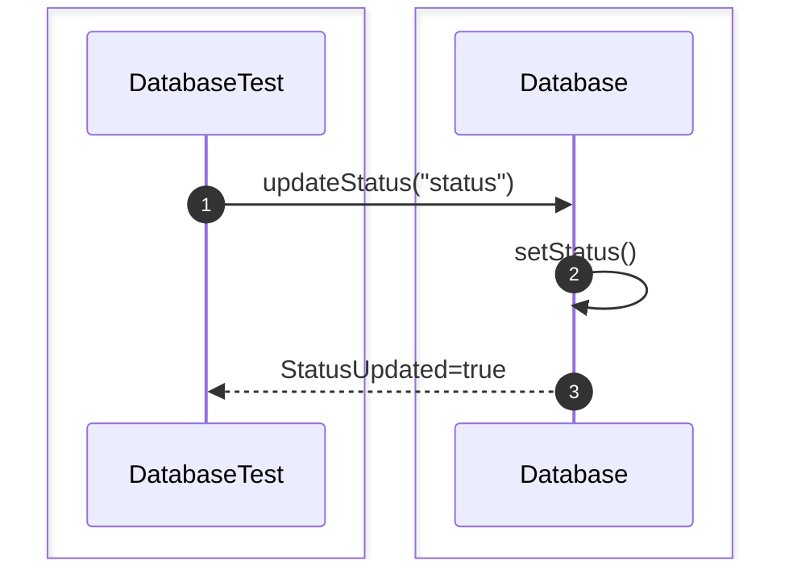
```mermaid
sequenceDiagram
    autonumber

    box #e1f5fe Test Suite
    participant Test as DatabaseTest
    end
    box #e8f5e9 Database Objects
    participant Database as Database
    end

    Test->>Database: updateStatus("status")
    Database->>Database: setStatus()
    Database-->>Test: StatusUpdated=true
```

### 8. shouldRejectOperationWhenClosed()
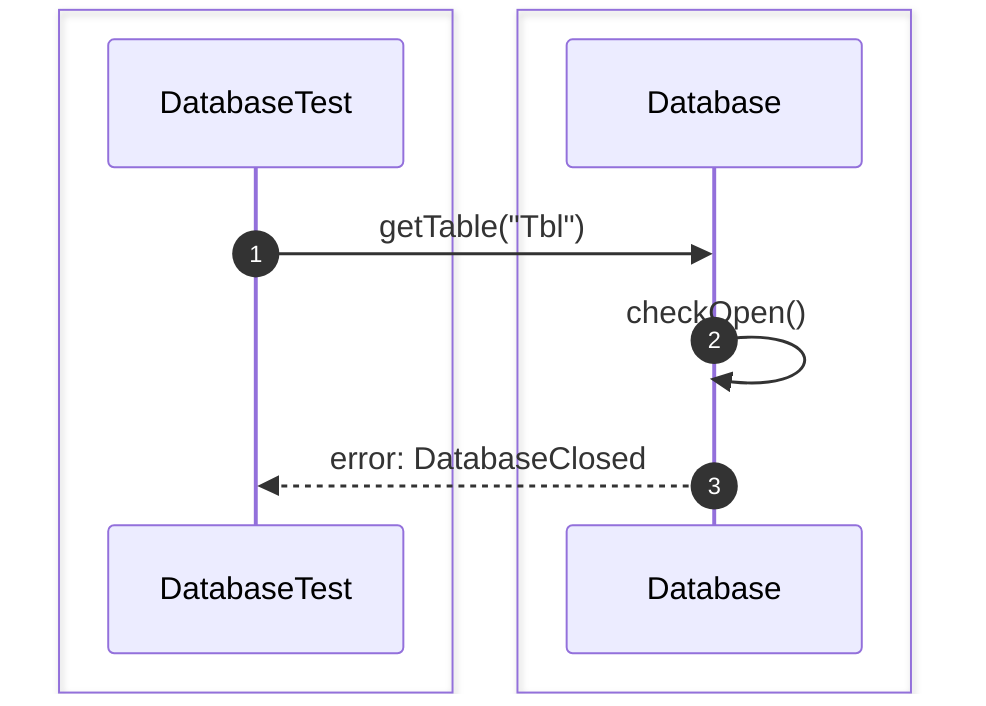
```mermaid
sequenceDiagram
    autonumber

    box #e1f5fe Test Suite
    participant Test as DatabaseTest
    end
    box #e8f5e9 Database Objects
    participant Database as Database
    end

    Test->>Database: getTable("Tbl")
    Database->>Database: checkOpen()
    Database-->>Test: error: DatabaseClosed
```

## Schema

### 1. shouldCreateTable()
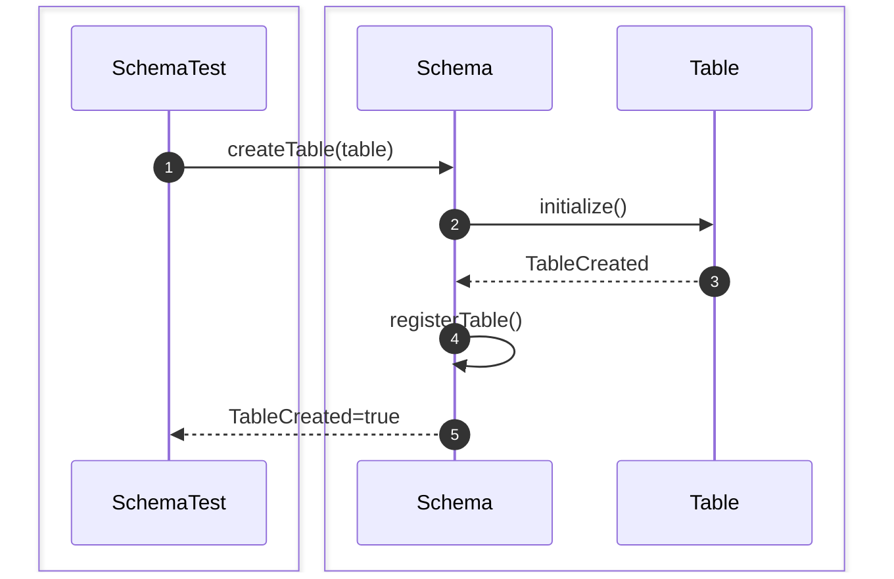
```mermaid
sequenceDiagram
    autonumber

    box #e1f5fe Test Suite
    participant Test as SchemaTest
    end
    box #e8f5e9 Database Objects
    participant Schema as Schema
    participant Table as Table
    end

    Test->>Schema: createTable(table)
    Schema->>Table: initialize()
    Table-->>Schema: TableCreated
    Schema->>Schema: registerTable()
    Schema-->>Test: TableCreated=true
```

### 2. shouldDropTable()
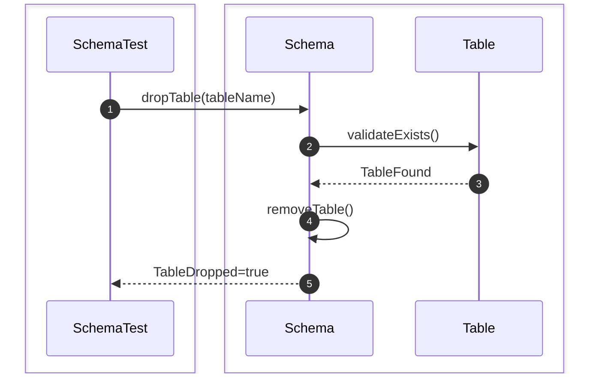
```mermaid
sequenceDiagram
    autonumber

    box #e1f5fe Test Suite
    participant Test as SchemaTest
    end
    box #e8f5e9 Database Objects
    participant Schema as Schema
    participant Table as Table
    end

    Test->>Schema: dropTable(tableName)
    Schema->>Table: validateExists()
    Table-->>Schema: TableFound
    Schema->>Schema: removeTable()
    Schema-->>Test: TableDropped=true
```

### 3. shouldRenameTable()
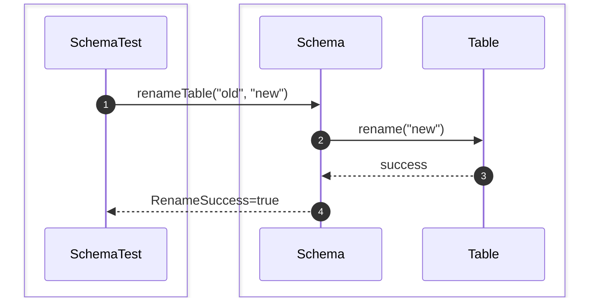
```mermaid
sequenceDiagram
    autonumber

    box #e1f5fe Test Suite
    participant Test as SchemaTest
    end
    box #e8f5e9 Database Objects
    participant Schema as Schema
    participant Table as Table
    end

    Test->>Schema: renameTable("old", "new")
    Schema->>Table: rename("new")
    Table-->>Schema: success
    Schema-->>Test: RenameSuccess=true
```

### 4. shouldCreateView()
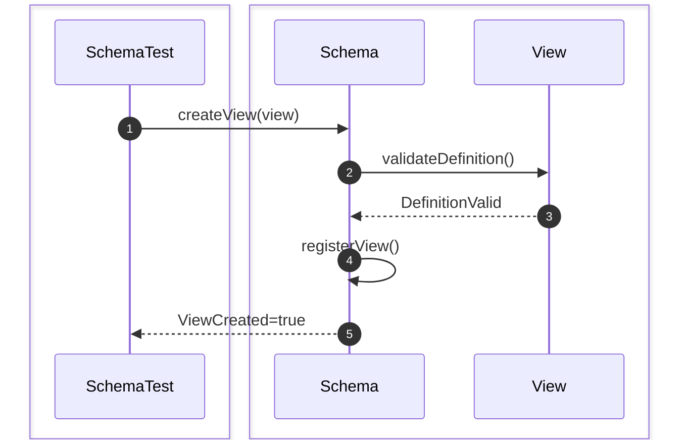
```mermaid
sequenceDiagram
    autonumber

    box #e1f5fe Test Suite
    participant Test as SchemaTest
    end
    box #e8f5e9 Database Objects
    participant Schema as Schema
    participant View as View
    end

    Test->>Schema: createView(view)
    Schema->>View: validateDefinition()
    View-->>Schema: DefinitionValid
    Schema->>Schema: registerView()
    Schema-->>Test: ViewCreated=true
```

### 5. shouldDropView()
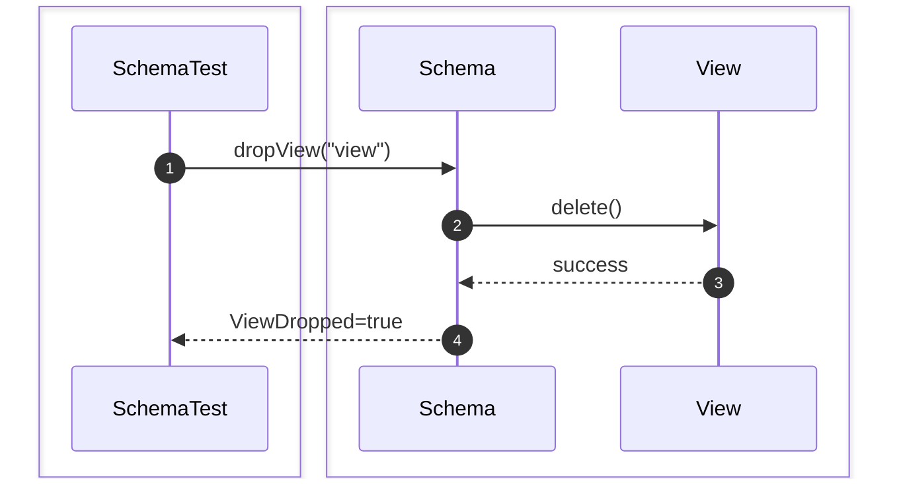
```mermaid
sequenceDiagram
    autonumber

    box #e1f5fe Test Suite
    participant Test as SchemaTest
    end
    box #e8f5e9 Database Objects
    participant Schema as Schema
    participant View as View
    end

    Test->>Schema: dropView("view")
    Schema->>View: delete()
    View-->>Schema: success
    Schema-->>Test: ViewDropped=true
```

### 6. shouldCreateStoredProcedure()
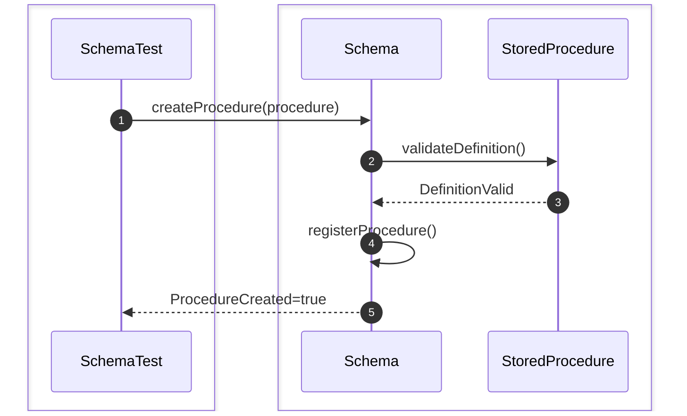
```mermaid
sequenceDiagram
    autonumber

    box #e1f5fe Test Suite
    participant Test as SchemaTest
    end
    box #e8f5e9 Database Objects
    participant Schema as Schema
    participant Procedure as StoredProcedure
    end

    Test->>Schema: createProcedure(procedure)
    Schema->>Procedure: validateDefinition()
    Procedure-->>Schema: DefinitionValid
    Schema->>Schema: registerProcedure()
    Schema-->>Test: ProcedureCreated=true
```

### 7. shouldDropStoredProcedure()
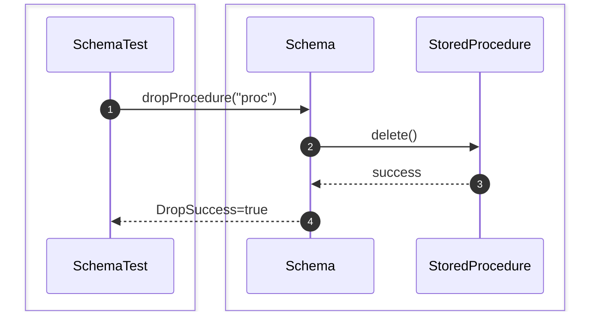
```mermaid
sequenceDiagram
    autonumber

    box #e1f5fe Test Suite
    participant Test as SchemaTest
    end
    box #e8f5e9 Database Objects
    participant Schema as Schema
    participant Procedure as StoredProcedure
    end

    Test->>Schema: dropProcedure("proc")
    Schema->>Procedure: delete()
    Procedure-->>Schema: success
    Schema-->>Test: DropSuccess=true
```

### 8. shouldCreateSequence()
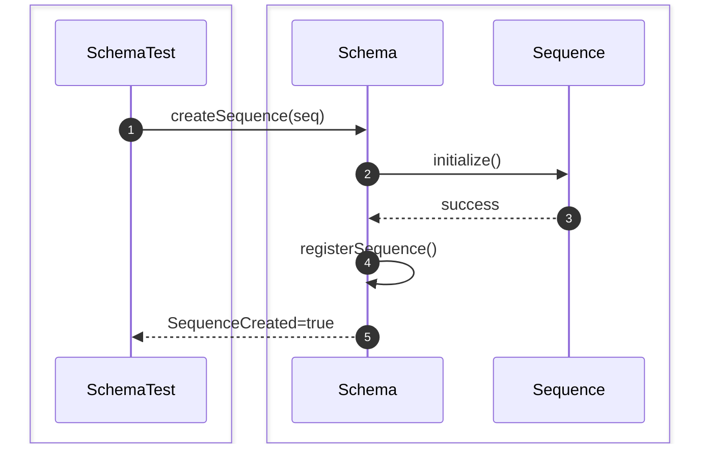
```mermaid
sequenceDiagram
    autonumber

    box #e1f5fe Test Suite
    participant Test as SchemaTest
    end
    box #e8f5e9 Database Objects
    participant Schema as Schema
    participant Seq as Sequence
    end

    Test->>Schema: createSequence(seq)
    Schema->>Seq: initialize()
    Seq-->>Schema: success
    Schema->>Schema: registerSequence()
    Schema-->>Test: SequenceCreated=true
```

### 9. shouldDropSequence()
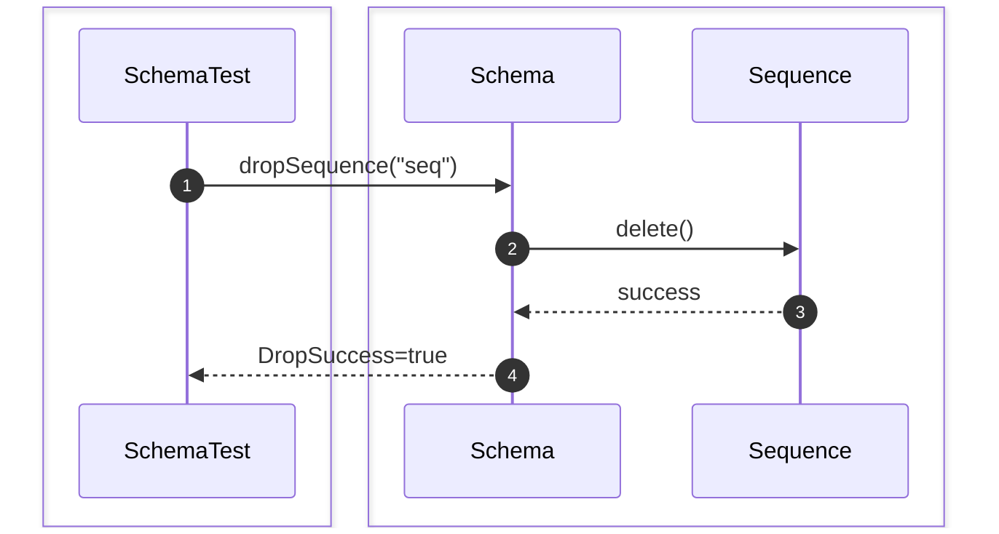
```mermaid
sequenceDiagram
    autonumber

    box #e1f5fe Test Suite
    participant Test as SchemaTest
    end
    box #e8f5e9 Database Objects
    participant Schema as Schema
    participant Seq as Sequence
    end

    Test->>Schema: dropSequence("seq")
    Schema->>Seq: delete()
    Seq-->>Schema: success
    Schema-->>Test: DropSuccess=true
```

### 10. shouldReturnExistingTable()
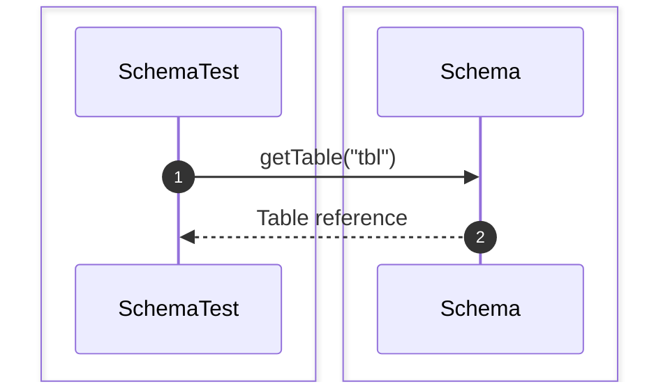
```mermaid
sequenceDiagram
    autonumber

    box #e1f5fe Test Suite
    participant Test as SchemaTest
    end
    box #e8f5e9 Database Objects
    participant Schema as Schema
    end

    Test->>Schema: getTable("tbl")
    Schema-->>Test: Table reference
```

## Table

### 1. shouldInsertRow()
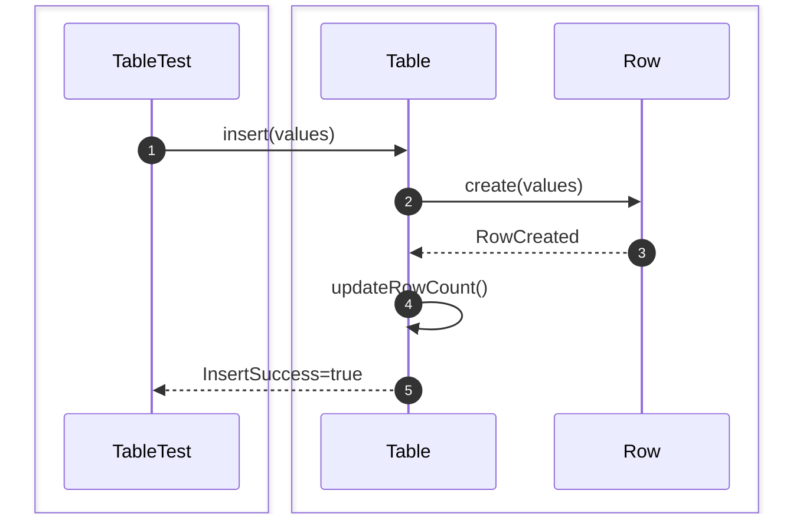
```mermaid
sequenceDiagram
    autonumber

    box #e1f5fe Test Suite
    participant Test as TableTest
    end
    box #e8f5e9 Database Objects
    participant Table as Table
    participant Row as Row
    end

    Test->>Table: insert(values)
    Table->>Row: create(values)
    Row-->>Table: RowCreated
    Table->>Table: updateRowCount()
    Table-->>Test: InsertSuccess=true
```

### 2. shouldUpdateRow()
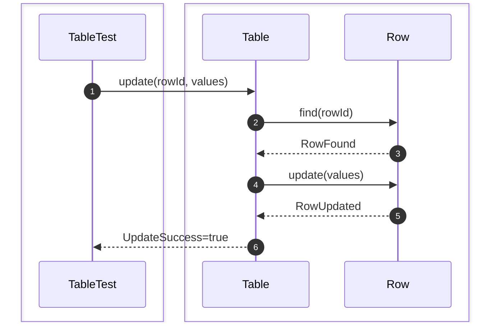
```mermaid
sequenceDiagram
    autonumber

    box #e1f5fe Test Suite
    participant Test as TableTest
    end
    box #e8f5e9 Database Objects
    participant Table as Table
    participant Row as Row
    end

    Test->>Table: update(rowId, values)
    Table->>Row: find(rowId)
    Row-->>Table: RowFound
    Table->>Row: update(values)
    Row-->>Table: RowUpdated
    Table-->>Test: UpdateSuccess=true
```

### 3. shouldDeleteRow()
```mermaid
sequenceDiagram
    autonumber

    box #e1f5fe Test Suite
    participant Test as TableTest
    end
    box #e8f5e9 Database Objects
    participant Table as Table
    participant Row as Row
    end

    Test->>Table: delete(rowId)
    Table->>Row: find(rowId)
    Row-->>Table: RowFound
    Table->>Row: delete()
    Row-->>Table: RowDeleted
    Table->>Table: updateRowCount()
    Table-->>Test: DeleteSuccess=true
```

### 4. shouldTruncateTable()
```mermaid
sequenceDiagram
    autonumber

    box #e1f5fe Test Suite
    participant Test as TableTest
    end
    box #e8f5e9 Database Objects
    participant Table as Table
    end

    Test->>Table: truncate()
    Table->>Table: removeAllRows()
    Table->>Table: resetRowCount()
    Table-->>Test: TruncateSuccess=true
```

### 5. shouldAnalyzeTable()
```mermaid
sequenceDiagram
    autonumber

    box #e1f5fe Test Suite
    participant Test as TableTest
    end
    box #e8f5e9 Database Objects
    participant Table as Table
    end

    Test->>Table: analyze()
    Table->>Table: collectStatistics()
    Table->>Table: updateMetadata()
    Table-->>Test: AnalyzeSuccess=true
```

### 6. shouldIncreaseRowCount()
```mermaid
sequenceDiagram
    autonumber

    box #e1f5fe Test Suite
    participant Test as TableTest
    end
    box #e8f5e9 Database Objects
    participant Table as Table
    end

    Test->>Table: insert(row)
    Table->>Table: rowCount++
    Table-->>Test: RowCountIncreased=true
```

### 7. shouldDecreaseRowCount()
```mermaid
sequenceDiagram
    autonumber

    box #e1f5fe Test Suite
    participant Test as TableTest
    end
    box #e8f5e9 Database Objects
    participant Table as Table
    end

    Test->>Table: delete(rowId)
    Table->>Table: rowCount--
    Table-->>Test: RowCountDecreased=true
```

### 8. shouldRejectDuplicatePrimaryKey()
```mermaid
sequenceDiagram
    autonumber

    box #e1f5fe Test Suite
    participant Test as TableTest
    end
    box #e8f5e9 Database Objects
    participant Table as Table
    participant PK as PrimaryKey
    end

    Test->>Table: insert(row)
    Table->>PK: checkUniqueness()
    PK-->>Table: duplicate found
    Table-->>Test: error: DuplicatePrimaryKey
```

### 9. shouldValidateConstraintsBeforeInsert()
```mermaid
sequenceDiagram
    autonumber

    box #e1f5fe Test Suite
    participant Test as TableTest
    end
    box #e8f5e9 Database Objects
    participant Table as Table
    participant Constraint as Constraint
    end

    Test->>Table: insert(row)
    Table->>Constraint: validate(row)
    Constraint-->>Table: valid
    Table-->>Test: InsertSuccess=true
```

### 10. shouldValidateConstraintsBeforeUpdate()
```mermaid
sequenceDiagram
    autonumber

    box #e1f5fe Test Suite
    participant Test as TableTest
    end
    box #e8f5e9 Database Objects
    participant Table as Table
    participant Constraint as Constraint
    end

    Test->>Table: update(row)
    Table->>Constraint: validate(row)
    Constraint-->>Table: valid
    Table-->>Test: UpdateSuccess=true
```

### 11. shouldReturnInsertedRow()
```mermaid
sequenceDiagram
    autonumber

    box #e1f5fe Test Suite
    participant Test as TableTest
    end
    box #e8f5e9 Database Objects
    participant Table as Table
    end

    Test->>Table: insert(row)
    Table-->>Test: InsertedRow
```

### 12. shouldReturnUpdatedRow()
```mermaid
sequenceDiagram
    autonumber

    box #e1f5fe Test Suite
    participant Test as TableTest
    end
    box #e8f5e9 Database Objects
    participant Table as Table
    end

    Test->>Table: update(row)
    Table-->>Test: UpdatedRow
```

## Column

### 1. shouldCreateColumn()
```mermaid
sequenceDiagram
    autonumber

    box #e1f5fe Test Suite
    participant Test as ColumnTest
    end
    box #e8f5e9 Database Objects
    participant Column as Column
    end

    Test->>Column: create("colName", DataType)
    Column-->>Test: ColumnCreated
```

### 2. shouldValidateColumnDefinition()
```mermaid
sequenceDiagram
    autonumber

    box #e1f5fe Test Suite
    participant Test as ColumnTest
    end
    box #e8f5e9 Database Objects
    participant Column as Column
    participant DataType as DataType
    end

    Test->>Column: validateDefinition()
    Column->>DataType: validate(dataType)
    DataType-->>Column: DataTypeValid
    Column->>Column: validateAttributes()
    Column-->>Test: ValidationPassed=true
```

### 3. shouldRejectInvalidDataType()
```mermaid
sequenceDiagram
    autonumber

    box #e1f5fe Test Suite
    participant Test as ColumnTest
    end
    box #e8f5e9 Database Objects
    participant Column as Column
    participant DataType as DataType
    end

    Test->>Column: validateDefinition()
    Column->>DataType: validate(dataType)
    DataType-->>Column: DataTypeInvalid
    Column-->>Test: error: InvalidDataType
```

### 4. shouldRejectInvalidLength()
```mermaid
sequenceDiagram
    autonumber

    box #e1f5fe Test Suite
    participant Test as ColumnTest
    end
    box #e8f5e9 Database Objects
    participant Column as Column
    end

    Test->>Column: validateDefinition()
    Column->>Column: checkLength()
    Column-->>Test: error: InvalidLength
```

### 5. shouldAcceptNullableColumn()
```mermaid
sequenceDiagram
    autonumber

    box #e1f5fe Test Suite
    participant Test as ColumnTest
    end
    box #e8f5e9 Database Objects
    participant Column as Column
    end

    Test->>Column: setNullable(true)
    Column-->>Test: NullableUpdated
```

### 6. shouldRejectNullForNotNullColumn()
```mermaid
sequenceDiagram
    autonumber

    box #e1f5fe Test Suite
    participant Test as ColumnTest
    end
    box #e8f5e9 Database Objects
    participant Column as Column
    end

    Test->>Column: validateValue(null)
    Column-->>Test: error: NullNotAllowed
```

### 7. shouldUpdateColumnMetadata()
```mermaid
sequenceDiagram
    autonumber

    box #e1f5fe Test Suite
    participant Test as ColumnTest
    end
    box #e8f5e9 Database Objects
    participant Column as Column
    end

    Test->>Column: updateMetadata(metadata)
    Column->>Column: updateAttributes()
    Column->>Column: persistMetadata()
    Column-->>Test: MetadataUpdated=true
```

### 8. shouldChangeDefaultValue()
```mermaid
sequenceDiagram
    autonumber

    box #e1f5fe Test Suite
    participant Test as ColumnTest
    end
    box #e8f5e9 Database Objects
    participant Column as Column
    end

    Test->>Column: setDefaultValue(val)
    Column-->>Test: DefaultValueUpdated
```

## Row

### 1. shouldCreateRow()
```mermaid
sequenceDiagram
    autonumber

    box #e1f5fe Test Suite
    participant Test as RowTest
    end
    box #e8f5e9 Database Objects
    participant Row as Row
    end

    Test->>Row: create(values)
    Row->>Row: initializeValues()
    Row->>Row: assignRowId()
    Row-->>Test: RowCreated=true
```

### 2. shouldUpdateRow()
```mermaid
sequenceDiagram
    autonumber

    box #e1f5fe Test Suite
    participant Test as RowTest
    end
    box #e8f5e9 Database Objects
    participant Row as Row
    end

    Test->>Row: update(values)
    Row->>Row: updateValues()
    Row-->>Test: RowUpdated
```

### 3. shouldDeleteRow()
```mermaid
sequenceDiagram
    autonumber

    box #e1f5fe Test Suite
    participant Test as RowTest
    end
    box #e8f5e9 Database Objects
    participant Row as Row
    end

    Test->>Row: delete()
    Row->>Row: markDeleted()
    Row->>Row: releaseResources()
    Row-->>Test: DeleteSuccess=true
```

### 4. shouldReadRow()
```mermaid
sequenceDiagram
    autonumber

    box #e1f5fe Test Suite
    participant Test as RowTest
    end
    box #e8f5e9 Database Objects
    participant Row as Row
    end

    Test->>Row: read()
    Row-->>Test: rowData
```

### 5. shouldCloneRowVersion()
```mermaid
sequenceDiagram
    autonumber

    box #e1f5fe Test Suite
    participant Test as RowTest
    end
    box #e8f5e9 Database Objects
    participant Row as Row
    end

    Test->>Row: clone()
    Row-->>Test: clonedRow
```

### 6. shouldUpdateRowVersion()
```mermaid
sequenceDiagram
    autonumber

    box #e1f5fe Test Suite
    participant Test as RowTest
    end
    box #e8f5e9 Database Objects
    participant Row as Row
    end

    Test->>Row: updateVersion()
    Row->>Row: incrementVersion()
    Row->>Row: updateTransactionId()
    Row-->>Test: VersionUpdated=true
```

### 7. shouldStoreTransactionId()
```mermaid
sequenceDiagram
    autonumber

    box #e1f5fe Test Suite
    participant Test as RowTest
    end
    box #e8f5e9 Database Objects
    participant Row as Row
    end

    Test->>Row: setTransactionId(txId)
    Row-->>Test: Success
```

### 8. shouldReturnColumnValue()
```mermaid
sequenceDiagram
    autonumber

    box #e1f5fe Test Suite
    participant Test as RowTest
    end
    box #e8f5e9 Database Objects
    participant Row as Row
    end

    Test->>Row: getValue("col")
    Row-->>Test: value
```

### 9. shouldReplaceColumnValue()
```mermaid
sequenceDiagram
    autonumber

    box #e1f5fe Test Suite
    participant Test as RowTest
    end
    box #e8f5e9 Database Objects
    participant Row as Row
    end

    Test->>Row: replaceValue("col", newVal)
    Row-->>Test: Success
```

### 10. shouldMarkRowDeleted()
```mermaid
sequenceDiagram
    autonumber

    box #e1f5fe Test Suite
    participant Test as RowTest
    end
    box #e8f5e9 Database Objects
    participant Row as Row
    end

    Test->>Row: markDeleted()
    Row-->>Test: Success
```

## Constraint

### 1. shouldValidatePrimaryKey()
```mermaid
sequenceDiagram
    autonumber

    box #e1f5fe Test Suite
    participant Test as ConstraintTest
    end
    box #e8f5e9 Database Objects
    participant PK as PrimaryKey
    participant Row as Row
    end

    Test->>PK: validate(row)
    PK->>Row: getPrimaryKeyValue()
    Row-->>PK: primaryKeyValue
    PK->>PK: checkUniqueness()
    PK-->>Test: ValidationPassed=true
```

### 2. shouldRejectDuplicatePrimaryKey()
```mermaid
sequenceDiagram
    autonumber

    box #e1f5fe Test Suite
    participant Test as ConstraintTest
    end
    box #e8f5e9 Database Objects
    participant PK as PrimaryKey
    end

    Test->>PK: validate(row)
    PK->>PK: checkUniqueness()
    PK-->>Test: error: DuplicatePrimaryKey
```

### 3. shouldValidateForeignKey()
```mermaid
sequenceDiagram
    autonumber

    box #e1f5fe Test Suite
    participant Test as ConstraintTest
    end
    box #e8f5e9 Database Objects
    participant FK as ForeignKey
    participant Parent as Table
    participant Row as Row
    end

    Test->>FK: validate(row)
    FK->>Row: getForeignKeyValue()
    Row-->>FK: foreignKeyValue
    FK->>Parent: exists(foreignKeyValue)
    Parent-->>FK: ReferenceFound
    FK-->>Test: ValidationPassed=true
```

### 4. shouldRejectBrokenForeignKey()
```mermaid
sequenceDiagram
    autonumber

    box #e1f5fe Test Suite
    participant Test as ConstraintTest
    end
    box #e8f5e9 Database Objects
    participant FK as ForeignKey
    participant Parent as Table
    end

    Test->>FK: validate(row)
    FK->>Parent: exists(val)
    Parent-->>FK: ReferenceNotFound
    FK-->>Test: error: BrokenForeignKey
```

### 5. shouldValidateUniqueConstraint()
```mermaid
sequenceDiagram
    autonumber

    box #e1f5fe Test Suite
    participant Test as ConstraintTest
    end
    box #e8f5e9 Database Objects
    participant Unique as UniqueConstraint
    participant Row as Row
    end

    Test->>Unique: validate(row)
    Unique->>Row: getColumnValue()
    Row-->>Unique: value
    Unique->>Unique: checkUniqueness()
    Unique-->>Test: ValidationPassed=true
```

### 6. shouldRejectDuplicateUniqueValue()
```mermaid
sequenceDiagram
    autonumber

    box #e1f5fe Test Suite
    participant Test as ConstraintTest
    end
    box #e8f5e9 Database Objects
    participant Unique as UniqueConstraint
    end

    Test->>Unique: validate(row)
    Unique->>Unique: checkUniqueness()
    Unique-->>Test: error: DuplicateUniqueValue
```

### 7. shouldValidateCheckConstraint()
```mermaid
sequenceDiagram
    autonumber

    box #e1f5fe Test Suite
    participant Test as ConstraintTest
    end
    box #e8f5e9 Database Objects
    participant Check as CheckConstraint
    participant Row as Row
    end

    Test->>Check: validate(row)
    Check->>Row: getValues()
    Row-->>Check: values
    Check->>Check: evaluateExpression()
    Check-->>Test: ValidationPassed=true
```

### 8. shouldRejectInvalidCheckConstraint()
```mermaid
sequenceDiagram
    autonumber

    box #e1f5fe Test Suite
    participant Test as ConstraintTest
    end
    box #e8f5e9 Database Objects
    participant Check as CheckConstraint
    end

    Test->>Check: validate(row)
    Check->>Check: evaluateExpression()
    Check-->>Test: error: ExpressionUnsatisfied
```

### 9. shouldRejectInvalidForeignKey()
```mermaid
sequenceDiagram
    autonumber

    box #e1f5fe Test Suite
    participant Test as ConstraintTest
    end
    box #e8f5e9 Database Objects
    participant FK as ForeignKey
    end

    Test->>FK: validate(row)
    FK-->>Test: error: InvalidForeignKey
```

## Index

### 1. shouldInsertKey()
```mermaid
sequenceDiagram
    autonumber

    box #e1f5fe Test Suite
    participant Test as IndexTest
    end
    box #e8f5e9 Database Objects
    participant Index as Index
    end

    Test->>Index: insertKey(key, rowId)
    Index->>Index: updateIndexStructure()
    Index-->>Test: InsertSuccess=true
```

### 2. shouldSearchKey()
```mermaid
sequenceDiagram
    autonumber

    box #e1f5fe Test Suite
    participant Test as IndexTest
    end
    box #e8f5e9 Database Objects
    participant Index as Index
    end

    Test->>Index: search(key)
    Index->>Index: locateKey()
    Index-->>Test: rowId
```

### 3. shouldDeleteKey()
```mermaid
sequenceDiagram
    autonumber

    box #e1f5fe Test Suite
    participant Test as IndexTest
    end
    box #e8f5e9 Database Objects
    participant Index as Index
    end

    Test->>Index: deleteKey(key)
    Index->>Index: removeKey()
    Index-->>Test: DeleteSuccess=true
```

### 4. shouldUpdateKey()
```mermaid
sequenceDiagram
    autonumber

    box #e1f5fe Test Suite
    participant Test as IndexTest
    end
    box #e8f5e9 Database Objects
    participant Index as Index
    end

    Test->>Index: updateKey(oldKey, newKey)
    Index->>Index: removeKey(oldKey)
    Index->>Index: insertKey(newKey)
    Index-->>Test: UpdateSuccess=true
```

### 5. shouldHandleDuplicateKey()
```mermaid
sequenceDiagram
    autonumber

    box #e1f5fe Test Suite
    participant Test as IndexTest
    end
    box #e8f5e9 Database Objects
    participant Index as Index
    end

    Test->>Index: insertKey(duplicateKey)
    Index-->>Test: error: DuplicateKey
```

### 6. shouldRebuildIndex()
```mermaid
sequenceDiagram
    autonumber

    box #e1f5fe Test Suite
    participant Test as IndexTest
    end
    box #e8f5e9 Database Objects
    participant Index as Index
    participant Table as Table
    end

    Test->>Index: rebuild()
    Index->>Table: scanRows()
    Table-->>Index: rows
    Index->>Index: rebuildStructure()
    Index-->>Test: RebuildSuccess=true
```

### 7. shouldReturnOrderedKeys()
```mermaid
sequenceDiagram
    autonumber

    box #e1f5fe Test Suite
    participant Test as IndexTest
    end
    box #e8f5e9 Database Objects
    participant Index as Index
    end

    Test->>Index: getKeys()
    Index-->>Test: sorted keys list
```

### 8. shouldRejectInvalidKey()
```mermaid
sequenceDiagram
    autonumber

    box #e1f5fe Test Suite
    participant Test as IndexTest
    end
    box #e8f5e9 Database Objects
    participant Index as Index
    end

    Test->>Index: insertKey(null)
    Index-->>Test: error: InvalidKey
```

### 9. shouldSplitNode()
```mermaid
sequenceDiagram
    autonumber

    box #e1f5fe Test Suite
    participant Test as IndexTest
    end
    box #e8f5e9 Database Objects
    participant Index as Index
    end

    Test->>Index: splitNode(node)
    Index-->>Test: split completed
```

### 10. shouldMergeNode()
```mermaid
sequenceDiagram
    autonumber

    box #e1f5fe Test Suite
    participant Test as IndexTest
    end
    box #e8f5e9 Database Objects
    participant Index as Index
    end

    Test->>Index: mergeNode(node1, node2)
    Index-->>Test: merge completed
```

## Partition

### 1. shouldPartitionTable()
```mermaid
sequenceDiagram
    autonumber

    box #e1f5fe Test Suite
    participant Test as PartitionTest
    end
    box #e8f5e9 Database Objects
    participant Partition as Partition
    participant Table as Table
    end

    Test->>Partition: partitionTable()
    Partition->>Table: reorganizeRows()
    Table-->>Partition: completed
    Partition-->>Test: PartitionCreated=true
```

### 2. shouldDropPartition()
```mermaid
sequenceDiagram
    autonumber

    box #e1f5fe Test Suite
    participant Test as PartitionTest
    end
    box #e8f5e9 Database Objects
    participant Partition as Partition
    end

    Test->>Partition: dropPartition("p1")
    Partition-->>Test: DropSuccess=true
```

### 3. shouldLocatePartition()
```mermaid
sequenceDiagram
    autonumber

    box #e1f5fe Test Suite
    participant Test as PartitionTest
    end
    box #e8f5e9 Database Objects
    participant Partition as Partition
    end

    Test->>Partition: locatePartition(key)
    Partition->>Partition: searchPartition()
    Partition-->>Test: TargetPartition
```

### 4. shouldSplitPartition()
```mermaid
sequenceDiagram
    autonumber

    box #e1f5fe Test Suite
    participant Test as PartitionTest
    end
    box #e8f5e9 Database Objects
    participant Partition as Partition
    end

    Test->>Partition: splitPartition("p1")
    Partition-->>Test: SplitSuccess=true
```

### 5. shouldMergePartition()
```mermaid
sequenceDiagram
    autonumber

    box #e1f5fe Test Suite
    participant Test as PartitionTest
    end
    box #e8f5e9 Database Objects
    participant Partition as Partition
    end

    Test->>Partition: mergePartitions("p1", "p2")
    Partition-->>Test: MergeSuccess=true
```

### 6. shouldMoveRowBetweenPartitions()
```mermaid
sequenceDiagram
    autonumber

    box #e1f5fe Test Suite
    participant Test as PartitionTest
    end
    box #e8f5e9 Database Objects
    participant Partition as Partition
    end

    Test->>Partition: moveRow(row, "p1", "p2")
    Partition-->>Test: MoveSuccess=true
```

### 7. shouldLocateCorrectPartition()
```mermaid
sequenceDiagram
    autonumber

    box #e1f5fe Test Suite
    participant Test as PartitionTest
    end
    box #e8f5e9 Database Objects
    participant Partition as Partition
    end

    Test->>Partition: locatePartition(key)
    Partition-->>Test: TargetPartition
```

## View

### 1. shouldCreateView()
```mermaid
sequenceDiagram
    autonumber

    box #e1f5fe Test Suite
    participant Test as ViewTest
    end
    box #e8f5e9 Database Objects
    participant View as View
    end

    Test->>View: create(definition)
    View-->>Test: ViewCreated
```

### 2. shouldReadUnderlyingTable()
```mermaid
sequenceDiagram
    autonumber

    box #e1f5fe Test Suite
    participant Test as ViewTest
    end
    box #e8f5e9 Database Objects
    participant View as View
    participant Table as Table
    end

    Test->>View: readUnderlying()
    View->>Table: read()
    Table-->>View: rows
    View-->>Test: rows
```

### 3. shouldValidateViewDefinition()
```mermaid
sequenceDiagram
    autonumber

    box #e1f5fe Test Suite
    participant Test as ViewTest
    end
    box #e8f5e9 Database Objects
    participant View as View
    end

    Test->>View: validate()
    View-->>Test: ValidationPassed=true
```

### 4. shouldExecuteViewQuery()
```mermaid
sequenceDiagram
    autonumber

    box #e1f5fe Test Suite
    participant Test as ViewTest
    end
    box #e8f5e9 Database Objects
    participant View as View
    participant Table as Table
    end

    Test->>View: executeQuery()
    View->>Table: readRows()
    Table-->>View: resultSet
    View-->>Test: QueryResult
```

### 5. shouldRefreshViewDefinition()
```mermaid
sequenceDiagram
    autonumber

    box #e1f5fe Test Suite
    participant Test as ViewTest
    end
    box #e8f5e9 Database Objects
    participant View as View
    end

    Test->>View: refreshDefinition()
    View->>View: reloadDefinition()
    View-->>Test: RefreshSuccess=true
```

### 6. shouldRejectInvalidViewDefinition()
```mermaid
sequenceDiagram
    autonumber

    box #e1f5fe Test Suite
    participant Test as ViewTest
    end
    box #e8f5e9 Database Objects
    participant View as View
    end

    Test->>View: validate()
    View-->>Test: error: InvalidViewDefinition
```

### 7. shouldReturnViewResult()
```mermaid
sequenceDiagram
    autonumber

    box #e1f5fe Test Suite
    participant Test as ViewTest
    end
    box #e8f5e9 Database Objects
    participant View as View
    end

    Test->>View: getResult()
    View-->>Test: Result
```

## Store Procedure

### 1. shouldCreateProcedure()
```mermaid
sequenceDiagram
    autonumber

    box #e1f5fe Test Suite
    participant Test as StoredProcedureTest
    end
    box #e8f5e9 Database Objects
    participant Proc as StoredProcedure
    end

    Test->>Proc: create(definition)
    Proc-->>Test: ProcCreated
```

### 2. shouldExecuteProcedure()
```mermaid
sequenceDiagram
    autonumber

    box #e1f5fe Test Suite
    participant Test as StoredProcedureTest
    end
    box #e8f5e9 Database Objects
    participant Proc as StoredProcedure
    participant Table as Table
    end

    Test->>Proc: execute()
    Proc->>Table: executeSQL()
    Table-->>Proc: execution completed
    Proc-->>Test: ProcedureSuccess=true
```

### 3. shouldPassProcedureParameters()
```mermaid
sequenceDiagram
    autonumber

    box #e1f5fe Test Suite
    participant Test as StoredProcedureTest
    end
    box #e8f5e9 Database Objects
    participant Proc as StoredProcedure
    participant Table as Table
    end

    Test->>Proc: execute(parameters)
    Proc->>Table: executeSQL(parameters)
    Table-->>Proc: execution completed
    Proc-->>Test: ParameterExecutionSuccess=true
```

### 4. shouldReturnProcedureResult()
```mermaid
sequenceDiagram
    autonumber

    box #e1f5fe Test Suite
    participant Test as StoredProcedureTest
    end
    box #e8f5e9 Database Objects
    participant Proc as StoredProcedure
    end

    Test->>Proc: execute()
    Proc-->>Test: result
```

### 5. shouldHandleProcedureException()
```mermaid
sequenceDiagram
    autonumber

    box #e1f5fe Test Suite
    participant Test as StoredProcedureTest
    end
    box #e8f5e9 Database Objects
    participant Proc as StoredProcedure
    end

    Test->>Proc: execute()
    Proc-->>Test: error: ExecutionFailed
```

## Trigger

### 1. shouldCreateTrigger()
```mermaid
sequenceDiagram
    autonumber

    box #e1f5fe Test Suite
    participant Test as TriggerTest
    end
    box #e8f5e9 Database Objects
    participant Trigger as Trigger
    end

    Test->>Trigger: create(definition)
    Trigger-->>Test: TriggerCreated
```

### 2. shouldFireTrigger()
```mermaid
sequenceDiagram
    autonumber

    box #e1f5fe Test Suite
    participant Test as TriggerTest
    end
    box #e8f5e9 Database Objects
    participant Trigger as Trigger
    end

    Test->>Trigger: fire()
    Trigger->>Trigger: evaluateCondition()
    Trigger->>Trigger: executeAction()
    Trigger-->>Test: TriggerExecuted=true
```

### 3. shouldExecuteBeforeInsertTrigger()
```mermaid
sequenceDiagram
    autonumber

    box #e1f5fe Test Suite
    participant Test as TriggerTest
    end
    box #e8f5e9 Database Objects
    participant Trigger as Trigger
    participant Table as Table
    end

    Test->>Trigger: beforeInsert(row)
    Trigger->>Trigger: validateCondition()
    Trigger->>Table: allowInsert()
    Table-->>Trigger: accepted
    Trigger-->>Test: BeforeInsertExecuted=true
```

### 4. shouldExecuteAfterInsertTrigger()
```mermaid
sequenceDiagram
    autonumber

    box #e1f5fe Test Suite
    participant Test as TriggerTest
    end
    box #e8f5e9 Database Objects
    participant Trigger as Trigger
    end

    Test->>Trigger: afterInsert(row)
    Trigger-->>Test: AfterInsertExecuted=true
```

### 5. shouldExecuteBeforeUpdateTrigger()
```mermaid
sequenceDiagram
    autonumber

    box #e1f5fe Test Suite
    participant Test as TriggerTest
    end
    box #e8f5e9 Database Objects
    participant Trigger as Trigger
    end

    Test->>Trigger: beforeUpdate(row)
    Trigger-->>Test: BeforeUpdateExecuted=true
```

### 6. shouldExecuteAfterUpdateTrigger()
```mermaid
sequenceDiagram
    autonumber

    box #e1f5fe Test Suite
    participant Test as TriggerTest
    end
    box #e8f5e9 Database Objects
    participant Table as Table
    participant Trigger as Trigger
    end

    Test->>Table: update(row)
    Table->>Trigger: afterUpdate(row)
    Trigger->>Trigger: executeAction()
    Trigger-->>Table: completed
    Table-->>Test: AfterUpdateExecuted=true
```

### 7. shouldExecuteBeforeDeleteTrigger()
```mermaid
sequenceDiagram
    autonumber

    box #e1f5fe Test Suite
    participant Test as TriggerTest
    end
    box #e8f5e9 Database Objects
    participant Trigger as Trigger
    end

    Test->>Trigger: beforeDelete(row)
    Trigger-->>Test: BeforeDeleteExecuted=true
```

### 8. shouldExecuteAfterDeleteTrigger()
```mermaid
sequenceDiagram
    autonumber

    box #e1f5fe Test Suite
    participant Test as TriggerTest
    end
    box #e8f5e9 Database Objects
    participant Trigger as Trigger
    end

    Test->>Trigger: afterDelete(row)
    Trigger-->>Test: AfterDeleteExecuted=true
```

### 9. shouldCancelOperationWhenTriggerFails()
```mermaid
sequenceDiagram
    autonumber

    box #e1f5fe Test Suite
    participant Test as TriggerTest
    end
    box #e8f5e9 Database Objects
    participant Trigger as Trigger
    end

    Test->>Trigger: beforeInsert(row)
    Trigger->>Trigger: evaluate()
    Trigger-->>Test: error: TriggerFailed
```

## Sequence

### 1. shouldCreateSequence()
```mermaid
sequenceDiagram
    autonumber

    box #e1f5fe Test Suite
    participant Test as SequenceTest
    end
    box #e8f5e9 Database Objects
    participant Seq as Sequence
    end

    Test->>Seq: create(definition)
    Seq-->>Test: SequenceCreated
```

### 2. shouldGenerateNextValue()
```mermaid
sequenceDiagram
    autonumber

    box #e1f5fe Test Suite
    participant Test as SequenceTest
    end
    box #e8f5e9 Database Objects
    participant Seq as Sequence
    end

    Test->>Seq: nextValue()
    Seq->>Seq: increment()
    Seq-->>Test: nextValue
```

### 3. shouldIncrementSequence()
```mermaid
sequenceDiagram
    autonumber

    box #e1f5fe Test Suite
    participant Test as SequenceTest
    end
    box #e8f5e9 Database Objects
    participant Seq as Sequence
    end

    Test->>Seq: increment()
    Seq->>Seq: currentValue++
    Seq-->>Test: IncrementSuccess=true
```

### 4. shouldResetSequence()
```mermaid
sequenceDiagram
    autonumber

    box #e1f5fe Test Suite
    participant Test as SequenceTest
    end
    box #e8f5e9 Database Objects
    participant Seq as Sequence
    end

    Test->>Seq: reset()
    Seq->>Seq: currentValue = startValue
    Seq-->>Test: ResetSuccess=true
```

### 5. shouldRespectStartValue()
```mermaid
sequenceDiagram
    autonumber

    box #e1f5fe Test Suite
    participant Test as SequenceTest
    end
    box #e8f5e9 Database Objects
    participant Seq as Sequence
    end

    Test->>Seq: getStartValue()
    Seq-->>Test: startValue
```

### 6. shouldReturnCurrentValue()
```mermaid
sequenceDiagram
    autonumber

    box #e1f5fe Test Suite
    participant Test as SequenceTest
    end
    box #e8f5e9 Database Objects
    participant Seq as Sequence
    end

    Test->>Seq: currentValue()
    Seq-->>Test: currentValue
```

### 7. shouldRespectIncrementStep()
```mermaid
sequenceDiagram
    autonumber

    box #e1f5fe Test Suite
    participant Test as SequenceTest
    end
    box #e8f5e9 Database Objects
    participant Seq as Sequence
    end

    Test->>Seq: nextValue()
    Seq->>Seq: currentValue += step
    Seq-->>Test: nextValue
```

# Database Object Integration Test

### 1. shouldCreateDatabaseWithSchemaAndTable()
```mermaid
sequenceDiagram
    autonumber

    box #e1f5fe Test Suite
    participant Test as DatabaseObjectsIntegrationTest
    end
    box #e8f5e9 Database Objects
    participant DB as Database
    participant Schema as Schema
    participant Table as Table
    end

    Test->>DB: createDatabase()
    DB->>Schema: createSchema()
    Schema->>Table: createTable()
    Table-->>Schema: created
    Schema-->>DB: schema created
    DB-->>Test: DatabaseReady=true
```

### 2. shouldInsertRowWithConstraints()
```mermaid
sequenceDiagram
    autonumber

    box #e1f5fe Test Suite
    participant Test as DatabaseObjectsIntegrationTest
    end
    box #e8f5e9 Database Objects
    participant Table as Table
    participant Constraint as Constraint
    participant Row as Row
    end

    Test->>Table: insert(row)
    Table->>Constraint: validate(row)
    Constraint-->>Table: valid
    Table->>Row: create()
    Row-->>Table: row stored
    Table-->>Test: InsertSuccess=true
```

### 3. shouldUpdateRowAndRefreshIndex()
```mermaid
sequenceDiagram
    autonumber

    box #e1f5fe Test Suite
    participant Test as DatabaseObjectsIntegrationTest
    end
    box #e8f5e9 Database Objects
    participant Table as Table
    participant Row as Row
    participant Index as Index
    end

    Test->>Table: update(rowId, values)
    Table->>Row: update(values)
    Row-->>Table: row updated
    Table->>Index: updateKey(oldVal, newVal)
    Index-->>Table: index refreshed
    Table-->>Test: UpdateSuccess=true
```

### 4. shouldDeleteRowAndUpdateIndex()
```mermaid
sequenceDiagram
    autonumber

    box #e1f5fe Test Suite
    participant Test as DatabaseObjectsIntegrationTest
    end
    box #e8f5e9 Database Objects
    participant Table as Table
    participant Row as Row
    participant Index as Index
    end

    Test->>Table: delete(rowId)
    Table->>Row: delete()
    Row-->>Table: row deleted
    Table->>Index: deleteKey(key)
    Index-->>Table: key removed
    Table-->>Test: DeleteSuccess=true
```

### 5. shouldUseIndexForQueryExecution()
```mermaid
sequenceDiagram
    autonumber

    box #e1f5fe Test Suite
    participant Test as DatabaseObjectsIntegrationTest
    end
    box #e8f5e9 Database Objects
    participant Table as Table
    participant Constraint as Constraint
    participant Row as Row
    end

    Test->>Table: insert(row)
    Table->>Constraint: validate(row)
    Constraint-->>Table: valid
    Table->>Row: create()
    Row-->>Table: row stored
    Table-->>Test: InsertSuccess=true
```

### 6. shouldExecuteTriggerDuringInsert()
```mermaid
sequenceDiagram
    autonumber

    box #e1f5fe Test Suite
    participant Test as DatabaseObjectsIntegrationTest
    end
    box #e8f5e9 Database Objects
    participant Table as Table
    participant Trigger as Trigger
    participant Row as Row
    end

    Test->>Table: insert(row)
    Table->>Trigger: beforeInsert()
    Trigger-->>Table: approved
    Table->>Row: create()
    Row-->>Table: stored
    Table->>Trigger: afterInsert()
    Trigger-->>Table: completed
    Table-->>Test: InsertCompleted=true
```

### 7. shouldExecuteTriggerDuringUpdate()
```mermaid
sequenceDiagram
    autonumber

    box #e1f5fe Test Suite
    participant Test as DatabaseObjectsIntegrationTest
    end
    box #e8f5e9 Database Objects
    participant Table as Table
    participant Trigger as Trigger
    end

    Test->>Table: update(row)
    Table->>Trigger: beforeUpdate()
    Trigger-->>Table: approved
    Table->>Trigger: afterUpdate()
    Trigger-->>Table: completed
    Table-->>Test: UpdateCompleted=true
```

### 8. shouldExecuteStoredProcedureSuccessfully()
```mermaid
sequenceDiagram
    autonumber

    box #e1f5fe Test Suite
    participant Test as DatabaseObjectsIntegrationTest
    end
    box #e8f5e9 Database Objects
    participant Proc as StoredProcedure
    participant Table as Table
    end

    Test->>Proc: execute()
    Proc->>Table: executeSQL()
    Table-->>Proc: execution completed
    Proc-->>Test: ProcedureSuccess=true
```

### 9. shouldReadDataFromView()
```mermaid
sequenceDiagram
    autonumber

    box #e1f5fe Test Suite
    participant Test as DatabaseObjectsIntegrationTest
    end
    box #e8f5e9 Database Objects
    participant View as View
    participant Table as Table
    end

    Test->>View: executeQuery()
    View->>Table: readRows()
    Table-->>View: result set
    View-->>Test: QueryResult
```

### 10. shouldGenerateSequenceValueForInsert()
```mermaid
sequenceDiagram
    autonumber

    box #e1f5fe Test Suite
    participant Test as DatabaseObjectsIntegrationTest
    end
    box #e8f5e9 Database Objects
    participant Seq as Sequence
    participant Table as Table
    participant Row as Row
    end

    Test->>Seq: nextValue()
    Seq-->>Table: generated id
    Table->>Row: create(id)
    Row-->>Table: stored
    Table-->>Test: InsertSuccess=true
```

### 11. shouldValidateForeignKeyAcrossTables()
```mermaid
sequenceDiagram
    autonumber

    box #e1f5fe Test Suite
    participant Test as DatabaseObjectsIntegrationTest
    end
    box #e8f5e9 Database Objects
    participant FK as ForeignKey
    participant Table as Table
    end

    Test->>FK: validate(row)
    FK->>Table: exists(key)
    Table-->>FK: found
    FK-->>Test: ValidationSuccess=true
```

### 12. shouldRefreshViewAfterTableUpdate()
```mermaid
sequenceDiagram
    autonumber

    box #e1f5fe Test Suite
    participant Test as DatabaseObjectsIntegrationTest
    end
    box #e8f5e9 Database Objects
    participant View as View
    participant Table as Table
    end

    Test->>Table: update(row)
    Table->>View: refresh()
    View-->>Table: refreshed
    Table-->>Test: RefreshSuccess=true
```

